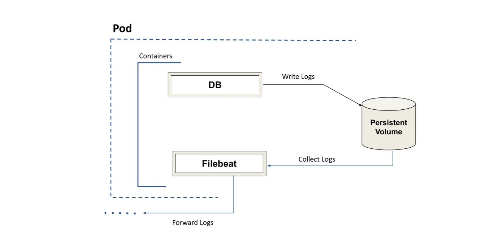

### Add custom containers in KubeDB managed Database

Let's assume you have a [KubeDB](https://kubedb.com/docs/v2022.05.24/welcome/) managed Database deployed in your Kubernetes environment. Now, You want to inject a sidecar container in the database StatefulSet in order to extend and enhance the functionality of existing containers. Currently, KubeDB doesn't have support for custom container insertion yet. We will discuss a workaround to run a custom container along with the managed-containers. 

Suppose, you are running a KubeDB-managed MySQL database, and you need to monitor the general query logs. When you enable the mySQL query logs, it will write those logs in the `var/lib/mysql` directory in `{pod-name}.log` file. In order to export those logs to some remote monitoring solution (such as, Elasticsearch, Logstash, Kafka or Redis)  will need a tool like [Filebeat](https://www.elastic.co/beats/filebeat). Filebeat is used to ship logs and files from devices, cloud, containers and hosts. So, it is required to run Filebeat as a sidecar container along with the KubeDB-managed MySQL database. Here's a quick demonstration on how to accomplish it.

Firstly, We are going to deploy a sample MySQL cluster in demo namespace using the following YAML.

```yaml
apiVersion: kubedb.com/v1alpha2
kind: MySQL
metadata:
  name: mysql-cluster
  namespace: demo
spec:
  replicas: 3
  version: "8.0.29"
  storageType: Durable
  storage:
    storageClassName: "standard"
    accessModes:
    - ReadWriteOnce
    resources:
      requests:
        storage: 1Gi
  terminationPolicy: WipeOut
```

On deployment of the MySQL CR, the operator will create the necessary k8s resources. It will create a [StatefulSet](https://kubernetes.io/docs/concepts/workloads/controllers/statefulset) named `mysql-cluster` as well. The StatefulSet will eventually create three pods named `mysql-cluster-0`, `mysql-cluster-1` and `mysql-cluster-2`. As our aim is to retrieve MySQL query logs, we are going to inject a filebeat container into the operator-generated `mysql-cluster` StatefulSet.

### Prepare the sidecar container

At first, we will prepare a `filebeat.yml` file with required configurations.

```yaml
filebeat.inputs:
  - type: log
    paths:
    - /var/lib/mysql/*.log
output.console:
  pretty: true
```

The MySQL query log directory is mounted in a [Persistent Volume](https://kubernetes.io/docs/concepts/storage/persistent-volumes/)(PV) along with its data. Filebeat is going to fetch the log data from that directory. We are going to configure filebeat to harvest lines from all log files that match the specified glob patterns. MySQL log file names are generated after the DB instance/pod name. Specific log file paths can also be provided as Filebeat input paths.  Use the following command to view all the log files available in `mysql-cluster-0` pod.

```bash
$ kubectl exec -it mysql-cluster-0 -n demo -c mysql -- bash -c "cd /var/lib/mysql && ls | grep *.log"

mysql-quickstart-0.log
```

For this demonstration, we are going to we are going to forward the logs to console. The console output writes events in JSON format to stdout. The `filebeat.yml` file can also be configured to forward the outputs to [Elasticsearch](https://www.elastic.co/guide/en/beats/filebeat/current/elasticsearch-output.html) , [Logstash](https://www.elastic.co/guide/en/beats/filebeat/current/elasticsearch-output.html) , [Kafka](https://www.elastic.co/guide/en/beats/filebeat/current/kafka-output.html), [redis](https://www.elastic.co/guide/en/beats/filebeat/current/redis-output.html) etc. instead of console stdout.

Since we cannot add additional volumes in the KubeDB managed statefulSets, we are going to customize the filebeat docker image with the config file instead.

```dockerfile
FROM elastic/filebeat:7.17.1
COPY filebeat.yml /usr/share/filebeat
USER root
RUN chmod go-w /usr/share/filebeat/filebeat.yml
USER filebeat
```

Now Let's create a Dockerfile in the same directory. The base image will be set to the required filebeat version. For this demo, we are using `Filebeat 7.17.1`.  We are going to override the existing configuration with our `filebeat.yml` file.

The working directory should be structured like this:

```bash
tree .
.
├── Dockerfile
└── filebeat.yml
```

Let's Use the following command to create the docker image and push to your docker repository.

```bash
$ docker build -t repository_name/custom_filebeat:latest .
$ docker push repository_name/custom_filebeat:latest
```
### Patch the sidecar container

The operator generated StatefulSet can be viewed via the following command.

```bash
$ kubectl get sts mysql-cluster -n demo -oyaml
```

In order to add the custom container using the `custom_filebeat` image, let's use a YAML file named `mysql-patch.yaml` using the following spec. The log file is mounted in the persistent volume. We will mount that PV with `readOnly: true` in this new container so that it can access the log files. We will set the `securityContext.runAsUser` to MySQL user ID so that the mysql owned log files can be read by filebeat.

```yaml
spec:
  template:
    spec:
      containers:
      - image: repository_name/custom_filebeat:latest
        name: filebeat
        volumeMounts:
        - mountPath: /var/lib/mysql
          name: data
          readOnly: true
      securityContext:
        runAsUser: 999
```

Finally, Patch this YAML to our existing StatefulSet using the following command.

```bash
$ kubectl patch sts mysql-cluster -n demo --patch-file mysql-patch.yaml
```


Get the `mysql-cluster` StatefulSet YAML to confirm that the changes has been patched. In order to reflect the changes made in the StatefulSet to the Pods, we need to restart them.

### Restart the DB instance/Pods

We can use `MySQLOpsRequest` of type Restart to restart the Pods safely. Let's Apply the following YAML to make an OpsRequest to `mysql-cluster` MySQL database.

```yaml
apiVersion: ops.kubedb.com/v1alpha1
kind: MySQLOpsRequest
metadata:
  name: mysql-cluster-restart
  namespace: demo
spec:
  type: Restart
  databaseRef:
    name: mysql-cluster
```


After the OpsRequest is being successfully executed, the pods are restarted with newly appended sidecar containers. 

### Enable MySQL Query Logs

We are going to enable the general query log in the MySQL database (if already not enabled). 

Login to MySQL DB using the following commands.

```bash
$ kubectl exec -it mysql-cluster-0 -n demo -c mysql -- bash
$ mysql -uroot -p$MYSQL_ROOT_PASSWORD
```

Enable general_log:

```bash
$ mysql> set global general_log=ON;
```

Let's fetch the logs shipped to filebeat console output. The outputs will be generated in json format.

```bash
$ kubectl logs -f -n demo pod/mysql-cluster-0 -c filebeat
```

We will find the query logs in filebeat console output. Sample output:

```json
{
  "@timestamp": "2022-06-24T12:30:16.283Z",
  "@metadata": {
    "beat": "filebeat",
    "type": "_doc",
    "version": "7.17.1"
  },
  "host": {
    "name": "mysql-quickstart-0"
  },
  "agent": {
    "type": "filebeat",
    "version": "7.17.1",
    "hostname": "mysql-quickstart-0",
    "ephemeral_id": "3edf8d82-41dd-4f7c-9eb6-0553ed60195a",
    "id": "b811faf5-99cf-4e61-ac62-a308a0f30f94",
    "name": "mysql-quickstart-0"
  },
  "message": "2022-06-24T12:30:15.266769Z\t 2989 Query\tshow databases",
  "log": {
    "offset": 182138,
    "file": {
      "path": "/var/lib/mysql/mysql-quickstart-0.log"
    }
  },
  "input": {
    "type": "log"
  },
  "ecs": {
    "version": "1.12.0"
  }
}
```


## Support

To speak with us, please leave a message on [our website](https://appscode.com/contact/).

To join public discussions with the KubeDB community, join us in the [Kubernetes Slack team](https://kubernetes.slack.com/messages/C8149MREV/) channel `#kubedb`. To sign up, use our [Slack inviter](http://slack.kubernetes.io/).

To receive product announcements, follow us on [Twitter](https://twitter.com/KubeDB).

If you have found a bug with KubeDB or want to request for new features, please [file an issue](https://github.com/kubedb/project/issues/new).