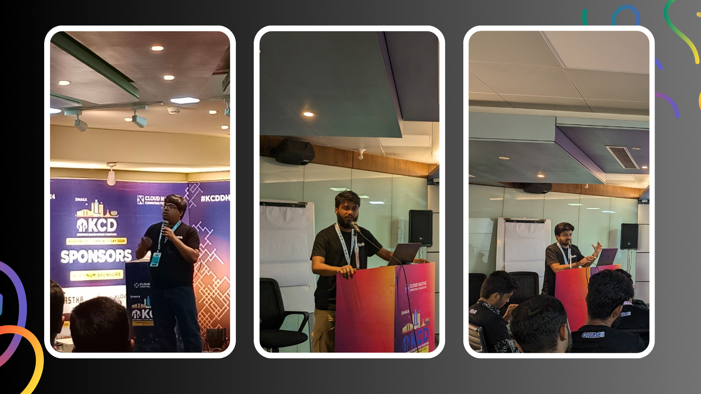

## Overview
The first-ever Kubernetes Community Days Dhaka brought together Kubernetes enthusiasts, developers, and experts from all over Bangladesh to discuss and share insights about Kubernetes and its ecosystem. The event featured keynote speeches, technical sessions, and networking opportunities, creating a vibrant platform for learning and collaboration.

This landmark event marked a significant milestone for the local tech community in Dhaka, providing a unique opportunity to connect with global leaders in the Kubernetes space. It fostered knowledge exchange and showcased innovative solutions, reinforcing Dhaka's position on the global Kubernetes map. For the global community, it was a chance to witness the growing adoption and innovation of Kubernetes in new regions.

We Team AppsCode, a leading player in the Kubernetes ecosystem, participated in the event as an event sponsor. Our participation included showcasing our managed database solution KubeDB, keynote by our Founder and CEO, two insightful talks by our engineers. AppsCode's involvement underscored our commitment to advancing Kubernetes technology and supporting the community.

## AppsCode's Participation

### Booth and Activities
AppsCode's booth was a hub of activity at Kubernetes Community Days Dhaka, attracting a steady stream of attendees eager to learn about KubeDB. The booth featured live demonstrations, interactive Q&A sessions, and hands-on experiences with KubeDB, allowing visitors to see its capabilities in action. 

### Overview of the Keynote by the Founder
Tamal Saha, Founder & CEO of AppsCode, delivered a compelling keynote speech on the Challenges of Managing Stateful Applications in Kubernetes. His presentation delved into the complexities and nuances of managing databases and other stateful applications within the Kubernetes environment.

<iframe width="560" height="315" src="https://www.youtube.com/embed/qY-l2DR9y1I?si=_2q0Y65VwSY24ol_" title="YouTube video player" frameborder="0" allow="accelerometer; autoplay; clipboard-write; encrypted-media; gyroscope; picture-in-picture; web-share" referrerpolicy="strict-origin-when-cross-origin" allowfullscreen></iframe>

#### Key Points Discussed
* Intrinsic challenges of stateful applications in a dynamic Kubernetes environment
* Strategies for maintaining data consistency and reliability
* Best practices for deploying and managing stateful applications

#### Highlights of the Founder’s Insights on Kubernetes and KubeDB
Tamal emphasized the importance of robust solutions like KubeDB in addressing these challenges. He highlighted how KubeDB simplifies the management of stateful applications, ensuring high availability, automated backups, and seamless scaling. His insights reinforced KubeDB's role as an essential tool for any Kubernetes-based infrastructure.

### Summary of the Two Important Talks by AppsCode Engineers
#### Event-Driven Communication with Kafka on Kubernetes by Raihan Khan Raka
Raihan Khan Raka, Senior Software Engineer at AppsCode, presented an engaging talk on event-driven communication using Kafka on Kubernetes. He explored how Kafka, a distributed event streaming platform, can be effectively deployed and managed within a Kubernetes cluster.

<iframe width="560" height="315" src="https://www.youtube.com/embed/iwyk7uyl2i8?si=QRx53IuDPTtfoEGG" title="YouTube video player" frameborder="0" allow="accelerometer; autoplay; clipboard-write; encrypted-media; gyroscope; picture-in-picture; web-share" referrerpolicy="strict-origin-when-cross-origin" allowfullscreen></iframe>

#### Key Takeaways for the Audience
* Practical insights into setting up and managing Kafka on Kubernetes
* Understanding the benefits of event-driven communication in a microservices architecture
* Tips for optimizing Kafka performance and reliability in a Kubernetes environment

#### Dedicated Cluster Management Using Cluster API and Kube-Bind by Rasel Hossain
Rasel Hossain, Software Engineer at AppsCode, delivered a talk on managing dedicated Kubernetes clusters using Cluster API and Kube-Bind. His presentation focused on simplifying cluster lifecycle management and enhancing operational efficiency.

<iframe width="560" height="315" src="https://www.youtube.com/embed/KFHk0K1wRAM?si=9fXZl8S1ZazdOtul" title="YouTube video player" frameborder="0" allow="accelerometer; autoplay; clipboard-write; encrypted-media; gyroscope; picture-in-picture; web-share" referrerpolicy="strict-origin-when-cross-origin" allowfullscreen></iframe>

#### Key Takeaways for the Audience
* Effective strategies for managing cluster lifecycle with Cluster API
* Benefits of using Kube-Bind for dedicated cluster management
* Enhanced techniques for operational efficiency and scalability in multi-cluster environments

## Showcasing KubeDB
During Kubernetes Community Days Dhaka, AppsCode conducted live demonstrations of KubeDB, showcasing its features and real-world applications. Attendees witnessed firsthand how KubeDB simplifies database management and enhances operational efficiency. Specific use cases highlighted included automated failover scenarios, scaling databases in response to traffic spikes, and setting up scheduled backups.

#### Audience Reactions and Feedback
The audience's response to KubeDB was quite positive. Many attendees expressed appreciation for the simplicity and robustness of KubeDB's features. Feedback highlighted the platform's ease of use, particularly in automating complex database operations. Attendees were excited about the potential to integrate KubeDB into their existing Kubernetes workflows, citing its comprehensive support for various databases and the significant reduction in manual management effort as key benefits.

#### Questions and Discussions from Attendees
Throughout the event, attendees actively participated in discussions and posed insightful questions about KubeDB and its capabilities. These discussions covered a wide range of topics, including best practices for database management on Kubernetes, strategies for optimizing performance, and practical use cases for KubeDB in real-world scenarios.

## Community Engagement and Event Highlights
The event featured a diverse lineup of speakers, each sharing valuable insights and expertise on different aspects of Kubernetes. Attendees had the opportunity to learn from industry leaders and practitioners who discussed topics ranging from best practices in Kubernetes deployment to advanced use cases and strategies for optimizing Kubernetes infrastructure.

A highlight of the event was a panel discussion focused on the direction of Kubernetes in Bangladesh. The panel brought together experts and thought leaders from across the country to explore the current state of Kubernetes adoption, challenges faced by local organizations, and opportunities for growth and innovation. 

#### Nationwide Representation and Networking Opportunities
The event drew participants from all corners of the country, providing a unique opportunity for networking and collaboration. To add excitement and engagement to the event, a raffle draw was held for visitors, offering the chance to win exciting prizes. 

## Reflections and Future Directions
Kubernetes Community Days Dhaka was an exceptional gathering of industry leaders, experts, and enthusiasts, all united by a shared passion for Kubernetes and its ecosystem. The event provided a platform for rich discussions, insightful presentations, and valuable networking opportunities. Attendees had the chance to deepen their understanding of Kubernetes, exchange ideas, and forge new connections, making the event a memorable and enriching experience for all involved.
Building on the success of Kubernetes Community Days Dhaka, we are committed to continued participation and contributions to the Kubernetes community. We plan to actively engage in future events, conferences, and meetups, both locally and globally, to share our knowledge, expertise, and experiences with the community. Additionally, we aim to organize workshops, webinars, and training sessions to empower developers and operators with the skills and tools needed to succeed in a Kubernetes-driven world

## The End
Kubernetes Community Days Dhaka was a landmark event that underscored the growing importance and relevance of Kubernetes in the region. For AppsCode and KubeDB, the event was an opportunity to connect with the vibrant Kubernetes community, showcase our latest innovations, and contribute to the collective knowledge and expertise of the ecosystem. The event reaffirmed our commitment to empowering developers and operators with powerful, reliable solutions like KubeDB and furthering the adoption and advancement of Kubernetes technology.
We encourage members of the Kubernetes community to explore KubeDB and discover how it can simplify and streamline database management on Kubernetes. Whether you're running PostgreSQL, MySQL, MongoDB, or other databases, KubeDB provides a comprehensive solution for automating backups, scaling, and more, allowing you to focus on building and deploying applications with confidence. Try KubeDB today and experience the power of simplified database management on Kubernetes.

## Support

To speak with us, please leave a message on [our website](https://appscode.com/contact/).

To receive product announcements, follow us on [X](https://twitter.com/KubeDB).

To watch tutorials of various Production-Grade Kubernetes Tools Subscribe our [YouTube](https://www.youtube.com/c/AppsCodeInc/) channel.

If you have found a bug with KubeDB or want to request for new features, please [file an issue](https://github.com/kubedb/project/issues/new).
