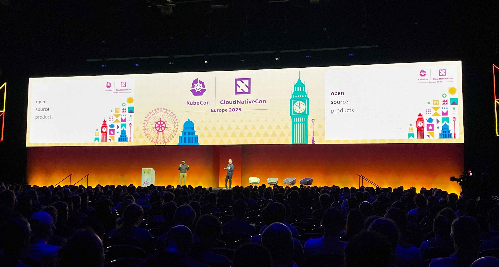

## What We Heard, Shared, and Learned at KubeCon London 2025

There’s always a special vibe at KubeCon—rooms full of sessions, quick whiteboard sketches turning into big ideas, and random hallway chats that stick with you. But this year in London, the energy felt different. It wasn’t just bigger—it was more focused.

With over 12,500 people attending, the event was buzzing. It felt like the Kubernetes community has entered a new stage. Instead of just trying to prove that things can run on Kubernetes, people are now focused on doing it better. Less experimenting, more real-world solutions.

At the AppsCode booth, we noticed a common theme in our conversations: how to run stateful workloads like databases in a world that’s all about scale, security, and AI. Whether it was engineers tackling complex migrations or platform teams looking for better resilience, one thing was clear—databases aren’t just a background task anymore. They’re becoming a key part of how Kubernetes is being used today.

## Kubernetes Is Entering a More Mature Phase
In the early days, KubeCon felt like a big playground—lots of excitement, experiments, and people asking, “Can we run this on Kubernetes?” But this year in London, things felt more serious in a good way.

Now, the main question is “How do we do this the right way?” People are focusing more on best practices, real-world use cases, and making their platforms strong and reliable.

Kubernetes isn’t just for running containers anymore. It’s becoming the main control system for everything—from managing security and compliance to running AI and data-heavy apps. It’s clear that Kubernetes has grown up, and so have the expectations.

## What Everyone’s Talking About

Certain topics kept coming up again and again throughout the event:

* AI and data pipelines: As more companies use AI, they’re looking at Kubernetes to manage those workloads. But AI needs a lot of data, so now people are paying close attention to how data is stored and handled.
* Better internal platforms: Teams want easier, more organized ways for developers to work. They’re building internal tools (platforms) that make it faster and safer to build apps.
* Security and compliance: Protecting workloads is now a top priority. Things like identity, access control, and runtime security were hot topics.
* Managing real data: People are dealing with real databases on Kubernetes now. So they’re asking, “How do we back this up? How do we recover fast if something breaks?”
* Declarative and UI based setups: Many are moving toward a UI based or a "declarative" style—writing down exactly how everything should run, so it's easier to repeat, check, and fix if needed.

All these conversations point to one clear trend: the Kubernetes community is growing up. It’s not just about experimenting anymore—it’s about building systems that are reliable, secure, and ready for production at scale.

From AI to security to stateful workloads, teams are looking for smarter ways to run real-world applications. And that’s exactly where AppsCode comes in—helping organizations tackle these challenges head-on with powerful, Kubernetes-native tools built for the next generation of platforms.

## The AppsCode Booth: Real Conversations, Real Use Cases 
At KubeCon EU 2025, the __AppsCode booth__ was shining with interest—especially around __KubeDB__. We had the opportunity to give over __100+ live demos__ to engineers, platform teams, SREs, and architects, all eager to explore how they could manage databases more easily on Kubernetes.

Our demos highlighted how KubeDB simplifies running production-grade databases like PostgreSQL, MySQL, MongoDB, and others—right inside Kubernetes clusters. What stood out for many visitors was __the fully-featured KubeDB UI__, which gives teams a clear, visual way to manage, monitor, and scale their databases without digging through YAML or CLI commands. From seeing cluster health at a glance to setting up backups and failovers with just a few clicks, the UI experience truly made database operations feel modern and accessible.

We had deep conversations around real-world use cases like:

* Running highly available PostgreSQL clusters across multiple zones

* Setting up scheduled, secure backups to S3 compatible storages

* Managing automated version upgrades with minimal downtime

* Integrating monitoring and alerting directly into their platform stack and many more

## Why Stateful Workloads Are the New Frontier
Kubernetes has evolved. It’s no longer just about deploying stateless web apps—it’s about running real workloads, including stateful ones like databases. And with that shift, __the data layer has become one of the most critical components in modern platforms.__

As more organizations move to cloud-native infrastructure, they’re demanding Kubernetes-native solutions for traditionally complex tasks like:

* Backup and disaster recovery

* Zero-downtime upgrades

* Monitoring performance and availability

* Managing secure access and scaling on demand

This is exactly where __KubeDB shines__. It brings these capabilities to life in a Kubernetes-native way, letting platform teams manage their databases just like any other Kubernetes resource—with __declarative configuration, GitOps integration, and full automation and evem with clickable UI!__

More importantly, KubeDB is designed for resilience and scalability. Whether it’s handling replication across zones, self-healing in case of node failures, or automatically resizing storage, KubeDB makes sure your data is always safe, available, and performant.

As teams move from experimentation to production, they need solutions that don’t just work—they need solutions they can trust at scale. Stateful workloads are the new frontier of Kubernetes, and KubeDB is helping teams cross that frontier with confidence.

## Meeting Customers & Partners: From Email Threads to Handshakes

One of the most rewarding parts of KubeCon EU 2025 was getting to meet many of our existing customers and partners in person. These are people we’ve chatted with over Slack, supported through tickets, or collaborated with on projects—and now we got to finally shake hands, grab a coffee, and talk face-to-face.

We heard stories from teams running KubeDB in production across multiple regions, managing dozens of clusters, and even pushing the limits of AI data infrastructure using our tools. Their feedback was both encouraging and insightful—and it’s helping us shape what’s next on the roadmap.

We also had productive discussions with potential partners looking to integrate KubeDB into their platform offerings, MSPs building Kubernetes-native services, and enterprise teams building long-term data strategies. These connections are what keep our ecosystem thriving—and we’re excited to deepen these collaborations moving forward.

##  A Word from Our Founder & CEO, Tamal Saha

> **"KubeCon EU 2025 was a great conference indeed—it was a clear sign that Kubernetes is ready for the data layer. Teams aren’t just experimenting anymore; they’re running stateful workloads in production and expecting the same level of automation and reliability as they do with stateless apps. KubeDB is here to meet that moment. We’re proud to be building tools that simplify complexity and help teams focus on what matters—shipping great software."**  
> — *Tamal Saha, Founder and CEO of AppsCode*

His words reflect the mission behind KubeDB : make data infrastructure as seamless and resilient as the rest of your Kubernetes stack.

## Wrapping Up: A Heartfelt Thank You
KubeCon + CloudNativeCon Europe 2025 was a rollercoaster of ideas, connections, and cloud-native passion. From the moment the doors opened, the energy was electric—conversations sparked, whiteboards filled up, and the community came alive in a way only KubeCon can deliver.

To the CNCF, our booth visitors, and the entire global Kubernetes community: thank you for making it truly unforgettable. Whether you stopped by to grab a tshirt, got hands-on with a KubeDB demo, asked deep technical questions, or simply shared your own Kubernetes story—we appreciated every moment.

Each interaction reminded us why we do what we do. It's not just about building powerful tools—it's about empowering people to solve real-world challenges with confidence, creativity, and collaboration.

From all of us at AppsCode, thank you, London. We can’t wait to see where the Kubernetes journey takes us next. 💙

## Next Stop: Hong Kong & Tokyo for KubeCon China & Japan 2025!
After an incredible experience at KubeCon Europe 2025, AppsCode is excited to head to Hong Kong for [KubeCon China](https://events.linuxfoundation.org/kubecon-cloudnativecon-china/) and [KubeCon Japan](https://events.linuxfoundation.org/kubecon-cloudnativecon-japan/)! We look forward to connecting with the global Kubernetes community once again, showcasing our latest innovations, and sharing insights on how KubeDB continues to transform database management in cloud-native environments. Stay tuned for more updates as we gear up for another exciting chapter in the KubeCon journey!
If you’re planning to attend, be sure to follow our social media channels and blog for the latest updates on our sessions, events, and exclusive chances to connect with the AppsCode team. Don’t miss out—register for KubeCon Europe 2025 and join the conversation that’s driving the future of cloud-native technology!

## Support

To speak with us, please leave a message on [our website](https://appscode.com/contact/).

To receive product announcements, follow us on [X](https://twitter.com/KubeDB).

To watch tutorials of various Production-Grade Kubernetes Tools Subscribe our [YouTube](https://youtube.com/@appscode) channel.

If you have found a bug with KubeDB or want to request for new features, please [file an issue](https://github.com/kubedb/project/issues/new).
