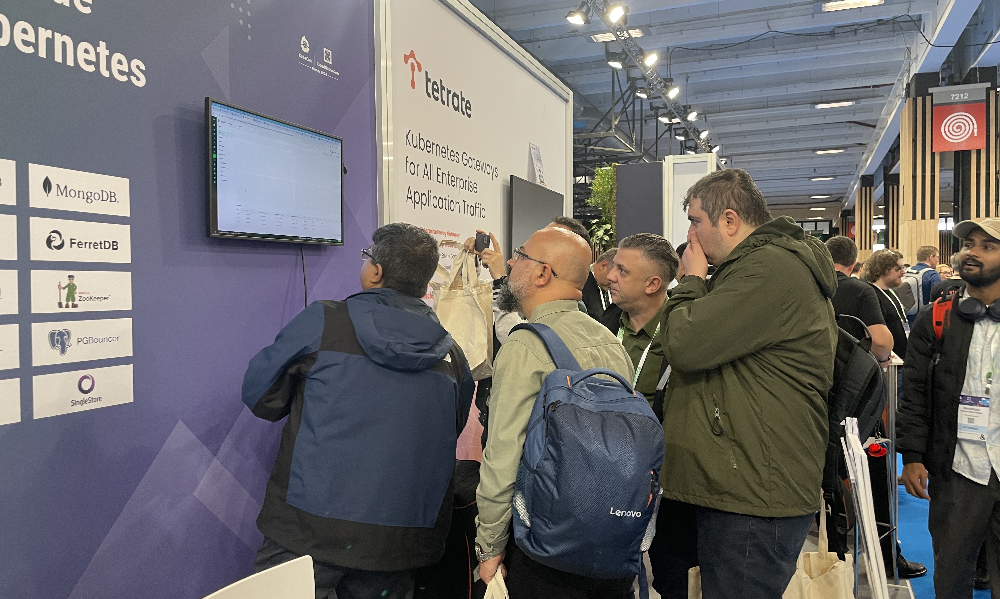
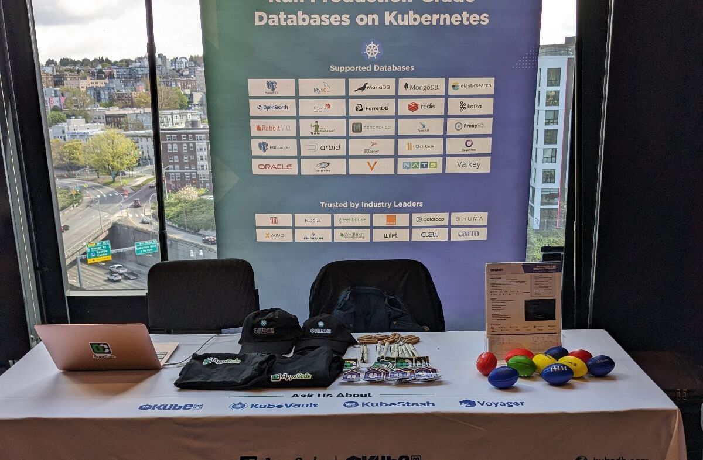
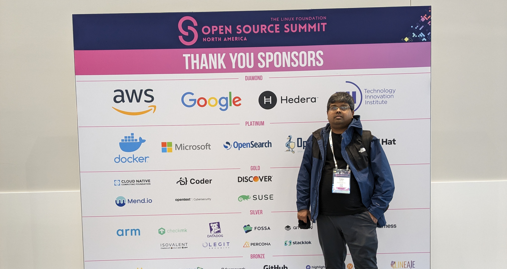
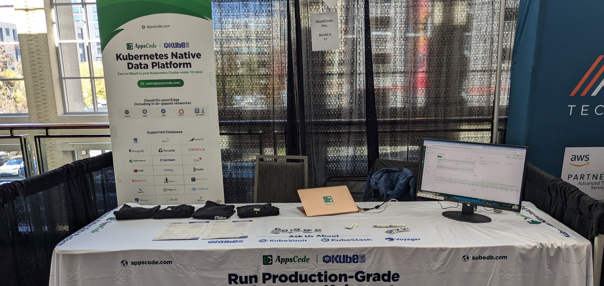
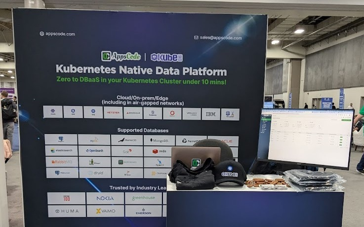

## Overview
2024 has been a transformative year for AppsCode Inc., a journey filled with milestones, innovation, and meaningful global connections. This year, we made our mark at some of the world’s most prestigious Kubernetes and open-source events, showcasing our expertise and passion for simplifying database management through KubeDB, our flagship managed database solution.

From the bustling halls of KubeCon Europe in Paris to the inspiring stages of KubeCon North America in Utah, our journey was about more than just attending events. It was about building relationships, sharing knowledge, and collaborating with a thriving global community of Kubernetes enthusiasts. Your enthusiasm, support, and feedback fueled our determination to push boundaries and elevate the Kubernetes ecosystem.

This blog is a celebration of the remarkable year we’ve had—reflecting on the events that defined 2024, the incredible response to KubeDB, and the road ahead as we prepare for an even more exciting 2025.

## Showcasing KubeDB: The Star of the Show
At the heart of AppsCode’s 2024 journey was KubeDB, our managed database solution designed to simplify and automate database operations in Kubernetes. This year, we demonstrated how KubeDB enables organizations to go from __zero to a fully operational Database-as-a-Service (DBaaS) in under 10 minutes__—a capability that wowed audiences at every event.

### Key Features of KubeDB

Here are the standout features of KubeDB that we showcased:

* Automated Database Provisioning: Spin up databases with minimal effort using Kubernetes-native workflows.
* High Availability: Ensure reliability and fault tolerance with automated failover and replication.
* Backups and Restores: Schedule backups and restore databases effortlessly with built-in tools.
Scalability: Seamlessly scale databases up or down to match application demands.
* Monitoring and Alerts: Gain insights with integrated monitoring, logging, and alerting features.
* Multi-Cloud and On-Prem Support: Flexibility to deploy across any cloud provider or on-premises infrastructure.
* Security and Compliance: Keep your data safe with role-based access controls and encryption.

### Enhancing User Experience with an Interactive UI

In addition to its powerful backend capabilities, KubeDB’s interactive and intuitive user interface was a major highlight this year. We showcased how the UI empowers users to manage databases effortlessly, reducing the learning curve for Kubernetes newcomers and seasoned professionals alike.

Here’s what makes the KubeDB UI exceptional:

* User-Friendly Dashboard: A centralized dashboard providing a comprehensive overview of all managed databases.
* One-Click Operations: Perform complex tasks like provisioning, scaling, and backups with a single click.
* Real-Time Monitoring: Visualize database performance and receive instant alerts to ensure optimal operation.
* Custom Workflows: Set up tailored workflows for specific database needs effortlessly.
* Role-Based Access Control (RBAC): Manage team access securely and efficiently.

Attendees at every event were impressed by how quickly they could navigate the interface and perform critical database operations, reinforcing our mission to make database management accessible, efficient, and intuitive.
By streamlining both backend processes and user interaction, KubeDB empowers businesses to focus on innovation while leaving the complexities of database management to us.

## Events That Defined 2024: A Year of Growth and Connections
The year 2024 was a remarkable chapter for AppsCode, filled with events that brought KubeDB to a global stage and strengthened our ties with the Kubernetes and open-source communities. These gatherings provided us with opportunities to showcase KubeDB’s standout features, while also creating meaningful interactions with industry experts, enthusiasts, and businesses around the world. Here’s a recap of the key events that defined our journey:

#### KubeCon Europe (Paris)
Our 2024 journey began in Paris at KubeCon Europe, one of the most prominent events in the Kubernetes community. This was the ideal platform for introducing KubeDB to a diverse audience, including developers, DevOps engineers, IT leaders, and Kubernetes enthusiasts from around the world. The event attracted thousands of participants, all eager to explore the latest innovations in cloud-native technologies, and we were excited to present KubeDB as a game-changer for database management in Kubernetes environments.

This successful debut at KubeCon Europe set a positive tone for the year ahead, inspiring us to continue innovating and refining KubeDB. The interactions we had, along with the connections we made, fueled our dedication to supporting the Kubernetes ecosystem and ensuring that KubeDB meets the evolving needs of developers and organizations worldwide.

#### Scale21x (CA)
Scale21x was the perfect platform to showcase the power of KubeDB and reinforce its value proposition as an essential tool for managing cloud-native databases in Kubernetes.

At Scale21x, we showcased how KubeDB can play a vital role in helping organizations overcome database scaling challenges. With Kubernetes quickly becoming the backbone of modern infrastructure, scaling applications and databases is more critical than ever. We shared how KubeDB automates essential database management tasks like provisioning, backups, and failovers, making it easier for teams to scale their databases efficiently in a Kubernetes environment. We also demonstrated KubeDB’s ability to manage multiple database engines, including MySQL, PostgreSQL, and MongoDB, all within a single Kubernetes cluster, showcasing the flexibility and power of our solution.

#### Kubernetes Community Day (Dhaka)
KCD Dhaka was a great event for us, being the first-ever Kubernetes Community Day in Bangladesh. The event attracted a vibrant community of developers, engineers, and Kubernetes enthusiasts eager to dive into cloud-native technologies. It was an exciting opportunity to connect with the local tech community and share our expertise on Kubernetes and database management.

Our founder, __Tamal Saha__, delivered the keynote at KCD Dhaka, where he discussed the __Challenges of Managing Stateful Applications in Kubernetes__. His address highlighted the complexities of managing stateful applications, especially databases, in Kubernetes environments and provided valuable insights on overcoming these challenges. Here is the keynote video: 

<iframe width="560" height="315" src="https://www.youtube.com/embed/qY-l2DR9y1I?si=crMNdRr9JNG6_vtf" title="YouTube video player" frameborder="0" allow="accelerometer; autoplay; clipboard-write; encrypted-media; gyroscope; picture-in-picture; web-share" referrerpolicy="strict-origin-when-cross-origin" allowfullscreen></iframe>

During the event, we showcased KubeDB as a solution to these very challenges, demonstrating how it simplifies the management of stateful applications, particularly databases, in Kubernetes. The response was overwhelmingly positive, with many attendees recognizing how KubeDB can help streamline database operations and improve efficiency in cloud-native environments.

#### Open Source Summit (Seattle)
The Open Source Summit in Seattle was a fantastic opportunity to connect with open-source enthusiasts, contributors, and thought leaders from around the world. This event gave us a chance to demonstrate how KubeDB fits into the broader open-source ecosystem and how it simplifies database management within Kubernetes. 

The summit also provided us with valuable insights into the latest trends in open-source technology. Engaging with experts from various domains allowed us to learn about the challenges businesses are facing and how we can continue to improve KubeDB to meet their needs. We left the event with fresh ideas and a stronger commitment to advancing KubeDB as a key player in the open-source world.
#### Container Days (Hamburg)
It was a fantastic opportunity for us to connect with the European Container Technology users.
We demonstrated KubeDB’s ability to automate, scale, and manage databases in Kubernetes environments, sharing success stories of businesses that streamlined their operations using KubeDB. These real-world examples sparked valuable discussions on managing stateful applications in Kubernetes and addressing common challenges.

#### All Things Open (Raleigh)
All Things Open in Raleigh was an incredible event that highlighted how open-source technologies are transforming industries and reshaping the future of software development. 

It provided an exciting platform for us to connect with both current and potential users of KubeDB. At the event, we had the chance to meet with users who had already adopted KubeDB, learning about their experiences and how it had helped them simplify their database operations within Kubernetes. These interactions were invaluable, giving us deeper insights into the real-world impact of KubeDB.
#### KubeCon North America (Utah)
KubeCon North America in Utah was the grand finale of our event-filled year, and it marked a significant moment for AppsCode and KubeDB. As one of the largest and most influential Kubernetes events globally, KubeCon brought together thousands of developers, IT professionals, and cloud-native experts from around the world. The energy at the event was unparalleled, and it provided the perfect stage for us to showcase KubeDB to a wider audience, including Kubernetes adopters, industry leaders, and thought-provoking innovators.

The event was also a unique chance to network and engage with Kubernetes enthusiasts, partners, and experts. The discussions and feedback we received were invaluable, as they helped us better understand the needs and challenges faced by Kubernetes users when it comes to managing databases. This allowed us to refine and improve KubeDB, making sure it aligns even more closely with the demands of the cloud-native community.

KubeCon North America was not just about showcasing KubeDB; it was an opportunity to be part of the global Kubernetes conversation, share knowledge, and learn from the best in the industry. The connections we made, the conversations we had, and the insights we gained from this event will continue to inspire and guide us as we work to make KubeDB the go-to solution for managing databases in Kubernetes. It was a fitting conclusion to a remarkable year, and we can’t wait to return in the future with even more innovations to share!

## Milestones and Achievements
2024 has been a year of significant milestones for KubeDB. The widespread adoption and enthusiasm for KubeDB have been truly inspiring. Across all the events we attended and the countless conversations with users, we witnessed the growing impact KubeDB has had in simplifying database management within Kubernetes environments. From startups to large enterprises, more and more organizations have embraced KubeDB as their go-to solution for cloud-native database operations. This increasing adoption has validated our mission and reinforced our commitment to continuous innovation.

Along with the growing user base, 2024 has been a year of technological advancements for KubeDB. We introduced new features that enhanced performance, scalability, and ease of use, making KubeDB an even more powerful tool for managing stateful applications in Kubernetes. Additionally, we forged key partnerships with industry leaders, which has further strengthened KubeDB’s position in the cloud-native ecosystem.

One of the most rewarding aspects of this year has been the invaluable feedback from our users. Your insights and suggestions have shaped the direction of KubeDB, helping us prioritize the most needed features and improvements. This user-driven development ensures that KubeDB not only meets the current demands of the Kubernetes community but is also prepared for the future.

## Gratitude to the Community
We owe a huge thank you to our users, partners, and collaborators who have supported us throughout 2024. Your engagement, enthusiasm, and trust in KubeDB have been the driving force behind our success. Whether it’s been through participating in events, providing feedback, or simply using KubeDB to simplify your database management, we are incredibly grateful for your contribution to our journey.

The importance of feedback cannot be overstated. Every conversation, every suggestion, and every success story we’ve heard has been crucial in guiding us toward making KubeDB a better product. We are committed to listening and responding to your needs as we continue to innovate and evolve.

## Looking Ahead to 2025
As 2024 comes to a close, we’re already looking ahead to 2025, and we couldn’t be more excited about what’s to come. We have some incredible new features and updates lined up for KubeDB that will make it even more powerful, intuitive, and user-friendly. We can’t wait to share these with you in the upcoming months.

Along with these updates, we are also preparing for another year of exciting events, collaborations, and innovations. Stay tuned as we continue to build on the momentum of 2024 and take KubeDB to new heights in 2025.

## Support

To speak with us, please leave a message on [our website](https://appscode.com/contact/).

To receive product announcements, follow us on [X](https://twitter.com/KubeDB).

To watch tutorials of various Production-Grade Kubernetes Tools Subscribe our [YouTube](https://youtube.com/@appscode) channel.

If you have found a bug with KubeDB or want to request for new features, please [file an issue](https://github.com/kubedb/project/issues/new).
