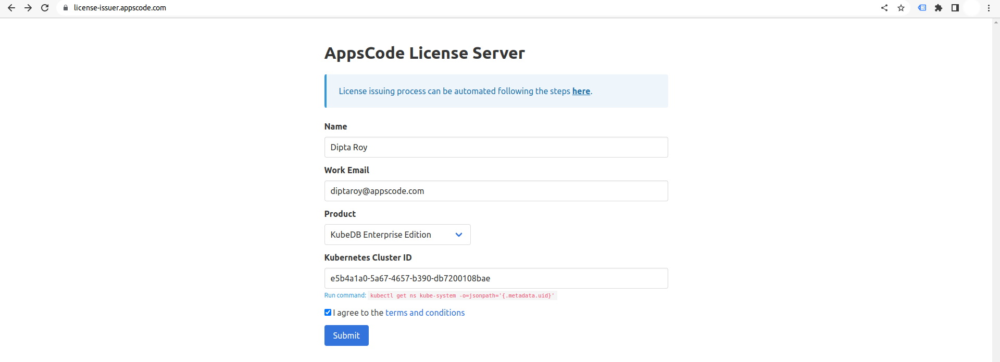
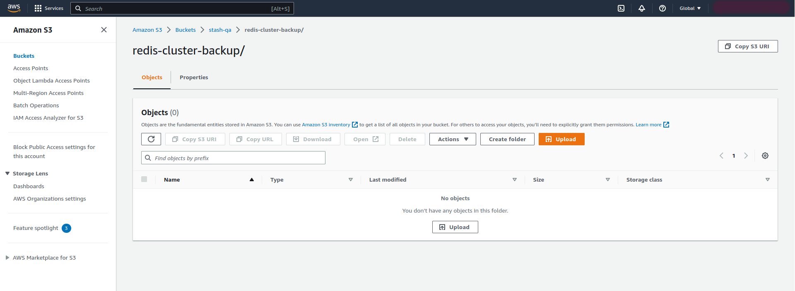
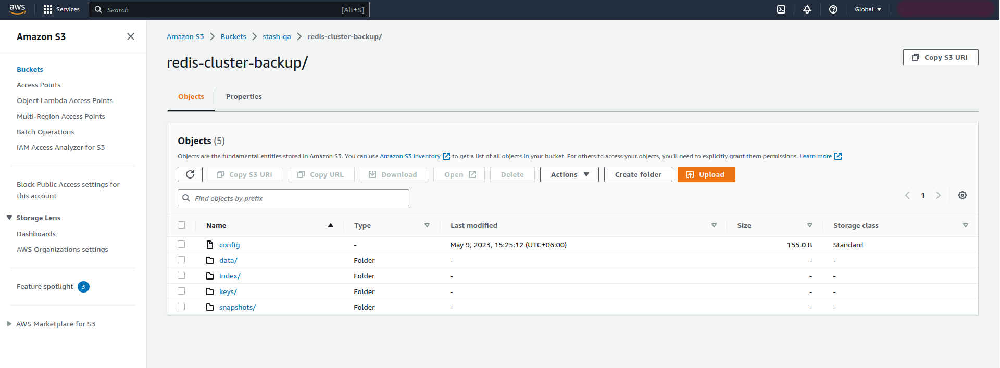

## Overview

KubeDB is the Kubernetes Native Database Management Solution which simplifies and automates routine database tasks such as Provisioning, Monitoring, Upgrading, Patching, Scaling, Volume Expansion, Backup, Recovery, Failure detection, and Repair for various popular databases on private and public clouds. The databases that KubeDB supports are MySQL, MongoDB, MariaDB, Elasticsearch, Kafka, Redis, PostgreSQL, ProxySQL, Percona XtraDB, Memcached and PgBouncer. You can find the guides to all the supported databases in [KubeDB](https://kubedb.com/). In this tutorial we will Backup and Restore Redis Cluster in Amazon Elastic Kubernetes Service (Amazon EKS). We will cover the following steps:

1) Install KubeDB
2) Deploy Redis Clustered Database
3) Install Stash
4) Backup Redis Cluster Using Stash
5) Recover Redis Cluster Using Stash

### Get Cluster ID

We need the cluster ID to get the KubeDB License. To get cluster ID, we can run the following command:

```bash
$ kubectl get ns kube-system -o jsonpath='{.metadata.uid}'
e5b4a1a0-5a67-4657-b390-db7200108bae
```

### Get License

Go to [Appscode License Server](https://license-issuer.appscode.com/) to get the license.txt file. For this tutorial we will use KubeDB Enterprise Edition.



### Install KubeDB

We will use helm to install KubeDB. Please install helm [here](https://helm.sh/docs/intro/install/) if it is not already installed.
Now, let's install `KubeDB`.

```bash
$ helm repo add appscode https://charts.appscode.com/stable/
$ helm repo update

$ helm search repo appscode/kubedb
NAME                              	CHART VERSION	APP VERSION	DESCRIPTION                                       
appscode/kubedb                   	v2023.04.10  	v2023.04.10	KubeDB by AppsCode - Production ready databases...
appscode/kubedb-autoscaler        	v0.18.0      	v0.18.1    	KubeDB Autoscaler by AppsCode - Autoscale KubeD...
appscode/kubedb-catalog           	v2023.04.10  	v2023.04.10	KubeDB Catalog by AppsCode - Catalog for databa...
appscode/kubedb-community         	v0.24.2      	v0.24.2    	KubeDB Community by AppsCode - Community featur...
appscode/kubedb-crds              	v2023.04.10  	v2023.04.10	KubeDB Custom Resource Definitions                
appscode/kubedb-dashboard         	v0.9.0       	v0.9.1     	KubeDB Dashboard by AppsCode                      
appscode/kubedb-enterprise        	v0.11.2      	v0.11.2    	KubeDB Enterprise by AppsCode - Enterprise feat...
appscode/kubedb-grafana-dashboards	v2023.04.10  	v2023.04.10	A Helm chart for kubedb-grafana-dashboards by A...
appscode/kubedb-metrics           	v2023.04.10  	v2023.04.10	KubeDB State Metrics                              
appscode/kubedb-one               	v2023.04.10  	v2023.04.10	KubeDB and Stash by AppsCode - Production ready...
appscode/kubedb-ops-manager       	v0.20.0      	v0.20.1    	KubeDB Ops Manager by AppsCode - Enterprise fea...
appscode/kubedb-opscenter         	v2023.04.10  	v2023.04.10	KubeDB Opscenter by AppsCode                      
appscode/kubedb-provisioner       	v0.33.0      	v0.33.1    	KubeDB Provisioner by AppsCode - Community feat...
appscode/kubedb-schema-manager    	v0.9.0       	v0.9.1     	KubeDB Schema Manager by AppsCode                 
appscode/kubedb-ui                	v2023.03.23  	0.3.28     	A Helm chart for Kubernetes                       
appscode/kubedb-ui-server         	v2021.12.21  	v2021.12.21	A Helm chart for kubedb-ui-server by AppsCode     
appscode/kubedb-webhook-server    	v0.9.0       	v0.9.1     	KubeDB Webhook Server by AppsCode 

# Install KubeDB Enterprise operator chart
$ helm install kubedb appscode/kubedb \
  --version v2023.04.10 \
  --namespace kubedb --create-namespace \
  --set kubedb-provisioner.enabled=true \
  --set kubedb-ops-manager.enabled=true \
  --set kubedb-autoscaler.enabled=true \
  --set kubedb-dashboard.enabled=true \
  --set kubedb-schema-manager.enabled=true \
  --set-file global.license=/path/to/the/license.txt
```

Let's verify the installation:

```bash
$ watch kubectl get pods --all-namespaces -l "app.kubernetes.io/instance=kubedb"
NAMESPACE   NAME                                            READY   STATUS    RESTARTS   AGE
kubedb      kubedb-kubedb-autoscaler-6c6997cdfd-szzdr       1/1     Running   0          2m
kubedb      kubedb-kubedb-dashboard-5675d74c5c-6bhj4        1/1     Running   0          2m
kubedb      kubedb-kubedb-ops-manager-68987fcc47-dqrvf      1/1     Running   0          2m
kubedb      kubedb-kubedb-provisioner-6b59db468d-kdzqw      1/1     Running   0          2m
kubedb      kubedb-kubedb-schema-manager-59689bf49d-ppthk   1/1     Running   0          2m
kubedb      kubedb-kubedb-webhook-server-75bf6cf447-rvt4s   1/1     Running   0          2m
```

We can list the CRD Groups that have been registered by the operator by running the following command:

```bash
$ kubectl get crd -l app.kubernetes.io/name=kubedb
NAME                                              CREATED AT
elasticsearchautoscalers.autoscaling.kubedb.com   2023-05-09T08:13:18Z
elasticsearchdashboards.dashboard.kubedb.com      2023-05-09T08:13:18Z
elasticsearches.kubedb.com                        2023-05-09T08:13:15Z
elasticsearchopsrequests.ops.kubedb.com           2023-05-09T08:13:15Z
elasticsearchversions.catalog.kubedb.com          2023-05-09T08:10:50Z
etcds.kubedb.com                                  2023-05-09T08:13:22Z
etcdversions.catalog.kubedb.com                   2023-05-09T08:10:51Z
kafkas.kubedb.com                                 2023-05-09T08:13:31Z
kafkaversions.catalog.kubedb.com                  2023-05-09T08:10:51Z
mariadbautoscalers.autoscaling.kubedb.com         2023-05-09T08:13:18Z
mariadbdatabases.schema.kubedb.com                2023-05-09T08:13:20Z
mariadbopsrequests.ops.kubedb.com                 2023-05-09T08:13:37Z
mariadbs.kubedb.com                               2023-05-09T08:13:21Z
mariadbversions.catalog.kubedb.com                2023-05-09T08:10:51Z
memcacheds.kubedb.com                             2023-05-09T08:13:23Z
memcachedversions.catalog.kubedb.com              2023-05-09T08:10:52Z
mongodbautoscalers.autoscaling.kubedb.com         2023-05-09T08:13:18Z
mongodbdatabases.schema.kubedb.com                2023-05-09T08:13:17Z
mongodbopsrequests.ops.kubedb.com                 2023-05-09T08:13:19Z
mongodbs.kubedb.com                               2023-05-09T08:13:19Z
mongodbversions.catalog.kubedb.com                2023-05-09T08:10:52Z
mysqlautoscalers.autoscaling.kubedb.com           2023-05-09T08:13:19Z
mysqldatabases.schema.kubedb.com                  2023-05-09T08:13:16Z
mysqlopsrequests.ops.kubedb.com                   2023-05-09T08:13:33Z
mysqls.kubedb.com                                 2023-05-09T08:13:17Z
mysqlversions.catalog.kubedb.com                  2023-05-09T08:10:52Z
perconaxtradbautoscalers.autoscaling.kubedb.com   2023-05-09T08:13:19Z
perconaxtradbopsrequests.ops.kubedb.com           2023-05-09T08:13:50Z
perconaxtradbs.kubedb.com                         2023-05-09T08:13:29Z
perconaxtradbversions.catalog.kubedb.com          2023-05-09T08:10:53Z
pgbouncers.kubedb.com                             2023-05-09T08:13:29Z
pgbouncerversions.catalog.kubedb.com              2023-05-09T08:10:53Z
postgresautoscalers.autoscaling.kubedb.com        2023-05-09T08:13:19Z
postgresdatabases.schema.kubedb.com               2023-05-09T08:13:19Z
postgreses.kubedb.com                             2023-05-09T08:13:20Z
postgresopsrequests.ops.kubedb.com                2023-05-09T08:13:43Z
postgresversions.catalog.kubedb.com               2023-05-09T08:10:53Z
proxysqlautoscalers.autoscaling.kubedb.com        2023-05-09T08:13:19Z
proxysqlopsrequests.ops.kubedb.com                2023-05-09T08:13:47Z
proxysqls.kubedb.com                              2023-05-09T08:13:30Z
proxysqlversions.catalog.kubedb.com               2023-05-09T08:10:54Z
publishers.postgres.kubedb.com                    2023-05-09T08:14:00Z
redisautoscalers.autoscaling.kubedb.com           2023-05-09T08:13:20Z
redises.kubedb.com                                2023-05-09T08:13:30Z
redisopsrequests.ops.kubedb.com                   2023-05-09T08:13:40Z
redissentinelautoscalers.autoscaling.kubedb.com   2023-05-09T08:13:20Z
redissentinelopsrequests.ops.kubedb.com           2023-05-09T08:13:53Z
redissentinels.kubedb.com                         2023-05-09T08:13:31Z
redisversions.catalog.kubedb.com                  2023-05-09T08:10:54Z
subscribers.postgres.kubedb.com                   2023-05-09T08:14:03Z
```

## Deploy Redis Clustered Database

Now we are going to Install Redis using KubeDB.
First, let's create a Namespace in which we will deploy the database.

```bash
$ kubectl create namespace demo
namespace/demo created
```

Here is the yaml of the Redis CRO we are going to use:

```yaml
apiVersion: kubedb.com/v1alpha2
kind: Redis
metadata:
  name: redis-cluster
  namespace: demo
spec:
  version: 6.2.5
  mode: Cluster
  cluster:
    master: 3
    replicas: 1 
  storageType: Durable
  storage:
    resources:
      requests:
        storage: "1Gi"
    storageClassName: "gp2"
    accessModes:
    - ReadWriteOnce
  terminationPolicy: WipeOut
```

Let's save this yaml configuration into `redis-cluster.yaml` 
Then create the above Redis CRO

```bash
$ kubectl apply -f redis-cluster.yaml
redis.kubedb.com/redis-cluster created
```
In this yaml,
* `spec.version` field specifies the version of Redis. Here, we are using Redis `version 7.0.10`. You can list the KubeDB supported versions of Redis by running `$ kubectl get redisversions` command.
* Another field to notice is the `spec.storageType` field. This can be `Durable` or `Ephemeral` depending on the requirements of the database to be persistent or not.
* Lastly, the `spec.terminationPolicy` field is *Wipeout* means that the database will be deleted without restrictions. It can also be "Halt", "Delete" and "DoNotTerminate". Learn More about these [HERE](https://kubedb.com/docs/latest/guides/redis/concepts/redis/#specterminationpolicy).

Once these are handled correctly and the Redis object is deployed, you will see that the following are created:

```bash
$ kubectl get all -n demo
NAME                         READY   STATUS    RESTARTS   AGE
pod/redis-cluster-shard0-0   1/1     Running   0          3m
pod/redis-cluster-shard0-1   1/1     Running   0          3m
pod/redis-cluster-shard1-0   1/1     Running   0          3m
pod/redis-cluster-shard1-1   1/1     Running   0          3m
pod/redis-cluster-shard2-0   1/1     Running   0          3m
pod/redis-cluster-shard2-1   1/1     Running   0          3m

NAME                         TYPE        CLUSTER-IP      EXTERNAL-IP   PORT(S)    AGE
service/redis-cluster        ClusterIP   10.100.124.82   <none>        6379/TCP   4m
service/redis-cluster-pods   ClusterIP   None            <none>        6379/TCP   4m

NAME                                    READY   AGE
statefulset.apps/redis-cluster-shard0   2/2     4m
statefulset.apps/redis-cluster-shard1   2/2     4m
statefulset.apps/redis-cluster-shard2   2/2     4m

NAME                                               TYPE               VERSION   AGE
appbinding.appcatalog.appscode.com/redis-cluster   kubedb.com/redis   7.0.10    4m

NAME                             VERSION   STATUS   AGE
redis.kubedb.com/redis-cluster   7.0.10    Ready    4m
```
Let’s check if the database is ready to use,

```bash
$ kubectl get redis -n demo
NAME            VERSION   STATUS   AGE
redis-cluster   7.0.10    Ready    4m
```
> We have successfully deployed Redis in AWS. Now we can exec into the container to use the database.

### Accessing Database Through CLI

To access the database through CLI, we have to get the credentials to access. Let’s export the credentials as environment variable to our current shell :

#### Export the Credentials

KubeDB will create Secret and Service for the database `redis-cluster` that we have deployed. Let’s check them by following command,

```bash
$ kubectl get secret -n demo -l=app.kubernetes.io/instance=redis-cluster
NAME                   TYPE                       DATA   AGE
redis-cluster-auth     kubernetes.io/basic-auth   2      5m
redis-cluster-config   Opaque                     1      5m

$ kubectl get service -n demo -l=app.kubernetes.io/instance=redis-cluster
NAME                 TYPE        CLUSTER-IP      EXTERNAL-IP   PORT(S)    AGE
redis-cluster        ClusterIP   10.100.124.82   <none>        6379/TCP   5m
redis-cluster-pods   ClusterIP   None            <none>        6379/TCP   5m
```
Now, we are going to use `PASSWORD` to authenticate and insert some sample data.
First, let’s export the `PASSWORD` as environment variables to make further commands re-usable.

```bash
$ export PASSWORD=$(kubectl get secrets -n demo redis-cluster-auth -o jsonpath='{.data.\password}' | base64 -d)
```

#### Insert Sample Data

In this section, we are going to login into our Redis database pod and insert some sample data. 

```bash
$ kubectl exec -it -n demo redis-cluster-shard0-0 -- redis-cli -c -a $PASSWORD

127.0.0.1:6379> set Product1 KubeDB
-> Redirected to slot [15299] located at 192.168.50.164:6379
OK
192.168.50.164:6379> set Product2 Stash
-> Redirected to slot [2976] located at 192.168.86.70:6379
OK
192.168.86.70:6379> get Product1
-> Redirected to slot [15299] located at 192.168.50.164:6379
"KubeDB"
192.168.50.164:6379> get Product2
-> Redirected to slot [2976] located at 192.168.86.70:6379
"Stash"
192.168.86.70:6379> exit
```

> We’ve successfully inserted some sample data to our database. More information about Run & Manage Redis on Kubernetes can be found in [Redis Kubernetes.](https://kubedb.com/kubernetes/databases/run-and-manage-redis-on-kubernetes/)


## Backup Redis Cluster Using Stash

Here, we are going to use Stash to backup the database we deployed before.

### Install Stash

Kubedb Enterprise License works for Stash too.
So, we will use the Enterprise license that we have already obtained.

```bash
$ helm install stash appscode/stash \
  --version v2023.04.30 \
  --namespace stash --create-namespace \
  --set features.enterprise=true \
  --set-file global.license=/path/to/the/license.txt
```

Let's verify the installation:

```bash
$ kubectl get pods --all-namespaces -l app.kubernetes.io/name=stash-enterprise
NAMESPACE   NAME                                      READY   STATUS    RESTARTS   AGE
stash       stash-stash-enterprise-7d497448b6-q4mhq   2/2     Running   0          2m
```

Now, to confirm CRD groups have been registered by the operator, run the following command:

```bash
$ kubectl get crd -l app.kubernetes.io/name=stash
NAME                                      CREATED AT
backupbatches.stash.appscode.com          2023-05-09T09:13:34Z
backupblueprints.stash.appscode.com       2023-05-09T09:13:34Z
backupconfigurations.stash.appscode.com   2023-05-09T09:13:33Z
backupsessions.stash.appscode.com         2023-05-09T09:13:33Z
functions.stash.appscode.com              2023-05-09T09:11:48Z
repositories.stash.appscode.com           2023-05-09T08:13:23Z
restorebatches.stash.appscode.com         2023-05-09T09:13:35Z
restoresessions.stash.appscode.com        2023-05-09T08:13:23Z
tasks.stash.appscode.com                  2023-05-09T09:11:49Z
```


### Prepare Backend

Stash supports various backends for storing data snapshots. It can be a cloud storage like GCS bucket, AWS S3, Azure Blob Storage etc. or a Kubernetes native resources like HostPath, PersistentVolumeClaim etc. or NFS.

For this tutorial we are going to use AWS S3 storage. You can find other setups in [Stash Docs](https://stash.run/docs/latest/guides/backends/overview/).



At first we need to create a secret so that we can access the AWS S3 storage bucket. We can do that by the following code:

```bash
$ echo -n 'changeit' > RESTIC_PASSWORD
$ echo -n '<your-aws-access-key-id-here>' > AWS_ACCESS_KEY_ID
$ echo -n '<your-aws-secret-access-key-here>' > AWS_SECRET_ACCESS_KEY
$ kubectl create secret generic -n demo s3-secret \
    --from-file=./RESTIC_PASSWORD \
    --from-file=./AWS_ACCESS_KEY_ID \
    --from-file=./AWS_SECRET_ACCESS_KEY
secret/s3-secret created
```

### Create Repository

```yaml
apiVersion: stash.appscode.com/v1alpha1
kind: Repository
metadata:
  name: s3-repo
  namespace: demo
spec:
  backend:
    s3:
      endpoint: s3.amazonaws.com
      bucket: stash-qa
      region: us-east-1
      prefix: /redis-cluster-backup
    storageSecretName: s3-secret
```

This repository CRO specifies the `s3-secret` we created before and stores the name and path to the AWS storage bucket. It also specifies the location to the container where we want to backup our database.
> Here, My bucket name is `stash-qa`. Don't forget to change `spec.backend.s3.bucket` to your bucket name and For `S3`, use `s3.amazonaws.com` as endpoint.

Lets create this repository,

```bash
$ kubectl apply -f s3-repo.yaml
repository.stash.appscode.com/s3-repo created
```

### Create BackupConfiguration

Now, we need to create a `BackupConfiguration` file that specifies what to backup, where to backup and when to backup.

```yaml
apiVersion: stash.appscode.com/v1beta1
kind: BackupConfiguration
metadata:
  name: redis-cluster-backup
  namespace: demo
spec:
  schedule: "*/5 * * * *"
  repository:
    name: s3-repo
  target:
    ref:
      apiVersion: appcatalog.appscode.com/v1alpha1
      kind: AppBinding
      name: redis-cluster
  retentionPolicy:
    name: keep-last-5
    keepLast: 5
    prune: true
```
Create this `BackupConfiguration` by following command,

```bash
$ kubectl apply -f redis-cluster-backup.yaml
backupconfiguration.stash.appscode.com/redis-backup created
```

* `BackupConfiguration` creates a cronjob that backs up the specified database (`spec.target`) every 5 minutes.
* `spec.repository` contains the secret we created before called `s3-secret`.
* `spec.target.ref` contains the reference to the appbinding that we want to backup.
* `spec.schedule` specifies that we want to backup the database at 5 minutes interval.
* `spec.retentionPolicy` specifies the policy to follow for cleaning old snapshots. 
* To learn more about `AppBinding`, click here [AppBinding](https://kubedb.com/docs/latest/guides/redis/concepts/appbinding/). 
So, after 5 minutes we can see the following status:

```bash
$ kubectl get backupsession -n demo
NAME                              INVOKER-TYPE          INVOKER-NAME           PHASE       DURATION   AGE
redis-cluster-backup-1683624302   BackupConfiguration   redis-cluster-backup   Succeeded   15s        105s

$ kubectl get repository -n demo
NAME      INTEGRITY   SIZE    SNAPSHOT-COUNT   LAST-SUCCESSFUL-BACKUP   AGE
s3-repo   true        471 B   1                2m17s                    4m12s
```

Now if we check our Amazon S3 bucket, we can see that the backup has been successful.



> **If you have reached here, CONGRATULATIONS!! :confetti_ball: :confetti_ball: :confetti_ball: You have successfully backed up Redis Database using Stash.** If you had any problem during the backup process, you can reach out to us via [EMAIL](mailto:support@appscode.com?subject=Stash%20Backup%20Failed%20in%20AWS).

## Recover Redis Using Stash

Let's think of a scenario in which the database has been accidentally deleted or there was an error in the database causing it to crash.

#### Temporarily pause backup

At first, let’s stop taking any further backup of the database so that no backup runs after we delete the sample data. We are going to pause the `BackupConfiguration` object. Stash will stop taking any further backup when the `BackupConfiguration` is paused.

```bash
$ kubectl patch backupconfiguration -n demo redis-cluster-backup --type="merge" --patch='{"spec": {"paused": true}}'
backupconfiguration.stash.appscode.com/redis-cluster-backup patched
```

Now, we are going to delete those data to simulate accidental database deletion.

```bash
$ kubectl exec -it -n demo redis-cluster-shard0-0 -- redis-cli -c -a $PASSWORD

127.0.0.1:6379> get Product1
-> Redirected to slot [15299] located at 192.168.50.164:6379
"KubeDB"
192.168.50.164:6379> get Product2
-> Redirected to slot [2976] located at 192.168.86.70:6379
"Stash"
192.168.86.70:6379> del Product1
-> Redirected to slot [15299] located at 192.168.50.164:6379
(integer) 1
192.168.50.164:6379> del Product2
-> Redirected to slot [2976] located at 192.168.86.70:6379
(integer) 1
192.168.86.70:6379> get Product1
-> Redirected to slot [15299] located at 192.168.50.164:6379
(nil)
192.168.50.164:6379> get Product2
-> Redirected to slot [2976] located at 192.168.86.70:6379
(nil)
192.168.86.70:6379> exit
```

### Create a RestoreSession

Below, is the contents of YAML file of the `RestoreSession` object that we are going to create.

```yaml
apiVersion: stash.appscode.com/v1beta1
kind: RestoreSession
metadata:
  name: redis-cluster-restore
  namespace: demo
spec:
  repository:
    name: s3-repo
  target:
    ref:
      apiVersion: appcatalog.appscode.com/v1alpha1
      kind: AppBinding
      name: redis-cluster
  rules:
    - snapshots: [latest]
```

Now, let's create `RestoreSession` that will initiate restoring from the cloud.

```bash
$ kubectl apply -f redis-cluster-restore.yaml
restoresession.stash.appscode.com/redis-restore created
```

This `RestoreSession` specifies where the data will be restored.
Once this is applied, a `RestoreSession` will be created. Once it has succeeded, the database has been successfully recovered as you can see below:

```bash
$ kubectl get restoresession -n demo
NAME                    REPOSITORY   PHASE       DURATION   AGE
redis-cluster-restore   s3-repo      Succeeded   7s         51s
```

Now, let's check whether the data has been correctly restored:

```bash
$ kubectl exec -it -n demo redis-cluster-shard0-0 -- redis-cli -c -a $PASSWORD

127.0.0.1:6379> get Product1
-> Redirected to slot [15299] located at 192.168.50.164:6379
"KubeDB"
192.168.50.164:6379> get Product2
-> Redirected to slot [2976] located at 192.168.86.70:6379
"Stash"
192.168.86.70:6379> exit

```

> You can see the data has been restored. The recovery of Redis cluster has been successful. If you faced any difficulties in the recovery process, you can reach out to us through [EMAIL](mailto:support@appscode.com?subject=Stash%20Recovery%20Failed%20in%20AWS).

We have made an in depth video on Redis Sentinel Ops Requests - Day 2 Lifecycle Management for Redis Sentinel Using KubeDB. You can have a look into the video below:

<iframe width="560" height="315" src="https://www.youtube.com/embed/LToGVt1-D50" title="YouTube video player" frameborder="0" allow="accelerometer; autoplay; clipboard-write; encrypted-media; gyroscope; picture-in-picture" allowfullscreen></iframe>

## Support

To speak with us, please leave a message on [our website](https://appscode.com/contact/).

To receive product announcements, follow us on [Twitter](https://twitter.com/KubeDB).

To watch tutorials of various Production-Grade Kubernetes Tools Subscribe our [YouTube](https://www.youtube.com/c/AppsCodeInc/) channel.

More about [Redis in Kubernetes](https://kubedb.com/kubernetes/databases/run-and-manage-redis-on-kubernetes/)

If you have found a bug with KubeDB or want to request for new features, please [file an issue](https://github.com/kubedb/project/issues/new).