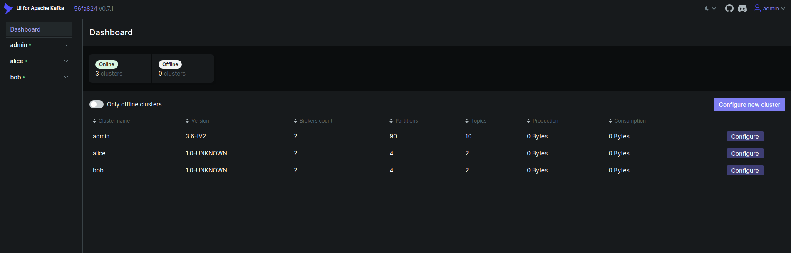
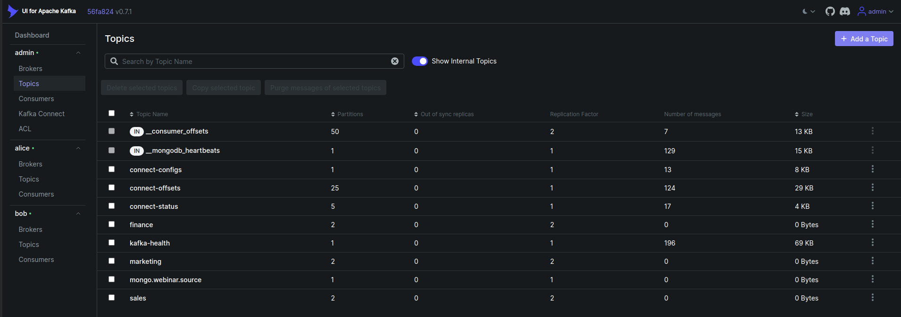
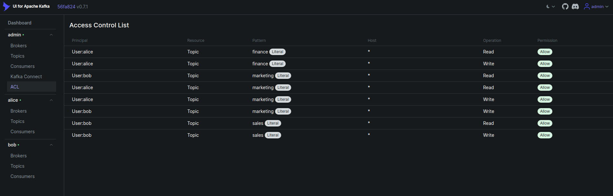
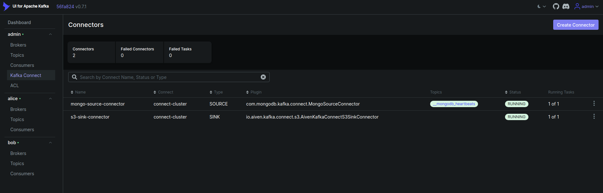
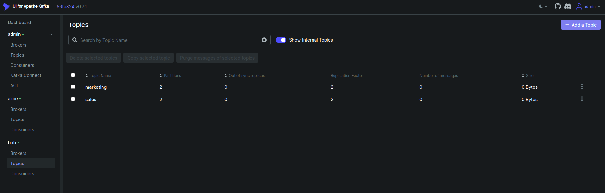

## Overview

Apache Kafka is a powerful-distributed event streaming platform. Kafka itself provides a command-line interface (CLI) and APIs for interacting with Kafka topics, producers, and consumers. Kafka's command-line interface (CLI) and APIs can be complex and difficult to use like creating and configuring topics, managing partitions etc. It's harder to get real-time updates about the state of your Kafka cluster. You would need to continuously run commands or scripts to get this information. Here, Kafka UI simplifies the management and monitoring of Kafka clusters. It is also possible to create topics, produce or consume messages from the UI. 

You can also manage Kafka Connect Clusters and Connectors from the UI. Kafka Connect Cluster is a framework for building connectors to integrate Kafka with other systems. It makes it simple to quickly define connectors that move large collections of data in and out of Kafka. Kafka Connect can ingest entire databases or collect metrics from all your application servers into Kafka topics, making the data available for stream processing with low latency.

User management in Kafka is a necessity for maintaining a secure, efficient, and compliant data processing environment. It allows you to control who can access your Kafka resources, what they can do with them, and track their activity. With Kafka ACLs (Access Control Lists), you can specify which operations (read, write, create, delete) a user can perform on a specific resource (topic, consumer group, cluster). This helps prevent unauthorized actions on your Kafka resources. For example, an ACL might say that `User:alice` can send messages to a certain topic, while `User:bob` can only read messages from that topic. So, Kafka's ACLs help manage and restrict what different users or applications are allowed to do with the brokers in the system, ensuring that only the right people can perform specific actions. It is possible to manage Kafka Users and list ACLs from Kafka UI.

Overall, a Kafka UI simplifies the management and monitoring of Kafka clusters, making it easier for developers, administrators, and operators to work with Kafka. It provides a visual representation of the Kafka ecosystem, allowing you to perform administrative tasks, monitor performance, and troubleshoot issues more efficiently.

There are a few open source Kafka UI. We are using `Provectus UI for Apache Kafka` in this blog. It simplifies the management and monitoring of multiple Kafka clusters. It provides a user-friendly interface to manage Kafka clusters, topics, Kafka Connect Clusters and ACLs etc. It has lots of features like,
* `Configuration wizard` — configure your Kafka clusters right in the UI
* `Multi-Cluster Management` — monitor and manage all your clusters in one place
* `Performance Monitoring with Metrics Dashboard` — track key Kafka metrics with a lightweight dashboard
* `View Kafka Brokers` — view topic and partition assignments, controller status
* `View Kafka Topics` — view partition count, replication status, and custom configuration
* `View Consumer Groups` — view per-partition parked offsets, combined and per-partition lag
* `Browse Messages` — browse messages with JSON, plain text, and Avro encoding
* `Dynamic Topic Configuration` — create and configure new topics with dynamic configuration
* `Configurable Authentification` — secure your installation with optional Github/Gitlab/Google OAuth 2.0
* `Kafka Connector Management` — manage Kafka Connect clusters and connectors etc.
## Workflow

In this tutorial, We will cover the following steps:

1) Configure Kafka ACL and Kafka User
2) Install UI for Apache Kafka
3) Kafka User Management in Kafka UI

## Add ACL and Users using Reconfigure KafkaOpsRequest
Let's assume a Kafka cluster `kafka-prod` is already deployed using KubeDB. We have deployed Kafka cluster with 2 brokers and 2 controllers. In our previous webinar, we have deployed Kafka Connect Cluster `connect-cluster` and Connectors(`mongo-source`, `s3-sink`). You can find the webinar [here](https://youtu.be/21BN-uRsMzs?feature=shared), to get the details of deploying Kafka Connect Cluster and Connectors.

Now reconfigure Kafka adding `ACL`, Users(`alice`, `bob`) and a superuser `admin` with KafkaOpsRequest.
At first, we will create `broker.properties` and `controller.properties` file containing required configuration settings.
```bash
$ cat broker.properties
listener.name.broker.plain.sasl.jaas.config=org.apache.kafka.common.security.plain.PlainLoginModule required username="admin" password="KAFKA_PASSWORD" user_admin="KAFKA_PASSWORD" user_alice="alice-password" user_bob="bob-password";
authorizer.class.name=org.apache.kafka.metadata.authorizer.StandardAuthorizer
super.users=User:admin
```
```bash
$ cat controller.properties
authorizer.class.name=org.apache.kafka.metadata.authorizer.StandardAuthorizer
super.users=User:admin
```
Now, we will create secret containing `broker.properties` and `controller.properties` file. 
```bash
$ kubectl create secret generic acl-user-config --from-file=./broker.properties  --from-file=./controller.properties -n demo
```
Now, we will use this secret to reconfigure Kafka with acl and two more users using KafkaOpsRequest CR. 
YAML is given below,

```yaml
apiVersion: ops.kubedb.com/v1alpha1
kind: KafkaOpsRequest
metadata:
  name: kafka-acl 
  namespace: demo
spec:
  type: Reconfigure
  databaseRef:
    name: kafka-prod
  configuration:
    configSecret:
      name: acl-user-config
```
Here,

* `spec.databaseRef.name` specifies that we are reconfiguring `kafka-prod` cluster.
* `spec.type` specifies that we are performing Reconfigure on our Kafka Cluster.
* `spec.configuration.configSecret.name` specifies the name of the secret.

Lets save this yaml in a file `kafka-acl.yaml` and apply it using kubectl.
```bash
$ kubectl apply -f kafka-acl.yaml
```
Let’s wait for KafkaOpsRequest to be Successful. Run the following command to watch KafkaOpsRequest CR,
```bash
$ kubectl get kafkaopsrequest --all-namespaces
NAMESPACE   NAME             TYPE          STATUS     AGE
demo        kafka-acl      Reconfigure   Successful   2m23s
```
Now, Kafka has been reconfigured with ACL and two more users.

## Create Topics
In this section, we will now exec into one of the kafka brokers in interactive mode and create topics using `kafka-topics.sh` script.
```bash
$ kubectl exec -it -n demo  kafka-prod-0 -- bash

kafka@kafka-prod-0:~$ kafka-topics.sh --create  --bootstrap-server localhost:9092 --command-config $HOME/config/clientauth.properties --topic finance --partitions 2 --replication-factor 2
Created topic finance.

kafka@kafka-prod-0:~$ kafka-topics.sh --create  --bootstrap-server localhost:9092 --command-config $HOME/config/clientauth.properties --topic sales --partitions 2 --replication-factor 2
Created topic sales.

kafka@kafka-prod-0:~$ kafka-topics.sh --create  --bootstrap-server localhost:9092 --command-config $HOME/config/clientauth.properties --topic marketing --partitions 2 --replication-factor 2
Created topic marketing.
```
## Add Kafka ACL Rules
In this section, we will add ACL rules to restrict access to topics for different users. 
We will add ACL rules to:
* Allow `admin` to perform all operations on all topics.
* Allow `alice` to read and write messages from `finance` and `marketing` topics.
* Allow `bob` to read and write messages from `sales` and `marketing` topics.

Exec one of the kafka broker and use the following commands to add ACL rules to the Kafka cluster using `kafka-acls.sh` script.
```bash
$ kubectl exec -it -n demo kafka-prod-0 -- bash

kafka@kafka-prod-0:~$ kafka-acls.sh --bootstrap-server localhost:9092 --command-config $HOME/config/clientauth.properties --add --allow-principal User:alice --operation read --operation write --topic finance
Adding ACLs for resource `ResourcePattern(resourceType=TOPIC, name=finance, patternType=LITERAL)`: 
 	(principal=User:alice, host=*, operation=WRITE, permissionType=ALLOW)
	(principal=User:alice, host=*, operation=READ, permissionType=ALLOW)
	
kafka@kafka-prod-0:~$ kafka-acls.sh --bootstrap-server localhost:9092 --command-config $HOME/config/clientauth.properties --add --allow-principal User:alice  --operation read --operation write --topic marketing
Adding ACLs for resource `ResourcePattern(resourceType=TOPIC, name=marketing, patternType=LITERAL)`: 
 	(principal=User:alice, host=*, operation=WRITE, permissionType=ALLOW)
	(principal=User:alice, host=*, operation=READ, permissionType=ALLOW) 
    
kafka@kafka-prod-0:~$ kafka-acls.sh --bootstrap-server localhost:9092 --command-config $HOME/config/clientauth.properties --add --allow-principal User:bob --operation read --operation write --topic sales
Adding ACLs for resource `ResourcePattern(resourceType=TOPIC, name=sales, patternType=LITERAL)`: 
 	(principal=User:bob, host=*, operation=WRITE, permissionType=ALLOW)
	(principal=User:bob, host=*, operation=READ, permissionType=ALLOW)
    
kafka@kafka-prod-0:~$ kafka-acls.sh --bootstrap-server localhost:9092 --command-config $HOME/config/clientauth.properties --add --allow-principal User:bob --operation read --operation write --topic marketing
Adding ACLs for resource `ResourcePattern(resourceType=TOPIC, name=marketing, patternType=LITERAL)`: 
 	(principal=User:bob, host=*, operation=WRITE, permissionType=ALLOW)
	(principal=User:bob, host=*, operation=READ, permissionType=ALLOW) 

Current ACLs for resource `ResourcePattern(resourceType=TOPIC, name=marketing, patternType=LITERAL)`: 
 	(principal=User:alice, host=*, operation=READ, permissionType=ALLOW)
	(principal=User:alice, host=*, operation=WRITE, permissionType=ALLOW) 

```

## Install Kafka UI
In this section, we will install `Provectus UI for Apache Kafka`. 
UI can be deployed by simple helm command. First you need to make a `values.yaml` file. It is used to configure the necessary Kafka and Kafka Connect Cluster configuration like bootstrap-server, user credentials etc. for Kafka UI.

We need `admin` user password to configure `kafka` and `connect` user password to configure `kafka-connect` cluster. You will find the passwords from the secrets by following the below commands.

```bash
$ kubectl get secrets -n demo kafka-prod-admin-cred -o jsonpath='{.data.\password}' | base64 -d
9NyB_).r9mk1XVCa

$ kubectl get secrets -n demo connect-cluster-connect-cred -o jsonpath='{.data.\password}' | base64 -d
DNY!mWfLCs6R(kXH
```
`values.yaml` for our configuration is given below,

```yaml
yamlApplicationConfig:
  kafka:
    clusters:
      - name: admin
        bootstrapServers:  kafka-prod-broker-0.kafka-prod-pods.demo.svc.cluster.local:9092,kafka-prod-broker-1.kafka-prod-pods.demo.svc.cluster.local:9092
        properties:
          security.protocol: SASL_PLAINTEXT
          sasl.mechanism: PLAIN
          sasl.jaas.config: org.apache.kafka.common.security.plain.PlainLoginModule required username="admin" password="9NyB_).r9mk1XVCa";
        kafkaConnect:
          - name: connect-cluster
            address: http://connect-cluster.demo.svc.cluster.local:8083
            username: connect
            password: DNY!mWfLCs6R(kXH
      - name: alice
        bootstrapServers:  kafka-prod-broker-0.kafka-prod-pods.demo.svc.cluster.local:9092,kafka-prod-broker-1.kafka-prod-pods.demo.svc.cluster.local:9092
        properties:
          security.protocol: SASL_PLAINTEXT
          sasl.mechanism: PLAIN
          sasl.jaas.config: org.apache.kafka.common.security.plain.PlainLoginModule required username="alice" password="alice-password";
      - name: bob
        bootstrapServers:  kafka-prod-broker-0.kafka-prod-pods.demo.svc.cluster.local:9092,kafka-prod-broker-1.kafka-prod-pods.demo.svc.cluster.local:9092
        properties:
          security.protocol: SASL_PLAINTEXT
          sasl.mechanism: PLAIN
          sasl.jaas.config: org.apache.kafka.common.security.plain.PlainLoginModule required username="bob" password="bob-password";
  auth:
    type: LOGIN_FORM
  spring:
    security:
      user:
        name: admin
        password: admin
env:
  - name: "DYNAMIC_CONFIG_ENABLED"
    value: "true"
```
Here,

* `yamlApplicationConfig.kafka.clusters` is the list of Kafka Clusters and its configuration properties.
* `yamlApplicationConfig.kafka.clusters.kafkaConnect`: is the Kafka Connect Cluster and its configuration
* `yamlApplicationConfig.Auth` is the kafka-ui authentication type and its credentials.
* `Env` is the necessary environment variables, here we have enabled `DYNAMIC_CONFIG_ENABLED` to `true`. Configuration can be changed dynamically using UI.

Now, we will install Kafka UI using helm.
```bash
$ helm repo add kafka-ui https://provectus.github.io/kafka-ui-charts
$ helm install kafka-ui kafka-ui/kafka-ui -f values.yaml -n demo
```
A deployment and pod will be created. Check the resource using this command:
```bash
$ kubectl get deploy,pods -l "app.kubernetes.io/name=kafka-ui,app.kubernetes.io/instance=kafka-ui" -n demo
```

## Access Kafka UI
Now, let’s port-forward the deployment to the port 8080 to the local machine. 
```bash
$ kubectl port-forward -n demo deploy/kafka-ui 8080:8080
```
Now the kafka-ui is accessible at http://localhost:8080.

We can see list of Brokers, Topics, Connectors, ACLs etc. Also, we can produce and consume messages from the UI to Kafka topics. 

## Kafka User Management in Kafka UI

In this section, we will see how to manage Kafka Users in Kafka UI. 
Earlier in this blog, we have added two users `alice`, `bob` and ACL rules for those users. In this UI configuration, we have also added these two users. If we open topics from different users, we can see specific users only can access specific topics from UI as per ACL.

For the first time, Use `admin:admin` to login to the Kafka UI as we have configured `admin` user in the `values.yaml` file. After login, you will see the Kafka UI dashboard like below,



From the Kafka UI, click on the `topics` from the `admin` user cluster. You will see the list of all topics in the cluster like below,



Now, click on the `ACLs` tab. You will see the list of all ACLs in the cluster like below that we have added using `kafka-acls.sh` script earlier.



Now, click on the `Kafka Connect` from the user `admin` cluster. You will see the list of all connectors in the cluster like below as we have added using Kafka Connect Cluster.,



Now, click on the `topics` from the user `alice` cluster. You will see the list of specific topics in the cluster like below that `alice` has access to.,


Now, click on the `topics` from the user `bob` cluster. You will see the list of specific topics in the cluster like below that `bob` has access to.,




## Summary

In this tutorial, we have learned how to configure Kafka ACL, Kafka Users and how to install `Provectus UI for Apache Kafka` and manage Kafka Users in Kafka UI. We have also learned how to add ACL rules to restrict access to topics for different users.
As a next step, you can try to add more users and ACL rules and manage those users in Kafka UI. Also, you can try to produce and consume messages from the UI to Kafka topics, configure Kafka Connectors and manage those connectors in Kafka UI.

## Support

To speak with us, please leave a message on [our website](https://appscode.com/contact/).

To receive product announcements, follow us on [Twitter/X](https://twitter.com/KubeDB).

To watch tutorials of various Production-Grade Kubernetes Tools Subscribe to our [YouTube](https://www.youtube.com/c/AppsCodeInc/) channel.

Learn more about [Kafka in Kubernetes](https://kubedb.com/kubernetes/databases/run-and-manage-kafka-on-kubernetes/)

If you have found a bug with KubeDB or want to request for new features, please [file an issue](https://github.com/kubedb/project/issues/new).