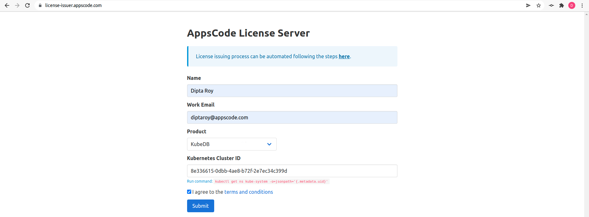
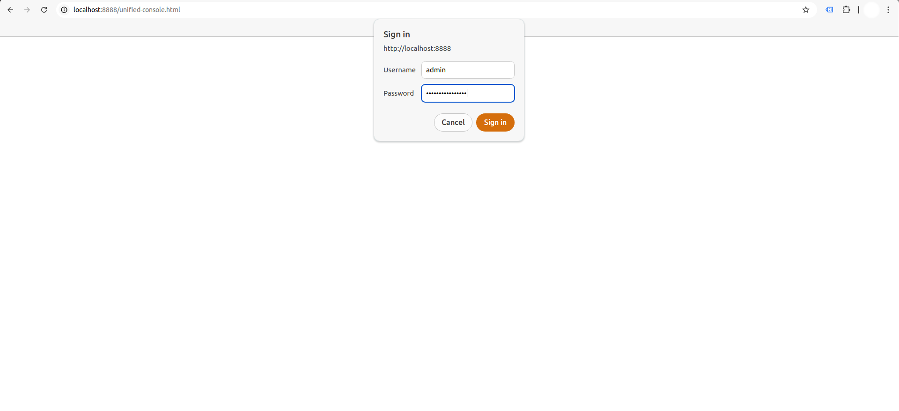
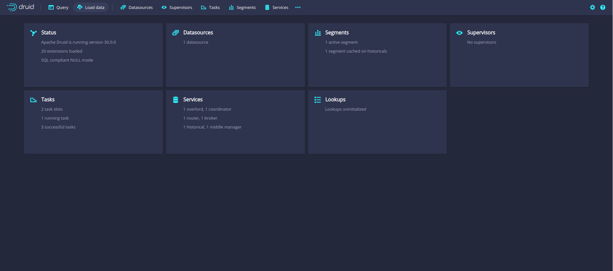
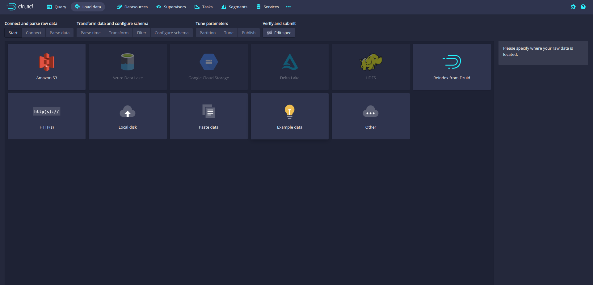
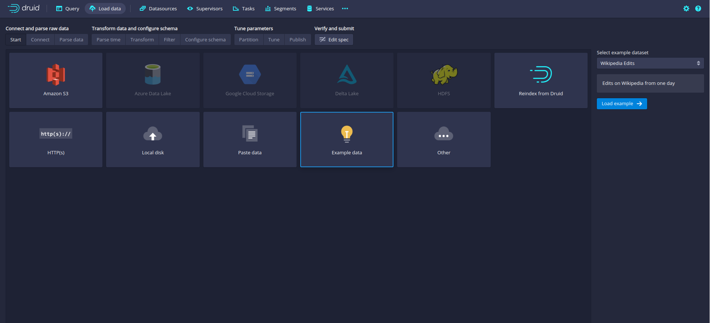
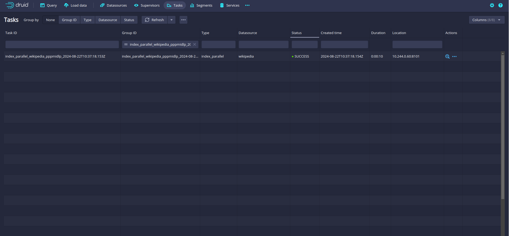
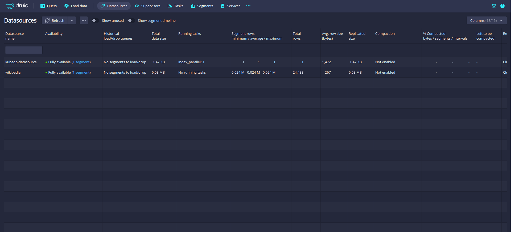
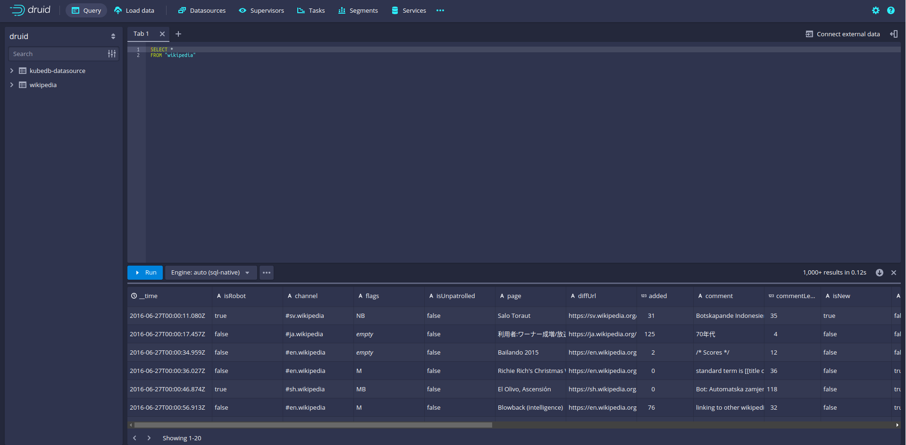

## Overview

KubeDB is the Kubernetes Native Database Management Solution which simplifies and automates routine database tasks such as Provisioning, Monitoring, Upgrading, Patching, Scaling, Volume Expansion, Backup, Recovery, Failure detection, and Repair for various popular databases on private and public clouds. The databases supported by KubeDB include MongoDB, Elasticsearch, MySQL, MariaDB, Redis, PostgreSQL, Solr, Microsoft SQL Server, Druid, FerretDB, SingleStore, Percona XtraDB, and Memcached. Additionally, KubeDB also supports ProxySQL, PgBouncer, Pgpool, ZooKeeper and the streaming platform Kafka, RabbitMQ. You can find the guides to all the supported databases in [KubeDB](https://kubedb.com/).
In this tutorial we will deploy and manage Druid in Google Kubernetes Engine (GKE) Using KubeDB. We will cover the following steps:

1. Install KubeDB
2. Create a Deep Storage
3. Deploy Druid Cluster
4. Access the Druid Web UI

### Get Cluster ID

We need the cluster ID to get the KubeDB License. To get cluster ID, we can run the following command:

```bash
$ kubectl get ns kube-system -o jsonpath='{.metadata.uid}'
8e336615-0dbb-4ae8-b72f-2e7ec34c399d
```

### Get License

Go to [Appscode License Server](https://license-issuer.appscode.com/) to get the license.txt file. For this tutorial we will use KubeDB.



### Install KubeDB

We will use helm to install KubeDB. Please install helm [here](https://helm.sh/docs/intro/install/) if it is not already installed.
Now, let's install `KubeDB`.

```bash
$ helm search repo appscode/kubedb
NAME                              	CHART VERSION	APP VERSION	DESCRIPTION                                       
appscode/kubedb                   	v2024.8.21   	v2024.8.21 	KubeDB by AppsCode - Production ready databases...
appscode/kubedb-autoscaler        	v0.32.0      	v0.32.0    	KubeDB Autoscaler by AppsCode - Autoscale KubeD...
appscode/kubedb-catalog           	v2024.8.21   	v2024.8.21 	KubeDB Catalog by AppsCode - Catalog for databa...
appscode/kubedb-community         	v0.24.2      	v0.24.2    	KubeDB Community by AppsCode - Community featur...
appscode/kubedb-crd-manager       	v0.2.0       	v0.2.0     	KubeDB CRD Manager by AppsCode                    
appscode/kubedb-crds              	v2024.8.21   	v2024.8.21 	KubeDB Custom Resource Definitions                
appscode/kubedb-dashboard         	v0.23.0      	v0.23.0    	KubeDB Dashboard by AppsCode                      
appscode/kubedb-enterprise        	v0.11.2      	v0.11.2    	KubeDB Enterprise by AppsCode - Enterprise feat...
appscode/kubedb-grafana-dashboards	v2024.8.21   	v2024.8.21 	A Helm chart for kubedb-grafana-dashboards by A...
appscode/kubedb-kubestash-catalog 	v2024.8.21   	v2024.8.21 	KubeStash Catalog by AppsCode - Catalog of Kube...
appscode/kubedb-metrics           	v2024.8.21   	v2024.8.21 	KubeDB State Metrics                              
appscode/kubedb-one               	v2023.12.28  	v2023.12.28	KubeDB and Stash by AppsCode - Production ready...
appscode/kubedb-ops-manager       	v0.34.0      	v0.34.0    	KubeDB Ops Manager by AppsCode - Enterprise fea...
appscode/kubedb-opscenter         	v2024.8.21   	v2024.8.21 	KubeDB Opscenter by AppsCode                      
appscode/kubedb-provider-aws      	v2024.8.21   	v0.9.0     	A Helm chart for KubeDB AWS Provider for Crossp...
appscode/kubedb-provider-azure    	v2024.8.21   	v0.9.0     	A Helm chart for KubeDB Azure Provider for Cros...
appscode/kubedb-provider-gcp      	v2024.8.21   	v0.9.0     	A Helm chart for KubeDB GCP Provider for Crossp...
appscode/kubedb-provisioner       	v0.47.0      	v0.47.0    	KubeDB Provisioner by AppsCode - Community feat...
appscode/kubedb-schema-manager    	v0.23.0      	v0.23.0    	KubeDB Schema Manager by AppsCode                 
appscode/kubedb-ui                	v2024.8.21   	0.7.5      	A Helm chart for Kubernetes                       
appscode/kubedb-ui-presets        	v2024.8.21   	v2024.8.21 	KubeDB UI Presets                                 
appscode/kubedb-ui-server         	v2021.12.21  	v2021.12.21	A Helm chart for kubedb-ui-server by AppsCode     
appscode/kubedb-webhook-server    	v0.23.0      	v0.23.0    	KubeDB Webhook Server by AppsCode


$ helm install kubedb oci://ghcr.io/appscode-charts/kubedb \
  --version v2024.8.21 \
  --namespace kubedb --create-namespace \
  --set-file global.license=/path/to/the/license.txt \
  --set global.featureGates.Druid=true \
  --set global.featureGates.ZooKeeper=true \
  --wait --burst-limit=10000 --debug
```

Let's verify the installation:

```bash
$ kubectl get pods --all-namespaces -l "app.kubernetes.io/instance=kubedb"
NAMESPACE   NAME                                            READY   STATUS    RESTARTS   AGE
kubedb      kubedb-kubedb-autoscaler-67747584cf-t767j       1/1     Running   0          3m37s
kubedb      kubedb-kubedb-ops-manager-68d7f85f64-ks8b9      1/1     Running   0          3m37s
kubedb      kubedb-kubedb-provisioner-5c4669498f-8l7bd      1/1     Running   0          3m37s
kubedb      kubedb-kubedb-webhook-server-66b46b464-xmkrx    1/1     Running   0          3m37s
kubedb      kubedb-petset-operator-77b6b9897f-p4zr8         1/1     Running   0          3m37s
kubedb      kubedb-petset-webhook-server-7d6c8dc854-vfzc5   2/2     Running   0          3m37s
kubedb      kubedb-sidekick-c898cff4c-5ljcj                 1/1     Running   0          3m37s
```

We can list the CRD Groups that have been registered by the operator by running the following command:

```bash
$ kubectl get crd -l app.kubernetes.io/name=kubedb
NAME                                               CREATED AT
clickhouseversions.catalog.kubedb.com              2024-08-21T10:00:12Z
connectclusters.kafka.kubedb.com                   2024-08-21T10:01:31Z
connectors.kafka.kubedb.com                        2024-08-21T10:01:31Z
druidautoscalers.autoscaling.kubedb.com            2024-08-21T10:01:24Z
druidopsrequests.ops.kubedb.com                    2024-08-21T10:01:24Z
druids.kubedb.com                                  2024-08-21T10:01:24Z
druidversions.catalog.kubedb.com                   2024-08-21T10:00:12Z
elasticsearchautoscalers.autoscaling.kubedb.com    2024-08-21T10:01:28Z
elasticsearchdashboards.elasticsearch.kubedb.com   2024-08-21T10:01:28Z
elasticsearches.kubedb.com                         2024-08-21T10:01:27Z
elasticsearchopsrequests.ops.kubedb.com            2024-08-21T10:01:28Z
elasticsearchversions.catalog.kubedb.com           2024-08-21T10:00:12Z
etcdversions.catalog.kubedb.com                    2024-08-21T10:00:12Z
ferretdbversions.catalog.kubedb.com                2024-08-21T10:00:12Z
kafkaautoscalers.autoscaling.kubedb.com            2024-08-21T10:01:31Z
kafkaconnectorversions.catalog.kubedb.com          2024-08-21T10:00:12Z
kafkaopsrequests.ops.kubedb.com                    2024-08-21T10:01:31Z
kafkas.kubedb.com                                  2024-08-21T10:01:31Z
kafkaversions.catalog.kubedb.com                   2024-08-21T10:00:12Z
mariadbarchivers.archiver.kubedb.com               2024-08-21T10:01:35Z
mariadbautoscalers.autoscaling.kubedb.com          2024-08-21T10:01:35Z
mariadbdatabases.schema.kubedb.com                 2024-08-21T10:01:35Z
mariadbopsrequests.ops.kubedb.com                  2024-08-21T10:01:35Z
mariadbs.kubedb.com                                2024-08-21T10:01:35Z
mariadbversions.catalog.kubedb.com                 2024-08-21T10:00:12Z
memcachedversions.catalog.kubedb.com               2024-08-21T10:00:12Z
mongodbarchivers.archiver.kubedb.com               2024-08-21T10:01:39Z
mongodbautoscalers.autoscaling.kubedb.com          2024-08-21T10:01:39Z
mongodbdatabases.schema.kubedb.com                 2024-08-21T10:01:39Z
mongodbopsrequests.ops.kubedb.com                  2024-08-21T10:01:39Z
mongodbs.kubedb.com                                2024-08-21T10:01:39Z
mongodbversions.catalog.kubedb.com                 2024-08-21T10:00:12Z
mssqlserverversions.catalog.kubedb.com             2024-08-21T10:00:12Z
mysqlarchivers.archiver.kubedb.com                 2024-08-21T10:01:43Z
mysqlautoscalers.autoscaling.kubedb.com            2024-08-21T10:01:43Z
mysqldatabases.schema.kubedb.com                   2024-08-21T10:01:43Z
mysqlopsrequests.ops.kubedb.com                    2024-08-21T10:01:43Z
mysqls.kubedb.com                                  2024-08-21T10:01:43Z
mysqlversions.catalog.kubedb.com                   2024-08-21T10:00:12Z
perconaxtradbversions.catalog.kubedb.com           2024-08-21T10:00:12Z
pgbouncerversions.catalog.kubedb.com               2024-08-21T10:00:12Z
pgpoolversions.catalog.kubedb.com                  2024-08-21T10:00:12Z
postgresarchivers.archiver.kubedb.com              2024-08-21T10:01:46Z
postgresautoscalers.autoscaling.kubedb.com         2024-08-21T10:01:46Z
postgresdatabases.schema.kubedb.com                2024-08-21T10:01:47Z
postgreses.kubedb.com                              2024-08-21T10:01:46Z
postgresopsrequests.ops.kubedb.com                 2024-08-21T10:01:46Z
postgresversions.catalog.kubedb.com                2024-08-21T10:00:12Z
proxysqlversions.catalog.kubedb.com                2024-08-21T10:00:12Z
publishers.postgres.kubedb.com                     2024-08-21T10:01:47Z
rabbitmqversions.catalog.kubedb.com                2024-08-21T10:00:12Z
redisautoscalers.autoscaling.kubedb.com            2024-08-21T10:01:50Z
redises.kubedb.com                                 2024-08-21T10:01:50Z
redisopsrequests.ops.kubedb.com                    2024-08-21T10:01:50Z
redissentinelautoscalers.autoscaling.kubedb.com    2024-08-21T10:01:50Z
redissentinelopsrequests.ops.kubedb.com            2024-08-21T10:01:50Z
redissentinels.kubedb.com                          2024-08-21T10:01:50Z
redisversions.catalog.kubedb.com                   2024-08-21T10:00:12Z
restproxies.kafka.kubedb.com                       2024-08-21T10:01:31Z
schemaregistries.kafka.kubedb.com                  2024-08-21T10:01:31Z
schemaregistryversions.catalog.kubedb.com          2024-08-21T10:00:12Z
singlestoreversions.catalog.kubedb.com             2024-08-21T10:00:12Z
solrversions.catalog.kubedb.com                    2024-08-21T10:00:12Z
subscribers.postgres.kubedb.com                    2024-08-21T10:01:47Z
zookeeperautoscalers.autoscaling.kubedb.com        2024-08-21T10:01:53Z
zookeepers.kubedb.com                              2024-08-21T10:01:53Z
zookeeperversions.catalog.kubedb.com               2024-08-21T10:00:12Z
```

### Create a Namespace

To keep resources isolated, we'll use a separate namespace called `demo` throughout this tutorial.
Run the following command to create the namespace:

```bash
$ kubectl create namespace demo
namespace/demo created
```

### Create a Deep Storage

One of the external dependency of Druid is Deep Storage where the segments are stored. It is a storage mechanism that Apache Druid does not provide. **Amazon S3**, **Google Cloud Storage**, or **Azure Blob Storage**, **S3-compatible storage** (like **Minio**), or **HDFS** are generally convenient options for Deep Storage.

In this tutorial, we will run a `minio-server` as deep storage in our cluster using `minio-operator` and create a bucket named `druid` in it, which the deployed druid database will use.


```bash
$ helm repo add minio https://operator.min.io/
$ helm repo update minio
$ helm upgrade --install --namespace "minio-operator" --create-namespace "minio-operator" minio/operator --set operator.replicaCount=1
$ helm upgrade --install --namespace "demo" --create-namespace druid-minio minio/tenant \
--set tenant.pools[0].servers=1 \
--set tenant.pools[0].volumesPerServer=1 \
--set tenant.pools[0].size=1Gi \
--set tenant.certificate.requestAutoCert=false \
--set tenant.buckets[0].name="druid" \
--set tenant.pools[0].name="default"
```

Now we need to create a `Secret` named `deep-storage-config`. It contains the necessary connection information using which the druid database will connect to the deep storage.
```yaml
apiVersion: v1
kind: Secret
metadata:
  name: deep-storage-config
  namespace: demo
stringData:
  druid.storage.type: "s3"
  druid.storage.bucket: "druid"
  druid.storage.baseKey: "druid/segments"
  druid.s3.accessKey: "minio"
  druid.s3.secretKey: "minio123"
  druid.s3.protocol: "http"
  druid.s3.enablePathStyleAccess: "true"
  druid.s3.endpoint.signingRegion: "us-east-1"
  druid.s3.endpoint.url: "http://myminio-hl.demo.svc.cluster.local:9000/"
```
Let’s create the `deep-storage-config` Secret shown above:

```bash
$ kubectl apply -f deep-storage-config.yaml
secret/deep-storage-config created
```

You can also use options like **Amazon S3**, **Google Cloud Storage**, **Azure Blob Storage** or **HDFS** and create a connection information `Secret` like this, and you are good to go.

### Metadata Storage

Druid uses the metadata store to house various metadata about the system, but not to store the actual data. The metadata store retains all metadata essential for a Druid cluster to work. Apache Derby is the default metadata store for Druid, however, it is not suitable for production. MySQL and PostgreSQL are more production suitable metadata stores.

Luckily, PostgreSQL and MySQL both are readily available in KubeDB as CRD and KubeDB operator will automatically create a MySQL cluster and create a database in it named `druid` by default.

If you choose to use PostgreSQL as metadata storage, you can simply mention that in the `spec.metadataStorage.type` of the Druid CR and KubeDB operator will deploy a PostgreSQL cluster for druid to use.

### ZooKeeper

Apache Druid uses [Apache ZooKeeper](https://zookeeper.apache.org/) (ZK) for management of current cluster state i.e. internal service discovery, coordination, and leader election.
Fortunately, KubeDB also has support for [ZooKeeper](https://kubedb.com/kubernetes/databases/run-and-manage-zookeeper-on-kubernetes/) and KubeDB operator will automatically create a ZooKeeper cluster for druid to use.

## Deploy Druid Cluster

Here is the yaml of the Druid we are going to use:

```yaml
apiVersion: kubedb.com/v1alpha2
kind: Druid
metadata:
  name: druid-cluster
  namespace: demo
spec:
  deepStorage:
    configSecret:
      name: deep-storage-config
    type: s3
  topology:
    routers:
      replicas: 1
  version: 30.0.0
  deletionPolicy: "WipeOut"
```

Let's save this yaml configuration into `druid-cluster.yaml` 
Then apply the above Druid yaml,

```bash
$ kubectl apply -f druid-cluster.yaml
druid.kubedb.com/druid-cluster created
```

In this yaml,
- `spec.version` is the name of the DruidVersion CR. Here, a Druid of `30.0.0` will be created.
- `spec.deepStorage` contains the information of deep storage configuration with `spec.deepStorage.type` being the deep storage type and spec.
- `deepStorage.configSecret` is a reference to the configuration secret.
- `spec.topology` is the definition of the topology that will be deployed. The required nodes such as `coordinators`, `historicals`, `middleManagers`, and `brokers` will be deployed by default with one replica. You can also add optional nodes including `routers` and `overlords` in the topology.
- `spec.deletionPolicy` field is *Wipeout* means that the database will be deleted without restrictions. It can also be “Halt”, “Delete” and “DoNotTerminate”.

Once these are handled correctly and the Druid object is deployed, you will see that the following resources are created:

```bash
$ kubectl get all -n demo
NAME                                 READY   STATUS    RESTARTS   AGE
pod/druid-cluster-brokers-0          1/1     Running   0          54s
pod/druid-cluster-coordinators-0     1/1     Running   0          60s
pod/druid-cluster-historicals-0      1/1     Running   0          58s
pod/druid-cluster-middlemanagers-0   1/1     Running   0          56s
pod/druid-cluster-mysql-metadata-0   2/2     Running   0          2m29s
pod/druid-cluster-mysql-metadata-1   2/2     Running   0          2m23s
pod/druid-cluster-mysql-metadata-2   2/2     Running   0          2m17s
pod/druid-cluster-routers-0          1/1     Running   0          52s
pod/druid-cluster-zk-0               1/1     Running   0          2m28s
pod/druid-cluster-zk-1               1/1     Running   0          2m22s
pod/druid-cluster-zk-2               1/1     Running   0          2m16s
pod/myminio-default-0                2/2     Running   0          12m

NAME                                           TYPE        CLUSTER-IP      EXTERNAL-IP   PORT(S)                                                 AGE
service/druid-cluster-brokers                  ClusterIP   10.96.150.199   <none>        8082/TCP                                                62s
service/druid-cluster-coordinators             ClusterIP   10.96.145.130   <none>        8081/TCP                                                62s
service/druid-cluster-mysql-metadata           ClusterIP   10.96.176.254   <none>        3306/TCP                                                2m32s
service/druid-cluster-mysql-metadata-pods      ClusterIP   None            <none>        3306/TCP                                                2m32s
service/druid-cluster-mysql-metadata-standby   ClusterIP   10.96.139.10    <none>        3306/TCP                                                2m32s
service/druid-cluster-pods                     ClusterIP   None            <none>        8081/TCP,8090/TCP,8083/TCP,8091/TCP,8082/TCP,8888/TCP   62s
service/druid-cluster-routers                  ClusterIP   10.96.148.73    <none>        8888/TCP                                                62s
service/druid-cluster-zk                       ClusterIP   10.96.76.149    <none>        2181/TCP                                                2m32s
service/druid-cluster-zk-admin-server          ClusterIP   10.96.139.96    <none>        8080/TCP                                                2m32s
service/druid-cluster-zk-pods                  ClusterIP   None            <none>        2181/TCP,2888/TCP,3888/TCP                              2m32s
service/minio                                  ClusterIP   10.96.31.66     <none>        80/TCP                                                  12m
service/myminio-console                        ClusterIP   10.96.193.192   <none>        9090/TCP                                                12m
service/myminio-hl                             ClusterIP   None            <none>        9000/TCP                                                12m

NAME                               READY   AGE
statefulset.apps/myminio-default   1/1     12m

NAME                                                              TYPE                   VERSION   AGE
appbinding.appcatalog.appscode.com/druid-cluster                  kubedb.com/druid       30.0.0    52s
appbinding.appcatalog.appscode.com/druid-cluster-mysql-metadata   kubedb.com/mysql       8.0.35    2m29s
appbinding.appcatalog.appscode.com/druid-cluster-zk               kubedb.com/zookeeper   3.7.2     2m32s

NAME                                            VERSION   STATUS   AGE
mysql.kubedb.com/druid-cluster-mysql-metadata   8.0.35    Ready    2m32s

NAME                             TYPE                  VERSION   STATUS         AGE
druid.kubedb.com/druid-cluster   kubedb.com/v1alpha2   30.0.0    Provisioning   2m32s

NAME                                    TYPE                  VERSION   STATUS   AGE
zookeeper.kubedb.com/druid-cluster-zk   kubedb.com/v1alpha2   3.7.2     Ready    2m32s
```
Let’s check if the database is ready to use,

```bash
$ kubectl get druid -n demo druid-cluster
NAME            TYPE                  VERSION   STATUS   AGE
druid-cluster   kubedb.com/v1alpha2   30.0.0    Ready    4m37s
```
> We have successfully deployed Druid in GKE. 


## Connect with Druid Database

Now, we will access the Druid web UI using [port forwarding](https://kubernetes.io/docs/tasks/access-application-cluster/port-forward-access-application-cluster/), which will allow you to manage the Druid cluster via a web interface. It is also possible to use `External-IP` to access druid nodes if you make `service` type of that node as `LoadBalancer`.


#### Port-forward the Service

KubeDB will create few Services to connect with the database. Let’s check the Services by following command,

```bash
$ kubectl get service -n demo
NAME                                   TYPE        CLUSTER-IP      EXTERNAL-IP   PORT(S)                                                 AGE
druid-cluster-brokers                  ClusterIP   10.96.150.199   <none>        8082/TCP                                                5m1s
druid-cluster-coordinators             ClusterIP   10.96.145.130   <none>        8081/TCP                                                5m1s
druid-cluster-mysql-metadata           ClusterIP   10.96.176.254   <none>        3306/TCP                                                6m31s
druid-cluster-mysql-metadata-pods      ClusterIP   None            <none>        3306/TCP                                                6m31s
druid-cluster-mysql-metadata-standby   ClusterIP   10.96.139.10    <none>        3306/TCP                                                6m31s
druid-cluster-pods                     ClusterIP   None            <none>        8081/TCP,8090/TCP,8083/TCP,8091/TCP,8082/TCP,8888/TCP   5m1s
druid-cluster-routers                  ClusterIP   10.96.148.73    <none>        8888/TCP                                                5m1s
druid-cluster-zk                       ClusterIP   10.96.76.149    <none>        2181/TCP                                                6m31s
druid-cluster-zk-admin-server          ClusterIP   10.96.139.96    <none>        8080/TCP                                                6m31s
druid-cluster-zk-pods                  ClusterIP   None            <none>        2181/TCP,2888/TCP,3888/TCP                              6m31s
minio                                  ClusterIP   10.96.31.66     <none>        80/TCP                                                  16m
myminio-console                        ClusterIP   10.96.193.192   <none>        9090/TCP                                                16m
myminio-hl                             ClusterIP   None            <none>        9000/TCP                                                16m
```
To connect to the Druid database, we will use the `druid-cluster-routers` service. First, we need to port-forward the `druid-cluster-routers` service to port `8888` on the local machine:

```bash
$ kubectl port-forward -n demo svc/druid-cluster-routers 8888
Forwarding from 127.0.0.1:8888 -> 8888
Forwarding from [::1]:8888 -> 8888
```
Now, the Druid cluster is accessible at `localhost:8888`. Open the web browser and navigate to `localhost:8888`. You will see the Druid login panel.

#### Retrieve the Credentials

To access the database through Druid web UI, we have to get the credentials to access. KubeDB creates several Secrets for managing the database. To view the Secrets created for `druid-cluster`, run the following command:

```bash
$ kubectl get secret -n demo | grep druid-cluster
druid-cluster-admin-cred            kubernetes.io/basic-auth   2      8m19s
druid-cluster-config                Opaque                     11     8m19s
druid-cluster-mysql-metadata-auth   kubernetes.io/basic-auth   2      9m49s
druid-cluster-zk-auth               kubernetes.io/basic-auth   2      9m49s
druid-cluster-zk-config             Opaque                     3      9m49s
```
From the above list, the `druid-cluster-admin-cred` Secret contains the admin-level credentials needed to connect to the database.

Use the following commands to obtain the username and password:

```bash
$ kubectl get secret -n demo druid-cluster-admin-cred -o jsonpath='{.data.username}' | base64 -d
admin
$ kubectl get secret -n demo druid-cluster-admin-cred -o jsonpath='{.data.password}' | base64 -d
1dQho60VXpiLt)jp
```


### Access the Web UI

With the credentials in hand, log in to the Druid web UI.



After logging in with the credentials, you’ll see the Druid web console.



First, click on `Load Data` in the top menu, then choose `Batch - classic`. This will bring up the data loading screen.



Next, select `Example data` and click the `Load example` button.



Proceed by following the sequential steps provided: click `Next` at the bottom-right corner of each screen. You will need to go through `Parse data`, `Parse time`, `Transform`, `Filter`, `Configure schema`, `Partition`, `Tune`, `Publish`, `Edit spec`, and finally `Submit`. Once you have submitted the task, monitor the Tasks list for the `Status` update, which will initially show as `RUNNING` and eventually change to `SUCCESS`.



After the task is successfully completed, navigate to the `Datasources` section from the top menu. You should find your new datasource, such as `wikipedia`, listed there. Click on it to open the `Query` option where you can run queries on your data.






> Congratulations! We’ve successfully added sample data to the Druid database using the web UI. This interface provides a convenient way to monitor and manage the Druid cluster.

We have made a in depth tutorial on Seamlessly Provision Apache Druid in Kubernetes Using KubeDB. You can have a look into the video below:

<iframe width="560" height="315" src="https://www.youtube.com/embed/rccEWkBccGE?si=zSQWBcSiC7FuliPs" title="YouTube video player" frameborder="0" allow="accelerometer; autoplay; clipboard-write; encrypted-media; gyroscope; picture-in-picture; web-share" referrerpolicy="strict-origin-when-cross-origin" allowfullscreen></iframe>

## Support

To speak with us, please leave a message on [our website](https://appscode.com/contact/).

To receive product announcements, follow us on [X](https://twitter.com/KubeDB).

To watch tutorials of various Production-Grade Kubernetes Tools Subscribe our [YouTube](https://www.youtube.com/c/AppsCodeInc/) channel.

More about [Druid on Kubernetes](https://kubedb.com/kubernetes/databases/run-and-manage-druid-on-kubernetes/)

If you have found a bug with KubeDB or want to request for new features, please [file an issue](https://github.com/kubedb/project/issues/new).
