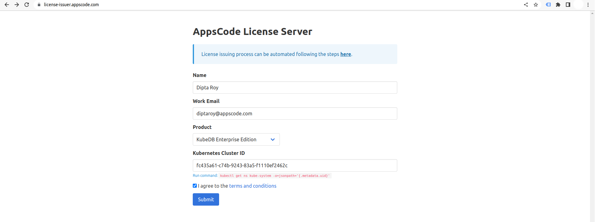

## Overview

KubeDB is the Kubernetes Native Database Management Solution which simplifies and automates routine database tasks such as Provisioning, Monitoring, Upgrading, Patching, Scaling, Volume Expansion, Backup, Recovery, Failure detection, and Repair for various popular databases on private and public clouds. The databases that KubeDB supports are MongoDB, Elasticsearch, MySQL, MariaDB, Redis, PostgreSQL, ProxySQL, Percona XtraDB, Memcached and PgBouncer. You can find the guides to all the supported databases in [KubeDB](https://kubedb.com/).
In this tutorial we will deploy and manage MongoDB Sharded Cluster in Azure Kubernetes Service (AKS). We will cover the following steps:

1) Install KubeDB
2) Deploy MongoDB Sharded Cluster
3) Horizontal Scaling of MongoDB Sharded Cluster
4) Vertical Scaling of MongoDB Sharded Cluster

### Get Cluster ID

We need the cluster ID to get the KubeDB License. To get cluster ID, we can run the following command:

```bash
$ kubectl get ns kube-system -o jsonpath='{.metadata.uid}'
fc435a61-c74b-9243-83a5-f1110ef2462c
```

### Get License

Go to [Appscode License Server](https://license-issuer.appscode.com/) to get the license.txt file. For this tutorial we will use KubeDB Enterprise Edition.



### Install KubeDB

We will use helm to install KubeDB. Please install helm [here](https://helm.sh/docs/intro/install/) if it is not already installed.
Now, let's install `KubeDB`.

```bash
$ helm repo add appscode https://charts.appscode.com/stable/
$ helm repo update

$ helm search repo appscode/kubedb
NAME                              	CHART VERSION	APP VERSION	DESCRIPTION                                       
appscode/kubedb                   	v2023.04.10  	v2023.04.10	KubeDB by AppsCode - Production ready databases...
appscode/kubedb-autoscaler        	v0.18.0      	v0.18.1    	KubeDB Autoscaler by AppsCode - Autoscale KubeD...
appscode/kubedb-catalog           	v2023.04.10  	v2023.04.10	KubeDB Catalog by AppsCode - Catalog for databa...
appscode/kubedb-community         	v0.24.2      	v0.24.2    	KubeDB Community by AppsCode - Community featur...
appscode/kubedb-crds              	v2023.04.10  	v2023.04.10	KubeDB Custom Resource Definitions                
appscode/kubedb-dashboard         	v0.9.0       	v0.9.1     	KubeDB Dashboard by AppsCode                      
appscode/kubedb-enterprise        	v0.11.2      	v0.11.2    	KubeDB Enterprise by AppsCode - Enterprise feat...
appscode/kubedb-grafana-dashboards	v2023.04.10  	v2023.04.10	A Helm chart for kubedb-grafana-dashboards by A...
appscode/kubedb-metrics           	v2023.04.10  	v2023.04.10	KubeDB State Metrics                              
appscode/kubedb-one               	v2023.04.10  	v2023.04.10	KubeDB and Stash by AppsCode - Production ready...
appscode/kubedb-ops-manager       	v0.20.0      	v0.20.1    	KubeDB Ops Manager by AppsCode - Enterprise fea...
appscode/kubedb-opscenter         	v2023.04.10  	v2023.04.10	KubeDB Opscenter by AppsCode                      
appscode/kubedb-provisioner       	v0.33.0      	v0.33.1    	KubeDB Provisioner by AppsCode - Community feat...
appscode/kubedb-schema-manager    	v0.9.0       	v0.9.1     	KubeDB Schema Manager by AppsCode                 
appscode/kubedb-ui                	v2023.03.23  	0.3.28     	A Helm chart for Kubernetes                       
appscode/kubedb-ui-server         	v2021.12.21  	v2021.12.21	A Helm chart for kubedb-ui-server by AppsCode     
appscode/kubedb-webhook-server    	v0.9.0       	v0.9.1     	KubeDB Webhook Server by AppsCode 

# Install KubeDB Enterprise operator chart
$ helm install kubedb appscode/kubedb \
  --version v2023.04.10 \
  --namespace kubedb --create-namespace \
  --set kubedb-provisioner.enabled=true \
  --set kubedb-ops-manager.enabled=true \
  --set kubedb-autoscaler.enabled=true \
  --set kubedb-dashboard.enabled=true \
  --set kubedb-schema-manager.enabled=true \
  --set-file global.license=/path/to/the/license.txt
```

Let's verify the installation:

```bash
$ kubectl get pods --all-namespaces -l "app.kubernetes.io/instance=kubedb"
NAMESPACE   NAME                                            READY   STATUS    RESTARTS   AGE
kubedb      kubedb-kubedb-autoscaler-8547c4b89-lfmph        1/1     Running   0          4m5s
kubedb      kubedb-kubedb-dashboard-7f7c586cfd-rbfgh        1/1     Running   0          4m5s
kubedb      kubedb-kubedb-ops-manager-86556b78b5-7fzzc      1/1     Running   0          4m5s
kubedb      kubedb-kubedb-provisioner-66cd8bf58-6nvkd       1/1     Running   0          4m5s
kubedb      kubedb-kubedb-schema-manager-8d7757f9f-dfklp    1/1     Running   0          4m5s
kubedb      kubedb-kubedb-webhook-server-74d77cbb6d-m2vq8   1/1     Running   0          4m5s
```

We can list the CRD Groups that have been registered by the operator by running the following command:

```bash
$ kubectl get crd -l app.kubernetes.io/name=kubedb
NAME                                              CREATED AT
elasticsearchautoscalers.autoscaling.kubedb.com   2023-05-11T09:00:37Z
elasticsearchdashboards.dashboard.kubedb.com      2023-05-11T09:00:18Z
elasticsearches.kubedb.com                        2023-05-11T09:00:18Z
elasticsearchopsrequests.ops.kubedb.com           2023-05-11T09:00:22Z
elasticsearchversions.catalog.kubedb.com          2023-05-11T08:57:05Z
etcds.kubedb.com                                  2023-05-11T09:00:28Z
etcdversions.catalog.kubedb.com                   2023-05-11T08:57:05Z
kafkas.kubedb.com                                 2023-05-11T09:00:30Z
kafkaversions.catalog.kubedb.com                  2023-05-11T08:57:05Z
mariadbautoscalers.autoscaling.kubedb.com         2023-05-11T09:00:37Z
mariadbdatabases.schema.kubedb.com                2023-05-11T09:00:32Z
mariadbopsrequests.ops.kubedb.com                 2023-05-11T09:00:36Z
mariadbs.kubedb.com                               2023-05-11T09:00:28Z
mariadbversions.catalog.kubedb.com                2023-05-11T08:57:06Z
memcacheds.kubedb.com                             2023-05-11T09:00:28Z
memcachedversions.catalog.kubedb.com              2023-05-11T08:57:06Z
mongodbautoscalers.autoscaling.kubedb.com         2023-05-11T09:00:37Z
mongodbdatabases.schema.kubedb.com                2023-05-11T09:00:30Z
mongodbopsrequests.ops.kubedb.com                 2023-05-11T09:00:25Z
mongodbs.kubedb.com                               2023-05-11T09:00:25Z
mongodbversions.catalog.kubedb.com                2023-05-11T08:57:06Z
mysqlautoscalers.autoscaling.kubedb.com           2023-05-11T09:00:37Z
mysqldatabases.schema.kubedb.com                  2023-05-11T09:00:30Z
mysqlopsrequests.ops.kubedb.com                   2023-05-11T09:00:32Z
mysqls.kubedb.com                                 2023-05-11T09:00:29Z
mysqlversions.catalog.kubedb.com                  2023-05-11T08:57:07Z
perconaxtradbautoscalers.autoscaling.kubedb.com   2023-05-11T09:00:37Z
perconaxtradbopsrequests.ops.kubedb.com           2023-05-11T09:00:49Z
perconaxtradbs.kubedb.com                         2023-05-11T09:00:29Z
perconaxtradbversions.catalog.kubedb.com          2023-05-11T08:57:07Z
pgbouncers.kubedb.com                             2023-05-11T09:00:28Z
pgbouncerversions.catalog.kubedb.com              2023-05-11T08:57:07Z
postgresautoscalers.autoscaling.kubedb.com        2023-05-11T09:00:37Z
postgresdatabases.schema.kubedb.com               2023-05-11T09:00:31Z
postgreses.kubedb.com                             2023-05-11T09:00:29Z
postgresopsrequests.ops.kubedb.com                2023-05-11T09:00:43Z
postgresversions.catalog.kubedb.com               2023-05-11T08:57:07Z
proxysqlautoscalers.autoscaling.kubedb.com        2023-05-11T09:00:37Z
proxysqlopsrequests.ops.kubedb.com                2023-05-11T09:00:46Z
proxysqls.kubedb.com                              2023-05-11T09:00:29Z
proxysqlversions.catalog.kubedb.com               2023-05-11T08:57:08Z
publishers.postgres.kubedb.com                    2023-05-11T09:00:59Z
redisautoscalers.autoscaling.kubedb.com           2023-05-11T09:00:37Z
redises.kubedb.com                                2023-05-11T09:00:30Z
redisopsrequests.ops.kubedb.com                   2023-05-11T09:00:39Z
redissentinelautoscalers.autoscaling.kubedb.com   2023-05-11T09:00:37Z
redissentinelopsrequests.ops.kubedb.com           2023-05-11T09:00:53Z
redissentinels.kubedb.com                         2023-05-11T09:00:30Z
redisversions.catalog.kubedb.com                  2023-05-11T08:57:08Z
subscribers.postgres.kubedb.com                   2023-05-11T09:01:02Z
```

## Deploy MongoDB Sharded Cluster

We are going to Deploy MongoDB Sharded Cluster by using KubeDB.
First, let's create a Namespace in which we will deploy the database.

```bash
$ kubectl create namespace demo
namespace/demo created
```

Here is the yaml of the MongoDB CRO we are going to use:

```yaml
apiVersion: kubedb.com/v1alpha2
kind: MongoDB
metadata:
  name: mongodb-shard
  namespace: demo
spec:
  version: 6.0.5
  shardTopology:
    configServer:
      replicas: 3
      podTemplate: 
        spec:
          resources:
            limits:
              memory: 384Mi
            requests:
              cpu: 300m
              memory: 384Mi
      storage:
        resources:
          requests:
            storage: 512Mi
        storageClassName: default
    mongos:
      replicas: 2
      podTemplate: 
        spec:
          resources:
            limits:
              memory: 384Mi
            requests:
              cpu: 300m
              memory: 384Mi
    shard:
      replicas: 3
      podTemplate: 
        spec:
          resources:
            limits:
              memory: 384Mi
            requests:
              cpu: 300m
              memory: 384Mi
      shards: 2
      storage:
        resources:
          requests:
            storage: 256Mi
        storageClassName: default
  terminationPolicy: WipeOut
```
Let's save this yaml configuration into `mongodb-shard.yaml` 
Then create the above MongoDB CRO

```bash
$ kubectl apply -f mongodb-shard.yaml
mongodb.kubedb.com/mongodb-shard created
```
In this yaml,
* In this yaml we can see in the `spec.version` field specifies the version of MongoDB. Here, we are using MongoDB `version 6.0.5`. You can list the KubeDB supported versions of MongoDB by running `$ kubectl get mongodbversions` command.
* `spec.shardTopology` represents the topology configuration for sharding.
* `spec.shardTopology.configServer` defines configuration for ConfigServer component of mongodb.
* `spec.shardTopology.configServer.replicas` represents number of replicas for configServer replicaset.
* `spec.shardTopology.mongos` defines configuration for Mongos component of mongodb. Mongos instances run as stateless components (deployment).
* `spec.shardTopology.mongos.replicas` specifies number of replicas of Mongos instance. Here, Mongos is not deployed as replicaset.
* `spec.storage.storageClassName` is the name of the StorageClass used to provision PVCs. 
* `spec.terminationPolicy` field is *Wipeout* means that the database will be deleted without restrictions. It can also be “Halt”, “Delete” and “DoNotTerminate”. Learn More about these checkout [Termination Policy](https://kubedb.com/docs/latest/guides/mongodb/concepts/mongodb/#specterminationpolicy) .

Once these are handled correctly and the MongoDB object is deployed, you will see that the following objects are created:

```bash
$ kubectl get all -n demo
NAME                            READY   STATUS    RESTARTS   AGE
pod/mongodb-shard-configsvr-0   1/1     Running   0          5m9s
pod/mongodb-shard-configsvr-1   1/1     Running   0          4m15s
pod/mongodb-shard-configsvr-2   1/1     Running   0          2m52s
pod/mongodb-shard-mongos-0      1/1     Running   0          111s
pod/mongodb-shard-mongos-1      1/1     Running   0          88s
pod/mongodb-shard-shard0-0      1/1     Running   0          5m9s
pod/mongodb-shard-shard0-1      1/1     Running   0          4m26s
pod/mongodb-shard-shard0-2      1/1     Running   0          3m1s
pod/mongodb-shard-shard1-0      1/1     Running   0          5m8s
pod/mongodb-shard-shard1-1      1/1     Running   0          4m15s
pod/mongodb-shard-shard1-2      1/1     Running   0          3m30s

NAME                                   TYPE        CLUSTER-IP    EXTERNAL-IP   PORT(S)     AGE
service/mongodb-shard                  ClusterIP   10.0.244.95   <none>        27017/TCP   5m11s
service/mongodb-shard-configsvr-pods   ClusterIP   None          <none>        27017/TCP   5m11s
service/mongodb-shard-mongos-pods      ClusterIP   None          <none>        27017/TCP   5m11s
service/mongodb-shard-shard0-pods      ClusterIP   None          <none>        27017/TCP   5m11s
service/mongodb-shard-shard1-pods      ClusterIP   None          <none>        27017/TCP   5m11s

NAME                                       READY   AGE
statefulset.apps/mongodb-shard-configsvr   3/3     5m11s
statefulset.apps/mongodb-shard-mongos      2/2     113s
statefulset.apps/mongodb-shard-shard0      3/3     5m11s
statefulset.apps/mongodb-shard-shard1      3/3     5m10s

NAME                                               TYPE                 VERSION   AGE
appbinding.appcatalog.appscode.com/mongodb-shard   kubedb.com/mongodb   6.0.5     69s

NAME                               VERSION   STATUS   AGE
mongodb.kubedb.com/mongodb-shard   6.0.5     Ready    5m19s

```
Let’s check if the database is ready to use,

```bash
$ kubectl get mongodb -n demo mongodb-shard
NAME            VERSION   STATUS   AGE
mongodb-shard   6.0.5     Ready    6m3s
```
> We have successfully deployed MongoDB shard in Azure. Now we can exec into the container to use the database.

### Accessing Database Through CLI

To access the database through CLI, we have to get the credentials to access. Let’s export the credentials as environment variable to our current shell :

#### Export the Credentials

KubeDB will create Secret and Service for the database `mongodb-shard` that we have deployed. Let’s check them using the following commands,

```bash
$ kubectl get secret -n demo -l=app.kubernetes.io/instance=mongodb-shard
NAME                 TYPE                       DATA   AGE
mongodb-shard-auth   kubernetes.io/basic-auth   2      7m2s
mongodb-shard-key    Opaque                     1      7m2s

$ kubectl get service -n demo -l=app.kubernetes.io/instance=mongodb-shard
NAME                           TYPE        CLUSTER-IP    EXTERNAL-IP   PORT(S)     AGE
mongodb-shard                  ClusterIP   10.0.244.95   <none>        27017/TCP   7m18s
mongodb-shard-configsvr-pods   ClusterIP   None          <none>        27017/TCP   7m18s
mongodb-shard-mongos-pods      ClusterIP   None          <none>        27017/TCP   7m18s
mongodb-shard-shard0-pods      ClusterIP   None          <none>        27017/TCP   7m18s
mongodb-shard-shard1-pods      ClusterIP   None          <none>        27017/TCP   7m18s
```
Now, we are going to use `mongodb-shard-auth` to export credentials.
Let’s export the `USER` and `PASSWORD` as environment variables to make further commands re-usable.

```bash
$ export USER=$(kubectl get secrets -n demo mongodb-shard-auth -o jsonpath='{.data.\username}' | base64 -d)

$ export PASSWORD=$(kubectl get secrets -n demo mongodb-shard-auth -o jsonpath='{.data.\password}' | base64 -d)
```

#### Insert Sample Data

In this section, we are going to login into our MongoDB shard pod and insert some sample data. 

```bash
$ kubectl exec -it -n demo mongodb-shard-shard0-0 -- mongosh admin -u $USER -p $PASSWORD
Defaulted container "mongodb" out of: mongodb, copy-config (init)
Current Mongosh Log ID:	645cbc3d6a6de8647a98e0e9
Connecting to:		mongodb://<credentials>@127.0.0.1:27017/admin?directConnection=true&serverSelectionTimeoutMS=2000&appName=mongosh+1.8.2
Using MongoDB:		6.0.5
Using Mongosh:		1.8.2

shard0 [direct: primary] admin> show dbs
admin          132.00 KiB
config           1.63 MiB
kubedb-system   60.00 KiB
local          868.00 KiB

shard0 [direct: primary] admin> use musicdb
switched to db musicdb

shard0 [direct: primary] musicdb> db.songs.insert({"name":"Take Me Home, Country Roads"});
DeprecationWarning: Collection.insert() is deprecated. Use insertOne, insertMany, or bulkWrite.
{
  acknowledged: true,
  insertedIds: { '0': ObjectId("645cbc536a6de8647a98e0ea") }
}

shard0 [direct: primary] musicdb> db.songs.find().pretty()
[
  {
    _id: ObjectId("645cbc536a6de8647a98e0ea"),
    name: 'Take Me Home, Country Roads'
  }
]

shard0 [direct: primary] musicdb> exit

```

> We've successfully inserted some sample data to our database. More information about Run & Manage MongoDB on Kubernetes can be found [HERE](https://kubedb.com/kubernetes/databases/run-and-manage-mongodb-on-kubernetes/)


## Horizontal Scaling of MongoDB Sharded Cluster

### Horizontal Scale Up

Here, we are going to scale up the number of MongoDB shard and also their replicas to meet the desired number of replicas.
Before applying Horizontal Scaling, let's check the current number of MongoDB shard and their replicas,

```bash
$ kubectl get mongodb -n demo mongodb-shard -o json | jq '.spec.shardTopology.shard.shards'
2

$ kubectl get mongodb -n demo mongodb-shard -o json | jq '.spec.shardTopology.shard.replicas'
3
```

### Create MongoDBOpsRequest

In order to scale up, we have to create a `MongoDBOpsRequest` CR with our desired replicas. Let’s create it using this following yaml,

```yaml
apiVersion: ops.kubedb.com/v1alpha1
kind: MongoDBOpsRequest
metadata:
  name: horizontal-scale-up
  namespace: demo
spec:
  type: HorizontalScaling
  databaseRef:
    name: mongodb-shard
  horizontalScaling:
    shard: 
      shards: 3
      replicas: 4
```
In this yaml,

- `spec.databaseRef.name` specifies that we are performing horizontal scaling operation on `mongodb-shard` database.
- `spec.type` specifies that we are performing `HorizontalScaling` on our database.
- `spec.horizontalScaling.shard.shards` specifies the desired number of shards after scaling.
- `spec.horizontalScaling.shard.replicas` specifies the desired number of shard replicas after scaling.

Let’s save this yaml configuration into `horizontal-scale-up.yaml` and apply it,

```bash
$ kubectl apply -f horizontal-scale-up.yaml
mongodbopsrequest.ops.kubedb.com/horizontal-scale-up created
```

Let’s wait for `MongoDBOpsRequest` `STATUS` to be Successful. Run the following command to watch `MongoDBOpsRequest` CR,

```bash
$ watch kubectl get mongodbopsrequest -n demo
NAME                  TYPE                STATUS       AGE
horizontal-scale-up   HorizontalScaling   Successful   3m
```

From the above output we can see that the `MongoDBOpsRequest` has succeeded. Now, we are going to verify the number of shard and their replicas,

```bash
$ kubectl get mongodb -n demo mongodb-shard -o json | jq '.spec.shardTopology.shard.shards'
3

$ kubectl get mongodb -n demo mongodb-shard -o json | jq '.spec.shardTopology.shard.replicas'
4
```

From all the above outputs we can see that the number of shards is now increased to 3 and also, their replicas increased to 4. That means we have successfully scaled up the number of shards and their replicas.

### Horizontal Scale Down

Now, we are going to scale down the number of MongoDB shard and also their replicas to meet the desired number of replicas.

#### Create MongoDBOpsRequest

In order to scale down, again we need to create a `MongoDBOpsRequest` CR with our desired replicas. Let’s create it using this following yaml,

```yaml
apiVersion: ops.kubedb.com/v1alpha1
kind: MongoDBOpsRequest
metadata:
  name: horizontal-scale-down
  namespace: demo
spec:
  type: HorizontalScaling
  databaseRef:
    name: mongodb-shard
  horizontalScaling:
    shard: 
      shards: 2
      replicas: 3
```

In this yaml,

- `spec.databaseRef.name` specifies that we are performing horizontal scaling operation on `mongodb-shard` database.
- `spec.type` specifies that we are performing `HorizontalScaling` on our database.
- `spec.horizontalScaling.shard.shards` specifies the desired number of shards after scaling.
- `spec.horizontalScaling.shard.replicas` specifies the desired number of shard replicas after scaling.

Let’s save this yaml configuration into `horizontal-scale-down.yaml` and apply it,

```bash
$ kubectl apply -f horizontal-scale-down.yaml
mongodbopsrequest.ops.kubedb.com/horizontal-scale-down created
```

Let’s wait for `MongoDBOpsRequest` `STATUS` to be Successful. Run the following command to watch `MongoDBOpsRequest` CR,

```bash
$ watch kubectl get mongodbopsrequest -n demo
NAME                    TYPE                STATUS       AGE
horizontal-scale-down   HorizontalScaling   Successful   3m23s
```

From the above output we can see that the `MongoDBOpsRequest` has succeeded. Now, we are going to verify the number of shard and their replicas,

```bash
$ kubectl get mongodb -n demo mongodb-shard -o json | jq '.spec.shardTopology.shard.shards'
2

$ kubectl get mongodb -n demo mongodb-shard -o json | jq '.spec.shardTopology.shard.replicas'
3
```
From all the above outputs we can see that the number of shards is now decreased to 2 and also, their replicas decreased to 3. That means we have successfully scaled down the number of shards and their replicas.


## Vetical Scaling of MongoDB Sharded Cluster

We are going to scale up the current cpu resource of the MongoDB sharded cluster by applying Vertical Scaling.
Before applying it, let's check the current resources,

```bash
$ kubectl get pod -n demo mongodb-shard-shard0-0 -o json | jq '.spec.containers[].resources' 
{
  "limits": {
    "memory": "1Gi"
  },
  "requests": {
    "cpu": "500m",
    "memory": "1Gi"
  }
}
```
### Vertical Scale Up

#### Create MongoDBOpsRequest

In order to update the resources of the cluster, we have to create a `MongoDBOpsRequest` CR with our desired resources. Let’s create it using this following yaml,

```yaml
apiVersion: ops.kubedb.com/v1alpha1
kind: MongoDBOpsRequest
metadata:
  name: vertical-scale-up
  namespace: demo
spec:
  type: VerticalScaling
  databaseRef:
    name: mongodb-shard
  verticalScaling:
    shard:
      requests:
        memory: "1100Mi"
        cpu: "0.55"
      limits:
        memory: "1100Mi"
        cpu: "0.55"
```
In this yaml,

- `spec.databaseRef.name` specifies that we are performing vertical scaling operation on `mongodb-shard` database.
- `spec.type` specifies that we are performing `VerticalScaling` on our database.
- `spec.verticalScaling.shard` specifies the desired resources after scaling.

Let’s save this yaml configuration into `vertical-scale-up.yaml` and apply it,

```bash
$ kubectl apply -f vertical-scale-up.yaml
mongodbopsrequest.ops.kubedb.com/vertical-scale-up created
```

Let’s wait for `MongoDBOpsRequest` `STATUS` to be Successful. Run the following command to watch `MongoDBOpsRequest` CR,

```bash
$ kubectl get mongodbopsrequest -n demo
NAME                TYPE              STATUS       AGE
vertical-scale-up   VerticalScaling   Successful   3m21s
```

We can see from the above output that the `MongoDBOpsRequest` has succeeded. Now, we are going to verify from one of the Pod yaml whether the resources of the database has updated to meet up the desired state. Let’s check with the following command,

```bash
$ kubectl get pod -n demo mongodb-shard-shard0-0 -o json | jq '.spec.containers[].resources' 
{
  "limits": {
    "cpu": "550m",
    "memory": "1100Mi"
  },
  "requests": {
    "cpu": "550m",
    "memory": "1100Mi"
  }
}
```
> The above output verifies that we have successfully scaled up the resources of the MongoDB sharded cluster.

### Vertical Scale Down

#### Create MongoDBOpsRequest

In order to update the resources of the database, we have to create a `MongoDBOpsRequest` CR with our desired resources. Let’s create it using this following yaml,

```yaml
apiVersion: ops.kubedb.com/v1alpha1
kind: MongoDBOpsRequest
metadata:
  name: vertical-scale-down
  namespace: demo
spec:
  type: VerticalScaling
  databaseRef:
    name: mongodb-shard
  verticalScaling:
    shard:
      requests:
        memory: "1Gi"
        cpu: "0.5"
      limits:
        memory: "1Gi"
        cpu: "0.5"
```
In this yaml,

- `spec.databaseRef.name` specifies that we are performing vertical scaling operation on `mongodb-shard` database.
- `spec.type` specifies that we are performing `VerticalScaling` on our database.
- `spec.verticalScaling.shard` specifies the desired resources after scaling.

Let’s save this yaml configuration into `vertical-scale-down.yaml` and apply it,

```bash
$ kubectl apply -f vertical-scale-down.yaml
mongodbopsrequest.ops.kubedb.com/vertical-scale-down created
```

Let’s wait for `MongoDBOpsRequest` `STATUS` to be Successful. Run the following command to watch `MongoDBOpsRequest` CR,

```bash
$ kubectl get mongodbopsrequest -n demo
NAME                  TYPE              STATUS       AGE
vertical-scale-down   VerticalScaling   Successful   2m43s
```

We can see from the above output that the `MongoDBOpsRequest` has succeeded. Now, we are going to verify from one of the Pod yaml whether the resources of the database has updated to meet up the desired state. Let’s check with the following command,

```bash
$ kubectl get pod -n demo mongodb-shard-shard0-0 -o json | jq '.spec.containers[].resources' 
{
  "limits": {
    "cpu": "500m",
    "memory": "1Gi"
  },
  "requests": {
    "cpu": "500m",
    "memory": "1Gi"
  }
}
```
> The above output verifies that we have successfully scaled down the resources of the MongoDB sharded cluster.

If you want to learn more about Production-Grade MongoDB you can have a look into that playlist below:

<iframe width="560" height="315" src="https://www.youtube.com/embed/videoseries?list=PLoiT1Gv2KR1jZmdzRaQW28eX4zR9lvUqf" title="YouTube video player" frameborder="0" allow="accelerometer; autoplay; clipboard-write; encrypted-media; gyroscope; picture-in-picture; web-share" allowfullscreen></iframe>

## Support

To speak with us, please leave a message on [our website](https://appscode.com/contact/).

To receive product announcements, follow us on [Twitter](https://twitter.com/KubeDB).

To watch tutorials of various Production-Grade Kubernetes Tools Subscribe our [YouTube](https://www.youtube.com/c/AppsCodeInc/) channel.

More about [MongoDB in Kubernetes](https://kubedb.com/kubernetes/databases/run-and-manage-mongodb-on-kubernetes/)

If you have found a bug with KubeDB or want to request for new features, please [file an issue](https://github.com/kubedb/project/issues/new).
