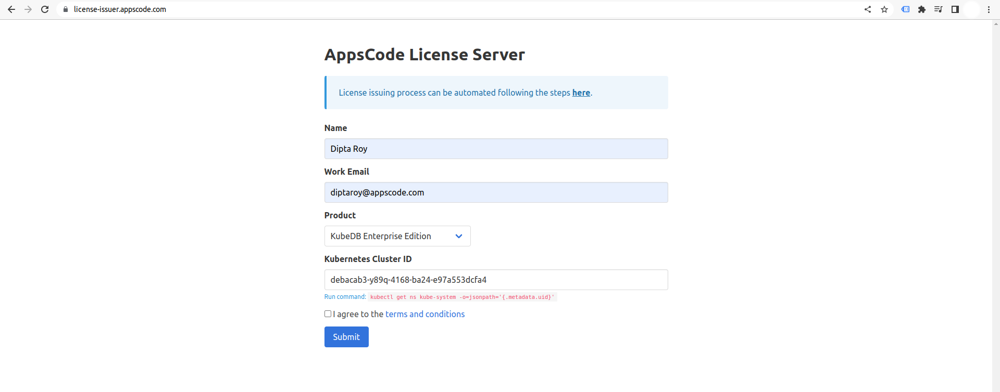

## Overview

KubeDB is the Kubernetes Native Database Management Solution which simplifies and automates routine database tasks such as Provisioning, Monitoring, Upgrading, Patching, Scaling, Volume Expansion, Backup, Recovery, Failure detection, and Repair for various popular databases on private and public clouds. The databases that KubeDB supports are MongoDB, Elasticsearch, Kafka, MySQL, MariaDB, Redis, PostgreSQL, ProxySQL, Percona XtraDB, Memcached and PgBouncer. You can find the guides to all the supported databases in [KubeDB](https://kubedb.com/). In this tutorial we will deploy and manage Percona XtraDB in Google Kubernetes Engine (GKE). We will cover the following steps:

1) Install KubeDB
2) Deploy Percona XtraDB Clustered Database
3) Horizontal Scaling of Percona XtraDB Database
4) Vertical Scaling of Percona XtraDB Database

### Get Cluster ID

We need the cluster ID to get the KubeDB License.
To get cluster ID we can run the following command:

```bash
$ kubectl get ns kube-system -o jsonpath='{.metadata.uid}'
debacab3-y89q-4168-ba24-e97a553dcfa4
```

### Get License

Go to [Appscode License Server](https://license-issuer.appscode.com/) to get the license.txt file. For this tutorial we will use KubeDB Enterprise Edition.



### Install KubeDB

We will use helm to install KubeDB. Please install helm [here](https://helm.sh/docs/intro/install/) if it is not already installed.
Now, let's install `KubeDB`.

```bash
$ helm repo add appscode https://charts.appscode.com/stable/
$ helm repo update

$ helm search repo appscode/kubedb
NAME                              	CHART VERSION	APP VERSION	DESCRIPTION                                       
appscode/kubedb                   	v2023.04.10  	v2023.04.10	KubeDB by AppsCode - Production ready databases...
appscode/kubedb-autoscaler        	v0.18.0      	v0.18.1    	KubeDB Autoscaler by AppsCode - Autoscale KubeD...
appscode/kubedb-catalog           	v2023.04.10  	v2023.04.10	KubeDB Catalog by AppsCode - Catalog for databa...
appscode/kubedb-community         	v0.24.2      	v0.24.2    	KubeDB Community by AppsCode - Community featur...
appscode/kubedb-crds              	v2023.04.10  	v2023.04.10	KubeDB Custom Resource Definitions                
appscode/kubedb-dashboard         	v0.9.0       	v0.9.1     	KubeDB Dashboard by AppsCode                      
appscode/kubedb-enterprise        	v0.11.2      	v0.11.2    	KubeDB Enterprise by AppsCode - Enterprise feat...
appscode/kubedb-grafana-dashboards	v2023.04.10  	v2023.04.10	A Helm chart for kubedb-grafana-dashboards by A...
appscode/kubedb-metrics           	v2023.04.10  	v2023.04.10	KubeDB State Metrics                              
appscode/kubedb-one               	v2023.04.10  	v2023.04.10	KubeDB and Stash by AppsCode - Production ready...
appscode/kubedb-ops-manager       	v0.20.0      	v0.20.1    	KubeDB Ops Manager by AppsCode - Enterprise fea...
appscode/kubedb-opscenter         	v2023.04.10  	v2023.04.10	KubeDB Opscenter by AppsCode                      
appscode/kubedb-provisioner       	v0.33.0      	v0.33.1    	KubeDB Provisioner by AppsCode - Community feat...
appscode/kubedb-schema-manager    	v0.9.0       	v0.9.1     	KubeDB Schema Manager by AppsCode                 
appscode/kubedb-ui                	v2023.03.23  	0.3.28     	A Helm chart for Kubernetes                       
appscode/kubedb-ui-server         	v2021.12.21  	v2021.12.21	A Helm chart for kubedb-ui-server by AppsCode     
appscode/kubedb-webhook-server    	v0.9.0       	v0.9.1     	KubeDB Webhook Server by AppsCode   

# Install KubeDB Enterprise operator chart
$ helm install kubedb appscode/kubedb \
  --version v2023.04.10 \
  --namespace kubedb --create-namespace \
  --set kubedb-provisioner.enabled=true \
  --set kubedb-ops-manager.enabled=true \
  --set kubedb-autoscaler.enabled=true \
  --set kubedb-dashboard.enabled=true \
  --set kubedb-schema-manager.enabled=true \
  --set-file global.license=/path/to/the/license.txt
```

Let's verify the installation:

```bash
$ watch kubectl get pods --all-namespaces -l "app.kubernetes.io/instance=kubedb"
NAMESPACE   NAME                                            READY   STATUS    RESTARTS      AGE
kubedb      kubedb-kubedb-autoscaler-68b74668f4-g9hbt       1/1     Running   0             3m
kubedb      kubedb-kubedb-dashboard-7f6865f9c-hj2fb         1/1     Running   0             3m
kubedb      kubedb-kubedb-ops-manager-546b56cf64-5wgrk      1/1     Running   0             3m
kubedb      kubedb-kubedb-provisioner-d98f8874d-z2wd7       1/1     Running   0             3m
kubedb      kubedb-kubedb-schema-manager-d988889fd-x2mx7    1/1     Running   0             3m
kubedb      kubedb-kubedb-webhook-server-5f999cf9f5-rfsss   1/1     Running   0             3m

```

We can list the CRD Groups that have been registered by the operator by running the following command:

```bash
$ kubectl get crd -l app.kubernetes.io/name=kubedb
NAME                                              CREATED AT
elasticsearchautoscalers.autoscaling.kubedb.com   2023-06-09T06:14:05Z
elasticsearchdashboards.dashboard.kubedb.com      2023-06-09T06:13:54Z
elasticsearches.kubedb.com                        2023-06-09T06:13:54Z
elasticsearchopsrequests.ops.kubedb.com           2023-06-09T06:14:43Z
elasticsearchversions.catalog.kubedb.com          2023-06-09T06:11:10Z
etcds.kubedb.com                                  2023-06-09T06:14:35Z
etcdversions.catalog.kubedb.com                   2023-06-09T06:11:10Z
kafkas.kubedb.com                                 2023-06-09T06:15:15Z
kafkaversions.catalog.kubedb.com                  2023-06-09T06:11:11Z
mariadbautoscalers.autoscaling.kubedb.com         2023-06-09T06:14:20Z
mariadbdatabases.schema.kubedb.com                2023-06-09T06:14:31Z
mariadbopsrequests.ops.kubedb.com                 2023-06-09T06:16:57Z
mariadbs.kubedb.com                               2023-06-09T06:14:32Z
mariadbversions.catalog.kubedb.com                2023-06-09T06:11:11Z
memcacheds.kubedb.com                             2023-06-09T06:14:42Z
memcachedversions.catalog.kubedb.com              2023-06-09T06:11:11Z
mongodbautoscalers.autoscaling.kubedb.com         2023-06-09T06:14:20Z
mongodbdatabases.schema.kubedb.com                2023-06-09T06:13:58Z
mongodbopsrequests.ops.kubedb.com                 2023-06-09T06:14:56Z
mongodbs.kubedb.com                               2023-06-09T06:14:00Z
mongodbversions.catalog.kubedb.com                2023-06-09T06:11:12Z
mysqlautoscalers.autoscaling.kubedb.com           2023-06-09T06:14:25Z
mysqldatabases.schema.kubedb.com                  2023-06-09T06:13:55Z
mysqlopsrequests.ops.kubedb.com                   2023-06-09T06:16:49Z
mysqls.kubedb.com                                 2023-06-09T06:13:57Z
mysqlversions.catalog.kubedb.com                  2023-06-09T06:11:12Z
perconaxtradbautoscalers.autoscaling.kubedb.com   2023-06-09T06:14:31Z
perconaxtradbopsrequests.ops.kubedb.com           2023-06-09T06:18:59Z
perconaxtradbs.kubedb.com                         2023-06-09T06:14:58Z
perconaxtradbversions.catalog.kubedb.com          2023-06-09T06:11:12Z
pgbouncers.kubedb.com                             2023-06-09T06:14:59Z
pgbouncerversions.catalog.kubedb.com              2023-06-09T06:11:13Z
postgresautoscalers.autoscaling.kubedb.com        2023-06-09T06:14:31Z
postgresdatabases.schema.kubedb.com               2023-06-09T06:14:20Z
postgreses.kubedb.com                             2023-06-09T06:14:25Z
postgresopsrequests.ops.kubedb.com                2023-06-09T06:18:45Z
postgresversions.catalog.kubedb.com               2023-06-09T06:11:13Z
proxysqlautoscalers.autoscaling.kubedb.com        2023-06-09T06:14:31Z
proxysqlopsrequests.ops.kubedb.com                2023-06-09T06:18:54Z
proxysqls.kubedb.com                              2023-06-09T06:15:06Z
proxysqlversions.catalog.kubedb.com               2023-06-09T06:11:13Z
publishers.postgres.kubedb.com                    2023-06-09T06:21:40Z
redisautoscalers.autoscaling.kubedb.com           2023-06-09T06:14:31Z
redises.kubedb.com                                2023-06-09T06:15:12Z
redisopsrequests.ops.kubedb.com                   2023-06-09T06:18:38Z
redissentinelautoscalers.autoscaling.kubedb.com   2023-06-09T06:14:32Z
redissentinelopsrequests.ops.kubedb.com           2023-06-09T06:20:39Z
redissentinels.kubedb.com                         2023-06-09T06:15:12Z
redisversions.catalog.kubedb.com                  2023-06-09T06:11:14Z
subscribers.postgres.kubedb.com                   2023-06-09T06:21:49Z
```

## Deploy Percona XtraDB Clustered Database

Now, we are going to Deploy Percona XtraDB using KubeDB.
Let's create a Namespace in which we will deploy the database.

```bash
$ kubectl create namespace demo
namespace/demo created
```

Here is the yaml of the Percona XtraDB CRO we are going to use:

```yaml
apiVersion: kubedb.com/v1alpha2
kind: PerconaXtraDB
metadata:
  name: percona-cluster
  namespace: demo
spec:
  version: "8.0.31"
  replicas: 3
  storageType: Durable
  storage:
    storageClassName: "standard"
    accessModes:
    - ReadWriteOnce
    resources:
      requests:
        storage: 500Mi
  terminationPolicy: WipeOut
```

Let's save this yaml configuration into `percona-cluster.yaml` 
Then create the above Percona XtraDB CRO

```bash
$ kubectl apply -f percona-cluster.yaml 
perconaxtradb.kubedb.com/percona-cluster created
```

* In this yaml we can see in the `spec.version` field specifies the version of Percona XtraDB. Here, we are using Percona XtraDB `version 8.0.31`. You can list the KubeDB supported versions of Percona XtraDB by running `$ kubectl get perconaxtradbversions` command.
* `spec.storage` specifies PVC spec that will be dynamically allocated to store data for this database. This storage spec will be passed to the StatefulSet created by KubeDB operator to run database pods. You can specify any StorageClass available in your cluster with appropriate resource requests.
* And the `spec.terminationPolicy` field is *Wipeout* means that the database will be deleted without restrictions. It can also be "Halt", "Delete" and "DoNotTerminate". Learn More about these [HERE](https://kubedb.com/docs/latest/guides/percona-xtradb/concepts/percona-xtradb/#specterminationpolicy).

Once these are handled correctly and the Percona XtraDB object is deployed, you will see that the following objects are created:

```bash
$ kubectl get all -n demo
NAME                    READY   STATUS    RESTARTS   AGE
pod/percona-cluster-0   2/2     Running   0          2m54s
pod/percona-cluster-1   2/2     Running   0          2m54s
pod/percona-cluster-2   2/2     Running   0          2m54s

NAME                           TYPE        CLUSTER-IP     EXTERNAL-IP   PORT(S)    AGE
service/percona-cluster        ClusterIP   10.0.226.174   <none>        3306/TCP   2m56s
service/percona-cluster-pods   ClusterIP   None           <none>        3306/TCP   2m56s

NAME                               READY   AGE
statefulset.apps/percona-cluster   3/3     2m56s

NAME                                                 TYPE                       VERSION   AGE
appbinding.appcatalog.appscode.com/percona-cluster   kubedb.com/perconaxtradb   8.0.31    2m57s

NAME                                       VERSION   STATUS   AGE
perconaxtradb.kubedb.com/percona-cluster   8.0.31    Ready    3m12s
```
Let’s check if the database is ready to use,

```bash
$ kubectl get perconaxtradb -n demo percona-cluster
NAME              VERSION   STATUS   AGE
percona-cluster   8.0.31    Ready    3m12s
```
> We have successfully deployed Percona XtraDB in GKE. Now we can exec into the container to use the database.

### Accessing Database Through CLI

To access the database through CLI, we have to get the credentials to access.
KubeDB will create `Secret` and `Service` for the database `percona-cluster` that we have deployed. Let’s check them using the following commands,

```bash
$ kubectl get secret -n demo -l=app.kubernetes.io/instance=percona-cluster
NAME                          TYPE                       DATA   AGE
percona-cluster-auth          kubernetes.io/basic-auth   2      3m57s
percona-cluster-monitor       kubernetes.io/basic-auth   2      3m56s
percona-cluster-replication   kubernetes.io/basic-auth   2      3m56s


$ kubectl get service -n demo -l=app.kubernetes.io/instance=percona-cluster
NAME                   TYPE        CLUSTER-IP     EXTERNAL-IP   PORT(S)    AGE
percona-cluster        ClusterIP   10.0.226.174   <none>        3306/TCP   4m12s
percona-cluster-pods   ClusterIP   None           <none>        3306/TCP   4m12s
```
Now, we are going to use `percona-cluster-auth` to get the credentials.

```bash
$ kubectl get secrets -n demo percona-cluster-auth -o jsonpath='{.data.username}' | base64 -d
root

$ kubectl get secrets -n demo percona-cluster-auth -o jsonpath='{.data.password}' | base64 -d
iqaZfUmI(1~bV;fs
```

#### Insert Sample Data

In this section, we are going to login into our Percona XtraDB database pod and insert some sample data. 

```bash
$ kubectl exec -it percona-cluster-0 -n demo -c perconaxtradb -- bash
bash-4.4$  mysql --user=root --password='iqaZfUmI(1~bV;fs'
Welcome to the MySQL monitor.  Commands end with ; or \g.

Type 'help;' or '\h' for help. Type '\c' to clear the current input statement.

mysql> CREATE DATABASE Music;
Query OK, 1 row affected (0.03 sec)

mysql> SHOW DATABASES;
+--------------------+
| Database           |
+--------------------+
| Music              |
| information_schema |
| kubedb_system      |
| mysql              |
| performance_schema |
| sys                |
+--------------------+
6 rows in set (0.01 sec)

mysql> CREATE TABLE Music.Artist (id INT(6) UNSIGNED AUTO_INCREMENT PRIMARY KEY, Name VARCHAR(50), Song VARCHAR(50));
Query OK, 0 rows affected, 1 warning (0.08 sec)

mysql> INSERT INTO Music.Artist (Name, Song) VALUES ("John Denver", "Country Roads");
Query OK, 1 row affected (0.01 sec)

mysql>  SELECT * FROM Music.Artist;
+----+-------------+---------------+
| id | Name        | Song          |
+----+-------------+---------------+
|  1 | John Denver | Country Roads |
+----+-------------+---------------+
1 row in set (0.00 sec)

mysql> exit
Bye
```

> We've successfully inserted some sample data to our database. More information about Run & Manage Production-Grade Percona XtraDB Database on Kubernetes can be found [Percona XtraDB Kubernetes](https://kubedb.com/kubernetes/databases/run-and-manage-percona-xtradb-on-kubernetes/)

## Horizontal Scaling of Percona XtraDB Cluster

### Scale Up Replicas

Here, we are going to scale up the replicas of the Percona XtraDB cluster replicaset to meet the desired number of replicas after scaling.

Before applying Horizontal Scaling, let's check the current number of replicas,

```bash
$ kubectl get perconaxtradb -n demo percona-cluster -o json | jq '.spec.replicas'
3
```

Let’s connect to a Percona XtraDB instance and run this command to check the number of replicas,

```bash
$ kubectl exec -it percona-cluster-0 -n demo -c perconaxtradb -- bash
bash-4.4$  mysql --user=root --password='iqaZfUmI(1~bV;fs'
Welcome to the MySQL monitor.  Commands end with ; or \g.

Type 'help;' or '\h' for help. Type '\c' to clear the current input statement.

mysql> SHOW STATUS LIKE 'wsrep_cluster_size';
+--------------------+-------+
| Variable_name      | Value |
+--------------------+-------+
| wsrep_cluster_size | 3     |
+--------------------+-------+
1 row in set (0.00 sec)

mysql> exit
Bye
```


### Create PerconaXtraDBOpsRequest

In order to scale up the replicas of the replicaset of the database, we have to create a `PerconaXtraDBOpsRequest` CR with our desired replicas. Let’s create it using this following yaml,

```yaml
apiVersion: ops.kubedb.com/v1alpha1
kind: PerconaXtraDBOpsRequest
metadata:
  name: horizontal-scale-up
  namespace: demo
spec:
  type: HorizontalScaling
  databaseRef:
    name: percona-cluster
  horizontalScaling:
    member : 5
```
Here,

- `spec.databaseRef.name` specifies that we are performing horizontal scaling operation on `percona-cluster` database.
- `spec.type` specifies that we are performing `HorizontalScaling` on our database.
- `spec.horizontalScaling.member` specifies the desired replicas after scaling.

Let’s save this yaml configuration into `horizontal-scale-up.yaml` and apply it,

```bash
$ kubectl apply -f horizontal-scale-up.yaml 
perconaxtradbopsrequest.ops.kubedb.com/horizontal-scale-up created
```

Let’s wait for `PerconaXtraDBOpsRequest` `STATUS` to be Successful. Run the following command to watch `PerconaXtraDBOpsRequest` CR,

```bash
$ watch kubectl get perconaxtradbopsrequest -n demo
NAME                  TYPE                STATUS       AGE
horizontal-scale-up   HorizontalScaling   Successful   3m33s
```

We can see from the above output that the `PerconaXtraDBOpsRequest` has succeeded. Now, we are going to verify the number of replicas,

```bash
$ kubectl get perconaxtradb -n demo percona-cluster -o json | jq '.spec.replicas'
5
```

Let’s connect to a Percona XtraDB instance and run this command to check the number of replicas,

```bash
$ kubectl exec -it percona-cluster-0 -n demo -c perconaxtradb -- bash
bash-4.4$  mysql --user=root --password='iqaZfUmI(1~bV;fs'
Welcome to the MySQL monitor.  Commands end with ; or \g.

Type 'help;' or '\h' for help. Type '\c' to clear the current input statement.

mysql> SHOW STATUS LIKE 'wsrep_cluster_size';
+--------------------+-------+
| Variable_name      | Value |
+--------------------+-------+
| wsrep_cluster_size | 5     |
+--------------------+-------+
1 row in set (0.00 sec)

mysql> exit
Bye
```

From all the above outputs we can see that the replicas of the cluster is now increased to 5. That means we have successfully scaled up the replicas of the Percona XtraDB replicaset.

### Scale Down Replicas

Here, we are going to scale down the replicas of the cluster to meet the desired number of replicas after scaling.

#### Create PerconaXtraDBOpsRequest

In order to scale down the cluster of the database, we need to create a `PerconaXtraDBOpsRequest` CR with our desired replicas. Let’s create it using this following yaml,

```yaml
apiVersion: ops.kubedb.com/v1alpha1
kind: PerconaXtraDBOpsRequest
metadata:
  name: horizontal-scale-down
  namespace: demo
spec:
  type: HorizontalScaling
  databaseRef:
    name: percona-cluster
  horizontalScaling:
    member : 3
```

Here,

- `spec.databaseRef.name` specifies that we are performing horizontal scaling operation on `percona-cluster` database.
- `spec.type` specifies that we are performing `HorizontalScaling` on our database.
- `spec.horizontalScaling.member` specifies the desired replicas after scaling.

Let’s save this yaml configuration into `horizontal-scale-down.yaml` and apply it,

```bash
$ kubectl apply -f horizontal-scale-down.yaml
perconaxtradbopsrequest.ops.kubedb.com/horizontal-scale-down created
```

Let’s wait for `PerconaXtraDBOpsRequest` `STATUS` to be Successful. Run the following command to watch `PerconaXtraDBOpsRequest` CR,

```bash
$ watch kubectl get perconaxtradbopsrequest -n demo
NAME                    TYPE                STATUS       AGE
horizontal-scale-down   HorizontalScaling   Successful   3m39s
```

We can see from the above output that the `PerconaXtraDBOpsRequest` has succeeded. Now, we are going to verify the number of replicas,

```bash
$ kubectl get perconaxtradb -n demo percona-cluster -o json | jq '.spec.replicas'
3
```

Let’s connect to a Percona XtraDB instance and run this command to check the number of replicas,

```bash
$ kubectl exec -it percona-cluster-0 -n demo -c perconaxtradb -- bash
bash-4.4$  mysql --user=root --password='iqaZfUmI(1~bV;fs'
Welcome to the MySQL monitor.  Commands end with ; or \g.


Type 'help;' or '\h' for help. Type '\c' to clear the current input statement.

mysql> SHOW STATUS LIKE 'wsrep_cluster_size';
+--------------------+-------+
| Variable_name      | Value |
+--------------------+-------+
| wsrep_cluster_size | 3     |
+--------------------+-------+
1 row in set (0.00 sec)

mysql> exit
Bye
```
> From all the above outputs we can see that the replicas of the cluster is decreased to 3. That means we have successfully scaled down the replicas of the Percona XtraDB replicaset.


## Vetical Scaling of Percona XtraDB Cluster

Here, we are going to scale up the current cpu resource of the Percona XtraDB cluster by applying Vertical Scaling.
Before applying it, let's check the current resources,

```bash
$ kubectl get pod -n demo percona-cluster-0 -o json | jq '.spec.containers[].resources'
{
  "limits": {
    "memory": "1Gi"
  },
  "requests": {
    "cpu": "500m",
    "memory": "1Gi"
  }
}
```

#### Create PerconaXtraDBOpsRequest

In order to update the resources of the database, we have to create a `PerconaXtraDBOpsRequest` CR with our desired resources. Let’s create it using this following yaml,

```yaml
apiVersion: ops.kubedb.com/v1alpha1
kind: PerconaXtraDBOpsRequest
metadata:
  name: vertical-scale
  namespace: demo
spec:
  type: VerticalScaling
  databaseRef:
    name: percona-cluster
  verticalScaling:
    perconaxtradb:
      requests:
        memory: "1.5Gi"
        cpu: "0.7"
      limits:
        memory: "1.5Gi"
        cpu: "0.7"
```
Here,

- `spec.databaseRef.name` specifies that we are performing vertical scaling operation on `percona-cluster` database.
- `spec.type` specifies that we are performing `VerticalScaling` on our database.
- `spec.VerticalScaling.perconaxtradb` specifies the desired resources after scaling.

Let’s save this yaml configuration into `vertical-scale.yaml` and apply it,

```bash
$ kubectl apply -f vertical-scale.yaml 
perconaxtradbopsrequest.ops.kubedb.com/vertical-scale created
```

Let’s wait for `PerconaXtraDBOpsRequest` `STATUS` to be Successful. Run the following command to watch `PerconaXtraDBOpsRequest` CR,

```bash
$ kubectl get perconaxtradbopsrequest -n demo
NAME                    TYPE                STATUS       AGE
vertical-scale          VerticalScaling     Successful   4m11s
```

We can see from the above output that the `PerconaXtraDBOpsRequest` has succeeded. Now, we are going to verify from one of the Pod yaml whether the resources of the database has updated to meet up the desired state. Let’s check with the following command,

```bash
$ kubectl get pod -n demo percona-cluster-0 -o json | jq '.spec.containers[].resources'
{
  "limits": {
    "cpu": "700m",
    "memory": "1536Mi"
  },
  "requests": {
    "cpu": "700m",
    "memory": "1536Mi"
  }
}
```
> The above output verifies that we have successfully scaled up the resources of the Percona XtraDB database.


We have made an in depth tutorial on Managing Percona XtraDB Cluster Day-2 Operations by using KubeDB. You can have a look into the video below:

<iframe width="560" height="315" src="https://www.youtube.com/embed/PsMbpDHg_oU" title="YouTube video player" frameborder="0" allow="accelerometer; autoplay; clipboard-write; encrypted-media; gyroscope; picture-in-picture" allowfullscreen></iframe>

## Support

To speak with us, please leave a message on [our website](https://appscode.com/contact/).

To receive product announcements, follow us on [Twitter](https://twitter.com/KubeDB).

To watch tutorials of various Production-Grade Kubernetes Tools Subscribe our [YouTube](https://www.youtube.com/c/AppsCodeInc/) channel.

More about [Percona XtraDB in Kubernetes](https://kubedb.com/kubernetes/databases/run-and-manage-percona-xtradb-on-kubernetes/)

If you have found a bug with KubeDB or want to request for new features, please [file an issue](https://github.com/kubedb/project/issues/new).
