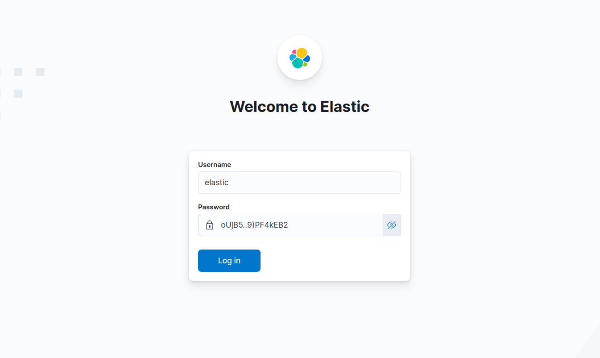
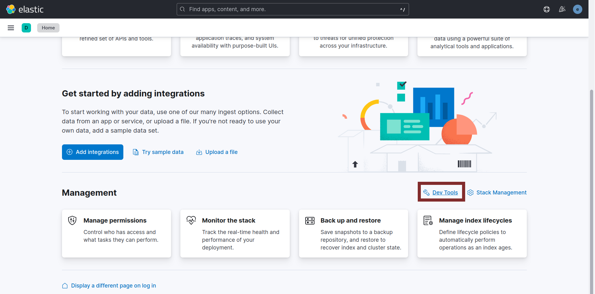
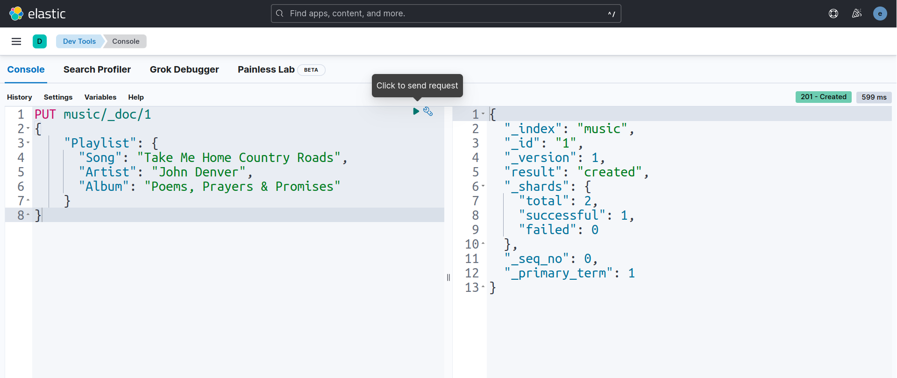
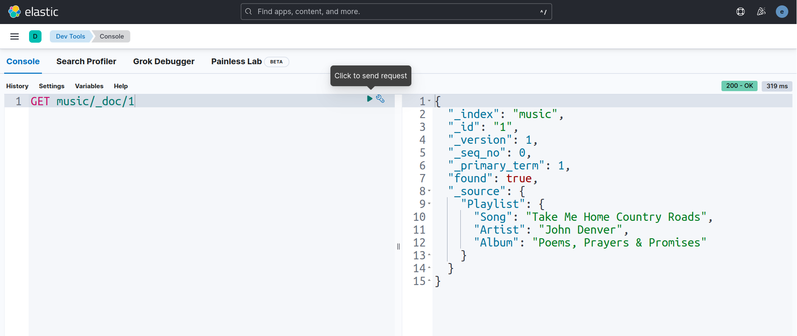
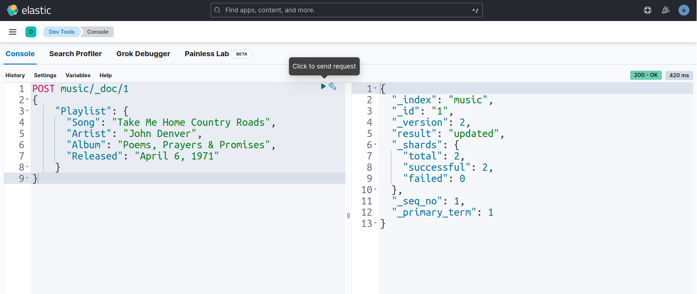
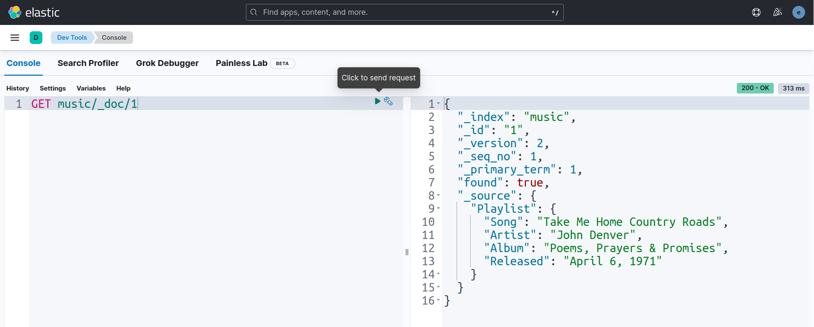

## Overview

KubeDB is the Kubernetes Native Database Management Solution which simplifies and automates routine database tasks such as Provisioning, Monitoring, Upgrading, Patching, Scaling, Volume Expansion, Backup, Recovery, Failure detection, and Repair for various popular databases on private and public clouds. The databases that KubeDB supports are Elasticsearch, Kafka, MySQL, MongoDB, MariaDB, Redis, PostgreSQL, ProxySQL, Percona XtraDB, Memcached and PgBouncer. You can find the guides to all the supported databases in [KubeDB](https://kubedb.com/). KubeDB provides support not only for the official [Elasticsearch](https://www.elastic.co/) by Elastic and [OpenSearch](https://opensearch.org/) by AWS, but also other open source distributions like [SearchGuard](https://search-guard.com/) and [OpenDistro](https://opendistro.github.io/for-elasticsearch/). **KubeDB provides all of these distribution's support under the Elasticsearch CR of KubeDB**.
In this tutorial we will Deploy Elasticsearch and Kibana in Azure Kubernetes Service (AKS). We will cover the following steps:

1) Install KubeDB
2) Deploy Elasticsearch Topology Cluster
3) Deploy Kibana
4) Read/Write Data through Kibana


### Get Cluster ID

We need the cluster ID to get the KubeDB License.
To get cluster ID, we can run the following command:

```bash
$ kubectl get ns kube-system -o jsonpath='{.metadata.uid}'
8e336615-0dbb-4ae8-b72f-2e7ec34c399d
```

### Get License

Go to [Appscode License Server](https://license-issuer.appscode.com/) to get the license.txt file. For this tutorial we will use KubeDB Enterprise Edition.


### Install KubeDB

We will use helm to install KubeDB. Please install helm [here](https://helm.sh/docs/intro/install/) if it is not already installed.
Now, let's install `KubeDB`.

```bash
$ helm repo add appscode https://charts.appscode.com/stable/
$ helm repo update

$ helm search repo appscode/kubedb
NAME                              	CHART VERSION	APP VERSION	DESCRIPTION                                       
appscode/kubedb                   	v2023.04.10  	v2023.04.10	KubeDB by AppsCode - Production ready databases...
appscode/kubedb-autoscaler        	v0.18.0      	v0.18.1    	KubeDB Autoscaler by AppsCode - Autoscale KubeD...
appscode/kubedb-catalog           	v2023.04.10  	v2023.04.10	KubeDB Catalog by AppsCode - Catalog for databa...
appscode/kubedb-community         	v0.24.2      	v0.24.2    	KubeDB Community by AppsCode - Community featur...
appscode/kubedb-crds              	v2023.04.10  	v2023.04.10	KubeDB Custom Resource Definitions                
appscode/kubedb-dashboard         	v0.9.0       	v0.9.1     	KubeDB Dashboard by AppsCode                      
appscode/kubedb-enterprise        	v0.11.2      	v0.11.2    	KubeDB Enterprise by AppsCode - Enterprise feat...
appscode/kubedb-grafana-dashboards	v2023.04.10  	v2023.04.10	A Helm chart for kubedb-grafana-dashboards by A...
appscode/kubedb-metrics           	v2023.04.10  	v2023.04.10	KubeDB State Metrics                              
appscode/kubedb-one               	v2023.04.10  	v2023.04.10	KubeDB and Stash by AppsCode - Production ready...
appscode/kubedb-ops-manager       	v0.20.0      	v0.20.1    	KubeDB Ops Manager by AppsCode - Enterprise fea...
appscode/kubedb-opscenter         	v2023.04.10  	v2023.04.10	KubeDB Opscenter by AppsCode                      
appscode/kubedb-provisioner       	v0.33.0      	v0.33.1    	KubeDB Provisioner by AppsCode - Community feat...
appscode/kubedb-schema-manager    	v0.9.0       	v0.9.1     	KubeDB Schema Manager by AppsCode                 
appscode/kubedb-ui                	v2023.03.23  	0.3.28     	A Helm chart for Kubernetes                       
appscode/kubedb-ui-server         	v2021.12.21  	v2021.12.21	A Helm chart for kubedb-ui-server by AppsCode     
appscode/kubedb-webhook-server    	v0.9.0       	v0.9.1     	KubeDB Webhook Server by AppsCode    

# Install KubeDB Enterprise operator chart
$ helm install kubedb appscode/kubedb \
  --version v2023.04.10 \
  --namespace kubedb --create-namespace \
  --set kubedb-provisioner.enabled=true \
  --set kubedb-ops-manager.enabled=true \
  --set kubedb-autoscaler.enabled=true \
  --set kubedb-dashboard.enabled=true \
  --set kubedb-schema-manager.enabled=true \
  --set-file global.license=/path/to/the/license.txt
```

Let's verify the installation:

```bash
$ kubectl get pods --all-namespaces -l "app.kubernetes.io/instance=kubedb"
NAMESPACE   NAME                                            READY   STATUS    RESTARTS   AGE
kubedb      kubedb-kubedb-autoscaler-56d655557f-g6gmt       1/1     Running   0          2m7s
kubedb      kubedb-kubedb-dashboard-7c867ffd67-s5rhn        1/1     Running   0          2m7s
kubedb      kubedb-kubedb-ops-manager-5cd864fdc8-lq6ft      1/1     Running   0          2m7s
kubedb      kubedb-kubedb-provisioner-86f7b7b7cf-flh86      1/1     Running   0          2m7s
kubedb      kubedb-kubedb-schema-manager-6c67df98db-4q9qx   1/1     Running   0          2m7s
kubedb      kubedb-kubedb-webhook-server-6dc774cd9f-pwrcv   1/1     Running   0          2m7s
```

We can list the CRD Groups that have been registered by the operator by running the following command:

```bash
$ kubectl get crd -l app.kubernetes.io/name=kubedb
NAME                                              CREATED AT
elasticsearchautoscalers.autoscaling.kubedb.com   2023-05-19T08:56:17Z
elasticsearchdashboards.dashboard.kubedb.com      2023-05-19T08:56:17Z
elasticsearches.kubedb.com                        2023-05-19T08:56:17Z
elasticsearchopsrequests.ops.kubedb.com           2023-05-19T08:56:21Z
elasticsearchversions.catalog.kubedb.com          2023-05-19T08:53:33Z
etcds.kubedb.com                                  2023-05-19T08:56:19Z
etcdversions.catalog.kubedb.com                   2023-05-19T08:53:34Z
kafkas.kubedb.com                                 2023-05-19T08:56:21Z
kafkaversions.catalog.kubedb.com                  2023-05-19T08:53:34Z
mariadbautoscalers.autoscaling.kubedb.com         2023-05-19T08:56:17Z
mariadbdatabases.schema.kubedb.com                2023-05-19T08:56:23Z
mariadbopsrequests.ops.kubedb.com                 2023-05-19T08:56:36Z
mariadbs.kubedb.com                               2023-05-19T08:56:19Z
mariadbversions.catalog.kubedb.com                2023-05-19T08:53:34Z
memcacheds.kubedb.com                             2023-05-19T08:56:19Z
memcachedversions.catalog.kubedb.com              2023-05-19T08:53:34Z
mongodbautoscalers.autoscaling.kubedb.com         2023-05-19T08:56:17Z
mongodbdatabases.schema.kubedb.com                2023-05-19T08:56:21Z
mongodbopsrequests.ops.kubedb.com                 2023-05-19T08:56:25Z
mongodbs.kubedb.com                               2023-05-19T08:56:19Z
mongodbversions.catalog.kubedb.com                2023-05-19T08:53:35Z
mysqlautoscalers.autoscaling.kubedb.com           2023-05-19T08:56:17Z
mysqldatabases.schema.kubedb.com                  2023-05-19T08:56:20Z
mysqlopsrequests.ops.kubedb.com                   2023-05-19T08:56:33Z
mysqls.kubedb.com                                 2023-05-19T08:56:20Z
mysqlversions.catalog.kubedb.com                  2023-05-19T08:53:35Z
perconaxtradbautoscalers.autoscaling.kubedb.com   2023-05-19T08:56:17Z
perconaxtradbopsrequests.ops.kubedb.com           2023-05-19T08:56:50Z
perconaxtradbs.kubedb.com                         2023-05-19T08:56:20Z
perconaxtradbversions.catalog.kubedb.com          2023-05-19T08:53:35Z
pgbouncers.kubedb.com                             2023-05-19T08:56:20Z
pgbouncerversions.catalog.kubedb.com              2023-05-19T08:53:36Z
postgresautoscalers.autoscaling.kubedb.com        2023-05-19T08:56:18Z
postgresdatabases.schema.kubedb.com               2023-05-19T08:56:23Z
postgreses.kubedb.com                             2023-05-19T08:56:20Z
postgresopsrequests.ops.kubedb.com                2023-05-19T08:56:43Z
postgresversions.catalog.kubedb.com               2023-05-19T08:53:36Z
proxysqlautoscalers.autoscaling.kubedb.com        2023-05-19T08:56:18Z
proxysqlopsrequests.ops.kubedb.com                2023-05-19T08:56:46Z
proxysqls.kubedb.com                              2023-05-19T08:56:21Z
proxysqlversions.catalog.kubedb.com               2023-05-19T08:53:36Z
publishers.postgres.kubedb.com                    2023-05-19T08:56:59Z
redisautoscalers.autoscaling.kubedb.com           2023-05-19T08:56:18Z
redises.kubedb.com                                2023-05-19T08:56:21Z
redisopsrequests.ops.kubedb.com                   2023-05-19T08:56:39Z
redissentinelautoscalers.autoscaling.kubedb.com   2023-05-19T08:56:18Z
redissentinelopsrequests.ops.kubedb.com           2023-05-19T08:56:53Z
redissentinels.kubedb.com                         2023-05-19T08:56:21Z
redisversions.catalog.kubedb.com                  2023-05-19T08:53:37Z
subscribers.postgres.kubedb.com                   2023-05-19T08:57:03Z
```

## Deploy Elasticsearch Topology Cluster

We are going to use the KubeDB-provided Custom Resource object Elasticsearch for deployment. The object will be deployed in demo namespace. So, let’s create the namespace first.

```bash
$ kubectl create namespace demo
namespace/demo created
```
Here is the yaml of Elasticsearch we are going to use:

```yaml
apiVersion: kubedb.com/v1alpha2
kind: Elasticsearch
metadata:
  name: es-cluster
  namespace: demo
spec:
  enableSSL: true 
  version: xpack-8.5.2 
  storageType: Durable
  topology:
    master:
      replicas: 2
      resources:
      storage:
        storageClassName: "default"
        accessModes:
        - ReadWriteOnce
        resources:
          requests:
            storage: 1Gi
    data:
      replicas: 2
      resources:
      storage:
        storageClassName: "default"
        accessModes:
        - ReadWriteOnce
        resources:
          requests:
            storage: 1Gi
    ingest:
      replicas: 2
      resources:
      storage:
        storageClassName: "default"
        accessModes:
        - ReadWriteOnce
        resources:
          requests:
            storage: 1Gi
  terminationPolicy: WipeOut

```

Here,

* `spec.version` - is the name of the ElasticsearchVersion CR. Here, we are using Elasticsearch version `xpack-8.5.2` of Elasticsearch distribution.
* `spec.enableSSL` - specifies whether the HTTP layer is secured with certificates or not.
* `spec.storageType` - specifies the type of storage that will be used for Elasticsearch database. It can be `Durable` or `Ephemeral`. The default value of this field is `Durable`. If `Ephemeral` is used then KubeDB will create the Elasticsearch database using `EmptyDir` volume. In this case, you don't have to specify `spec.storage` field. This is useful for testing purposes.
* `spec.topology` - specifies the node-specific properties for the Elasticsearch cluster.
* `spec.terminationPolicy` field is *Wipeout* means that the database will be deleted without restrictions. It can also be “Halt”, “Delete” and “DoNotTerminate”. Learn More about these checkout [Termination Policy](https://kubedb.com/docs/latest/guides/elasticsearch/concepts/elasticsearch/#specterminationpolicy).

Let's deploy the above yaml by the following command:

```bash
$ kubectl apply -f es-cluster.yaml
elasticsearch.kubedb.com/es-cluster created
```
However, KubeDB also provides dedicated node support for other node roles like `data_hot`, `data_warm`, `data_cold`, `data_frozen`, `transform`, `coordinating`, `data_content` and `ml` for [Topology clustering](https://kubedb.com/docs/latest/guides/elasticsearch/clustering/topology-cluster/hot-warm-cold-cluster/).

Once these are handled correctly and the Elasticsearch object is deployed, you will see that the following resources are created:

```bash
$ kubectl get all -n demo
NAME                      READY   STATUS    RESTARTS   AGE
pod/es-cluster-data-0     1/1     Running   0          2m45s
pod/es-cluster-data-1     1/1     Running   0          2m2s
pod/es-cluster-ingest-0   1/1     Running   0          2m46s
pod/es-cluster-ingest-1   1/1     Running   0          85s
pod/es-cluster-master-0   1/1     Running   0          2m45s
pod/es-cluster-master-1   1/1     Running   0          2m3s

NAME                        TYPE        CLUSTER-IP    EXTERNAL-IP   PORT(S)    AGE
service/es-cluster          ClusterIP   10.0.136.55   <none>        9200/TCP   2m47s
service/es-cluster-master   ClusterIP   None          <none>        9300/TCP   2m47s
service/es-cluster-pods     ClusterIP   None          <none>        9200/TCP   2m47s

NAME                                 READY   AGE
statefulset.apps/es-cluster-data     2/2     2m48s
statefulset.apps/es-cluster-ingest   2/2     2m49s
statefulset.apps/es-cluster-master   2/2     2m48s

NAME                                            TYPE                       VERSION   AGE
appbinding.appcatalog.appscode.com/es-cluster   kubedb.com/elasticsearch   8.5.2     2m50s

NAME                                  VERSION       STATUS   AGE
elasticsearch.kubedb.com/es-cluster   xpack-8.5.2   Ready    2m58s
```
> We have successfully deployed Elasticsearch cluster in Azure. 

## Deploy Kibana

```yaml
apiVersion: dashboard.kubedb.com/v1alpha1
kind: ElasticsearchDashboard
metadata:
  name: es-cluster-dashboard
  namespace: demo
spec:
  enableSSL: true
  databaseRef:
    name: es-cluster
  terminationPolicy: WipeOut
```
> Note: Elasticsearch Database and Elasticsearch dashboard should have to be deployed in the same namespace. In this tutorial, we use `demo` namespace for both cases.

- `spec.enableSSL` specifies whether the HTTP layer is secured with certificates or not.
- `spec.databaseRef.name` refers to the Elasticsearch database name.
- `spec.terminationPolicy` refers to the strategy to follow during dashboard deletion. `Wipeout` means that the database will be deleted without restrictions. It can also be `DoNotTerminate` which will cause a restriction to delete the dashboard. Learn More about these [Termination Policy](https://kubedb.com/docs/latest/guides/elasticsearch/concepts/elasticsearch/#specterminationpolicy).

Let's deploy the above yaml by the following command:

```bash
$ kubectl apply -f es-cluster-dashboard.yaml
elasticsearchdashboard.dashboard.kubedb.com/es-cluster-dashboard created
```

KubeDB will create the necessary resources to deploy the Elasticsearch dashboard according to the above specification. Let’s wait until the dashboard to be ready to use,

```bash
$ watch kubectl get elasticsearchdashboard -n demo
NAME                   TYPE                            DATABASE     STATUS   AGE
es-cluster-dashboard   dashboard.kubedb.com/v1alpha1   es-cluster   Ready    61s
```
Here, Elasticsearch Dashboard is in `Ready` state. 


## Connect with Elasticsearch Dashboard

We will use [port forwarding](https://kubernetes.io/docs/tasks/access-application-cluster/port-forward-access-application-cluster/) to connect with our Elasticsearch database. Then we will use `curl` to send `HTTP` requests to check cluster health to verify that our Elasticsearch database is working well.

#### Port-forward the Service

KubeDB will create few Services to connect with the database. Let’s check the Services by following command,

```bash
$ kubectl get service -n demo
NAME                   TYPE        CLUSTER-IP    EXTERNAL-IP   PORT(S)    AGE
es-cluster             ClusterIP   10.0.136.55   <none>        9200/TCP   8m32s
es-cluster-dashboard   ClusterIP   10.0.12.161   <none>        5601/TCP   79s
es-cluster-master      ClusterIP   None          <none>        9300/TCP   8m32s
es-cluster-pods        ClusterIP   None          <none>        9200/TCP   8m32s
```
Here, we are going to use `es-cluster-dashboard` Service to connect with the database. Now, let’s port-forward the `es-cluster-dashboard` Service to the port `5601` to local machine:

```bash
$ kubectl port-forward -n demo service/es-cluster-dashboard 5601
Forwarding from 127.0.0.1:5601 -> 5601
Forwarding from [::1]:5601 -> 5601
```
Now, our Elasticsearch cluster dashboard is accessible at `https://localhost:5601`.

#### Export the Credentials

KubeDB also create some Secrets for the database. Let’s check which Secrets have been created by KubeDB for our `es-cluster`.

```bash
$ kubectl get secret -n demo | grep es-cluster
es-cluster-apm-system-cred               kubernetes.io/basic-auth   2      11m
es-cluster-beats-system-cred             kubernetes.io/basic-auth   2      11m
es-cluster-ca-cert                       kubernetes.io/tls          2      12m
es-cluster-client-cert                   kubernetes.io/tls          3      11m
es-cluster-config                        Opaque                     1      11m
es-cluster-dashboard-ca-cert             kubernetes.io/tls          2      4m47s
es-cluster-dashboard-config              Opaque                     2      4m47s
es-cluster-dashboard-server-cert         kubernetes.io/tls          3      4m47s
es-cluster-elastic-cred                  kubernetes.io/basic-auth   2      11m
es-cluster-http-cert                     kubernetes.io/tls          3      11m
es-cluster-kibana-system-cred            kubernetes.io/basic-auth   2      11m
es-cluster-logstash-system-cred          kubernetes.io/basic-auth   2      11m
es-cluster-remote-monitoring-user-cred   kubernetes.io/basic-auth   2      11m
es-cluster-transport-cert                kubernetes.io/tls          3      11m
```
Now, we can connect to the database with `es-cluster-elastic-cred` which contains the admin credentials to connect with the database.

### Accessing Database Through Dashboard

To access the database through Dashboard, we have to get the credentials. We can do that by following command,

```bash
$ kubectl get secret -n demo es-cluster-elastic-cred -o jsonpath='{.data.username}' | base64 -d
elastic
$ kubectl get secret -n demo es-cluster-elastic-cred -o jsonpath='{.data.password}' | base64 -d
oUjB5..9)PF4kEB2
```

Now, let's go to `https://localhost:5601` from our browser and login by using those credentials.



After login successfully, we will see Elasticsearch Dashboard UI. Now, We are going to `Dev tools` for running some queries into our Elasticsearch database.



Here, in `Dev tools` we will use `Console` section for running some queries. Let's run `GET /` query to check node informations.
```bash
GET /
```


Now, we are going to insert some sample data to our Elasticsearch cluster index `music/_doc/1` by using `PUT` query.
```bash
PUT music/_doc/1
{
    "Playlist": {
      "Song": "Take Me Home Country Roads",
      "Artist": "John Denver",
      "Album": "Poems, Prayers & Promises"
    }
}
```


Let's check that sample data in the index `music/_doc/1` by using `GET` query.
```bash
GET music/_doc/1
```


Now, we are going to update sample data in the index `music/_doc/1` by using `POST` query.
```bash
POST music/_doc/1
{
    "Playlist": {
      "Song": "Take Me Home Country Roads",
      "Artist": "John Denver",
      "Album": "Poems, Prayers & Promises",
      "Released": "April 6, 1971"
    }
}
```


Let's verify the index `music/_doc/1` again to see whether the data is updated or not.
```bash
GET music/_doc/1
```



We have made an in depth tutorial on Elasticsearch Hot Warm Cold Architecture Management with Kibana in Kubernetes Using KubeDB. You can have a look into the video below:

<iframe width="560" height="315" src="https://www.youtube.com/embed/R-eYc2cUXQY" title="YouTube video player" frameborder="0" allow="accelerometer; autoplay; clipboard-write; encrypted-media; gyroscope; picture-in-picture; web-share" allowfullscreen></iframe>

## Support

To speak with us, please leave a message on [our website](https://appscode.com/contact/).

To receive product announcements, follow us on [Twitter](https://twitter.com/KubeDB).

To watch tutorials of various Production-Grade Kubernetes Tools Subscribe our [YouTube](https://youtube.com/@appscode) channel.

More about [Elasticsearch in Kubernetes](https://kubedb.com/kubernetes/databases/run-and-manage-elasticsearch-on-kubernetes/)

If you have found a bug with KubeDB or want to request for new features, please [file an issue](https://github.com/kubedb/project/issues/new).
