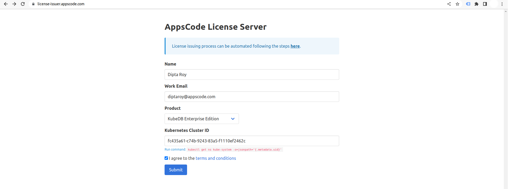

## Overview

KubeDB is the Kubernetes Native Database Management Solution which simplifies and automates routine database tasks such as Provisioning, Monitoring, Upgrading, Patching, Scaling, Volume Expansion, Backup, Recovery, Failure detection, and Repair for various popular databases on private and public clouds. The databases that KubeDB supports are MongoDB, Elasticsearch, MySQL, Kafka, MariaDB, Redis, PostgreSQL, ProxySQL, Percona XtraDB, Memcached and PgBouncer. You can find the guides to all the supported databases in [KubeDB](https://kubedb.com/).
In this tutorial we will deploy Highly Available PostgreSQL Cluster in Azure Kubernetes Service (AKS). We will cover the following steps:

1) Install KubeDB
2) Deploy PostgreSQL Cluster
3) Horizontal Scaling of PostgreSQL Cluster
4) Vertical Scaling of PostgreSQL Cluster

### Get Cluster ID

We need the cluster ID to get the KubeDB License. To get cluster ID, we can run the following command:

```bash
$ kubectl get ns kube-system -o jsonpath='{.metadata.uid}'
fc435a61-c74b-9243-83a5-f1110ef2462c
```

### Get License

Go to [Appscode License Server](https://license-issuer.appscode.com/) to get the license.txt file. For this tutorial we will use KubeDB Enterprise Edition.



### Install KubeDB

We will use helm to install KubeDB. Please install helm [here](https://helm.sh/docs/intro/install/) if it is not already installed.
Now, let's install `KubeDB`.

```bash
$ helm repo add appscode https://charts.appscode.com/stable/
$ helm repo update

$ helm search repo appscode/kubedb
NAME                              	CHART VERSION	APP VERSION	DESCRIPTION                                       
appscode/kubedb                   	v2023.06.19  	v2023.06.19	KubeDB by AppsCode - Production ready databases...
appscode/kubedb-autoscaler        	v0.19.0      	v0.19.0    	KubeDB Autoscaler by AppsCode - Autoscale KubeD...
appscode/kubedb-catalog           	v2023.06.19  	v2023.06.19	KubeDB Catalog by AppsCode - Catalog for databa...
appscode/kubedb-community         	v0.24.2      	v0.24.2    	KubeDB Community by AppsCode - Community featur...
appscode/kubedb-crds              	v2023.06.19  	v2023.06.19	KubeDB Custom Resource Definitions                
appscode/kubedb-dashboard         	v0.10.0      	v0.10.0    	KubeDB Dashboard by AppsCode                      
appscode/kubedb-enterprise        	v0.11.2      	v0.11.2    	KubeDB Enterprise by AppsCode - Enterprise feat...
appscode/kubedb-grafana-dashboards	v2023.06.19  	v2023.06.19	A Helm chart for kubedb-grafana-dashboards by A...
appscode/kubedb-metrics           	v2023.06.19  	v2023.06.19	KubeDB State Metrics                              
appscode/kubedb-one               	v2023.06.19  	v2023.06.19	KubeDB and Stash by AppsCode - Production ready...
appscode/kubedb-ops-manager       	v0.21.0      	v0.21.0    	KubeDB Ops Manager by AppsCode - Enterprise fea...
appscode/kubedb-opscenter         	v2023.06.19  	v2023.06.19	KubeDB Opscenter by AppsCode                      
appscode/kubedb-provisioner       	v0.34.0      	v0.34.0    	KubeDB Provisioner by AppsCode - Community feat...
appscode/kubedb-schema-manager    	v0.10.0      	v0.10.0    	KubeDB Schema Manager by AppsCode                 
appscode/kubedb-ui                	v2023.03.23  	0.3.28     	A Helm chart for Kubernetes                       
appscode/kubedb-ui-server         	v2021.12.21  	v2021.12.21	A Helm chart for kubedb-ui-server by AppsCode     
appscode/kubedb-webhook-server    	v0.10.0      	v0.10.0    	KubeDB Webhook Server by AppsCode    

# Install KubeDB Enterprise operator chart
$ helm install kubedb appscode/kubedb \
  --version v2023.06.19 \
  --namespace kubedb --create-namespace \
  --set kubedb-provisioner.enabled=true \
  --set kubedb-ops-manager.enabled=true \
  --set kubedb-autoscaler.enabled=true \
  --set kubedb-dashboard.enabled=true \
  --set kubedb-schema-manager.enabled=true \
  --set-file global.license=/path/to/the/license.txt
```

Let's verify the installation:

```bash
$ kubectl get pods --all-namespaces -l "app.kubernetes.io/instance=kubedb"
NAMESPACE   NAME                                            READY   STATUS    RESTARTS   AGE
kubedb      kubedb-kubedb-autoscaler-79b488f4d9-7t524       1/1     Running   0          2m1s
kubedb      kubedb-kubedb-dashboard-77d6d5c598-9zs6j        1/1     Running   0          2m1s
kubedb      kubedb-kubedb-ops-manager-65f8d87769-dhmds      1/1     Running   0          2m1s
kubedb      kubedb-kubedb-provisioner-7ffb8767c8-s6txh      1/1     Running   0          2m1s
kubedb      kubedb-kubedb-schema-manager-848fcb975b-8jn6j   1/1     Running   0          2m1s
kubedb      kubedb-kubedb-webhook-server-678d69f669-swnbf   1/1     Running   0          2m1s
```

We can list the CRD Groups that have been registered by the operator by running the following command:

```bash
$ kubectl get crd -l app.kubernetes.io/name=kubedb
NAME                                              CREATED AT
elasticsearchautoscalers.autoscaling.kubedb.com   2023-07-24T08:41:07Z
elasticsearchdashboards.dashboard.kubedb.com      2023-07-24T08:41:05Z
elasticsearches.kubedb.com                        2023-07-24T08:41:05Z
elasticsearchopsrequests.ops.kubedb.com           2023-07-24T08:41:32Z
elasticsearchversions.catalog.kubedb.com          2023-07-24T08:38:37Z
etcds.kubedb.com                                  2023-07-24T08:41:27Z
etcdversions.catalog.kubedb.com                   2023-07-24T08:38:37Z
kafkas.kubedb.com                                 2023-07-24T08:42:02Z
kafkaversions.catalog.kubedb.com                  2023-07-24T08:38:38Z
mariadbautoscalers.autoscaling.kubedb.com         2023-07-24T08:41:07Z
mariadbdatabases.schema.kubedb.com                2023-07-24T08:41:29Z
mariadbopsrequests.ops.kubedb.com                 2023-07-24T08:42:50Z
mariadbs.kubedb.com                               2023-07-24T08:41:28Z
mariadbversions.catalog.kubedb.com                2023-07-24T08:38:38Z
memcacheds.kubedb.com                             2023-07-24T08:41:28Z
memcachedversions.catalog.kubedb.com              2023-07-24T08:38:38Z
mongodbautoscalers.autoscaling.kubedb.com         2023-07-24T08:41:08Z
mongodbdatabases.schema.kubedb.com                2023-07-24T08:41:22Z
mongodbopsrequests.ops.kubedb.com                 2023-07-24T08:41:37Z
mongodbs.kubedb.com                               2023-07-24T08:41:23Z
mongodbversions.catalog.kubedb.com                2023-07-24T08:38:39Z
mysqlautoscalers.autoscaling.kubedb.com           2023-07-24T08:41:08Z
mysqldatabases.schema.kubedb.com                  2023-07-24T08:41:19Z
mysqlopsrequests.ops.kubedb.com                   2023-07-24T08:42:46Z
mysqls.kubedb.com                                 2023-07-24T08:41:19Z
mysqlversions.catalog.kubedb.com                  2023-07-24T08:38:39Z
perconaxtradbautoscalers.autoscaling.kubedb.com   2023-07-24T08:41:08Z
perconaxtradbopsrequests.ops.kubedb.com           2023-07-24T08:44:09Z
perconaxtradbs.kubedb.com                         2023-07-24T08:41:51Z
perconaxtradbversions.catalog.kubedb.com          2023-07-24T08:38:39Z
pgbouncers.kubedb.com                             2023-07-24T08:41:53Z
pgbouncerversions.catalog.kubedb.com              2023-07-24T08:38:40Z
postgresautoscalers.autoscaling.kubedb.com        2023-07-24T08:41:08Z
postgresdatabases.schema.kubedb.com               2023-07-24T08:41:27Z
postgreses.kubedb.com                             2023-07-24T08:41:28Z
postgresopsrequests.ops.kubedb.com                2023-07-24T08:43:59Z
postgresversions.catalog.kubedb.com               2023-07-24T08:38:40Z
proxysqlautoscalers.autoscaling.kubedb.com        2023-07-24T08:41:08Z
proxysqlopsrequests.ops.kubedb.com                2023-07-24T08:44:04Z
proxysqls.kubedb.com                              2023-07-24T08:41:59Z
proxysqlversions.catalog.kubedb.com               2023-07-24T08:38:40Z
publishers.postgres.kubedb.com                    2023-07-24T08:45:38Z
redisautoscalers.autoscaling.kubedb.com           2023-07-24T08:41:08Z
redises.kubedb.com                                2023-07-24T08:42:01Z
redisopsrequests.ops.kubedb.com                   2023-07-24T08:43:47Z
redissentinelautoscalers.autoscaling.kubedb.com   2023-07-24T08:41:08Z
redissentinelopsrequests.ops.kubedb.com           2023-07-24T08:45:28Z
redissentinels.kubedb.com                         2023-07-24T08:42:02Z
redisversions.catalog.kubedb.com                  2023-07-24T08:38:41Z
subscribers.postgres.kubedb.com                   2023-07-24T08:45:46Z
```

## Deploy PostgreSQL Cluster

We are going to Deploy PostgreSQL Cluster by using KubeDB.
First, let's create a Namespace in which we will deploy the database.

```bash
$ kubectl create namespace demo
namespace/demo created
```

Here is the yaml of the PostgreSQL CRO we are going to use:

```yaml                                                                      
apiVersion: kubedb.com/v1alpha2
kind: Postgres
metadata:
  name: postgres-cluster
  namespace: demo
spec:
  version: "15.1"
  replicas: 3
  standbyMode: Hot
  storageType: Durable
  storage:
    storageClassName: "default"
    accessModes:
      - ReadWriteOnce
    resources:
      requests:
        storage: 1Gi
  terminationPolicy: WipeOut
```
Let's save this yaml configuration into `postgres-cluster.yaml` 
Then create the above PostgreSQL CRO

```bash
$ kubectl apply -f postgres-cluster.yaml
postgres.kubedb.com/postgres-cluster created
```
In this yaml,
* In this yaml we can see in the `spec.version` field specifies the version of PostgreSQL. Here, we are using PostgreSQL `version 15.1`. You can list the KubeDB supported versions of PostgreSQL by running `kubectl get postgresversions` command.
* `spec.standby` is an optional field that specifies the standby mode `hot` or `warm` to use for standby replicas. In `hot` standby mode, standby replicas can accept connection and run read-only queries. In `warm` standby mode, standby replicas can’t accept connection and only used for replication purpose.
* `spec.storage.storageClassName` is the name of the StorageClass used to provision PVCs. 
* `spec.terminationPolicy` field is *Wipeout* means that the database will be deleted without restrictions. It can also be “Halt”, “Delete” and “DoNotTerminate”. Learn More about these checkout [Termination Policy](https://kubedb.com/docs/latest/guides/postgres/concepts/postgres/#specterminationpolicy) .

Once these are handled correctly and the PostgreSQL object is deployed, you will see that the following objects are created:

```bash
$ kubectl get all -n demo
NAME                     READY   STATUS    RESTARTS   AGE
pod/postgres-cluster-0   2/2     Running   0          3m25s
pod/postgres-cluster-1   2/2     Running   0          3m4s
pod/postgres-cluster-2   2/2     Running   0          2m4s

NAME                               TYPE        CLUSTER-IP       EXTERNAL-IP   PORT(S)                      AGE
service/postgres-cluster           ClusterIP   10.100.248.168   <none>        5432/TCP,2379/TCP            3m30s
service/postgres-cluster-pods      ClusterIP   None             <none>        5432/TCP,2380/TCP,2379/TCP   3m30s
service/postgres-cluster-standby   ClusterIP   10.100.106.115   <none>        5432/TCP                     3m30s

NAME                                READY   AGE
statefulset.apps/postgres-cluster   3/3     3m32s

NAME                                                  TYPE                  VERSION   AGE
appbinding.appcatalog.appscode.com/postgres-cluster   kubedb.com/postgres   15.1      3m36s

NAME                                   VERSION   STATUS   AGE
postgres.kubedb.com/postgres-cluster   15.1      Ready    3m59s
```
Let’s check if the database is ready to use,

```bash
$ kubectl get pg -n demo postgres-cluster
NAME               VERSION   STATUS   AGE
postgres-cluster   15.1      Ready    5m
```
> We have successfully deployed PostgreSQL cluster in AKS. Now we can exec into the container to use the database.


#### Accessing Database Through CLI

To access the database through CLI, we have to get the credentials to access. KubeDB will create Secret and Service for the database `postgres-cluster` that we have deployed. Let’s check them using the following commands,

```bash 
$ kubectl get secret -n demo -l=app.kubernetes.io/instance=postgres-cluster
NAME                    TYPE                       DATA   AGE
postgres-cluster-auth   kubernetes.io/basic-auth   2      5m34s

$ kubectl get service -n demo -l=app.kubernetes.io/instance=postgres-cluster
NAME                       TYPE        CLUSTER-IP       EXTERNAL-IP   PORT(S)                      AGE
postgres-cluster           ClusterIP   10.100.248.168   <none>        5432/TCP,2379/TCP            5m57s
postgres-cluster-pods      ClusterIP   None             <none>        5432/TCP,2380/TCP,2379/TCP   5m57s
postgres-cluster-standby   ClusterIP   10.100.106.115   <none>        5432/TCP                     5m57s
```
Now, we are going to use `postgres-cluster-auth` to get the credentials.
```bash
$ kubectl get secrets -n demo postgres-cluster-auth -o jsonpath='{.data.username}' | base64 -d
postgres

$ kubectl get secrets -n demo postgres-cluster-auth -o jsonpath='{.data.password}' | base64 -d
2*SLD7YieS2)9jPc
```

#### Insert Sample Data

In this section, we are going to login into our PostgreSQL pod and insert some sample data. 

```bash
$ kubectl exec -it postgres-cluster-0 -n demo -c postgres -- bash
postgres-cluster-0:/$ psql -d "user=postgres password=2*SLD7YieS2)9jPc"
psql (15.1)
Type "help" for help.

postgres=# \l
                                                  List of databases
     Name      |  Owner   | Encoding |  Collate   |   Ctype    | ICU Locale | Locale Provider |   Access privileges   
---------------+----------+----------+------------+------------+------------+-----------------+-----------------------
 kubedb_system | postgres | UTF8     | en_US.utf8 | en_US.utf8 |            | libc            | 
 postgres      | postgres | UTF8     | en_US.utf8 | en_US.utf8 |            | libc            | 
 template0     | postgres | UTF8     | en_US.utf8 | en_US.utf8 |            | libc            | =c/postgres          +
               |          |          |            |            |            |                 | postgres=CTc/postgres
 template1     | postgres | UTF8     | en_US.utf8 | en_US.utf8 |            | libc            | =c/postgres          +
               |          |          |            |            |            |                 | postgres=CTc/postgres
(4 rows)

postgres=# CREATE DATABASE music;
CREATE DATABASE

postgres=# \l
                                                  List of databases
     Name      |  Owner   | Encoding |  Collate   |   Ctype    | ICU Locale | Locale Provider |   Access privileges   
---------------+----------+----------+------------+------------+------------+-----------------+-----------------------
 kubedb_system | postgres | UTF8     | en_US.utf8 | en_US.utf8 |            | libc            | 
 music         | postgres | UTF8     | en_US.utf8 | en_US.utf8 |            | libc            | 
 postgres      | postgres | UTF8     | en_US.utf8 | en_US.utf8 |            | libc            | 
 template0     | postgres | UTF8     | en_US.utf8 | en_US.utf8 |            | libc            | =c/postgres          +
               |          |          |            |            |            |                 | postgres=CTc/postgres
 template1     | postgres | UTF8     | en_US.utf8 | en_US.utf8 |            | libc            | =c/postgres          +
               |          |          |            |            |            |                 | postgres=CTc/postgres
(5 rows)

postgres=# \c music
You are now connected to database "music" as user "postgres".

music=# CREATE TABLE artist (name VARCHAR(50) NOT NULL, song VARCHAR(50) NOT NULL);
CREATE TABLE

music=# INSERT INTO artist (name, song) VALUES('John Denver', 'Country Roads');
INSERT 0 1

music=# SELECT * FROM artist;
    name     |     song      
-------------+---------------
 John Denver | Country Roads
(1 row)

music=# \q

postgres-cluster-0:/$ exit
exit
```

> We've successfully inserted some sample data to our database. More information about Run & Manage PostgreSQL on Kubernetes can be found in [PostgreSQL Kubernetes](https://kubedb.com/kubernetes/databases/run-and-manage-postgres-on-kubernetes/)


## Horizontal Scaling of PostgreSQL Cluster

### Horizontal Scale Up

Here, we are going to increase the number of PostgreSQL replicas to meet the desired number of replicas.
Before applying Horizontal Scaling, let's check the current number of PostgreSQL replicas,

```bash
$ kubectl get postgres -n demo postgres-cluster -o json | jq '.spec.replicas'
3
```

### Create PostgresOpsRequest

In order to scale up, we have to create a `PostgresOpsRequest` CR with our desired replicas. Let’s create it using this following yaml,

```yaml
apiVersion: ops.kubedb.com/v1alpha1
kind: PostgresOpsRequest
metadata:
  name: horizontal-scale-up
  namespace: demo
spec:
  type: HorizontalScaling
  databaseRef:
    name: postgres-cluster
  horizontalScaling:
      replicas: 5
```
In this yaml,

- `spec.databaseRef.name` specifies that we are performing horizontal scaling operation on `postgres-cluster` database.
- `spec.type` specifies that we are performing `HorizontalScaling` on our database.
- `spec.horizontalScaling.replicas` specifies the desired number of replicas after scaling.

Let’s save this yaml configuration into `horizontal-scale-up.yaml` and apply it,

```bash
$ kubectl apply -f horizontal-scale-up.yaml
postgresopsrequest.ops.kubedb.com/horizontal-scale-up created
```

Let’s wait for `PostgresOpsRequest` `STATUS` to be Successful. Run the following command to watch `PostgresOpsRequest` CR,

```bash
$ watch kubectl get postgresopsrequest -n demo
NAME                  TYPE                STATUS       AGE
horizontal-scale-up   HorizontalScaling   Successful   3m46s
```

From the above output we can see that the `PostgresOpsRequest` has succeeded. Now, we are going to verify the number of replicas,

```bash
$ kubectl get postgres -n demo postgres-cluster -o json | jq '.spec.replicas'
5
```
From all the above outputs we can see that the number of replicas is now increased to 5. That means we have successfully scaled up the number of PostgreSQL replicas.

### Horizontal Scale Down

Now, we are going to scale down the number of PostgreSQL replicas to meet the desired number of replicas.

#### Create PostgresOpsRequest

In order to scale down, again we need to create a `PostgresOpsRequest` CR with our desired replicas. Let’s create it using this following yaml,

```yaml
apiVersion: ops.kubedb.com/v1alpha1
kind: PostgresOpsRequest
metadata:
  name: horizontal-scale-down
  namespace: demo
spec:
  type: HorizontalScaling
  databaseRef:
    name: postgres-cluster
  horizontalScaling:
      replicas: 3
```

In this yaml,

- `spec.databaseRef.name` specifies that we are performing horizontal scaling operation on `postgres-cluster` database.
- `spec.type` specifies that we are performing `HorizontalScaling` on our database.
- `spec.horizontalScaling.replicas` specifies the desired number of replicas after scaling.

Let’s save this yaml configuration into `horizontal-scale-down.yaml` and apply it,

```bash
$ kubectl apply -f horizontal-scale-down.yaml
postgresopsrequest.ops.kubedb.com/horizontal-scale-down created
```

Let’s wait for `PostgresOpsRequest` `STATUS` to be Successful. Run the following command to watch `PostgresOpsRequest` CR,

```bash
$ watch kubectl get postgresopsrequest -n demo
NAME                    TYPE                STATUS       AGE
horizontal-scale-down   HorizontalScaling   Successful   3m21s
```

From the above output we can see that the `PostgresOpsRequest` has succeeded. Now, we are going to verify the number of PostgreSQL replicas,

```bash
$ kubectl get postgres -n demo postgres-cluster -o json | jq '.spec.replicas'
3
```
From all the above outputs we can see that the number of replicas is now decreased to 3. That means we have successfully scaled down the number of PostgreSQL replicas.


## Vetical Scaling of PostgreSQL Cluster

We are going to scale up the current cpu resource of the PostgreSQL cluster by applying Vertical Scaling.
Before applying it, let's check the current resources,

```bash
$ kubectl get pod -n demo postgres-cluster-0 -o json | jq '.spec.containers[].resources'
{
  "limits": {
    "memory": "1Gi"
  },
  "requests": {
    "cpu": "500m",
    "memory": "1Gi"
  }
}
{}
```
### Vertical Scale Up

#### Create PostgresOpsRequest

In order to update the resources of the cluster, we have to create a `PostgresOpsRequest` CR with our desired resources. Let’s create it using this following yaml,

```yaml
apiVersion: ops.kubedb.com/v1alpha1
kind: PostgresOpsRequest
metadata:
  name: vertical-scale-up
  namespace: demo
spec:
  type: VerticalScaling
  databaseRef:
    name: postgres-cluster
  verticalScaling:
    postgres:
      requests:
        memory: "1100Mi"
        cpu: "0.55"
      limits:
        memory: "1100Mi"
        cpu: "0.55"
```
In this yaml,

- `spec.databaseRef.name` specifies that we are performing vertical scaling operation on `postgres-cluster` database.
- `spec.type` specifies that we are performing `VerticalScaling` on our database.
- `spec.verticalScaling.replicaSet` specifies the desired resources after scaling.

Let’s save this yaml configuration into `vertical-scale-up.yaml` and apply it,

```bash
$ kubectl apply -f vertical-scale-up.yaml
postgresopsrequest.ops.kubedb.com/vertical-scale-up created
```

Let’s wait for `PostgresOpsRequest` `STATUS` to be Successful. Run the following command to watch `PostgresOpsRequest` CR,

```bash
$ watch kubectl get postgresopsrequest -n demo
NAME                    TYPE                STATUS       AGE
vertical-scale-up       VerticalScaling     Successful   3m45s
```

We can see from the above output that the `PostgresOpsRequest` has succeeded. Now, we are going to verify from one of the Pod yaml whether the resources of the database has updated to meet up the desired state. Let’s check with the following command,

```bash
$ kubectl get pod -n demo postgres-cluster-0 -o json | jq '.spec.containers[].resources'
{
  "limits": {
    "cpu": "550m",
    "memory": "1100Mi"
  },
  "requests": {
    "cpu": "550m",
    "memory": "1100Mi"
  }
}
{}
```
> The above output verifies that we have successfully scaled up the resources of the PostgreSQL cluster.

### Vertical Scale Down

#### Create PostgresOpsRequest

In order to update the resources of the database, we have to create a `PostgresOpsRequest` CR with our desired resources. Let’s create it using this following yaml,

```yaml
apiVersion: ops.kubedb.com/v1alpha1
kind: PostgresOpsRequest
metadata:
  name: vertical-scale-down
  namespace: demo
spec:
  type: VerticalScaling
  databaseRef:
    name: postgres-cluster
  verticalScaling:
    postgres:
      requests:
        memory: "1Gi"
        cpu: "0.5"
      limits:
        memory: "1Gi"
        cpu: "0.5"
```
In this yaml,

- `spec.databaseRef.name` specifies that we are performing vertical scaling operation on `postgres-cluster` database.
- `spec.type` specifies that we are performing `VerticalScaling` on our database.
- `spec.verticalScaling.replicaSet` specifies the desired resources after scaling.

Let’s save this yaml configuration into `vertical-scale-down.yaml` and apply it,

```bash
$ kubectl apply -f vertical-scale-down.yaml
postgresopsrequest.ops.kubedb.com/vertical-scale-down created
```

Let’s wait for `PostgresOpsRequest` `STATUS` to be Successful. Run the following command to watch `PostgresOpsRequest` CR,

```bash
$ watch kubectl get postgresopsrequest -n demo
NAME                      TYPE                STATUS       AGE
vertical-scale-down       VerticalScaling     Successful   4m2s
```

We can see from the above output that the `PostgresOpsRequest` has succeeded. Now, we are going to verify from one of the Pod yaml whether the resources of the database has updated to meet up the desired state. Let’s check with the following command,

```bash
$ kubectl get pod -n demo postgres-cluster-0 -o json | jq '.spec.containers[].resources'
{
  "limits": {
    "cpu": "500m",
    "memory": "1Gi"
  },
  "requests": {
    "cpu": "500m",
    "memory": "1Gi"
  }
}
```
> The above output verifies that we have successfully scaled down the resources of the PostgreSQL cluster.

If you want to learn more about Production-Grade PostgreSQL you can have a look into that playlist below:

<iframe width="560" height="315" src="https://www.youtube.com/embed/videoseries?list=PLoiT1Gv2KR1imqnrYFhUNTLHdBNFXPKr_" title="YouTube video player" frameborder="0" allow="accelerometer; autoplay; clipboard-write; encrypted-media; gyroscope; picture-in-picture; web-share" allowfullscreen></iframe>

## Support

To speak with us, please leave a message on [our website](https://appscode.com/contact/).

To receive product announcements, follow us on [Twitter](https://twitter.com/KubeDB).

To watch tutorials of various Production-Grade Kubernetes Tools Subscribe to our [YouTube](https://www.youtube.com/c/AppsCodeInc/) channel.

Learn more about [PostgreSQL in Kubernetes](https://kubedb.com/kubernetes/databases/run-and-manage-postgres-on-kubernetes/)

If you have found a bug with KubeDB or want to request for new features, please [file an issue](https://github.com/kubedb/project/issues/new).
