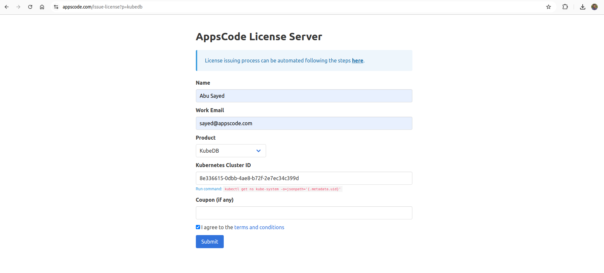

## Overview

KubeDB is the Kubernetes Native Database Management Solution which simplifies and automates routine database tasks such as Provisioning, Monitoring, Upgrading, Patching, Scaling, Volume Expansion, Backup, Recovery, Failure detection, and Repair for various popular databases on private and public clouds. The databases supported by KubeDB include MongoDB, Elasticsearch, MySQL, MariaDB, Redis, PostgreSQL, FerretDB, Percona XtraDB, and Memcached. Additionally, KubeDB also supports ProxySQL, PgBouncer and the streaming platform Kafka. You can find the guides to all the supported databases in [KubeDB](https://kubedb.com/).

### Data Encryption at Rest

MongoDB uses [data encryption at rest](https://www.mongodb.com/docs/manual/tutorial/configure-encryption/) to protect sensitive data from unauthorized access and meet regulatory compliance. Encryption safeguards data at rest and in transit, reducing the risk of breaches.

[KMIP](https://en.wikipedia.org/wiki/Key_Management_Interoperability_Protocol) is chosen for its standardized approach to encryption key management, allowing secure generation, storage, and rotation of keys across various platforms.
It ensures interoperability and strengthens overall data security.

[HashiCorp Vault KMIP secret engine](https://developer.hashicorp.com/vault/docs/secrets/kmip) is a powerful solution for managing encryption keys. It offers automated key rotation, fine-grained access controls, and audit logging, making it a scalable and secure choice for MongoDB's encryption needs.

In this tutorial we will show how to configure KubeDB managed MongoDB with [HashiCorp Vault KMIP secret engine](https://developer.hashicorp.com/vault/docs/secrets/kmip) for encryption.

## Before You Begin

First We need to Install KubeDB in our cluster. To Install KubeDB, follow these steps:

### Get Cluster ID

We need the cluster ID to get the KubeDB License. To get cluster ID, we can run the following command:

```bash
$ kubectl get ns kube-system -o jsonpath='{.metadata.uid}'
8e336615-0dbb-4ae8-b72f-2e7ec34c399d
```

### Get License

Go to [Appscode License Server](https://license-issuer.appscode.com/) to get the license.txt file. For this tutorial we will use KubeDB.



### Install KubeDB

We will use helm to install KubeDB. Please install helm [here](https://helm.sh/docs/intro/install/) if it is not already installed.
Now, let's install `KubeDB`.

```bash
$ helm search repo appscode/kubedb
NAME                              	CHART VERSION	APP VERSION	DESCRIPTION                                       
appscode/kubedb                   	v2024.8.21   	v2024.8.21 	KubeDB by AppsCode - Production ready databases...
appscode/kubedb-autoscaler        	v0.32.0      	v0.32.0    	KubeDB Autoscaler by AppsCode - Autoscale KubeD...
appscode/kubedb-catalog           	v2024.8.21   	v2024.8.21 	KubeDB Catalog by AppsCode - Catalog for databa...
appscode/kubedb-community         	v0.24.2      	v0.24.2    	KubeDB Community by AppsCode - Community featur...
appscode/kubedb-crd-manager       	v0.2.0       	v0.2.0     	KubeDB CRD Manager by AppsCode                    
appscode/kubedb-crds              	v2024.8.21   	v2024.8.21 	KubeDB Custom Resource Definitions                
appscode/kubedb-dashboard         	v0.23.0      	v0.23.0    	KubeDB Dashboard by AppsCode                      
appscode/kubedb-enterprise        	v0.11.2      	v0.11.2    	KubeDB Enterprise by AppsCode - Enterprise feat...
appscode/kubedb-grafana-dashboards	v2024.8.21   	v2024.8.21 	A Helm chart for kubedb-grafana-dashboards by A...
appscode/kubedb-kubestash-catalog 	v2024.8.21   	v2024.8.21 	KubeStash Catalog by AppsCode - Catalog of Kube...
appscode/kubedb-metrics           	v2024.8.21   	v2024.8.21 	KubeDB State Metrics                              
appscode/kubedb-one               	v2023.12.28  	v2023.12.28	KubeDB and Stash by AppsCode - Production ready...
appscode/kubedb-ops-manager       	v0.34.0      	v0.34.1    	KubeDB Ops Manager by AppsCode - Enterprise fea...
appscode/kubedb-opscenter         	v2024.8.21   	v2024.8.21 	KubeDB Opscenter by AppsCode                      
appscode/kubedb-provider-aws      	v2024.8.21   	v0.9.0     	A Helm chart for KubeDB AWS Provider for Crossp...
appscode/kubedb-provider-azure    	v2024.8.21   	v0.9.0     	A Helm chart for KubeDB Azure Provider for Cros...
appscode/kubedb-provider-gcp      	v2024.8.21   	v0.9.0     	A Helm chart for KubeDB GCP Provider for Crossp...
appscode/kubedb-provisioner       	v0.47.0      	v0.47.1    	KubeDB Provisioner by AppsCode - Community feat...
appscode/kubedb-schema-manager    	v0.23.0      	v0.23.0    	KubeDB Schema Manager by AppsCode                 
appscode/kubedb-ui                	v2024.8.21   	0.7.6      	A Helm chart for Kubernetes                       
appscode/kubedb-ui-presets        	v2024.8.21   	v2024.8.21 	KubeDB UI Presets                                 
appscode/kubedb-ui-server         	v2021.12.21  	v2021.12.21	A Helm chart for kubedb-ui-server by AppsCode     
appscode/kubedb-webhook-server    	v0.23.0      	v0.23.1    	KubeDB Webhook Server by AppsCode 


$ helm install kubedb oci://ghcr.io/appscode-charts/kubedb \
  --version v2024.8.21 \
  --namespace kubedb --create-namespace \
  --set-file global.license=/path/to/the/license.txt \
  --wait --burst-limit=10000 --debug
```

Let's verify the installation:

```bash
$ kubectl get pods --all-namespaces -l "app.kubernetes.io/instance=kubedb"
NAMESPACE   NAME                                            READY   STATUS    RESTARTS   AGE
kubedb      kubedb-kubedb-autoscaler-77bc658b47-8rsw5       1/1     Running   0          2m6s
kubedb      kubedb-kubedb-ops-manager-564cd7ddd5-59c4h      1/1     Running   0          2m6s
kubedb      kubedb-kubedb-provisioner-5c4687f696-zn2tc      1/1     Running   0          2m6s
kubedb      kubedb-kubedb-webhook-server-7ccfd65f9d-ljqxp   1/1     Running   0          2m6s
kubedb      kubedb-sidekick-8684467889-2ck7q                1/1     Running   0          2m6s
```

We can list the CRD Groups that have been registered by the operator by running the following command:

```bash
$ kubectl get crd -l app.kubernetes.io/name=kubedb
NAME                                            CREATED AT
cassandraversions.catalog.kubedb.com            2024-09-26T10:03:30Z
clickhouseversions.catalog.kubedb.com           2024-09-26T10:03:30Z
druidversions.catalog.kubedb.com                2024-09-26T10:03:30Z
elasticsearchversions.catalog.kubedb.com        2024-09-26T10:03:30Z
etcdversions.catalog.kubedb.com                 2024-09-26T10:03:30Z
ferretdbversions.catalog.kubedb.com             2024-09-26T10:03:30Z
kafkaconnectorversions.catalog.kubedb.com       2024-09-26T10:03:30Z
kafkaversions.catalog.kubedb.com                2024-09-26T10:03:30Z
mariadbversions.catalog.kubedb.com              2024-09-26T10:03:30Z
memcachedversions.catalog.kubedb.com            2024-09-26T10:03:30Z
mongodbarchivers.archiver.kubedb.com            2024-09-26T09:49:41Z
mongodbautoscalers.autoscaling.kubedb.com       2024-09-26T09:49:41Z
mongodbdatabases.schema.kubedb.com              2024-09-26T09:49:41Z
mongodbopsrequests.ops.kubedb.com               2024-09-26T09:49:41Z
mongodbs.kubedb.com                             2024-09-26T09:49:41Z
mongodbversions.catalog.kubedb.com              2024-09-26T09:49:41Z
mssqlserverarchivers.archiver.kubedb.com        2024-09-26T09:49:45Z
mssqlserverautoscalers.autoscaling.kubedb.com   2024-09-26T09:49:45Z
mssqlserveropsrequests.ops.kubedb.com           2024-09-26T09:49:45Z
mssqlservers.kubedb.com                         2024-09-26T09:49:44Z
mssqlserverversions.catalog.kubedb.com          2024-09-26T09:49:44Z
mysqlversions.catalog.kubedb.com                2024-09-26T10:03:30Z
perconaxtradbversions.catalog.kubedb.com        2024-09-26T10:03:30Z
pgbouncerversions.catalog.kubedb.com            2024-09-26T10:03:30Z
pgpoolversions.catalog.kubedb.com               2024-09-26T10:03:31Z
postgresarchivers.archiver.kubedb.com           2024-09-26T09:49:48Z
postgresautoscalers.autoscaling.kubedb.com      2024-09-26T09:49:48Z
postgresdatabases.schema.kubedb.com             2024-09-26T09:49:48Z
postgreses.kubedb.com                           2024-09-26T09:49:48Z
postgresopsrequests.ops.kubedb.com              2024-09-26T09:49:48Z
postgresversions.catalog.kubedb.com             2024-09-26T09:49:48Z
proxysqlversions.catalog.kubedb.com             2024-09-26T10:03:31Z
publishers.postgres.kubedb.com                  2024-09-26T09:49:48Z
rabbitmqversions.catalog.kubedb.com             2024-09-26T10:03:31Z
redisversions.catalog.kubedb.com                2024-09-26T10:03:31Z
schemaregistryversions.catalog.kubedb.com       2024-09-26T10:03:31Z
singlestoreversions.catalog.kubedb.com          2024-09-26T10:03:31Z
solrversions.catalog.kubedb.com                 2024-09-26T10:03:31Z
subscribers.postgres.kubedb.com                 2024-09-26T09:49:48Z
zookeeperversions.catalog.kubedb.com            2024-09-26T10:03:31Z

```

Now Install HashiCorp Vault CLI. You can follow this procedure [here](https://developer.hashicorp.com/vault/install)

To keep things isolated, this tutorial uses a separate namespace called `demo` throughout this tutorial. Run the following command to prepare your cluster for this tutorial:

```bash
$ kubectl create ns demo
namespace/demo created
```
## Steps to Deploy Encrypted MongoDB

### Setup Hashicorp Vault KMIP secret engine

User can setup Vault KMIP secret engine with [Vault Enterprise](https://developer.hashicorp.com/vault/tutorials/adp/kmip-engine?variants=vault-deploy%3Aenterprise) or [HCP Vault Dedicated](https://developer.hashicorp.com/vault/tutorials/adp/kmip-engine?variants=vault-deploy%3Ahcp). For this demo we will use [Hashicorp Cloud Provider(HCP)](https://portal.cloud.hashicorp.com/) Vault Dedicated.

So First we created a `Vault Plus` cluster in HCP. Then we need to configure Vault KMIP according to [this](https://developer.hashicorp.com/vault/tutorials/adp/kmip-engine?variants=vault-deploy%3Ahcp) documentation step by step.

```bash
# setup vault environment
$ export VAULT_ADDR=<Public_Cluster_URL>
$ export VAULT_TOKEN=<Generated_Vault_Token>
$ export VAULT_NAMESPACE=admin

# configure kmip secret engine
$ vault secrets enable kmip
Success! Enabled the kmip secrets engine at: kmip/

$ vault write kmip/config \
     listen_addrs=0.0.0.0:5696 \
     server_hostnames=$(echo ${VAULT_ADDR:8} | rev | cut -c6- | rev)
Success! Data written to: kmip/config

# create scope
$ vault write -f kmip/scope/finance
Success! Data written to: kmip/scope/finance

# create role
$ vault write kmip/scope/finance/role/accounting operation_all=true
Success! Data written to: kmip/scope/finance/role/accounting

# store vault-ca.pem
$ vault read kmip/ca -format=json | jq -r '.data | .ca_pem' >> vault-ca.pem

# generate and store client.pem
$ vault write -format=json \
    kmip/scope/finance/role/accounting/credential/generate \
    format=pem > credential.json

$ jq -r .data.certificate < credential.json > cert.pem

$ jq -r .data.private_key < credential.json > key.pem

$ cat cert.pem key.pem > client.pem
```
We will use this `client.pem` and `vault-ca.pem` files to configure KMIP in MongoDB.

### Create MongoDB configuration with KMIP

Now we need to make a `mongod.conf` file to use it as configuration folder for our `MongoDB`.

```bash
$ cat mongod.conf
security:
  enableEncryption: true
  kmip:
    serverName: vault-cluster-doc-public-vault-a33bb761.37131dd1.z1.hashicorp.cloud
    port: 5696
    clientCertificateFile: /etc/certs/client.pem
    serverCAFile: /etc/certs/ca.pem
```

Here,
- `serverName` is the public address of our HCP Vault Plus cluster without port
- `port` is listen address of KMIP secret engine
- `clientCertificateFile` is path to the client pem file to make connection
- `serverCAFile` is path to the ca pem file to verify server.

To set up configuration in `mongod.conf` file for KMIP encryption, you can look into [MongoDB official documentation](https://www.mongodb.com/docs/manual/tutorial/configure-encryption/#key-manager).

Here `/etc/certs/client.pem` and `/etc/certs/ca.pem` will be mounted by secret in KubeDB MongoDB main `mongodb` container.

Now, create the secret with this configuration file.

```bash
$ kubectl create secret generic -n demo mg-configuration --from-file=./mongod.conf
secret/mg-configuration created
```

Verify the secret has the configuration file.
```bash
$ kubectl get secret -n demo mg-configuration -o yaml
apiVersion: v1
data:
  mongod.conf: c2VjdXJpdHk6CiAgZW5hYmxlRW5jcnlwdGlvbjogdHJ1ZQogIGttaXA6CiAgICBzZXJ2ZXJOYW1lOiB2YXVsdC1jbHVzdGVyLWRvYy1wdWJsaWMtdmF1bHQtYTMzYmI3NjEuMzcxMzFkZDEuejEuaGFzaGljb3JwLmNsb3VkCiAgICBwb3J0OiA1Njk2CiAgICBjbGllbnRDZXJ0aWZpY2F0ZUZpbGU6IC9ldGMvY2VydHMvY2xpZW50LnBlbQogICAgc2VydmVyQ0FGaWxlOiAvZXRjL2NlcnRzL2NhLnBlbQ==
kind: Secret
metadata:
  creationTimestamp: "2024-09-24T09:10:55Z"
  name: mg-configuration
  namespace: demo
  resourceVersion: "322831"
  uid: 005f0cac-6bbb-4fb6-a728-87b0ca55785a
type: Opaque
```

### Create MongoDB

Before creating `MongoDB`, we need to create a secret with `client.pem` and `vault-ca.pem` to use as volume for our `MongoDB`
```bash
$ kubectl create secret generic vault-tls-secret -n demo \
        --from-file=client.pem=client.pem \
        --from-file=ca.pem=vault-ca.pem
secret/vault-tls-secret created
```

Now lets create KubeDB MongoDB. Currently, we have KMIP encryption support for `percona-4.2.24`,`percona-4.2.26`,`percona-5.0.23`,`percona-6.0.12` and `percona-7.0.4` version of KubeDB managed MongoDB.

We will use mongodb version `percona-5.0.23` for our demo purpose.

```yaml
apiVersion: kubedb.com/v1
kind: MongoDB
metadata:
  name: mg-kmip
  namespace: demo
spec:
  podTemplate:
    spec:
      containers:
        - name: "mongodb"
          volumeMounts:
            - name: certs
              mountPath: /etc/certs
      volumes:
        - name: certs
          secret:
            secretName: vault-tls-secret
  storage:
    accessModes:
      - ReadWriteOnce
    resources:
      requests:
        storage: 1Gi
  storageType: Durable
  deletionPolicy: WipeOut
  version: "percona-5.0.23"
  configSecret:
    name: mg-configuration
```

Let's save this yaml configuration into `mg.yaml` file and apply.

```bash
$ kubectl apply -f mg.yaml
mongodb.kubedb.com/mg-kmip created
```

Now, wait a few minutes. KubeDB operator will create necessary PVC, petset, services, secret etc. If everything goes well, we will see that a pod with the name `mg-kmip-0` has been created.

Check that the petset's pod is running

```bash
$ kubectl get pod -n demo mg-kmip-0
NAME                  READY     STATUS    RESTARTS   AGE
mg-kmip-0             1/1       Running   0          1m
```

Now, we will check if the database has started with the custom configuration we have provided.

To make sure that this `mg-kmip` MongoDB is KMIP encrypted, we can check the log of this `mg-kmip-0` pod

```bash
kubectl logs -f --all-containers -n demo mg-kmip-0
```
We should see these logs which confirm that this `MongoDB` is setup with KMIP
```log
{"t":{"$date":"2024-09-24T09:26:13.551+00:00"},"s":"I",  "c":"STORAGE",  "id":29116,   "ctx":"initandlisten","msg":"Master encryption key has been created on the key management facility","attr":{"keyManagementFacilityType":"KMIP server","keyIdentifier":{"kmipKeyIdentifier":"73ORm3aFQxGKZtJQ3196VXV5NmfT3AlG"}}}
{"t":{"$date":"2024-09-24T09:26:13.551+00:00"},"s":"I",  "c":"STORAGE",  "id":29037,   "ctx":"initandlisten","msg":"Initializing KeyDB with wiredtiger_open config: {cfg}","attr":{"cfg":"create,config_base=false,extensions=[local=(entry=percona_encryption_extension_init,early_load=true,config=(cipher=AES256-CBC,rotation=false))],encryption=(name=percona,keyid=\"\"),log=(enabled,file_max=5MB),transaction_sync=(enabled=true,method=fsync),"}}
{"t":{"$date":"2024-09-24T09:26:13.799+00:00"},"s":"I",  "c":"STORAGE",  "id":29039,   "ctx":"initandlisten","msg":"Encryption keys DB is initialized successfully"}
```


Now, we can connect to this database through [mongo-shell](https://docs.mongodb.com/v4.2/mongo/). In this tutorial, we are connecting to the MongoDB server from inside the pod.

```bash
$ kubectl get secrets -n demo mg-kmip-auth -o jsonpath='{.data.\username}' | base64 -d
root

$ kubectl get secrets -n demo mg-kmip-auth -o jsonpath='{.data.\password}' | base64 -d
bJI!1H!)V7!2U.wJ

$ kubectl exec -it mg-kmip-0 -n demo -- bash

> mongo admin

> db.auth("root","bJI!1H!)V7!2U.wJ")
1

> db._adminCommand( {getCmdLineOpts: 1})
{
	"argv" : [
		"mongod",
		"--dbpath=/data/db",
		"--auth",
		"--port=27017",
		"--ipv6",
		"--bind_ip=::,0.0.0.0",
		"--tlsMode=disabled",
		"-f",
		"/data/configdb/mongod.conf"
	],
	"parsed" : {
		"config" : "/data/configdb/mongod.conf",
		"net" : {
			"bindIp" : "::,0.0.0.0",
			"ipv6" : true,
			"port" : 27017,
			"tls" : {
				"mode" : "disabled"
			}
		},
		"security" : {
			"authorization" : "enabled",
			"enableEncryption" : true,
			"kmip" : {
				"clientCertificateFile" : "/etc/certs/client.pem",
				"port" : 5696,
				"serverCAFile" : "/etc/certs/ca.pem",
				"serverName" : "vault-cluster-doc-public-vault-a33bb761.37131dd1.z1.hashicorp.cloud"
			}
		},
		"storage" : {
			"dbPath" : "/data/db"
		}
	},
	"ok" : 1
}
> exit
bye
```

We can see that in `parsed.security` field, encryption is enabled.

## Support

To speak with us, please leave a message on [our website](https://appscode.com/contact/).

To receive product announcements, follow us on [Twitter](https://twitter.com/KubeDB).

To watch tutorials of various Production-Grade Kubernetes Tools Subscribe our [YouTube](https://www.youtube.com/c/AppsCodeInc/) channel.

More about [MySQL on Kubernetes](https://kubedb.com/kubernetes/databases/run-and-manage-mysql-on-kubernetes/)

If you have found a bug with KubeDB or want to request for new features, please [file an issue](https://github.com/kubedb/project/issues/new).