## Overview

KubeDB is the Kubernetes Native Database Management Solution which simplifies and automates routine database tasks such as Provisioning, Monitoring, Upgrading, Patching, Scaling, Volume Expansion, Backup, Recovery, Failure detection, and Repair for various popular databases on private and public clouds. The databases that KubeDB supports are MySQL, MongoDB, Kafka, MariaDB, Elasticsearch, Redis, PostgreSQL, ProxySQL, Percona XtraDB, Memcached and PgBouncer. You can find the guides to all the supported databases in [KubeDB](https://kubedb.com/).
In this tutorial we will Deploy Production-Grade Elasticsearch Cluster in Rancher Using KubeDB. We will cover the following steps:

1) Create a Kubernetes Cluster via Rancher
2) Access Kubernetes Cluster with Rancher UI
3) Install KubeDB
4) Deploy Elasticsearch Cluster
5) Read/Write Sample Data


### Create a Kubernetes Cluster

First, we have created a local Kubernetes cluster via Rancher. If you don't have a Kubernetes cluster you can create one using [Rancher](https://ranchermanager.docs.rancher.com/v2.5/pages-for-subheaders/installation-and-upgrade).
After successfully creating the cluster we are able to access it via Rancher Web UI.
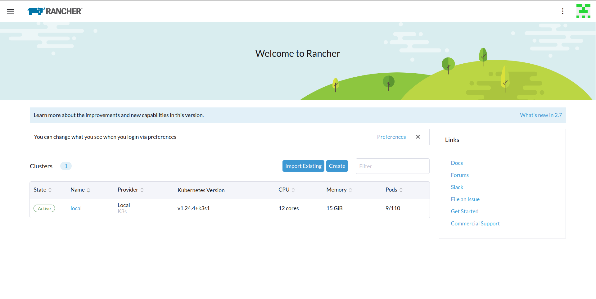

### Create a StorageClass

By default, Rancher does not have a `StorageClass`. Therefore, we need to create one. We can do this by applying the following YAML in the cluster `kubectl` shell of the Rancher UI:
```bash
$ kubectl apply -f https://raw.githubusercontent.com/rancher/local-path-provisioner/v0.0.24/deploy/local-path-storage.yaml
```
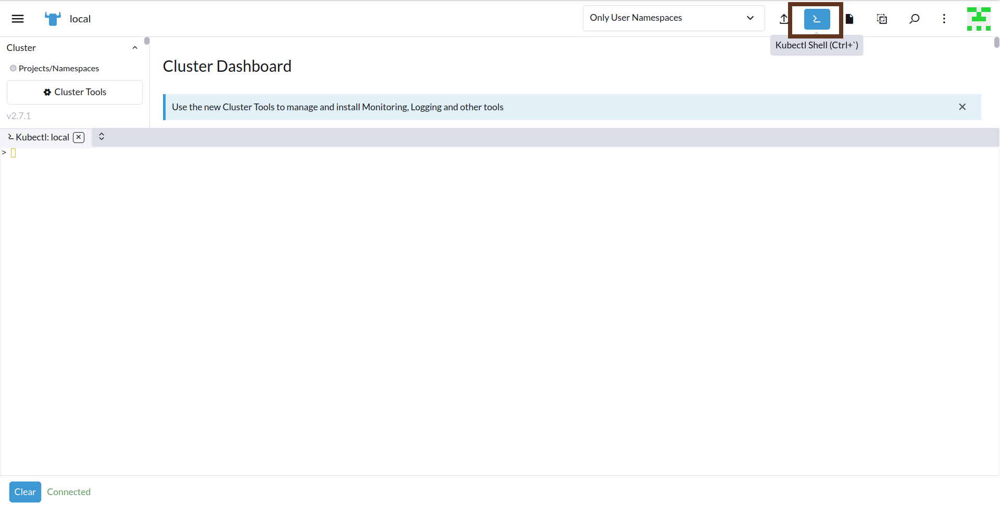
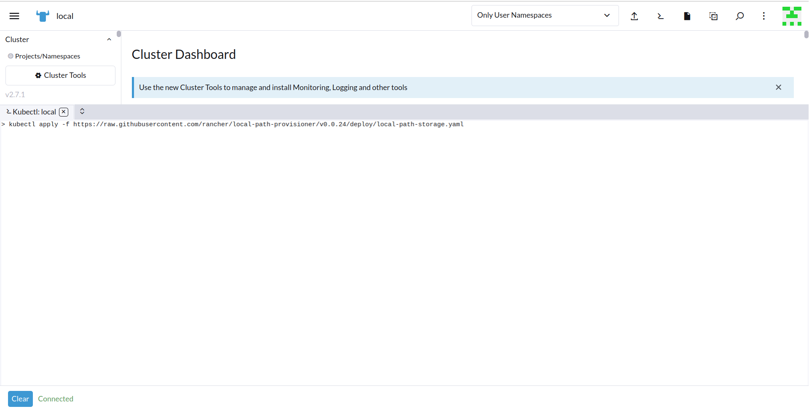
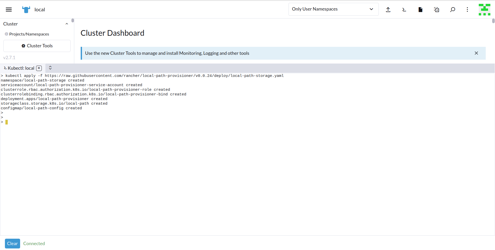
To verify that the `StorageClass` has been created successfully, navigate to the left menu bar and select `Storage` > `StorageClasses`. Here, you should be able to see the previously created `StorageClass`.
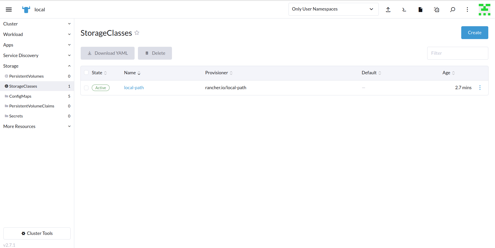

### Get License

In order to use KubeDB Enterprise Edition, we need to obtain a license file from the Appscode License Server. To do this, we first need to retrieve the cluster ID by running the following command:
```bash
$ kubectl get ns kube-system -o jsonpath='{.metadata.uid}'
```
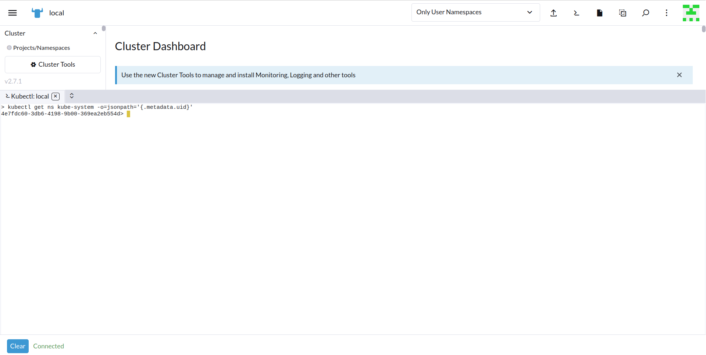

Once we have the cluster ID, we can navigate to the [Appscode License Server](https://license-issuer.appscode.com/) to get the license.txt file. For this tutorial we will use KubeDB Enterprise Edition. KubeDB offers a 30 days license free of cost to try all features of the Enterprise Edition.


Next, we will save the license file in `license.txt` file using the `vim` editor.


### Install KubeDB

We will use helm to install KubeDB using the following command. Please install helm [here](https://helm.sh/docs/intro/install/) if it is not already installed.
```bash
$ helm repo add appscode https://charts.appscode.com/stable/
$ helm repo update
$ helm install kubedb appscode/kubedb \
  --version v2023.06.19 \
  --namespace kubedb --create-namespace \
  --set kubedb-provisioner.enabled=true \
  --set kubedb-ops-manager.enabled=true \
  --set kubedb-autoscaler.enabled=true \
  --set kubedb-dashboard.enabled=true \
  --set kubedb-schema-manager.enabled=true \
  --set-file global.license=/path/to/the/license.txt
```
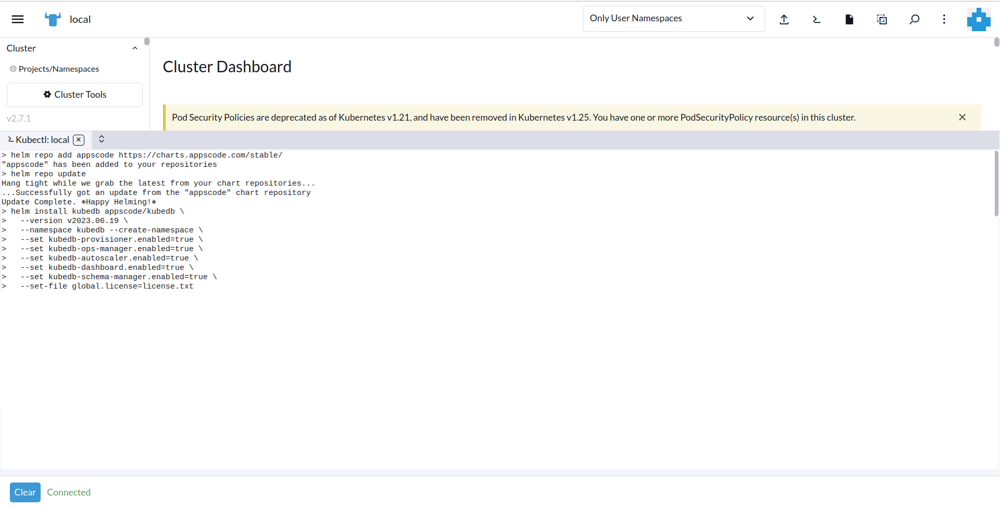

To verify that KubeDB has been successfully installed, navigate to the left menu bar and select `Workload` > `Pods`. Here, you should be able to see the newly created `KubeDB` pods.
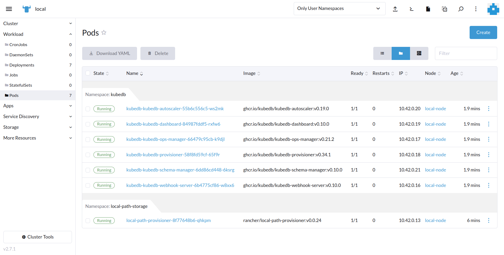

To keep things separated, we will use a new namespace called `demo` throughout this tutorial. To create this namespace, navigate to the left menu bar and select the `Projects/Namespaces` section.

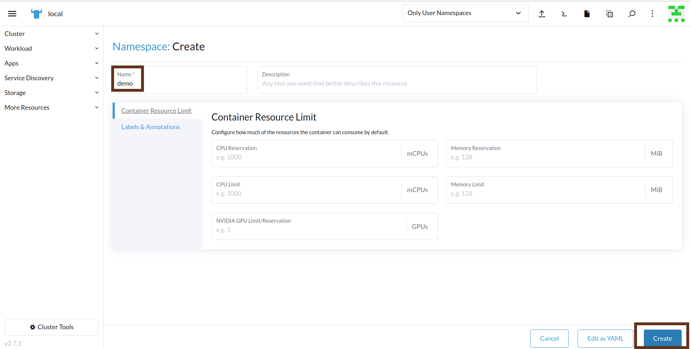
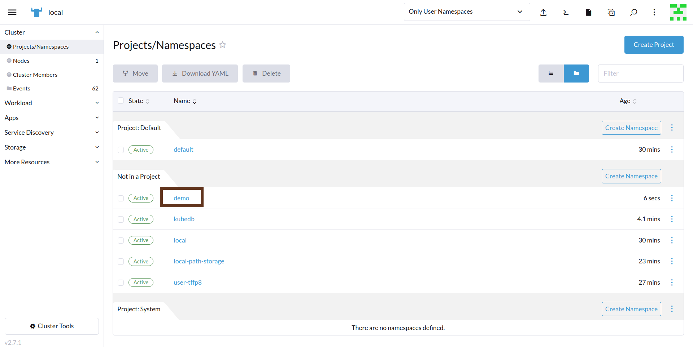

## Deploy Elasticsearch Clustered Database

In this section, we will deploy a Elasticsearch cluster using KubeDB. Here is the YAML configuration that we will be using:
```yaml
apiVersion: kubedb.com/v1alpha2
kind: Elasticsearch
metadata:
  name: es-cluster
  namespace: demo
spec:
  enableSSL: true 
  version: xpack-8.5.2 
  storageType: Durable
  topology:
    master:
      replicas: 2
      resources:
      storage:
        storageClassName: "local-path"
        accessModes:
        - ReadWriteOnce
        resources:
          requests:
            storage: 1Gi
    data:
      replicas: 2
      resources:
      storage:
        storageClassName: "local-path"
        accessModes:
        - ReadWriteOnce
        resources:
          requests:
            storage: 1Gi
    ingest:
      replicas: 2
      resources:
      storage:
        storageClassName: "local-path"
        accessModes:
        - ReadWriteOnce
        resources:
          requests:
            storage: 1Gi
  terminationPolicy: WipeOut
```
To deploy this configuration, navigate to the left menu bar, select `Workload` > `Pods`, and click the "Import YAML" button.
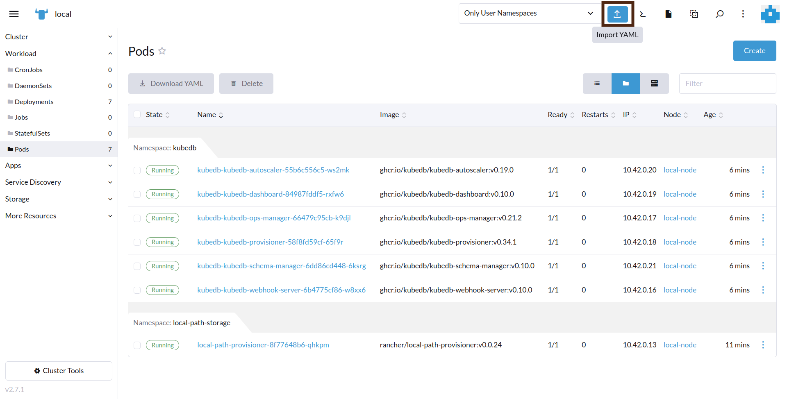
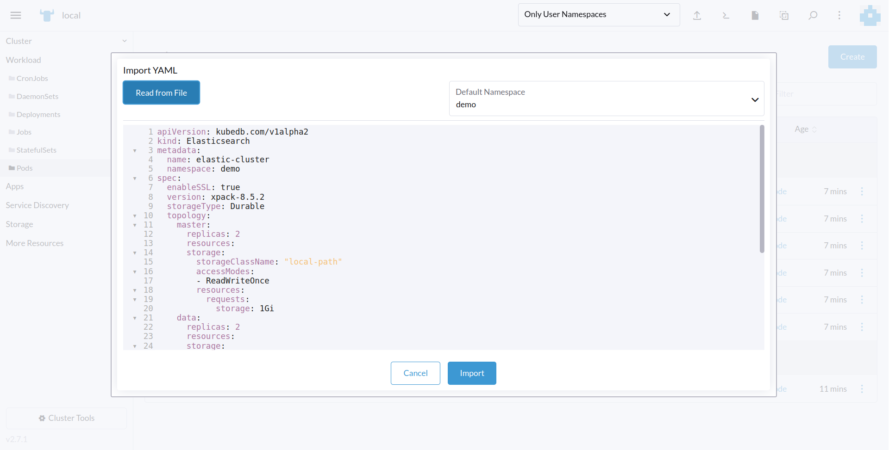


In this yaml,
* `spec.version` field specifies the version of Elasticsearch. Here, we are using Elasticsearch version `xpack-8.5.2` which is used to provision `Elasticsearch-8.5.2` with `xpack` auth plugin. You can list the KubeDB supported versions of Elasticsearch CR with `x-pack` auth-plugin by running `$ kubectl get elasticsearchversions | grep xpack` command. If you want to get other distributions, use `grep` command accordingly.
* `spec.storage` specifies PVC spec that will be dynamically allocated to store data for this database. This storage spec will be passed to the StatefulSet created by KubeDB operator to run database pods. You can specify any StorageClass available in your cluster with appropriate resource requests. You can get all the available storageclass in your cluster by running kubectl get storageclass command.
* `spec.enableSSL` - specifies whether the HTTP layer is secured with certificates or not.
* `spec.storageType` - specifies the type of storage that will be used for Elasticsearch database. It can be Durable or Ephemeral. The default value of this field is Durable. If Ephemeral is used then KubeDB will create the Elasticsearch database using EmptyDir volume. In this case, you don’t have to specify spec.storage field. This is useful for testing purposes.
* `spec.topology` - specifies the node-specific properties for the Elasticsearch cluster.
* And the `spec.terminationPolicy` field is Wipeout means that the database will be deleted without restrictions. It can also be “Halt”, “Delete” and “DoNotTerminate”. Learn More about [Termination Policy](https://kubedb.com/docs/latest/guides/elasticsearch/concepts/elasticsearch/#specterminationpolicy) .


After deploying the Elasticsearch Cluster configuration, you should see the following pods created in the `Workload` > `Pods` section:
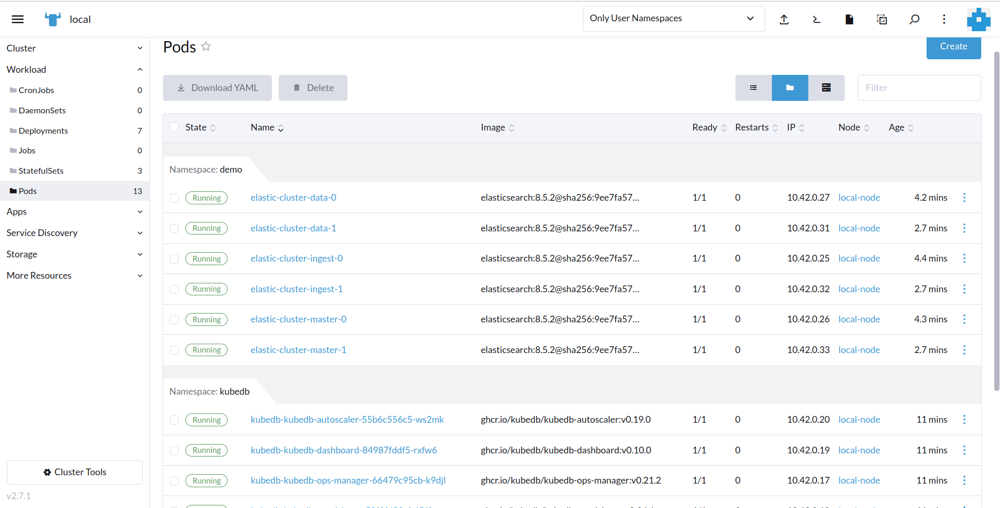
To verify that the Elasticsearch deployment was successful, connect to the cluster `kubectl` shell and run the following commands to see the objects that were created. Also, we will check the database `STATUS` is ready to or not,
```bash
$ kubectl get all -n demo
```
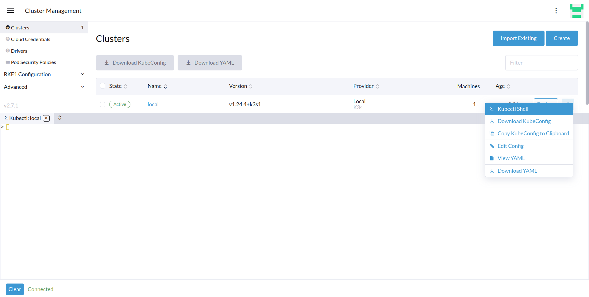
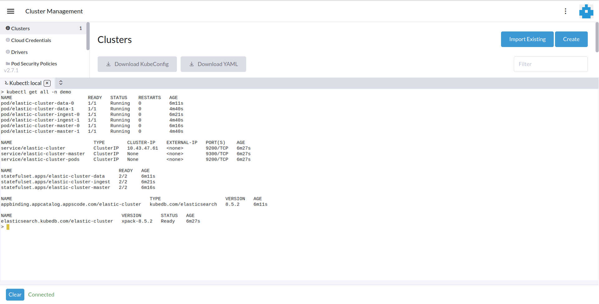

> We have successfully deployed Elasticsearch into Rancher Kubernetes cluster.

### Accessing Database Through CLI

Now, we are going to use our local machine terminal, we have already downloaded the KubuConfig file and connected to our Rancher cluster. To access the database through CLI, you need the credentials. KubeDB creates a `Secret` for the deployed database, and in this case, it's named `elastic-cluster-elastic-cred`. Navigate to the `Storage` > `Secrets` section, locate the `elastic-cluster-elastic-cred` secret and click on it to see the credentials. Copy the `Username` and `Password` for further use.
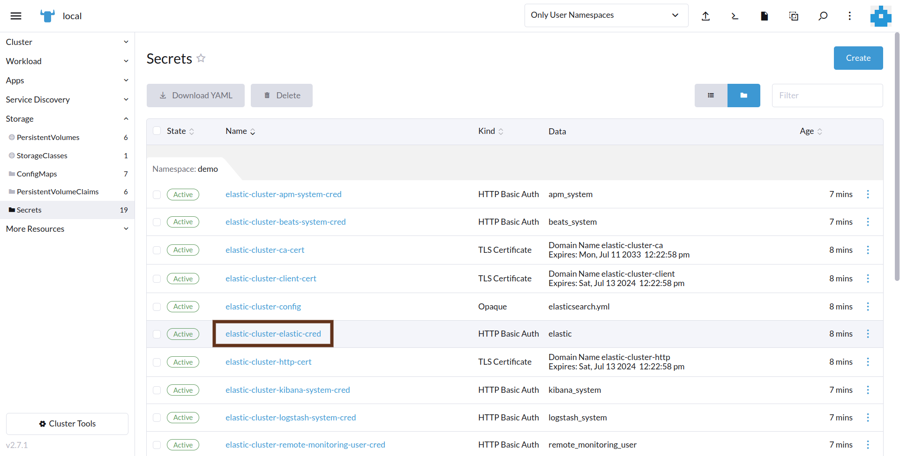
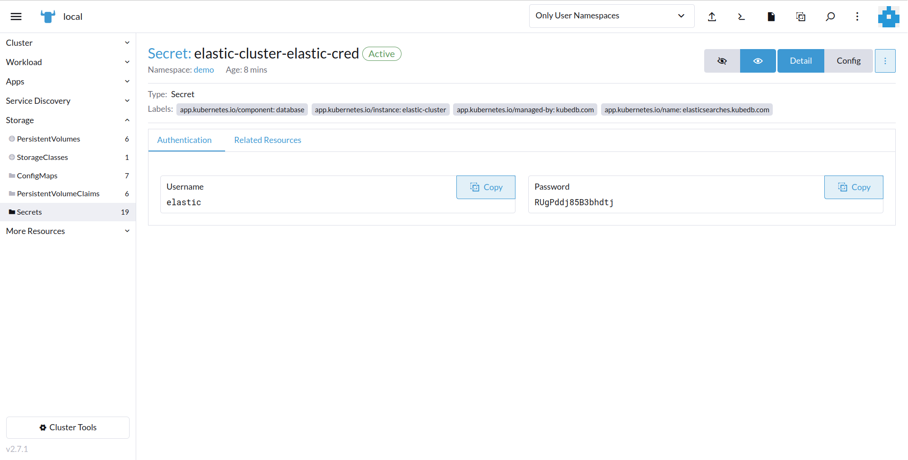

To connect to the Elasticsearch database, we need to port-forward the service. KubeDB will create few Services to connect with the database. Check out the Services created by KubeDB by navigating `Service Discovery` > `Services` section. Here, we are going to use `elastic-cluster` Service to connect with the database.
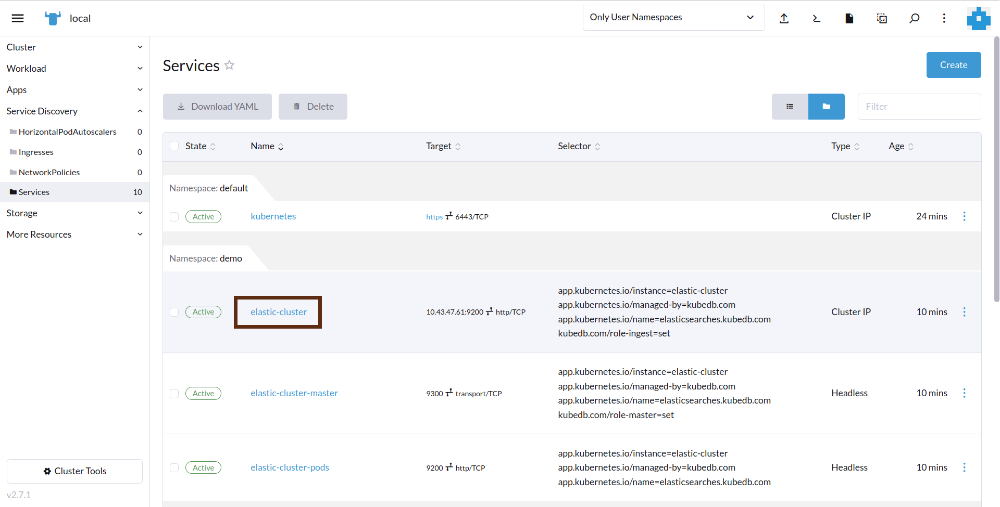

Now, let’s port-forward the `elastic-cluster` Service and then insert some sample data to Elasticsearch using previously acquired `Username` and `Password`.


```bash
$ kubectl port-forward -n demo svc/elastic-cluster 9200
Forwarding from 127.0.0.1:9200 -> 9200
Forwarding from [::1]:9200 -> 9200


$ curl -XPOST -k --user 'elastic:RUgPddj85B3bhdtj' "https://localhost:9200/music/_doc?pretty" -H 'Content-Type: application/json' -d'
                    {
                        "Artist": "Bon Jovi",
                        "Song": "Its My Life"
                    }
                    '
{
  "_index" : "music",
  "_id" : "6fukU4kBZbokCpYVXhJi",
  "_version" : 1,
  "result" : "created",
  "_shards" : {
    "total" : 2,
    "successful" : 2,
    "failed" : 0
  },
  "_seq_no" : 0,
  "_primary_term" : 1
}
```
Now,verify that the data has been inserted into the database by executing the following command:

```bash
$ curl -XGET -k --user 'elastic:RUgPddj85B3bhdtj' "https://localhost:9200/_cat/indices?v&s=index&pretty"
health status index         uuid                   pri rep docs.count docs.deleted store.size pri.store.size
green  open   kubedb-system 37JK4lLIQ5mILZK6pIxLKw   1   1          1            4      686kb        354.2kb
green  open   music         OodnaY0ZQIyE9zzD9_KEMg   1   1          1            0     10.7kb          5.3kb

$ curl -XGET -k --user 'elastic:RUgPddj85B3bhdtj' "https://localhost:9200/music/_search?pretty"
{
  "took" : 37,
  "timed_out" : false,
  "_shards" : {
    "total" : 1,
    "successful" : 1,
    "skipped" : 0,
    "failed" : 0
  },
  "hits" : {
    "total" : {
      "value" : 1,
      "relation" : "eq"
    },
    "max_score" : 1.0,
    "hits" : [
      {
        "_index" : "music",
        "_id" : "6fukU4kBZbokCpYVXhJi",
        "_score" : 1.0,
        "_source" : {
          "Artist" : "Bon Jovi",
          "Song" : "Its My Life"
        }
      }
    ]
  }
}

```

> We've successfully inserted some sample data to our database. More information about Run & Manage Production-Grade Elasticsearch Database on Kubernetes can be found [Elasticsearch Kubernetes](https://kubedb.com/kubernetes/databases/run-and-manage-elasticsearch-on-kubernetes/)


We have made a tutorial on Provision Elasticsearch Multi-node Combined cluster and Topology Cluster using KubeDB. You can have a look into the video below:

<iframe width="560" height="315" src="https://www.youtube.com/embed/O42Pvf2NuCo" title="YouTube video player" frameborder="0" allow="accelerometer; autoplay; clipboard-write; encrypted-media; gyroscope; picture-in-picture; web-share" allowfullscreen></iframe>

## Support

To speak with us, please leave a message on [our website](https://appscode.com/contact/).

To receive product announcements, follow us on [Twitter](https://twitter.com/KubeDB).

To watch tutorials of various Production-Grade Kubernetes Tools Subscribe our [YouTube](https://youtube.com/@appscode) channel.

More about [Elasticsearch in Kubernetes](https://kubedb.com/kubernetes/databases/run-and-manage-elasticsearch-on-kubernetes/)

If you have found a bug with KubeDB or want to request for new features, please [file an issue](https://github.com/kubedb/project/issues/new).
