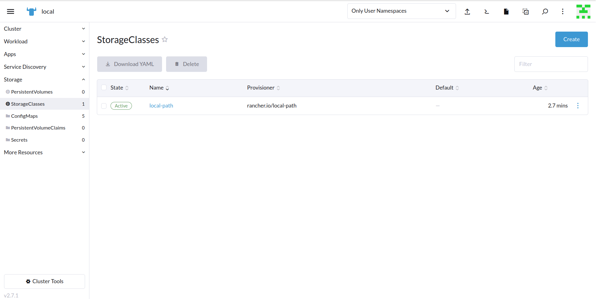

## Overview

KubeDB is the Kubernetes Native Database Management Solution which simplifies and automates routine database tasks such as Provisioning, Monitoring, Upgrading, Patching, Scaling, Volume Expansion, Backup, Recovery, Failure detection, and Repair for various popular databases on private and public clouds. The databases that KubeDB supports are MySQL, MongoDB, Kafka, MariaDB, Elasticsearch, Redis, PostgreSQL, ProxySQL, Percona XtraDB, Memcached and PgBouncer. You can find the guides to all the supported databases in [KubeDB](https://kubedb.com/).
In this tutorial we will Deploy Production-Grade PostgreSQL Cluster in Rancher Using KubeDB. We will cover the following steps:

1) Create a Kubernetes Cluster via Rancher
2) Access Kubernetes Cluster with Rancher UI
3) Install KubeDB
4) Deploy PostgreSQL Cluster
5) Read/Write Sample Data


### Create a Kubernetes Cluster

First, we have created a local Kubernetes cluster via Rancher. If you don't have a Kubernetes cluster you can create one using [Rancher](https://ranchermanager.docs.rancher.com/v2.5/pages-for-subheaders/installation-and-upgrade).
After successfully creating the cluster we are able to access it via Rancher Web UI.


### Create a StorageClass

By default, Rancher does not have a `StorageClass`. Therefore, we need to create one. We can do this by applying the following YAML in the cluster `kubectl` shell of the Rancher UI:
```bash
$ kubectl apply -f https://raw.githubusercontent.com/rancher/local-path-provisioner/v0.0.24/deploy/local-path-storage.yaml
```


To verify that the `StorageClass` has been created successfully, navigate to the left menu bar and select `Storage` > `StorageClasses`. Here, you should be able to see the previously created `StorageClass`.


### Get License

In order to use KubeDB Enterprise Edition, we need to obtain a license file from the Appscode License Server. To do this, we first need to retrieve the cluster ID by running the following command:
```bash
$ kubectl get ns kube-system -o jsonpath='{.metadata.uid}'
```


Once we have the cluster ID, we can navigate to the [Appscode License Server](https://license-issuer.appscode.com/) to get the license.txt file. For this tutorial we will use KubeDB Enterprise Edition. KubeDB offers a 30 days license free of cost to try all features of the Enterprise Edition.


Next, we will save the license file in `license.txt` file using the `vim` editor.


### Install KubeDB

We will use helm to install KubeDB using the following command. Please install helm [here](https://helm.sh/docs/intro/install/) if it is not already installed.
```bash
$ helm repo add appscode https://charts.appscode.com/stable/
$ helm repo update
$ helm install kubedb appscode/kubedb \
  --version v2023.04.10 \
  --namespace kubedb --create-namespace \
  --set kubedb-provisioner.enabled=true \
  --set kubedb-ops-manager.enabled=true \
  --set kubedb-autoscaler.enabled=true \
  --set kubedb-dashboard.enabled=true \
  --set kubedb-schema-manager.enabled=true \
  --set-file global.license=license.txt
```


To verify that KubeDB has been successfully installed, navigate to the left menu bar and select `Workload` > `Pods`. Here, you should be able to see the newly created `KubeDB` pods.


To keep things separated, we will use a new namespace called `demo` throughout this tutorial. To create this namespace, navigate to the left menu bar and select the `Projects/Namespaces` section.


## Deploy PostgreSQL Clustered Database

In this section, we will deploy a PostgreSQL cluster using KubeDB. Here is the YAML configuration that we will be using:
```yaml
apiVersion: kubedb.com/v1alpha2
kind: Postgres
metadata:
  name: postgres-cluster
  namespace: demo
spec:
  version: "15.1"
  replicas: 3
  standbyMode: Hot
  storageType: Durable
  storage:
    storageClassName: "local-path"
    accessModes:
      - ReadWriteOnce
    resources:
      requests:
        storage: 128Mi
  terminationPolicy: WipeOut
```
To deploy this configuration, navigate to the left menu bar, select `Workload` > `Pods`, and click the "Import YAML" button.


In this yaml,
* `spec.version` field specifies the version of PostgreSQL. Here, we are using PostgreSQL `version 15.1`. You can list the KubeDB supported versions of PostgreSQL by running `$ kubectl get postgresversions` command.
* `spec.storage` specifies PVC spec that will be dynamically allocated to store data for this database. This storage spec will be passed to the StatefulSet created by KubeDB operator to run database pods. You can specify any StorageClass available in your cluster with appropriate resource requests.
* And the `spec.terminationPolicy` field is *Wipeout* means that the database will be deleted without restrictions. It can also be "Halt", "Delete" and "DoNotTerminate". Learn More about [Termination Policy](https://kubedb.com/docs/latest/guides/postgres/concepts/postgres/#specterminationpolicy).

After deploying the PostgreSQL Cluster configuration, you should see the following pods created in the `Workload` > `Pods` section:

To verify that the PostgreSQL deployment was successful, connect to the cluster `kubectl` shell and run the following commands to see the objects that were created. Also, we will check the database `STATUS` is ready to or not,
```bash
$ kubectl get all -n demo
```


> We have successfully deployed PostgreSQL into Rancher Kubernetes cluster.

### Accessing Database Through PostgreSQL Pod

To access the database through PostgreSQL Pod, you need the credentials. KubeDB creates a `Secret` for the deployed database, and in this case, it's named `postgres-cluster-auth`. Navigate to the `Storage` > `Secrets` section, locate the `postgres-cluster-auth` secret and click on it to see the credentials. Copy the `Username` and `Password` for further use.


To connect to the PostgreSQL database, we can use the `postgres-cluster-0` pod. click the Execute Shell button on the right side of the row. In the pop-up window, Run the following command to connect to the PostgreSQL database:
```bash
bash-4.4# psql -d "user=postgres password=4NmNNi.jMAC*;rVi"
```


This will connect you to the PostgreSQL database using the user and the password we get from the `postgres-cluster-auth` secret.

#### Insert Sample Data

Now, we are going to insert some sample data to our PostgreSQL database. 
To insert sample data into our PostgreSQL database, we will create a new database `music` in PostgreSQL and then Verify it by executing the following commands,
```bash
postgres=# CREATE DATABASE music;
postgres=# \l
```


Then we will create a new table in the "music" database by executing the following commands, These commands creates a new table named "artist" in the "music" database, with two columns: "Name", and "Song". Also, we are going to insert some sample data into it.
```bash
postgres=# \c music
music=# CREATE TABLE artist (name VARCHAR(50) NOT NULL, song VARCHAR(50) NOT NULL);
music=# INSERT INTO artist (name, song) VALUES('John Denver', 'Country Roads');
```


Now,verify that the data has been inserted into the database by executing the following command:
```bash
music=# SELECT * FROM artist;
```


> We've successfully inserted some sample data to our database. More information about Run & Manage Production-Grade PostgreSQL Database on Kubernetes can be found [PostgreSQL Kubernetes](https://kubedb.com/kubernetes/databases/run-and-manage-postgres-on-kubernetes/)


If you want to learn more about Production-Grade PostgreSQL you can have a look into that playlist below:

<iframe width="560" height="315" src="https://www.youtube.com/embed/videoseries?list=PLoiT1Gv2KR1imqnrYFhUNTLHdBNFXPKr_" title="YouTube video player" frameborder="0" allow="accelerometer; autoplay; clipboard-write; encrypted-media; gyroscope; picture-in-picture; web-share" allowfullscreen></iframe>

## Support

To speak with us, please leave a message on [our website](https://appscode.com/contact/).

To receive product announcements, follow us on [Twitter](https://twitter.com/KubeDB).

To watch tutorials of various Production-Grade Kubernetes Tools Subscribe our [YouTube](https://youtube.com/@appscode) channel.

More about [PostgreSQL in Kubernetes](https://kubedb.com/kubernetes/databases/run-and-manage-postgres-on-kubernetes/)

If you have found a bug with KubeDB or want to request for new features, please [file an issue](https://github.com/kubedb/project/issues/new).
