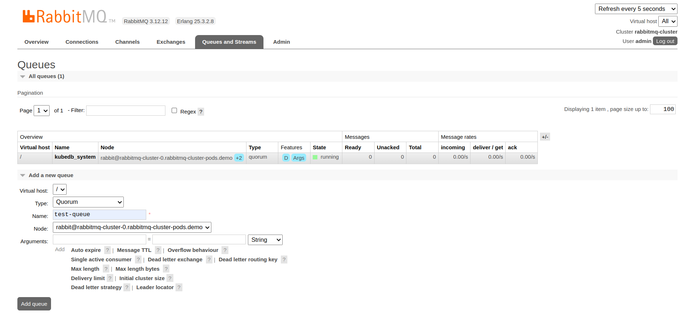
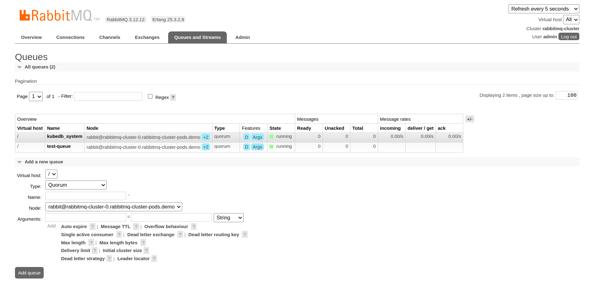
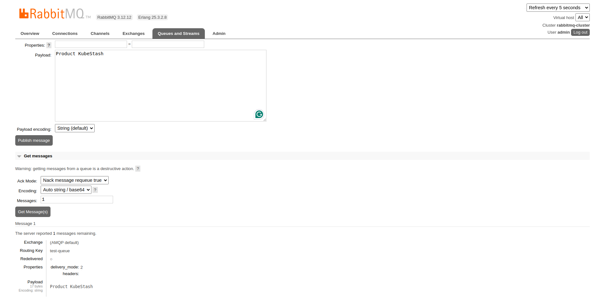
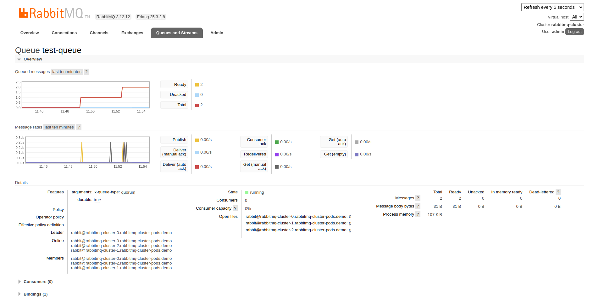

## Overview

KubeDB is the Kubernetes Native Database Management Solution which simplifies and automates routine database tasks such as Provisioning, Monitoring, Upgrading, Patching, Scaling, Volume Expansion, Backup, Recovery, Failure detection, and Repair for various popular databases on private and public clouds. The databases supported by KubeDB include MongoDB, Elasticsearch, MySQL, MariaDB, Redis, PostgreSQL, Solr, Microsoft SQL Server, Druid, FerretDB, SingleStore, Percona XtraDB, and Memcached. Additionally, KubeDB also supports ProxySQL, PgBouncer, Pgpool, ZooKeeper and the streaming platform Kafka, RabbitMQ. You can find the guides to all the supported databases in [KubeDB](https://kubedb.com/).
In this tutorial we will deploy RabbitMQ Cluster in Azure Kubernetes Service (AKS). We will cover the following steps:

1) Install KubeDB
2) Deploy RabbitMQ Cluster
3) Publish & Consume Messages with RabbitMQ


### Get Cluster ID

We need the cluster ID to get the KubeDB License.
To get cluster ID, we can run the following command:

```bash
$ kubectl get ns kube-system -o jsonpath='{.metadata.uid}'
8e336615-0dbb-4ae8-b72f-2e7ec34c399d
```

### Get License

Go to [Appscode License Server](https://license-issuer.appscode.com/) to get the license.txt file. For this tutorial we will use KubeDB.


### Install KubeDB

We will use helm to install KubeDB. Please install [helm](https://helm.sh/docs/intro/install/), if it is not already installed.
Now, let's install `KubeDB`.

```bash
$ helm search repo appscode/kubedb
NAME                              	CHART VERSION	APP VERSION	DESCRIPTION                                       
appscode/kubedb                   	v2024.8.21   	v2024.8.21 	KubeDB by AppsCode - Production ready databases...
appscode/kubedb-autoscaler        	v0.32.0      	v0.32.0    	KubeDB Autoscaler by AppsCode - Autoscale KubeD...
appscode/kubedb-catalog           	v2024.8.21   	v2024.8.21 	KubeDB Catalog by AppsCode - Catalog for databa...
appscode/kubedb-community         	v0.24.2      	v0.24.2    	KubeDB Community by AppsCode - Community featur...
appscode/kubedb-crd-manager       	v0.2.0       	v0.2.0     	KubeDB CRD Manager by AppsCode                    
appscode/kubedb-crds              	v2024.8.21   	v2024.8.21 	KubeDB Custom Resource Definitions                
appscode/kubedb-dashboard         	v0.23.0      	v0.23.0    	KubeDB Dashboard by AppsCode                      
appscode/kubedb-enterprise        	v0.11.2      	v0.11.2    	KubeDB Enterprise by AppsCode - Enterprise feat...
appscode/kubedb-grafana-dashboards	v2024.8.21   	v2024.8.21 	A Helm chart for kubedb-grafana-dashboards by A...
appscode/kubedb-kubestash-catalog 	v2024.8.21   	v2024.8.21 	KubeStash Catalog by AppsCode - Catalog of Kube...
appscode/kubedb-metrics           	v2024.8.21   	v2024.8.21 	KubeDB State Metrics                              
appscode/kubedb-one               	v2023.12.28  	v2023.12.28	KubeDB and Stash by AppsCode - Production ready...
appscode/kubedb-ops-manager       	v0.34.0      	v0.34.0    	KubeDB Ops Manager by AppsCode - Enterprise fea...
appscode/kubedb-opscenter         	v2024.8.21   	v2024.8.21 	KubeDB Opscenter by AppsCode                      
appscode/kubedb-provider-aws      	v2024.8.21   	v0.9.0     	A Helm chart for KubeDB AWS Provider for Crossp...
appscode/kubedb-provider-azure    	v2024.8.21   	v0.9.0     	A Helm chart for KubeDB Azure Provider for Cros...
appscode/kubedb-provider-gcp      	v2024.8.21   	v0.9.0     	A Helm chart for KubeDB GCP Provider for Crossp...
appscode/kubedb-provisioner       	v0.47.0      	v0.47.0    	KubeDB Provisioner by AppsCode - Community feat...
appscode/kubedb-schema-manager    	v0.23.0      	v0.23.0    	KubeDB Schema Manager by AppsCode                 
appscode/kubedb-ui                	v2024.8.21   	0.7.5      	A Helm chart for Kubernetes                       
appscode/kubedb-ui-presets        	v2024.8.21   	v2024.8.21 	KubeDB UI Presets                                 
appscode/kubedb-ui-server         	v2021.12.21  	v2021.12.21	A Helm chart for kubedb-ui-server by AppsCode     
appscode/kubedb-webhook-server    	v0.23.0      	v0.23.0    	KubeDB Webhook Server by AppsCode   

$ helm install kubedb oci://ghcr.io/appscode-charts/kubedb \
  --version v2024.8.21 \
  --namespace kubedb --create-namespace \
  --set-file global.license=/path/to/the/license.txt \
  --set global.featureGates.RabbitMQ=true \
  --wait --burst-limit=10000 --debug
```

Let's verify the installation:

```bash
$ kubectl get pods --all-namespaces -l "app.kubernetes.io/instance=kubedb"
NAMESPACE   NAME                                            READY   STATUS    RESTARTS      AGE
kubedb      kubedb-kubedb-autoscaler-c5cdb7cfb-c5dqc        1/1     Running   0             2m10s
kubedb      kubedb-kubedb-ops-manager-8fdf4d9f7-lm6cf       1/1     Running   0             2m11s
kubedb      kubedb-kubedb-provisioner-7fd88564c7-lsvrt      1/1     Running   2             2m11s
kubedb      kubedb-kubedb-webhook-server-5d78fd664c-fxbxj   1/1     Running   0             2m11s
kubedb      kubedb-petset-operator-77b6b9897f-x8h6t         1/1     Running   0             2m12s
kubedb      kubedb-petset-webhook-server-7545b5cfbc-948z2   2/2     Running   0             2m11s
kubedb      kubedb-sidekick-c898cff4c-z66sm                 1/1     Running   0             2m12s
```

We can list the CRD Groups that have been registered by the operator by running the following command:

```bash
$ kubectl get crd -l app.kubernetes.io/name=kubedb
NAME                                               CREATED AT
clickhouseversions.catalog.kubedb.com              2024-09-27T06:22:28Z
connectclusters.kafka.kubedb.com                   2024-09-27T06:23:02Z
connectors.kafka.kubedb.com                        2024-09-27T06:23:02Z
druidversions.catalog.kubedb.com                   2024-09-27T06:22:28Z
elasticsearchautoscalers.autoscaling.kubedb.com    2024-09-27T06:22:59Z
elasticsearchdashboards.elasticsearch.kubedb.com   2024-09-27T06:22:59Z
elasticsearches.kubedb.com                         2024-09-27T06:22:58Z
elasticsearchopsrequests.ops.kubedb.com            2024-09-27T06:22:59Z
elasticsearchversions.catalog.kubedb.com           2024-09-27T06:22:28Z
etcdversions.catalog.kubedb.com                    2024-09-27T06:22:28Z
ferretdbversions.catalog.kubedb.com                2024-09-27T06:22:28Z
kafkaautoscalers.autoscaling.kubedb.com            2024-09-27T06:23:02Z
kafkaconnectorversions.catalog.kubedb.com          2024-09-27T06:22:28Z
kafkaopsrequests.ops.kubedb.com                    2024-09-27T06:23:02Z
kafkas.kubedb.com                                  2024-09-27T06:23:02Z
kafkaversions.catalog.kubedb.com                   2024-09-27T06:22:28Z
mariadbarchivers.archiver.kubedb.com               2024-09-27T06:23:06Z
mariadbautoscalers.autoscaling.kubedb.com          2024-09-27T06:23:05Z
mariadbdatabases.schema.kubedb.com                 2024-09-27T06:23:05Z
mariadbopsrequests.ops.kubedb.com                  2024-09-27T06:23:05Z
mariadbs.kubedb.com                                2024-09-27T06:23:05Z
mariadbversions.catalog.kubedb.com                 2024-09-27T06:22:29Z
memcachedversions.catalog.kubedb.com               2024-09-27T06:22:29Z
mongodbarchivers.archiver.kubedb.com               2024-09-27T06:23:09Z
mongodbautoscalers.autoscaling.kubedb.com          2024-09-27T06:23:09Z
mongodbdatabases.schema.kubedb.com                 2024-09-27T06:23:09Z
mongodbopsrequests.ops.kubedb.com                  2024-09-27T06:23:09Z
mongodbs.kubedb.com                                2024-09-27T06:23:09Z
mongodbversions.catalog.kubedb.com                 2024-09-27T06:22:29Z
mssqlserverversions.catalog.kubedb.com             2024-09-27T06:22:29Z
mysqlarchivers.archiver.kubedb.com                 2024-09-27T06:23:13Z
mysqlautoscalers.autoscaling.kubedb.com            2024-09-27T06:23:13Z
mysqldatabases.schema.kubedb.com                   2024-09-27T06:23:13Z
mysqlopsrequests.ops.kubedb.com                    2024-09-27T06:23:13Z
mysqls.kubedb.com                                  2024-09-27T06:23:13Z
mysqlversions.catalog.kubedb.com                   2024-09-27T06:22:29Z
perconaxtradbversions.catalog.kubedb.com           2024-09-27T06:22:29Z
pgbouncerversions.catalog.kubedb.com               2024-09-27T06:22:29Z
pgpoolversions.catalog.kubedb.com                  2024-09-27T06:22:29Z
postgresarchivers.archiver.kubedb.com              2024-09-27T06:23:16Z
postgresautoscalers.autoscaling.kubedb.com         2024-09-27T06:23:16Z
postgresdatabases.schema.kubedb.com                2024-09-27T06:23:16Z
postgreses.kubedb.com                              2024-09-27T06:23:16Z
postgresopsrequests.ops.kubedb.com                 2024-09-27T06:23:16Z
postgresversions.catalog.kubedb.com                2024-09-27T06:22:29Z
proxysqlversions.catalog.kubedb.com                2024-09-27T06:22:29Z
publishers.postgres.kubedb.com                     2024-09-27T06:23:16Z
rabbitmqautoscalers.autoscaling.kubedb.com         2024-09-27T06:22:29Z
rabbitmqopsrequests.ops.kubedb.com                 2024-09-27T06:22:29Z
rabbitmqs.kubedb.com                               2024-09-27T06:22:29Z
rabbitmqversions.catalog.kubedb.com                2024-09-27T06:22:29Z
redisautoscalers.autoscaling.kubedb.com            2024-09-27T06:23:20Z
redises.kubedb.com                                 2024-09-27T06:23:19Z
redisopsrequests.ops.kubedb.com                    2024-09-27T06:23:20Z
redissentinelautoscalers.autoscaling.kubedb.com    2024-09-27T06:23:20Z
redissentinelopsrequests.ops.kubedb.com            2024-09-27T06:23:20Z
redissentinels.kubedb.com                          2024-09-27T06:23:20Z
redisversions.catalog.kubedb.com                   2024-09-27T06:22:29Z
restproxies.kafka.kubedb.com                       2024-09-27T06:23:02Z
schemaregistries.kafka.kubedb.com                  2024-09-27T06:23:02Z
schemaregistryversions.catalog.kubedb.com          2024-09-27T06:22:29Z
singlestoreversions.catalog.kubedb.com             2024-09-27T06:22:29Z
solrversions.catalog.kubedb.com                    2024-09-27T06:22:29Z
subscribers.postgres.kubedb.com                    2024-09-27T06:23:16Z
zookeeperversions.catalog.kubedb.com               2024-09-27T06:22:29Z
```

## Deploy RabbitMQ Cluster

We are going to Deploy RabbitMQ Cluster by using KubeDB. First, let’s create a Namespace in which we will deploy RabbitMQ.

```bash
$ kubectl create namespace demo
namespace/demo created
```

Here is the yaml of the RabbitMQ we are going to use:

```yaml
apiVersion: kubedb.com/v1alpha2
kind: RabbitMQ
metadata:
  name: rabbitmq-cluster
  namespace: demo
spec:
  version: "3.12.12"
  replicas: 3
  storage:
    accessModes:
      - ReadWriteOnce
    resources:
      requests:
        storage: 1Gi
    storageClassName: default
  storageType: Durable
  deletionPolicy: WipeOut
```

Let's save this yaml configuration into `rabbitmq-cluster.yaml` 
Then apply the above RabbitMQ yaml,

```bash
$ kubectl apply -f rabbitmq-cluster.yaml
rabbitmq.kubedb.com/rabbitmq-cluster created
```

In this yaml,

* `spec.replicas` is used to provide the number of required replicas or, peers for intended rabbitmq cluster.
* `spec.version` field specifies the version of RabbitMQ. Here, we are using RabbitMQ `3.12.12`. You can list the KubeDB supported versions of RabbitMQ by running `$ kubectl get rabbitmqversions` command.
* `spec.storage.storageClassName` is the name of the StorageClass used to provision PVCs.
* `spec.deletionPolicy` field is *Wipeout* means it will be deleted without restrictions. It can also be “Halt”, “Delete” and “DoNotTerminate”.

Once these are handled correctly and the RabbitMQ object is deployed, you will see that the following resources are created:

```bash
$ kubectl get all -n demo
NAME                     READY   STATUS    RESTARTS   AGE
pod/rabbitmq-cluster-0   1/1     Running   0          3m49s
pod/rabbitmq-cluster-1   1/1     Running   0          3m13s
pod/rabbitmq-cluster-2   1/1     Running   0          2m43s

NAME                                 TYPE        CLUSTER-IP       EXTERNAL-IP   PORT(S)                                           AGE
service/rabbitmq-cluster             ClusterIP   10.128.167.88    <none>        5672/TCP,1883/TCP,61613/TCP,15675/TCP,15674/TCP   3m51s
service/rabbitmq-cluster-dashboard   ClusterIP   10.128.245.103   <none>        15672/TCP                                         3m51s
service/rabbitmq-cluster-pods        ClusterIP   None             <none>        4369/TCP,25672/TCP                                3m51s

NAME                                                  TYPE                  VERSION   AGE
appbinding.appcatalog.appscode.com/rabbitmq-cluster   kubedb.com/rabbitmq   3.12.12   3m50s

NAME                                   TYPE                  VERSION   STATUS   AGE
rabbitmq.kubedb.com/rabbitmq-cluster   kubedb.com/v1alpha2   3.12.12   Ready    3m52s
```
Let’s check if the `rabbitmq-cluster` is ready to use,

```bash
$ kubectl get rabbitmq -n demo rabbitmq-cluster
NAME               TYPE                  VERSION   STATUS   AGE
rabbitmq-cluster   kubedb.com/v1alpha2   3.12.12   Ready    4m12s
```
> We have successfully deployed RabbitMQ in Azure.

## Connect with RabbitMQ UI

We will use [port forwarding](https://kubernetes.io/docs/tasks/access-application-cluster/port-forward-access-application-cluster/) to connect with RabbitMQ.

#### Port-forward the Service

KubeDB will create few Services to connect with the RabbitMQ. Let’s check the Services by following command,

```bash
$ kubectl get service -n demo
NAME                         TYPE        CLUSTER-IP       EXTERNAL-IP   PORT(S)                                           AGE
rabbitmq-cluster             ClusterIP   10.128.167.88    <none>        5672/TCP,1883/TCP,61613/TCP,15675/TCP,15674/TCP   4m30s
rabbitmq-cluster-dashboard   ClusterIP   10.128.245.103   <none>        15672/TCP                                         4m30s
rabbitmq-cluster-pods        ClusterIP   None             <none>        4369/TCP,25672/TCP                                4m30s
```
Here, we are going to use `rabbitmq-cluster` Service to connect with the database. Now, let’s port-forward the `rabbitmq-cluster` Service to the port `15672` to local machine:

```bash
$ kubectl port-forward -n demo svc/rabbitmq-cluster-dashboard 15672
Forwarding from 127.0.0.1:15672 -> 15672
Forwarding from [::1]:15672 -> 15672
```
Now, our RabbitMQ UI is accessible at `localhost:15672`.

### Accessing RabbitMQ Through UI

To access RabbitMQ through the UI, we first need the login credentials.

#### Get the Credentials

KubeDB create some Secrets for the database. Let’s check which Secrets have been created by KubeDB for our `rabbitmq-cluster`.

```bash
$ kubectl get secret -n demo
NAME                             TYPE                       DATA   AGE
rabbitmq-cluster-admin-cred      kubernetes.io/basic-auth   2      7m14s
rabbitmq-cluster-config          Opaque                     2      7m14s
rabbitmq-cluster-erlang-cookie   Opaque                     1      7m14s
```
Now, we can use `rabbitmq-cluster-admin-cred` which contains the admin level credentials to connect with the RabbitMQ. You can obtain these credentials by running the following commands:

```bash
$ kubectl get secret -n demo rabbitmq-cluster-admin-cred -o jsonpath='{.data.username}' | base64 -d
admin
$ kubectl get secret -n demo rabbitmq-cluster-admin-cred -o jsonpath='{.data.password}' | base64 -d
hymFVy0aoRlNxp8X
```
With the credentials in hand, open your web browser and navigate to `http://localhost:15672/`. You will see the RabbitMQ login panel. Enter the username `admin` and the password `hymFVy0aoRlNxp8X` to access the RabbitMQ UI.


Once logged in, click on the `Queues & Streams` section to manage queues. Here, we are going to add a new queue named `test-queue`.





After creating the queue, click on `test-queue` to view its overview. This section provides various details and actions for managing the queue.


Next, navigate to the `Publish message` section to publish some test messages to `test-queue`. Enter the message details in the `payload` field and click the `Publish message` button to publish the message.


To retrieve the messages you have just published, go to the `Get messages` section of `test-queue`. Click the `Get Message(s)` button, and the messages will be fetched from the queue.


You can repeat the process of publishing and getting messages to see how RabbitMQ handles them.



Finally, the statistics in the overview section of `test-queue` will show the number of messages and other relevant information after your interactions.



> So, we have deployed RabbitMQ on Kubernetes and accessed the RabbitMQ UI for publishing and consuming messages. More information about Deploy & Manage RabbitMQ on Kubernetes can be found in [RabbitMQ Kubernetes](https://kubedb.com/kubernetes/databases/run-and-manage-rabbitmq-on-kubernetes/).

We have made a in depth tutorial on Provision and Manage RabbitMQ Cluster on Kubernetes using KubeDB. You can have a look into the video below:

<iframe width="560" height="315" src="https://www.youtube.com/embed/g5HgBUtmbPc?si=IrL9WawnZB8L5mq7" title="YouTube video player" frameborder="0" allow="accelerometer; autoplay; clipboard-write; encrypted-media; gyroscope; picture-in-picture; web-share" referrerpolicy="strict-origin-when-cross-origin" allowfullscreen></iframe>

## Support

To speak with us, please leave a message on [our website](https://appscode.com/contact/).

To receive product announcements, follow us on [X](https://twitter.com/KubeDB).

To watch tutorials of various Production-Grade Kubernetes Tools Subscribe our [YouTube](https://www.youtube.com/c/AppsCodeInc/) channel.

More about [RabbitMQ on Kubernetes](https://kubedb.com/kubernetes/databases/run-and-manage-rabbitmq-on-kubernetes/)

If you have found a bug with KubeDB or want to request for new features, please [file an issue](https://github.com/kubedb/project/issues/new).
