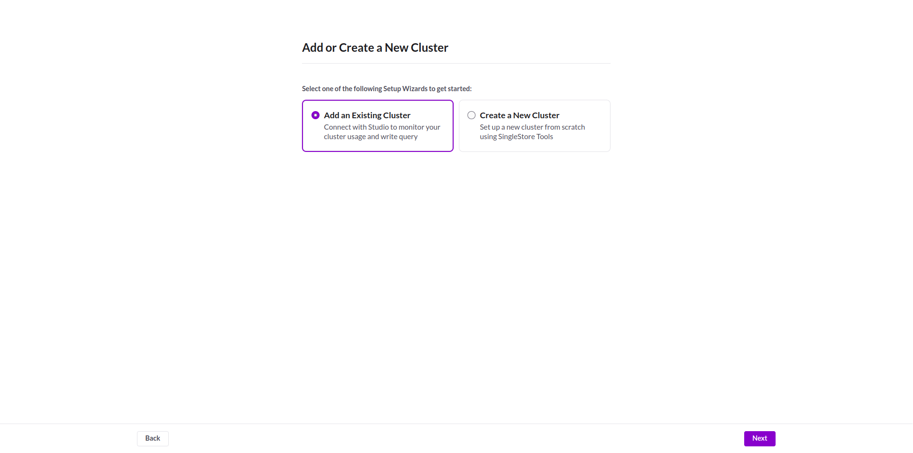
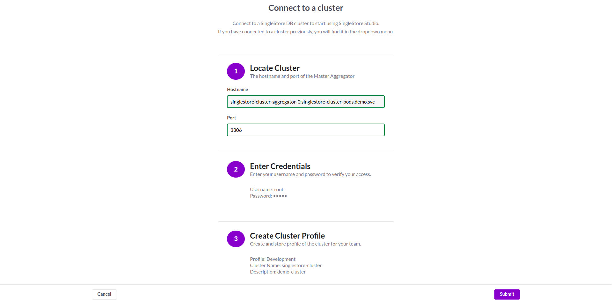
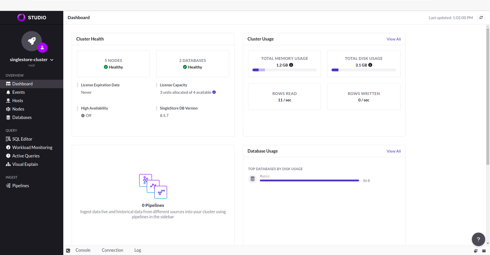

## Overview

KubeDB is the Kubernetes Native Database Management Solution which simplifies and automates routine database tasks such as Provisioning, Monitoring, Upgrading, Patching, Scaling, Volume Expansion, Backup, Recovery, Failure detection, and Repair for various popular databases on private and public clouds. The databases supported by KubeDB include MongoDB, Elasticsearch, MySQL, MariaDB, Redis, PostgreSQL, FerretDB, SingleStore, Percona XtraDB, and Memcached. Additionally, KubeDB also supports ProxySQL, PgBouncer, Pgpool, ZooKeeper and the streaming platform Kafka, RabbitMQ. You can find the guides to all the supported databases in [KubeDB](https://kubedb.com/).
In this tutorial we will deploy SingleStore in Google Kubernetes Engine (GKE) Using KubeDB. We will cover the following steps:

1. Install KubeDB
2. Deploy SingleStore Cluster
3. Read/Write Sample Data
4. Access SingleStore Studio UI

### Get Cluster ID

We need the cluster ID to get the KubeDB License. To get cluster ID, we can run the following command:

```bash
$ kubectl get ns kube-system -o jsonpath='{.metadata.uid}'
8e336615-0dbb-4ae8-b72f-2e7ec34c399d
```

### Get License

Go to [Appscode License Server](https://license-issuer.appscode.com/) to get the license.txt file. For this tutorial we will use KubeDB.


### Install KubeDB

We will use helm to install KubeDB. Please install helm [here](https://helm.sh/docs/intro/install/) if it is not already installed.
Now, let's install `KubeDB`.

```bash
$ helm search repo appscode/kubedb
NAME                              	CHART VERSION	APP VERSION	DESCRIPTION                                       
appscode/kubedb                   	v2024.6.4    	v2024.6.4  	KubeDB by AppsCode - Production ready databases...
appscode/kubedb-autoscaler        	v0.31.0      	v0.31.0    	KubeDB Autoscaler by AppsCode - Autoscale KubeD...
appscode/kubedb-catalog           	v2024.6.4    	v2024.6.4  	KubeDB Catalog by AppsCode - Catalog for databa...
appscode/kubedb-community         	v0.24.2      	v0.24.2    	KubeDB Community by AppsCode - Community featur...
appscode/kubedb-crd-manager       	v0.1.0       	v0.1.0     	KubeDB CRD Manager by AppsCode                    
appscode/kubedb-crds              	v2024.6.4    	v2024.6.4  	KubeDB Custom Resource Definitions                
appscode/kubedb-dashboard         	v0.22.0      	v0.22.0    	KubeDB Dashboard by AppsCode                      
appscode/kubedb-enterprise        	v0.11.2      	v0.11.2    	KubeDB Enterprise by AppsCode - Enterprise feat...
appscode/kubedb-grafana-dashboards	v2024.6.4    	v2024.6.4  	A Helm chart for kubedb-grafana-dashboards by A...
appscode/kubedb-kubestash-catalog 	v2024.6.4    	v2024.6.4  	KubeStash Catalog by AppsCode - Catalog of Kube...
appscode/kubedb-metrics           	v2024.6.4    	v2024.6.4  	KubeDB State Metrics                              
appscode/kubedb-one               	v2023.12.28  	v2023.12.28	KubeDB and Stash by AppsCode - Production ready...
appscode/kubedb-ops-manager       	v0.33.0      	v0.33.0    	KubeDB Ops Manager by AppsCode - Enterprise fea...
appscode/kubedb-opscenter         	v2024.6.4    	v2024.6.4  	KubeDB Opscenter by AppsCode                      
appscode/kubedb-provider-aws      	v2024.6.4    	v0.8.0     	A Helm chart for KubeDB AWS Provider for Crossp...
appscode/kubedb-provider-azure    	v2024.6.4    	v0.8.0     	A Helm chart for KubeDB Azure Provider for Cros...
appscode/kubedb-provider-gcp      	v2024.6.4    	v0.8.0     	A Helm chart for KubeDB GCP Provider for Crossp...
appscode/kubedb-provisioner       	v0.46.0      	v0.46.0    	KubeDB Provisioner by AppsCode - Community feat...
appscode/kubedb-schema-manager    	v0.22.0      	v0.22.0    	KubeDB Schema Manager by AppsCode                 
appscode/kubedb-ui                	v2024.6.3    	0.6.8      	A Helm chart for Kubernetes                       
appscode/kubedb-ui-server         	v2021.12.21  	v2021.12.21	A Helm chart for kubedb-ui-server by AppsCode     
appscode/kubedb-webhook-server    	v0.22.0      	v0.22.0    	KubeDB Webhook Server by AppsCode 


$ helm install kubedb oci://ghcr.io/appscode-charts/kubedb \
  --version v2024.6.4 \
  --namespace kubedb --create-namespace \
  --set-file global.license=/path/to/the/license.txt \
  --set global.featureGates.Singlestore=true \
  --wait --burst-limit=10000 --debug
```

Let's verify the installation:

```bash
$ kubectl get pods --all-namespaces -l "app.kubernetes.io/instance=kubedb"
NAMESPACE   NAME                                            READY   STATUS    RESTARTS      AGE
kubedb      kubedb-kubedb-autoscaler-849f7b8d8-26xdx        1/1     Running   0             74s
kubedb      kubedb-kubedb-ops-manager-9f46c95b6-ffd6x       1/1     Running   0             74s
kubedb      kubedb-kubedb-provisioner-7cd66fc98c-cf8mm      1/1     Running   0             74s
kubedb      kubedb-kubedb-webhook-server-78f9bc4c6f-fsgx2   1/1     Running   0             74s
kubedb      kubedb-petset-operator-77b6b9897f-px2l2         1/1     Running   0             74s
kubedb      kubedb-petset-webhook-server-58df6f6488-lhtvl   2/2     Running   0             74s
kubedb      kubedb-sidekick-c898cff4c-w22l8                 1/1     Running   0             74s
```

We can list the CRD Groups that have been registered by the operator by running the following command:

```bash
$ kubectl get crd -l app.kubernetes.io/name=kubedb
NAME                                               CREATED AT
clickhouseversions.catalog.kubedb.com              2024-06-24T04:24:45Z
connectclusters.kafka.kubedb.com                   2024-06-24T04:25:38Z
connectors.kafka.kubedb.com                        2024-06-24T04:25:38Z
druidversions.catalog.kubedb.com                   2024-06-24T04:24:45Z
elasticsearchautoscalers.autoscaling.kubedb.com    2024-06-24T04:25:34Z
elasticsearchdashboards.elasticsearch.kubedb.com   2024-06-24T04:25:34Z
elasticsearches.kubedb.com                         2024-06-24T04:25:34Z
elasticsearchopsrequests.ops.kubedb.com            2024-06-24T04:25:34Z
elasticsearchversions.catalog.kubedb.com           2024-06-24T04:24:45Z
etcdversions.catalog.kubedb.com                    2024-06-24T04:24:45Z
ferretdbversions.catalog.kubedb.com                2024-06-24T04:24:45Z
kafkaautoscalers.autoscaling.kubedb.com            2024-06-24T04:25:38Z
kafkaconnectorversions.catalog.kubedb.com          2024-06-24T04:24:46Z
kafkaopsrequests.ops.kubedb.com                    2024-06-24T04:25:38Z
kafkas.kubedb.com                                  2024-06-24T04:25:38Z
kafkaversions.catalog.kubedb.com                   2024-06-24T04:24:46Z
mariadbarchivers.archiver.kubedb.com               2024-06-24T04:25:42Z
mariadbautoscalers.autoscaling.kubedb.com          2024-06-24T04:25:42Z
mariadbdatabases.schema.kubedb.com                 2024-06-24T04:25:42Z
mariadbopsrequests.ops.kubedb.com                  2024-06-24T04:25:42Z
mariadbs.kubedb.com                                2024-06-24T04:25:41Z
mariadbversions.catalog.kubedb.com                 2024-06-24T04:24:46Z
memcachedversions.catalog.kubedb.com               2024-06-24T04:24:46Z
mongodbarchivers.archiver.kubedb.com               2024-06-24T04:25:46Z
mongodbautoscalers.autoscaling.kubedb.com          2024-06-24T04:25:46Z
mongodbdatabases.schema.kubedb.com                 2024-06-24T04:25:47Z
mongodbopsrequests.ops.kubedb.com                  2024-06-24T04:25:46Z
mongodbs.kubedb.com                                2024-06-24T04:25:46Z
mongodbversions.catalog.kubedb.com                 2024-06-24T04:24:46Z
mssqlserverversions.catalog.kubedb.com             2024-06-24T04:24:46Z
mysqlarchivers.archiver.kubedb.com                 2024-06-24T04:25:50Z
mysqlautoscalers.autoscaling.kubedb.com            2024-06-24T04:25:50Z
mysqldatabases.schema.kubedb.com                   2024-06-24T04:25:51Z
mysqlopsrequests.ops.kubedb.com                    2024-06-24T04:25:50Z
mysqls.kubedb.com                                  2024-06-24T04:25:50Z
mysqlversions.catalog.kubedb.com                   2024-06-24T04:24:46Z
perconaxtradbversions.catalog.kubedb.com           2024-06-24T04:24:46Z
pgbouncerversions.catalog.kubedb.com               2024-06-24T04:24:46Z
pgpoolversions.catalog.kubedb.com                  2024-06-24T04:24:46Z
postgresarchivers.archiver.kubedb.com              2024-06-24T04:25:55Z
postgresautoscalers.autoscaling.kubedb.com         2024-06-24T04:25:54Z
postgresdatabases.schema.kubedb.com                2024-06-24T04:25:55Z
postgreses.kubedb.com                              2024-06-24T04:25:54Z
postgresopsrequests.ops.kubedb.com                 2024-06-24T04:25:54Z
postgresversions.catalog.kubedb.com                2024-06-24T04:24:46Z
proxysqlversions.catalog.kubedb.com                2024-06-24T04:24:46Z
publishers.postgres.kubedb.com                     2024-06-24T04:25:55Z
rabbitmqversions.catalog.kubedb.com                2024-06-24T04:24:46Z
redisautoscalers.autoscaling.kubedb.com            2024-06-24T04:25:58Z
redises.kubedb.com                                 2024-06-24T04:25:58Z
redisopsrequests.ops.kubedb.com                    2024-06-24T04:25:58Z
redissentinelautoscalers.autoscaling.kubedb.com    2024-06-24T04:25:59Z
redissentinelopsrequests.ops.kubedb.com            2024-06-24T04:25:59Z
redissentinels.kubedb.com                          2024-06-24T04:25:59Z
redisversions.catalog.kubedb.com                   2024-06-24T04:24:46Z
schemaregistries.kafka.kubedb.com                  2024-06-24T04:25:38Z
schemaregistryversions.catalog.kubedb.com          2024-06-24T04:24:46Z
singlestoreautoscalers.autoscaling.kubedb.com      2024-06-24T04:26:02Z
singlestoreopsrequests.ops.kubedb.com              2024-06-24T04:26:02Z
singlestores.kubedb.com                            2024-06-24T04:26:02Z
singlestoreversions.catalog.kubedb.com             2024-06-24T04:24:46Z
solrversions.catalog.kubedb.com                    2024-06-24T04:24:46Z
subscribers.postgres.kubedb.com                    2024-06-24T04:25:55Z
zookeeperversions.catalog.kubedb.com               2024-06-24T04:24:47Z
```

### Create SingleStore License Secret

First, we need to create a namespace for our SingleStore deployment. Open your terminal and run the following command:

```bash
$ kubectl create namespace demo
namespace/demo created
```
Next, you'll need a SingleStore license to create the SingleStore database. Ensure that you have acquired a license, then create a secret to store your license information. Run the following command, replacing `your-license-here` with your actual license key:

```bash
$ kubectl create secret generic -n demo license-secret \
    --from-literal=username=license \
    --from-literal=password='your-license-here'
```
With the namespace and license secret created, we can now deploy the SingleStore cluster.

## Deploy SingleStore Cluster

Here is the yaml of the SingleStore CR we are going to use:

```yaml
apiVersion: kubedb.com/v1alpha2
kind: Singlestore
metadata:
  name: singlestore-cluster
  namespace: demo
spec:
  version: "8.5.7"
  topology:
    aggregator:
      replicas: 2
      podTemplate:
        spec:
          containers:
          - name: singlestore
            resources:
              limits:
                memory: "2Gi"
                cpu: "600m"
              requests:
                memory: "2Gi"
                cpu: "600m"
      storage:
        storageClassName: "standard"
        accessModes:
        - ReadWriteOnce
        resources:
          requests:
            storage: 1Gi
    leaf:
      replicas: 3
      podTemplate:
        spec:
          containers:
            - name: singlestore
              resources:
                limits:
                  memory: "2Gi"
                  cpu: "600m"
                requests:
                  memory: "2Gi"
                  cpu: "600m"                      
      storage:
        storageClassName: "standard"
        accessModes:
          - ReadWriteOnce
        resources:
          requests:
            storage: 10Gi
  licenseSecret:
    name: license-secret
  storageType: Durable
  deletionPolicy: WipeOut
```

Let's save this yaml configuration into `singlestore-cluster.yaml`
Then create the above SingleStore CR,

```bash
$ kubectl apply -f singlestore-cluster.yaml
singlestore.kubedb.com/singlestore-cluster created
```

In this yaml,

- In this yaml we can see in the `spec.version` field specifies the version of SingleStore. Here, we are using SingleStore `8.5.7`. You can list the KubeDB supported versions of SingleStore by running `$ kubectl get singlestoreversions` command.
- `spec.topology` represents the clustering configuration for SingleStore.
- `spec.topology.aggregator.replicas` or `spec.topology.leaf.replicas` specifies that the number replicas that will be used for aggregator or leaf.
- `spec.storageType` specifies the type of storage that will be used for SingleStore database. It can be `Durable` or `Ephemeral`.
- `spec.storage.storageClassName` is the name of the StorageClass used to provision PVCs.

Once these are handled correctly and the SingleStore cluster is deployed, you will see that the following objects are created:

```bash
$ kubectl get all -n demo
NAME                                   READY   STATUS    RESTARTS   AGE
pod/singlestore-cluster-aggregator-0   2/2     Running   0          4m55s
pod/singlestore-cluster-aggregator-1   2/2     Running   0          2m38s
pod/singlestore-cluster-leaf-0         2/2     Running   0          4m52s
pod/singlestore-cluster-leaf-1         2/2     Running   0          2m40s
pod/singlestore-cluster-leaf-2         2/2     Running   0          2m1s

NAME                               TYPE        CLUSTER-IP      EXTERNAL-IP   PORT(S)             AGE
service/singlestore-cluster        ClusterIP   10.128.124.98   <none>        3306/TCP,8081/TCP   4m59s
service/singlestore-cluster-pods   ClusterIP   None            <none>        3306/TCP            4m59s

NAME                                                     TYPE                     VERSION   AGE
appbinding.appcatalog.appscode.com/singlestore-cluster   kubedb.com/singlestore   8.5.7     74s
```

Let’s check if the database is ready to use,

```bash
$ kubectl get singlestore -n demo singlestore-cluster
NAME                  TYPE                  VERSION   STATUS   AGE
singlestore-cluster   kubedb.com/v1alpha2   8.5.7     Ready    5m45s
```

> We have successfully deployed SingleStore cluster in GKE. Now we can exec into the container to use the database.

### Accessing Database Through CLI

To access the database through CLI, we have to get the credentials to access. KubeDB will create Secret and Service for the database `singlestore-cluster` that we have deployed. Let’s check them using the following commands,

```bash
$ kubectl get secret -n demo -l=app.kubernetes.io/instance=singlestore-cluster
NAME                            TYPE                       DATA   AGE
singlestore-cluster-root-cred   kubernetes.io/basic-auth   2      8m20s

$ kubectl get service -n demo -l=app.kubernetes.io/instance=singlestore-cluster
NAME                       TYPE        CLUSTER-IP      EXTERNAL-IP   PORT(S)             AGE
singlestore-cluster        ClusterIP   10.128.124.98   <none>        3306/TCP,8081/TCP   8m55s
singlestore-cluster-pods   ClusterIP   None            <none>        3306/TCP            8m55s
```

Now, we are going to use `singlestore-cluster-root-cred` to get the credentials.

```bash
$ kubectl get secrets -n demo singlestore-cluster-root-cred -o jsonpath='{.data.username}' | base64 -d
root

$ kubectl get secrets -n demo singlestore-cluster-root-cred -o jsonpath='{.data.password}' | base64 -d
JpQuApDXJ3jJ3TwV
```

#### Insert Sample Data

In this section, we are going to login into our SingleStore database pod and insert some sample data.

```bash
$ kubectl exec -it singlestore-cluster-aggregator-0 -n demo -- bash
Defaulted container "singlestore" out of: singlestore, singlestore-coordinator, singlestore-init (init)
[memsql@singlestore-cluster-aggregator-0 /]$ memsql -uroot -p"JpQuApDXJ3jJ3TwV"

Server version: 5.7.32 SingleStoreDB source distribution (compatible; MySQL Enterprise & MySQL Commercial)

Copyright (c) 2000, 2022, Oracle and/or its affiliates.

Oracle is a registered trademark of Oracle Corporation and/or its
affiliates. Other names may be trademarks of their respective
owners.

Type 'help;' or '\h' for help. Type '\c' to clear the current input statement.

singlestore> SHOW DATABASES;
+--------------------+
| Database           |
+--------------------+
| cluster            |
| information_schema |
| memsql             |
| singlestore_health |
+--------------------+
4 rows in set (0.00 sec)

singlestore> CREATE DATABASE Music PARTITIONS 2;
Query OK, 1 row affected (3.35 sec)

singlestore> SHOW DATABASES;
+--------------------+
| Database           |
+--------------------+
| Music              |
| cluster            |
| information_schema |
| memsql             |
| singlestore_health |
+--------------------+
5 rows in set (0.00 sec)

singlestore> CREATE TABLE Music.Artist (id INT(6) UNSIGNED AUTO_INCREMENT PRIMARY KEY, Name VARCHAR(50), Song VARCHAR(50));
Query OK, 0 rows affected, 1 warning (0.23 sec)

singlestore> INSERT INTO Music.Artist (Name, Song) VALUES ("John Denver", "Take Me Home, Country Roads");
Query OK, 1 row affected (1.10 sec)

singlestore> SELECT * FROM Music.Artist;
+----+-------------+-----------------------------+
| id | Name        | Song                        |
+----+-------------+-----------------------------+
|  1 | John Denver | Take Me Home, Country Roads |
+----+-------------+-----------------------------+
1 row in set (0.11 sec)

singlestore> exit
Bye
```

> We've successfully inserted some sample data to our database. More information about Deploy & Manage SingleStore on Kubernetes can be found in [Kubernetes SingleStore](https://kubedb.com/kubernetes/databases/run-and-manage-singlestore-on-kubernetes/)


### Accessing SingleStore Studio UI

Now, we will access the SingleStore Studio UI using [port forwarding](https://kubernetes.io/docs/tasks/access-application-cluster/port-forward-access-application-cluster/), which will allow you to manage your SingleStore cluster via a web interface. Run the following command in your terminal, you should see output indicating that port forwarding is active:

```bash
$ kubectl port-forward -n demo service/singlestore-cluster 8081
Forwarding from 127.0.0.1:8081 -> 8081
Forwarding from [::1]:8081 -> 8081
```

Now, the SingleStore Studio UI is accessible at `localhost:8081`. Open your web browser and navigate to `localhost:8081`. You will see the SingleStore Studio login panel. Choose the `Add Existing Cluster` option and click the `Next` button.



Next, enter your cluster information, then click the `Submit` button.



Once you have provided all the valid information, you will gain access to the SingleStore Studio.



> Congratulations! You have successfully accessed the SingleStore Studio. This interface provides a convenient way to monitor and administer your SingleStore database.

We have made a in depth tutorial on Effortlessly Deploy and Manage SingleStore on Kubernetes using KubeDB. You can have a look into the video below:

<iframe width="560" height="315" src="https://www.youtube.com/embed/P_1J-3w889k?si=2HYRdyMYWxnEOQpa" title="YouTube video player" frameborder="0" allow="accelerometer; autoplay; clipboard-write; encrypted-media; gyroscope; picture-in-picture; web-share" referrerpolicy="strict-origin-when-cross-origin" allowfullscreen></iframe>

## Support

To speak with us, please leave a message on [our website](https://appscode.com/contact/).

To receive product announcements, follow us on [X](https://twitter.com/KubeDB).

To watch tutorials of various Production-Grade Kubernetes Tools Subscribe our [YouTube](https://youtube.com/@appscode) channel.

More about [SingleStore on Kubernetes](https://kubedb.com/kubernetes/databases/run-and-manage-singlestore-on-kubernetes/)

If you have found a bug with KubeDB or want to request for new features, please [file an issue](https://github.com/kubedb/project/issues/new).
