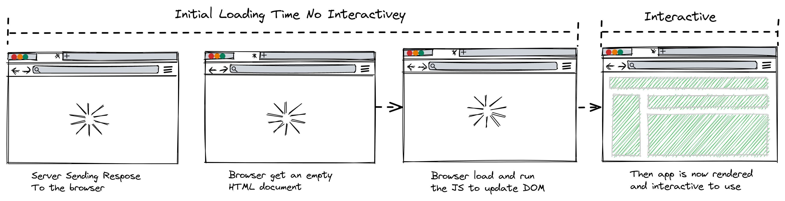
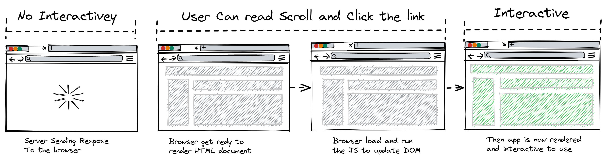
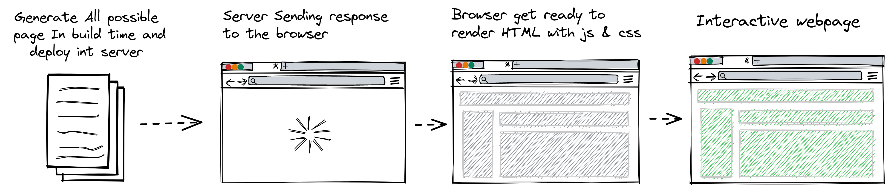
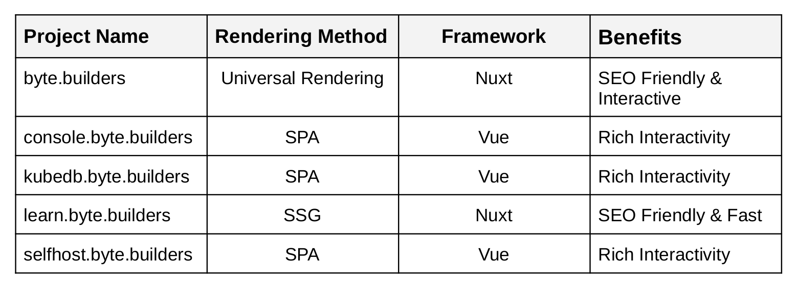

## Introduction

In the world of web development, choosing the correct UI rendering method is crucial to provide an optimal user experience. Various rendering methods, such as Client-Side Rendering (CSR), Server-Side Rendering (SSR), Static Site Generation (SSG), and Universal Rendering, offer different approaches to rendering web content. In this blog post, we will go through these rendering methods and try to understand when to choose which rendering method. By understanding these methods and their applications, we can make informed decisions when selecting the most suitable approach for our project.

### 1. Client-Side Rendering (CSR)

Client-Side Rendering is a technique in which web pages are rendered on the client's browser by utilizing JavaScript to change the DOM element. This method is often utilized with CSR frameworks including Vue.js, React, Svelte, Solid, and Angular. A simple HTML page is first loaded, and future content updates are fetched and rendered dynamically using API requests.

#### Advantages of CSR:

- Enhanced interactivity: CSR provides a responsive and interactive user
  experience by allowing real-time updates and seamless transitions between views.
- Improved development workflow: The separation of concerns enables frontend and backend developers to work independently, resulting in better collaboration and code maintenance.
- Rich ecosystem: CSR frameworks offer extensive libraries, tools, and community support for rapid development and a wide range of functionality.

#### When to use CSR:

- Building highly interactive applications that require real-time updates, such as social media platforms, collaboration tools, or dashboards.
- Requiring a single-page application (SPA) architecture for a seamless user experience without page reloads.
- Prioritizing developer productivity and leveraging the vast ecosystem of frontend libraries and frameworks.

### 2. Server-Side Rendering (SSR):

Server-Side Rendering involves rendering web pages on the server before sending them to the client's browser. This process of rendering web pages on the server before sending them to the client's browser is known as server-side rendering. SSR frameworks such as Next.js and Nuxt.js enable developers to build JavaScript code that runs on both the server and the client, allowing for efficient server-side rendering.

#### Advantages of SSR:

- Search engine optimization (SEO): SSR ensures that search engines can easily crawl and index the fully rendered HTML, leading to better search rankings and discoverability.
- Improved initial load time: SSR delivers a complete HTML page to the client, reducing the time required for the initial page load and enhancing perceived performance.
- Enhanced accessibility: SSR enables users with limited JavaScript support or slower devices to access fully rendered content.

#### When to use SSR:

- Developing content-focused websites, blogs, or e-commerce platforms where SEO is a priority.
- Seeking faster initial page loads and improved perceived performance.
- Catering to users with limited JavaScript support or slower devices.

### 3. Static Site Generation (SSG):

Static Site Generation involves pre-building the entire website during the build process, generating static HTML files for each page. SSG frameworks like Gatsby or Hugo, and Astro allow developers to create high-performance websites that can be served directly from a Content Delivery Network (CDN).

#### Advantages of SSG:

- Exceptional performance: SSG-generated static HTML files can be cached and served directly, resulting in fast page rendering and reduced server load.
- Cost-effective scalability: SSG sites can leverage CDNs, ensuring global scalability without the need for server-side infrastructure, leading to cost savings.
- Enhanced security: With no server-side processing, the attack surface is minimized, making SSG sites more secure.

#### When to use SSG:

- Building content-heavy websites, blogs, or documentation sites where content updates are infrequent.
- Requiring exceptional performance and scalability while reducing server-side complexity.
- Prioritizing security by minimizing the attack surface.

### 4. Universal Rendering (CSR + SSR):

In universal rendering when the browser requests a URL with universal (server-side + client-side) rendering enabled, the server returns a fully rendered HTML page to the browser. Whether the page has been generated in advance and cached or is rendered on the fly, at initial request, the JavaScript code run in a server environment, producing an HTML document. Users immediately get the content of our application, contrary to client-side rendering. This step is similar to traditional server-side rendering performed by PHP or Ruby applications.

To not lose the benefits of the client-side rendering method, such as dynamic interfaces and page transitions, the Client (browser) loads the JavaScript code that runs on the Server in the background once the HTML document has been downloaded. The browser interprets it again (hence Universal rendering) and CSR takes control of the document and enables interactivity.

### Out Projects

Here at Appscode, we have developed several web applications that utilize the different rendering techniques mentioned here. Some of them require high interactivity, some of then need SEO and others are content heavy. Depends on the project requirement to use different rendering method in our project. Here is a table that shows in which project we use which UI rending methods.

### Conclusion:

Selecting the appropriate UI rendering method depends on various factors such as project requirements, performance goals, and scalability needs. CSR is ideal for highly interactive applications, SSR enhances SEO and initial load time, SSG excels in content-heavy sites, and UR combines CSR with SSR. By understanding these rendering methods and their applications, we can make informed decisions to create exceptional web experiences.

## Support

To speak with us, please leave a message on [our website](https://appscode.com/contact/).

To join public discussions with the KubeDB community, join us in the [Kubernetes Slack team](https://kubernetes.slack.com/messages/C8149MREV/) channel `#kubedb`. To sign up, use our [Slack inviter](http://slack.kubernetes.io/).

To receive product announcements, follow us on [Twitter](https://twitter.com/KubeDB).

If you have found a bug with KubeDB or want to request for new features, please [file an issue](https://github.com/kubedb/project/issues/new).
