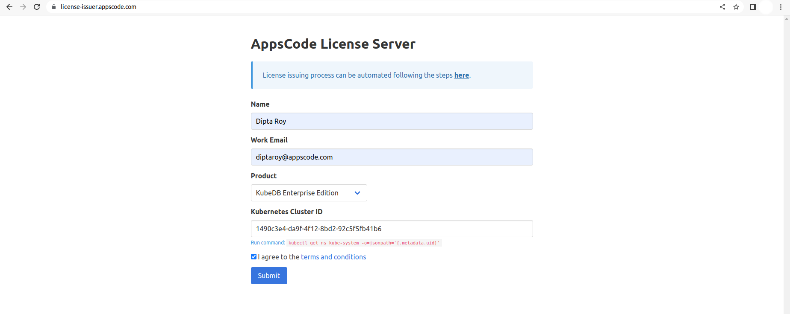

## Overview

KubeDB is the Kubernetes Native Database Management Solution which simplifies and automates routine database tasks such as Provisioning, Monitoring, Upgrading, Patching, Scaling, Volume Expansion, Backup, Recovery, Failure detection, and Repair for various popular databases on private and public clouds. The databases that KubeDB supports are MySQL, MongoDB, MariaDB, Elasticsearch, Redis, PostgreSQL, ProxySQL, Percona XtraDB, Memcached and PgBouncer. You can find the guides to all the supported databases [here](https://kubedb.com/).
In this tutorial we will show how to secure MySQL server using ACME Protocol issued TLS certificates with KubeDB. As we cannot use ACME Protocol issued TLS certificates directly to MysQL, we are going to use KubeDB provisioned ProxySQL server to secure the client connections with ACME protocol issued TLS certificates. We will cover the following steps:

1) Install KubeDB
2) Install cert-manager
3) Deploy Sample MySQL Database
4) Deploy ProxySQL with ACME Protocol issued TLS certificates
5) Setup Ingress to expose ProxySQL
5) Use MySQL database from Developer Workstation

## Install KubeDB

We will follow the steps to install KubeDB.

### Get Cluster ID

We need the cluster ID to get the KubeDB License.
To get cluster ID we can run the following command:

```bash
$ kubectl get ns kube-system -o jsonpath='{.metadata.uid}'
1490c3e4-da9f-4f12-8bd2-92c5f5fb41b6
```

### Get License

Go to [Appscode License Server](https://license-issuer.appscode.com/) to get the license.txt file. For this tutorial we will use KubeDB Enterprise Edition.



### Install KubeDB

We will use helm to install KubeDB. Please install helm [here](https://helm.sh/docs/intro/install/) if it is not already installed.
Now, let's install `KubeDB`.

```bash
$ helm repo add appscode https://charts.appscode.com/stable/
$ helm repo update

$ helm search repo appscode/kubedb
NAME                              	CHART VERSION	APP VERSION	DESCRIPTION                                       
appscode/kubedb                   	v2023.02.28  	v2023.02.28	KubeDB by AppsCode - Production ready databases...
appscode/kubedb-autoscaler        	v0.17.0      	v0.17.0    	KubeDB Autoscaler by AppsCode - Autoscale KubeD...
appscode/kubedb-catalog           	v2023.02.28  	v2023.02.28	KubeDB Catalog by AppsCode - Catalog for databa...
appscode/kubedb-community         	v0.24.2      	v0.24.2    	KubeDB Community by AppsCode - Community featur...
appscode/kubedb-crds              	v2023.02.28  	v2023.02.28	KubeDB Custom Resource Definitions                
appscode/kubedb-dashboard         	v0.8.0       	v0.8.0     	KubeDB Dashboard by AppsCode                      
appscode/kubedb-enterprise        	v0.11.2      	v0.11.2    	KubeDB Enterprise by AppsCode - Enterprise feat...
appscode/kubedb-grafana-dashboards	v2023.02.28  	v2023.02.28	A Helm chart for kubedb-grafana-dashboards by A...
appscode/kubedb-metrics           	v2023.02.28  	v2023.02.28	KubeDB State Metrics                              
appscode/kubedb-ops-manager       	v0.19.0      	v0.19.2    	KubeDB Ops Manager by AppsCode - Enterprise fea...
appscode/kubedb-opscenter         	v2023.02.28  	v2023.02.28	KubeDB Opscenter by AppsCode                      
appscode/kubedb-provisioner       	v0.32.0      	v0.32.1    	KubeDB Provisioner by AppsCode - Community feat...
appscode/kubedb-schema-manager    	v0.8.0       	v0.8.0     	KubeDB Schema Manager by AppsCode                 
appscode/kubedb-ui                	v2022.06.14  	0.3.26     	A Helm chart for Kubernetes                       
appscode/kubedb-ui-server         	v2021.12.21  	v2021.12.21	A Helm chart for kubedb-ui-server by AppsCode     
appscode/kubedb-webhook-server    	v0.8.0       	v0.8.0     	KubeDB Webhook Server by AppsCode  

# Install KubeDB Enterprise operator chart
$helm install kubedb appscode/kubedb \
  --version v2023.02.28 \
  --namespace kubedb --create-namespace \
  --set kubedb-provisioner.enabled=true \
  --set kubedb-ops-manager.enabled=true \
  --set kubedb-autoscaler.enabled=true \
  --set kubedb-dashboard.enabled=true \
  --set kubedb-schema-manager.enabled=true \
  --set-file global.license=/path/to/the/license.txt

```

Let's verify the installation:

```bash
$ watch kubectl get pods --all-namespaces -l "app.kubernetes.io/instance=kubedb"
NAMESPACE   NAME                                            READY   STATUS    RESTARTS        AGE
kubedb      kubedb-kubedb-autoscaler-5f54c44f78-jhf4p       1/1     Running   0               6m27s
kubedb      kubedb-kubedb-dashboard-7bbcdd5ff9-xqpxr        1/1     Running   0               6m27s
kubedb      kubedb-kubedb-ops-manager-f475b96db-rs6pf       1/1     Running   1               6m27s
kubedb      kubedb-kubedb-provisioner-7476c97f55-74sj4      1/1     Running   0               6m26s
kubedb      kubedb-kubedb-schema-manager-6f6db9f95f-q64q4   1/1     Running   0               6m27s
kubedb      kubedb-kubedb-webhook-server-99b6665b7-r4qd9    1/1     Running   0               6m27s
```

We can list the CRD Groups that have been registered by the operator by running the following command:

```bash
$ kubectl get crd -l app.kubernetes.io/name=kubedb
NAME                                              CREATED AT
elasticsearchautoscalers.autoscaling.kubedb.com   2023-03-09T19:23:34Z
elasticsearchdashboards.dashboard.kubedb.com      2023-03-09T19:25:39Z
elasticsearches.kubedb.com                        2023-03-09T19:24:52Z
elasticsearchopsrequests.ops.kubedb.com           2023-03-09T19:28:00Z
elasticsearchversions.catalog.kubedb.com          2023-03-09T19:21:07Z
etcds.kubedb.com                                  2023-03-09T19:24:52Z
etcdversions.catalog.kubedb.com                   2023-03-09T19:21:07Z
kafkas.kubedb.com                                 2023-03-09T19:24:57Z
kafkaversions.catalog.kubedb.com                  2023-03-09T19:21:07Z
mariadbautoscalers.autoscaling.kubedb.com         2023-03-09T19:23:34Z
mariadbdatabases.schema.kubedb.com                2023-03-09T19:26:43Z
mariadbopsrequests.ops.kubedb.com                 2023-03-09T19:28:16Z
mariadbs.kubedb.com                               2023-03-09T19:24:52Z
mariadbversions.catalog.kubedb.com                2023-03-09T19:21:07Z
memcacheds.kubedb.com                             2023-03-09T19:24:52Z
memcachedversions.catalog.kubedb.com              2023-03-09T19:21:07Z
mongodbautoscalers.autoscaling.kubedb.com         2023-03-09T19:23:34Z
mongodbdatabases.schema.kubedb.com                2023-03-09T19:26:40Z
mongodbopsrequests.ops.kubedb.com                 2023-03-09T19:28:04Z
mongodbs.kubedb.com                               2023-03-09T19:24:53Z
mongodbversions.catalog.kubedb.com                2023-03-09T19:21:07Z
mysqlautoscalers.autoscaling.kubedb.com           2023-03-09T19:23:34Z
mysqldatabases.schema.kubedb.com                  2023-03-09T19:26:40Z
mysqlopsrequests.ops.kubedb.com                   2023-03-09T19:28:12Z
mysqls.kubedb.com                                 2023-03-09T19:24:54Z
mysqlversions.catalog.kubedb.com                  2023-03-09T19:21:07Z
perconaxtradbautoscalers.autoscaling.kubedb.com   2023-03-09T19:23:34Z
perconaxtradbopsrequests.ops.kubedb.com           2023-03-09T19:28:31Z
perconaxtradbs.kubedb.com                         2023-03-09T19:24:54Z
perconaxtradbversions.catalog.kubedb.com          2023-03-09T19:21:07Z
pgbouncers.kubedb.com                             2023-03-09T19:24:54Z
pgbouncerversions.catalog.kubedb.com              2023-03-09T19:21:07Z
postgresautoscalers.autoscaling.kubedb.com        2023-03-09T19:23:34Z
postgresdatabases.schema.kubedb.com               2023-03-09T19:26:42Z
postgreses.kubedb.com                             2023-03-09T19:24:55Z
postgresopsrequests.ops.kubedb.com                2023-03-09T19:28:24Z
postgresversions.catalog.kubedb.com               2023-03-09T19:21:07Z
proxysqlautoscalers.autoscaling.kubedb.com        2023-03-09T19:23:35Z
proxysqlopsrequests.ops.kubedb.com                2023-03-09T19:28:28Z
proxysqls.kubedb.com                              2023-03-09T19:24:55Z
proxysqlversions.catalog.kubedb.com               2023-03-09T19:21:07Z
publishers.postgres.kubedb.com                    2023-03-09T19:28:42Z
redisautoscalers.autoscaling.kubedb.com           2023-03-09T19:23:35Z
redises.kubedb.com                                2023-03-09T19:24:56Z
redisopsrequests.ops.kubedb.com                   2023-03-09T19:28:20Z
redissentinelautoscalers.autoscaling.kubedb.com   2023-03-09T19:23:35Z
redissentinelopsrequests.ops.kubedb.com           2023-03-09T19:28:35Z
redissentinels.kubedb.com                         2023-03-09T19:24:56Z
redisversions.catalog.kubedb.com                  2023-03-09T19:21:07Z
subscribers.postgres.kubedb.com                   2023-03-09T19:28:45Z

```

## Deploy Sample MySQL Database

Now, we are going to Deploy MySQL using KubeDB.
Let's create a Namespace in which we will deploy the database.

```bash
$ kubectl create ns demo
namespace/demo created
```

Here is the yaml of the MySQL CRO we are going to use:

```yaml
apiVersion: kubedb.com/v1alpha2
kind: MySQL
metadata:
  name: mysql-server
  namespace: demo
spec:
  topology:
    mode: GroupReplication
  replicas: 3
  version: "8.0.29"
  storageType: Durable
  storage:
    storageClassName: linode-block-storage
    accessModes:
    - ReadWriteOnce
    resources:
      requests:
        storage: 1Gi
  terminationPolicy: Wipeout
```

Let's save this yaml configuration into `mysql-server.yaml` 
Then create the above MySQL CRO

```bash
$ kubectl create -f mysql-server.yaml
mysql.kubedb.com/mysql-server created
```

* In this yaml we can see in the `spec.version` field specifies the version of MySQL. Here, we are using MySQL `version 8.0.29`. You can list the KubeDB supported versions of MySQL by running `$ kubectl get mysqlversions` command.
* `spec.storage` specifies PVC spec that will be dynamically allocated to store data for this database. This storage spec will be passed to the StatefulSet created by KubeDB operator to run database pods. You can specify any StorageClass available in your cluster with appropriate resource requests.
* And the `spec.terminationPolicy` field is *Wipeout* means that the database will be deleted without restrictions. It can also be "Halt", "Delete" and "DoNotTerminate". Learn More about these [HERE](https://kubedb.com/docs/latest/guides/mysql/concepts/database/#specterminationpolicy).


### Install cert-manager

Now, we are going to install cert-manager by the following command:

```bash
$ kubectl apply -f https://github.com/cert-manager/cert-manager/releases/download/v1.10.1/cert-manager.yaml
namespace/cert-manager created
customresourcedefinition.apiextensions.k8s.io/clusterissuers.cert-manager.io created
customresourcedefinition.apiextensions.k8s.io/challenges.acme.cert-manager.io created
customresourcedefinition.apiextensions.k8s.io/certificaterequests.cert-manager.io created
customresourcedefinition.apiextensions.k8s.io/issuers.cert-manager.io created
customresourcedefinition.apiextensions.k8s.io/certificates.cert-manager.io created
customresourcedefinition.apiextensions.k8s.io/orders.acme.cert-manager.io created
serviceaccount/cert-manager-cainjector created
serviceaccount/cert-manager created
serviceaccount/cert-manager-webhook created
configmap/cert-manager-webhook created
clusterrole.rbac.authorization.k8s.io/cert-manager-cainjector created
clusterrole.rbac.authorization.k8s.io/cert-manager-controller-issuers created
clusterrole.rbac.authorization.k8s.io/cert-manager-controller-clusterissuers created
clusterrole.rbac.authorization.k8s.io/cert-manager-controller-certificates created
clusterrole.rbac.authorization.k8s.io/cert-manager-controller-orders created
clusterrole.rbac.authorization.k8s.io/cert-manager-controller-challenges created
clusterrole.rbac.authorization.k8s.io/cert-manager-controller-ingress-shim created
clusterrole.rbac.authorization.k8s.io/cert-manager-view created
clusterrole.rbac.authorization.k8s.io/cert-manager-edit created
clusterrole.rbac.authorization.k8s.io/cert-manager-controller-approve:cert-manager-io created
clusterrole.rbac.authorization.k8s.io/cert-manager-controller-certificatesigningrequests created
clusterrole.rbac.authorization.k8s.io/cert-manager-webhook:subjectaccessreviews created
clusterrolebinding.rbac.authorization.k8s.io/cert-manager-cainjector created
clusterrolebinding.rbac.authorization.k8s.io/cert-manager-controller-issuers created
clusterrolebinding.rbac.authorization.k8s.io/cert-manager-controller-clusterissuers created
clusterrolebinding.rbac.authorization.k8s.io/cert-manager-controller-certificates created
clusterrolebinding.rbac.authorization.k8s.io/cert-manager-controller-orders created
clusterrolebinding.rbac.authorization.k8s.io/cert-manager-controller-challenges created
clusterrolebinding.rbac.authorization.k8s.io/cert-manager-controller-ingress-shim created
clusterrolebinding.rbac.authorization.k8s.io/cert-manager-controller-approve:cert-manager-io created
clusterrolebinding.rbac.authorization.k8s.io/cert-manager-controller-certificatesigningrequests created
clusterrolebinding.rbac.authorization.k8s.io/cert-manager-webhook:subjectaccessreviews created
role.rbac.authorization.k8s.io/cert-manager-cainjector:leaderelection created
role.rbac.authorization.k8s.io/cert-manager:leaderelection created
role.rbac.authorization.k8s.io/cert-manager-webhook:dynamic-serving created
rolebinding.rbac.authorization.k8s.io/cert-manager-cainjector:leaderelection created
rolebinding.rbac.authorization.k8s.io/cert-manager:leaderelection created
rolebinding.rbac.authorization.k8s.io/cert-manager-webhook:dynamic-serving created
service/cert-manager created
service/cert-manager-webhook created
deployment.apps/cert-manager-cainjector created
deployment.apps/cert-manager created
deployment.apps/cert-manager-webhook created
mutatingwebhookconfiguration.admissionregistration.k8s.io/cert-manager-webhook created
validatingwebhookconfiguration.admissionregistration.k8s.io/cert-manager-webhook created

```

> Note: We are installing cert-manager version `v1.10.1`, you can specify your cert-manager version from [HERE](https://github.com/cert-manager/cert-manager/releases/)


#### Create an Issuer & Secret

Here, we are going to create an Issuer and Secret by using this yaml,

```yaml
apiVersion: cert-manager.io/v1
kind: Issuer
metadata:
  name: bytebuilders-xyz
  namespace: demo
spec:
  acme:
    # server: https://acme-v02.api.letsencrypt.org/directory
    server: https://acme-staging-v02.api.letsencrypt.org/directory
    email: tasdid@appscode.com
    # Name of a secret used to store the ACME account private key
    privateKeySecretRef:
      name: bytebuilders-xyz-acme
    # ACME DNS-01 provider configurations
    solvers:
    # An empty 'selector' means that this solver matches all domains
    - selector: {}
      dns01:
        cloudflare:
          email: tasdid@appscode.com
          apiTokenSecretRef:
            name: bytebuilders-xyz-cloudflare
            key: api-token

---
apiVersion: v1
kind: Secret
metadata:
  name: bytebuilders-xyz-cloudflare
  namespace: demo
type: Opaque
stringData:
  api-token: "$CLOUDFLARE_API_TOKEN"
```

Let's save this yaml configuration into `issuer.yaml` and apply it,

```bash
$ kubectl apply -f issuer.yaml 
issuer.cert-manager.io/bytebuilders-xyz created
secret/bytebuilders-xyz-cloudflare created
```

We will use this issuer to provision ProxySQL in the next step.

## Deploy ProxySQL 

Now, we are going to Deploy ProxySQL using KubeDB.

Here is the yaml of the ProxySQL 

```yaml
apiVersion: kubedb.com/v1alpha2
kind: ProxySQL
metadata:
  name: proxy-server
  namespace: demo
spec:
  version: "2.4.4-debian"
  replicas: 1
  mode: GroupReplication
  backend:
    name: mysql-server
  syncUsers: true
  tls:
    issuerRef:
      apiGroup: cert-manager.io
      kind: Issuer
      name: bytebuilders-xyz
    certificates:
    - alias: server
      dnsNames:
      - proxy.kubedb.cloud
  terminationPolicy: Delete
  healthChecker:
    failureThreshold: 3
```

Let's save this yaml configuration into `proxy-server.yaml` 
Then create the above ProxySQL CRO

```bash
$ kubectl create -f proxy-server.yaml
proxysql.kubedb.com/proxy-server created
```

Here in the `.spec.backend` section we need to mention the name of the backend appbinding. Let's get the current backend appbinding that has been auto generated by KubeDB while deploying the MySQL :

```bash
$ kubectl get appbinding -n demo mysql-server -oyaml

apiVersion: appcatalog.appscode.com/v1alpha1
kind: AppBinding
metadata:
  annotations:
    kubectl.kubernetes.io/last-applied-configuration: |
      ... ... ...
  creationTimestamp: "2023-03-08T11:36:33Z"
  generation: 1
  labels:
    app.kubernetes.io/component: database
    app.kubernetes.io/instance: mysql-server
    app.kubernetes.io/managed-by: kubedb.com
    app.kubernetes.io/name: mysqls.kubedb.com
  name: mysql-server
  namespace: demo
  ownerReferences:
  - apiVersion: kubedb.com/v1alpha2
    blockOwnerDeletion: true
    controller: true
    kind: MySQL
    name: mysql-server
    uid: 6af45c5b-4b17-44a4-a213-eb30eda2fb26
  resourceVersion: "22739"
  uid: 68f1d345-01c8-491c-8048-b25d7f5f7946
spec:
  appRef:
    apiGroup: kubedb.com
    kind: MySQL
    name: mysql-server
    namespace: demo
  clientConfig:
    service:
      name: mysql-server
      path: /
      port: 3306
      scheme: mysql
    url: tcp(mysql-server.demo.svc:3306)/
  parameters:
    apiVersion: appcatalog.appscode.com/v1alpha1
    kind: StashAddon
    stash:
      addon:
        backupTask:
          name: mysql-backup-8.0.21
          params:
          - name: args
            value: --all-databases --set-gtid-purged=OFF
        restoreTask:
          name: mysql-restore-8.0.21
  secret:
    name: mysql-server-auth
  tlsSecret:
    name: mysql-server-client-cert
  type: kubedb.com/mysql
  version: 8.0.29
```

If you have external(not provisioned by KubeDB) MySQL, you may refer to this [doc](https://kubedb.com/docs/v2023.02.28/guides/proxysql/concepts/appbinding/) on what is appbinding and how to create one for MySQL.

Now, let's check the certificate related objects that have been created in the cluster: 
```bash
$ kubectl get certificaterequest,certificate,challenges,order -A
NAMESPACE   NAME                                                                          APPROVED   DENIED   READY   ISSUER               REQUESTOR                                         AGE
demo        certificaterequest.cert-manager.io/proxy-server-server-cert-g9bgn             True                True    bytebuilders-xyz   system:serviceaccount:cert-manager:cert-manager     2h

NAMESPACE   NAME                                                             READY   SECRET                               AGE
demo        certificate.cert-manager.io/proxy-server-server-cert             True    proxy-server-server-cert             2h

NAMESPACE   NAME                                                                   STATE   AGE
demo        order.acme.cert-manager.io/proxy-server-server-cert-g9bgn-3921017300   valid   2h
```

### Setup Ingress to expose ProxySQL

Now, in this section we are going to setup ingress to expose our ProxySQL. We will use the same TLS certificate for the ingress that has been created for ProxySQL server.

```yaml
apiVersion: networking.k8s.io/v1
kind: Ingress
metadata:
  annotations:
    cert-manager.io/issuer: bytebuilders-xyz
  name: kubedb
  namespace: demo
spec:
  ingressClassName: nginx
  rules:
  - host: proxy.kubedb.cloud
    http:
      paths:
      - backend:
          service:
            name: proxy-server
            port:
              number: 6033
        path: /
        pathType: Prefix
  tls:
  - hosts:
    - proxy.kubedb.cloud
    secretName: proxy-server-server-cert
```

Let's save this yaml configuration into `ingress.yaml` and apply it,

```bash
kubectl apply -f ingress.yaml 
ingress.networking.k8s.io/kubedb created
```

Now, install Nginx ingress controller to set TCP port and expose the MySQL database:

```bash
helm repo add ingress-nginx https://kubernetes.github.io/ingress-nginx
helm upgrade -i ingress-nginx ingress-nginx/ingress-nginx  \
  --namespace demo --create-namespace \
  --set tcp.6033="demo/proxy-server:6033"
```


### Setup DNS using external-dns (optional)

Now, we are going to setum DNS by using external-dns:

```yaml
provider: cloudflare
sources:
- ingress
domainFilters:
- kubedb.cloud

env:
- name: CF_API_TOKEN
  value: "$CLOUDFLARE_API_TOKEN"

policy: sync

logLevel: debug

registry: txt
txtOwnerId: ingress-kubedb

extraArgs:
- --ignore-ingress-tls-spec

```
Let's save this yaml configuration into `external-dns.yaml`

```bash
$ helm repo add external-dns https://kubernetes-sigs.github.io/external-dns/
$ helm upgrade -i ingress-kubedb external-dns/external-dns \
  -n demo \
  -f external-dns.yaml
```

Once all of the above steps are handled correctly you will see that the following objects are created:

```bash
$ kubectl get all -n demo
NAME                                               READY   STATUS    RESTARTS   AGE
pod/ingress-kubedb-external-dns-6577b5687d-f577m   1/1     Running   0          2h
pod/ingress-nginx-controller-76cb758dcf-7jmc4      1/1     Running   0          2h
pod/mysql-server-0                             1/1     Running   0          2h
pod/mysql-server-1                             1/1     Running   0          2h
pod/mysql-server-2                             1/1     Running   0          2h
pod/proxy-server-0                             1/1     Running   0          2h

NAME                                         TYPE           CLUSTER-IP       EXTERNAL-IP    PORT(S)                                     AGE
service/ingress-kubedb-external-dns          ClusterIP      10.128.250.228   <none>         7979/TCP                                    2h
service/ingress-nginx-controller             LoadBalancer   10.128.3.169     45.79.243.69   80:30552/TCP,443:31346/TCP,6033:32105/TCP   2h
service/ingress-nginx-controller-admission   ClusterIP      10.128.134.98    <none>         443/TCP                                     2h
service/mysql-server                     ClusterIP      10.128.128.69    <none>         3306/TCP                                    2h
service/mysql-server-pods                ClusterIP      None             <none>         3306/TCP                                    2h
service/proxy-server                     ClusterIP      10.128.128.72    <none>         6033/TCP                                    2h
service/proxy-server-pods                ClusterIP      None             <none>         6033/TCP,6032/TCP                           2h

NAME                                          READY   UP-TO-DATE   AVAILABLE   AGE
deployment.apps/ingress-kubedb-external-dns   1/1     1            1           2h
deployment.apps/ingress-nginx-controller      1/1     1            1           2h

NAME                                                     DESIRED   CURRENT   READY   AGE
replicaset.apps/ingress-kubedb-external-dns-6577b5687d   1         1         1       2h
replicaset.apps/ingress-nginx-controller-76cb758dcf      1         1         1       2h

NAME                                READY   AGE
statefulset.apps/mysql-server       1/1     2h
statefulset.apps/proxy-server       1/1     2h

NAME                                                  TYPE               VERSION   AGE
appbinding.appcatalog.appscode.com/mysql-server   kubedb.com/mysql       8.0.29    2h

NAME                                VERSION   STATUS   AGE
mysql.kubedb.com/mysql-server       8.0.29    Ready    2h

NAME                                VERSION        STATUS   AGE
proxysql.kubedb.com/proxy-server   2.4.4-debian    Ready    2h
```


### Use MySQL database from Developer Workstation

Now, we will access the MySQL database through the ProxySQL server and create some sample data into it. To access the database through CLI, we have to get the credentials to access. We are going to use `mysql-server-auth` to get the credentials.

```bash
$ kubectl view-secret mysql-server-auth --all
password=aj.9sWpsqVNd798T
username=root
```

Let's insert some sample data into the MySQL database,

```bash
$ docker run -it mysql:8 bash
bash-4.4# mysql -h proxy.kubedb.cloud -uroot -p'aj.9sWpsqVNd798T' -P6033
Welcome to the MySQL monitor.  Commands end with ; or \g.
Your MySQL connection id is 13507
Server version: 8.0.29 MySQL Community Server - GPL

Copyright (c) 2000, 2022, Oracle and/or its affiliates.

Oracle is a registered trademark of Oracle Corporation and/or its
affiliates. Other names may be trademarks of their respective
owners.

Type 'help;' or '\h' for help. Type '\c' to clear the current input statement.

mysql> SHOW DATABASES;
+--------------------+
| Database           |
+--------------------+
| information_schema |
| kubedb_system      |
| mysql              |
| performance_schema |
| sys                |
+--------------------+
5 rows in set (0.34 sec)

mysql> CREATE DATABASE Music;
Query OK, 1 row affected (0.31 sec)

mysql> SHOW DATABASES;
+--------------------+
| Database           |
+--------------------+
| Music              |
| information_schema |
| kubedb_system      |
| mysql              |
| performance_schema |
| sys                |
+--------------------+
6 rows in set (0.27 sec)

mysql> CREATE TABLE Music.Artist (id INT(6) UNSIGNED AUTO_INCREMENT PRIMARY KEY, Name VARCHAR(50), Song VARCHAR(50));
Query OK, 0 rows affected, 1 warning (0.49 sec)

mysql> INSERT INTO Music.Artist (Name, Song) VALUES ("Bobby Bare", "500 Miles Away From Home");
Query OK, 1 row affected (0.30 sec)

mysql> SELECT * FROM Music.Artist;
+----+------------+--------------------------+
| id | Name       | Song                     |
+----+------------+--------------------------+
|  1 | Bobby Bare | 500 Miles Away From Home |
+----+------------+--------------------------+
1 row in set (0.27 sec)

mysql> \s
--------------
mysql  Ver 8.0.32-0ubuntu0.22.04.2 for Linux on x86_64 ((Ubuntu))

Connection id:		15457
Current database:	information_schema
Current user:		root@10.2.1.14
SSL:			    Cipher in use is TLS_AES_256_GCM_SHA384
Current pager:		stdout
Using outfile:		''
Using delimiter:	;
Server version:		8.0.27 (ProxySQL)
Protocol version:	10
Connection:		proxy-server.demo.svc via TCP/IP
Server characterset:	utf8mb4
Db     characterset:	utf8mb3
Client characterset:	latin1
Conn.  characterset:	latin1
TCP port:		6033
Binary data as:		Hexadecimal
Uptime:			21 hours 31 min 52 sec

Threads: 1  Questions: 7  Slow queries: 0
--------------


mysql> exit
Bye

```

From the above output we can see that the connection is working and it is TLS secured .

> We have successfully accessed and use the MySQL database from developer side through the TLS secured ProxySQL and Nginx. More information about Run & Manage Production-Grade MySQL Database on Kubernetes can be found [HERE](https://kubedb.com/kubernetes/databases/run-and-manage-mysql-on-kubernetes/). And for ProxySQL please refer to this [doc](https://kubedb.com/docs/v2023.02.28/guides/proxysql/).

We have made an in depth tutorial on Managing ACME protocol based certificates in ProxySQL and PgBouncer using KubeDB in Kubernetes. You can have a look into the video below:

<iframe width="560" height="315" src="https://www.youtube.com/embed/icT0jCvuXCA" title="YouTube video player" frameborder="0" allow="accelerometer; autoplay; clipboard-write; encrypted-media; gyroscope; picture-in-picture" allowfullscreen></iframe>

## Support

To speak with us, please leave a message on [our website](https://appscode.com/contact/).

To receive product announcements, follow us on [Twitter](https://twitter.com/KubeDB).

To watch tutorials of various Production-Grade Kubernetes Tools Subscribe our [YouTube](https://www.youtube.com/c/AppsCodeInc/) channel.

More about [MySQL in Kubernetes](https://kubedb.com/kubernetes/databases/run-and-manage-mysql-on-kubernetes/)

If you have found a bug with KubeDB or want to request for new features, please [file an issue](https://github.com/kubedb/project/issues/new).
