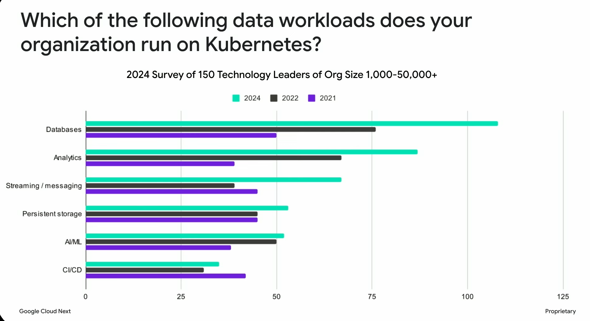

# Why are Enterprises Running Stateful Applications on Kubernetes? 
In today’s rapidly evolving tech landscape, managing stateful applications efficiently is a top priority for enterprises. At AppsCode, we’re passionate about empowering businesses to harness the full potential of Kubernetes for these critical workloads. A recent session at Google Cloud Next 25, titled "Data on Kubernetes: Run stateful apps and AI workloads on GKE", highlighted the growing adoption of Kubernetes for databases, AI, and machine learning (ML) workloads, showcasing its cost-efficiency, scalability, and performance benefits. Drawing from insights shared in that session, this blog explores why Kubernetes—paired with solutions like KubeDB from AppsCode—is the ideal platform for running stateful applications and future-proofing AI workloads.

# The Growing Adoption of Databases on Kubernetes

The Google Cloud Next session kicked off with a compelling `statistic from a survey conducted by the Data on Kubernetes organization`. In a poll of 150 IT leaders of organization size 1000–50,000+, databases emerged as one of the most common workloads running on Kubernetes today.

So, database workloads remain the most prevalent use case for the third consecutive year, with over 100 out of 150 organizations running their databases on Kubernetes in production by 2024.

This trend reflects a significant shift from Kubernetes being primarily used for stateless applications to now confidently handling stateful workloads like databases. Advancements in storage solutions and orchestration capabilities have made it a robust choice for stateful workloads like databases. The adoption of Kubernetes Operators has played a crucial role in this transition by automating tasks such as backups, scaling, and updates, thereby simplifying the management of database instances on Kubernetes.

The session’s audience vibe check further reinforced this trend. When asked how many attendees were running databases on Kubernetes, a notable portion raised their hands. These real-world use cases demonstrate that Kubernetes is no longer just a theoretical fit for stateful apps—it’s a proven solution adopted by organizations worldwide.

At AppsCode, we’ve seen this trend firsthand. Even Google’s customers, who have access to managed database services on Google Cloud, are increasingly turning to Kubernetes to run stateful applications. Why? Kubernetes offers unparalleled flexibility, cost savings, high availability, and scalability. With KubeDB for running production-grade databases on Kubernetes, organizations can simplify database management while leveraging the same orchestration power that makes Kubernetes so effective for stateless workloads.

# Kubernetes: The Key to Cost Savings and Performance

One of the standout themes from the Google Cloud Next session was the emphasis on cost savings and performance optimization for stateful workloads on Google Kubernetes Engine (GKE). Google’s product manager, Brian Kaufman, highlighted several innovative storage solutions that make Kubernetes an attractive choice:

Hyperdisk for Tunable Performance: Unlike traditional persistent disks, Hyperdisk allows users to tune IOPS and throughput independently of capacity. This means you only pay for the performance you need, avoiding overprovisioning and reducing costs. For a PostgreSQL database, for example, Hyperdisk delivers the right balance of performance and affordability.

Storage Pools for Efficiency: By pooling multiple disks (e.g., boot disks and persistent storage), organizations can share capacity and performance across workloads. This approach achieves up to 80% capacity utilization, significantly lowering costs compared to traditional storage provisioning, where unused capacity is common.

GKE Data Cache for Low Latency: For read-heavy workloads like vector databases, GKE’s data cache uses local SSDs to provide sub-millisecond latency at a fraction of the cost of memory ($0.08/GB vs. $3/GB for memory). Tests with PostgreSQL showed an 80% reduction in latency and a 480% increase in transactions per second.

These solutions underscore Kubernetes’ ability to deliver high performance without breaking the bank. With KubeDB, AppsCode takes this a step further by providing a unified platform to manage 20+ databases like PostgreSQL, MySQL, MongoDB, Redis, Elasticsearch on Kubernetes, ensuring seamless integration with these advanced storage options.

# Future-Proofing AI Workloads with Kubernetes

The session also delved into the unique demands of AI and ML workloads, which are increasingly being deployed on Kubernetes. AI workloads are broadly categorized into training and inference, each with distinct requirements:

Training Workloads: These involve large-scale data reads from object storage and frequent checkpointing to ensure fault tolerance. Google’s solutions, like multi-tiered checkpointing and Cloud Storage FUSE with caching, optimize these processes by minimizing disruptions and accelerating data access.

Inference Workloads: Inference requires rapid startup times to handle fluctuating demand. Large models, such as Llama 3.1 (130 GB), can take up to 20 minutes to download from object storage. Google’s container preloading and Hyperdisk ML solutions reduce startup times by up to 29x, enabling real-time scaling for inference-heavy applications.

These advancements make Kubernetes a future-proof platform for AI workloads. As AI models grow in size and complexity, Kubernetes’ ability to scale dynamically, manage diverse storage needs, and integrate with accelerators like GPUs positions it as the go-to solution. KubeDB complements this by simplifying the management of databases that often serve as the backbone for AI data pipelines, ensuring reliability and performance at scale.

## AI-Optimized Data Stores in KubeDB

### SingleStore
SingleStore’s native vector data type and indexed ANN (HNSW, IVF) deliver high-throughput vector search alongside real-time analytics and SQL compatibility.

### Apache Druid
Druid is a real-time OLAP datastore providing sub-second analytical queries and plug-in support for ML-driven dashboards and anomaly detection.

### Milvus
Milvus is an open-source, AI-native vector database designed for high-performance approximate nearest neighbor (ANN) search over massive, high-dimensional embeddings.

### Elasticsearch & OpenSearch
Both Elasticsearch and OpenSearch provide `dense_vector` fields and k-NN search (e.g., HNSW graphs) for fast semantic and hybrid keyword/vector queries.

### Redis (with Redis Vector)
Redis includes a `vector` data type and modules that let you perform in-memory vector similarity searches, making it ideal for feature stores and low-latency inference caches.

### Apache Kafka
While not a database, Kafka is the de facto platform for real-time streaming pipelines in AI/ML workflows—ingesting, buffering, and distributing data and feature updates at scale.

### PostgreSQL + pgvector
The `pgvector` extension adds embedding storage and nearest-neighbor search capabilities to PostgreSQL, combining ACID transactions with vector similarity.

# Real-World Success Stories: Qdrant and Codeway

The session featured two Google customers—Qdrant and Codeway—who showcased how they leverage Kubernetes to power their AI and database workloads:

Qdrant: A vector database company, Qdrant uses GKE to deliver high-speed search and recommendation capabilities for clients like Johnson & Johnson and Disney. By combining GKE’s persistent disks with data caching, Qdrant achieves 10x faster search speeds compared to standard disks, even in worst-case scenarios without RAM caching. This performance is critical for handling billions of vectors at scale.   
Codeway: Codeway’s AI-driven talking head platform, integrated into their language learning app `Learner`, relies on GKE for real-time video generation. Using Gaussian splitting and optimized GPU workloads, Codeway delivers lifelike avatars with synchronized lip movements. Their in-house AI model development hub, built on GKE, abstracts infrastructure complexity, allowing researchers to focus on innovation.

These success stories highlight Kubernetes’ versatility in supporting diverse workloads, from vector databases to real-time AI applications. With KubeDB, AppsCode enables similar outcomes by providing a robust framework for managing stateful workloads, making it easier for organizations to replicate Qdrant and Codeway’s successes.

# Why Adopt Kubernetes with KubeDB?

The data from Google Cloud Next paints a clear picture: Kubernetes is not just viable but thriving as a platform for stateful applications and AI workloads. Here’s why adopting Kubernetes, with KubeDB from AppsCode is a strategic decision:

Proven Adoption: The Data on Kubernetes survey and audience feedback confirm that databases and AI workloads are mainstream on Kubernetes, driven by its flexibility and ecosystem.
Cost Efficiency: Solutions like Hyperdisk, storage pools, and GKE data cache minimize costs while maximizing performance, making Kubernetes a financially savvy choice.
Scalability for AI: Kubernetes’ ability to handle large-scale AI training and inference workloads ensures your infrastructure can grow with your ambitions.
Simplified Management with KubeDB: KubeDB streamlines database operations on Kubernetes, offering features like automated backups, scaling, and upgrades, so you can focus on innovation rather than operations.

As AI and data-driven applications continue to shape the future, Kubernetes offers a scalable, cost-effective, and resilient foundation. AppsCode’s KubeDB enhances this foundation by making database management effortless, empowering organizations to run production-grade databases with confidence.

# Conclusion: Embrace Kubernetes with AppsCode

Kubernetes is a more than appropriate compute fabric to run your stateful applications
`Brian Kaufman`, AI Infrastructure and Data @ Google

The insights from Google Cloud Next underscore a critical truth: Kubernetes is the future for stateful applications and AI workloads. With statistics showing widespread adoption of databases and AI on Kubernetes, now is the time to embrace this powerful platform. If you’re running stateful applications like databases, Kubernetes—paired with KubeDB from AppsCode—offers the tools and flexibility to succeed.

> **“Kubernetes is a more than appropriate compute fabric to run your stateful applications.”**  
> — `Brian Kaufman`, Senior Product Manager, AI Infrastructure and Data @ Google Cloud

Ready to take the next step? Explore KubeDB and see how AppsCode can help you unlock the full potential of Kubernetes for your stateful and AI workloads. Visit AppsCode.com to learn more and start your journey today.

KubeDB is the Kubernetes Native Database Management Solution that simplifies and automates routine database tasks such as Provisioning, Monitoring, Upgrading, Patching, Scaling, Volume Expansion, Backup, Recovery, Failure detection, and Repair for various popular databases on private and public clouds. The databases supported by KubeDB include MongoDB, Elasticsearch, MySQL, MariaDB, Redis, PostgreSQL, Solr, Microsoft SQL Server, Druid, FerretDB, SingleStore, Percona XtraDB, and Memcached. Additionally, KubeDB also supports ProxySQL, PgBouncer, Pgpool, ZooKeeper and the streaming platform Kafka, RabbitMQ. You can find the guides to all the supported databases in [KubeDB](https://kubedb.com/).

## Support

To speak with us, please leave a message on [our website](https://appscode.com/contact/).

To receive product announcements, follow us on [X](https://twitter.com/KubeDB).

To watch tutorials of various Production-Grade Kubernetes Tools, Subscribe to our [YouTube](https://youtube.com/@appscode) channel.