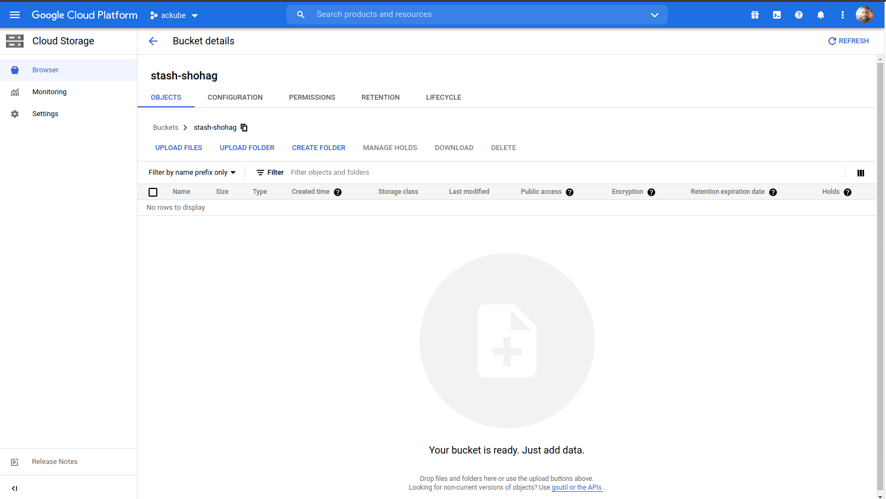
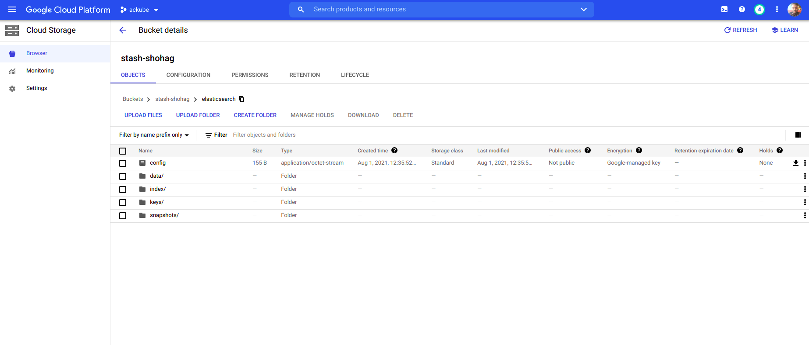

## Overview

The databases that KubeDB support are MongoDB, Elasticsearch, MySQL, MariaDB, PostgreSQL and Redis. You can find the guides to all the supported databases [here](https://kubedb.com/).
In this tutorial we will deploy MongoDB database. We will cover the following steps:

1) Install KubeDB
2) Deploy Standalone Database
3) Install Stash
4) Backup Using Stash
5) Recover Using Stash

## Install KubeDB

We will follow the following steps to install KubeDB.

### Step 1: Get Cluster ID

We need the cluster ID to get the KubeDB License.
To get cluster ID we can run the following command:

```bash
$ kubectl get ns kube-system -o=jsonpath='{.metadata.uid}'
92c71a83-22b3-4476-ba70-eb9fe3b57d53
```

### Step 2: Get License

Go to [Appscode License Server](https://license-issuer.appscode.com/) to get the license.txt file. For this tutorial we will use KubeDB Enterprise Edition.


### Step 3: Install KubeDB

We will use helm to install KubeDB. Please install helm [here](https://helm.sh/docs/intro/install/) if it is not already installed.
Now, let's install `KubeDB`.

```bash
$ helm repo add appscode https://charts.appscode.com/stable/
$ helm repo update

$ helm search repo appscode/kubedb
NAME                        CHART VERSION APP VERSION DESCRIPTION
appscode/kubedb             v2021.06.23   v2021.06.23 KubeDB by AppsCode - Production ready databases...
appscode/kubedb-autoscaler  v0.4.0        v0.4.0      KubeDB Autoscaler by AppsCode - Autoscale KubeD...
appscode/kubedb-catalog     v0.19.0       v0.19.0     KubeDB Catalog by AppsCode - Catalog for databa...
appscode/kubedb-community   v0.19.0       v0.19.0     KubeDB Community by AppsCode - Community featur...
appscode/kubedb-crds        v0.19.0       v0.19.0     KubeDB Custom Resource Definitions
appscode/kubedb-enterprise  v0.6.0        v0.6.0      KubeDB Enterprise by AppsCode - Enterprise feat...

# Install KubeDB Enterprise operator chart
$ helm install kubedb appscode/kubedb \
    --version v2021.06.23 \
    --namespace kube-system \
    --set-file global.license=/path/to/the/license.txt \
    --set kubedb-enterprise.enabled=true \
    --set kubedb-autoscaler.enabled=true
```

Let's verify the installation:

```bash
$ watch kubectl get pods --all-namespaces -l "app.kubernetes.io/instance=kubedb"

NAMESPACE     NAME                                        READY   STATUS    RESTARTS   AGE
kube-system   kubedb-kubedb-autoscaler-5f8c566d5c-lcjdl   1/1     Running   0          2m42s
kube-system   kubedb-kubedb-community-74549c9b9d-9zks9    1/1     Running   0          2m42s
kube-system   kubedb-kubedb-enterprise-6c9dd8958-8tk4b    1/1     Running   0          2m42s
```

We can see the CRD Groups that have been registered by the operator by running the following command:

```bash
$ kubectl get crd -l app.kubernetes.io/name=kubedb
NAME                                              CREATED AT
elasticsearchautoscalers.autoscaling.kubedb.com   2021-08-01T05:18:16Z
elasticsearches.kubedb.com                        2021-08-01T05:18:15Z
elasticsearchopsrequests.ops.kubedb.com           2021-08-01T05:18:15Z
elasticsearchversions.catalog.kubedb.com          2021-08-01T05:16:34Z
etcds.kubedb.com                                  2021-08-01T05:18:25Z
etcdversions.catalog.kubedb.com                   2021-08-01T05:16:34Z
mariadbopsrequests.ops.kubedb.com                 2021-08-01T05:18:40Z
mariadbs.kubedb.com                               2021-08-01T05:18:25Z
mariadbversions.catalog.kubedb.com                2021-08-01T05:16:34Z
memcacheds.kubedb.com                             2021-08-01T05:18:26Z
memcachedversions.catalog.kubedb.com              2021-08-01T05:16:35Z
mongodbautoscalers.autoscaling.kubedb.com         2021-08-01T05:18:13Z
mongodbopsrequests.ops.kubedb.com                 2021-08-01T05:18:19Z
mongodbs.kubedb.com                               2021-08-01T05:18:20Z
mongodbversions.catalog.kubedb.com                2021-08-01T05:16:35Z
mysqlopsrequests.ops.kubedb.com                   2021-08-01T05:18:34Z
mysqls.kubedb.com                                 2021-08-01T05:18:29Z
mysqlversions.catalog.kubedb.com                  2021-08-01T05:16:35Z
perconaxtradbs.kubedb.com                         2021-08-01T05:18:30Z
perconaxtradbversions.catalog.kubedb.com          2021-08-01T05:16:36Z
pgbouncers.kubedb.com                             2021-08-01T05:18:26Z
pgbouncerversions.catalog.kubedb.com              2021-08-01T05:16:36Z
postgreses.kubedb.com                             2021-08-01T05:18:31Z
postgresopsrequests.ops.kubedb.com                2021-08-01T05:18:51Z
postgresversions.catalog.kubedb.com               2021-08-01T05:16:36Z
proxysqls.kubedb.com                              2021-08-01T05:18:32Z
proxysqlversions.catalog.kubedb.com               2021-08-01T05:16:37Z
redises.kubedb.com                                2021-08-01T05:18:33Z
redisopsrequests.ops.kubedb.com                   2021-08-01T05:18:44Z
redisversions.catalog.kubedb.com                  2021-08-01T05:16:37Z
```

## Deploy Standalone Database

Now we are going to Install MongoDB with the help of KubeDB.
At first, let's create a Namespace in which we will deploy the database.

```bash
$ kubectl create ns demo
namespace/demo created
```

Here is the yaml of thfe Elasticsearch CRD we are going to use:

```yaml
apiVersion: kubedb.com/v1alpha2
kind: Elasticsearch
metadata:
  name: elasticsearch
  namespace: demo
spec:
  version: xpack-7.13.2
  storageType: Durable
  replicas: 3
  storage:
    accessModes:
    - ReadWriteOnce
    resources:
      requests:
        storage: 1Gi 
```

Let's save this yaml configuration into elasticsearch.yaml. Then apply using the command
`kubectl apply -f elasticsearch.yaml`

* In this yaml we can see in the `spec.version` field the version of MongoDB. You can change and get updated version by running `kubectl get elasticsearchversions` command.
* Another field to notice is the `spec.storageType` field. This can be `Durable` or `Ephemeral` depending on the requirements of the database to be persistent or not.
* Lastly, the `spec.terminationPolicy` field is *Wipeout* means that the database will be deleted without restrictions. It can also be "Halt", "Delete" and "DoNotTerminate". Learn More about these [HERE](https://kubedb.com/docs/latest/guides/elasticsearch/concepts/elasticsearch/#specterminationpolicy).

Once these are handled correctly and the Elasticsearch object is deployed you will see that the following are created:

```bash
$ kubectl get all -n demo
NAME                  READY   STATUS    RESTARTS   AGE
pod/elasticsearch-0   1/1     Running   0          3m10s
pod/elasticsearch-1   1/1     Running   0          2m25s
pod/elasticsearch-2   1/1     Running   0          103s

NAME                           TYPE        CLUSTER-IP   EXTERNAL-IP   PORT(S)    AGE
service/elasticsearch          ClusterIP   10.8.6.187   <none>        9200/TCP   3m11s
service/elasticsearch-master   ClusterIP   None         <none>        9300/TCP   3m11s
service/elasticsearch-pods     ClusterIP   None         <none>        9200/TCP   3m12s

NAME                             READY   AGE
statefulset.apps/elasticsearch   3/3     3m11s

NAME                                               TYPE                       VERSION   AGE
appbinding.appcatalog.appscode.com/elasticsearch   kubedb.com/elasticsearch   7.13.2    3m13s

NAME                                     VERSION        STATUS   AGE
elasticsearch.kubedb.com/elasticsearch   xpack-7.13.2   Ready    3m16s
```

> We have successfully deployed Elasticsearch in GKE. Now we can exec into the container to use the database.
Please note that KubeDB operator has created a new Secret called `elasticsearch-elastic-cred` for storing the password for `elasticsearch` superuser. This secret contains a `username` key which contains the username for Elasticsearch superuser and a password key which contains the `password` for Elasticsearch superuser.

We can see the username and password:

```bash
$ kubectl  get secrets -n demo elasticsearch-elastic-cred -o jsonpath='{.data.\username}' | base64 -d
elastic
$ kubectl  get secrets -n demo elasticsearch-elastic-cred -o jsonpath='{.data.\password}' | base64 -d
rVS-3l=m.bepuL5D
```

### Accessing Database Through CLI

To access the database through CLI we can either port-forward the service or we can exec into the pod and insert data from there.

 ```bash
$ kubectl port-forward -n demo service/elasticsearch 9200
Forwarding from 127.0.0.1:9200 -> 9200
Forwarding from [::1]:9200 -> 9200
 ```

Then export the username and password:

 ```bash
$ export USER=$(kubectl get secrets -n demo elasticsearch-elastic-cred -o jsonpath='{.data.\username}' | base64 -d)
$ export PASSWORD=$(kubectl get secrets -n demo elasticsearch-elastic-cred -o jsonpath='{.data.\password}' | base64 -d)
 ```

Now, we can insert into the database:

```bash
$ curl -k -XPOST --user $USER:$PASSWORD "http://localhost:9200/products/_doc?pretty" -H 'Content-Type: application/json' -d'{
                                         "name": "Stash",
                                         "vendor": "AppsCode Inc.",
                                         "description": "Backup tool for Kubernetes workloads"
                                     }
                                     '
{
  "_index" : "products",
  "_type" : "_doc",
  "_id" : "4CZLAHsBi6IZRt5DDgpb",
  "_version" : 1,
  "result" : "created",
  "_shards" : {
    "total" : 2,
    "successful" : 1,
    "failed" : 0
  },
  "_seq_no" : 0,
  "_primary_term" : 1
}

# Let's insert another data into the "products" index. 
$ curl -k -XPOST --user $USER:$PASSWORD "http://localhost:9200/products/_doc?pretty" -H 'Content-Type: application/json' -d'
                            {
                                "name": "KubeDB",
                                "vendor": "AppsCode Inc.",
                                "description": "Database Operator for Kubernetes"
                            }
                            '
{
  "_index" : "products",
  "_type" : "_doc",
  "_id" : "4SZVAHsBi6IZRt5Djgqt",
  "_version" : 1,
  "result" : "created",
  "_shards" : {
    "total" : 2,
    "successful" : 2,
    "failed" : 0
  },
  "_seq_no" : 1,
  "_primary_term" : 1
}

```

Now, let’s verify that the indexes have been created successfully.

```bash
$ curl -k -XGET --user $USER:$PASSWORD "http://localhost:9200/_cat/indices?v&s=index&pretty"
health status index    uuid                   pri rep docs.count docs.deleted store.size pri.store.size
green  open   products 1_3wiCS1Qg2GA3KVygx5Tg   1   1          1            0     10.7kb          5.3kb

$ curl -k -XGET --user $USER:$PASSWORD "http://localhost:9200/products/_search?pretty"
{
  "took" : 871,
  "timed_out" : false,
  "_shards" : {
    "total" : 1,
    "successful" : 1,
    "skipped" : 0,
    "failed" : 0
  },
  "hits" : {
    "total" : {
      "value" : 2,
      "relation" : "eq"
    },
    "max_score" : 1.0,
    "hits" : [
      {
        "_index" : "products",
        "_type" : "_doc",
        "_id" : "4CZLAHsBi6IZRt5DDgpb",
        "_score" : 1.0,
        "_source" : {
          "name" : "Stash",
          "vendor" : "AppsCode Inc.",
          "description" : "Backup tool for Kubernetes workloads"
        }
      },
      {
        "_index" : "products",
        "_type" : "_doc",
        "_id" : "4SZVAHsBi6IZRt5Djgqt",
        "_score" : 1.0,
        "_source" : {
          "name" : "KubeDB",
          "vendor" : "AppsCode Inc.",
          "description" : "Database Operator for Kubernetes"
        }
      }
    ]
  }
}
```

> This was just one example of database deployment. The other databases that KubeDB support are MySQL, Postgres, Elasticsearch, MariaDB and Redis. The tutorials on how to deploy these into the cluster can be found [HERE](https://kubedb.com/)

## Backup Elasticsearch Database Using Stash

Here we are going to backup the database we deployed before using Stash.

### Step 1: Install Stash

Here we will use the KubeDB license we obtained earlier.

```bash
$ helm install stash appscode/stash             \
  --version v2021.06.23                  \
  --namespace kube-system                       \
  --set features.enterprise=true                \
  --set-file global.license=/path/to/the/license.txt
```

Let's verify the installation:

```bash
~ $ kubectl get pods --all-namespaces -l app.kubernetes.io/name=stash-enterprise --watch
NAMESPACE     NAME                                      READY   STATUS    RESTARTS   AGE
kube-system   stash-stash-enterprise-6979884d85-7hdfm   0/2     Pending   0          0s
kube-system   stash-stash-enterprise-6979884d85-7hdfm   0/2     Pending   0          0s
kube-system   stash-stash-enterprise-6979884d85-7hdfm   0/2     ContainerCreating   0          0s
kube-system   stash-stash-enterprise-6979884d85-7hdfm   2/2     Running             0          11s
```

### Step 2: Prepare Backend

Stash supports various backends for storing data snapshots. It can be a cloud storage like GCS bucket, AWS S3, Azure Blob Storage etc. or a Kubernetes persistent volume like HostPath, PersistentVolumeClaim, NFS etc.

For this tutorial we are going to use gcs-bucket. You can find other setups [here](https://stash.run/docs/v2021.04.12/guides/latest/backends/overview/).

 

At first we need to create a secret so that we can access the gcs bucket. We can do that by the following code:

```bash
$ echo -n 'YOURPASSWORD' > RESTIC_PASSWORD
$ echo -n 'YOURPROJECTNAME' > GOOGLE_PROJECT_ID
$ cat /PATH/TO/JSONKEY.json > GOOGLE_SERVICE_ACCOUNT_JSON_KEY
$ kubectl create secret generic -n demo gcs-secret \
        --from-file=./RESTIC_PASSWORD \
        --from-file=./GOOGLE_PROJECT_ID \
        --from-file=./GOOGLE_SERVICE_ACCOUNT_JSON_KEY
 ```

### Step 3: Create Repository

```yaml
apiVersion: stash.appscode.com/v1alpha1
kind: Repository
metadata:
  name: elasticsearch-repo
  namespace: demo
spec:
  backend:
    gcs:
      bucket: stash-shohag
      prefix: /elasticsearch
    storageSecretName: gcs-secret 
```

This repository CRD specifies the gcs-secret we created before and stores the name and path to the gcs-bucket. It also specifies the location in the bucket where we want to backup our database.
> My bucket name is stash-shohag. Don't forget to change `spec.backend.gcs.bucket` to your bucket name.

### Step 4: Create BackupConfiguration

Now we need to create a BackupConfiguration file that specifies what to backup, where to backup and when to backup.

```yaml
apiVersion: stash.appscode.com/v1beta1
kind: BackupConfiguration
metadata:
  name: elasticsearch
  namespace: demo
spec:
  schedule: "*/5 * * * *"
  task:
    name: elasticsearch-backup-7.3.2
  repository:
    name: elasticsearch-repo
  target:
    ref:
      apiVersion: appcatalog.appscode.com/v1alpha1
      kind: AppBinding
      name: elasticsearch
  interimVolumeTemplate:
    metadata:
      name: elasticsearch-backup-tmp-storage
    spec:
      accessModes: [ "ReadWriteOnce" ]
      resources:
        requests:
          storage: 1Gi
  retentionPolicy:
    name: keep-last-5
    keepLast: 5
    prune: true
  runtimeSettings:
    container:
      securityContext:
        runAsUser: 0
        runAsGroup: 0 
```

* BackupConfiguration creates a cronjob that backs up the specified database (`spec.target`) every 5 minutes.
* `spec.repository` contaiins the secret we created before called `gcs-secret`.
* `spec.target.ref` contains the reference to the appbinding that we want to backup.
So, after 5 minutes we can see the following status:

```bash
$ kubectl get backupsession -n demo
NAME                       INVOKER-TYPE          INVOKER-NAME    PHASE       AGE
elasticsearch-1627799712   BackupConfiguration   elasticsearch   Succeeded   76s
$ kubectl get repository -n demo
NAME                 INTEGRITY   SIZE    SNAPSHOT-COUNT   LAST-SUCCESSFUL-BACKUP   AGE
elasticsearch-repo   true        849 B   1                110s                     14m
```

Now if we check our GCS bucket we can see that the backup has been successful.



> **If you have reached here, CONGRATULATIONS!! :confetti_ball:  :partying_face: :confetti_ball: You have successfully backed up Elasticsearch using Stash.** If you had any problem during the backup process, you can reach out to us via [EMAIL](mailto:support@appscode.com?subject=Stash%20Backup%20Failed%20in%20GKE).

## Recover Elasticsearch Database Using Stash

Let's think of a scenario in which the database has been accidentally deleted or there was an error in the database causing it to crash.
In such a case, we have to pause the BackupConfiguration so that the failed/damaged database does not get backed up into the cloud:

```bash
kubectl patch backupconfiguration -n demo elasticsearch --type="merge" --patch='{"spec": {"paused": true}}'
```

At first let's simulate accidental database deletion.

```bash
$ curl -k -XDELETE --user $USER:$PASSWORD "http://localhost:9200/products?pretty"
{
  "acknowledged" : true
}

$ curl -k -XGET --user $USER:$PASSWORD "http://localhost:9200/_cat/indices?v&s=index&pretty"
health status index uuid pri rep docs.count docs.deleted store.size pri.store.size

```

### Step 1: Create a RestoreSession

Now, let's create a RestoreSession that will initiate restoring from the cloud.

```yaml
apiVersion: stash.appscode.com/v1beta1
kind: RestoreSession
metadata:
  name: elasticsearch-init
  namespace: demo
  labels:
    app.kubernetes.io/name: elasticsearches.kubedb.com
spec:
  repository:
    name: elasticsearch-repo
  target:
    ref:
      apiVersion: appcatalog.appscode.com/v1alpha1
      kind: AppBinding
      name: elasticsearch
  interimVolumeTemplate:
    metadata:
      name: elasticsearch-init-tmp-storage
    spec:
      accessModes: [ "ReadWriteOnce" ]
      resources:
        requests:
          storage: 1Gi
  rules:
  - snapshots: [latest]
  runtimeSettings:
    container:
      securityContext:
        runAsUser: 0
        runAsGroup: 0 
```

This RestoreSession specifies where the data will be restored.
Once this is applied, a RestoreSession will be created. Once it has succeeded, the database has been successfully recovered as you can see below:

```bash
$ kubectl get restoresession -n demo
NAME                 REPOSITORY           PHASE       AGE
elasticsearch-init   elasticsearch-repo   Succeeded   51s
```

Now let's check whether the database has been correctly restored:

```bash
$ curl -k -XGET --user $USER:$PASSWORD "http://localhost:9200/_cat/indices?v&s=index&pretty"
health status index    uuid                   pri rep docs.count docs.deleted store.size pri.store.size
green  open   products 2rhoCKKwTa-8ngEtktxKKA   1   1          2            0     10.9kb          5.4kb
$ curl -k -XGET --user $USER:$PASSWORD "http://localhost:9200/products/_search?pretty"
{
  "took" : 7,
  "timed_out" : false,
  "_shards" : {
    "total" : 1,
    "successful" : 1,
    "skipped" : 0,
    "failed" : 0
  },
  "hits" : {
    "total" : {
      "value" : 2,
      "relation" : "eq"
    },
    "max_score" : 1.0,
    "hits" : [
      {
        "_index" : "products",
        "_type" : "_doc",
        "_id" : "4SZVAHsBi6IZRt5Djgqt",
        "_score" : 1.0,
        "_source" : {
          "name" : "KubeDB",
          "vendor" : "AppsCode Inc.",
          "description" : "Database Operator for Kubernetes"
        }
      },
      {
        "_index" : "products",
        "_type" : "_doc",
        "_id" : "4CZLAHsBi6IZRt5DDgpb",
        "_score" : 1.0,
        "_source" : {
          "name" : "Stash",
          "vendor" : "AppsCode Inc.",
          "description" : "Backup tool for Kubernetes workloads"
        }
      }
    ]
  }
}
```

> The recovery has been successful. If you faced any difficulties in the recovery process, you can reach out to us through [EMAIL](mailto:support@appscode.com?subject=Stash%20Recovery%20Failed%20in%20GKE).

## Support

To speak with us, please leave a message on [our website](https://appscode.com/contact/).

To join public discussions with the KubeDB community, join us in the [Kubernetes Slack team](https://kubernetes.slack.com/messages/C8149MREV/) channel `#kubedb`. To sign up, use our [Slack inviter](http://slack.kubernetes.io/).

To receive product announcements, follow us on [Twitter](https://twitter.com/KubeDB).

If you have found a bug with KubeDB or want to request for new features, please [file an issue](https://github.com/kubedb/project/issues/new).