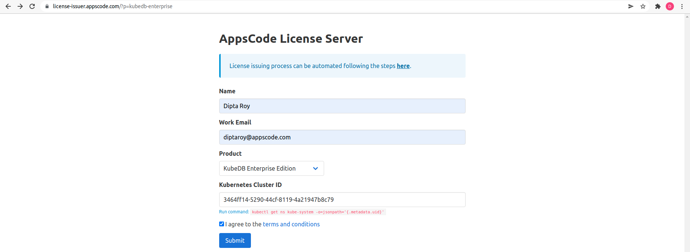
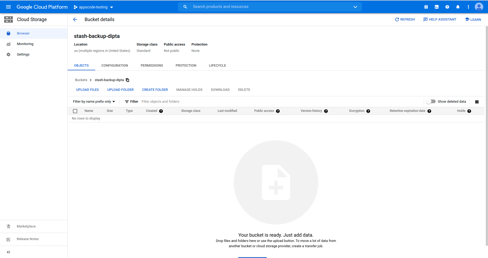
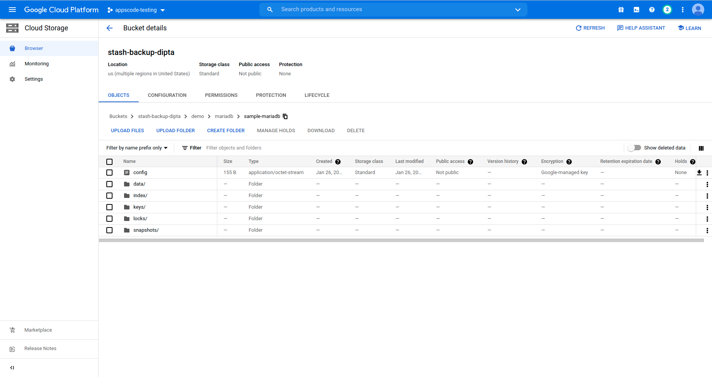

## Overview

The databases that KubeDB supports are MariaDB, MySQL, Elasticsearch, MongoDB, PostgreSQL, Redis, Percona XtraDB, ProxySQL, Memcached and PgBouncer. You can find the guides to all the supported databases [here](https://kubedb.com/).
In this tutorial we will deploy MariaDB database. We will cover the following steps:

1) Install KubeDB
2) Deploy Standalone MariaDB Database
3) Install Stash
4) Backup MariaDB Database Using Stash
5) Recover MariaDB Database Using Stash

## Install KubeDB

We will follow the steps to install KubeDB.

### Step 1: Get Cluster ID

We need the cluster ID to get the KubeDB License.
To get cluster ID we can run the following command:

```bash
$ kubectl get ns kube-system -o jsonpath='{.metadata.uid}'
3464ff14-5290-44cf-8119-4a21947b8c79 
```

### Step 2: Get License

Go to [Appscode License Server](https://license-issuer.appscode.com/) to get the license.txt file. For this tutorial we will use KubeDB Enterprise Edition.



### Step 3: Install KubeDB

We will use helm to install KubeDB. Please install helm [here](https://helm.sh/docs/intro/install/) if it is not already installed.
Now, let's install `KubeDB`.

```bash
$ helm repo add appscode https://charts.appscode.com/stable/
$ helm repo update

$ helm search repo appscode/kubedb
NAME                      	CHART VERSION	APP VERSION	DESCRIPTION                                       
appscode/kubedb           	v2021.12.21  	v2021.12.21	KubeDB by AppsCode - Production ready databases...
appscode/kubedb-autoscaler	v0.9.2       	v0.9.2     	KubeDB Autoscaler by AppsCode - Autoscale KubeD...
appscode/kubedb-catalog   	v2021.12.21  	v2021.12.21	KubeDB Catalog by AppsCode - Catalog for databa...
appscode/kubedb-community 	v0.24.2      	v0.24.2    	KubeDB Community by AppsCode - Community featur...
appscode/kubedb-crds      	v2021.12.21  	v2021.12.21	KubeDB Custom Resource Definitions                
appscode/kubedb-enterprise	v0.11.2      	v0.11.2    	KubeDB Enterprise by AppsCode - Enterprise feat...
appscode/kubedb-metrics   	v2021.12.21  	v2021.12.21	KubeDB State Metrics                              
appscode/kubedb-opscenter 	v2021.12.21  	v2021.12.21	KubeDB Opscenter by AppsCode                      
appscode/kubedb-ui-server 	v2021.12.21  	v2021.12.21	A Helm chart for kubedb-ui-server by AppsCode

# Install KubeDB Enterprise operator chart
$ helm install kubedb appscode/kubedb                    \
    --version v2021.12.21                                \
    --namespace kubedb --create-namespace                \
    --set kubedb-enterprise.enabled=true                 \
    --set kubedb-autoscaler.enabled=true                 \
    --set-file global.license=/path/to/the/license.txt

```

Let's verify the installation:

```bash
$ watch kubectl get pods --all-namespaces -l "app.kubernetes.io/instance=kubedb"

NAMESPACE   NAME                                        READY   STATUS    RESTARTS   AGE
kubedb      kubedb-kubedb-autoscaler-54865c6b65-x97qd   1/1     Running   0          2m20s
kubedb      kubedb-kubedb-community-5479b744c8-w2bnn    1/1     Running   0          2m20s
kubedb      kubedb-kubedb-enterprise-7696495d8c-47w9q   1/1     Running   0          2m20s
```

We can list the CRD Groups that have been registered by the operator by running the following command:

```bash
$ kubectl get crd -l app.kubernetes.io/name=kubedb
NAME                                              CREATED AT
elasticsearchautoscalers.autoscaling.kubedb.com   2022-01-26T08:35:13Z
elasticsearches.kubedb.com                        2022-01-26T08:35:39Z
elasticsearchopsrequests.ops.kubedb.com           2022-01-26T08:35:39Z
elasticsearchversions.catalog.kubedb.com          2022-01-26T08:34:30Z
etcds.kubedb.com                                  2022-01-26T08:36:07Z
etcdversions.catalog.kubedb.com                   2022-01-26T08:34:30Z
mariadbopsrequests.ops.kubedb.com                 2022-01-26T08:35:53Z
mariadbs.kubedb.com                               2022-01-26T08:35:52Z
mariadbversions.catalog.kubedb.com                2022-01-26T08:34:30Z
memcacheds.kubedb.com                             2022-01-26T08:36:07Z
memcachedversions.catalog.kubedb.com              2022-01-26T08:34:30Z
mongodbautoscalers.autoscaling.kubedb.com         2022-01-26T08:35:10Z
mongodbopsrequests.ops.kubedb.com                 2022-01-26T08:35:42Z
mongodbs.kubedb.com                               2022-01-26T08:35:42Z
mongodbversions.catalog.kubedb.com                2022-01-26T08:34:30Z
mysqlopsrequests.ops.kubedb.com                   2022-01-26T08:35:49Z
mysqls.kubedb.com                                 2022-01-26T08:35:49Z
mysqlversions.catalog.kubedb.com                  2022-01-26T08:34:30Z
perconaxtradbs.kubedb.com                         2022-01-26T08:36:09Z
perconaxtradbversions.catalog.kubedb.com          2022-01-26T08:34:30Z
pgbouncers.kubedb.com                             2022-01-26T08:35:46Z
pgbouncerversions.catalog.kubedb.com              2022-01-26T08:34:30Z
postgreses.kubedb.com                             2022-01-26T08:36:00Z
postgresopsrequests.ops.kubedb.com                2022-01-26T08:36:00Z
postgresversions.catalog.kubedb.com               2022-01-26T08:34:30Z
proxysqls.kubedb.com                              2022-01-26T08:36:09Z
proxysqlversions.catalog.kubedb.com               2022-01-26T08:34:30Z
redises.kubedb.com                                2022-01-26T08:35:56Z
redisopsrequests.ops.kubedb.com                   2022-01-26T08:35:56Z
redissentinels.kubedb.com                         2022-01-26T08:35:56Z
redisversions.catalog.kubedb.com                  2022-01-26T08:34:30Z
```

## Deploy Standalone MariaDB Database

Now we are going to Install MariaDB with the help of KubeDB.
At first, let's create a Namespace in which we will deploy the database.

```bash
$ kubectl create ns demo
namespace/demo created
```

Here is the yaml of the MariaDB CRO we are going to use:

```yaml
apiVersion: kubedb.com/v1alpha2
kind: MariaDB
metadata:
  name: sample-mariadb
  namespace: demo
spec:
  version: "10.6.4"
  storageType: Durable
  storage:
    storageClassName: "standard"
    accessModes:
    - ReadWriteOnce
    resources:
      requests:
        storage: 1Gi
  terminationPolicy: WipeOut
```

Let's save this yaml configuration into `mariadb.yaml` 
Then create the above MariaDB CRO

```bash
$ kubectl create -f mariadb.yaml
mariadb.kubedb.com/sample-mariadb created
```

* In this yaml we can see in the `spec.version` field specifies the version of MariaDB. You can list the KubeDB supported versions of MariaDB by running `kubectl get mariadbversion` command.
* Another field to notice is the `spec.storageType` field. This can be `Durable` or `Ephemeral` depending on the requirements of the database to be persistent or not.
* Lastly, the `spec.terminationPolicy` field is *Wipeout* means that the database will be deleted without restrictions. It can also be "Halt", "Delete" and "DoNotTerminate". Learn More about these [HERE](https://kubedb.com/docs/v2021.12.21/guides/mariadb/concepts/mariadb/#specterminationpolicy).

Once these are handled correctly and the MariaDB object is deployed, you will see that the following are created:

```bash
$ kubectl get all -n demo
NAME                   READY   STATUS    RESTARTS   AGE
pod/sample-mariadb-0   1/1     Running   0          7m21s

NAME                          TYPE        CLUSTER-IP      EXTERNAL-IP   PORT(S)    AGE
service/sample-mariadb        ClusterIP   10.96.219.206   <none>        3306/TCP   7m21s
service/sample-mariadb-pods   ClusterIP   None            <none>        3306/TCP   7m21s

NAME                              READY   AGE
statefulset.apps/sample-mariadb   1/1     7m21s

NAME                                                TYPE                 VERSION   AGE
appbinding.appcatalog.appscode.com/sample-mariadb   kubedb.com/mariadb   10.6.4    7m20s

NAME                                VERSION   STATUS   AGE
mariadb.kubedb.com/sample-mariadb   10.6.4    Ready    7m21s
```

> We have successfully deployed MariaDB Standalone in GKE. Now we can exec into the container to use the database.

### Accessing Database Through CLI

To access the database through CLI we have to exec into the container:

```bash
$ kubectl get secrets -n demo sample-mariadb-auth -o jsonpath='{.data.username}' | base64 -d
root
$ kubectl get secrets -n demo sample-mariadb-auth -o jsonpath='{.data.password}' | base64 -d
P~C9(DozpBJCGj&t
$ kubectl exec -it sample-mariadb-0 -n demo -c mariadb -- bash 
```

Then login into MariaDB:

```bash
root@sample-mariadb-0:/# mariadb --user=root --password='P~C9(DozpBJCGj&t'
Welcome to the MariaDB monitor.  Commands end with ; or \g.
Your MariaDB connection id is 76
Server version: 10.6.4-MariaDB-1:10.6.4+maria~focal mariadb.org binary distribution

Copyright (c) 2000, 2018, Oracle, MariaDB Corporation Ab and others.

Type 'help;' or '\h' for help. Type '\c' to clear the current input statement.
```

Now we have entered into the MariaDB CLI and we can create and delete as we want.
Let's create a database called `Music` and create a table called `Bands` in that database:

```bash
MariaDB [(none)]> CREATE DATABASE Music;
Query OK, 1 row affected (0.000 sec)

MariaDB [(none)]> SHOW DATABASES;
+--------------------+
| Database           |
+--------------------+
| Music              |
| information_schema |
| mysql              |
| performance_schema |
| sys                |
+--------------------+
5 rows in set (0.001 sec)

MariaDB [(none)]> CREATE TABLE Music.Bands ( id INT NOT NULL AUTO_INCREMENT, Name VARCHAR(50), Album VARCHAR(25), PRIMARY KEY(id));
Query OK, 0 rows affected (0.007 sec)

MariaDB [(none)]> SHOW TABLES IN Music;
+-----------------+
| Tables_in_Music |
+-----------------+
| Bands           |
+-----------------+
1 row in set (0.001 sec)

MariaDB [(none)]> INSERT INTO Music.Bands (Name, Album) VALUES ("The Beatles", "Abbey Road");
Query OK, 1 row affected (0.002 sec)

MariaDB [(none)]> SELECT * FROM Music.Bands;
+----+-------------+------------+
| id | Name        | Album      |
+----+-------------+------------+
|  1 | The Beatles | Abbey Road |
+----+-------------+------------+
1 row in set (0.000 sec)

MariaDB [(none)]> exit
Bye
```

> This was just one example of database deployment. The other databases that KubeDB supports are Elasticsearch, MongoDB, MySQL, PostgreSQL, Redis, Percona XtraDB, ProxySQL, Memcached and PgBouncer. The tutorials on how to deploy these into the cluster can be found [HERE](https://kubedb.com/)

## Backup MariaDB Database Using Stash

Here, we are going to use Stash to backup the database we deployed before.

### Step 1: Install Stash

Go to [Appscode License Server](https://license-issuer.appscode.com/) again to get the Stash Enterprise license.
Here, we will use the Stash Enterprise license that we obtained.

```bash
$ helm install stash appscode/stash              \
   --version v2021.11.24                         \
   --namespace kube-system                       \
   --set features.enterprise=true                \
   --set-file global.license=/path/to/the/license.txt
```

Let's verify the installation:

```bash
$ kubectl get pods --all-namespaces -l app.kubernetes.io/name=stash-enterprise --watch
NAMESPACE     NAME                                      READY   STATUS    RESTARTS   AGE
kube-system   stash-stash-enterprise-5fb899bf4f-5rmbx   2/2     Running   0          2m55s
```

Now, to confirm CRD groups have been registered by the operator, run the following command:

```bash
kubectl get crd -l app.kubernetes.io/name=stash
NAME                                      CREATED AT
backupbatches.stash.appscode.com          2022-01-26T09:27:23Z
backupblueprints.stash.appscode.com       2022-01-26T09:27:23Z
backupconfigurations.stash.appscode.com   2022-01-26T09:27:23Z
backupsessions.stash.appscode.com         2022-01-26T09:27:23Z
functions.stash.appscode.com              2022-01-26T09:26:48Z
recoveries.stash.appscode.com             2022-01-26T09:27:23Z
repositories.stash.appscode.com           2022-01-26T09:27:23Z
restics.stash.appscode.com                2022-01-26T09:27:22Z
restorebatches.stash.appscode.com         2022-01-26T09:27:23Z
restoresessions.stash.appscode.com        2022-01-26T09:27:23Z
tasks.stash.appscode.com                  2022-01-26T09:26:48Z
```


### Step 2: Prepare Backend

Stash supports various backends for storing data snapshots. It can be a cloud storage like GCS bucket, AWS S3, Azure Blob Storage etc. or a Kubernetes persistent volume like HostPath, PersistentVolumeClaim, NFS etc.

For this tutorial we are going to use gcs-bucket. You can find other setups [here](https://stash.run/docs/v2021.11.24/guides/latest/backends/overview/).

 

At first we need to create a secret so that we can access the gcs bucket. We can do that by the following code:

```bash
$ echo -n 'YOURPASSWORD' > RESTIC_PASSWORD
$ echo -n 'YOURPROJECTNAME' > GOOGLE_PROJECT_ID
$ cat /PATH/TO/JSONKEY.json > GOOGLE_SERVICE_ACCOUNT_JSON_KEY
$ kubectl create secret generic -n demo gcs-secret \
        --from-file=./RESTIC_PASSWORD              \
        --from-file=./GOOGLE_PROJECT_ID            \
        --from-file=./GOOGLE_SERVICE_ACCOUNT_JSON_KEY
 ```

### Step 3: Create Repository

```yaml
apiVersion: stash.appscode.com/v1alpha1
kind: Repository
metadata:
  name: gcs-repo
  namespace: demo
spec:
  backend:
    gcs:
      bucket: stash-backup-dipta
      prefix: /demo/mariadb/sample-mariadb
    storageSecretName: gcs-secret
```

This repository CRO specifies the gcs-secret we created before and stores the name and path to the gcs-bucket. It also specifies the location in the bucket where we want to backup our database.
> Here, My bucket name is stash-backup-dipta. Don't forget to change `spec.backend.gcs.bucket` to your bucket name.

### Step 4: Create BackupConfiguration

Now we need to create a BackupConfiguration file that specifies what to backup, where to backup and when to backup.

```yaml
apiVersion: stash.appscode.com/v1beta1
kind: BackupConfiguration
metadata:
  name: sample-mariadb-backup
  namespace: demo
spec:
  schedule: "*/5 * * * *"
  repository:
    name: gcs-repo
  target:
    ref:
      apiVersion: appcatalog.appscode.com/v1alpha1
      kind: AppBinding
      name: sample-mariadb
  retentionPolicy:
    name: keep-last-5
    keepLast: 5
    prune: true
```

* BackupConfiguration creates a cronjob that backs up the specified database (`spec.target`) every 5 minutes.
* `spec.repository` contains the secret we created before called `gcs-secret`.
* `spec.target.ref` contains the reference to the appbinding that we want to backup. 
* To learn more about `AppBinding`, click here [AppBinding](https://kubedb.com/docs/v2021.12.21/guides/mariadb/concepts/appbinding/). 
So, after 5 minutes we can see the following status:

```bash
$ kubectl get backupsession -n demo
NAME                               INVOKER-TYPE          INVOKER-NAME            PHASE       DURATION   AGE
sample-mariadb-backup-1643190603   BackupConfiguration   sample-mariadb-backup   Succeeded   1m39s      3m46s

$ kubectl get repository -n demo
NAME       INTEGRITY   SIZE        SNAPSHOT-COUNT   LAST-SUCCESSFUL-BACKUP   AGE
gcs-repo   true        4.545 MiB   1                3m44s                    8m5s
```

Now if we check our GCS bucket we can see that the backup has been successful.



> **If you have reached here, CONGRATULATIONS!! :confetti_ball:  :partying_face: :confetti_ball: You have successfully backed up MariaDB Database using Stash.** If you had any problem during the backup process, you can reach out to us via [EMAIL](mailto:support@appscode.com?subject=Stash%20Backup%20Failed%20in%20GKE).

## Recover MariaDB Database Using Stash

Let's think of a scenario in which the database has been accidentally deleted or there was an error in the database causing it to crash.
In such a case, we have to pause the BackupConfiguration so that the failed/damaged database does not get backed up into the cloud:

```bash
$ kubectl patch backupconfiguration -n demo sample-mariadb-backup --type="merge" --patch='{"spec": {"paused": true}}'
```

At first let's simulate accidental database deletion.

```bash
$ kubectl exec -it sample-mariadb-0 -n demo -- bash
Defaulted container "mariadb" out of: mariadb, mariadb-init (init)
root@sample-mariadb-0:/# mariadb --user=root --password='P~C9(DozpBJCGj&t'
Welcome to the MariaDB monitor.  Commands end with ; or \g.
Your MariaDB connection id is 349
Server version: 10.6.4-MariaDB-1:10.6.4+maria~focal mariadb.org binary distribution

Copyright (c) 2000, 2018, Oracle, MariaDB Corporation Ab and others.

Type 'help;' or '\h' for help. Type '\c' to clear the current input statement.

MariaDB [(none)]> SHOW DATABASES;
+--------------------+
| Database           |
+--------------------+
| Music              |
| information_schema |
| mysql              |
| performance_schema |
| sys                |
+--------------------+
5 rows in set (0.001 sec)

MariaDB [(none)]> DROP DATABASE Music;
Query OK, 1 row affected (0.007 sec)

MariaDB [(none)]> SHOW DATABASES;
+--------------------+
| Database           |
+--------------------+
| information_schema |
| mysql              |
| performance_schema |
| sys                |
+--------------------+
4 rows in set (0.001 sec)

MariaDB [(none)]> exit
Bye
```

### Step 1: Create a RestoreSession

Below, is the contents of YAML file of the RestoreSession object that we are going to create.

```yaml
apiVersion: stash.appscode.com/v1beta1
kind: RestoreSession
metadata:
  name: sample-mariadb-restore
  namespace: demo
spec:
  repository:
    name: gcs-repo
  target:
    ref:
      apiVersion: appcatalog.appscode.com/v1alpha1
      kind: AppBinding
      name: sample-mariadb
  rules:
    - snapshots: [latest]
```

Now, let's create RestoreSession that will initiate restoring from the cloud.

```bash
$ kubectl create -f sample-mariadb-restore.yaml
restoresession.stash.appscode.com/sample-mariadb-restore created
```

This RestoreSession specifies where the data will be restored.
Once this is applied, a RestoreSession will be created. Once it has succeeded, the database has been successfully recovered as you can see below:

```bash
$ kubectl get restoresession -n demo
NAME                     REPOSITORY   PHASE       DURATION   AGE
sample-mariadb-restore   gcs-repo     Succeeded   16s        54s
```

Now let's check whether the database has been correctly restored:

```bash
$ kubectl exec -it sample-mariadb-0 -n demo -- bash
Defaulted container "mariadb" out of: mariadb, mariadb-init (init)
root@sample-mariadb-0:/# mariadb -user=root -password='P~C9(DozpBJCGj&t'
Welcome to the MariaDB monitor.  Commands end with ; or \g.
Your MariaDB connection id is 486
Server version: 10.6.4-MariaDB-1:10.6.4+maria~focal mariadb.org binary distribution

Copyright (c) 2000, 2018, Oracle, MariaDB Corporation Ab and others.

Type 'help;' or '\h' for help. Type '\c' to clear the current input statement.

MariaDB [(none)]> SHOW DATABASES;
+--------------------+
| Database           |
+--------------------+
| Music              |
| information_schema |
| mysql              |
| performance_schema |
| sys                |
+--------------------+
5 rows in set (0.001 sec)
```

> You can see the Database `Music` has been restored. The recovery of MariaDB Database has been successful. If you faced any difficulties in the recovery process, you can reach out to us through [EMAIL](mailto:support@appscode.com?subject=Stash%20Recovery%20Failed%20in%20GKE).

We have made an in depth video on how to Run & Manage production-grade MariaDB Database in Kubernetes cluster using KubeDB. You can have a look into the video below:

<iframe width="560" height="315" src="https://www.youtube.com/embed/J6s0JTat4Bo" title="YouTube video player" frameborder="0" allow="accelerometer; autoplay; clipboard-write; encrypted-media; gyroscope; picture-in-picture" allowfullscreen></iframe>

## Support

To speak with us, please leave a message on [our website](https://appscode.com/contact/).

To join public discussions with the KubeDB community, join us in the [Kubernetes Slack team](https://kubernetes.slack.com/messages/C8149MREV/) channel `#kubedb`. To sign up, use our [Slack inviter](http://slack.kubernetes.io/).

To receive product announcements, follow us on [Twitter](https://twitter.com/KubeDB).

If you have found a bug with KubeDB or want to request for new features, please [file an issue](https://github.com/kubedb/project/issues/new).
