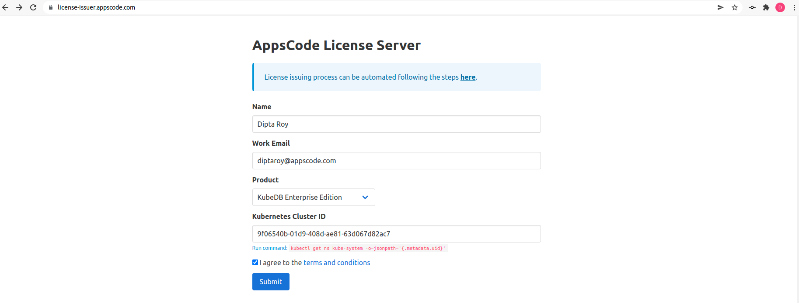
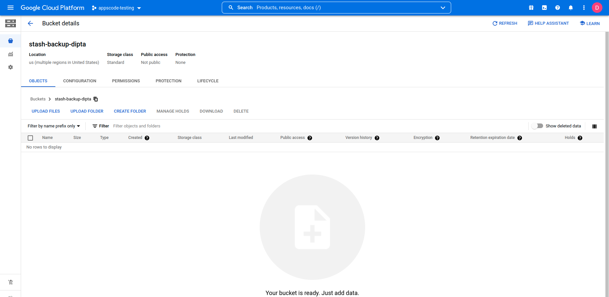
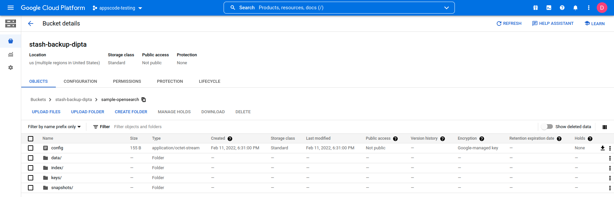

## Overview

The databases that KubeDB supports are Elasticsearch, MySQL, MariaDB, MongoDB, PostgreSQL, Redis, Percona XtraDB, ProxySQL, Memcached and PgBouncer. You can find the guides to all the supported databases [here](https://kubedb.com/). Elasticsearch has many distributions like `ElasticStack`, `OpenSearch`, `SearchGuard`, `OpenDistro` etc. **KubeDB provides all of the distribution's support under the Elasticsearch CR of KubeDB**. In this tutorial we will deploy OpenSearch cluster. We will cover the following steps:

1) Install KubeDB
2) Deploy OpenSearch Cluster
3) Install Stash
4) Backup OpenSearch Using Stash
5) Recover OpenSearch Using Stash

## Install KubeDB

We will follow the steps to install KubeDB.

### Step 1: Get Cluster ID

We need the cluster ID to get the KubeDB License.
To get cluster ID we can run the following command:

```bash
$ kubectl get ns kube-system -o jsonpath='{.metadata.uid}'
9f06540b-01d9-408d-ae81-63d067d82ac7 
```

### Step 2: Get License

Go to [Appscode License Server](https://license-issuer.appscode.com/) to get the license.txt file. For this tutorial we will use KubeDB Enterprise Edition.



### Step 3: Install KubeDB

We will use helm to install KubeDB. Please install helm [here](https://helm.sh/docs/intro/install/) if it is not already installed.
Now, let's install `KubeDB`.

```bash
$ helm repo add appscode https://charts.appscode.com/stable/
$ helm repo update

$ helm search repo appscode/kubedb
NAME                      	CHART VERSION	APP VERSION	DESCRIPTION                                       
appscode/kubedb           	v2021.12.21  	v2021.12.21	KubeDB by AppsCode - Production ready databases...
appscode/kubedb-autoscaler	v0.9.2       	v0.9.2     	KubeDB Autoscaler by AppsCode - Autoscale KubeD...
appscode/kubedb-catalog   	v2021.12.21  	v2021.12.21	KubeDB Catalog by AppsCode - Catalog for databa...
appscode/kubedb-community 	v0.24.2      	v0.24.2    	KubeDB Community by AppsCode - Community featur...
appscode/kubedb-crds      	v2021.12.21  	v2021.12.21	KubeDB Custom Resource Definitions                
appscode/kubedb-enterprise	v0.11.2      	v0.11.2    	KubeDB Enterprise by AppsCode - Enterprise feat...
appscode/kubedb-metrics   	v2021.12.21  	v2021.12.21	KubeDB State Metrics                              
appscode/kubedb-opscenter 	v2021.12.21  	v2021.12.21	KubeDB Opscenter by AppsCode                      
appscode/kubedb-ui-server 	v2021.12.21  	v2021.12.21	A Helm chart for kubedb-ui-server by AppsCode

# Install KubeDB Enterprise operator chart
$ helm install kubedb appscode/kubedb                    \
    --version v2021.12.21                                \
    --namespace kubedb --create-namespace                \
    --set kubedb-enterprise.enabled=true                 \
    --set kubedb-autoscaler.enabled=true                 \
    --set-file global.license=/path/to/the/license.txt

```

Let's verify the installation:

```bash
$ watch kubectl get pods --all-namespaces -l "app.kubernetes.io/instance=kubedb"
NAMESPACE   NAME                                        READY   STATUS    RESTARTS   AGE
kubedb      kubedb-kubedb-autoscaler-7b5f8b56bf-qk57r   1/1     Running   0          18s
kubedb      kubedb-kubedb-community-5f695664f8-vqcdk    1/1     Running   0          19s
kubedb      kubedb-kubedb-enterprise-69888dc875-577fj   1/1     Running   0          18s
```

We can list the CRD Groups that have been registered by the operator by running the following command:

```bash
$ kubectl get crd -l app.kubernetes.io/name=kubedb
NAME                                              CREATED AT
elasticsearchautoscalers.autoscaling.kubedb.com   2022-02-10T04:35:05Z
elasticsearches.kubedb.com                        2022-02-10T04:34:48Z
elasticsearchopsrequests.ops.kubedb.com           2022-02-10T04:35:04Z
elasticsearchversions.catalog.kubedb.com          2022-02-10T04:31:40Z
etcds.kubedb.com                                  2022-02-10T04:34:49Z
etcdversions.catalog.kubedb.com                   2022-02-10T04:31:40Z
mariadbopsrequests.ops.kubedb.com                 2022-02-10T04:35:27Z
mariadbs.kubedb.com                               2022-02-10T04:34:49Z
mariadbversions.catalog.kubedb.com                2022-02-10T04:31:40Z
memcacheds.kubedb.com                             2022-02-10T04:34:50Z
memcachedversions.catalog.kubedb.com              2022-02-10T04:31:41Z
mongodbautoscalers.autoscaling.kubedb.com         2022-02-10T04:34:57Z
mongodbopsrequests.ops.kubedb.com                 2022-02-10T04:35:10Z
mongodbs.kubedb.com                               2022-02-10T04:34:51Z
mongodbversions.catalog.kubedb.com                2022-02-10T04:31:41Z
mysqlopsrequests.ops.kubedb.com                   2022-02-10T04:35:22Z
mysqls.kubedb.com                                 2022-02-10T04:34:53Z
mysqlversions.catalog.kubedb.com                  2022-02-10T04:31:41Z
perconaxtradbs.kubedb.com                         2022-02-10T04:34:54Z
perconaxtradbversions.catalog.kubedb.com          2022-02-10T04:31:42Z
pgbouncers.kubedb.com                             2022-02-10T04:34:55Z
pgbouncerversions.catalog.kubedb.com              2022-02-10T04:31:42Z
postgreses.kubedb.com                             2022-02-10T04:34:57Z
postgresopsrequests.ops.kubedb.com                2022-02-10T04:35:38Z
postgresversions.catalog.kubedb.com               2022-02-10T04:31:42Z
proxysqls.kubedb.com                              2022-02-10T04:34:58Z
proxysqlversions.catalog.kubedb.com               2022-02-10T04:31:43Z
redises.kubedb.com                                2022-02-10T04:34:59Z
redisopsrequests.ops.kubedb.com                   2022-02-10T04:35:31Z
redissentinels.kubedb.com                         2022-02-10T04:35:01Z
redisversions.catalog.kubedb.com                  2022-02-10T04:31:43Z
```

## Deploy OpenSearch Cluster

Now we are going to Install OpenSearch with the help of KubeDB managed Elasticsearch CR.
At first, let's create a Namespace in which we will deploy the cluster.

```bash
$ kubectl create ns demo
namespace/demo created
```

Here is the yaml we are going to use:

```yaml
apiVersion: kubedb.com/v1alpha2
kind: Elasticsearch
metadata:
  name: sample-opensearch
  namespace: demo
spec:
  version: opensearch-1.2.2
  enableSSL: true
  replicas: 3
  storageType: Durable
  storage:
    storageClassName: "standard"
    accessModes:
    - ReadWriteOnce
    resources:
      requests:
        storage: 1Gi
  terminationPolicy: WipeOut
```
* In this yaml, we can see in the `spec.version` field specifies the version of OpenSearch. Here, we are using `opensearch-1.2.2` version. You can list the KubeDB supported versions of Elasticsearch CR by running `kubectl get elasticsearchversions` command.
* Another field to notice is the `spec.storageType` field. This can be `Durable` or `Ephemeral` depending on the requirements of the database to be persistent or not.
* Also, we can see in the `spec.enableSSL` field is `true`. Which specifies that http layer connection is secured.
* Lastly, the `spec.terminationPolicy` field is *Wipeout* means that the database will be deleted without restrictions. It can also be "Halt", "Delete" and "DoNotTerminate". Learn More about these [HERE](https://kubedb.com/docs/v2021.12.21/guides/elasticsearch/concepts/elasticsearch/#specterminationpolicy).

Let's save this yaml configuration into `sample-opensearch.yaml` 
Then create the above CRD

```bash
$ kubectl create -f sample-opensearch.yaml
elasticsearch.kubedb.com/sample-opensearch created
```

Once these are handled correctly and the OpenSearch cluster is deployed, you will see that the following are created:

```bash
$ kubectl get all -n demo -l 'app.kubernetes.io/instance=sample-opensearch'
NAME                      READY   STATUS    RESTARTS   AGE
pod/sample-opensearch-0   1/1     Running   0          4m28s
pod/sample-opensearch-1   1/1     Running   0          3m42s
pod/sample-opensearch-2   1/1     Running   0          2m51s

NAME                               TYPE        CLUSTER-IP    EXTERNAL-IP   PORT(S)    AGE
service/sample-opensearch          ClusterIP   10.48.14.99   <none>        9200/TCP   4m33s
service/sample-opensearch-master   ClusterIP   None          <none>        9300/TCP   4m33s
service/sample-opensearch-pods     ClusterIP   None          <none>        9200/TCP   4m33s

NAME                                 READY   AGE
statefulset.apps/sample-opensearch   3/3     4m31s

NAME                                                   TYPE                       VERSION   AGE
appbinding.appcatalog.appscode.com/sample-opensearch   kubedb.com/elasticsearch   1.2.2     4m32s
```

> We have successfully deployed OpenSearch cluster in GKE. Now we can insert some data to our database.

### Insert Sample Data

In this section, we are going to create few indexes in the deployed OpenSearch. At first, we are going to port-forward the respective Service so that we can connect with the database from our local machine. Then, we are going to insert some data into the OpenSearch.

#### Port-forward the Service

KubeDB will create few Services to connect with the database. Let’s see the Services created by KubeDB for our OpenSearch,

```bash
$ kubectl get service -n demo
NAME                               TYPE        CLUSTER-IP    EXTERNAL-IP   PORT(S)    AGE
sample-opensearch                  ClusterIP   10.48.14.99   <none>        9200/TCP   4m33s
sample-opensearch-master           ClusterIP   None          <none>        9300/TCP   4m33s
sample-opensearch-pods             ClusterIP   None          <none>        9200/TCP   4m33s
```
Here, we are going to use the `sample-opensearch` Service to connect with the database. Now, let’s port-forward the `sample-opensearch` Service.

```bash
# Port-forward the service to local machine
$ kubectl port-forward -n demo svc/sample-opensearch 9200
Forwarding from 127.0.0.1:9200 -> 9200
Forwarding from [::1]:9200 -> 9200
```

#### Export the Credentials

KubeDB will create some Secrets for the database. Let’s check which Secrets have been created by KubeDB for our `sample-opensearch`.

```bash
$ kubectl get secret -n demo | grep sample-opensearch
sample-opensearch-admin-cert             kubernetes.io/tls                     3      10m
sample-opensearch-admin-cred             kubernetes.io/basic-auth              2      10m
sample-opensearch-ca-cert                kubernetes.io/tls                     2      10m
sample-opensearch-config                 Opaque                                3      10m
sample-opensearch-kibanaro-cred          kubernetes.io/basic-auth              2      10m
sample-opensearch-kibanaserver-cred      kubernetes.io/basic-auth              2      10m
sample-opensearch-logstash-cred          kubernetes.io/basic-auth              2      10m
sample-opensearch-readall-cred           kubernetes.io/basic-auth              2      10m
sample-opensearch-snapshotrestore-cred   kubernetes.io/basic-auth              2      10m
sample-opensearch-token-zbn46            kubernetes.io/service-account-token   3      10m
sample-opensearch-transport-cert         kubernetes.io/tls                     3      10m
```
Now, we can connect to the database with any of these secret that have the prefix `cred`. Here, we are using `sample-opensearch-admin-cred` which contains the admin level credentials to connect with the database.


### Accessing Database Through CLI

To access the database through CLI, we have to get the credentials to access. Let’s export the credentials as environment variable to our current shell :

```bash
$ kubectl get secret -n demo sample-opensearch-admin-cred -o jsonpath='{.data.username}' | base64 -d
admin
$ kubectl get secret -n demo sample-opensearch-admin-cred -o jsonpath='{.data.password}' | base64 -d
9aHT*ZhEK_qjPS~v
```

Then login and insert some data into OpenSearch:

```bash
$ curl -XPOST -k --user 'admin:9aHT*ZhEK_qjPS~v' "https://localhost:9200/bands/_doc?pretty" -H 'Content-Type: application/json' -d'
{
    "Name": "Backstreet Boys",
    "Album": "Millennium",
    "Song": "Show Me The Meaning"
}
'
```

Now, let’s verify that the index have been created successfully.

```bash
$ curl -XGET -k --user 'admin:9aHT*ZhEK_qjPS~v' "https://localhost:9200/_cat/indices?v&s=index&pretty"
health status index                        uuid                   pri rep docs.count docs.deleted store.size pri.store.size
green  open   .opendistro_security         ARYAKuVwQsKel2_0Fl3H2w   1   2          9            0    150.3kb         59.9kb
green  open   bands                        1z6Moj6XS12tpDwFPZpqYw   1   1          1            0     10.4kb          5.2kb
green  open   security-auditlog-2022.02.10 j8-mj4o_SKqCD1g-Nz2PAA   1   1          5            0    183.2kb         91.6kb
```
Also, let’s verify the data in the indexes:

```bash
$ curl -XGET -k --user 'admin:9aHT*ZhEK_qjPS~v' "https://localhost:9200/bands/_search?pretty"
{
  "took" : 183,
  "timed_out" : false,
  "_shards" : {
    "total" : 1,
    "successful" : 1,
    "skipped" : 0,
    "failed" : 0
  },
  "hits" : {
    "total" : {
      "value" : 1,
      "relation" : "eq"
    },
    "max_score" : 1.0,
    "hits" : [
      {
        "_index" : "bands",
        "_type" : "_doc",
        "_id" : "V1xW4n4BfiOqQRjndUdv",
        "_score" : 1.0,
        "_source" : {
          "Name" : "Backstreet Boys",
          "Album" : "Millennium",
          "Song" : "Show Me The Meaning"
        }
      }
    ]
  }
}

```
> This was just one example of OpenSearch deployment. KubeDB also supports are MariaDB, MongoDB, MySQL, Elasticsearch, PostgreSQL, Redis, Percona XtraDB, ProxySQL, Memcached and PgBouncer. The tutorials can be found [HERE](https://kubedb.com/)

## Backup OpenSearch Using Stash

Here, we are going to use Stash to backup the database we deployed before.

### Step 1: Install Stash

Go to [Appscode License Server](https://license-issuer.appscode.com/) again to get the Stash Enterprise license.
Here, we will use the Stash Enterprise license that we obtained.

```bash
$ helm install stash appscode/stash              \
   --version v2021.11.24                         \
   --namespace kube-system                       \
   --set features.enterprise=true                \
   --set-file global.license=/path/to/the/license.txt
```

Let's verify the installation:

```bash
$ kubectl get pods --all-namespaces -l app.kubernetes.io/name=stash-enterprise --watch
NAMESPACE     NAME                                      READY   STATUS    RESTARTS   AGE
kube-system   stash-stash-enterprise-76cdf9fdcc-d845b   2/2     Running   0          11m
```

Now, to confirm CRD groups have been registered by the operator, run the following command:

```bash
$ kubectl get crd -l app.kubernetes.io/name=stash
NAME                                      CREATED AT
backupbatches.stash.appscode.com          2022-02-10T06:59:12Z
backupblueprints.stash.appscode.com       2022-02-10T06:59:16Z
backupconfigurations.stash.appscode.com   2022-02-10T06:59:11Z
backupsessions.stash.appscode.com         2022-02-10T06:59:14Z
functions.stash.appscode.com              2022-02-10T06:57:32Z
recoveries.stash.appscode.com             2022-02-10T06:59:11Z
repositories.stash.appscode.com           2022-02-10T06:59:11Z
restics.stash.appscode.com                2022-02-10T06:59:11Z
restorebatches.stash.appscode.com         2022-02-10T06:59:15Z
restoresessions.stash.appscode.com        2022-02-10T06:59:15Z
tasks.stash.appscode.com                  2022-02-10T06:57:32Z
```


### Step 2: Prepare Backend

Stash supports various backends for storing data snapshots. It can be a cloud storage like GCS bucket, AWS S3, Azure Blob Storage etc. or a Kubernetes persistent volume like HostPath, PersistentVolumeClaim, NFS etc.

For this tutorial we are going to use gcs-bucket. You can find other setups [here](https://stash.run/docs/v2021.11.24/guides/latest/backends/overview/).

 

At first we need to create a secret so that we can access the gcs bucket. We can do that by the following code:

```bash
$ echo -n 'YOURPASSWORD' > RESTIC_PASSWORD
$ echo -n 'YOURPROJECTNAME' > GOOGLE_PROJECT_ID
$ cat /PATH/TO/JSONKEY.json > GOOGLE_SERVICE_ACCOUNT_JSON_KEY
$ kubectl create secret generic -n demo gcs-secret \
        --from-file=./RESTIC_PASSWORD              \
        --from-file=./GOOGLE_PROJECT_ID            \
        --from-file=./GOOGLE_SERVICE_ACCOUNT_JSON_KEY
 ```

### Step 3: Create Repository

```yaml                                                
apiVersion: stash.appscode.com/v1alpha1
kind: Repository
metadata:
  name: gcs-repo
  namespace: demo
spec:
  backend:
    gcs:
      bucket: stash-backup-dipta
      prefix: /sample-opensearch
    storageSecretName: gcs-secret
```

This repository CRD specifies the gcs-secret we created before and stores the name and path to the gcs-bucket. It also specifies the location in the bucket where we want to backup our database.
> Here, My bucket name is stash-backup-dipta. Don't forget to change `spec.backend.gcs.bucket` to your bucket name.

### Step 4: Create BackupConfiguration

Now, we need to create a `BackupConfiguration` file that specifies what to backup, where to backup and when to backup. Then, Stash will create a CronJob to periodically trigger a backup of the database.

```yaml
apiVersion: stash.appscode.com/v1beta1
kind: BackupConfiguration
metadata:
  name: sample-opensearch-backup
  namespace: demo
spec:
  schedule: "*/5 * * * *"
  repository:
    name: gcs-repo
  target:
    ref:
      apiVersion: appcatalog.appscode.com/v1alpha1
      kind: AppBinding
      name: sample-opensearch
  retentionPolicy:
    name: keep-last-5
    keepLast: 5
    prune: true
```

* `spec.schedule` specifies that we want to backup the database every 5th minutes.
* `BackupConfiguration` creates a cronjob that backs up the specified database `spec.target.ref.name`.
* `spec.repository.name` contains the secret we created before called `gcs-secret`.
* `spec.target.ref` contains the reference to the appbinding that we want to backup. 
* To learn more about `AppBinding`, click here [AppBinding](https://kubedb.com/docs/v2021.12.21/guides/elasticsearch/concepts/appbinding/). 

### Verify CronJob
If everything goes well, Stash will create a CronJob with the schedule specified in the `spec.schedule` field of `BackupConfiguration` object.
Verify that the CronJob has been created using the following command,

```bash
$ kubectl get cronjob -n demo
NAME                                     SCHEDULE      SUSPEND   ACTIVE   LAST SCHEDULE   AGE
stash-trigger-sample-opensearch-backup   */5 * * * *   False     0        <none>          104s
```
The `stash-trigger-sample-opensearch-backup` CronJob will trigger a backup on each scheduled slot by creating a `BackupSession` object.
Now, wait for a schedule to appear. Run the following command to watch for a `BackupSession` object. So, after 5 minutes we can see the following status:

```bash
$ watch kubectl get backupsession -n demo
NAME                                  INVOKER-TYPE          INVOKER-NAME               PHASE       DURATION   AGE
sample-opensearch-backup-1644484802   BackupConfiguration   sample-opensearch-backup   Succeeded   21s        4m4s

$ watch kubectl get repository -n demo
NAME       INTEGRITY   SIZE        SNAPSHOT-COUNT   LAST-SUCCESSFUL-BACKUP   AGE
gcs-repo   true        2.832 KiB   1                3m40s                    9m22s
```

Now if we check our GCS bucket we can see that the backup has been successful.



> **If you have reached here, CONGRATULATIONS!! :confetti_ball: :confetti_ball: :confetti_ball: You have successfully backed up OpenSearch using Stash.** If you had any problem during the backup process, you can reach out to us via [EMAIL](mailto:support@appscode.com?subject=Stash%20Backup%20Failed%20in%20GKE).

## Recover OpenSearch Using Stash

Let's think of a scenario in which the database has been accidentally deleted or there was an error in the database causing it to crash.
In such a case, we have to pause the `BackupConfiguration` so that the failed/damaged database does not get backed up into the cloud:

```bash
$ kubectl patch backupconfiguration -n demo sample-opensearch-backup --type="merge" --patch='{"spec": {"paused": true}}'
```

Verify that the `BackupConfiguration` has been paused,

```bash
$ kubectl get backupconfiguration -n demo sample-opensearch-backup
NAME                       TASK   SCHEDULE      PAUSED   AGE
sample-opensearch-backup          */5 * * * *   true     15m
```
Notice the `PAUSED` column. Value `true` for this field means that the `BackupConfiguration` has been paused.
Stash will also suspend the respective CronJob.

```bash
$ kubectl get cronjob -n demo
NAME                                     SCHEDULE      SUSPEND   ACTIVE   LAST SCHEDULE   AGE
stash-trigger-sample-opensearch-backup   */5 * * * *   True      0        4m42s           17m
```

At first, let's simulate an accidental database deletion. Here, we are going to delete the `bands` index that we have created earlier.

```bash
$ curl -XDELETE -k --user 'admin:9aHT*ZhEK_qjPS~v' "https://localhost:9200/bands?pretty"
{
  "acknowledged" : true
}
```
Now, let’s verify that the indexes have been deleted from the database,

```bash
$ curl -XGET -k --user 'admin:9aHT*ZhEK_qjPS~v' "https://localhost:9200/_cat/indices?v&s=index&pretty"
health status index                        uuid                   pri rep docs.count docs.deleted store.size pri.store.size
green  open   .opendistro_security         ARYAKuVwQsKel2_0Fl3H2w   1   2          9            0    150.3kb         59.9kb
green  open   security-auditlog-2022.02.10 j8-mj4o_SKqCD1g-Nz2PAA   1   1         28            0    384.5kb        192.2kb
```


### Step 1: Create a RestoreSession

To restore the database, you have to create a `RestoreSession` object pointing to the `AppBinding` of the targeted database.
Below, is the contents of YAML file of the `RestoreSession` object that we are going to create.

```yaml
apiVersion: stash.appscode.com/v1beta1
kind: RestoreSession
metadata:
  name: sample-opensearch-restore
  namespace: demo
spec:
  repository:
    name: gcs-repo
  target:
    ref:
      apiVersion: appcatalog.appscode.com/v1alpha1
      kind: AppBinding
      name: sample-opensearch
  rules:
    - snapshots: [latest]
```

Here,

* `.spec.repository.name` specifies the Repository object that holds the backend information where our backed up data has been stored.
* `.spec.target.ref` refers to the respective `AppBinding` of the `sample-opensearch` database.
* `.spec.rules` specifies that we are restoring data from the latest backup snapshot of the database.

Now, let's create `RestoreSession` that will initiate restoring from the cloud.

```bash
$ kubectl create -f sample-opensearch-restore.yaml
restoresession.stash.appscode.com/sample-opensearch-restore created
```

This `RestoreSession` specifies where the data will be restored.
Once this is applied, a `RestoreSession` will be created. Once it has succeeded, the database has been successfully recovered as you can see below:

```bash
$ kubectl get restoresession -n demo
NAME                        REPOSITORY   PHASE       DURATION   AGE
sample-opensearch-restore   gcs-repo     Succeeded   10s        4m1s
```

Now, let's check whether the database has been correctly restored:

```bash
$ curl -XGET -k --user 'admin:9aHT*ZhEK_qjPS~v' "https://localhost:9200/_cat/indices?v&s=index&pretty"
health status index                        uuid                   pri rep docs.count docs.deleted store.size pri.store.size
green  open   .opendistro_security         ARYAKuVwQsKel2_0Fl3H2w   1   2          9            0    150.3kb         59.9kb
green  open   bands                        9uk_Gn19TSqyYByv8JK42w   1   1          1            0     10.4kb          5.2kb
green  open   security-auditlog-2022.02.10 j8-mj4o_SKqCD1g-Nz2PAA   1   1         36            0    411.4kb        205.6kb
```
Also, let’s verify the data in the indexes:

```bash
$ curl -XGET -k --user 'admin:9aHT*ZhEK_qjPS~v' "https://localhost:9200/bands/_search?pretty"
{
  "took" : 14,
  "timed_out" : false,
  "_shards" : {
    "total" : 1,
    "successful" : 1,
    "skipped" : 0,
    "failed" : 0
  },
  "hits" : {
    "total" : {
      "value" : 1,
      "relation" : "eq"
    },
    "max_score" : 1.0,
    "hits" : [
      {
        "_index" : "bands",
        "_type" : "_doc",
        "_id" : "V1xW4n4BfiOqQRjndUdv",
        "_score" : 1.0,
        "_source" : {
          "Name" : "Backstreet Boys",
          "Album" : "Millennium",
          "Song" : "Show Me The Meaning"
        }
      }
    ]
  }
}
```

> You can see the index `bands` has been restored. The recovery of OpenSearch has been successful. If you faced any difficulties in the recovery process, you can reach out to us through [EMAIL](mailto:support@appscode.com?subject=Stash%20Recovery%20Failed%20in%20GKE).

### Resume Backup
Since our data has been restored successfully we can now resume our usual backup process. Resume the `BackupConfiguration` using following command,

```bash
$ kubectl patch backupconfiguration -n demo sample-opensearch-backup --type="merge" --patch='{"spec": {"paused": false}}'
backupconfiguration.stash.appscode.com/sample-opensearch-backup patched
```
Verify that the `BackupConfiguration` has been resumed,

```bash
$ kubectl get backupconfiguration -n demo sample-opensearch-backup
NAME                       TASK   SCHEDULE      PAUSED   AGE
sample-opensearch-backup          */5 * * * *   false    46m
```
Here, `false` in the `PAUSED` column means the backup has been resume successfully. 
We can see that the CronJob has also been resumed.

```bash
$ kubectl get cronjob -n demo
NAME                                     SCHEDULE      SUSPEND   ACTIVE   LAST SCHEDULE   AGE
stash-trigger-sample-opensearch-backup   */5 * * * *   False     0        3m53s           46m
```

Here, `False` in the `SUSPEND` column means the CronJob is no longer suspended and will trigger in the next schedule.

### Cleanup

To cleanup the Kubernetes resources created by this tutorial, run the following command

```bash
$ kubectl delete elasticsearch -n demo --all
$ kubectl delete ns demo
```

We have made an in depth video on how to Run & Manage Production-Grade Elasticsearch Database in Kubernetes cluster using KubeDB. You can have a look into the video below:

<iframe width="560" height="315" src="https://www.youtube.com/embed/0mqPs6odwKk" title="YouTube video player" frameborder="0" allow="accelerometer; autoplay; clipboard-write; encrypted-media; gyroscope; picture-in-picture" allowfullscreen></iframe>

## Support

To speak with us, please leave a message on [our website](https://appscode.com/contact/).

To receive product announcements, follow us on [Twitter](https://twitter.com/KubeDB).

To watch tutorials of various Production-Grade Kubernetes Tools Subscribe our [YouTube](https://youtube.com/@appscode) channel.

If you have found a bug with KubeDB or want to request for new features, please [file an issue](https://github.com/kubedb/project/issues/new).
