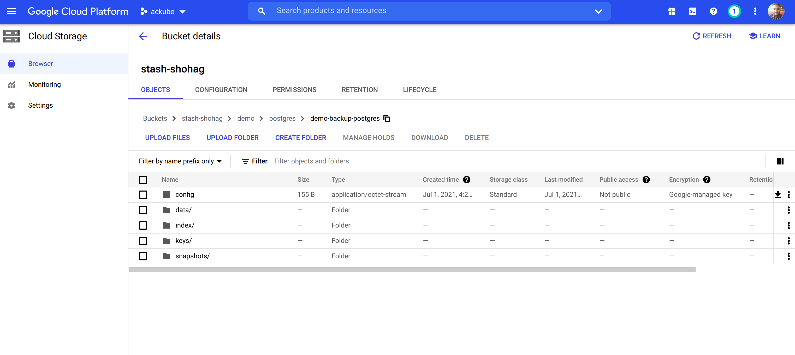

## Overview

The databases that KubeDB support are MongoDB, Elasticsearch, MySQL, MariaDB, PostgreSQL, Redis and Memcached. You can find the guides to all the supported databases [here](https://kubedb.com/).
In this tutorial we will deploy PostgreSQL database. We will cover the following steps:

1) Install KubeDB
2) Deploy Standalone Database
3) Install Stash
4) Backup Using Stash
5) Recover Using Stash

## Install KubeDB

We will follow the following steps to install KubeDB.

### Step 1: Get Cluster ID

We need the cluster ID to get the KubeDB License.
To get cluster ID we can run the following command:

```bash
$ kubectl get ns kube-system -o=jsonpath='{.metadata.uid}'
08b1259c-5d51-4948-a2de-e2af8e6835a4 
```

### Step 2: Get License

Go to [Appscode License Server](https://license-issuer.appscode.com/) to get the license.txt file. For this tutorial we will use KubeDB Enterprise Edition.


### Step 3: Install KubeDB

We will use helm to install KubeDB. Please install helm [here](https://helm.sh/docs/intro/install/) if it is not already installed.
Now, let's install `KubeDB`.

```bash
$ helm repo add appscode https://charts.appscode.com/stable/
$ helm repo update

$ helm search repo appscode/kubedb
NAME                        CHART VERSION APP VERSION DESCRIPTION
appscode/kubedb             v2021.06.23   v2021.06.23 KubeDB by AppsCode - Production ready databases...
appscode/kubedb-autoscaler  v0.4.0        v0.4.0      KubeDB Autoscaler by AppsCode - Autoscale KubeD...
appscode/kubedb-catalog     v0.19.0       v0.19.0     KubeDB Catalog by AppsCode - Catalog for databa...
appscode/kubedb-community   v0.19.0       v0.19.0     KubeDB Community by AppsCode - Community featur...
appscode/kubedb-crds        v0.19.0       v0.19.0     KubeDB Custom Resource Definitions
appscode/kubedb-enterprise  v0.6.0        v0.6.0      KubeDB Enterprise by AppsCode - Enterprise feat...

# Install KubeDB Enterprise operator chart
$ helm install kubedb appscode/kubedb \
    --version v2021.06.23 \
    --namespace kube-system \
    --set-file global.license=/path/to/the/license.txt \
    --set kubedb-enterprise.enabled=true \
    --set kubedb-autoscaler.enabled=true
```

Let's verify the installation:

```bash
Every 2.0s: kubectl get pods --all-namespaces -l app.kubernetes.io/ instance=kubedb                                                  ranaubuntu: Thu Jul  1 12:14:51 2021

NAMESPACE     NAME                                        READY   STATUS    RESTARTS   AGE
kube-system   kubedb-kubedb-autoscaler-86c4896dd9-ml27z   1/1     Running   0          2d1h
kube-system   kubedb-kubedb-community-c98c7496d-z4pxx     1/1     Running   0          2d1h
kube-system   kubedb-kubedb-enterprise-8444b8b96d-xklbr   1/1     Running   0          2d1h

```

We can see the CRD Groups that have been registered by the operator by running the following command:

```bash
$ kubectl get crd -l app.kubernetes.io/name=kubedb
NAME                                              CREATED AT
elasticsearchautoscalers.autoscaling.kubedb.com   2021-06-29T05:09:29Z
elasticsearches.kubedb.com                        2021-06-29T05:09:31Z
elasticsearchopsrequests.ops.kubedb.com           2021-06-29T05:09:41Z
elasticsearchversions.catalog.kubedb.com          2021-06-29T05:07:37Z
etcds.kubedb.com                                  2021-06-29T05:09:31Z
etcdversions.catalog.kubedb.com                   2021-06-29T05:07:37Z
mariadbopsrequests.ops.kubedb.com                 2021-06-29T05:09:59Z
mariadbs.kubedb.com                               2021-06-29T05:09:32Z
mariadbversions.catalog.kubedb.com                2021-06-29T05:07:37Z
memcacheds.kubedb.com                             2021-06-29T05:09:33Z
memcachedversions.catalog.kubedb.com              2021-06-29T05:07:38Z
mongodbautoscalers.autoscaling.kubedb.com         2021-06-29T05:09:26Z
mongodbopsrequests.ops.kubedb.com                 2021-06-29T05:09:45Z
mongodbs.kubedb.com                               2021-06-29T05:09:34Z
mongodbversions.catalog.kubedb.com                2021-06-29T05:07:38Z
mysqlopsrequests.ops.kubedb.com                   2021-06-29T05:09:55Z
mysqls.kubedb.com                                 2021-06-29T05:09:36Z
mysqlversions.catalog.kubedb.com                  2021-06-29T05:07:38Z
perconaxtradbs.kubedb.com                         2021-06-29T05:09:36Z
perconaxtradbversions.catalog.kubedb.com          2021-06-29T05:07:39Z
pgbouncers.kubedb.com                             2021-06-29T05:09:36Z
pgbouncerversions.catalog.kubedb.com              2021-06-29T05:07:39Z
postgreses.kubedb.com                             2021-06-29T05:09:37Z
postgresopsrequests.ops.kubedb.com                2021-06-29T05:10:10Z
postgresversions.catalog.kubedb.com               2021-06-29T05:07:39Z
proxysqls.kubedb.com                              2021-06-29T05:09:38Z
proxysqlversions.catalog.kubedb.com               2021-06-29T05:07:40Z
redises.kubedb.com                                2021-06-29T05:09:38Z
redisopsrequests.ops.kubedb.com                   2021-06-29T05:10:03Z
redisversions.catalog.kubedb.com                  2021-06-29T05:07:40Z
```

## Deploy Standalone Database

Now we are going to Install PostgreSQL with the help of KubeDB.
At first, let's create a Namespace in which we will deploy the database.

```bash
$ kubectl create ns demo
namespace/demo created
```

Now, let's have a look into the yaml of the Postgres CRD we are going to use:

```yaml
apiVersion: kubedb.com/v1alpha2
kind: Postgres
metadata:
  name: demo-postgres
  namespace: demo
spec:
  version: "13.2"
  storageType: Durable
  storage:
    storageClassName: "standard"
    accessModes:
    - ReadWriteOnce
    resources:
      requests:
        storage: 1Gi
  terminationPolicy: WipeOut
```

Let's save this yaml configuration into postgres.yaml. Then apply using the command
`kubectl apply -f postgres.yaml`

This yaml uses Postgres CRD.

* In this object we can see in the `spec.version` field, the version of Postgres. You can list the supported versions by running `oc get postgresversions` command.
* Another field to notice is the `spec.storagetype` field. This can be Durable or Ephemeral depending on the requirements of the database to be persistent or not.
* Lastly, the `spec.terminationPolicy` field is *Wipeout* means that the database will be deleted without restrictions. It can also be "Halt", "Delete" and "DoNotTerminate". Learn More about these [HERE](https://kubedb.com/docs/v2021.04.16/guides/postgres/concepts/postgres/#specterminationpolicy).

### Deploy Postgres CRD

Once these are handled correctly and the Postgres CRD is deployed you will see that the following are created:

```bash
$ kubectl get all -n demo
NAME                  READY   STATUS    RESTARTS   AGE
pod/demo-postgres-0   2/2     Running   0          109s

NAME                         TYPE        CLUSTER-IP     EXTERNAL-IP   PORT(S)                      AGE
service/demo-postgres        ClusterIP   10.112.14.62   <none>        5432/TCP                     110s
service/demo-postgres-pods   ClusterIP   None           <none>        5432/TCP,2380/TCP,2379/TCP   110s

NAME                             READY   AGE
statefulset.apps/demo-postgres   1/1     111s

NAME                                               TYPE                  VERSION   AGE
appbinding.appcatalog.appscode.com/demo-postgres   kubedb.com/postgres   13.2      112s

NAME                                VERSION   STATUS   AGE
postgres.kubedb.com/demo-postgres   13.2      Ready    116s
```

> We have successfully deployed Postgres database in Google Kubernetes Engine. Now we can exec into the container to use the database.

## Accessing Database Through CLI

To access the database through CLI we have to exec into the container:

 ```bash
$ kubectl exec -it -n demo demo-postgres-0 -- bash
Defaulting container name to postgres.
Use 'kubectl describe pod/demo-postgres-0 -n demo' to see all of the containers in this pod.
bash-5.1$ 
 ```

 Then to login into postgres:

```bash
bash-5.1$ psql
psql (13.2)
Type "help" for help.
 ```

Now we have entered into the postgres CLI and we can create and delete as we want.
let's create a database called `demo` and create a test table called `MyGuests`:

```bash
postgres=# \l
                                 List of databases
   Name    |  Owner   | Encoding |  Collate   |   Ctype    |   Access privileges   
-----------+----------+----------+------------+------------+-----------------------
 postgres  | postgres | UTF8     | en_US.utf8 | en_US.utf8 | 
 template0 | postgres | UTF8     | en_US.utf8 | en_US.utf8 | =c/postgres          +
           |          |          |            |            | postgres=CTc/postgres
 template1 | postgres | UTF8     | en_US.utf8 | en_US.utf8 | =c/postgres          +
           |          |          |            |            | postgres=CTc/postgres
(3 rows)

postgres=# create database demo;
CREATE DATABASE
postgres=# \l
                                 List of databases
   Name    |  Owner   | Encoding |  Collate   |   Ctype    |   Access privileges   
-----------+----------+----------+------------+------------+-----------------------
 demo      | postgres | UTF8     | en_US.utf8 | en_US.utf8 | 
 postgres  | postgres | UTF8     | en_US.utf8 | en_US.utf8 | 
 template0 | postgres | UTF8     | en_US.utf8 | en_US.utf8 | =c/postgres          +
           |          |          |            |            | postgres=CTc/postgres
 template1 | postgres | UTF8     | en_US.utf8 | en_US.utf8 | =c/postgres          +
           |          |          |            |            | postgres=CTc/postgres
(4 rows)

postgres=# \c demo
You are now connected to database "demo" as user "postgres".
demo=# CREATE TABLE COMPANY( NAME TEXT NOT NULL, EMPLOYEE INT NOT NULL);
CREATE TABLE
demo=# \d
          List of relations
 Schema |  Name   | Type  |  Owner   
--------+---------+-------+----------
 public | company | table | postgres
(1 row)

demo=# ^D\q
bash-5.1$ 
exit
```

> This was just one example of database deployment. The other databases that KubeDB support are MySQL, MongoDB, Elasticsearch, MariaDB, Memcached and Redis. The tutorials on how to deploy these into the cluster can be found [HERE](https://kubedb.com/)

## Backup and Recover Database Using Stash

Here we are going to backup the database we deployed before using Stash.

### Step 1: Install Stash

Here we will use the KubeDB license we obtained earlier.

```bash
$ helm install stash appscode/stash             \
  --version v2021.06.23                  \
  --namespace kube-system                       \
  --set features.enterprise=true                \
  --set-file global.license=/path/to/the/license.txt
```

Let's verify the installation:

```bash
$ kubectl get pods --all-namespaces -l app.kubernetes.io/name=stash-enterprise --watch
NAMESPACE     NAME                                      READY   STATUS    RESTARTS   AGE
kube-system   stash-stash-enterprise-6979884d85-7hdfm   0/2     Pending   0          0s
kube-system   stash-stash-enterprise-6979884d85-7hdfm   0/2     Pending   0          0s
kube-system   stash-stash-enterprise-6979884d85-7hdfm   0/2     ContainerCreating   0          0s
kube-system   stash-stash-enterprise-6979884d85-7hdfm   2/2     Running             0          11s
```

### Step 2: Prepare Backend

Stash supports various backends for storing data snapshots. It can be a cloud storage like GCS bucket, AWS S3, Azure Blob Storage etc. or a Kubernetes persistent volume like HostPath, PersistentVolumeClaim, NFS etc.

For this tutorial we are going to use gcs-bucket. You can find other setups [here](https://stash.run/docs/v2021.04.12/guides/latest/backends/overview/).

 

 **Create Secret:**

```bash
$ echo -n 'YOURPASSWORD' > RESTIC_PASSWORD
$ echo -n 'YOURPROJECTNAME' > GOOGLE_PROJECT_ID
$ cat /PATH/TO/JSONKEY.json > GOOGLE_SERVICE_ACCOUNT_JSON_KEY
$ kubectl create secret generic -n demo gcs-secret \
        --from-file=./RESTIC_PASSWORD \
        --from-file=./GOOGLE_PROJECT_ID \
        --from-file=./GOOGLE_SERVICE_ACCOUNT_JSON_KEY
 ```

### Step 3: Create Repository

```yaml
apiVersion: stash.appscode.com/v1alpha1
kind: Repository
metadata:
  name: gcs-repo
  namespace: demo
spec:
  backend:
    gcs:
      bucket: YOURBUCKETNAME
      prefix: /demo/postgres/demo-backup-postgres
    storageSecretName: gcs-secret
```

This repository specifies the gcs-secret we created before and connects to the gcs-bucket. It also specifies the location in the bucket where we want to backup our database.
> Don't forget to change `spec.backend.gcs.bucket` to your bucket name.

### Step 4: Create BackupConfiguration

```yaml
apiVersion: stash.appscode.com/v1beta1
kind: BackupConfiguration
metadata:
  name: demo-postgres-backup
  namespace: demo
spec:
  schedule: "*/5 * * * *"
  repository:
    name: gcs-repo
  target:
    ref:
      apiVersion: appcatalog.appscode.com/v1alpha1
      kind: AppBinding
      name: demo-postgres
  retentionPolicy:
    name: keep-last-5
    keepLast: 5
    prune: true
```

* BackupConfiguration creates a cronjob that backs up the specified database (`spec.target`) every 5 minutes.
* `spec.repository` contaiins the secret we created before called `gcs-secret`.
* `spec.target.ref` contains the reference to the appbinding that we want to backup.

So, after 5 minutes we can see the following status:

```bash
$ kubectl get backupsession -n demo
NAME                                INVOKER-TYPE          INVOKER-NAME             PHASE       AGE
demo-postgres-backup-1625135116   BackupConfiguration   demo-postgres-backup   Succeeded   43s
$ kubectl get repository -n demo
NAME       INTEGRITY   SIZE        SNAPSHOT-COUNT   LAST-SUCCESSFUL-BACKUP   AGE
gcs-repo   true        2.910 KiB   1                65s                      9m6s
```

Now if we check our GCS bucket we can see that the backup has been successful.



> **If you reached here CONGRATULATIONS!! :confetti_ball:  :partying_face: :confetti_ball: The backup has been successful**. If you didn't its okay. You can reach out to us through [EMAIL](mailto:support@appscode.com?subject=Stash%20Backup%20Failed%20in%20GKE).

## Recover

Let's think of a scenario in which the database has been accidentally deleted or there was an error in the database causing it to crash.
In such a case, we have to pause the BackupConfiguration so that the failed/damaged database does not get backed up into the cloud:

```bash
kubectl patch backupconfiguration -n demo demo-postgres-backup --type="merge" --patch='{"spec": {"paused": true}}'
```

At first let's simulate accidental database deletion.

```bash
$ kubectl exec -it -n demo  demo-postgres-0 -- bash
Defaulting container name to postgres.
Use 'kubectl describe pod/demo-postgres-0 -n demo' to see all of the containers in this pod.
bash-5.1$ psql
psql (13.2)
Type "help" for help.

postgres=# \l
                                 List of databases
   Name    |  Owner   | Encoding |  Collate   |   Ctype    |   Access privileges   
-----------+----------+----------+------------+------------+-----------------------
 demo      | postgres | UTF8     | en_US.utf8 | en_US.utf8 | 
 postgres  | postgres | UTF8     | en_US.utf8 | en_US.utf8 | 
 template0 | postgres | UTF8     | en_US.utf8 | en_US.utf8 | =c/postgres          +
           |          |          |            |            | postgres=CTc/postgres
 template1 | postgres | UTF8     | en_US.utf8 | en_US.utf8 | =c/postgres          +
           |          |          |            |            | postgres=CTc/postgres
(4 rows)

postgres=# drop database demo;
DROP DATABASE
postgres=# \l
                                 List of databases
   Name    |  Owner   | Encoding |  Collate   |   Ctype    |   Access privileges   
-----------+----------+----------+------------+------------+-----------------------
 postgres  | postgres | UTF8     | en_US.utf8 | en_US.utf8 | 
 template0 | postgres | UTF8     | en_US.utf8 | en_US.utf8 | =c/postgres          +
           |          |          |            |            | postgres=CTc/postgres
 template1 | postgres | UTF8     | en_US.utf8 | en_US.utf8 | =c/postgres          +
           |          |          |            |            | postgres=CTc/postgres
(3 rows)

postgres=# ^D\q
bash-5.1$ 
exit
```

### Step 1: Create a RestoreSession

```yaml
apiVersion: stash.appscode.com/v1beta1
kind: RestoreSession
metadata:
  name: demo-postgres-restore
  namespace: demo
spec:
  repository:
    name: gcs-repo
  target:
    ref:
      apiVersion: appcatalog.appscode.com/v1alpha1
      kind: AppBinding
      name: demo-postgres
  rules:
    - snapshots: [latest]
```

This RestoreSession specifies where the data will be restored.
Once this is applied, a RestoreSession will be created. Once it has succeeded, the database has been successfully recovered as you can see below:

```bash
$ kubectl get restoresession -n demo
NAME                    REPOSITORY   PHASE       AGE
demo-postgres-restore   gcs-repo     Succeeded   22s
```

Now let's check whether the database has been correctly restored:

```bash
$ kubectl exec -it -n demo  demo-postgres-0 -- bash
Defaulting container name to postgres.
Use 'kubectl describe pod/demo-postgres-0 -n demo' to see all of the containers in this pod.
bash-5.1$ psql
psql (13.2)
Type "help" for help.

postgres=# \l
                                 List of databases
   Name    |  Owner   | Encoding |  Collate   |   Ctype    |   Access privileges   
-----------+----------+----------+------------+------------+-----------------------
 demo      | postgres | UTF8     | en_US.utf8 | en_US.utf8 | 
 postgres  | postgres | UTF8     | en_US.utf8 | en_US.utf8 | 
 template0 | postgres | UTF8     | en_US.utf8 | en_US.utf8 | =c/postgres          +
           |          |          |            |            | postgres=CTc/postgres
 template1 | postgres | UTF8     | en_US.utf8 | en_US.utf8 | =c/postgres          +
           |          |          |            |            | postgres=CTc/postgres
(4 rows)

postgres=# \c demo
You are now connected to database "demo" as user "postgres".
demo=# \d
          List of relations
 Schema |  Name   | Type  |  Owner   
--------+---------+-------+----------
 public | company | table | postgres
(1 row)

demo=# ^D\q
bash-5.1$ 
exit
```

> The recovery has been successful. If you faced any difficulties in the recovery process you can reach out to us through [EMAIL](mailto:support@appscode.com?subject=Stash%20Recovery%20Failed%20in%20GKE).

## Webinar

A webinar was held by AppsCode on "Managing Production Grade PostgreSQL in Kubernetes Using KubeDB". You can find details of the webinar [HERE](https://blog.byte.builders/post/postgres-webinar/).

## Support

To speak with us, please leave a message on [our website](https://appscode.com/contact/).

To join public discussions with the KubeDB community, join us in the [Kubernetes Slack team](https://kubernetes.slack.com/messages/C8149MREV/) channel `#kubedb`. To sign up, use our [Slack inviter](http://slack.kubernetes.io/).

To receive product announcements, follow us on [Twitter](https://twitter.com/KubeDB).

If you have found a bug with KubeDB or want to request for new features, please [file an issue](https://github.com/kubedb/project/issues/new).
