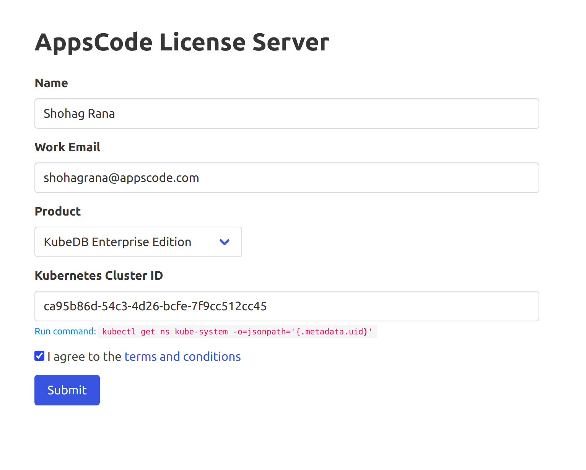

## Overview

The databases that KubeDB support are MongoDB, Elasticsearch, MySQL, MariaDB, PostgreSQL, Memcached and Redis. You can find the guides to all the supported databases [here](https://kubedb.com/).
In this tutorial we will deploy Redis database. We will cover the following steps:

1) Install KubeDB
2) Deploy Redis Cluster
3) See the Automatic Failover feature

## Installing KubeDB

We will follow the following steps to install KubeDB.

### Step 1: Get Cluster ID

We need the cluster ID to get the KubeDB License.
To get cluster ID we can run the following command:

```bash
$ kubectl get ns kube-system -o=jsonpath='{.metadata.uid}'
ca95b86d-54c3-4d26-bcfe-7f9cc512cc45
```

### Step 2: Get License

Go to [Appscode License Server](https://license-issuer.appscode.com/) to get the license.txt file. For this tutorial we will use KubeDB Enterprise Edition.



### Step 3: Install KubeDB

We will use helm to install KubeDB.Please install helm [here](https://helm.sh/docs/intro/install/) if it is not already installed.
Now, let's install `KubeDB`.

```bash
$ helm repo add appscode https://charts.appscode.com/stable/
$ helm repo update

$ helm search repo appscode/kubedb
NAME                       CHART VERSION APP VERSION DESCRIPTION                                       
appscode/kubedb            v2021.06.23   v2021.06.23 KubeDB by AppsCode - Production ready databases...
appscode/kubedb-autoscaler v0.4.0        v0.4.0      KubeDB Autoscaler by AppsCode - Autoscale KubeD...
appscode/kubedb-catalog    v2021.06.23   v2021.06.23 KubeDB Catalog by AppsCode - Catalog for databa...
appscode/kubedb-community  v0.19.0      v0.19.0     KubeDB Community by AppsCode - Community featur...
appscode/kubedb-crds       v2021.06.23  v2021.06.23 KubeDB Custom Resource Definitions                
appscode/kubedb-enterprise v0.6.0       v0.6.0     KubeDB Enterprise by AppsCode - Enterprise feat...

# Install KubeDB Enterprise operator chart
$ helm install kubedb appscode/kubedb \
        --version v2021.06.23 \
        --namespace kube-system \
        --set-file global.license=/home/rana/Downloads/kubedb-enterprise-license-ca95b86d-54c3-4d26-bcfe-7f9cc512cc45.txt  \
        --set kubedb-enterprise.enabled=true \
        --set kubedb-autoscaler.enabled=true
```

Let's verify the installation:

```bash
$ watch kubectl get pods --all-namespaces -l "app.kubernetes.io/instance=kubedb"
Every 2.0s: kubectl get pods --all-namespaces -l app.kubernetes.io/instance=kubedb                                                  ranaubuntu: Wed Jul  7 10:49:23 2021

NAMESPACE     NAME                                       READY   STATUS    RESTARTS   AGE
kube-system   kubedb-kubedb-autoscaler-99dff6664-gg4qp   1/1     Running   0          119s
kube-system   kubedb-kubedb-community-7c8487797b-wd542   1/1     Running   0          119s
kube-system   kubedb-kubedb-enterprise-99b8d974-dxcwq    1/1     Running   0          119s
```

We can see the CRD Groups that have been registered by the operator by running the following command:

```bash
$ kubectl get crd -l app.kubernetes.io/name=kubedb
NAME                                              CREATED AT
elasticsearchautoscalers.autoscaling.kubedb.com   2021-07-07T04:47:44Z
elasticsearches.kubedb.com                        2021-07-07T04:47:32Z
elasticsearchopsrequests.ops.kubedb.com           2021-07-07T04:47:39Z
elasticsearchversions.catalog.kubedb.com          2021-07-07T04:45:47Z
etcds.kubedb.com                                  2021-07-07T04:47:33Z
etcdversions.catalog.kubedb.com                   2021-07-07T04:45:47Z
mariadbopsrequests.ops.kubedb.com                 2021-07-07T04:57:22Z
mariadbs.kubedb.com                               2021-07-07T04:47:33Z
mariadbversions.catalog.kubedb.com                2021-07-07T04:45:47Z
memcacheds.kubedb.com                             2021-07-07T04:47:34Z
memcachedversions.catalog.kubedb.com              2021-07-07T04:45:48Z
mongodbautoscalers.autoscaling.kubedb.com         2021-07-07T04:47:40Z
mongodbopsrequests.ops.kubedb.com                 2021-07-07T04:47:45Z
mongodbs.kubedb.com                               2021-07-07T04:47:35Z
mongodbversions.catalog.kubedb.com                2021-07-07T04:45:48Z
mysqlopsrequests.ops.kubedb.com                   2021-07-07T04:47:57Z
mysqls.kubedb.com                                 2021-07-07T04:47:35Z
mysqlversions.catalog.kubedb.com                  2021-07-07T04:45:48Z
perconaxtradbs.kubedb.com                         2021-07-07T04:47:36Z
perconaxtradbversions.catalog.kubedb.com          2021-07-07T04:45:49Z
pgbouncers.kubedb.com                             2021-07-07T04:47:36Z
pgbouncerversions.catalog.kubedb.com              2021-07-07T04:45:49Z
postgreses.kubedb.com                             2021-07-07T04:47:37Z
postgresopsrequests.ops.kubedb.com                2021-07-07T04:57:31Z
postgresversions.catalog.kubedb.com               2021-07-07T04:45:49Z
proxysqls.kubedb.com                              2021-07-07T04:47:38Z
proxysqlversions.catalog.kubedb.com               2021-07-07T04:45:50Z
redises.kubedb.com                                2021-07-07T04:47:39Z
redisopsrequests.ops.kubedb.com                   2021-07-07T04:48:04Z
redisversions.catalog.kubedb.com                  2021-07-07T04:45:50Z
```

## Step 2: Deploying Database

Now we are going to Install Redis with the help of KubeDB.
At first, let's create a Namespace in which we will deploy the database.

```bash
$ kubectl create ns demo
namespace/demo created
```

Here is the yaml of the Redis CRD we are going to use:

```yaml
apiVersion: kubedb.com/v1alpha2
kind: Redis
metadata:
  name: redis-cluster
  namespace: demo
spec:
  version: 6.0.6
  mode: Cluster
  cluster:
    master: 3
    replicas: 1
  podTemplate:
    spec:
      resources:
        limits:
          cpu: 200m
          memory: 300Mi
  storageType: Durable
  storage:
    resources:
      requests:
        storage: 1Gi
    accessModes:
    - ReadWriteOnce
  terminationPolicy: WipeOut
```

Let's save this yaml configuration into redis.yaml. Then apply using the command
`kubectl apply -f redis.yaml`

This yaml uses Redis CRD.

* In this yaml we can see in the `spec.version` field the version of Redis. You can change and get updated version by running `kubectl get redisversions` command.
* Another field to notice is the `spec.storagetype` field. This can be Durable or Ephemeral depending on the requirements of the database to be persistent or not.
* Lastly, the `spec.terminationPolicy` field is *Wipeout* means that the database will be deleted without restrictions. It can also be "Halt", "Delete" and "DoNotTerminate". Learn More about these [HERE](https://kubedb.com/docs/v2021.04.16/guides/redis/concepts/redis/#specterminationpolicy).

### Deploy Redis CRD

Once these are handled correctly and the Redis CRD is deployed you will see that the following are created:

```bash
$ kubectl get all -n demo
NAME                         READY   STATUS    RESTARTS   AGE
pod/redis-cluster-shard0-0   1/1     Running   0          6m22s
pod/redis-cluster-shard0-1   1/1     Running   0          5m52s
pod/redis-cluster-shard1-0   1/1     Running   0          5m36s
pod/redis-cluster-shard1-1   1/1     Running   0          5m17s
pod/redis-cluster-shard2-0   1/1     Running   0          5m
pod/redis-cluster-shard2-1   1/1     Running   0          4m46s

NAME                         TYPE        CLUSTER-IP    EXTERNAL-IP   PORT(S)    AGE
service/redis-cluster        ClusterIP   10.16.2.236   <none>        6379/TCP   6m24s
service/redis-cluster-pods   ClusterIP   None          <none>        6379/TCP   6m25s

NAME                                    READY   AGE
statefulset.apps/redis-cluster-shard0   2/2     6m25s
statefulset.apps/redis-cluster-shard1   2/2     5m38s
statefulset.apps/redis-cluster-shard2   2/2     5m2s

NAME                                               TYPE               VERSION   AGE
appbinding.appcatalog.appscode.com/redis-cluster   kubedb.com/redis   6.0.6     3m36s

NAME                             VERSION   STATUS   AGE
redis.kubedb.com/redis-cluster   6.0.6     Ready    6m27s
```

> We have successfully deployed Redis in Google Kubernetes Engine. Now we can exec into the container to use the database.

## Accessing Database Through CLI

To access the database through CLI we have to connect to any redis node. Then we connect to any master pod and then we can set any values in the Redis database.

 ```bash
 # This command shows all the IP's of the redis pods
$ kubectl get pods --all-namespaces -o jsonpath='{range.items[*]}{.metadata.name} ---------- {.status.podIP}:6379{"\\n"}{end}' | grep redis
redis-cluster-shard0-0 ---------- 10.12.0.7:6379
redis-cluster-shard0-1 ---------- 10.12.2.5:6379
redis-cluster-shard1-0 ---------- 10.12.0.8:6379
redis-cluster-shard1-1 ---------- 10.12.1.12:6379
redis-cluster-shard2-0 ---------- 10.12.1.13:6379
redis-cluster-shard2-1 ---------- 10.12.1.14:6379
kube-proxy-gke-redis-test-default-pool-2b59543e-7k90 ---------- 10.128.15.227:6379
kube-proxy-gke-redis-test-default-pool-2b59543e-kz7r ---------- 10.128.15.225:6379
kube-proxy-gke-redis-test-default-pool-2b59543e-m8l3 ---------- 10.128.15.226:6379

# This command shows the roles of each of the pods of Redis:
/data # redis-cli -c cluster nodes
808d7aae760963fcb39ce0d0705fca8b64cb7077 10.12.1.12:6379@16379 slave 0b2c28e91d79664221501f2c50792bb060e1a758 0 1625637127548 2 connected
25dd83ee5948663a330747cf8c3b63d014c4e3b0 10.12.2.5:6379@16379 slave 07d3cc72fe0ff6181fb416dbbb51f21fa858d8ea 0 1625637126746 1 connected
0b2c28e91d79664221501f2c50792bb060e1a758 10.12.0.8:6379@16379 master - 0 1625637127748 2 connected 5461-10922
07d3cc72fe0ff6181fb416dbbb51f21fa858d8ea 10.12.0.7:6379@16379 myself,master - 0 1625637126000 1 connected 0-5460
f4764b2e44357e2155ba60ddd158d868a33ee6fb 10.12.1.14:6379@16379 slave d23cf8ba6fcddc01d9433f4233b2b2da4d7715f7 0 1625637126546 3 connected
d23cf8ba6fcddc01d9433f4233b2b2da4d7715f7 10.12.1.13:6379@16379 master - 0 1625637126000 3 connected 10923-16383

# connect to any node
~ $ kubectl exec -it redis-cluster-shard0-0 -n demo -c redis -- sh

# connect to any master pod
/data $ redis-cli -c -h 10.12.0.7

# set key 'hello' to value 'world'
10.12.0.7:6379> set hello world
OK
10.12.0.7:6379> get hello
"world"
10.12.0.7:6379> exit
 ```

Now we have entered into the Redis CLI and we can create and delete as we want.
redis stores data as key value pair. In the above commands, we set hello to "world".

> This was just one example of database deployment. The other databases that KubeDB suport are MySQL, Postgres, Elasticsearch, MongoDB and MariaDB. The tutorials on how to deploy these into the cluster can be found [HERE](https://kubedb.com/)

## Redis Clustering Features

There are 2 main features of Clustering which are `Data Availability` and `Automatic Failover`. These are shown below:

### Data Availability

In this section, we will see whether we can get the data from any other node (any master or replica) or not.
We can notice the replication of data among the other pods of Redis:

```bash
# switch the connection to the replica of the current master and get the data
/data $ redis-cli -c -h 10.217.0.28
10.217.0.28:6379> get hello
-> Redirected to slot [866] located at 10.217.0.9:6379
"world"
10.217.0.9:6379> exit

# switch the connection to any other node
# get the data
/data # redis-cli -c -h 10.12.2.5
10.12.2.5:6379> get hello
-> Redirected to slot [866] located at 10.12.0.7:6379
"world"
```

### Automatic Failover

To test automatic failover, we will force a master node to restart. Since the master node (`pod`) becomes unavailable, the rest of the members will elect a replica (one of its replica in case of more than one replica under this master) of this master node as the new master. When the old master comes back, it will join the cluster as the new replica of the new master.

```bash
# connect to any node and get the master nodes info
$ kubectl exec -it redis-cluster-shard0-0 -n demo -c redis -- sh
/data # redis-cli -c cluster nodes | grep master
0b2c28e91d79664221501f2c50792bb060e1a758 10.12.0.8:6379@16379 master - 0 1625637738345 2 connected 5461-10922
07d3cc72fe0ff6181fb416dbbb51f21fa858d8ea 10.12.0.7:6379@16379 myself,master - 0 1625637737000 1 connected 0-5460
d23cf8ba6fcddc01d9433f4233b2b2da4d7715f7 10.12.1.13:6379@16379 master - 0 1625637738546 3 connected 10923-16383

# let's crash node 10.12.0.7 with the `DEBUG SEGFAULT` command
/data # redis-cli -h 10.12.0.7 debug segfault
Error: Server closed the connection
/data # command terminated with exit code 137

# now again connect to a node and get the master nodes info
$ kubectl exec -it redis-cluster-shard0-0 -n demo -c redis -- sh
/data # redis-cli -c cluster nodes | grep master
0b2c28e91d79664221501f2c50792bb060e1a758 10.12.0.8:6379@16379 master - 0 1625637738345 2 connected 5461-10922
07d3cc72fe0ff6181fb416dbbb51f21fa858d8ea 10.12.2.5:6379@16379 myself,master - 0 1625637737000 1 connected 0-5460
d23cf8ba6fcddc01d9433f4233b2b2da4d7715f7 10.12.1.13:6379@16379 master - 0 1625637738546 3 connected 10923-16383
```

Notice that 10.12.2.5 is the new master and 10.12.0.7 is the replica of 10.12.2.5. This means that the replica has now become the master node since the previous master node crashed. Here, we notice that there has been a successful recovery from failover.

## Support

To speak with us, please leave a message on [our website](https://appscode.com/contact/).

To join public discussions with the KubeDB community, join us in the [Kubernetes Slack team](https://kubernetes.slack.com/messages/C8149MREV/) channel `#kubedb`. To sign up, use our [Slack inviter](http://slack.kubernetes.io/).

To receive product announcements, follow us on [Twitter](https://twitter.com/KubeDB).

If you have found a bug with KubeDB or want to request for new features, please [file an issue](https://github.com/kubedb/project/issues/new).
