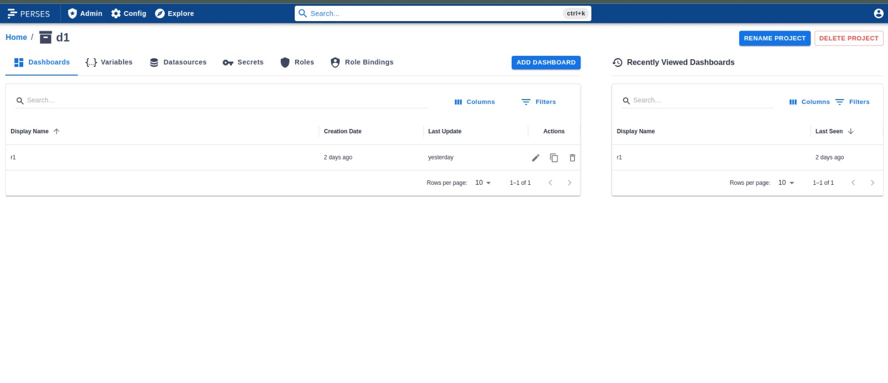
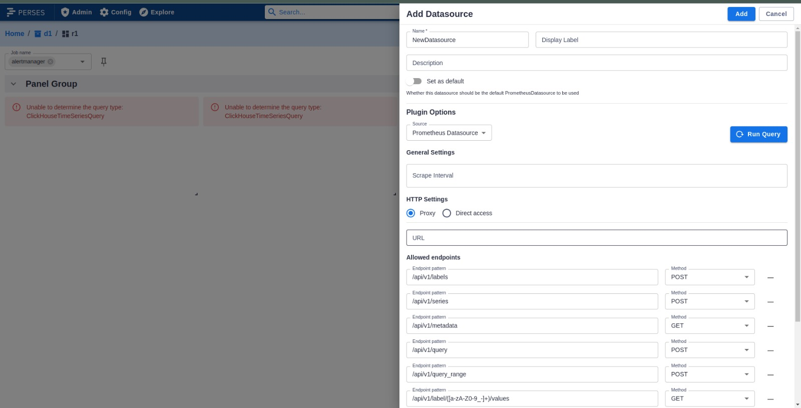
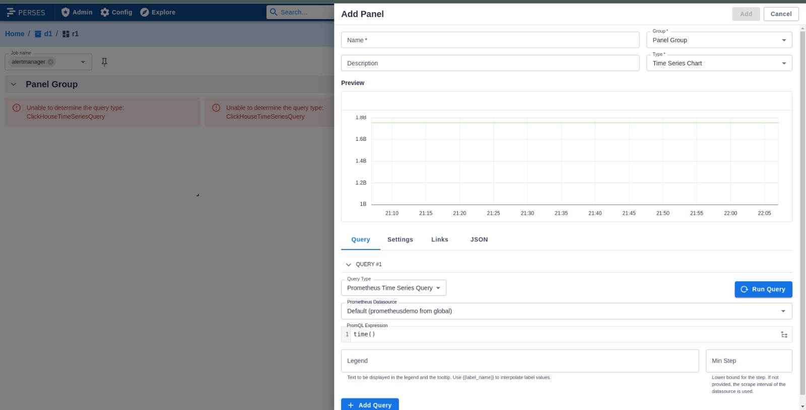
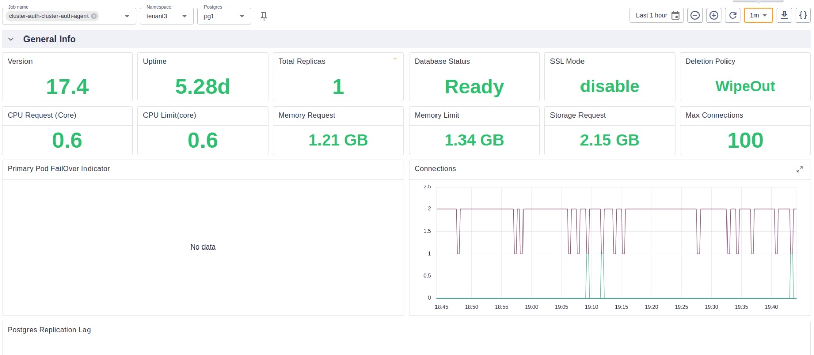

## Observability

To understand perses and it's usecases let's get the basic revised

Suppose you deployed a service/app on a Kubernetes cluster 

Now to know whether your app/service is working correctly you need 3 things 
 - Metrics
 - Logs
 - Traces 

#### **Metrics**
**What**: Numerical measurements aggregated over time  
**Purpose**: Monitor system health and performance trends  
**Example**: CPU usage (85%), API response time (250ms), error rate (2.1%), requests per second (1,200 RPS)

#### **Logs** 
**What**: Timestamped text records of discrete events  
**Purpose**: Debug issues and understand what happened when  
**Example**: 
```
2025-07-26 14:32:15 ERROR Payment service failed for user_id=12345, 
amount=$99.99, error="Card declined", transaction_id=tx_abc123
```

#### **Traces**
**What**: End-to-end journey of a request through multiple services  
**Purpose**: Track performance bottlenecks and dependencies across distributed systems  
**Example**: User checkout request → API Gateway (5ms) → Auth Service (12ms) → Payment Service (180ms) → Database (45ms) → Total: 242ms

**Together**: Metrics show *what's* happening, logs explain *why* it happened, and traces reveal *where* in your system it occurred.

## Perses

Now what if you can see all these in visually compelling graphs, charts etc 
Basically a dashboard for your entire operations 

Well **Perses** does exactly

**Perses** is CNCF sandbox project that means it has a bright future ahead. Now let's see how to run perses and what it can do with our data

## Perses architecture 

There are 3 repos to look out 

[perses](https://github.com/perses/perses)
 & UI folder inside that 

[plugins](https://github.com/perses/plugins)

[operator](https://github.com/perses/perses-operator)


Together they can be used for complete UI, Dashboard-as-a-code or embedded UI

## Running perses as an user 

To build the Perses project from source you need minimum versions of the following:

- GO v1.23+
- Node v22+
- NPM v10+


`
git clone https://github.com/perses/perses.git
`

Now just move to the Perses project directory and build the project:


```
cd perses

make build


Starting the Perses server#
To start the server you just built:


./bin/perses --config dev/config.yaml
 ___________
\___________/
     ___________      ______
    \___________/     | ___ \
 ___________          | |_/ /__ _ __ ___  ___  ___
\___________/         |  __/ _ \ '__/ __|/ _ \/ __|
 ___                  | | |  __/ |  \__ \  __/\__ \
\___/                 \_|  \___|_|  |___/\___||___/  [PERSES_VERSION]
__________________________________________________________

⇨ http server started on [::]:8080

```

It can be installed inside an container as well. [Details](https://perses.dev/perses/docs/installation/in-a-container/)

### configure perses 

you can do it from terminal or editing directly config.yaml 

#### options

```
# Use it in case you want to prefix the API path. By default the API is served with the path /api. 
# With this config, it will be served with the path <api_prefix>/api
api_prefix: <string> # Optional

# It contains any configuration that changes the API behavior like the endpoints exposed or if the permissions are activated.
security: <Security config> # Optional

# Database configuration 
database: <Database config> # Optional

# Dashboard configuration
dashboard: <Dashboard config> # Optional

# The configuration to access the CUE schemas
# This config is deprecated. It will be removed in the future. Please remove it from your config. 
schemas: <Schemas config> # Optional

# If provided, Perses server will look to the different folders configured and populate the database based on what it is found
# Be careful: the data coming from the provisioning folder will totally override what exists in the database.
provisioning: <Provisioning config> # Optional

# This configuration allows to fine tune the datasource feature. (To disable, or for discovery)
datasource: <Datasource config> # Optional

# This configuration allows to fine tune the variable feature
variable: <Variable config> # Optional

# The interval at which to trigger the cleanup of ephemeral dashboards, based on their TTLs.
# This config is deprecated. Please use the config ephemeral_dashboard instead.
ephemeral_dashboards_cleanup_interval: <duration> # Optional

# The config for the ephemeral dashboard feature. This is the way to activate the feature.
ephemeral_dashboard: < EphemeralDashboard config > # Optional

# Any configuration related to the UI itself
frontend: <Frontend config> # Optional

# The configuration to access and load the runtime plugins 
plugin: <Plugin config> # Optional
```

#### example 
```
security:
  enable_auth: false
```

The default authentication for perses won't block anything 

After build you can run it from terminal using perses native CLI (percli) or using the UI 

### Exploring the UI

You can create a dashboard under a project 

1. Create a project  

   when you run UI it's in the home page (top right corner)

2. Inside a project you can do the following things 

   - Create dashboard (shows all the graph, charts, data etc)
   - Create panel (single entity of dashboard, a dashboard is a collection of panel)
   - Data sources (Prometheus or tempo. You choose from which source it should read)
   - Variables (can be used across project like ${namespace} can be used in several   queries)
   - Secrets (useful for accessing you datasource using perses backend)
   - Roles and Rolebinging (permissions of users in your project)



3. You can do all these inside a dashboard as well, doing them here means they will be 
available across dashboards of this project 

4. Inside a dashboard let's first add a datasource. A data source can be accessed by 2 method 
- Direct url: you provide your prometheus or tempo direct url It will get data from that 
- Proxy: You setup a backend and request that to get data from prometheus or tempo 



5. Now let's add a panel which is the single unit for dashboard. To add a panel you need 3 things 

 - Type: You want bar graph or stat data or pie chart etc 
 - Datasource: Chose from the datasource you have created previously 
 - Query: Run the promquery or tempo query based on type and datasource 



6. Keep adding and you have your dashboard. You can drag and drop layout according to your need(on edit mode). Done it's that simple


**Make sure you hit save after all these otherwise it will be lost**

#### example dashboards 





You can use it as it is by hosting somewhere

Or 

You can embed dashboards or panels in external UIs via iframe or SDK integration.

Or 

Just use the dashboard as a code service to make dashboards from other platform 


### Percli 

All the things that we did from UI can be also done using cli. Here are some basic CLI commands.

```
$ percli --help

Command line interface to interact with the Perses API

Usage:
  percli [command]

Available Commands:
  apply       Create or update resources through a file. JSON or YAML format supported
  completion  Generate the autocompletion script for the specified shell
  config      display local or remote config
  dac         Commands related to Dashboard-as-Code
  delete      Delete resources
  describe    Show details of a specific resource
  get         Retrieve any kind of resource from the API.
  help        Help about any command
  lint        Static check of the resources
  login       Log in to the Perses API
  migrate     migrate a Grafana dashboard to the Perses format
  plugin      Commands related to plugins development
  project     Select the project used by default.
  refresh     refresh the access token when it expires
  version     Display client version.
  whoami      Display current user used

Flags:
  -h, --help                  help for percli
      --log.level string      Set the log verbosity level. Possible values: panic, fatal, error, warning, info, debug, trace (default "info")
      --percliconfig string   Path to the percliconfig file to use for CLI requests. (default "/Users/ahusson/.perses/config.json")

Use "percli [command] --help" for more information about a command.
```

### Migration from grafana 

using the UI:

In the home page beside project creation open the dropdown of add dashboard. There you will find the migration option the rest of the UI is self explanatory

using the cli: 
```
percli migrate -f grafana-dashboard.json --online -o json > perses-dashboard.json
```

## Running perses as a developer 

### Adding more plugin option 

Suppose you want to add clickhouse or loki as datasource as well for that you need to run the plugin repo 

 - Create a new folder 
 - Run percli command to generate 

 ```
 percli plugin generate  --plugin.type=Panel --plugin.name=ClickHousePanel --plugin.display-name="ClickHouse Panel"
 ```

 - You can add datasouce , variable etc by changing the type 
 - Then edit the generated code for your desired plugin 
 - Build and the main perses will have those option 
 - Similar thing can be done for Loki as other data sources as well 

 ### kubernetes operator 

 Set up enviroment 
 ```
 # Clone the repository
git clone https://github.com/perses/perses-operator.git
cd perses-operator

# Set up local Kubernetes cluster
kind create cluster --name perses-dev

# Install dependencies
make install

# Run locally
make run
 ```

 Some scope of working 

- Implement ephemeral dashboard TTL functionality
- Add datasource discovery mechanisms
- Add RBAC integration
- Integration with GitOps tools (ArgoCD, Flux)


# Perses vs Grafana: Quick Comparison

## **Key Differences**

| **Aspect** | **Grafana** | **Perses** |
|------------|-------------|------------|
| **License** | AGPLv3 | Apache 2.0 |
| **Maturity** | Mature (10+ years) | Early stage (CNCF Sandbox) |
| **Approach** | UI-first | Code-first |

## **Core Features**

| **Feature** | **Grafana** | **Perses** |
|-------------|-------------|------------|
| **Dashboard Creation** | Drag-and-drop UI | YAML/CUE code |
| **Data Sources** | 100+ sources | Prometheus, Tempo |
| **Storage** | Database | Kubernetes CRDs / Git |
| **GitOps** | Third-party tools | Native |
| **Kubernetes** | External deployment | Native CRDs |
| **Validation** | Manual | CI/CD pipeline |


### References 
[Perses Docs](https://perses.dev/)

[Conf42 Kube Native 2024](https://www.youtube.com/watch?v=sw7e0TExJJg)


## Support

To speak with us, please leave a message on [our website](https://appscode.com/contact/).

To receive product announcements, follow us on [X](https://x.com/KubeDB).

To watch tutorials of various Production-Grade Kubernetes Tools Subscribe our [YouTube](https://youtube.com/@appscode) channel.

Learn More about [Production-Grade Databases in Kubernetes](https://kubedb.com/)

If you have found a bug with KubeDB or want to request for new features, please [file an issue](https://github.com/kubedb/project/issues/new).
