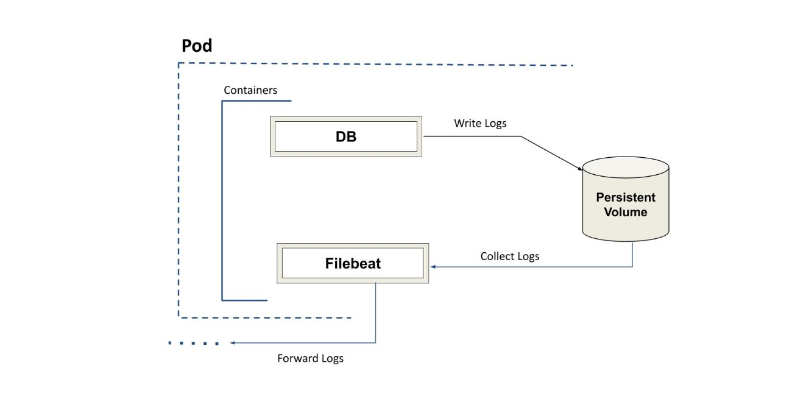

### Add custom containers in KubeDB managed Database

Let's assume you have a KubeDB managed Database deployed in your Kubernetes environment. Now, You want to inject a sidecar container in the database StatefulSet in order to extend and enhance the functionality of existing containers. Currently, KubeDB doesn't have support for custom container insertion. But, we are having a workaround to run KubeDB managed pods with your own custom container. In this demo, we are going to demonstrate how to inject Filebeat container in KubeDB managed MySQL cluster.  

Let's assume you have a KubeDB managed MySQL cluster deployed in your Kubernetes environment,  Here's a quick demonstration on how to accomplish it.

Firstly, We are going to deploy a sample MySQL cluster in demo namespace using the following YAML.

```yaml
apiVersion: kubedb.com/v1alpha2
kind: MySQL
metadata:
  name: mysql-cluster
  namespace: demo
spec:
  replicas: 2
  version: "8.0.29"
  storageType: Durable
  storage:
    storageClassName: "standard"
    accessModes:
    - ReadWriteOnce
    resources:
      requests:
        storage: 1Gi
  terminationPolicy: WipeOut
```

The Operator will create a custom resource `mysql-cluster`. It will also create a StatefulSet named `mysql-cluster` as well. The StatefulSet will eventually create two pods named `mysql-cluster-0` and `mysql-cluster-1`.
Our aim is to use [Filebeat](https://www.elastic.co/beats/filebeat) to retrieve database logs. We are going to inject a filebeat container with custom configuration to the operator-generated mysql-cluster [StatefulSets](https://kubernetes.io/docs/concepts/workloads/controllers/statefulset).
### Prepare the container

At first, create a filebeat.yml file with your required configurations. Let's assume that you want to read DB logs from a mysql container. In kubeDB managed MySQL pod, the log file is mounted in `/var/lib/mysql` directory in `{pod-name}.log` file.

The following example configures Filebeat to harvest lines from all log files that match the specified glob patterns. For this demo, we are going to Forward the output to console. The Console output writes events in JSON format to stdout.

```yaml
filebeat.inputs:
  - type: log
    paths:
    - /var/lib/mysql/*.log
output.console:
  pretty: true
```

You can also provide specific log file paths for specific pods as well. Use the following command to view all the log files available in `mysql-cluster-0` pod.

```bash
$ kubectl exec -it mysql-cluster-0 -n demo -c mysql -- bash -c "cd /var/lib/mysql && ls | grep *.log"

mysql-quickstart-0.log
```

Now create a Dockerfile in the same directory. Set the base image to your required filebeat version. For this demo, we are using `Filebeat 7.17.1`. In the Dockerfile, copy the filebeat.yml to default home directory to override the existing one.

```dockerfile
FROM elastic/filebeat:7.17.1
COPY filebeat.yml /usr/share/filebeat
USER root
RUN chmod go-w /usr/share/filebeat/filebeat.yml
USER filebeat
```

The working directory should be structured like this:
```bash
tree .
.
├── Dockerfile
└── filebeat.yml
```

Now, Use the following command to create the docker image and push to your remote dockerhub repository.

```bash
$ docker build -t repository_name/custom_filebeat:latest .
$ docker push repository_name/custom_filebeat:latest
```
### Patch the custom container

You can view the operator generated statefulset via the folllowing command.

```bash
$ kubectl get sts mysql-cluster -n demo -oyaml
```

In order to add your custom container using the `custom_filebeat` image, create a YAML file named `mysql-patch.yaml` using the following spec. The log file is mounted in a shared PVC directory. Set the `securityContext.runAsUser` to MySQL user ID so that the mysql owned log files can be read by filebeat.

```yaml
spec:
  template:
    spec:
      containers:
      - image: repository_name/custom_filebeat:latest
        name: filebeat
        volumeMounts:
        - mountPath: /var/lib/mysql
          name: data
          readOnly: true
      securityContext:
        runAsUser: 999
```

Patch this YAML to our existing StatefulSet using the following command.

```bash
$ kubectl patch sts mysql-cluster -n demo --patch-file mysql-patch.yaml
```


Get the `mysql-cluster` StatefulSet YAML to confirm that the changes has been patched. Now, make a `MySQLOpsRequest` of type Restart to restart the Pods with the newly applied configurations. Apply the following YAML to make an OpsRequest to your `mysql-cluster` custom resource. Alternatively, you can restart your pods manually.

### Restart the pods with updated configurations

```yaml
apiVersion: ops.kubedb.com/v1alpha1
kind: MySQLOpsRequest
metadata:
  name: mysql-cluster-restart
  namespace: demo
spec:
  type: Restart
  databaseRef:
    name: mysql-cluster
```

After the OpsRequest being successfully executed, the pods will be restarted with newly applied configurations. You can now exec into the `mysql` container and enable general_log using the following commands.

```bash
$ kubectl logs -f -n demo pod/mysql-cluster-0 -c exec
$ mysql -uroot -p$MYSQL_ROOT_PASSWORD
$ mysql> set global general_log=ON;
```

Now, View the `filebeat` container logs from another terminal to see the logs generated by mysql queries. You can continuously make queries in the terminal where the mysql container is executed and observe the query logs generated in the terminal where filebeat container is executed.

```bash
$ kubectl logs -f -n demo pod/mysql-cluster-0 -c filebeat
```

You can configure the `filebeat.yml` file to forward the output to [`Elasticsearch`](https://www.elastic.co/guide/en/beats/filebeat/current/elasticsearch-output.html) , [`Logstash`](https://www.elastic.co/guide/en/beats/filebeat/current/elasticsearch-output.html) , [`Kafka`](https://www.elastic.co/guide/en/beats/filebeat/current/kafka-output.html), [`redis`](https://www.elastic.co/guide/en/beats/filebeat/current/redis-output.html) etc. instead of console stdout.

## Support

To speak with us, please leave a message on [our website](https://appscode.com/contact/).

To join public discussions with the KubeDB community, join us in the [Kubernetes Slack team](https://kubernetes.slack.com/messages/C8149MREV/) channel `#kubedb`. To sign up, use our [Slack inviter](http://slack.kubernetes.io/).

To receive product announcements, follow us on [Twitter](https://twitter.com/KubeDB).

If you have found a bug with KubeDB or want to request for new features, please [file an issue](https://github.com/kubedb/project/issues/new).
