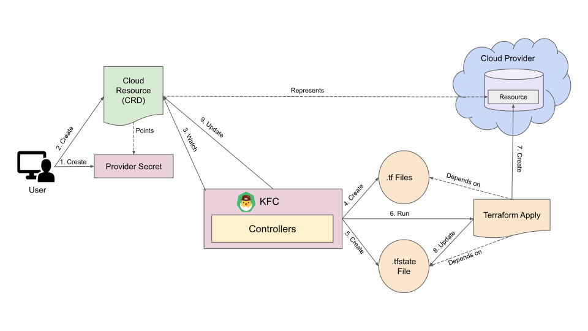
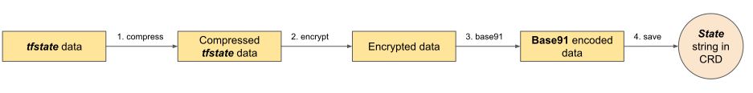
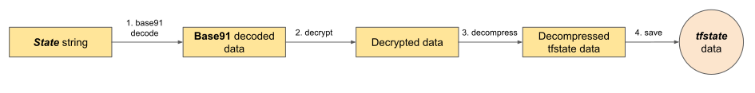

Kubeform by AppsCode is a Kubernetes operator for [Terraform](https://www.terraform.io/). Kubeform provides auto-generated Kubernetes CRDs for Terraform resources and modules so that you can manage any cloud infrastructure in a Kubernetes native way. You just write a CRD for a cloud infrastructure, apply it and Kubeform will create it for you! Kubeform currently supports 5 top cloud platforms. These are AWS, Google Cloud, Azure, Digitalocean and Linode.

The key features of Kubeform are:

- Native kubernetes support
- Built on Terraform
- Supports Terraform resources and modules
- Use cloud infrastructures as code
- Define & Manage cloud infrastructures as Kubernetes `CRD` (Custom Resource Definition)
- Supports multiple cloud platform
- 100% open source

## How Kubeform Works

The following diagram shows how `Kubeform` creates a resource on a Cloud Provider (GCP, AWS, etc.).

<figure align="center">
 
 <figcaption align="center">Fig: How Kubeform Works</figcaption>
</figure>

The Resource Creation Process of Kubeform consists of the following steps:

1. At first, a user creates a secret with access credentials of the Cloud provider where the resource will be created.

2. Then, he creates a CRD of the resource that specifies the information of the Cloud Resource. The CRD also holds the credential information.

3. The KubeForm Controller (KFC) watches the created CRD.

4. Then, KFC creates `.tf` files from the CRD `Spec` and the provider secret.

5. If the `.tfstate` file doesn't exist then KFC creates the `.tfstate` file from the `status.output` & `status.state` fields of the CRD.

6. Then KFC runs `terraform apply` commands on the `.tfstate` file and `.tf` files that were created in the previous steps.

7. After successful execution of `terraform apply` command, it creates the specified resource on the specified Cloud Provider.

8. Then `terraform apply` command updates the `tfstate` file if necessary.

9. If the `.tfstate` file is updated, KFC also updates the `status.output` & `status.state` fields of the CRD.

## How to use Kubeform

Let's take a look at how can we create anp AWS `RDS` (Relational Database Service) using `Kubeform`.


- First install the kubeform operator following the instructions [here](https://kubeform.com/docs/latest/setup/):

<ul class="nav nav-tabs" id="installerTab" role="tablist">
  <li class="nav-item">
    <a class="nav-link active" id="helm3-tab" data-toggle="tab" href="#helm3" role="tab" aria-controls="helm3" aria-selected="true">Helm 3</a>
  </li>
  <li class="nav-item">
    <a class="nav-link" id="helm2-tab" data-toggle="tab" href="#helm2" role="tab" aria-controls="helm2" aria-selected="false">Helm 2</a>
  </li>
</ul>
<div class="tab-content" id="installerTabContent">
  <div class="tab-pane fade show active" id="helm3" role="tabpanel" aria-labelledby="helm3-tab">

## Using Helm 3

Kubeform can be installed via [Helm](https://helm.sh/) using the [chart](https://github.com/kubeform/installer/tree/v0.1.0/charts/kubeform) from [AppsCode Charts Repository](https://github.com/appscode/charts). To install the chart with the release name `my-release`:

```console
$ helm repo add appscode https://charts.appscode.com/stable/
$ helm repo update
$ helm search repo appscode/kubeform
NAME                CHART VERSION  APP VERSION  DESCRIPTION
appscode/kubeform   v0.1.0         v0.1.0       Kubeform by AppsCode - Build Cloud Infrastructure from Kubernetes

$ helm install kfc appscode/kubeform --version v0.1.0 --namespace kube-system
```

To see the detailed configuration options, visit [here](https://github.com/kubeform/installer/tree/v0.1.0/charts/kubeform).

</div>
<div class="tab-pane fade" id="helm2" role="tabpanel" aria-labelledby="helm2-tab">

## Using Helm 2

Kubeform can be installed via [Helm](https://helm.sh/) using the [chart](https://github.com/kubeform/installer/tree/v0.1.0/charts/kubeform) from [AppsCode Charts Repository](https://github.com/appscode/charts). To install the chart with the release name `my-release`:

```console
$ helm repo add appscode https://charts.appscode.com/stable/
$ helm repo update
$ helm search appscode/kubeform
NAME                CHART VERSION  APP VERSION  DESCRIPTION
appscode/kubeform   v0.1.0         v0.1.0       Kubeform by AppsCode - Build Cloud Infrastructure from Kubernetes

$ helm install appscode/kubeform --name kfc --version v0.1.0 --namespace kube-system
```

To see the detailed configuration options, visit [here](https://github.com/kubeform/installer/tree/v0.1.0/charts/kubeform).

</div>
</div>

- Now, we need AWS provider secrets to connect with AWS. For terraform, this secrets are provided like this in a `.tf` file:

```
{
  "provider": {
    "aws": {
      "access_key": "ACCESS_KEY",
      "region": "us-east-1",
      "secret_key": "SECRET_KEY"
    }
  }
}
```

For using it in `Kubeform`, we need to convert it to a secret like this:

```yaml
apiVersion: v1
kind: Secret
metadata:
    name: aws
type: kfc.io/aws
data:
    region: dXMtZWFzdC0xCg==  # base64 encoded value of `us-east-1`
    access_key: '<base64 encoded access key>'
    secret_key: '<base64 encoded secret key>'
```

Then we have to reference it from our Resource CRD.

- Now We need to create the AWS RDS CRD. We can create the AWS RDS CRD using the following kubectl command:

```console
kubectl apply -f https://github.com/kubeform/kubeform/raw/master/api/crds/aws.kubeform.com_dbinstances.yaml
```

- The AWS RDS configuration of terraform is given in a `.tf` like this:

```
{
  "resource": {
    "aws_db_instance": {
      "test1": {
        "allocated_storage": 5,
        "engine": "mysql",
        "engine_version": "5.7",
        "instance_class": "db.t2.micro",
        "name": "mydb",
        "parameter_group_name": "default.mysql5.7",
        "password": "foobar1234",
        "storage_type": "gp2",
        "username": "foo"
      }
    }
  }
}
```

We can see that, there is a field called password, which is a sensitive value. So, we should not use this kind of sensitive value directly in the yaml. We'll create a secret to store the sensitive value like the this:

```yaml
apiVersion: v1
kind: Secret
metadata:
    name: rds-pass
type: kfc.io/aws
data:
    password: Zm9vYmFyMTIzNAo=  # base64 encoded value of `foobar1234`
```

Then we can reference it from our `DbInstance` CRD. The `DbInstance` CRD will look like this:

```yaml
apiVersion: aws.kubeform.com/v1alpha1
kind: DbInstance
metadata:
    name: test1
spec:
    allocatedStorage: 5
    storageType: gp2
    engine: mysql
    engineVersion: '5.7'
    instanceClass: db.t2.micro
    name: mydb
    username: foo
    parameterGroupName: default.mysql5.7
    providerRef:
        name: aws
    secretRef:
        name: rds-pass
```

Here, we can see that the provider secret is referenced using a field called `providerRef` and the sensitive value secret is referenced using a field called `secretRef`.

- Let's put it altogether and apply it using kubectl. First create a `aws_rds.yaml` using the following yaml:

{}
```yaml
apiVersion: v1
kind: Secret
metadata:
    name: aws
type: kfc.io/aws
data:
    region: dXMtZWFzdC0xCg==
    access_key: '<base64 encoded access key>'
    secret_key: '<base64 encoded secret key>'
---
apiVersion: v1
kind: Secret
metadata:
    name: rds-pass
type: kfc.io/aws
data:
    password: Zm9vYmFyMTIzNAo=
---
apiVersion: aws.kubeform.com/v1alpha1
kind: DbInstance
metadata:
    name: test1
spec:
    allocatedStorage: 5
    storageType: gp2
    engine: mysql
    engineVersion: '5.7'
    instanceClass: db.t2.micro
    name: mydb
    username: foo
    parameterGroupName: default.mysql5.7
    providerRef:
        name: aws
    secretRef:
        name: rds-pass
```
{}

Then, run:

```console
kubectl apply -f aws_rds.yaml
```

After that, an AWS RDS will be created!

- To delete the rds instance just run:

```console
kubectl delete -f aws_rds.yaml
```

## How Kubeform handles Terraform State

### Terraform Resource

For individual resources, Kubeform doesn't store the full `tfstate` file in the CRD. The `tfstate` json file contains `version`, `terraform_version`, `serial`, `lineage` and `resources` fields.

Kubeform stores the `tfstate` file in the CRD using the following way:

1. The `version`, `terraform_version`, `serial` and, `lineage` fields are stored in `status.state` field in the custom resources.
2. The data from the `resources` field that are not sensitive are stored in the `output` field of the CRD.
3. The data from the `resources` field that are sensitive are stored in a secret. The secret name is specified in a `secretRef` field of the CRD. If the `secretRef` is not set, then KFC creates a secret and stores the sensitive outputs there.

To obtain the `tfstate` from the state field:

1. The `version`, `terraform_version`, `serial` and, `lineage` fields are retrieves from the `status.state` field of a Kubeform resource.
2. The non-sensitive data from the `output` field of `status` and the sensitive data from the secret are merged and then set on the `resources` field.

### Terraform Module

For Terraform modules, Kubeform stores the full `tfstate` file in the CRD status object. As the `tfstate` file may contain sensitive information, KFC doesn't store the `tfstate` file directly.

Before storing the `tfstate` file in the CRD, the `tfstate` is transformed in the following steps:

1. First, the content of the tfstate file is compressed using `gzip`.
2. Then the compressed data is encrypted using a secret key. The secret key is a base64 encoded key which is 32 bytes when decoded. The secret key is provided by the user to the Kubeform operator(`kfc`).
3. The encrypted data is `basE91` encoded. `basE91` is an advanced method for encoding binary data as ASCII characters. It is similar to base64, but is more efficient. The overhead produced by basE91 depends on the input data. It amounts at most to 23% (versus 33% for base64).
4. Finally, the base91 encoded data is stored in the `state` field of `status` object in the CRD.

The process is shown in the following figure:

<figure align="center">
 
 <figcaption align="center">Fig: `tfstate` to `state` string in CRD</figcaption>
</figure>

To obtain the tfstate file from the `status.state` field of a custom resource, the steps is followed in reverse:

1. First, the `status.state` field of the Kubeform module resource is base91 decoded.
2. The base91 decoded data is then decrypted using the secret key.
3. Then the decrypted data is decompressed using `gzip`.
4. Finally, decompressed data is saved as a `tfstate` file.

The process is shown in the following figure:

<figure align="center">
 
 <figcaption align="center">Fig: `state` string in CRD to `tfstate`</figcaption>
</figure>

## Alternatives

We have explored the option of using [Kubernetes Service Catalog](https://github.com/kubernetes-sigs/service-catalog) project to consume cloud services in Kubernetes using the Open Service Broker API. But CRDs provide better tooling in the context of Kubernetes. Also, this project has seen very little activity in recent times and cloud providers are [abandoning](https://cloud.google.com/kubernetes-engine/docs/concepts/google-cloud-platform-service-broker) it in favor of CRD based solutions.

Visit Kubeform project [website](https://kubeform.com) to learn more. You can also find us on [GitHub](https://github.com/kubeform).

If you have read all the way to the end, I want to thank you. If you have any questions and want to know more, you can reach us via [Email](mailto:kubeform-dev@appscode.com).
