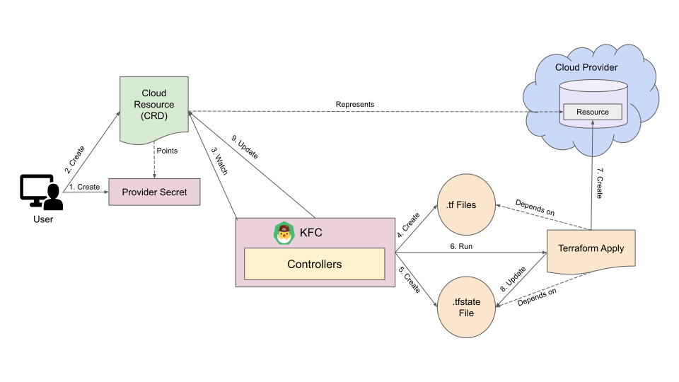

# How to use Kubeform

Let's take a look at how can we create anp AWS `RDS` (Relational Database Service) using `Kubeform`.

1. First of all, we need AWS provider secrets to connect with AWS. For terraform, this secrets are provided like this in a `.tf` file:

```hcl
{
  "provider": {
    "aws": {
      "access_key": "ACCESS_KEY",
      "region": "us-east-1",
      "secret_key": "SECRET_KEY"
    }
  }
}
```

For using it in `Kubeform`, we need to convert it to a secret like this:

```yaml
apiVersion: v1
kind: Secret
metadata:
    name: aws
type: kfc.io/aws
data:
    region: dXMtZWFzdC0xCg==  # base64 encoded value of `us-east-1`
    access_key: '<base64 encoded access key>'
    secret_key: '<base64 encoded secret key>'
```

Then we have to reference it from our Resource CRD.

2. Now We need to create the AWS RDS CRD. We can create the AWS RDS CRD using the following kubectl command:

```console
kubectl apply -f https://github.com/kubeform/kubeform/raw/master/api/crds/aws.kubeform.com_dbinstances.yaml
```

3. The AWS RDS configuration of terraform is given in a `.tf` like this:

```hcl
{
  "resource": {
    "aws_db_instance": {
      "test1": {
        "allocated_storage": 5,
        "engine": "mysql",
        "engine_version": "5.7",
        "instance_class": "db.t2.micro",
        "name": "mydb",
        "parameter_group_name": "default.mysql5.7",
        "password": "foobar1234",
        "storage_type": "gp2",
        "username": "foo"
      }
    }
  }
}
```

We can see that, there is a field called password, which is a sensitive value. So, we should not use this kind of sensitive value directly in the yaml. We'll create a secret to store the sensitive value like the this:

```yaml
apiVersion: v1
kind: Secret
metadata:
    name: rds-pass
type: kfc.io/aws
data:
    password: Zm9vYmFyMTIzNAo=  # base64 encoded value of `foobar1234`
```

Then we can reference it from our `DbInstance` CRD. The `DbInstance` CRD will look like this:

```yaml
apiVersion: aws.kubeform.com/v1alpha1
kind: DbInstance
metadata:
    name: test1
spec:
    allocatedStorage: 5
    storageType: gp2
    engine: mysql
    engineVersion: '5.7'
    instanceClass: db.t2.micro
    name: mydb
    username: foo
    parameterGroupName: default.mysql5.7
    providerRef:
        name: aws
    secretRef:
        name: rds-pass
```

Here, we can see that the provider secret is referenced using a field called `providerRef` and the sensitive value secret is referenced using a field called `secretRef`.

4. Let's put it altogether and apply it using kubectl. First create a `aws_rds.yaml` using the following yaml:

```yaml
apiVersion: v1
kind: Secret
metadata:
    name: aws
type: kfc.io/aws
data:
    region: dXMtZWFzdC0xCg==
    access_key: '<base64 encoded access key>'
    secret_key: '<base64 encoded secret key>'
---
apiVersion: v1
kind: Secret
metadata:
    name: rds-pass
type: kfc.io/aws
data:
    password: Zm9vYmFyMTIzNAo=
---
apiVersion: aws.kubeform.com/v1alpha1
kind: DbInstance
metadata:
    name: test1
spec:
    allocatedStorage: 5
    storageType: gp2
    engine: mysql
    engineVersion: '5.7'
    instanceClass: db.t2.micro
    name: mydb
    username: foo
    parameterGroupName: default.mysql5.7
    providerRef:
        name: aws
    secretRef:
        name: rds-pass
```

Then, run:

```console
kubectl apply -f aws_rds.yaml
```

After that, an AWS RDS will be created!

6. To delete the rds instance just run:

```console
kubectl delete -f aws_rds.yaml
```

## How Kubeform Works

The following diagram shows how `Kubeform` creates a resource on a Cloud Provider (GCP, AWS, etc.).

<figure align="center">
 
 <figcaption align="center">Fig: How Kubeform Works</figcaption>
</figure>

The Resource Creation Process of Kubeform consists of the following steps:

1. At first, a user creates a secret with access credentials of the Cloud provider where the resource will be created.

2. Then, he creates a CRD of the resource that specifies the information of the Cloud Resource. The CRD also holds the credential information.

3. The KubeForm Controller (KFC) watches the created CRD.

4. Then, KFC creates `.tf` files from the CRD `Spec` and the provider secret.

5. If the `.tfstate` file doesn't exist then KFC creates the `.tfstate` file from the `status.output` & `status.state` fields of the CRD.

6. Then KFC runs `terraform apply` commands on the `.tfstate` file and `.tf` files that were created in the previous steps.

7. After successful execution of `terraform apply` command, it creates the specified resource on the specified Cloud Provider.

8. Then `terraform apply` command updates the `tfstate` file if necessary.

9. If the `.tfstate` file is updated, KFC also updates the `status.output` & `status.state` fields of the CRD.