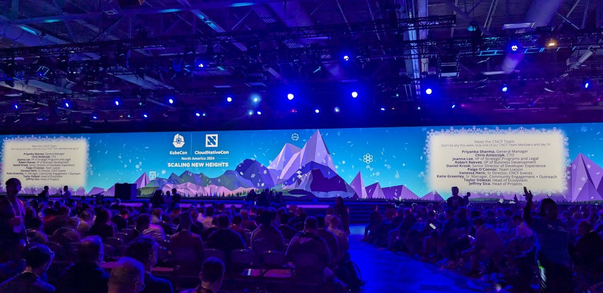

## Overview
KubeCon is the premier global conference for the Kubernetes and cloud-native community, hosted by the Cloud Native Computing Foundation (CNCF). Held this year from November 12–15, 2024, in Salt Lake City, Utah, it brought together developers, IT professionals, and industry leaders to explore the latest advancements in container orchestration and cloud-native technologies.

This event is more than just a conference—it is the beating heart of innovation in the Kubernetes ecosystem. With thousands of attendees, hundreds of sessions, and a dynamic expo floor, KubeCon sets the stage for shaping the future of cloud-native infrastructure. From groundbreaking announcements to hands-on workshops, it offers an unmatched opportunity to connect with like-minded professionals and stay ahead in the rapidly evolving cloud-native landscape.

## The KubeCon Atmosphere
Stepping into KubeCon North America 2024 in Salt Lake City, Utah, you could immediately feel the excitement in the air. The event was buzzing with energy, bringing together people from all over the world who share a passion for Kubernetes and cloud-native technologies. 
The expo floor was alive with activity. Attendees moved between booths, eager to learn about the latest tools and advancements. Everywhere, people were talking about solving real-world problems, sharing new ideas, and exploring how Kubernetes is shaping the future of technology. 

As an event sponsor, AppsCode hosted a booth in the expo area, where we had valuable interactions with attendees about KubeDB. We’ll go into more detail on that shortly. For now, let’s explore the key trends and takeaways from KubeCon NA 2024.

## Highlights of KubeCon NA

KubeCon NA 2024 marked a significant milestone, celebrating Kubernetes' 10th anniversary. The event was expertly structured around key themes, with each day dedicated to a specific area of focus:

* Day 1: AI– Exploring the intersection of AI and ML with Kubernetes, covering topics like model deployment, inference, data pipeline management, and scaling Kubernetes for Generative AI.
* Day 2: Security – Focusing on the crucial aspect of security in Kubernetes environments, envoy AI discussing, best practices, threat modeling, and emerging security solutions.
* Day 3: Community – Honoring the dynamic Kubernetes community, encouraging collaboration, and discussing efforts to grow and diversify the ecosystem.

The event’s central theme, "Scaling New Heights," highlighted the importance of pushing Kubernetes to its limits, empowering organizations to scale applications and infrastructure both efficiently and securely in the era of AI.

### Keynote Takeaways
KubeCon North America 2024 kicked off with CNCF leaders highlighting AI, Kubernetes, and cloud-native innovation:

* __Scaling AI Workloads__: CoreWeave’s Peter Salanki and Chen Goldberg shared their experience building massive Kubernetes clusters for AI, tackling challenges like GPU optimization, hardware issues, and enhancing visibility in large-scale AI systems using CNCF tools.
* __Platform Engineering and AI__: Kasper Borg Nissen from Lunar explored how AI can be seamlessly integrated into an organization's infrastructure, empowering teams across the business with cloud-native tools and no complex setups.
These sessions set the tone for the evolving role of AI in cloud-native environments, emphasizing innovation, scalability, and accessibility.

### Major Announcements
* __Cert-manager Graduation__: Cert-manager, a project designed to simplify the issuing and renewal of TLS and mTLS certificates, has officially graduated.
* __Dapr Graduation__: Dapr, a distributed portable runtime that empowers developers to build resilient systems across cloud and edge environments, has successfully graduated.
* __Release of KubeVirt v1.4__: This new version introduces a unified platform that enables developers to build and deploy applications seamlessly, regardless of the underlying infrastructure, including both application containers and virtual machines.

### New certifications
* __Certified Backstage Associate (CBA)__: A certification focusing on the Backstage platform, helping developers build developer portals and manage software ecosystems.
* __OpenTelemetry Certified Associate (OTCA)__: Designed for those working with OpenTelemetry, validating skills in observability and distributed tracing for cloud-native applications.
* __Kyverno Certified Associate (KCA)__: A certification for those proficient in Kyverno, the policy engine for Kubernetes, covering policy management and enforcement.
* __Certified Cloud Native Platform Engineer (CNPE)__: Aimed at professionals with expertise in building and managing cloud-native platforms, ensuring scalability, resilience, and security across infrastructures.

## Top Stories from DoK Day
__Data on Kubernetes (DoK) Day__ at KubeCon NA 2024 brought together experts and enthusiasts to explore the challenges and innovations around managing data within Kubernetes environments. This event focused on the complexities of running stateful applications, such as databases, on Kubernetes, with in-depth discussions on automation, security, and scalability. Here are some key takeaways from the event:
* __AI and ML Integration:__
The focus was on integrating AI and ML workloads with Kubernetes, including deploying ML models as services, managing data pipelines, and optimizing inference workloads.
* __Database Operations:__
Automation of database operations on Kubernetes was emphasized, covering provisioning, scaling, backup, and recovery techniques.
* __Data Security and Privacy:__
Securing data on Kubernetes is a priority, with discussions on encryption, access controls, and data privacy compliance.
* __Stateful Applications:__
Best practices for managing stateful applications on Kubernetes, including storage management, data replication, and disaster recovery, were explored.
* __Cloud-Native Databases:__
The adoption of cloud-native databases like PostgreSQL, MySQL, and MongoDB on Kubernetes continues to grow, offering flexibility and scalability.

## AppsCode at KubeCon: The Insights

At KubeCon North America 2024, AppsCode made a lasting impression, showcasing KubeDB, dynamic booth experiences, and excellent networking opportunities. Here are some of the standout moments:

### Showcasing KubeDB 
At KubeCon North America 2024, AppsCode highlighted KubeDB, its leading managed database solution for Kubernetes. KubeDB empowers organizations to effortlessly deploy and manage databases like PostgreSQL, MySQL, and MongoDB within Kubernetes, providing built-in high availability, automated backups, and seamless scaling. The demonstration emphasized how KubeDB simplifies complex database operations, ensuring secure and reliable data management in cloud-native environments. Attendees were excited by KubeDB's ability to streamline database management and enhance Kubernetes deployments.

### Activity at booth S5: 

The __AppsCode booth (S5)__ was a hub of activity throughout KubeCon. Visitors were engaged by the live demos of KubeDB, our powerful database platform for Kubernetes. Our team engaged in insightful conversations, addressing questions and sharing best practices for database management on Kubernetes. 

Visitors were delighted to receive our exclusive KubeDB swag as a token of our appreciation.

## Next Stop: London for KubeCon Europe 2025!
After an incredible experience at KubeCon North America 2024, AppsCode is excited to head to London for [KubeCon Europe 2025](https://events.linuxfoundation.org/kubecon-cloudnativecon-europe/)! We look forward to connecting with the global Kubernetes community once again, showcasing our latest innovations, and sharing insights on how KubeDB continues to transform database management in cloud-native environments. Stay tuned for more updates as we gear up for another exciting chapter in the KubeCon journey!
If you’re planning to attend, be sure to follow our social media channels and blog for the latest updates on our sessions, events, and exclusive chances to connect with the AppsCode team. Don’t miss out—register for KubeCon Europe 2025 and join the conversation that’s driving the future of cloud-native technology!

