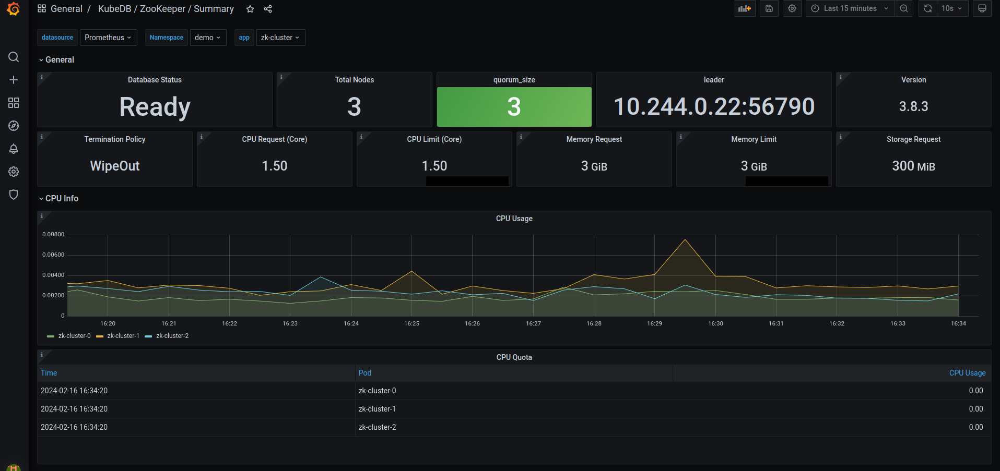
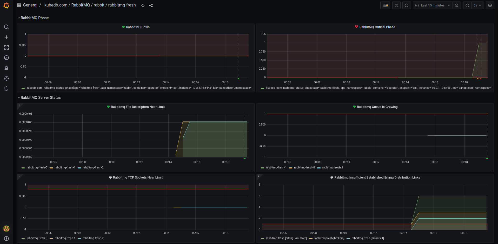
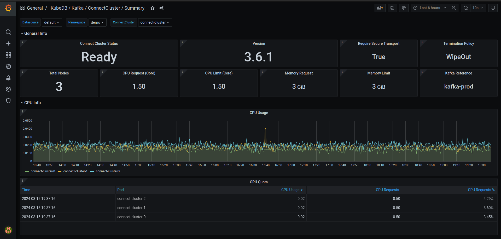
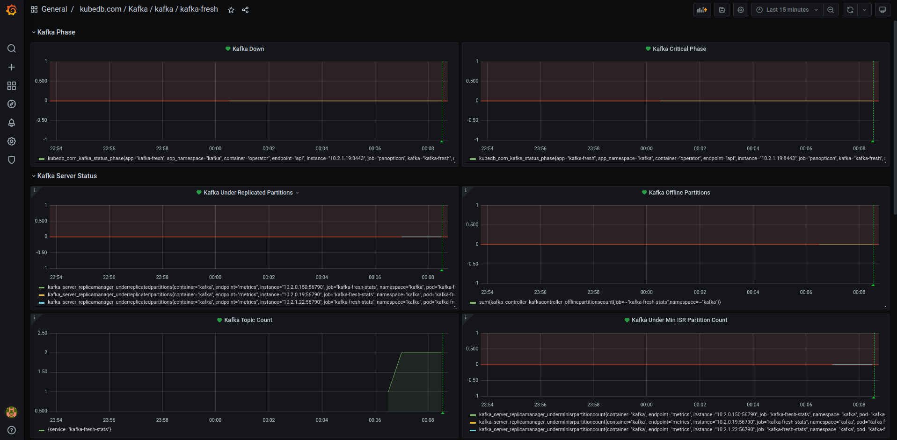
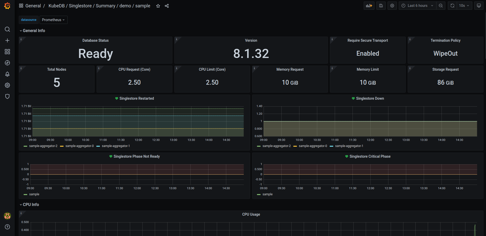
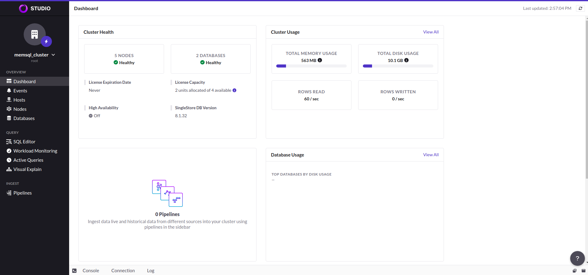
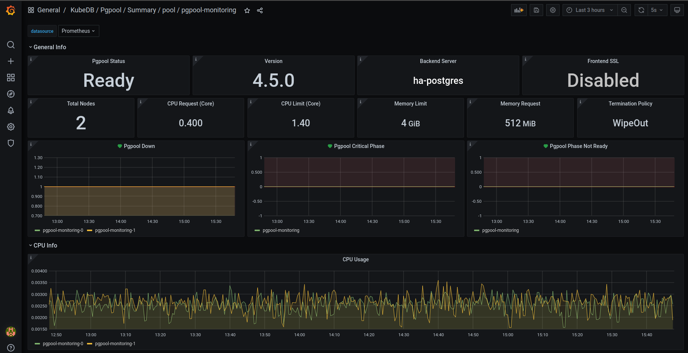

We are pleased to announce the release of [KubeDB v2024.3.16](https://kubedb.com/docs/v2024.3.16/setup/). This release is primarily focused on adding monitoring support for `Kafka`, `RabbitMQ`, `Zookeeper`, `SingleStore` and `Pgpool`. Besides monitoring support, some additional database versions and a few bug fixes are also coming out in this release. This release is bringing a major change which is replacing database `StatefulSet` workloads with `PetSet`. Initially, `RabbitMQ`, `Zookeeper`, `SingleStore`, `Druid`, `FerretDB` and `Pgpool` are receiving this update. Postgres is getting replication slot support through this release as well. We have also focused on updating some of the metrics exporter sidecar images resulting in less CVEs and more stability. MariaDB archiver and restic plugin support are launching with this release. Autoscaler support for Kafka cluster and SingleStore's support for backup & restore are making into this release as well. This post lists all the major changes done in this release since the last release. Find the detailed changelogs [HERE](https://github.com/kubedb/CHANGELOG/blob/master/releases/v2024.3.16/README.md). Let’s see the changes done in this release.


## PetSet (aka StatefulSet 2.0 !!)
We are pleased to introduce a unique feature for cloud-cost minimization. This PetSet feature is perfectly suitable for running database pods on different types of node pools (on-demand vs spot instances). You can think of it as a smart statefulSet.  To be more specific, let's assume a concrete example.

Let's say, you have a MongoDB sharded cluster, where the number of shards is 2. 5 replicas(1primary-3secondary-1arbiter) on each shard, 3 replicas in configServer & 4 replicas for mongos.  Also you have different types of node pool machines like m7.xlarge, c7g.medium, t3.micro etc. And all these machines can be of on-demand & spot instances. You want to use m7.large for shard nodes, c7g.medium for configServer nodes & t3.micro for mongos nodes. For each shard, one pod will go on-demand & rest of them to spot instances. For configServer, the majority will go on-demand, the rest of them to spot. And for mongos, majority in spots.


|        #        |   Shard    | ConfigServer | MongoS |
|:---------------:|:----------:|:------------:|:------:|
| Machine Profile | m7.xlarge  |  c7g.medium  | t3.micro  |
|  Replica Count  |    2 shard, 5 replicas on each     |     3 replicas      | 4 replicas  |
|  Distribution   |    1 in on-demand, rest in sports for each shard     |     Majority in on-demand, rest in spot      | Majority in spot, rest in -on-demand  |

Here is an example `NodePool` by karpenter :

```yaml
apiVersion: karpenter.sh/v1beta1
kind: NodePool
metadata:
  name: spot-mongos
spec:
  template:
    spec:
      requirements:
        - key: kubernetes.io/arch
          operator: In
          values: ["amd64"]
        - key: kubernetes.io/os
          operator: In
          values: ["linux"]
        - key: karpenter.sh/capacity-type
          operator: In
          values: ["spot"]
        - key: "topology.kubernetes.io/zone"
          operator: In
          values: ["us-west-2a", "us-west-2c", "us-west-2d"]
        - key: karpenter.k8s.aws/instance-category
          operator: In
          values: ["t"]
        - key: karpenter.k8s.aws/instance-generation
          operator: Gt
          values: ["2"]
      nodeClassRef:
        name: default
  limits:
    cpu: 1000
  disruption:
    consolidationPolicy: WhenUnderutilized
    expireAfter: 720h # 30 * 24h = 720h
```

And we have introduced two new things to achieve this kind of distribution: `PlacementPolicy` & `Petset`.

```yaml
apiVersion: apps.k8s.appscode.com/v1
kind: PlacementPolicy
metadata:
  name: majority-on-spot
spec:
  zoneSpreadConstraint:
    maxSkew: 1
    whenUnsatisfiable: ScheduleAnyway
  nodeSpreadConstraint:
    maxSkew: 1
    whenUnsatisfiable: DoNotSchedule
  affinity:
    nodeAffinity:
      - topologyKey: topology.kubernetes.io/zone
        whenUnsatisfiable: DoNotSchedule
        domains:
          - values:
              - us-west-2a
              - us-west-2c
              - us-west-2d
            replicas: "" # empty means rest of the replicas
        weight: 40
      - topologyKey: karpenter.sh/capacity-type
        whenUnsatisfiable: DoNotSchedule
        domains:
          - values: ["spot"]
            replicas: "obj.spec.replicas/2+1"
          - values: ["on-demand"]
            replicas: "" # empty means rest of the replicas
        weight: 70
```

In the above majority-on-spot `PlacemenPolicy`, We specify that only us-west-2a, us-west-2c, us-west-2d zones should be used. Also, OBJ.REPLICAS/2 +1 number of replicas should go to karpenter.sh/capacity-type:spot & others to karpenter.sh/capacity-type: on-demand.  All we need to do now is to refer this policy in the petset. 

```yaml
apiVersion: apps.k8s.appscode.com/v1
kind: PetSet
metadata:
  name: <mongos-petset-name>
  namespace:  <mongodb-namespace>
spec:
  … other fields …
  podPlacementPolicy:
    name: majority-on-spot
```


Please visit [this](https://github.com/kubedb/eks-demo), for more examples.


## Postgres
In this release we have introduced replication slot support for Postgres Database. Earlier, KubeDB operator will keep wal segments which will require manual intervention in case the stand-by replicas were disconnected for too long and primary has remove the old WAL files. With the ReplicationSlot approach, the primary will keep the wal segments until all the stand-by replicas have completed replication. Our replication slot support can tolerate failover. Below is a sample yaml that you need to use for using replication slot:

```yaml
apiVersion: kubedb.com/v1alpha2
kind: Postgres
metadata:
  name: bu-postgres
  namespace: demo
spec:
  replicas: 1
  storageType: Durable
  replication:
    walLimitPolicy: "ReplicationSlot"
    maxSlotWALKeepSize: -1
  terminationPolicy: WipeOut
  storage:
    storageClassName: "standard"
    accessModes:
    - ReadWriteOnce
    resources:
      requests:
        storage: 1Gi
  version: "16.1"

```
Here for walLimitPolicy, supported values are `WALKeepSegment`, `WALKeepSize`, `ReplicationSlot`.

If your used postgres major version is below `13`, then you’ll have to use:
```yaml
  replication:
    walLimitPolicy: "WALKeepSegment"
    walKeepSegment: 64
```

If your used postgres major version is more than `12`, then you can use either of them:

```yaml
  replication:
    walLimitPolicy: "WALKeepSize"
    walKeepSize: 1024
```

```yaml
  replication:
    walLimitPolicy: "ReplicationSlot"
    maxSlotWALKeepSize: -1
```

Note `walKeepSegment`, `walKeepSize`, `maxSlotWALKeepSize` resembles `wal_keep_segment`, `wal_keep_size` and `max_slot_wal_keep_size` of `postgresql.conf` file.


## Zookeeper

This release includes Grafana dashboards for easier monitoring of KubeDB managed ZooKeeper. The Grafana dashboard shows several ZooKeeper specific data, status and diagram of memory and cpu consumption. You can check the dashboard to see the overall health of your zookeeper servers easily. As usual KubeDB provided Grafana dashboards come in a bundle of three - Summary dashboard for overall monitoring of the database cluster, Database dashboard for database insights and Pod dashboard for monitoring database pods specifically. Here's a preview of the summary dashboard for Zookeeper.



A step-by-step guide to monitoring is given [here](https://github.com/appscode/grafana-dashboards/tree/master/zookeeper).
We have also added configurable alerting support for KubeDB ZooKeeper. You can configure Alertmanager to get notified when a metrics of zookeeper servers exceeds a given threshold.

To learn more, have a look [here]( https://github.com/appscode/alerts/tree/master/charts ).


## RabbitMQ

This release includes Grafana dashboards for easier monitoring of KubeDB managed RabbitMQ. The Grafana dashboards shows several RabbitMQ specific data, status and diagram of memory and cpu consumption. You can check the dashboard to see the overall health of your RabbitMQ servers easily. As usual KubeDB provided Grafana dashboards come in a bundle of three - Summary dashboard for overall monitoring of the database cluster, Database dashboard for database insights and Pod dashboard for monitoring database pods specifically.

A step-by-step guide to monitoring is given [here]( https://github.com/appscode/grafana-dashboards/tree/master/rabbitmq)
We have also added configurable alerting support for KubeDB RabbitMQ. You can configure Alertmanager to get notified when a metrics of RabbitMQ server exceeds a given threshold. Here's a preview of RabbitMQ alert dashboard. The dashboard shows an alert has been triggered for cluster being in critical state.



To learn more, have a look [here]( https://github.com/appscode/alerts/tree/master/charts )


## Kafka

This release includes Grafana dashboards for easier monitoring of KubeDB managed Kafka. The Grafana dashboard shows several Kafka broker and cluster specific data, status and diagram of memory and cpu consumption. You can check the dashboard to see the overall health of your Kafka brokers easily. As usual KubeDB provided Grafana dashboards come in a bundle of three - Summary dashboard for overall monitoring of the database cluster, Database dashboard for database insights and Pod dashboard for monitoring database pods specifically.

A step-by-step guide to monitoring is given [here]( https://github.com/appscode/grafana-dashboards/tree/master/kafka).

In this release, KubeDB is introducing support for Kafka Connect Cluster monitoring using Grafana dashboards. These dashboards give you clear visuals on how your clusters are doing, including things like connectors details, worker details, tasks details, performance metrics and resource usage. It is a simple way to make sure everything is running smoothly. Here's a sneak preview of the summary dashboard for connect cluster.



To get started with monitoring, we've prepared a step-by-step guide available [here](https://github.com/appscode/grafana-dashboards/tree/master/connectcluster).

We have also added configurable alerting support for KubeDB Kafka. You can configure Alertmanager to get notified when a metrics of kafka brokers exceeds a given threshold. Here's a preview of the alert dashboard on Grafana v7.5.5.



To learn more, have a look [here](https://github.com/appscode/alerts/tree/master/charts).

### Autoscaler

This release includes support for `KafkaAutoscaler`, a Kubernetes Custom Resource Definitions (CRD). It provides a declarative configuration for autoscaling `Kafka` compute resources and storage of database components in a Kubernetes native way. Let’s assume we have a KubeDB managed kafka cluster running in topology mode named `kafka-prod`. Here’s a sample yaml for autoscaling `Kafka` compute resources.

```yaml
apiVersion: autoscaling.kubedb.com/v1alpha1
kind: KafkaAutoscaler
metadata:
  name: kafka-compute-autoscaler
  namespace: demo
spec:
  databaseRef:
    name: kafka-prod
  compute:
    broker:
      trigger: "On"
      podLifeTimeThreshold: 5m
      minAllowed:
        cpu: 1
        memory: 2Gi
      maxAllowed:
        cpu: 2
        memory: 3Gi
      controlledResources: ["cpu", "memory"]
    controller:
      trigger: "On"
      podLifeTimeThreshold: 5m
      minAllowed:
        cpu: 1
        memory: 2Gi
      maxAllowed:
        cpu: 2
        memory: 3Gi
      controlledResources: ["cpu", "memory"]
```

#### New Version Supports
In this release, we have extended support to include two new versions each for both Kafka and Kafka Connect Cluster.
- `3.6.1`
- `3.5.2`

**Note**: We have deprecated versions `3.4.0` and `3.3.0` from this release. These versions are unstable and will not be maintained in the upcoming releases. We recommend using versions `3.4.1` and `3.3.2`.


## Singlestore

This release introduces an enhanced monitoring feature for KubeDB managed SingleStore deployments by integrating the Grafana dashboard. This dashboard offers comprehensive insights into various SingleStore-specific metrics, including data status and visualizations of memory and CPU consumption. With this dashboard, users can effortlessly assess the overall health and performance of their SingleStore clusters, enabling more informed decision-making and efficient management of resources. Here's a preview of the summary dashboard.



Here is the step-by-step [guideline](https://github.com/appscode/grafana-dashboards/tree/master/singlestore)
We have added configurable alerting support for KubeDB SingleStore. Users can configure Alertmanager to receive notifications when a metric of SingleStore exceeds a given threshold.

To learn more, have a look [here]( https://github.com/appscode/alerts/tree/master/charts )

### Backup and Restore

This release introduces support for comprehensive disaster recovery with Stash 2.0, also known as Kubestash. Kubestash, offered by AppsCode, provides a cloud-native backup and recovery solution for Kubernetes workloads, streamlining operations through its operator-driven approach. It facilitates the backup of volumes, databases, and custom workloads via addons, leveraging restic or Kubernetes CSI Driver VolumeSnapshotter functionality. For SingleStore, creating backups involves configuring resources like BackupStorage (for cloud storage backend), RetentionPolicy (for backup data retention settings), Secret (for storing restic password), BackupConfiguration (specifying backup task details), and RestoreSession(specifying restore task details).

### SingleStore Studio (UI)

This release also introduces integrated SingleStore Studio (UI) with SingleStore. To connect to SingleStore Studio need to hit `8081` port of the primary service for your database. Here's a preview of the Studio UI.



#### New Version Support
This release adds support for SingleStore `v8.5.7`.


## Pgpool
In this latest release, KubeDB now supports monitoring for Pgpool which includes Grafana dashboards tailored specifically for monitoring KubeDB managed Pgpool instances. These dashboards provide comprehensive insights into various Pgpool-specific metrics, statuses, as well as visual representations of memory and CPU consumption. 

To get started with monitoring, we've prepared a step-by-step guide available [here](https://github.com/appscode/grafana-dashboards/tree/master/pgpool).

Additionally, we've introduced configurable alerting support for KubeDB Pgpool. Now, you can easily set up alerts to receive notifications based on customizable alert rules. Here's a sneak preview fo the summary dashboard when alert is enabled.



For more details and to explore these new alert capabilities further, please visit [here](https://github.com/appscode/alerts/tree/master/charts).


## Redis

Redis metrics exporter images has been updated to the latest version `v1.58.0`. The latest version contains several CVE fixes.


## Elasticsearch

Metrics exporter images for Elasticsearch has been updated from `v1.3.0` to `v1.7.0`. The updated image contains less CVE and have a few bug fixes. These changes are applicable to both the elasticsearch versions with xpack plugins and OpenSearch.


## MariaDB

### Archiver

KubeDB now supports continuous archiving of a MariaDB database. This allows point-in-time recovery (PITR) of the database.

To use this feature, You need KubeStash installed in your cluster. KubeStash (aka Stash 2.0) is a ground up rewrite of Stash with various improvements. It works with any existing KubeDB or Stash license key. 

To use the continuous archiving feature, we have introduced a CRD on the KubeDB side, named `MariaDBArchiver`. Here are all the details of using `MariaDBArchiver` . In short, you need to create the following resources:

- **BackupStorage**: refers to a cloud storage backend (like `s3`, `gcs` etc.) you prefer.

- **RetentionPolicy**: allows you to set how long you’d like to retain the backup data.

- **Secrets**: hold the backend access credentials and a restic encryption password to encrypt the backup snapshots.

- **VolumeSnapshotClass**: holds the csi-driver information which is responsible for taking VolumeSnapshots. This is vendor specific.

- **MariaDBArchiver**: holds all of above metadata information.

Here is an example of MariaDB archiver CR:

```yaml
apiVersion: archiver.kubedb.com/v1alpha1
kind: MariaDBArchiver
metadata:
 name: mariadb-archiver
 namespace: demo
spec:
 databases:
   namespaces:
     from: Selector
     selector:
       matchLabels:
        kubernetes.io/metadata.name: demo
   selector:
     matchLabels:
       archiver: "true"
 retentionPolicy:
   name: mariadb-retention-policy
   namespace: demo
 encryptionSecret:
   name: encrypt-secret
   namespace: demo 
 fullBackup:
   driver: VolumeSnapshotter
   task:
     params:
       volumeSnapshotClassName: longhorn-vsc
   scheduler:
     successfulJobsHistoryLimit: 0
     failedJobsHistoryLimit: 0
     schedule: "30 3 * * *"
   sessionHistoryLimit: 1
 manifestBackup:
   scheduler:
     successfulJobsHistoryLimit: 0
     failedJobsHistoryLimit: 0
     schedule: "30 3 * * *"
   sessionHistoryLimit: 1
 backupStorage:
   ref:
     name: s3-storage
     namespace: demo
   subDir: test
```

Now After creating this archiver CR, if we create a MariaDB with `archiver: "true"` label, in the same namespace (as per the double-optin configured in `.spec.databases` field), The KubeDB operator will start doing the following tasks:

- Creates a BackupConfiguration named `<db-name>-backup`
- Starts syncing mariadb binlog files to the directory `<sub-directory>/<db-namespace>/<db-name>/binlog-backup`

When the BackupConfiguration is created KubeStash operator will start doing the following tasks:

- Creates two Repositories with convention `<db-name>-full` and `<db-name>-manifest`.

- Takes full backup every day at 3:30 (`.spec.fullBackup.scheduler`) to `<db-name>-full` repository and takes manifest backup every day at 3:30 (`.spec.manifestBackup.scheduler`) to `<db-name>-manifest` repository.

Here is an example of MariaDB CR with continuous archiving enabled:

```yaml
apiVersion: kubedb.com/v1alpha2
kind: MariaDB
metadata:
  name: mariadb
  namespace: demo
  labels:
    archiver: "true"
spec:
  archiver:
    ref:
      name: mariadb-archiver
      namespace: demo
  version: "11.2.2"
  podTemplate:
    spec:
      args:
      - "--log-bin"
      - "--log-slave-updates"
      - "--wsrep-gtid-mode=ON"
  replicas: 3
  ...
```

For point-in-time-recovery, all you need is to set the encryption secret, repository names and a `recoveryTimestamp` in  the `.spec.init.archiver` section of the MariaDB object.

Here is an example of MariaDB CR for point-in-time-recovery:

```yaml
apiVersion: kubedb.com/v1alpha2
kind: MariaDB
metadata:
  name: md-restore
  namespace: demo
spec:
  init:
    archiver:
      encryptionSecret:
        name: encrypt-secret
        namespace: demo
      fullDBRepository:
        name: mariadb-full
        namespace: demo
      manifestRepository:
        name: mariadb-manifest
        namespace: demo
      recoveryTimestamp: "2024-03-18T12:46:50Z" 
  version: "11.2.2" 
  podTemplate:
    spec:
      args:
      - "--log-bin"
      - "--log-slave-updates" 
      - "--wsrep-gtid-mode=ON"
  replicas: 3
  ...
```

### Restic Plugin
KubeDB now supports backup and restore MariaDB database using KubeStash.
Here are all the details of using MariaDB restic plugin . In short, you need to create the following resources to create backup of MariaDB database:

- **BackupStorage**: which refers a cloud storage backend (like `s3`, `gcs` etc.) you prefer.

- **RetentionPolicy**: allows you to set how long you’d like to retain the backup data.

- **Secrets**: hold the backend access credentials and a restic encryption password to encrypt the backup snapshots.

- **BackupConfiguration**: specifies the target database, backend, addon etc to use to backup the database.

- **RestoreSession**: specifies the target database, addon, datasource to use to restore the backed up data.

Here is an example of the BackupConfiguration:

```yaml
apiVersion: core.kubestash.com/v1alpha1
kind: BackupConfiguration
metadata:
  name: md-backup
  namespace: demo
spec:
  target:
    apiGroup: kubedb.com
    kind: MariaDB
    namespace: demo
    name: mariadb
  backends:
    - name: s3-backend
      storageRef:
        namespace: demo
        name: s3-storage
      retentionPolicy:
        name: sample-rp
        namespace: demo      
  sessions:
    - name: frequent
      scheduler:
        schedule: "*/5 * * * *"
      repositories:
        - name: s3-repo
          backend: s3-backend
          directory: /db/mariadb
          encryptionSecret:
           name: encrypt-secret
           namespace: demo
      addon:
        name: mariadb-addon
        tasks:
          - name: LogicalBackup
```

And here is an example of the RestoreSession:

```yaml
apiVersion: core.kubestash.com/v1alpha1
kind: RestoreSession
metadata:
  name: md-restore
  namespace: demo
spec:
  target:
    apiGroup: kubedb.com
    kind: MariaDB
    namespace: demo
    name: restored-mariadb
  dataSource:
    snapshot: latest
    repository: s3-repo
    encryptionSecret:
      name: encrypt-secret 
      namespace: demo
  addon:
    name: mariadb-addon
    tasks:
      - name: LogicalBackupRestore
```


## MongoDB
Improvements: We have added a sidecar container for mode-detection on each of the shard pods in MongoDB. The `replication-mode-detector` container will update `kubedb.com/role` label for shard pods. It can only have two values: `primary` & `standby`. This helps some external-applications to communicate with a specific-type of mongo pod if necessary.

## What Next?

Please try the latest release and give us your valuable feedback.

- If you want to install KubeDB, please follow the installation instruction from [KubeDB Setup](https://kubedb.com/docs/v2024.3.16/setup).

- If you want to upgrade KubeDB from a previous version, please follow the upgrade instruction from [KubeDB Upgrade](https://kubedb.com/docs/v2024.3.16/setup/upgrade/).


## Support

To speak with us, please leave a message on [our website](https://appscode.com/contact/).

To receive product announcements, follow us on [Twitter/X](https://twitter.com/KubeDB).

To watch tutorials of various Production-Grade Kubernetes Tools Subscribe our [YouTube](https://youtube.com/@appscode) channel.

Learn More about [Production-Grade Databases in Kubernetes](https://kubedb.com/)

If you have found a bug with KubeDB or want to request for new features, please [file an issue](https://github.com/kubedb/project/issues/new).
