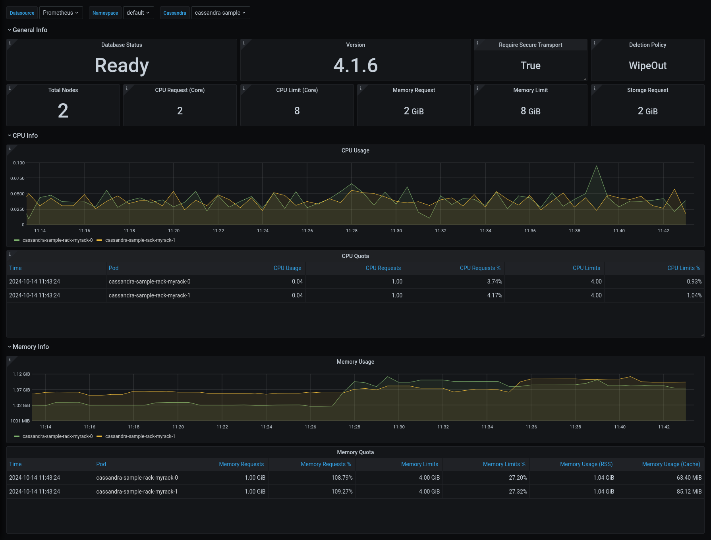

We are thrilled to announce the release of **KubeDB v2024.11.18**. This release introduces several key features, including:

- **TLS/SSL Support**: TLS/SSL support has been implemented for both Druid and Memcached, significantly improving security by enabling encrypted communication.

- **OpsRequest Support**: Enhanced operational request capabilities for Druid, Memcached, Microsoft SQL Server, and Solr, providing greater management flexibility.

- **Rotate Auth**: A new Ops Request named `RotateAuth` has been introduced. This feature enables users to rotate the credentials of the database enhancing overall security. It is initially added for `Druid`, `Kafka`, `MongoDB`, `Postgres`, and `Solr`.

- **Autoscaling**: Added autoscaling support for Apache Solr to automatically adjust resources based on workload demands.

- **Authentication**: Authentication support has been introduced for Memcached, providing an additional layer of security by verifying client identities before granting access.

- **New Version Support**: Added support for Druid version `30.0.1`.

- **Performance Improvement**: This release brings enhancements to controller performance, ensuring more efficient and faster operations.

For detailed changelogs, please refer to the [CHANGELOG](https://github.com/kubedb/CHANGELOG/blob/master/releases/v2024.11.18/README.md). You can now explore the detailed features and updates included in this release.

## Cassandra

### Monitoring

This release introduces an enhanced monitoring feature for KubeDB-managed Cassandra deployments by integrating Grafana dashboards. These dashboards provide comprehensive insights into various Cassandra-specific metrics, statuses, as well as visual representations of memory and CPU consumption. With this dashboard, users can effortlessly assess the overall health and performance of Cassandra, enabling more informed decision-making and efficient resource management.

Have a look [here](https://github.com/ops-center/grafana-dashboards/tree/master/cassandra)  for a step-by-step guide on using the monitoring feature of Apache Cassandra.

Here’s a preview of the Summary dashboard for Cassandra:



## Druid

### TLS/SSL Support

In this release, we are introducing **TLS support for Apache Druid**. By implementing TLS support, Druid enhances the security of client-to-server communication within the cluster environment.

With TLS enabled, client applications can securely connect to the Druid cluster, ensuring that data transmitted between clients and servers remains encrypted and protected from unauthorized access or tampering. This encryption adds an extra layer of security, particularly important for sensitive data environments where confidentiality and integrity are paramount.

In addition to securing client-to-server communication, **internal communication** between Druid nodes is also encrypted. Furthermore, **connections to external dependencies**, such as metadata storage and deep storage systems, are secured.

To configure TLS/SSL in Druid, KubeDB utilizes cert-manager to issue certificates. Before proceeding with TLS configuration in Druid, ensure that cert-manager is installed in your cluster. You can follow the steps provided [here](https://cert-manager.io/docs/installation/kubectl/) to install cert-manager in your cluster.

To issue a certificate, cert-manager employs the following Custom Resource (CR):
**Issuer/ClusterIssuer**: Issuers and ClusterIssuers represent certificate authorities (CAs) capable of generating signed certificates by honoring certificate signing requests. All cert-manager certificates require a referenced issuer that is in a ready condition to attempt to fulfill the request. Further details can be found [here](https://cert-manager.io/docs/concepts/issuer/).

**Certificate**: cert-manager introduces the concept of Certificates, which define the desired x509 certificate to be renewed and maintained up to date. More details on Certificates can be found [here](https://cert-manager.io/docs/usage/certificate/).

Druid `CRD` Specifications:

```yaml
apiVersion: kubedb.com/v1alpha2
kind: Druid
metadata:
  name: druid-cluster-tls
  namespace: demo
spec:
  version: 30.0.1
  enableSSL: true
  tls:
    issuerRef:
      apiGroup: "cert-manager.io"
      kind: Issuer
      name: druid-ca-issuer
  deepStorage:
    type: s3
    configSecret:
      name: deep-storage-config
  topology:
    routers:
      replicas: 1
  deletionPolicy: Delete
```

### Druid Ops-Requests

We are introducing four new Ops-Requests for `Druid` i.e. `HorizontalScaling`, `Reconfigure`, `UpdateVersion`, `ReconfigreTLS`, `RotateAuth`. You can find the example manifests files to perform these operations on a druid cluster below.

**HorizontalScaling**

```yaml
apiVersion: ops.kubedb.com/v1alpha1
kind: DruidOpsRequest
metadata:
    name: druid-hscale-up
    namespace: demo
spec:
    type: HorizontalScaling
    databaseRef:
        name: druid-cluster
    horizontalScaling:
        topology:
            coordinators: 2
            historicals: 2
```

**UpdateVersion**

```yaml
apiVersion: ops.kubedb.com/v1alpha1
kind: DruidOpsRequest
metadata:
    name: druid-update-version
    namespace: demo
spec:
    type: UpdateVersion
    databaseRef:
        name: druid-cluster
    updateVersion:
        targetVersion: 30.0.1
    timeout: 5m
    apply: IfReady
```

**Reconfigure**

```
apiVersion: ops.kubedb.com/v1alpha1
kind: DruidOpsRequest
metadata:
  name: reconfigure-drops
  namespace: demo
spec:
  type: Reconfigure
  databaseRef:
    name: druid-cluster
  configuration:
    configSecret:
      name: new-config
```
Here, `new-config` is the name of the new custom configuration secret.

**ReconfigureTLS**

```yaml
apiVersion: ops.kubedb.com/v1alpha1
kind: DruidOpsRequest
metadata:
  name: drops-add-tls
  namespace: demo
spec:
  type: ReconfigureTLS
  databaseRef:
    name: druid-cluster
  tls:
    issuerRef:
      name: druid-ca-issuer
      kind: Issuer
      apiGroup: "cert-manager.io"
    certificates:
      - alias: client
        subject:
          organizations:
            - druid
          organizationalUnits:
            - client
  timeout: 5m
  apply: IfReady
```

This is an example showing how to add TLS to an existing druid cluster. Reconfigure-TLS also supports features like **Removing TLS**, **Rotating Certificates** or **Changing Issuer**.

**RotateAuth**
```yaml
apiVersion: ops.kubedb.com/v1alpha1
kind: DruidOpsRequest
metadata:
  name: druid-auth-rotate
  namespace: demo
spec:
  type: RotateAuth
  databaseRef:
    name: druid-cluster
```
It is also possible to provide a username and password through a custom authentication section through `spec.authentication.secretRef.name` of `DruidOpsRequest`.

### New Version Support

Support for Druid Version `30.0.1` has been added in this release and `30.0.0` is marked as deprecated.


## Elasticsearch

## FerretDB

## Kafka

In this release, we have introduced a new ops request type `RotateAuth`. This request type is used to rotate the authentication secret for kafka. `.spec.authSecret.name` is the referenced name of the secret that contains the authentication information for kafka to authenticate with the brokers. The secret should be of type `kubernetes.io/basic-auth`.
Now, If a user wants to update the authentication credentials for kafka, they can create an ops request of type `RotateAuth` with or without referencing an authentication secret.

If the secret is not referenced, the ops-manager operator will create a new credential and update the current secret. Here is the yaml,
```yaml
apiVersion: ops.kubedb.com/v1alpha1
kind: KafkaOpsRequest
metadata:
  name: kfops-rotate-auth
  namespace: demo
spec:
  type: RotateAuth
  databaseRef:
    name: kafka-prod
  ```
If the secret is referenced, the operator will update the .spec.authSecret.name` with the new secret name. Here is the yaml,

New Secret:
```yaml
apiVersion: v1
data:
  password: enBzY3VscXl2Z3ZhcXZ4ZQ==
  username: c3VwZXI=
kind: Secret
metadata:
   name: kafka-prod-new-auth
   namespace: demo
type: kubernetes.io/basic-auth
```

```yaml
apiVersion: ops.kubedb.com/v1alpha1
kind: KafkaOpsRequest
metadata:
  name: kfops-rotate-auth
  namespace: demo
spec:
  type: RotateAuth
  databaseRef:
    name: kafka-prod
  secretRef:
    name: kafka-prod-new-auth
  ```

Finally, the operator will update the kafka cluster with the new credential and the old credentials will be stored in the secret with keys `username.prev` and `password.prev`.

We have added a field `.spec.authSecret.activeFrom` to the db yaml which refers to the timestamp of the credential is active from.

## Memcached

### Authentication

In this release, we are adding `Memcached` authentication support. Before we were connecting to the `Memcached` database without any authentication. From now, we will need username and password to connect with the `Memcached` database. Users can set username and password using a secret or we will create a default one. The Yaml will be like bellow:

```yaml

apiVersion: v1
kind: Secret
metadata:
  name: mc-auth
  namespace: demo
type: Opaque
data:
  authData: YWxpY2U6Ym9iCg==
```

And the `Memcached` Yaml will be look like this one:

```yaml

apiVersion: kubedb.com/v1
kind: Memcached
metadata:
  name: memcd-quickstart
  namespace: demo
spec:
  replicas: 1
  version: "1.6.22"
  authSecret:
    name: mc-auth
  deletionPolicy: WipeOut

```

### TLS/SSL Support

In this release, we introduce TLS support for `Memcached`. By implementing TLS support, `Memcached` enhances the security of client-to-server communication within the environment.

With TLS enabled, client applications can securely connect to the `Memcached` database, ensuring that data transmitted between clients and servers remains encrypted and protected from unauthorized access or tampering. This encryption adds an extra layer of security, particularly important for sensitive data environments where confidentiality and integrity are paramount.

To configure TLS/SSL in `Memcached`, KubeDB utilizes cert-manager to issue certificates. Before proceeding with TLS configuration in `Memcached`, ensure that cert-manager is installed in your cluster. You can follow the steps provided here to install cert-manager in your cluster.

To issue a certificate, cert-manager employs the following Custom Resource (CR):

**Issuer/ClusterIssuer**: Issuers and ClusterIssuers represent certificate authorities (CAs) capable of generating signed certificates by honoring certificate signing requests. All cert-manager certificates require a referenced issuer that is in a ready condition to attempt to fulfill the request. Further details can be found here.

**Certificate**: cert-manager introduces the concept of Certificates, which define the desired x509 certificate to be renewed and maintained up to date. More details on Certificates can be found here.

`Memcached` CRD Specifications:

```yaml

apiVersion: kubedb.com/v1
kind: Memcached
metadata:
  name: memcd-quickstart
  namespace: demo
spec:
  replicas: 1
  version: "1.6.22"
  tls:
    issuerRef:
      apiGroup: "cert-manager.io"
      kind: Issuer
      name: memcached-ca-issuer
    certificates:
      - alias: client
        ipAddresses:
          - 127.0.0.1
          - 192.168.0.252
  deletionPolicy: WipeOut

```

### Ops-Requests

We are introducing new Ops-Requests for `Memcached` which is Reconfigure TLS. You can find the example manifest file to perform the ops-request operation on `Memcached` below:

**Reconfigure TLS**

By using Reconfigure TLS Ops-Request, we can add TLS to an existing `Memcached` which is configured without TLS, can remove TLS configuration on existing `Memcached` which is configured with TLS, can rotate the certificates, can change the issuer. The Yaml will be like:

```yaml

apiVersion: ops.kubedb.com/v1alpha1
kind: MemcachedOpsRequest
metadata:
  name: mc-add-tls
  namespace: demo
spec:
  type: ReconfigureTLS
  databaseRef:
    name: memcd-quickstart
  tls:
    issuerRef:
      name: memcached-ca-issuer
      kind: Issuer
      apiGroup: "cert-manager.io"
    certificates:
      - alias: client
        subject:
          organizations:
            - memcached
          organizationalUnits:
            - client
```
This is an example showing how to add TLS to an existing `Memcached` database. Reconfigure-TLS also supports features like Removing TLS, Rotating Certificates or Changing Issuer.


## Microsoft SQL Server

### Ops-Requests: Reconfigure and Reconfigure-TLS

We are excited to introduce two new Ops-Requests for managing Microsoft SQL Server configurations in Kubernetes: **Reconfigure**, and **Reconfigure TLS**. These allow you to easily modify SQL Server settings and TLS configurations for enhanced flexibility and security. Below, you’ll find examples demonstrating how to use these new features.

**Reconfigure Ops-Request**

The `Reconfigure` operation enables you to update the configuration of an existing SQL Server cluster. This can be achieved using a custom configuration secret or by specifying configurations directly in the manifest.
Example 1: Using a Custom Configuration Secret

```yaml
apiVersion: ops.kubedb.com/v1alpha1
kind: MSSQLServerOpsRequest
metadata:
  name: msops-reconfigure
  namespace: demo
spec:
  type: Reconfigure
  databaseRef:
    name: mssqlserver-cluster
  configuration:
    configSecret:
      name: new-custom-config # Reference to the custom configuration secret
  timeout: 5m
  apply: IfReady # Apply only if the database is ready
```

Here, `new-custom-config` refers to the name of the custom configuration secret containing your desired SQL Server settings.

Example 2: Applying Inline Configuration

You can reconfigure using applyConfig like this:
```yaml
apiVersion: ops.kubedb.com/v1alpha1
kind: MSSQLServerOpsRequest
metadata:
  name: msops-reconfigure-apply
  namespace: demo
spec:
  type: Reconfigure
  databaseRef:
    name: mssqlserver-cluster
  configuration:
    applyConfig:
      mssql.conf: |-
        [memory]
        memorylimitmb = 3072
  timeout: 5m
  apply: IfReady
```

In this example, the `applyConfig` field is used to specify the new configuration for the `mssql.conf` file directly in the Ops-Request manifest.

**Reconfigure-TLS Ops-Request**

The Reconfigure-TLS operation allows you to add, remove, or modify TLS configurations for an existing SQL Server cluster. It also supports advanced use cases like **rotating certificates** or **changing the certificate issuer**.

Example 1: Adding TLS to a Cluster

```yaml
apiVersion: ops.kubedb.com/v1alpha1
kind: MSSQLServerOpsRequest
metadata:
  name: msops-add-tls
  namespace: demo
spec:
  type: ReconfigureTLS
  databaseRef:
    name: mssql-cluster
  tls:
    issuerRef:
      name: mssqlserver-ca-issuer # Name of the cert-manager issuer
      kind: Issuer # Issuer type (Issuer or ClusterIssuer)
      apiGroup: "cert-manager.io"
    certificates:
      - alias: client
        subject:
          organizations:
            - mssqlserver
          organizationalUnits:
            - client
    clientTLS: true # Enable client TLS
  timeout: 5m
  apply: IfReady
```

This example demonstrates how to add TLS to an existing SQL Server cluster using certificates issued by `mssqlserver-ca-issuer`.

Other Supported TLS Actions:

**Remove TLS**: Disable TLS for the SQL Server cluster.

tls Spec:
```yaml
tls:
  remove: true # Remove existing TLS configuration
```

**Rotate Certificates**: Rotate the TLS certificates used by the SQL Server cluster.

tls Spec:
```yaml
tls:
  rotateCertificates: true # Trigger certificate rotation
```

**Change the Certificate Issuer**: Update the issuer of the TLS certificate to a new one.

tls Spec:
```yaml
tls:
  issuerRef:
    name: mssqlserver-new-ca-issuer # New cert-manager issuer name
    kind: Issuer # Issuer type (Issuer or ClusterIssuer)
    apiGroup: "cert-manager.io" 
```


### Updates for MSSQLServer CRD

**Removed Fields**:

- `spec.internalAuth`: The `spec.internalAuth` section has been removed. TLS/SSL configurations for internal endpoint authentication of SQL Server Availability Group replicas should now be defined under `spec.tls`.

**Updated Fields**:

- Leader Election Configuration:
  - The field `spec.leaderElection` is now moved under `spec.topology.availabilityGroup.leaderElection`.

Below is the updated structure reflecting these changes:
```yaml
tls:
  issuerRef:
    apiGroup: cert-manager.io
    kind: Issuer
    name: mssqlserver-ca-issuer
  certificates:
    - alias: server
      emailAddresses:
        - dev@appscode.com
      secretName: mssqlserver-server-cert
      subject:
        organizationalUnits:
          - server
        organizations:
          - kubedb
    - alias: client
      emailAddresses:
        - abc@appscode.com
      secretName: mssqlserver-client-cert
      subject:
        organizationalUnits:
          - client
        organizations:
          - kubedb
    - alias: endpoint
      secretName: mssqlserver-endpoint-cert
      subject:
        organizationalUnits:
          - endpoint
        organizations:
          - kubedb
  clientTLS: true
topology:
  availabilityGroup:
    databases:
      - agdb1
      - agdb2
    leaderElection:
      electionTick: 10
      heartbeatTick: 1
      period: 300ms
      transferLeadershipInterval: 1s
      transferLeadershipTimeout: 1m0s
  mode: AvailabilityGroup
```

**Additional Notes:**
- Use `spec.tls` to configure all TLS/SSL-related settings, including endpoint authentication for Availability Group replicas.
- For leader election, adjust parameters under `spec.topology.availabilityGroup.leaderElection` as needed.

### Configuring MSSQL Environment Variables

When deploying `Microsoft SQL Server` on Linux containers, environment variables are used to configure various settings, including the product edition.

You have to specify the SQL Server product edition using the `MSSQL_PID` environment variable. The acceptable values for `MSSQL_PID` are:

- `Developer`: Uses the Developer Edition (default if no MSSQL_PID is specified).
- `Express`: Uses the Express Edition.
- `Standard`: Uses the Standard Edition.
- `Enterprise`: Uses the Enterprise Edition.
- `EnterpriseCore`: Uses the Enterprise Edition Core.
- `<valid product id>`: Uses the edition associated with the specified product ID.

- In addition, the `ACCEPT_EULA` environment variable is required to confirm your acceptance of the [End-User Licensing Agreement](https://go.microsoft.com/fwlink/?linkid=857698). It must be set to "Y" to allow the SQL Server container to run.

**Example YAML Configuration**:

Here’s an example of how to configure the `MSSQL_PID` and `ACCEPT_EULA` environment variables in the KubeDB MSSQLServer CRD:
```yaml
metadata:
  name: mssqlserver
  namespace: demo
spec:
  podTemplate:
    spec:
      containers:
      - name: mssql
        env:
        - name: ACCEPT_EULA
          value: "Y"
        - name: MSSQL_PID
          value: Enterprise
```

In this example, the SQL Server container will run the **Enterprise Edition** of SQL Server.

For a complete list of environment variables and their usage, refer to the [official Microsoft documentation](https://learn.microsoft.com/en-us/sql/linux/sql-server-linux-configure-environment-variables?view=sql-server-2017).


## MongoDB

## PgBouncer

## Postgres
In this release we improved the postgres point time recovery to support seamless archiving and recovery with db pods spread out in different zones in a single region. We also improved our algorithm to calculate and find the suitable base backup for PITR.

We also fixed a bug which wasn’t letting users use postgres `warm` standby mode via `db.spec.standbyMode`. Now if your `db.spec.standbyMode` is set to `warm`, then your db replicas will behave like warm standby which is it will only be used to store data, not open for read queries. If you want to send your read queries to your replicas, make sure you put `db.spec.standbyMode: Hot` which is set by default from this release.

In this release, we also have introduced a new ops request type `RotateAuth`. This request type is used to rotate the authentication secret for Postgres. `.spec.authSecret.name` is the referenced name of the secret that contains the authentication information for postgres. The secret should be of type `kubernetes.io/basic-auth`.
Now, If a user wants to update the authentication credentials for postgres, they can create an ops request of type `RotateAuth` with or without referencing an authentication secret.

If the secret is not referenced, the ops-manager operator will create a new credential and update the current secret. Here is the yaml,
```yaml
apiVersion: ops.kubedb.com/v1alpha1
kind: PostgresOpsRequest
metadata:
  name: pgops-rotate-auth
  namespace: demo
spec:
  type: RotateAuth
  databaseRef:
    name: ha-postgres
```

If the secret is referenced, the operator will update the .spec.authSecret.name` with the new secret name. Here is the yaml,
New Secret:
```yaml
apiVersion: v1
data:
  password: ZC4hTC5KX0kuckMpN04pSQ==
  username: cG9zdGdyZXM=
kind: Secret
metadata:
   name: ha-postgres-new-auth
   namespace: demo
type: kubernetes.io/basic-auth
```

```yaml
apiVersion: ops.kubedb.com/v1alpha1
kind: PostgresOpsRequest
metadata:
  name: pgops-rotate-with-new-auth
  namespace: demo
spec:
  type: RotateAuth
  databaseRef:
    name: ha-postgres
  secretRef:
    name: ha-postgres-new-auth
  ```

Finally, the operator will update the postgres cluster with the new credential and the old credentials will be stored in the secret with keys `username.prev` and `password.prev`.

We have added a field `.spec.authSecret.activeFrom` to the db yaml which refers to the timestamp of the credential is active from.


## SingleStore

## Solr

Solr autoscaler support has been added in this release. Kubedb autoscaler leverages the automation of  storage and memory autoscaling with the help of metrics configuration and prometheus.

***Solr Combined Mode***:
```yaml
apiVersion: kubedb.com/v1alpha2
kind: Solr
metadata:
  name: solr-combined
  namespace: demo
spec:
  version: 9.6.1
  replicas: 2
  zookeeperRef:
    name: zoo
    namespace: demo
  storage:
    accessModes:
      - ReadWriteOnce
    resources:
      requests:
        storage: 1Gi
    storageClassName: longhorn
```

***Solr Cluster Mode***:
```yaml
apiVersion: kubedb.com/v1alpha2
kind: Solr
metadata:
  name: solr-cluster
  namespace: demo
spec:
  version: 9.4.1
  enableSSL: true
  zookeeperRef:
    name: zoo
  topology:
    overseer:
      replicas: 1
      storage:
        storageClassName: longhorn
        accessModes:
          - ReadWriteOnce
        resources:
          requests:
            storage: 1Gi
    data:
      replicas: 1
      storage:
        storageClassName: longhorn
        accessModes:
          - ReadWriteOnce
        resources:
          requests:
            storage: 1Gi
    coordinator:
      storage:
        storageClassName: longhorn
        accessModes:
          - ReadWriteOnce
        resources:
          requests:
            storage: 1Gi
```

***Computer autoscaler***:
Computer autoscaler deals with scaling cpu and memory and we need metrics configuration in our cluster for this operation.

For combined cluster:
```yaml
apiVersion: autoscaling.kubedb.com/v1alpha1
kind: SolrAutoscaler
metadata:
  name: sl-node-autoscaler
  namespace: demo
spec:
  databaseRef:
    name: solr-combined
  opsRequestOptions:
    timeout: 5m
    apply: IfReady
  compute:
    node:
      trigger: "On"
      podLifeTimeThreshold: 5m
      resourceDiffPercentage: 5
      minAllowed:
        cpu: 1
        memory: 2Gi
      maxAllowed:
        cpu: 2
        memory: 3Gi
      controlledResources: ["cpu", "memory"]
      containerControlledValues: "RequestsAndLimits"
```

For dedicated cluster:
```yaml
apiVersion: autoscaling.kubedb.com/v1alpha1
kind: SolrAutoscaler
metadata:
  name: sl-data-autoscaler
  namespace: demo
spec:
  databaseRef:
    name: solr-cluster
  opsRequestOptions:
    timeout: 5m
    apply: IfReady
  compute:
    data:
      trigger: "On"
      podLifeTimeThreshold: 5m
      resourceDiffPercentage: 5
      minAllowed:
        cpu: 1
        memory: 2.5Gi
      maxAllowed:
        cpu: 2
        memory: 3Gi
      controlledResources: ["cpu", "memory"]
      containerControlledValues: "RequestsAndLimits"
    overseer:
      trigger: "On"
      podLifeTimeThreshold: 5m
      resourceDiffPercentage: 5
      minAllowed:
        cpu: 1
        memory: 2.5Gi
      maxAllowed:
        cpu: 2
        memory: 3Gi
      controlledResources: ["cpu", "memory"]
      containerControlledValues: "RequestsAndLimits"
    coordinator:
      trigger: "On"
      podLifeTimeThreshold: 5m
      resourceDiffPercentage: 5
      minAllowed:
        cpu: 1
        memory: 2.5Gi
      maxAllowed:
        cpu: 2
        memory: 3Gi
      controlledResources: ["cpu", "memory"]
      containerControlledValues: "RequestsAndLimits"
```

***Storage Autoscaler***:
Storage autoscaler deal with scaling pvc storage with the help of prometheus. So, we need prometheus in the cluster for this operation

For combined cluster:
```yaml
apiVersion: autoscaling.kubedb.com/v1alpha1
kind: SolrAutoscaler
metadata:
  name: sl-storage-autoscaler-combined
  namespace: demo
spec:
  databaseRef:
    name: solr-combined
  storage:
    node:
      expansionMode: "Offline"
      trigger: "On"
      usageThreshold: 10
      scalingThreshold: 100
```

For dedicated cluster:
```yaml
apiVersion: autoscaling.kubedb.com/v1alpha1
kind: SolrAutoscaler
metadata:
  name: sl-storage-autoscaler-topology
  namespace: demo
spec:
  databaseRef:
    name: solr-cluster
  storage:
    data:
      expansionMode: "Offline"
      trigger: "On"
      usageThreshold: 60
      scalingThreshold: 100
    overseer:
      expansionMode: "Offline"
      trigger: "On"
      usageThreshold: 60
      scalingThreshold: 100
```

***RotateAuth OpsRequest***:
We have also added support for RotateAuth ops request for `Solr` in this release. It will rotate the admin credential of solr. We can provide secret name in the spec.authentication.secretRef.name and ops manager with update the credential of database.
If we don’t provide any secret anime the password of the current secret will be updated.

Solr RotateAuth OpsRequest:

```yaml
apiVersion: ops.kubedb.com/v1alpha1
kind: SolrOpsRequest
metadata:
  name: roatate-solr
  namespace: demo
spec:
  databaseRef:
    name: solr-cluster
  type: RotateAuth
  authentication:
    secretRef:
      name: new-auth
```


## ZooKeeper

## Support

To speak with us, please leave a message on [our website](https://appscode.com/contact/).

To receive product announcements, follow us on [Twitter/X](https://x.com/KubeDB).

To watch tutorials of various Production-Grade Kubernetes Tools Subscribe our [YouTube](https://www.youtube.com/c/AppsCodeInc/) channel.

Learn More about [Production-Grade Databases in Kubernetes](https://kubedb.com/)

If you have found a bug with KubeDB or want to request for new features, please [file an issue](https://github.com/kubedb/project/issues/new).