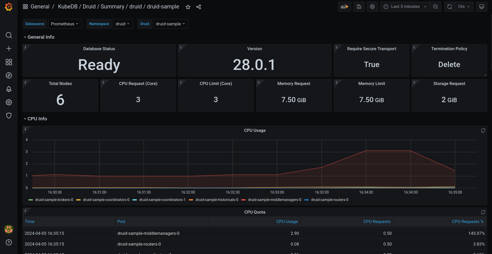

We are pleased to announce the release of [KubeDB v2024.4.27](https://kubedb.com/docs/v2024.4.27/setup/). This release includes features like TLS support for SingleStore & PgPool; Monitoring & Alerting Support for Druid & Solr using Prometheus and Grafana; PDB support for Kafka, Kafka Connect Cluster and RabbitMQ; Microsoft SQL Server Provisioning; Backup and Restore support for ZooKeeper using KubeStash; OpsRequest and Autoscaler support for RabbitMQ; New version supports for MongoDB; Health Checker improvement for Memcached; and Grafana dashboard enhancement for Postgres. This post lists all the major changes done in this release since the last release. Find the detailed changelogs [HERE](https://github.com/kubedb/CHANGELOG/blob/master/releases/v2024.4.27/README.md). Let’s see the changes done in this release.

## Druid

This release introduces an enhanced monitoring feature for KubeDB-managed Druid deployments by integrating Grafana dashboards. These dashboards provide comprehensive insights into various Druid-specific metrics, statuses, as well as visual representations of memory and CPU consumption. With this dashboard, users can effortlessly assess the overall health and performance of their Druid clusters, enabling more informed decision-making and efficient management of resources.

[Here](https://github.com/appscode/grafana-dashboards/tree/master/druid) is the step-by-step guideline

Here's a preview of the Summary dashboard for Druid.



Additionally, we have added configurable Alerting support for KubeDB Druid. Users can configure Alertmanager to receive notifications when a metric of Druid exceeds a given threshold.

To learn more, have a look [here](https://github.com/appscode/alerts/tree/master/charts)

## Kafka

`Pod Disruption Budget (PDB)` support has been added for Kafka. A PDB limits the number of Pods of a replicated application that can be down simultaneously from voluntary disruptions. For example, a quorum-based application like Kafka would like to ensure that the number of replicas running is never brought below the number needed for a KRaft quorum.

### Kafka-Connect
Support for `JDBC Connector (Source and Sink)` have been added for KubeDB managed Kafka connect clusters. This connector will allow you to exchange data between relational databases and Kafka. The JDBC source connector allows you to import data from any relational database with a JDBC driver into Kafka topics. `Pod Disruption Budget (PDB)` support also has been added for Kafka Connect.

## Microsoft SQL Server

We are thrilled to announce that KubeDB now extends its support to `Microsoft SQL Server`, one of the most popular relational database management systems (RDBMS) in the world. With this addition, KubeDB users can now seamlessly provision and manage SQL Server instances directly within their Kubernetes clusters. Besides provisioning, customizable health checker, custom template for pods & containers, authentication, multiple termination strategies, default container security etc. are included.

This release includes support for `Provisioning SQL Server Availability Group` and `Standalone SQL Server` instance
Utilize SQL Server's high availability features by deploying instances in availability group mode. KubeDB leverages the `Raft Consensus Algorithm for cluster coordination`, enabling automatic leader election and failover decisions. `Quorum support` ensures the reliability and fault tolerance of your SQL Server deployments.

You can also Deploy SQL Server instances in standalone mode for simple, single-node configurations. Here's a sample YAML to provision one. 

```yaml
apiVersion: kubedb.com/v1alpha2
kind: MSSQLServer
metadata:
  name: sqlserver-standalone
  namespace: sample
spec:
  version: "2022-cu12"
  replicas: 1
  storageType: Durable
  storage:
    storageClassName: "standard"
    accessModes:
    - ReadWriteOnce
    resources:
      requests:
        storage: 1Gi
  terminationPolicy: Delete
```

Here’s a sample YAML to provision the Availability Group cluster. To generate the certificate used for internal endpoint authentication of availability group replicas, an Issuer named `mssqlserver-ca-issuer` need to be created prior to deploying the following manifest.

```yaml
apiVersion: kubedb.com/v1alpha2
kind: MSSQLServer
metadata:
  name: sqlserver-ag
  namespace: demo
spec:
  version: "2022-cu12"
  replicas: 3
  topology:
    mode: AvailabilityGroup
    availabilityGroup:
      databases:
        - AgDB1
        - AgDB2
  internalAuth:
    endpointCert:
      issuerRef:
        apiGroup: cert-manager.io
        name: mssqlserver-ca-issuer
        kind: Issuer
  storageType: Durable
  storage:
    storageClassName: "standard"
    accessModes:
    - ReadWriteOnce
    resources:
      requests:
        storage: 1Gi
  terminationPolicy: Delete
```

#### supported versions:
`2022-CU12-ubuntu-22.04`

## MongoDB

- KubeDB support for two new MongoDB versions `5.0.26` & `7.0.8` have been introduced in this release.

- Bug fix on updating the RestoreSession status: After a failed restore process with KubeStash Restic support, the RestoreSession status was not updated correctly. That has been fixed in this release.

- Improvement in MongoDB Go-client. Added new authentication support for specific users and specific databases.

## Memcached

Health Check has been updated which will ensure that the database is healthy. This will continuously check the database connection and the capability of `read-write operation` in the database.


## Pgpool

In this release, we are having `TLS support for Pgpool`. To configure TLS/SSL in Pgpool, KubeDB uses cert-manager to issue certificates. So, first you have to make sure that the cluster has cert-manager installed. To install cert-manager in your cluster following steps [here](https://cert-manager.io/docs/installation/kubernetes/).

To issue a certificate, the following cr of cert-manager is used:

`Issuer/ClusterIssuer`: Issuers and ClusterIssuers represent certificate authorities (CAs) that are able to generate signed certificates by honoring certificate signing requests. All cert-manager certificates require a referenced issuer that is in a ready condition to attempt to honor the request. You can learn more details [here](https://cert-manager.io/docs/concepts/issuer/).

`Certificate`: cert-manager has the concept of Certificates that define the desired `x509 certificate` which will be renewed and kept up to date. You can learn more details [here](https://cert-manager.io/docs/concepts/certificate/).

Here's a Sample yaml for TLS enabled Pgpool:

```yaml
apiVersion: kubedb.com/v1alpha2
kind: Pgpool
metadata:
  name: pgpool
  namespace: pool
spec:
  version: "4.5.0"
  replicas: 1
  terminationPolicy: WipeOut
  syncUsers: true
  postgresRef:
    name: postgres-tls
    namespace: demo
  sslMode: require
  clientAuthMode: md5
  tls:
    issuerRef:
      apiGroup: cert-manager.io
      name: pgpool-ca-issuer
      kind: Issuer
    certificates:
      - alias: server
        subject:
          organizations:
            - kubedb:server
        dnsNames:
          - localhost
        ipAddresses:
          - "127.0.0.1"
```
sslMode supported values are [disable, allow, prefer, require, verify-ca, verify-full]
disable: It ensures that the server does not use TLS/SSL.

**allow**: You don’t care about security, but you will pay the overhead of encryption if the server insists on it.

**prefer**: You don’t care about encryption, but you wish to pay the overhead of encryption if the server supports it.

**require**: You want your data to be encrypted, and you accept the overhead. You trust that the network will make sure you always connect to the server you want.

**verify-ca**: You want your data encrypted, and you accept the overhead. You want to be sure that you connect to a server that you trust.

**verify-full**: You want your data encrypted, and you accept the overhead. You want to be sure that you connect to a server you trust, and that it's the one you specify.

- When `sslMode` is set and the value is not disable then, the users must specify the `tls.issuerRef` field. KubeDB uses the `issuer` or `clusterIssuer` referenced in the `tls.issuerRef` field, and the certificate specs provided in `tls.certificate` to generate certificate secrets using Issuer/ClusterIssuers specification. These certificate secrets including `ca.crt`, `tls.crt` and `tls.key` etc. are used to configure `Pgpool server`, `exporter` etc. respectively.

- Also, you can now set authentication mode for clients with the field `clientAuthMode`  in Pgpool CR. Pgpool currently supports three client authentication modes: `md5`,`scram`,`cert`.

- We brought change to our sync users mechanism for Pgpool. Now users have to create a secret with the fields username and password, if they want to sync a postgres user to Pgpool. KubeDB operator expects  that secrets will be created inside the namespace of the postgres reference given in Pgpool CR with the labels, `app.kubernetes.io/name: postgreses.kubedb.com and app.kubernetes.io/instance: <postgres reference name>`.

- KubeDB Pgpool is now fully independent of KubeDB postgres. You can now provision Pgpool with any Postgres with just AppBinding reference. This release also includes PgPool's own appbinding support as well.

## Postgres

Postgres Support for Monitoring with Grafana Dashboards gets and enhancement. A panel named `Postgres Replication Lag`  has been added to the Postgres `Grafana Summary Dashboard`  which will show the `replication lag of secondary pods with primary`.

## RabbitMQ

### OpsRequests
RabbitMQ Ops Request support has been introduced through this release. Initially, Ops Requests for `Restart`, `Vertical Scaling`, and `Volume Expansion` have been added in this release. `VerticalScaling` is used to vertically scale the RabbitMQ nodes (i.e. pods). The necessary information required for vertical scaling, must be provided in `spec.verticalScaling` field `VolumeExpansion` is used to expand the storage of the RabbitMQ nodes (i.e. pods). The necessary information required for volume expansion, must be provided in `spec.volumeExpansion` field.

Here's a sample yaml for vertical scaling OpsRequest - 

```yaml
apiVersion: ops.kubedb.com/v1alpha1
kind: RabbitMQOpsRequest
metadata:
  name: rm-vscale
  namespace: rabbit
spec:
  type: VerticalScaling
  databaseRef:
    name: rabbitmq-green
  verticalScaling:
    node:
      resources:
        requests:
          cpu: 600m
          memory: 1.2Gi
```

### Autoscaler

This release also adds `Autoscaler support for RabbitMQ` by introducing `RabbitMQAutoscaler`, a Kubernetes Custom Resource Definitions (CRD). It provides a declarative configuration for autoscaling RabbitMQ compute resources and storage of database components in a Kubernetes native way. Here's a sample YAML to deploy Autoscaler for KubeDB managed RabbitMQ cluster. 

```yaml
apiVersion: autoscaling.kubedb.com/v1alpha1
kind: RabbitMQAutoscaler
metadata:
  name: rabbitmq-autoscaler
  namespace: rabbit
spec:
  databaseRef:
    name: rabbitmq-green
  compute:
    rabbitmq:
      trigger: "On"
      podLifeTimeThreshold: 5m
      resourceDiffPercentage: 20
      minAllowed:
        cpu: 1
        memory: "1.5Gi"
      maxAllowed:
        cpu: 2
        memory: 5Gi
      controlledResources: ["cpu", "memory"]
      containerControlledValues: "RequestsAndLimits"
  storage:
    rabbitmq:
      expansionMode: "Offline"
      trigger: "On"
      usageThreshold: 20
      scalingThreshold: 30
```
`Pod Disruption Budget (PDB)` support has been added for RabbitMQ. A PDB limits the number of Pods of a replicated application that are down simultaneously from voluntary disruptions.


## SingleStore

This release marks a significant advancement with the introduction of `Transport Layer Security (TLS) support for SingleStore`. By implementing TLS support, SingleStore enhances the security of client-to-server encrypted communication within the cluster environment.

With TLS enabled, client applications can securely connect to the SingleStore cluster, ensuring that data transmitted between clients and servers remains encrypted and protected from unauthorized access or tampering. This encryption adds an extra layer of security, particularly important for sensitive data environments where confidentiality and integrity are paramount.

Moreover, this release also integrates `TLS support into SingleStore Studio`. With TLS enabled in SingleStore Studio, administrators can securely access and interact with their database infrastructure through a protected communication channel, safeguarding sensitive information and operations.

Additionally, this release extends `TLS support to KubeStash-based backup and restore` operations for SingleStore. By incorporating TLS support into KubeStash for SingleStore, organizations can ensure that data backups and restoration procedures are conducted securely, maintaining the confidentiality and integrity of their data assets even during these critical operations.

To configure TLS/SSL in SingleStore, KubeDB utilizes cert-manager to issue certificates. Before proceeding with TLS configuration in SingleStore, ensure that cert-manager is installed in your cluster. You can follow the steps provided [here](https://cert-manager.io/docs/installation/kubernetes/) to install cert-manager in your cluster.

To issue a certificate, cert-manager employs the following Custom Resource (CR):

**Issuer/ClusterIssuer**: Issuers and ClusterIssuers represent certificate authorities (CAs) capable of generating signed certificates by honoring certificate signing requests. All cert-manager certificates require a referenced issuer that is in a ready condition to attempt to fulfill the request. Further details can be found [here](https://cert-manager.io/docs/concepts/issuer/).

**Certificate**: cert-manager introduces the concept of Certificates, which define the desired x509 certificate to be renewed and maintained up to date. More details on Certificates can be found [here](https://cert-manager.io/docs/concepts/certificate/).

SingleStore CRD Specifications:

```yaml
# other fields ...
spec:
  tls:
     issuerRef:
       apiGroup: cert-manager.io
       kind: Issuer
       name: sdb-issuer
     certificates:
     - alias: server
       subject:
         organizations:
         - kubedb:server
       dnsNames:
       - localhost
       ipAddresses:
       - "127.0.0.1"
```

## Solr

Through this latest release, KubeDB now supports `monitoring for Solr` which  includes Grafana dashboards tailored specifically for monitoring KubeDB-managed solr instances. These dashboards provide comprehensive insights into various Solr-specific metrics, statuses, as well as visual representations of memory and CPU consumption.

To get started with monitoring, we've prepared a step-by-step guide available [here](https://github.com/appscode/grafana-dashboards/tree/master/solr).

Additionally, we've introduced configurable alerting support for KubeDB Solr. Now, you can easily set up alerts to receive notifications based on customizable alert rules.

For more details and to explore these new alert capabilities further, please visit [here](https://github.com/appscode/alerts/tree/master/charts).


## ZooKeeper

### Backup/Recovery

KubeDB now supports `backup & recovery of ZooKeeper` database using `KubeStash`.

To use this feature, You need KubeStash installed in your cluster. KubeStash (aka Stash 2.0) is a ground-up rewrite of Stash with various improvements. It works with any existing KubeDB or Stash license key.

You need to create the following resources to successfully take a backup and restore the data.

**BackupStorage**: refers to a cloud storage backend (like `s3`, `gcs` etc.) you prefer.

**RetentionPolicy**: allows you to set how long you’d like to retain the backup data.

**Secrets**: hold the backend access credentials and a Restic encryption password to encrypt the backup snapshots.

**BackupConfiguration**: specifies the target database, backend, addon etc. to use to back up the database.

**RestoreSession**: specifies the target database, addon, datasource to use to restore the backed up data.
Here is an example of BackupConfiguration

```yaml
apiVersion: core.kubestash.com/v1alpha1
kind: BackupConfiguration
metadata:
  name: zk-backup
  namespace: demo
spec:
  target:
    apiGroup: kubedb.com
    kind: ZooKeeper
    name: zk-cluster
    namespace: demo
  backends:
    - name: gcs-backend
      storageRef:
        name: gcs-storage
        namespace: demo
      retentionPolicy:
        name: demo-retention
        namespace: demo
  sessions:
    - name: demo-session
      scheduler:
        schedule: "*/10 * * * *"
        jobTemplate:
          backoffLimit: 1
      repositories:
        - name: gcs-demo-repo
          backend: gcs-backend
          directory: /zk
          encryptionSecret:
            name: encrypt-secret
            namespace: demo
      addon:
        name: zookeeper-addon
        tasks:
          - name: logical-backup
      retryConfig:
        maxRetry: 2
        delay: 1
```

And here is an example of RestoreSession
```yaml
apiVersion: core.kubestash.com/v1alpha1
kind: RestoreSession
metadata:
  name: zk-restore
  namespace: demo
spec:
  target:
    apiGroup: kubedb.com
    kind: ZooKeeper
    name: zk-alone
    namespace: demo
  dataSource:
    repository: gcs-demo-repo
    snapshot: latest
    encryptionSecret:
      name: encrypt-secret
      namespace: demo
    components:
      - dump
  addon:
    name: zookeeper-addon
    tasks:
      - name: logical-backup-restore
```

It restores the backed-up data in another ZooKeeper instance named `zk-alone`.


## What Next?

Please try the latest release and give us your valuable feedback.

- If you want to install KubeDB, please follow the installation instruction from [KubeDB Setup](https://kubedb.com/docs/v2024.4.27/setup).

- If you want to upgrade KubeDB from a previous version, please follow the upgrade instruction from [KubeDB Upgrade](https://kubedb.com/docs/v2024.4.27/setup/upgrade/).


## Support

To speak with us, please leave a message on [our website](https://appscode.com/contact/).

To receive product announcements, follow us on [Twitter/X](https://twitter.com/KubeDB).

To watch tutorials of various Production-Grade Kubernetes Tools Subscribe our [YouTube](https://www.youtube.com/c/AppsCodeInc/) channel.

Learn More about [Production-Grade Databases in Kubernetes](https://kubedb.com/)

If you have found a bug with KubeDB or want to request for new features, please [file an issue](https://github.com/kubedb/project/issues/new).
