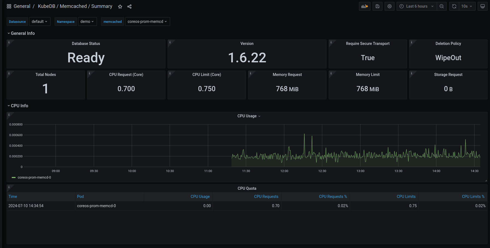
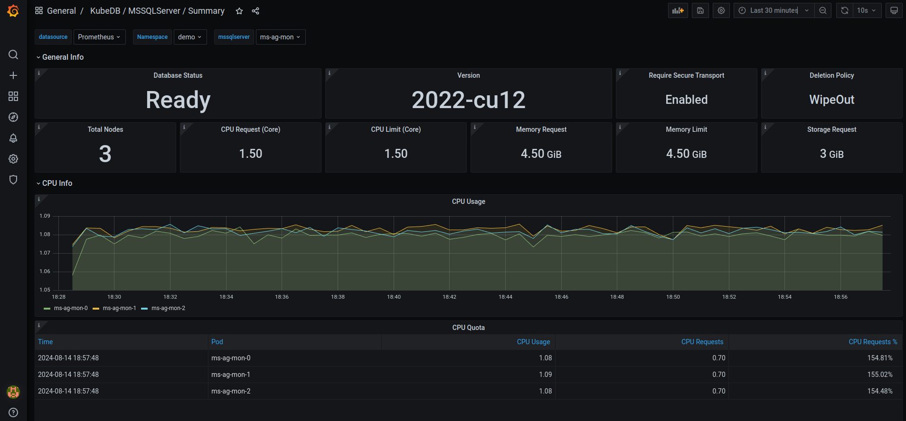

We are excited to announce the release of KubeDB **v2024.8.21**! This release introduces support for the **kubedb.com/v1** APIVersion across the following KubeDB-supported databases:

- Elasticsearch
- Kafka
- MariaDB
- Memcached
- MongoDB
- MySQL
- OpenSearch
- PerconaXtraDB
- PGBouncer
- PostgreSQL
- ProxySQL
- Redis
- Redis Sentinel

**Additionally, all of our supported databases now use [petsets.apps.k8s.appscode.com](https://appscode.com/blog/post/kubedb-v2024.03.16/#petset-aka-statefulset-20-) instead of `statefulsets`.**

This release also includes features like:

- Improved operator logging by removing redundant logs and adding missing ones.
- Support for `Druid` deployment with TLS-secured `MySQL` and `PostgreSQL` cluster as metadata storage.
- RabbitMQ pre-enabled protocol plugin support including `MQTT`, `STOMP`, `WEB_MQTT` and  `WEB_STOMP`.
- `Kafka RestProxy`, which provides a RESTful interface to an Apache Kafka cluster, making it easy to produce and consume messages.
- **Grafana Dashboard** support for `Memcached` and `Microsoft SQL Server`.
- More **OpsRequest** support for `Memcached`, `PGBouncer`, `Pgpool`, `Singlestore` and `Solr`.
- **AutoScaling** support for `PGBouncer`.
- List of New supported catalog versions:
  - **Druid**: 30.0.0
  - **Elasticsearch**: 8.15.0
  - **FerretDB**: 1.23.0
  - **MariaDB**: 11.3.2-jammy, 11.4.3-noble, 11.5.2-noble
  - **Memcached**: 1.6.29-alpine
  - **MySQL**: 8.4.2-oracle, 9.0.1-oracle
  - **OpenSearch**: 2.15.0
  - **PgBouncer**: 1.23.1
  - **Pgpool**: 4.4.8, 4.5.3
  - **Postgres**: 16.4-alpine, 16.4-bookworm, 15.8-alpine, 15.8-bookworm, 14.13-alpine, 14.13-bookworm
  - **Redis**: 7.4.0
  - **Singlestore**: alma-8.7.10-95e2357384, alma-8.5.30-4f46ab16a5
  - **Solr**: 9.6.1

This post lists all the major changes done in this release since the last release. Find the detailed changelogs [HERE](https://github.com/kubedb/CHANGELOG/blob/master/releases/v2024.8.21/README.md) . Now, you can proceed to the details of the features and updates included in the release.


### Key Changes

In previous releases, KubeDB utilized `kubedb.com/v1alpha2` APIVersion for the databases mentioned above, with the `db.spec.podTemplateSpec` sourced from [kmodules.xyz/offshoot-api/api/v1](https://pkg.go.dev/kmodules.xyz/offshoot-api@v0.30.0/api/v1#PodTemplateSpec). As we have introduced `kubedb.com/v1` APIVersion in this release, the `db.spec.podTemplateSpec` now sources from [kmodules.xyz/offshoot-api/api/v2](https://pkg.go.dev/kmodules.xyz/offshoot-api@v0.30.0/api/v2#PodTemplateSpec). The changes introduced in these two PodSpecs are listed below.


| **Old PodSpec (v1)**                           | **New PodSpec (v2)**                                        |
|------------------------------------------------|-------------------------------------------------------------|
| `Volumes []Volume`                             | `Volumes []v1.Volume`                                       |
| `InitContainers []core.Container`              | `InitContainers []core.Container`                           |
| -                                              | `Containers []core.Container` (new field)                   |
| -                                              | `EphemeralContainers []core.EphemeralContainer` (new field) |
| -                                              | `RestartPolicy core.RestartPolicy` (new field)              |
| `TerminationGracePeriodSeconds *int64`         | `TerminationGracePeriodSeconds *int64`                      |
| -                                              | `ActiveDeadlineSeconds *int64` (new field)                  |
| `DNSPolicy core.DNSPolicy`                     | `DNSPolicy core.DNSPolicy`                                  |
| `NodeSelector map[string]string`               | `NodeSelector map[string]string`                            |
| `ServiceAccountName string`                    | `ServiceAccountName string`                                 |
| -                                              | `AutomountServiceAccountToken *bool` (new field)            |
| -                                              | `NodeName string` (new field)                               |
| `HostNetwork bool`                             | `HostNetwork bool`                                          |
| `HostPID bool`                                 | `HostPID bool`                                              |
| `HostIPC bool`                                 | `HostIPC bool`                                              |
| `ShareProcessNamespace *bool`                  | `ShareProcessNamespace *bool`                               |
| `SecurityContext *core.PodSecurityContext`     | `SecurityContext *core.PodSecurityContext`                  |
| `ImagePullSecrets []core.LocalObjectReference` | `ImagePullSecrets []core.LocalObjectReference`              |
| -                                              | `SchedulerName string` (new field)                          |
| `Tolerations []core.Toleration`                | `Tolerations []core.Toleration`                             |
| -                                              | `HostAliases []core.HostAlias` (new field)                  |
| `PriorityClassName string`                     | `PriorityClassName string`                                  |
| `Priority *int32`                              | `Priority *int32`                                           |
| `DNSConfig *core.PodDNSConfig`                 | `DNSConfig *core.PodDNSConfig`                              |
| -                                              | `ReadinessGates []core.PodReadinessGate` (new field)        |
| `RuntimeClassName *string`                     | `RuntimeClassName *string`                                  |
| `EnableServiceLinks *bool`                     | `EnableServiceLinks *bool`                                  |
| -                                              | `PreemptionPolicy *core.PreemptionPolicy` (new field)       |
| -                                              | `Overhead core.ResourceList` (new field)                    |
| -                                              | `SetHostnameAsFQDN *bool` (new field)                       |
| -                                              | `OS *core.PodOS` (new field)                                |
| `continerSecurityContext`                      | `spec.containers[i].containerSecurityContext`               |
| `resources`                                    | `spec.containers[i].resources`                              | 
| `Args`                                         | `spec.containers[i].args`                                   |
| `Env`                                          | `spec.containers[i].env`                                    |


## API Conversion

Though we have moved our KubeDB APIVersion to `kubedb.com/v1`, you can still safely use `kubedb.com/v1alpha2`. The conversion between `v1` and `v1alpha2` (and vice versa) is handled by the `kubedb-webhook-server`. Therefore, it is normal to use both `v1alpha2` and `v1` DB objects simultaneously.

To get a `v1` PostgreSQL DB object, you can run the following command:
```bash
$ kubectl get postgres.v1.kubedb.com -n demo
NAME          VERSION   STATUS   AGE
ha-postgres   16.1      Ready    49s
```
However, `kubectl get pg -n demo` will get you `kubedb.com/v1` postgres object by default.
Similarly to get a `v1alhpa2` postgres db object,
```bash
$ kubectl get postgres.v1alpha2.kubedb.com -n demo
NAME          VERSION   STATUS   AGE
ha-postgres   16.1      Ready    95s
```


For more information, you can visit [this](https://kubernetes.io/docs/tasks/extend-kubernetes/custom-resources/custom-resource-definition-versioning/).

## Druid

#### Deploy Druid with Internally Managed Metadata Storage (MySQL, PostgreSQL), and ZooKeeper
KubeDB's latest release introduces support for internally managed dependencies, specifically metadata storage (`MySQL` or `PostgreSQL`) and `ZooKeeper`. This enhancement ensures that the KubeDB operator automatically deploys these components unless the user specifies their own external dependencies.

To deploy a Druid cluster that includes an internally managed MySQL database and ZooKeeper instance, use the following YAML configuration:

```yaml
apiVersion: kubedb.com/v1alpha2
kind: Druid
metadata:
  name: druid-quickstart
  namespace: demo
spec:
  version: 30.0.0
  deepStorage:
    type: s3
    configSecret:
      name: deep-storage-config
  topology:
    routers:
      replicas: 1
```

If you prefer to use PostgreSQL for metadata storage instead of the default MySQL, simply specify it in the `metadataStorage.type` field as shown below:
```yaml
apiVersion: kubedb.com/v1alpha2
kind: Druid
metadata:
  name: druid-quickstart
  namespace: demo
spec:
  version: 30.0.0
  deepStorage:
    type: s3
    configSecret:
      name: deep-storage-config
  metadataStorage:
    type: PostgreSQL
  topology:
    routers:
      replicas: 1
```
#### Deploying Druid with TLS secure MySQL and PostgreSQL
Additionally, in this release, KubeDB has been enhanced to support integration of `Druid` with TLS-secured `MySQL` and `PostgreSQL` clusters.

### Bug Fixes
- Add condition to skip write check when write check is disabled.

## Elasticsearch

In this release, APIVersion for Elasticsearch has been upgraded to `v1`. The new API version is [kubedb.com/v1](http://kubedb.com/v1).

1. In `v1alpha2` API, resources for dedicated topology cluster resources have to be defined at `.spec.topology.<node-type>.resources`, NodeSelector labels have to be defined at `.spec.topology.<node-type>.nodeSelector` and Tolerations have to be defined at `.spec.topology.<node-type>.tolerations`.
Now, in v1 API version, resources have to be defined in `.spec.topology.<node-type>.podTemplate.containers[].resources`. NodeSelector labels have to be defined at `.spec.topology.<node-type>.podTemplate.containers[].nodeSelector` and Tolerations have to be defined at `.spec.topology.<node-type>.podTemplate.containers[].tolerations`.
Here’s an example to set `Resources`, `NodeSelector` and `Tolerations` for master nodes.

   ```yaml
   apiVersion: kubedb.com/v1
   kind: Elasticsearch
   metadata:
     name: es-topology
     namespace: est
   spec:
     enableSSL: true
     version: xpack-8.14.1
     storageType: Durable
     kernelSettings:
       disableDefaults: true
     topology:
       master:
         replicas: 2
         podTemplate:
           spec:
             containers:
               - name: "elasticsearch"
                 resources:
                   requests:
                     cpu: "500m"
                   limits:
                     cpu: "600m"
                     memory: "1.5Gi"
             nodeSelector:
               topology.kubernetes.io/region: id-cgk
             tolerations:
             - key: "key1"
               operator: "Equal"
               value: "node1"
               effect: "NoSchedule"
   .
   .
   .
   ```
2. In v1alpha2 termination strategy has to be defined at `.spec.terminationPolicy`. In v1, this has been updated to `.spec.deletionPolicy`.
3. `podTemplate` has gone through significant changes in v1 API. Now, it has more k8s native specs embedded. Find out the complete API in [here](https://github.com/kmodules/offshoot-api/blob/master/api/v2/types.go)

## FerretDB

- Bring **FerretDB OpsRequest** support for `Reconfiguring TLS`, `Vertical Scaling` and `Horizontal Scaling`.
- Changes in API of FerretDB. Now for referring external `Postgres as backend`, the user just needs to provide the reference of [AppBinding](https://kubedb.com/docs/v2024.6.4/guides/postgres/concepts/appbinding/) of that postgres. To know more about AppBinding see [this blog](https://appscode.com/blog/post/appbinding/).

## Kafka

In this release, API version for Kafka has been changed to v1. The new API version is `kubedb.com/v1`. In the topology mode, resources for,
1. Broker were defined `spec.topology.broker.resources`, now it is defined in `spec.topology.broker.podTemplate.containers[].resources`.
2. Controller were defined `spec.topology.controller.resources`, now it is defined in `spec.topology.controller.podTemplate.containers[].resources`.

Here, `podTemplate` is a new field in the topology spec. Find out the new podTemplate spec [here](https://github.com/kmodules/offshoot-api/blob/master/api/v2/types.go#L44-#L279).
The default container name for Kafka cluster is `kafka`.

An example YAML for the topology cluster is given below:

```yaml
apiVersion: kubedb.com/v1
kind: Kafka
metadata:
  name: kafka-prod
  namespace: demo
spec:
  version: 3.6.1
  topology:
    broker:
      podTemplate:
        spec:
          containers:
            - name: kafka
              resources:
                requests:
                  cpu: 500m
                  memory: 1024Mi
                limits:
                  cpu: 700m
                  memory: 2Gi
      storage:
        accessModes:
          - ReadWriteOnce
        resources:
          requests:
            storage: 10Gi
        storageClassName: standard
    controller:
      replicas: 1
      podTemplate:
        spec:
          containers:
            - name: kafka
              resources:
                requests:
                  cpu: 500m
                  memory: 1024Mi
                limits:
                  cpu: 700m
                  memory: 2Gi
      storage:
        accessModes:
          - ReadWriteOnce
        resources:
          requests:
            storage: 10Gi
        storageClassName: standard
  storageType: Durable
  deletionPolicy: WipeOut
```

## Kafka Rest Proxy

In this release, RestProxy, a new Kafka component, has been introduced. It is a RESTful interface to the Kafka cluster. It allows you to produce and consume messages from a Kafka cluster over HTTP. It facilitates microservices to communicate with Kafka without needing Kafka client libraries.

Let's assume you have a Kafka cluster `kafka-prod`, provisioned using KubeDB, deployed in a namespace called demo. You can now create RestProxy instance using the following YAML:

```yaml
apiVersion: kafka.kubedb.com/v1alpha1
kind: RestProxy
metadata:
  name: restproxy
  namespace: demo
spec:
  version: 3.15.0
  replicas: 1
  kafkaRef:
    name: kafka-prod
    namespace: demo
  deletionPolicy: WipeOut
```
***New version support:*** `3.15.0`
> **Note:** RestProxy uses `SchemaRegistryVersion` for distribution `Aiven` only.

## MariaDB

In this release, the API version for MariaDB has been updated to v1, now identified as `kubedb.com/v1`. Several changes have been introduced:

1. The fields `db.spec.coordinator.resources` and `db.spec.coordinator.securityContext` have been moved under the `md-coordinator` container in `db.spec.podTemplate.spec.containers`. The `md-coordinator` is a sidecar container that we run alongside our main database container for leader election and failover purposes.

2. The field `db.spec.terminationPolicy` has been renamed to `db.spec.deletionPolicy`.

3. The fields `db.spec.podTemplate.spec.resources` and `db.spec.podTemplate.spec.containerSecurityContext` have been moved under the `mariadb` container in `db.spec.podTemplate.spec.containers[0]`. This `mariadb` container is the main database container for the MariaDB CRO.

4. All other changes to `db.spec.podTemplate` can be found at the beginning of this document.

A sample YAML configuration for MariaDB with the `kubedb/v1alpha2` API version and its corresponding `kubedb/v1` API version are provided below.
```yaml
apiVersion: kubedb.com/v1alpha2
kind: MariaDB
metadata:
  name: ha-mariadb
  namespace: demo
spec:
  coordinator:
    resources:
      requests:
        cpu: 111m
    securityContext:
      allowPrivilegeEscalation: false
      capabilities:
        drop:
          - ALL
      runAsGroup: 999
      runAsNonRoot: true
      runAsUser: 999
      seccompProfile:
        type: RuntimeDefault
  podTemplate:
    spec:
      containerSecurityContext:
        allowPrivilegeEscalation: false
        capabilities:
          drop:
            - ALL
        runAsGroup: 999
        runAsNonRoot: true
        runAsUser: 999
        seccompProfile:
          type: RuntimeDefault
      initContainers:
        - name: mariadb-init
          resources:
            limits:
              memory: 512Mi
            requests:
              cpu: 200m
              memory: 512Mi
          securityContext:
            allowPrivilegeEscalation: false
            capabilities:
              drop:
                - ALL
            runAsGroup: 999
            runAsNonRoot: true
            runAsUser: 999
            seccompProfile:
              type: RuntimeDefault
      podPlacementPolicy:
        name: default
      resources:
        limits:
          memory: 1Gi
        requests:
          cpu: 666m
          memory: 1Gi
      securityContext:
        fsGroup: 999
  replicas: 3
  storage:
    accessModes:
      - ReadWriteOnce
    resources:
      requests:
        storage: 1Gi
  storageType: Durable
  terminationPolicy: WipeOut
  version: 11.1.3
```
Now same yaml in kubedb/v1 apiversion
```yaml
apiVersion: kubedb.com/v1
kind: MariaDB
metadata:
  name: ha-mariadb
  namespace: demo
spec:
  podTemplate:
    spec:
      containers:
        - name: mariadb
          resources:
            limits:
              memory: 1Gi
            requests:
              cpu: 666m
              memory: 1Gi
          securityContext:
            allowPrivilegeEscalation: false
            capabilities:
              drop:
                - ALL
            runAsGroup: 999
            runAsNonRoot: true
            runAsUser: 999
            seccompProfile:
              type: RuntimeDefault
        - name: md-coordinator
          resources:
            requests:
              cpu: 111m
          securityContext:
            allowPrivilegeEscalation: false
            capabilities:
              drop:
                - ALL
            runAsGroup: 999
            runAsNonRoot: true
            runAsUser: 999
            seccompProfile:
              type: RuntimeDefault
      initContainers:
        - name: mariadb-init
          resources:
            limits:
              memory: 512Mi
            requests:
              cpu: 200m
              memory: 512Mi
          securityContext:
            allowPrivilegeEscalation: false
            capabilities:
              drop:
                - ALL
            runAsGroup: 999
            runAsNonRoot: true
            runAsUser: 999
            seccompProfile:
              type: RuntimeDefault
      podPlacementPolicy:
        name: default
      securityContext:
        fsGroup: 999
  replicas: 3
  storage:
    accessModes:
      - ReadWriteOnce
    resources:
      requests:
        storage: 1Gi
  storageType: Durable
  deletionPolicy: WipeOut
  version: 11.1.3
```

### Bug fixes
- MariaDB archiver backup configuration not working due to AppBinding, has been fixed.
- MariaDB Archiver Restore not working because of `lost+found` directory presence at data directory,has been fixed.
- Fixed bug MariaDB restore stuck when `db.spec.init.waitForInitialRestore: true`.
## Memcached

### V1 conversion:
In this release, the API version for Memcached has been updated to v1, now identified as `kubedb.com/v1`. Several changes have been introduced:

1. The field `db.spec.terminationPolicy` has been renamed to `db.spec.deletionPolicy`.

2. The fields `db.spec.podTemplate.spec.resources` and `db.spec.podTemplate.spec.containerSecurityContext` have been moved under the `memcached` container in `db.spec.podTemplate.spec.containers[0]`. This `memcached` container is the main database container for the Memcached CRO.

3. All other changes to the `db.spec.podTemplate` can be found at the beginning of this document.

A sample YAML configuration for Memcached with the `kubedb/v1alpha2` API version and its corresponding `kubedb/v1` API version are provided below.

```yaml
apiVersion: kubedb.com/v1alpha2
kind: Memcached
metadata:
  name: memcd-quickstart
  namespace: demo
spec:
  replicas: 1
  version: "1.6.22"
  configSecret:
    name: mc-configuration
  terminationPolicy: WipeOut
  podTemplate:
    spec:
      resources:
        limits:
          cpu: 500m
          memory: 128Mi
        requests:
          cpu: 250m
          memory: 64Mi
      securityContext:
        runAsGroup: 70
        runAsNonRoot: true
        runAsUser: 70
        seccompProfile:
          type: RuntimeDefault

```

Now, same yaml in kubedb/v1 apiversion:
```yaml
apiVersion: kubedb.com/v1
kind: Memcached
metadata:
  name: memcd-quickstart
  namespace: demo
spec:
  replicas: 1
  version: "1.6.22"
  configSecret:
    name: mc-configuration
  deletionPolicy: WipeOut
  podTemplate:
    spec:
      containers:
      - name: memcached
        resources:
          limits:
            cpu: 500m
            memory: 128Mi
          requests:
            cpu: 250m
            memory: 64Mi
      securityContext:
        runAsGroup: 70
        runAsNonRoot: true
        runAsUser: 70
        seccompProfile:
          type: RuntimeDefault
      podPlacementPolicy:
        name: default
```


### Add Dashboard
This release introduces an enhanced monitoring feature for KubeDB-managed Memcached deployments by integrating Grafana dashboards. These dashboards provide comprehensive insights into various Memcached-specific metrics, statuses, as well as visual representations of memory and CPU consumption. With this dashboard, users can effortlessly assess the overall health and performance of memcached, enabling more informed decision-making and efficient resource management.

Have a look [here](https://github.com/appscode/grafana-dashboards/tree/master/memcached) for a step-by-step guide to use the monitoring feature in Memcached.

Here’s a preview of the Summary dashboard for Memcached:




### Add more Ops-request support: Memcached Ops Request
In this release, we have added more ops-request support for Memcached. Previously we had Restart, Vertical Scaling, and Reconfigure type ops-request. Now, we have added Horizontal Scaling and Version Update type ops-request.

#### Horizontal Scaling
Horizontal Scaling allows to horizontally scale memcached pods. It can do both upscale and downscale the memcached replicas. The necessary information for horizontal scaling must be provided in the `spec.horizontalScaling.node` field. An example YAML is provided below:
```yaml
apiVersion: ops.kubedb.com/v1alpha1
kind: MemcachedOpsRequest
metadata:
  name: memcd-horizontal-scale
  namespace: demo
spec:
  type: HorizontalScaling
  databaseRef:
    name: memcd-quickstart
  horizontalScaling:
    replicas: 2
```

#### Update Version
Update version allows updating the version of Memcached. It can work in both ways: older version to new version and vice versa new version to older version. The necessary information for the update version must be provided in the `spec.updateVersion.targetVersion` field. An example YAML is provided below:
```yaml
apiVersion: ops.kubedb.com/v1alpha1
kind: MemcachedOpsRequest
metadata:
  name: update-memcd
  namespace: demo
spec:
  type: UpdateVersion
  databaseRef:
    name: memcd-quickstart
  updateVersion:
    targetVersion: 1.6.22
```


## Microsoft SQL Server

This release introduces an enhanced monitoring feature for KubeDB-managed MicroSoft SQL Server deployments by integrating Grafana dashboards. The dashboards provide comprehensive insights into various SQL Server metrics, statuses, as well as visual representations of memory and CPU consumption. With this dashboard, users can effortlessly assess the overall health and performance of their SQL Server clusters, enabling more informed decision-making and efficient resource management.

Have a look [here](https://github.com/appscode/grafana-dashboards/tree/master/mssqlserver)  for a step-by-step guide on using the monitoring feature of Microsoft SQL Server.

Here’s a preview of the Summary dashboard for SQL Server.



## MongoDB
In this release, the API version for MongoDB has been updated to v1, now identified as `kubedb.com/v1`. Several changes have been introduced:

- The fields `db.spec.coordinator.resources` and `db.spec.coordinator.securityContext` have been moved under the `replication-mood-detector` container in `db.spec.podTemplate.spec.containers`. The `replication-mood-detector` is a sidecar container that we run alongside our main database container to label the primary and secondary pods.

- The field `db.spec.terminationPolicy` has been renamed to `db.spec.deletionPolicy`.

- The fields `db.spec.podTemplate.spec.resources` and `db.spec.podTemplate.spec.containerSecurityContext` have been moved under the `mongodb` container in `db.spec.podTemplate.spec.containers[0]`. This `mongodb` container is the main database container for the MongoDB CRO.

- All other changes to the `db.spec.podTemplate` can be found at the beginning of this document.

Below is a sample YAML configuration for MySQL with the `kubedb/v1alpha2` API version and its corresponding configuration for the `kubedb/v1` API version.

```yaml
apiVersion: kubedb.com/v1alpha2
kind: MongoDB
metadata:
  name: mg-repl
  namespace: demo
spec:
  coordinator:
    resources:
      requests:
        cpu: 300m
    securityContext:
      allowPrivilegeEscalation: false
      capabilities:
        drop:
          - ALL
      runAsGroup: 999
      runAsNonRoot: true
      runAsUser: 999
      seccompProfile:
        type: RuntimeDefault
  podTemplate:
    spec:
      containerSecurityContext:
        allowPrivilegeEscalation: false
        capabilities:
          drop:
            - ALL
        runAsGroup: 999
        runAsNonRoot: true
        runAsUser: 999
        seccompProfile:
          type: RuntimeDefault
      initContainers:
        - name: copy-config
          resources:
            limits:
              memory: 512Mi
            requests:
              cpu: 200m
              memory: 512Mi
          securityContext:
            allowPrivilegeEscalation: false
            capabilities:
              drop:
                - ALL
            runAsGroup: 999
            runAsNonRoot: true
            runAsUser: 999
            seccompProfile:
              type: RuntimeDefault
      podPlacementPolicy:
        name: default
      resources:
        limits:
          memory: 1Gi
        requests:
          cpu: 500m
          memory: 1Gi
      securityContext:
        fsGroup: 999
  replicas: 3
  replicaSet: 
    name: "replicaset"
  storage:
    accessModes:
      - ReadWriteOnce
    resources:
      requests:
        storage: 1Gi
  storageType: Durable
  terminationPolicy: WipeOut
  version: "6.0.12"
```

Now same yaml in kubedb/v1 apiversion,

```yaml
apiVersion: kubedb.com/v1
kind: MongoDB
metadata:
  name: mg-repl
  namespace: demo
spec:
  allowedSchemas:
    namespaces:
      from: Same
  authSecret:
    name: mg-repl-auth
  deletionPolicy: WipeOut
  podTemplate:
    spec:
      containers:
      - name: mongodb
        resources:
          limits:
            memory: 1Gi
          requests:
            cpu: 500m
            memory: 1Gi
        securityContext:
          allowPrivilegeEscalation: false
          capabilities:
            drop:
            - ALL
          runAsGroup: 999
          runAsNonRoot: true
          runAsUser: 999
          seccompProfile:
            type: RuntimeDefault
      - name: replication-mode-detector
        resources:
          requests:
            cpu: 300m
        securityContext:
          allowPrivilegeEscalation: false
          capabilities:
            drop:
            - ALL
          runAsGroup: 999
          runAsNonRoot: true
          runAsUser: 999
          seccompProfile:
            type: RuntimeDefault
      initContainers:
      - name: copy-config
        resources:
          limits:
            memory: 512Mi
          requests:
            cpu: 200m
            memory: 512Mi
        securityContext:
          allowPrivilegeEscalation: false
          capabilities:
            drop:
            - ALL
          runAsGroup: 999
          runAsNonRoot: true
          runAsUser: 999
          seccompProfile:
            type: RuntimeDefault
      podPlacementPolicy:
        name: default
      securityContext:
        fsGroup: 999
      serviceAccountName: mg-repl
  replicaSet:
    name: replicaset
  replicas: 3
  sslMode: disabled
  storage:
    accessModes:
    - ReadWriteOnce
    resources:
      requests:
        storage: 1Gi
  storageEngine: wiredTiger
  storageType: Durable
  version: 6.0.12
```


### Bug Fixes
- TLS enabled MongoDB backup and restore for major versions 5,6 and 7 was not working properly due to a permission issue. This issue has been fixed in this release.
- Fixed bug MongoDB restore stuck when `db.spec.init.waitForInitialRestore: true`.

## MySQL

In this release, the API version for MySQL has been updated to v1, now identified as `kubedb.com/v1`. Several changes have been introduced:

### Key Changes for MySQL:
1. **API Version**: Updated from `kubedb.com/v1alpha2` to `kubedb.com/v1`.
2. **Coordinator Changes**: The `db.spec.coordinator.resources` and `db.spec.coordinator.securityContext` fields have been moved under the `my-coordinator` container in `db.spec.podTemplate.spec.containers`.
3. **Termination Policy Renamed**: `db.spec.terminationPolicy` has been renamed to `db.spec.deletionPolicy`.
4. **Pod Template Changes**: The fields `db.spec.podTemplate.spec.resources` and `db.spec.podTemplate.spec.containerSecurityContext` are now part of the main `mysql` container within the `containers` array in `db.spec.podTemplate.spec.containers[0]`.

This configuration ensures that the MySQL resource definition aligns with the new `kubedb.com/v1` API version, incorporating all necessary changes.


### MySQL Configuration (`kubedb.com/v1alpha2` to `kubedb.com/v1`)

Below is a sample YAML configuration for MySQL with the `kubedb/v1alpha2` API version and its corresponding configuration for the `kubedb/v1` API version.

#### `kubedb.com/v1alpha2`
```yaml
apiVersion: kubedb.com/v1alpha2
kind: MySQL
metadata:
  name: sample-mysql
  namespace: demo
spec:
  coordinator:
    resources:
      requests:
        cpu: 111m
    securityContext:
      allowPrivilegeEscalation: false
      capabilities:
        drop:
          - ALL
      runAsGroup: 999
      runAsNonRoot: true
      runAsUser: 999
      seccompProfile:
        type: RuntimeDefault
  podTemplate:
    spec:
      containerSecurityContext:
        allowPrivilegeEscalation: false
        capabilities:
          drop:
            - ALL
        runAsGroup: 999
        runAsNonRoot: true
        runAsUser: 999
        seccompProfile:
          type: RuntimeDefault
      initContainers:
        - name: mysql-init
          resources:
            limits:
              memory: 512Mi
            requests:
              cpu: 200m
              memory: 512Mi
          securityContext:
            allowPrivilegeEscalation: false
            capabilities:
              drop:
                - ALL
            runAsGroup: 999
            runAsNonRoot: true
            runAsUser: 999
            seccompProfile:
              type: RuntimeDefault
      podPlacementPolicy:
        name: default
      resources:
        limits:
          memory: 1Gi
        requests:
          cpu: 666m
          memory: 1Gi
      securityContext:
        fsGroup: 999
  replicas: 3
  storage:
    accessModes:
      - ReadWriteOnce
    resources:
      requests:
        storage: 1Gi
  storageType: Durable
  terminationPolicy: WipeOut
  version: 8.0.36
```

#### `kubedb.com/v1`
```yaml
apiVersion: kubedb.com/v1
kind: MySQL
metadata:
  name: ha-mysql
  namespace: demo
spec:
  podTemplate:
    spec:
      containers:
        - name: mysql
          resources:
            limits:
              memory: 1Gi
            requests:
              cpu: 666m
              memory: 1Gi
          securityContext:
            allowPrivilegeEscalation: false
            capabilities:
              drop:
                - ALL
            runAsGroup: 999
            runAsNonRoot: true
            runAsUser: 999
            seccompProfile:
              type: RuntimeDefault
        - name: my-coordinator
          resources:
            requests:
              cpu: 111m
          securityContext:
            allowPrivilegeEscalation: false
            capabilities:
              drop:
                - ALL
            runAsGroup: 999
            runAsNonRoot: true
            runAsUser: 999
            seccompProfile:
              type: RuntimeDefault
      initContainers:
        - name: mysql-init
          resources:
            limits:
              memory: 512Mi
            requests:
              cpu: 200m
              memory: 512Mi
          securityContext:
            allowPrivilegeEscalation: false
            capabilities:
              drop:
                - ALL
            runAsGroup: 999
            runAsNonRoot: true
            runAsUser: 999
            seccompProfile:
              type: RuntimeDefault
      podPlacementPolicy:
        name: default
      securityContext:
        fsGroup: 999
  replicas: 3
  storage:
    accessModes:
      - ReadWriteOnce
    resources:
      requests:
        storage: 1Gi
  storageType: Durable
  deletionPolicy: WipeOut
  version: 8.0.36
```

## PerconaXtraDB

In this release, the API version for PerconaXtraDB has been updated to v1, now identified as `kubedb.com/v1`. Several changes have been introduced:

1. The fields `db.spec.coordinator.resources` and `db.spec.coordinator.securityContext` have been moved under the `px-coordinator` container in `db.spec.podTemplate.spec.containers`. The `px-coordinator` is a sidecar container that we run alongside our main database container for leader election and failover purposes.

2. The field `db.spec.terminationPolicy` has been renamed to `db.spec.deletionPolicy`.

3. The fields `db.spec.podTemplate.spec.resources` and `db.spec.podTemplate.spec.containerSecurityContext` have been moved under the `perconaxtradb` container in `db.spec.podTemplate.spec.containers[0]`. This `perconaxtradb` container is the main database container for the PerconaXtraDB CRO.

4. All other changes to the `db.spec.podTemplate` can be found at the beginning of this document.

A sample YAML configuration for PerconaXtraDB with the `kubedb/v1alpha2` API version and its corresponding `kubedb/v1` API version are provided below.
```yaml
apiVersion: kubedb.com/v1alpha2
kind: PerconaXtraDB
metadata:
  name: xtradb-demo
  namespace: demo
spec:
  coordinator:
    resources:
      requests:
        cpu: 111m
    securityContext:
      allowPrivilegeEscalation: false
      capabilities:
        drop:
          - ALL
      runAsGroup: 1001
      runAsNonRoot: true
      runAsUser: 1001
      seccompProfile:
        type: RuntimeDefault
  podTemplate:
    spec:
      containerSecurityContext:
        allowPrivilegeEscalation: false
        capabilities:
          drop:
            - ALL
        runAsGroup: 1001
        runAsNonRoot: true
        runAsUser: 1001
        seccompProfile:
          type: RuntimeDefault
      initContainers:
        - name: px-init
          resources:
            limits:
              memory: 512Mi
            requests:
              cpu: 200m
              memory: 512Mi
          securityContext:
            allowPrivilegeEscalation: false
            capabilities:
              drop:
                - ALL
            runAsGroup: 1001
            runAsNonRoot: true
            runAsUser: 1001
            seccompProfile:
              type: RuntimeDefault
      podPlacementPolicy:
        name: default
      resources:
        limits:
          memory: 1Gi
        requests:
          cpu: 666m
          memory: 1Gi
      securityContext:
        fsGroup: 1001
  replicas: 3
  storage:
    accessModes:
      - ReadWriteOnce
    resources:
      requests:
        storage: 150Mi
  storageType: Durable
  terminationPolicy: WipeOut
  version: 8.0.31
```
Now same yaml in kubedb/v1 apiversion
```yaml
apiVersion: kubedb.com/v1
kind: PerconaXtraDB
metadata:
  name: xtradb-demo
  namespace: demo
spec:
  podTemplate:
    spec:
      containers:
        - name: perconaxtradb
          resources:
            limits:
              memory: 1Gi
            requests:
              cpu: 666m
              memory: 1Gi
          securityContext:
            allowPrivilegeEscalation: false
            capabilities:
              drop:
                - ALL
            runAsGroup: 1001
            runAsNonRoot: true
            runAsUser: 1001
            seccompProfile:
              type: RuntimeDefault
        - name: px-coordinator
          resources:
            requests:
              cpu: 111m
          securityContext:
            allowPrivilegeEscalation: false
            capabilities:
              drop:
                - ALL
            runAsGroup: 1001
            runAsNonRoot: true
            runAsUser: 1001
            seccompProfile:
              type: RuntimeDefault
      initContainers:
        - name: px-init
          resources:
            limits:
              memory: 512Mi
            requests:
              cpu: 200m
              memory: 512Mi
          securityContext:
            allowPrivilegeEscalation: false
            capabilities:
              drop:
                - ALL
            runAsGroup: 1001
            runAsNonRoot: true
            runAsUser: 1001
            seccompProfile:
              type: RuntimeDefault
      podPlacementPolicy:
        name: default
      securityContext:
        fsGroup: 1001
  replicas: 3
  storage:
    accessModes:
      - ReadWriteOnce
    resources:
      requests:
        storage: 150Mi
  storageType: Durable
  deletionPolicy: WipeOut
  version: 8.0.31
```

### Bug Fixes
- Fixed bug PerconXtraDB stuck on provisioning. PerconaXtraDB `runAsUser` field updated. New PerconaXtraDB `runAsUser` is `1001`.

## PgBouncer

#### V1 conversion:
In this release, API version for pgbouncer has been changed to v1. The new API version is `kubedb.com/v1`.

```yaml
apiVersion: kubedb.com/v1
kind: PgBouncer
metadata:
  name: pgbouncer
  namespace: demo
spec:
  version: "1.18.0"
  replicas: 3
  database:
    syncUsers: true
    databaseName: "postgres"
    databaseRef:
      name: "postgres"
      namespace: demo
  connectionPool:
    port: 5432
    reservePoolSize: 3
  podTemplate:
    spec:
      containers:
        - name: pgbouncer
          resources:
            limits:
              cpu: .5
              memory: 1Gi
            requests:
              cpu: .5
              memory: 1Gi
  deletionPolicy: WipeOut
```
#### Horizontal Scaling:
Horizontal Scaling allows to horizontally scale pgbouncer pods. It can do both upscale and downscale pgbouncer replicas. The necessary information for horizontal scaling must be provided in the `spec.horizontalScaling.replicas` field. An example YAML is provided below:

```yaml
apiVersion: ops.kubedb.com/v1alpha1
kind: PgBouncerOpsRequest
metadata:
  name: pb-ops
  namespace: demo
spec:
  serverRef:
    name:<name of the targeted pgbouncer resource>
  type: HorizontalScaling
  horizontalScaling:
    replicas: 4
```

#### Vertical Scaling:
Vertical Scaling allows to vertically scale pgbouncer pods in a chosen node. But, it is only capable of scaling the pgbouncer and the exporter container. The necessary information for vertical scaling must be provided in the `spec.verticalScaling` field. An example YAML is provided below:

```yaml
apiVersion: ops.kubedb.com/v1alpha1
kind: PgBouncerOpsRequest
metadata:
  name: pb-ops
  namespace: demo
spec:
  serverRef:
    name:<name of the targeted pgbouncer resource>
  type: VerticalScaling
  verticalScaling:
    pgbouncer:
      nodeSelectionPolicy: LabelSelector
      topology:
        key: <node label key>
        value: <node label value>
      resources:
        limits:
          cpu: .7
          memory: 1Gi
        requests:
          cpu: .5
          memory: 1Gi
```

#### AutoScaling

Auto Scaling allows automating the vertical scaling of pgbouncer pods. It is only capable of scaling the pgbouncer container. It will automatically assign enough resources based on the resource uses of the pgbouncer container.

```yaml
apiVersion: autoscaling.kubedb.com/v1alpha1
kind: PgBouncerAutoscaler
metadata:
  name: auto
  namespace: demo
spec:
  databaseRef:
    Name: <name of the targeted pgbouncer resource>
  opsRequestOptions:
    timeout: 3m
    apply: IfReady
  compute:
    pgbouncer:
      trigger: "On"
      podLifeTimeThreshold: 5m
      resourceDiffPercentage: 2
      minAllowed:
        cpu: 1m
        memory: 1Mi
      maxAllowed:
        cpu: 10m
        memory: 2Gi
      controlledResources: ["cpu", "memory"]
```


## Pgpool


### Add more ops-request support: Pgpool Ops Request
In this release, we have added more ops-request  support for Pgpool. Previously we had `Restart`, `Vertical Scaling`, and `Reconfigure` type ops-request. Now we have added `Horizontal Scaling`, `Reconfigure TLS`, `Version Update` type ops-request.


#### Horizontal Scaling
Horizontal Scaling allows to horizontally scale pgpool pods. It can do both upscale and downscale the pgpool replicas. The necessary information for horizontal scaling must be provided in the `spec.horizontalScaling.node` field. An example YAML is provided below:
```yaml
apiVersion: ops.kubedb.com/v1alpha1
kind: PgpoolOpsRequest
metadata:
  name: pgpool-horizontal-scale
  namespace: demo
spec:
  type: HorizontalScaling
  databaseRef:
    name: pgpool
  horizontalScaling:
    node: 3
```

#### Reconfigure TLS
Reconfigure TLS allows you to add, update, or delete TLS for an existing pgpool. It also has necessary options to reconfigure the `sslMode` and `clientAuthMode` of  a pgpool. An example YAML is provided below:
```yaml
apiVersion: ops.kubedb.com/v1alpha1
kind: PgpoolOpsRequest
metadata:
  name: pgpool-reconfigure-tls
  namespace: demo
spec:
  type: ReconfigureTLS
  databaseRef:
    name: pgpool
  tls:
    sslMode: verify-ca
    clientAuthMode: cert
    issuerRef:
      name: pgpool-ca-issuer
      kind: Issuer
      apiGroup: "cert-manager.io"
    certificates:
      - alias: client
        subject:
          organizations:
            - kubedb
          organizationalUnits:
            - client
```
Reconfigure TLS also has these following fields, `spec.tls.rotateCertificates` and `spec.tls.remove`. Both of these fields accept boolean values.

#### Update Version
Update version allows to update the version of pgpool. It can work in both ways: older version to new version and new version to older version. The necessary information for the update version must be provided in the `spec.updateVersion.targetVersion` field. An example YAML is provided below:
```yaml
apiVersion: ops.kubedb.com/v1alpha1
kind: PgpoolOpsRequest
metadata:
  name: pgpool-version-update
  namespace: demo
spec:
  type: UpdateVersion
  databaseRef:
    name: pgpool
  updateVersion:
    targetVersion: 4.5.0
```


## Postgres

In this release, the API version for Postgres has been
updated to v1, now identified as `kubedb.com/v1`. 
Several changes have been introduced:

1. The fields `db.spec.coordinator.resources` and `db.spec.coordinator.securityContext` have been moved under the `pg-coordinator` container in `db.spec.podTemplate.spec.containers`. The `pg-coordinator` is a sidecar container that we run alongside our main database container for leader election and failover purposes.

2. The field `db.spec.terminationPolicy` has been renamed to `db.spec.deletionPolicy`.

3. The fields `db.spec.podTemplate.spec.resources` and `db.spec.podTemplate.spec.containerSecurityContext` have been moved under the `postgres` container in `db.spec.podTemplate.spec.containers[0]`. This `postgres` container is the main database container for the Postgres Database Object.

4. All other changes to the `db.spec.podTemplate` can be found at the beginning of this document.

A sample YAML configuration for Postgres with the `kubedb/v1alpha2` API version and its corresponding `kubedb/v1` API version are provided below.


```yaml
    apiVersion: kubedb.com/v1alpha2
    kind: Postgres
    metadata:
      name: ha-postgres
      namespace: demo
    spec:
      clientAuthMode: md5
      coordinator:
        resources:
          requests:
            cpu: 150m
        securityContext:
          allowPrivilegeEscalation: false
          capabilities:
            drop:
              - ALL
          runAsGroup: 70
          runAsNonRoot: true
          runAsUser: 70
          seccompProfile:
            type: RuntimeDefault
      podTemplate:
        spec:
          containerSecurityContext:
            allowPrivilegeEscalation: false
            capabilities:
              drop:
                - ALL
            runAsGroup: 70
            runAsNonRoot: true
            runAsUser: 70
            seccompProfile:
              type: RuntimeDefault
          env:
            - name: HA
              value: HD
          initContainers:
            - name: postgres-init-container
              resources:
                limits:
                  memory: 512Mi
                requests:
                  cpu: 200m
                  memory: 512Mi
              securityContext:
                allowPrivilegeEscalation: false
                capabilities:
                  drop:
                    - ALL
                runAsGroup: 70
                runAsNonRoot: true
                runAsUser: 70
                seccompProfile:
                  type: RuntimeDefault
          podPlacementPolicy:
            name: default
          resources:
            limits:
              memory: 1Gi
            requests:
              cpu: 500m
              memory: 1Gi
          securityContext:
            fsGroup: 70
            runAsGroup: 70
            runAsUser: 70
          serviceAccountName: ha-po
      replicas: 3
      replication:
        walKeepSize: 1024
        walLimitPolicy: WALKeepSize
      sslMode: disable
      storage:
        accessModes:
          - ReadWriteOnce
        resources:
          requests:
            storage: 1Gi
      storageType: Durable
      terminationPolicy: WipeOut
      version: "13.13"
```
Now same yaml in kubedb/v1 apiversion
```yaml
    apiVersion: kubedb.com/v1
    kind: Postgres
    metadata:
      name: ha-postgres
      namespace: demo
    spec:
      clientAuthMode: md5
      deletionPolicy: WipeOut
      podTemplate:
        spec:
          containers:
            - env:
                - name: HA
                  value: HD
              name: postgres
              resources:
                limits:
                  memory: 1Gi
                requests:
                  cpu: 500m
                  memory: 1Gi
              securityContext:
                allowPrivilegeEscalation: false
                capabilities:
                  drop:
                    - ALL
                runAsGroup: 70
                runAsNonRoot: true
                runAsUser: 70
                seccompProfile:
                  type: RuntimeDefault
            - name: pg-coordinator
              resources:
                requests:
                  cpu: 150m
              securityContext:
                allowPrivilegeEscalation: false
                capabilities:
                  drop:
                    - ALL
                runAsGroup: 70
                runAsNonRoot: true
                runAsUser: 70
                seccompProfile:
                  type: RuntimeDefault
          initContainers:
            - name: postgres-init-container
              resources:
                limits:
                  memory: 512Mi
                requests:
                  cpu: 200m
                  memory: 512Mi
              securityContext:
                allowPrivilegeEscalation: false
                capabilities:
                  drop:
                    - ALL
                runAsGroup: 70
                runAsNonRoot: true
                runAsUser: 70
                seccompProfile:
                  type: RuntimeDefault
          podPlacementPolicy:
            name: default
          securityContext:
            fsGroup: 70
            runAsGroup: 70
            runAsUser: 70
          serviceAccountName: ha-po
      replicas: 3
      replication:
        walKeepSize: 1024
        walLimitPolicy: WALKeepSize
      sslMode: disable
      storage:
        accessModes:
          - ReadWriteOnce
        resources:
          requests:
            storage: 1Gi
      storageType: Durable
      version: "13.13"
```

### Bug Fixes
- PostgresArchiver selection wasn't working. Fixed in this release.
- Fixed bug Postgres restore stuck when `db.spec.init.waitForInitialRestore: true`.
- Postgres reconfigure tls ops-request (change issuer, remove tls) bug has been fixed.
- Postgres archiver backup configuration not working due to AppBinding, has been fixed.
- `Postgres metadata.resourceVersion continuously changing` bug has been fixed.
## ProxySQL

In this release, the API version for ProxySQL has been updated to v1, now identified as `kubedb.com/v1`. Several changes have been introduced:


### Key Changes for ProxySQL:

1. **API Version**: Updated from `kubedb.com/v1alpha2` to `kubedb.com/v1`.

2. **Termination Policy Renamed**: `db.spec.terminationPolicy` has been renamed to `db.spec.deletionPolicy`.

3. **Pod Template Changes**: The fields `db.spec.podTemplate.spec.resources` and `db.spec.podTemplate.spec.containerSecurityContext` are now included within the main proxysql container in `db.spec.podTemplate.spec.containers[0]`.


This configuration ensures that the ProxySQL resource definition aligns with the new `kubedb.com/v1` API version, incorporating all necessary changes.


A sample yaml for `kubedb.com/v1alpha2`:
```yaml
apiVersion: kubedb.com/v1alpha2
kind: ProxySQL
metadata:
  name: proxy-server
  namespace: demo
spec:
  version: "2.3.2-debian"
  replicas: 3
  podTemplate:
    spec:
      containerSecurityContext:
        allowPrivilegeEscalation: false
        capabilities:
          drop:
            - ALL
        runAsGroup: 999
        runAsNonRoot: true
        runAsUser: 999
        seccompProfile:
          type: RuntimeDefault
      podPlacementPolicy:
        name: default
      resources:
        limits:
          memory: 1Gi
        requests:
          cpu: 666m
          memory: 1Gi
      securityContext:
        fsGroup: 999
  syncUsers: true
  backend:
    name: mysql-server
  terminationPolicy: WipeOut
```

A sample yaml for `kubedb.com/v1`:
```yaml
apiVersion: kubedb.com/v1
kind: ProxySQL
metadata:
  name: proxy-server
  namespace: demo
spec:
  version: "2.3.2-debian"
  replicas: 3
  podTemplate:
    spec:
      containers:
        - name: proxysql
          resources:
            limits:
              cpu: 500m
              memory: 128Mi
            requests:
              cpu: 250m
              memory: 64Mi
      securityContext:
        runAsGroup: 999
        runAsNonRoot: true
        runAsUser: 999
        seccompProfile:
          type: RuntimeDefault
      podPlacementPolicy:
        name: default
  syncUsers: true
  backend:
    name: mysql-server
  deletionPolicy: WipeOut
```

## RabbitMQ

KubeDB managed RabbitMQ used to provide only pre-enabled protocol support `AMQP` for clusters. In this release, we are coming up with pre-enabled protocol plugin support including `MQTT`, `STOMP`, `WEB_MQTT` and  `WEB_STOMP`. If TLS is enabled then, these plugins also comes with corresponding secure ports.

KubeDB managed RabbitMQ used to provide support for a ClusterIP service for management UI, amqp client etc. In this release, a separate ClusterIP type management UI service will be provisioned making the previous service to be used only for client connections (AMQP, MQTT, STOMP and web sockets). This will improve responsiveness on both management ui and client connectivity.


## Redis

In this release, the API version for Redis has been updated to v1. The new API version is `kubedb.com/v1`. Several changes have been introduced:

1. The field `db.spec.cluster.master` has been changed to `db.spec.cluster.shards` and `db.spec.cluster.replicas` now mean the number of replicas (the master and slaves) of each shard which previously meant the number of slaves for each master.

2. The fields `db.spec.coordinator.resources` and `db.spec.coordinator.securityContext` have been moved under the `rd-coordinator` container in `db.spec.podTemplate.spec.containers[]`. The `rd-coordinator` is a sidecar container that we run alongside our main database container for coordination purposes.

3. The field `db.spec.terminationPolicy` has been renamed to `db.spec.deletionPolicy`.

4. The fields `db.spec.podTemplate.spec.resources` and `db.spec.podTemplate.spec.containerSecurityContext` have been moved under the `redis` container in `db.spec.podTemplate.spec.containers[]`. This `redis` container is the main database container for the Redis CRO.

5. All other changes to the new `db.spec.podTemplate` can be found at the beginning of this document.


A sample YAML configuration for Redis in `Sentinel` mode with the `kubedb/v1alpha2` API version and its corresponding `kubedb/v1` API version are provided below.

```yaml
apiVersion: kubedb.com/v1alpha2
kind: Redis
metadata:
  name: redis-sentinel
  namespace: demo
spec:
  version: 7.2.4
  replicas: 3
  sentinelRef:
    name: sentinel
    namespace: demo
  mode: Sentinel
  storageType: Durable
  storage:
    resources:
      requests:
        storage: 1Gi
    storageClassName: "standard"
    accessModes:
      - ReadWriteOnce
  coordinator:
    resources:
        requests:
          cpu: "150m"
          memory: "150Mi"
    securityContext:
      allowPrivilegeEscalation: false
      capabilities:
        drop:
        - ALL
      runAsGroup: 999
      runAsNonRoot: true
      runAsUser: 999
      seccompProfile:
        type: RuntimeDefault
  podTemplate:
    spec:
      containerSecurityContext:
        allowPrivilegeEscalation: false
        capabilities:
          drop:
          - ALL
        runAsGroup: 999
        runAsNonRoot: true
        runAsUser: 999
        seccompProfile:
          type: RuntimeDefault
      resources:
        requests:
          cpu: "150m"
          memory: "150Mi"
  terminationPolicy: WipeOut
```
Now same yaml in kubedb/v1 api version is 
```yaml
apiVersion: kubedb.com/v1
kind: Redis
metadata:
  name: redis-sentinel-v1
  namespace: demo
spec:
  version: 7.2.4
  replicas: 3
  sentinelRef:
    name: sentinel-v1
    namespace: demo
  mode: Sentinel
  storageType: Durable
  storage:
    resources:
      requests:
        storage: 1Gi
    storageClassName: "standard"
    accessModes:
      - ReadWriteOnce
  podTemplate:
    spec:
      containers:
      - name: redis
        resources:
          requests:
            cpu: 150m
            memory: 150Mi
        securityContext:
          allowPrivilegeEscalation: false
          capabilities:
            drop:
            - ALL
          runAsGroup: 999
          runAsNonRoot: true
          runAsUser: 999
          seccompProfile:
            type: RuntimeDefault
      - name: rd-coordinator
        resources:
          requests:
            cpu: 150m
            memory: 150Mi
        securityContext:
          allowPrivilegeEscalation: false
          capabilities:
            drop:
            - ALL
          runAsGroup: 999
          runAsNonRoot: true
          runAsUser: 999
          seccompProfile:
            type: RuntimeDefault
  deletionPolicy: WipeOut
```

A sample YAML configuration for Redis in `Cluster` mode with the `kubedb/v1alpha2` API version and its corresponding `kubedb/v1` API version are provided below.

```yaml
apiVersion: kubedb.com/v1alpha2
kind: Redis
metadata:
  name: redis-cluster
  namespace: demo
spec:
  version: 7.2.4
  mode: Cluster
  cluster:
    master: 3
    replicas: 1
  storageType: Durable
  storage:
    resources:
      requests:
        storage: 1Gi
    storageClassName: "standard"
    accessModes:
      - ReadWriteOnce
  podTemplate:
    spec:
      containerSecurityContext:
        allowPrivilegeEscalation: false
        capabilities:
          drop:
          - ALL
        runAsGroup: 999
        runAsNonRoot: true
        runAsUser: 999
        seccompProfile:
          type: RuntimeDefault
      resources:
        requests:
          cpu: "150m"
          memory: "150Mi"
  terminationPolicy: WipeOut
```
Now same yaml in kubedb/v1 api version is 
```yaml
apiVersion: kubedb.com/v1
kind: Redis
metadata:
  name: redis-clusterv-v1
  namespace: demo
spec:
  version: 7.2.4
  mode: Cluster
  cluster:
    shards: 3
    replicas: 2
  storageType: Durable
  storage:
    resources:
      requests:
        storage: 1Gi
    storageClassName: "standard"
    accessModes:
      - ReadWriteOnce
  podTemplate:
    spec:
      containers:
      - name: redis
        resources:
          requests:
            cpu: 150m
            memory: 150Mi
        securityContext:
          allowPrivilegeEscalation: false
          capabilities:
            drop:
            - ALL
          runAsGroup: 999
          runAsNonRoot: true
          runAsUser: 999
          seccompProfile:
            type: RuntimeDefault
  deletionPolicy: WipeOut
```


## RedisSentinel

In this release, the API version for RedisSentinel has been updated to v1. The new API version is `kubedb.com/v1`. Several changes have been introduced:

1. The field `db.spec.terminationPolicy` has been renamed to `db.spec.deletionPolicy`.

2. The fields `db.spec.podTemplate.spec.resources` and `db.spec.podTemplate.spec.containerSecurityContext` have been moved under the `redissentinel` container in `db.spec.podTemplate.spec.containers[]`. This `redissentinel` container is the main container for the RedisSentinel CRO.

3. All other changes to the `db.spec.podTemplate` can be found at the beginning of this document.

A sample YAML configuration for RedisSentinel with the `kubedb/v1alpha2` API version and its corresponding `kubedb/v1` API version are provided below.


```yaml
apiVersion: kubedb.com/v1alpha2
kind: RedisSentinel
metadata:
  name: sentinel
  namespace: demo
spec:
  version: 7.2.4
  replicas: 3
  storageType: Durable
  storage:
    resources:
      requests:
        storage: 1Gi
    storageClassName: "standard"
    accessModes:
    - ReadWriteOnce
  podTemplate:
    spec:
      containerSecurityContext:
        allowPrivilegeEscalation: false
        capabilities:
          drop:
          - ALL
        runAsGroup: 999
        runAsNonRoot: true
        runAsUser: 999
        seccompProfile:
          type: RuntimeDefault
      resources:
        requests:
          cpu: "150m"
          memory: "150Mi"
  terminationPolicy: WipeOut
```
Now same yaml in kubedb/v1 apiversion
```yaml
apiVersion: kubedb.com/v1
kind: RedisSentinel
metadata:
  name: sentinel-v1
  namespace: demo
spec:
  version: 7.2.4
  replicas: 3
  storageType: Durable
  storage:
    resources:
      requests:
        storage: 1Gi
    storageClassName: "standard"
    accessModes:
    - ReadWriteOnce
  podTemplate:
    spec:
      containers:
      - name: redissentinel
        resources:
          requests:
            cpu: 150m
            memory: 150Mi
        securityContext:
          allowPrivilegeEscalation: false
          capabilities:
            drop:
            - ALL
          runAsGroup: 999
          runAsNonRoot: true
          runAsUser: 999
          seccompProfile:
            type: RuntimeDefault
  deletionPolicy: WipeOut
```


## Singlestore

Expanded `Ops-Request` Support: Singlestore OpsRequest
In this release, we've expanded the ops-request support for Singlestore. Previously, ops-requests included `Restart`, `Vertical Scaling`, and `Reconfigure` types. Now, we've introduced additional ops-requests for `Horizontal Scaling`, `TLS Reconfiguration`, and `Version Update`.

#### Horizontal Scaling

Horizontal Scaling enables you to adjust the number of Singlestore pods by scaling horizontally, either increasing or decreasing the number of replicas. The required details for horizontal scaling should be provided in the spec.horizontalScaling.node field. Below is an example YAML configuration:

```yaml
apiVersion: ops.kubedb.com/v1alpha1
kind: SinglestoreOpsRequest
metadata:
  name: singlestore-horizontal-scale
  namespace: demo
spec:
  type: HorizontalScaling
  databaseRef:
    name: sdb-sample
  horizontalScaling:
    aggregator: 2
    leaf: 3
```

#### TLS Reconfiguration

TLS Reconfiguration allows you to add, update, or remove TLS settings for an existing Singlestore deployment. Here's an example YAML configuration:

```yaml
apiVersion: ops.kubedb.com/v1alpha1
kind: SinglestoreOpsRequest
metadata:
  name: singlestore-reconfigure-tls
  namespace: demo
spec:
  type: ReconfigureTLS
  databaseRef:
    name: sdb-sample
  tls:
    issuerRef:
      name: singlestore-ca-issuer
      kind: Issuer
      apiGroup: "cert-manager.io"
    certificates:
      - alias: client
        subject:
          organizations:
            - kubedb
          organizationalUnits:
            - client
```
#### Version Update

The Version Update feature allows you to change the version of Singlestore. You can upgrade to a newer version or revert to a previous one. The necessary version details should be provided in the spec.updateVersion.targetVersion field. Here's an example YAML configuration:

```yaml
apiVersion: ops.kubedb.com/v1alpha1
kind: SinglestoreOpsRequest
metadata:
  name: singlestore-version-update
  namespace: demo
spec:
  type: UpdateVersion
  databaseRef:
    name: sdb-sample
  updateVersion:
    targetVersion: 8.5.7
```

## Solr

We have introduced some new features for solr in this release. We have added `OpsRequest` like `versionUpgrade`, `vertical scaling`, `volume expansion` and `reconfiguration` in this release. Besides, now we can configure multiple solr cluster using only one zookeeper using `chroot` feature of solr.
#### Vertical Scaling

```yaml
apiVersion: ops.kubedb.com/v1alpha1
kind: SolrOpsRequest
metadata:
  name: vscale
  namespace: demo
spec:
  databaseRef:
    name: solr-cluster
  type: VerticalScaling
  verticalScaling:
    data:
      resources:
        limits:
          cpu: 1
          memory: 3Gi
        requests:
          cpu: 1
          memory: 2.5Gi
    overseer:
      resources:
        limits:
          cpu: 1
          memory: 2.5Gi
        requests:
          cpu: 1
          memory: 2.5Gi
    coordinator:
      resources:
        limits:
          cpu: 1
          memory: 2.5Gi
        requests:
          cpu: 1
          memory: 2.5Gi
```

#### Volume expansion

```yaml
apiVersion: ops.kubedb.com/v1alpha1
kind: SolrOpsRequest
metadata:
  name: volume-expansion-topology
  namespace: demo
spec:
  apply: IfReady
  databaseRef:
    name: solr-combined
  type: VolumeExpansion
  volumeExpansion:
    mode: Offline
    data: 11Gi
    overseer : 11Gi
    coordinator: 4Gi

```

#### Update Version

```yaml
apiVersion: ops.kubedb.com/v1alpha1
kind: SolrOpsRequest
metadata:
  name: upgrade-topology
  namespace: demo
spec:
  databaseRef:
    name: solr-cluster
  type: UpdateVersion
  updateVersion:
    targetVersion: 9.4.1

```

#### Reconfigure

With ConfigSecret:
```yaml
apiVersion: ops.kubedb.com/v1alpha1
kind: SolrOpsRequest
metadata:
  name: myops-reconfigure-config
  namespace: demo
spec:
  apply: IfReady
  configuration:
    configSecret:
      name: config-secret
  databaseRef:
    name: solr-combined
  type: Reconfigure
```
With ApplyConfig:
```yaml
apiVersion: ops.kubedb.com/v1alpha1
kind: SolrOpsRequest
metadata:
  name: myops-reconfigure-config
  namespace: demo
spec:
  apply: IfReady
  configuration:
    applyConfig:
      solr.xml: |
        <backup>
        <repository name="kubedb-proxy-s3" class="org.apache.solr.s3.S3BackupRepository">
          <str name="s3.bucket.name">solrbackup</str>
          <str name="s3.region">us-east-1</str>
          <str name="s3.endpoint">http://s3proxy-s3.demo.svc:80</str>
        </repository>
        </backup>
  databaseRef:
    name: solr-combined
  type: Reconfigure

```


## What Next?

Please try the latest release and give us your valuable feedback.

- If you want to install KubeDB, please follow the installation instruction from [KubeDB Setup](https://kubedb.com/docs/v2024.6.4/setup).

- If you want to upgrade KubeDB from a previous version, please follow the upgrade instruction from [KubeDB Upgrade](https://kubedb.com/docs/v2024.6.4/setup/upgrade/).


## Support

To speak with us, please leave a message on [our website](https://appscode.com/contact/).

To receive product announcements, follow us on [Twitter/X](https://twitter.com/KubeDB).

To watch tutorials of various Production-Grade Kubernetes Tools Subscribe our [YouTube](https://youtube.com/@appscode) channel.

Learn More about [Production-Grade Databases in Kubernetes](https://kubedb.com/)

If you have found a bug with KubeDB or want to request for new features, please [file an issue](https://github.com/kubedb/project/issues/new).
