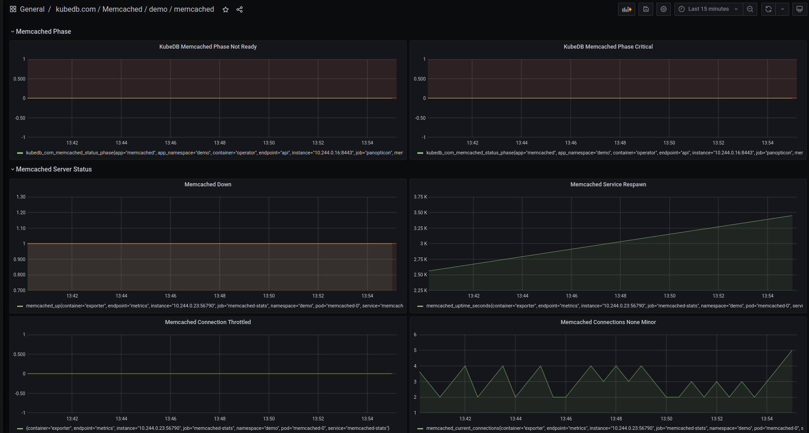
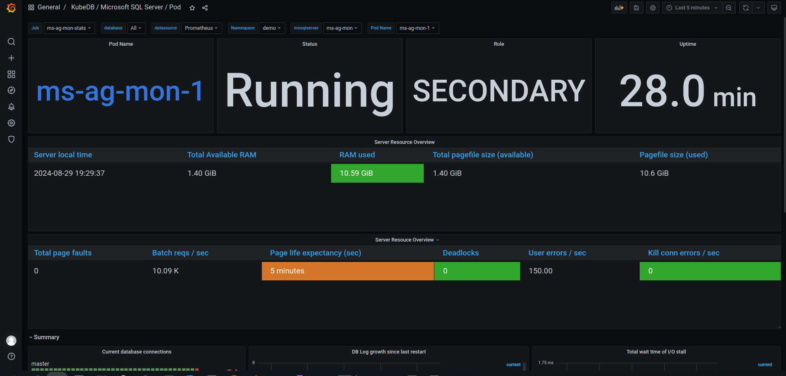
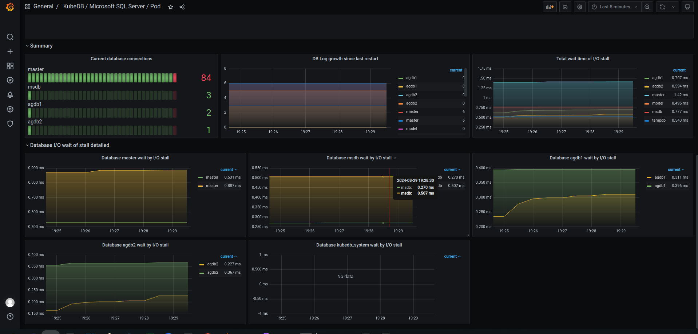

We are thrilled to announce the release of **KubeDB v2024.9.30**. This release introduces several key features, including:

- **New Database Support**: Added new database support Apache Cassandra, broadening our database management capabilities.

- **OpsRequest Support**: Enhanced operational request capabilities for FerretDB, Microsoft SQL Server, PgBouncer, Solr, and ZooKeeper, providing greater management flexibility.
  
- **Autoscaling**: Added autoscaling support for FerretDB and Microsoft SQL Server to automatically adjust resources based on workload demands.
  
- **Network Policies**: We have added support for [NetworkPolicy](https://kubernetes.io/docs/concepts/services-networking/network-policies/) in the release. Now Users can pass `--set global.networkPolicy.enabled=true` while installing KubeDB. The required network policies for operators will be created as part of the release process. And the required network policies for DB will be created by the operator when some database gets provisioned.

- **Backup & Restore**: Comprehensive disaster recovery support for Druid clusters using Kubestash (Stash 2.0), and manifest backup support for SingleStore.

- **Managed ClickHouse Keeper**: Introduced support for internally managed ClickHouse Keeper and KubeDB Managed ClickHouse Keeper Server, expanding options for ClickHouse management.

- **New Version Support**: Added support for MySQL version `8.4.2` and Microsoft SQL Server `2022-cu14`.

For detailed changelogs, please refer to the [CHANGELOG](https://github.com/kubedb/CHANGELOG/blob/master/releases/v2024.9.30/README.md). You can now explore the detailed features and updates included in this release.

## Cassandra

In this release, we are excited to introduce support for Apache Cassandra, a highly scalable and distributed NoSQL database designed to handle large volumes of data with no single point of failure. Known for its high availability, fault tolerance, and strong read/write performance, Cassandra is well-known for applications requiring high throughput, low latency, and seamless scalability. We've added support for provisioning Cassandra in both standalone and cluster modes, custom configuration using Kubernetes secrets, and an authentication option to enhance security.

Here's a sample yaml for provisioning Cassandra in cluster mode consisting of a single rack with 3 replicas using KubeDB. 

```yaml
apiVersion: kubedb.com/v1alpha2
kind: Cassandra
metadata:
  name: cassandra-sample
spec:
  version: 5.0.0
  topology:
    rack:
      - name: rack0
        replicas: 3
        storage:
          accessModes:
            - ReadWriteOnce
          resources:
            requests:
              storage: 1Gi
  deletionPolicy: WipeOut
```
Supported Versions: `4.1.6` & `5.0.0`


## ClickHouse

In this release added `Internally Managed ClickHouse Keeper`, `KubeDB Managed ClickHouse Keeper Server` support. Previously only `Externally Managed ClickHouse Keeper` was supported. This release also added Custom Configuration and Monitoring Support.

You need to set `spec.clusterTopology.clickHouseKeeper.externallyManaged` field as false to use KubeDB managed clickhouse keeper.
Here is the sample yaml for KubeDB Managed ClickHouse Keeper.

```yaml
 apiVersion: kubedb.com/v1alpha2
kind: ClickHouse
metadata:
  name: ch
  namespace: demo
spec:
  version: 24.4.1
  clusterTopology:
    clickHouseKeeper:
      externallyManaged: false
      spec:
        replicas: 3
        storage:
          accessModes:
            - ReadWriteOnce
          resources:
            requests:
              storage: 1Gi
    cluster:
    - name: demoCluster
      shards: 2
      replicas: 2
      storage:
        accessModes:
          - ReadWriteOnce
        resources:
          requests:
            storage: 1Gi
  deletionPolicy: WipeOut
```

You need to set spec.ClusterTopology.ClickHouseKeeper field empty(nil) to use internally managed clickhouse keeper.
Here is the yaml for Internally Managed Clickhouse Keeper.

```yaml
apiVersion: kubedb.com/v1alpha2
kind: ClickHouse
metadata:
  name: ch
  namespace: demo
spec:
  version: 24.4.1
  clusterTopology:
    cluster:
    - name: demoCluster
      shards: 2
      replicas: 2
      storage:
        accessModes:
          - ReadWriteOnce
        resources:
          requests:
            storage: 1Gi
  deletionPolicy: WipeOut
``` 

## Druid
This release introduces support for comprehensive disaster recovery of `Druid` clusters with Stash 2.0, also known as Kubestash. Kubestash, offered by AppsCode, provides a cloud-native backup and recovery solution for Kubernetes workloads, streamlining operations through its operator-driven approach.  It works with any existing KubeDB or Stash license key.

You need to create the following resources to successfully take a backup and restore a `Druid` cluster.

`BackupStorage`: refers to a cloud storage backend (like `s3`, `gcs` etc.) you prefer.

`RetentionPolicy`: allows you to set how long you’d like to retain the backup data.

`Secrets`: hold the backend access credentials and a Restic encryption password to encrypt the backup snapshots.

`BackupConfiguration`: specifies the target database, backend, addon etc. to use to back up the database.

`RestoreSession`: specifies the target database, addon, datasource to use to restore the backed up data. Here is an example of BackupConfiguration

You can take both Logical and Manifest backup of druid clusters separately. Or both together which we call Application Level backup

where we take Application Level backup:


```yaml
apiVersion: core.kubestash.com/v1alpha1
kind: BackupConfiguration
metadata:
  name: sample-druid-backup
  namespace: demo
spec:
  target:
    apiGroup: kubedb.com
    kind: Druid
    namespace: demo
    name: sample-druid
  backends:
    - name: gcs-backend
      storageRef:
        namespace: demo
        name: gcs-storage
      retentionPolicy:
        name: demo-retention
        namespace: demo
  sessions:
    - name: frequent-backup
      scheduler:
        schedule: "*/5 * * * *"
        jobTemplate:
          backoffLimit: 1
      repositories:
        - name: gcs-druid-repo
          backend: gcs-backend
          directory: /druid
          encryptionSecret:
            name: encrypt-secret
            namespace: demo
      addon:
        name: druid-addon
        tasks:
          - name: manifest-backup
          - name: mysql-metadata-storage-backup
```

Here, `mysql-metadata-storage-backup` needs to be replaced with `postgres-metadata-storage-backup` if `PostgreSQL` is used as metadata storage.

Here is an example `RestoreSession` YAML:

```yaml
apiVersion: core.kubestash.com/v1alpha1
kind: RestoreSession
metadata:
  name: restore-sample-druid
  namespace: demo
spec:
  manifestOptions:
    druid:
      restoreNamespace: dev
      dbName: restored-druid
  dataSource:
    repository: gcs-druid-repo
    snapshot: latest
    encryptionSecret:
      name: encrypt-secret
      namespace: demo
  addon:
    name: druid-addon
    tasks:
      - name: mysql-metadata-storage-restore
      - name: manifest-restore
```

## Elasticsearch

We have a bug fix from elasticsearch dashboard size. Previously more than one dashboard in the same cluster was not getting provisioned. In this release, this issue has been fixed.

## FerretDB

### Update version:

The Version Update feature allows you to change the version of FerretDB. The necessary version details should be provided in the `spec.updateVersion.targetVersion` field. Here’s an example YAML configuration:

```yaml
apiVersion: ops.kubedb.com/v1alpha1
kind: FerretDBOpsRequest
metadata:
  name: fr-ops
  namespace: demo
spec:
  serverRef:
    name: fr
  type: UpdateVersion
  updateVersion:
    targetVersion: 1.23.0
```

### AutoScaling

Auto Scaling allows automating the vertical scaling of ferretdb pods. It is only capable of scaling the ferretdb container. 
It will automatically assign enough resources based on the resource uses of the ferretdb container. Bellow is a example yaml file of `FerretDBAutoscaler` CR.

```yaml
apiVersion: autoscaling.kubedb.com/v1alpha1
kind: FerretDBAutoscaler
metadata:
  name: fr-auto
  namespace: demo
spec:
  databaseRef:
    name: ferret
  opsRequestOptions:
    timeout: 3m
    apply: IfReady
  compute:
    ferretdb:
      trigger: "On"
      podLifeTimeThreshold: 5m
      resourceDiffPercentage: 5
      minAllowed:
        cpu: 400m
        memory: 400Mi
      maxAllowed:
        cpu: 500m
        memory: 500Mi
      controlledResources: ["cpu", "memory"]
      containerControlledValues: "RequestsAndLimits"
```

## Kafka

This release added `SASL` authentication mechanism `SCRAM-SHA-256` support. Previously only `PLAIN` was supported. Protocol `BROKER` will support both `PLAIN` and `SCRAM-SHA-256` mechanisms by default. You can also configure `listeners` and `advertised listeners` in the config secret using the following format:

```properties
listener.security.protocol.map=CLIENT:PLAINTEXT
listeners=CLIENT://:9192
<protocol-name>.advertised.listeners=CLIENT://<broker-0-host>:9192,CLIENT://<broker-1-host>:9192, ...... (comma separated for all brokers)
```

If you want to configure different listeners for single protocol, you can use the following format:

```properties
<protocol-name>.listeners=CLIENT://:9192,CLIENT://:9193, ......(comma separated for all brokers)
```

Here, `<protocol-name>` is the lowercase protocol name that you configured in the `listener.security.protocol.map` property. (example: `client.advertised.listeners`)

> **Note**: These properties will append to the default configuration file created by the operator. Other properties will simply override the default configuration.

You can also configure the Kafka cluster ID in the environment variable now. You can use the following format:

For Combined Mode:

```yaml
spec:
  podTemplate:
    spec:
      containers:
        - name: kafka
          env:
            - name: KAFKA_CLUSTER_ID
              value: "4L6g3nShT-eMCtK--X86sw"
```

For the topology mode:

```yaml
spec:
  topology:
    broker:
      podTemplate:
        spec:
          containers:
            - name: kafka
              env:
                - name: KAFKA_CLUSTER_ID
                  value: "4L6g3nShT-eMCtK--X86sw"
    controller:
      podTemplate:
        spec:
          containers:
            - name: kafka
              env:
                - name: KAFKA_CLUSTER_ID
                  value: "4L6g3nShT-eMCtK--X86sw"
```

> **Note**: The `KAFKA_CLUSTER_ID` environment variable is optional. If not provided, the operator will generate a random UUID for the cluster ID. Broker and Controller must have the same cluster ID in the topology mode.

This release also includes custom `log4j.properties` and `tools-log4j.properties` support for kafka and `connect-log4j.properties` for Kafka Connect. You can provide your custom log4j configuration in the config secret creating the same key as the default log4j configuration file name. The operator will mount the custom log4j configuration file in the Kafka and Kafka Connect pods.


## Memcached

This release added configurable alerting support for KubeDB Memcached. Users can configure Alertmanager to receive notifications when a metric of Memcached exceeds a given threshold. Also added an Alert dashboard to enhance the monitoring feature for KubeDB-managed Memcached by integrating Grafana dashboard. This dashboard provides users a visual representation of certain metrics exceeding predefined thresholds and makes it easier to identify and address issues promptly. To learn more, have a look [here](https://github.com/ops-center/alerts/tree/master/charts/memcached-alerts).
Here’s a preview of the Alert dashboard for Memcached:



## Microsoft SQL Server

This release brings several important updates, including OpsRequest and AutoScaling support for Microsoft SQL Server, enhanced Grafana Dashboard integration for improved monitoring, and compatibility with the latest SQL Server version, 2022 CU14.

### OpsRequest

Microsoft SQL Server Ops Request support has been introduced through this release. SQL Server Ops Request provides a declarative configuration for the SQL Server administrative operations like database restart, vertical scaling, volume expansion, etc. in a Kubernetes native way. Ops Requests for Restart, Vertical Scaling, Volume Expansion, Version Update, and Horizontal Scaling have been added in this release. 

#### Restart

Restart ops request is used to perform a smart restart of the SQL Server availability group cluster. An example YAML is provided below:

```yaml
apiVersion: ops.kubedb.com/v1alpha1
kind: MSSQLServerOpsRequest
metadata:
  name: mssql-restart
  namespace: demo
spec:
  type: Restart
  databaseRef:
    name: mssqlserver-ag
  timeout: 3m
  apply: Always
```

#### Vertical Scaling

Vertical Scaling allows you to vertically scale the SQL Server nodes (i.e. pods). The necessary information required for vertical scaling must be provided in the spec.verticalScaling field. Here’s an example yaml for vertical scaling OpsRequest:

```yaml
apiVersion: ops.kubedb.com/v1alpha1
kind: MSSQLServerOpsRequest
metadata:
  name: mssql-vscale
  namespace: demo
spec:
  type: VerticalScaling
  databaseRef:
    name: mssql-ag-cluster
  verticalScaling:
    mssqlserver:
      resources:
        requests:
          memory: "2Gi"
          cpu: "800m"
        limits:
          memory: "2Gi"
          cpu: "800m"
```

#### Volume Expansion

Volume Expansion is used to expand the storage of the SQL Server nodes (i.e. pods). The necessary information required for volume expansion must be provided in spec.volumeExpansion field. An example yaml is provided below:

```yaml
apiVersion: ops.kubedb.com/v1alpha1
kind: MSSQLServerOpsRequest
metadata:
  name: mssql-vol-exp
  namespace: demo
spec:
  type: VolumeExpansion
  databaseRef:
    name: mssql-ag-cluster
  volumeExpansion:   
    mode: "Online"
    mssqlserver: 20Gi
```

#### Horizontal Scaling

Horizontal Scaling allows to horizontally scale SQL Server pods. It can both upscale and downscale the SQL Server Availability Group replicas. The necessary information for horizontal scaling must be provided in the spec.horizontalScaling.replicas field. An example YAML is provided below:

```yaml
apiVersion: ops.kubedb.com/v1alpha1
kind: MSSQLServerOpsRequest
metadata:
  name: mssql-horizontal-scale
  namespace: demo
spec:
  type: HorizontalScaling
 databaseRef:
    name: mssql-ag-cluster
  horizontalScaling:
    replicas: 5
```

#### Update Version

Update version allows updating the version of Microsoft SQL Server. It can work in both ways: older version to new version and vice versa new version to older version. The necessary information for the update version must be provided in the `spec.updateVersion.targetVersion field`. An example YAML is provided below:

```yaml
apiVersion: ops.kubedb.com/v1alpha1
kind: MSSQLServerOpsRequest
metadata:
 name: update-mssql-cluster
 namespace: demo
spec
 type: UpdateVersion
databaseRef:
    name: mssqlserver-ag
  updateVersion:
    targetVersion: 2022-cu14
```

### Autoscaler

This release also adds Autoscaler support for Microsoft SQL Server by introducing MSSQLServerAutoscaler, a Kubernetes Custom Resource Definitions (CRD). It provides a declarative configuration for autoscaling SQL Server compute resources and storage of database components in a Kubernetes native way.

Here’s a sample YAML to deploy Autoscaler for KubeDB managed SQL Server Availability Group cluster.

```yaml
apiVersion: autoscaling.kubedb.com/v1alpha1
kind: MSSQLServerAutoscaler
metadata:
  name: mssql-autoscaler
  namespace: demo
spec:
  databaseRef:
    name: mssql-ag-cluster
  compute:
    mssqlserver:
      trigger: "On"
      podLifeTimeThreshold: 5m
      resourceDiffPercentage: 20
      minAllowed:
        cpu: 800m
        memory: 2Gi
      maxAllowed:
        cpu: 2
        memory: 4Gi
      controlledResources: ["cpu", "memory"]
      containerControlledValues: "RequestsAndLimits"
  storage:
    mssqlserver:
      expansionMode: "Online"
      trigger: "On"
      usageThreshold: 60
      scalingThreshold: 50
```

### Monitoring

This release enhanced monitoring features for KubeDB-managed MicroSoft SQL Server deployments by integrating more Grafana dashboards. Database dashboard for database insights and Pod dashboard for monitoring database pods specifically. The newly added pod and database dashboard provides comprehensive insights into various SQL Server metrics, and statuses, as well as visual representations of memory and CPU consumption. With these dashboards, users can effortlessly assess the overall health and performance of their SQL Server clusters, enabling more informed decision-making and efficient resource management.

Have a look [here](https://github.com/ops-center/grafana-dashboards/tree/master/mssqlserver) for a step-by-step guide on using the monitoring feature of Microsoft SQL Server.

Here’s a preview of the Pod dashboard for SQL Server.





New Version support: `2022-cu14`.

## MongoDB

### Encryption at rest

We have added support of MongoDB `Data Encryption at rest` [feature](https://www.mongodb.com/docs/manual/tutorial/configure-encryption/). You can use your own key management solution to encrypt the data a storage level. [`HashiCorp Vault KMIP`](https://developer.hashicorp.com/vault/docs/secrets/kmip) is a very well-known & recommended approach for key-management solution.
You can follow [this blog](https://appscode.com/blog/post/deploy-mongodb-with-vault-kmip-encryption/) to demonstrate how to configure KubeDB MongoDB with [`HashiCorp Vault KMIP`](https://developer.hashicorp.com/vault/docs/secrets/kmip) secret engine for encryption

### Bug fix
We also have a little fix on point-in-time restoration, when the storage secret is in a different namespace other than db’s namespace.

## MySQL

In this release, we've added support for the new MySQL version `8.4.2`. Additionally, you can now perform version upgrades from `8.0.x`, `8.1.x`, or `8.2.x` to `8.4.2` using the OpsRequest feature.

Here is the sample yaml below,
```yaml
apiVersion: kubedb.com/v1
kind: MySQL
metadata:
  name: my
  namespace: demo
spec:
  version: "8.4.2"
  replicas: 3
  topology:
    mode: GroupReplication
  storageType: Durable
  storage:
    storageClassName: "standard"
    accessModes:
      - ReadWriteOnce
    resources:
      requests:
        storage: 1Gi
  terminationPolicy: WipeOut
```

## PgBouncer

In this release we have added UpdateVersion and Reconfiguration features. Along with this you can start PgBouncer with a custom config secret.

### Update version:

The Version Update feature allows you to change the version of PGBouncer. You can upgrade to a newer version or revert to a previous one. The necessary version details should be provided in the spec.updateVersion.targetVersion field. Here’s an example YAML configuration:

```yaml
apiVersion: ops.kubedb.com/v1alpha1
kind: PgBouncerOpsRequest
metadata:
  name: pb-ops
  namespace: demo
spec:
  serverRef:
    name: pb
  type: UpdateVersion
  updateVersion: 
    targetVersion: 1.23.1
```

### Custom-config:

Previously we had to apply pgbouncer configuration via yaml only. In this release we can apply configuration with secret. Later the PgBouncer resource will run depending on the merged given yaml configuration and the given config-secret configuration. The secret reference should be given in pgbouncer yaml. Here’s an example YAML configuration:

```yaml
apiVersion: kubedb.com/v1
kind: PgBouncer
metadata:
  name: pb
  namespace: demo
spec:
  version: "1.18.0"
  replicas: 1
  database:
    syncUsers: true
    databaseName: "postgres"
    databaseRef:
      name: "pg"
      namespace: demo
  configSecret: 
    name: conf-sec-name
  deletionPolicy: WipeOut

```

### Reconfigure:

#### With ConfigSecret:

```yaml
apiVersion: ops.kubedb.com/v1alpha1
kind: PgBouncerOpsRequest
metadata:
  name: pb-ops
  namespace: demo
spec:
  serverRef:
    name: pb
  type: Reconfigure
  configuration:
    pgbouncer: 
      configSecret:
        name: conf-s
      removeCustomConfig: true      
```

#### With ApplyConfig:

```yaml
apiVersion: ops.kubedb.com/v1alpha1
kind: PgBouncerOpsRequest
metadata:
  name: pb-ops
  namespace: demo
spec:
  serverRef:
    name: pb
  type: Reconfigure
  configuration:
    pgbouncer: 
      applyConfig:
        pgbouncer.ini: |-
          [pgbouncer]
          auth_type = md5
      
```

## Postgres

In a few previous releases, [here](https://kubedb.com/docs/v2024.8.21/guides/postgres/pitr/archiver/) we supported **Point In Time Archive Recovery** using an external volume snapshotter. We have removed this **external dependency** in this release. Now, you will be able to do point in time recovery without the need of an external volume snapshotter. However you will need to use the latest [kubestash](https://kubestash.com/) release from late this month. A detailed documentation will be published soon on this. Only parts where changes are needed will be shown here, rest of them can be found in this [link](https://kubedb.com/docs/v2024.8.21/guides/postgres/pitr/archiver/).

> Note: You can still use volume snapshotter to do **Point In Time Recovery**

First install [kubedb](https://kubedb.com/) & [kubestash](https://kubestash.com/) latest release.
Then create a **Postgres Archiver** CR.

```yaml
apiVersion: archiver.kubedb.com/v1alpha1
kind: PostgresArchiver
metadata:
  name: postgresarchiver-sample
  namespace: demo
spec:
  pause: false
  databases:
    namespaces:
      from: Selector
      selector:
        matchLabels:
         kubernetes.io/metadata.name: demo
    selector:
      matchLabels:
        archiver: "true"
  retentionPolicy:
    name: postgres-retention-policy
    namespace: demo
  encryptionSecret: 
    name: "encrypt-secret"
    namespace: "demo"  
  fullBackup:
    driver: "Restic"
    scheduler:
      successfulJobsHistoryLimit: 1
      failedJobsHistoryLimit: 1
      schedule: "*/10 * * * *"
    sessionHistoryLimit: 2
  manifestBackup:
    scheduler:
      successfulJobsHistoryLimit: 1
      failedJobsHistoryLimit: 1 
      schedule: "30 * * * *"
    sessionHistoryLimit: 2
  backupStorage:
    ref:
      name: "s3-storage"
      namespace: "demo"
```

> Note:  Here in `spec.fullBackup.driver` you have to use **Restic** in order to remove that external Volume Snapshotter dependency. Previously it was **VolumeSnapshotter** which was an external volume snapshotter plugin.

Now apply a **Postgres** CR.

```yaml
apiVersion: kubedb.com/v1alpha2
kind: Postgres
metadata:
  name: ha-postgres
  namespace: demo
  labels:
    archiver: "true"
spec:
  version: "16.1"
  replicas: 3
  clientAuthMode: "md5"
  standbyMode: Hot
  storageType: Durable
  storage:
    accessModes:
    - ReadWriteOnce
    resources:
      requests:
        storage: 3Gi
  terminationPolicy: WipeOut
```

You should see your full-backup succeeded without the need of an external snapshotter. 

Now you can use another **Postgres** CR for archive recovery.

```yaml
apiVersion: kubedb.com/v1alpha2
kind: Postgres
metadata:
  name: restore-pg
  namespace: demo
spec:
  init:
    archiver:
      encryptionSecret:
        name: encrypt-secret
        namespace: demo
      fullDBRepository:
        name: ha-postgres-full
        namespace: demo
      manifestRepository:
        name: ha-postgres-manifest
        namespace: demo
      recoveryTimestamp: "2024-09-25T06:36:13.982904Z" 
  version: "16.1"
  replicas: 3
  standbyMode: Hot
  storageType: Durable
  storage:
    accessModes:
    - ReadWriteOnce
    resources:
      requests:
        storage: 3Gi
  terminationPolicy: WipeOut
```

Also we have added documentation for Postgresql **Arbiter node**, **Autoscaling** and for few Ops requests  **Restart**, **Reconfigure** and **Reconfigure TLS**.

## SingleStore
In this release, we have added support for manifest backups. Using Kubestash, you can able to manifest backup and restore for SingleStore.

Here is the backupconfiguration yaml for manifest backup,

```yaml
apiVersion: core.kubestash.com/v1alpha1
kind: BackupConfiguration
metadata:
  name: sample-singlestore-backup
  namespace: demo
spec:
  target:
    apiGroup: kubedb.com
    kind: Singlestore
    namespace: demo
    name: sample-singlestore
  backends:
    - name: gcs-backend
      storageRef:
        namespace: demo
        name: gcs-storage
      retentionPolicy:
        name: demo-retention
        namespace: demo
  sessions:
    - name: frequent-backup
      scheduler:
        schedule: "*/5 * * * *"
        jobTemplate:
          backoffLimit: 1
      repositories:
        - name: gcs-singlestore-repo
          backend: gcs-backend
          directory: /singlestore
          encryptionSecret:
            name: encrypt-secret
            namespace: demo
      addon:
        name: singlestore-addon
        tasks:
          - name: manifest-backup
          - name: logical-backup
```

Here is  the restoresession yaml for restore manifest-restore,

```yaml
apiVersion: core.kubestash.com/v1alpha1
kind: RestoreSession
metadata:
  name: restore-sample-singlestore
  namespace: demo
spec:
  manifestOptions:
    singlestore:
      restoreNamespace: dev
  dataSource:
    repository: gcs-singlestore-repo
    snapshot: latest
    encryptionSecret:
      name: encrypt-secret
      namespace: demo
  addon:
    name: singlestore-addon
    tasks:
      - name: logical-backup-restore
      - name: manifest-restore
```

## Solr

In this release, we have configured tls in solr. Also horizontal scaling has been added.

To configure tls in solr:

```yaml
apiVersion: kubedb.com/v1alpha2
kind: Solr
metadata:
  name: solr-cluster
  namespace: demo
spec:
  enableSSL: true
  tls:
    issuerRef:
      apiGroup: cert-manager.io
      name: self-signed-issuer
      kind: ClusterIssuer
    certificates:
    - alias: server
      subject:
        organizations:
        - kubedb:server
      dnsNames:
      - localhost
      ipAddresses:
      - "127.0.0.1"
  version: 9.4.1
  topology:
    overseer:
      replicas: 1
      storage:
        accessModes:
          - ReadWriteOnce
        resources:
          requests:
            storage: 1Gi
        storageClassName: standard
    data:
      replicas: 3
      storage:
        accessModes:
          - ReadWriteOnce
        resources:
          requests:
            storage: 1Gi
        storageClassName: standard
    coordinator:
      storage:
        accessModes:
          - ReadWriteOnce
        resources:
          requests:
            storage: 1Gi
        storageClassName: standard
```

For horizontal scaling:

```yaml
apiVersion: ops.kubedb.com/v1alpha1
kind: SolrOpsRequest
metadata:
  name: solr-hscale
  namespace: demo
spec:
  databaseRef:
    name: solr-cluster
  type: HorizontalScaling
  horizontalScaling:
    coordinator: 2
    data: 3
    overseer: 2
```

## ZooKeeper

ZooKeeper Ops Request support has been introduced through this release. Ops Request for Restart, Update Version, Vertical Scaling, Horizontal Scaling, Volume Expansion and Reconfiguration have been added.

### Restart
Restart ops request is used to perform a smart restart of the ZooKeeper. An example YAML is provided below:

```yaml
apiVersion: ops.kubedb.com/v1alpha1
kind: ZooKeeperOpsRequest
metadata:
  name: zk-restart
  namespace: demo
spec:
  type: Restart
  databaseRef:
    name: zk-quickstart
```

### Update Version

Update version allows updating the version of ZooKeeper. It can work in both ways: older version to new version and vice versa new version to older version. The necessary information for the update version must be provided in the spec.updateVersion.targetVersion field. An example YAML is provided below:

```yaml
apiVersion: ops.kubedb.com/v1alpha1
kind: ZooKeeperOpsRequest
metadata:
  name: upgrade-topology
  namespace: demo
spec:
  databaseRef:
    name: zk-quickstart
  type: UpdateVersion
  updateVersion:
    targetVersion: 3.9.1
```

### Vertical Scaling
Vertical Scaling allows you to vertically scale the ZooKeeper nodes (i.e. pods). The necessary information required for vertical scaling, must be provided in the spec.verticalScaling field. An example YAML is provided below:

```yaml
apiVersion: ops.kubedb.com/v1alpha1
kind: ZooKeeperOpsRequest
metadata:
  name: vscale
  namespace: demo
spec:
  databaseRef:
    name: zk-quickstart
  type: VerticalScaling
  verticalScaling:
    node:
      resources:
        limits:
          cpu: 2
          memory: 2.3Gi
        requests:
          cpu: 2
          memory: 2.3Gi
```

### Horizontal Scaling

Horizontal Scaling enables you to adjust the number of ZooKeeper pods by scaling horizontally, either increasing or decreasing the number of replicas. The required details for horizontal scaling should be provided in the spec.horizontalScaling.node field. Below is an example YAML configuration:

```yaml
apiVersion: ops.kubedb.com/v1alpha1
kind: ZooKeeperOpsRequest
metadata:
  name: zk-horizontal-scale
  namespace: demo
spec:
  type: HorizontalScaling  
  databaseRef:
    name: zk-quickstart
  horizontalScaling:
    replicas: 3
```

### Volume Expansion

Volume Expansion is used to expand the storage of the ZooKeeper nodes (i.e. pods). The necessary information required for volume expansion, must be provided in spec.volumeExpansion field. An example yaml is provided below:

```yaml
apiVersion: ops.kubedb.com/v1alpha1
kind: ZooKeeperOpsRequest
metadata:
  name: online-volume-expansion
  namespace: demo
spec:
  type: VolumeExpansion  
  databaseRef:
    name: zk-quickstart
  volumeExpansion:   
    mode: "Online"
    node: 3Gi
```

### Reconfiguration

Reconfiguration allows you to update the configuration through a new secret or apply a config. Users can also remove the custom config using RemoveCustomConfig. The spec.configuration field needs to contain the data required for reconfiguration. An example yaml is provided below:

```yaml
apiVersion: ops.kubedb.com/v1alpha1
kind: ZooKeeperOpsRequest
metadata:
  name: myops-reconfigure-config
  namespace: demo
spec:
  apply: IfReady
  configuration:
    applyConfig:
      zoo.cfg: |
        max_connections = 300
        read_buffer_size = 1048576
  databaseRef:
    name: zk-quickstart
  type: Reconfigure
```

## Support

To speak with us, please leave a message on [our website](https://appscode.com/contact/).

To receive product announcements, follow us on [Twitter/X](https://x.com/KubeDB).

To watch tutorials of various Production-Grade Kubernetes Tools Subscribe our [YouTube](https://www.youtube.com/c/AppsCodeInc/) channel.

Learn More about [Production-Grade Databases in Kubernetes](https://kubedb.com/)

If you have found a bug with KubeDB or want to request for new features, please [file an issue](https://github.com/kubedb/project/issues/new).
