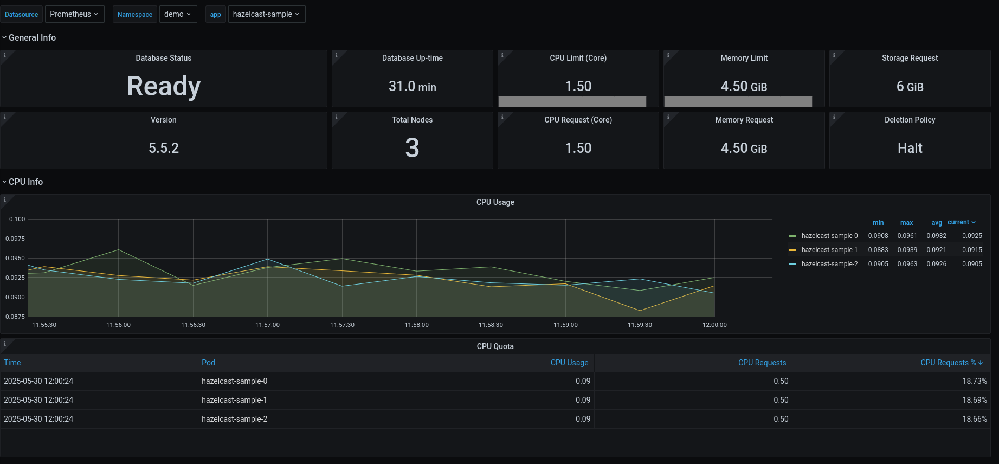
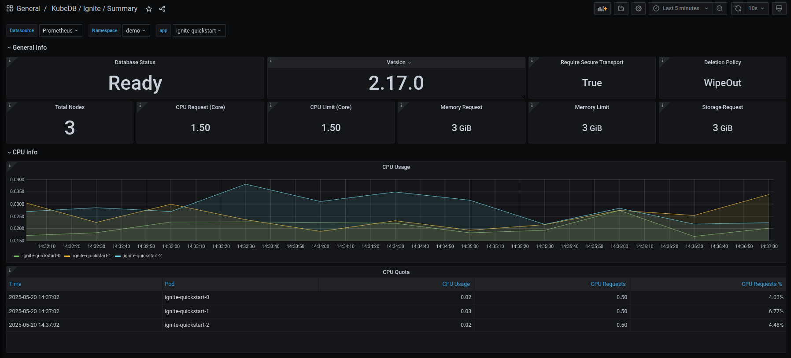
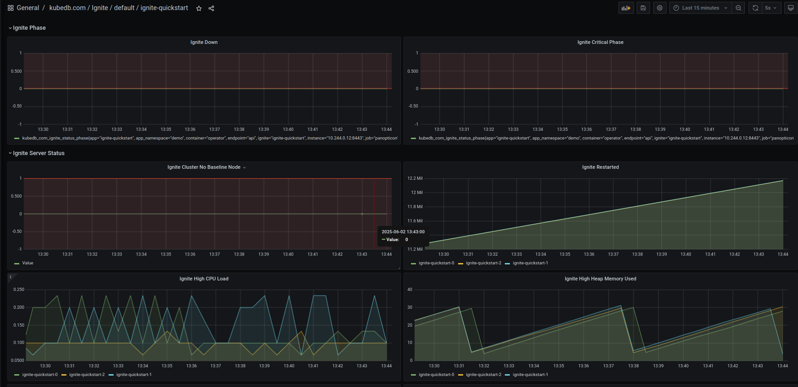

KubeDB **v2025.5.30** is here, bringing enhanced performance, expanded database support, and streamlined management for Kubernetes-based database deployments. This release introduces new features, improved reliability, and broader GitOps integration, making database operations more efficient and production-ready.

## Key Changes
- **New Database Support**: Added support for **Oracle Database**, a robust and scalable enterprise-grade relational database system designed for high-performance transactions, analytics, and mission-critical workloads.
- **Expanded GitOps Support**: Extended GitOps capabilities to include Elasticsearch, MSSQLServer, and MySQL.
- **Expanded OpsRequest Support**: Added new Ops Requests support for various DBs.
- **New Versions**: Added support for new versions of various DBs.

## Cassandra

In this release, we have introduced `Restart`,` VerticalScaling` and `UpdateVersion` OpsRequests for KubeDB managed Cassandra. Users can easily manage Cassandra instances by using these OpsRequests. Currently, a user can only update versions from version 4.1.8 to version 5.0.3 .

### Restart:

```
apiVersion: ops.kubedb.com/v1alpha1
kind: CassandraOpsRequest
metadata:
  name: restart
  namespace: default
spec:
  type: Restart
  databaseRef:
    name: cass
  timeout: 3m
  apply: Always
```


### Vertical Scaling:

```
apiVersion: ops.kubedb.com/v1alpha1
kind: CassandraOpsRequest
metadata:
  name: cassandra-vertical-scale
  namespace: default
spec:
  type: VerticalScaling
  databaseRef:
    name: cass
  verticalScaling:
    node:
      resources:
        requests:
          memory: "2Gi"
          cpu: "1"
        limits:
          memory: "2Gi"
          cpu: "1"
  timeout: 5m
  apply: IfReady
```


### Update Version:

```
apiVersion: ops.kubedb.com/v1alpha1
kind: CassandraOpsRequest
metadata:
  name: cassandra-update-version
  namespace: default
spec:
  type: UpdateVersion
  databaseRef:
    name: cass
  updateVersion:
    targetVersion: 5.0.3
  timeout: 5m
  apply: IfReady
```

## Clickhouse

In this release, we've enhanced the ClickHouse client with support for TLS-enabled external disks using self-signed certificates. You can now specify your CA certificate in the spec.tls.clientCaCertificateRefs field, which will be used to establish secure connections with external storage system.
Example configuration:
```yaml
spec:
  tls:
    clientCaCertificateRefs:
      - name: "tls-minio"
        key: ca.crt
```

### Restart and Vertical Scaling OpsRequest
We are introducing Restart and Vertical-Scaling Ops-Requests for ClickHouse. These operations enable seamless management of ClickHouse instances, allowing you to restart or adjust resource allocations efficiently. Example manifest files for performing these operations are available below:

**Restart:**

```yaml
apiVersion: ops.kubedb.com/v1alpha1
kind: ClickHouseOpsRequest
metadata:
  name: restart
  namespace: demo
spec:
  type: Restart
  databaseRef:
    name: ch
  timeout: 3m
  apply: Always
```

**Vertical Scaling:**

### For Standalone Mode


```yaml
apiVersion: ops.kubedb.com/v1alpha1
kind: ClickHouseOpsRequest
metadata:
  name: ch-vertical-scale-standalone
  namespace: demo
spec:
  type: VerticalScaling
  databaseRef:
    name: ch
  verticalScaling:
    standalone:
      resources:
        requests:
          memory: "3Gi"
          cpu: "1"
        limits:
          memory: "3Gi"
          cpu: "1"
```


### For Cluster Mode

```yaml
apiVersion: ops.kubedb.com/v1alpha1
kind: ClickHouseOpsRequest
metadata:
  name: ch-vertical-scale-multi-cluster
  namespace: demo
spec:
  type: VerticalScaling
  databaseRef:
    name: ch
  verticalScaling:
    cluster:
     - clusterName: appscode-cluster
       node:
         resources:
           requests:
             memory: "2Gi"
             cpu: "1"
           limits:
             memory: "2Gi"
             cpu: "1"

     - clusterName: appscode-cluster2
       node:
         resources:
           requests:
             memory: "1Gi"
             cpu: "1"
           limits:
             memory: "1Gi"
             cpu: "1"
```


## Hazelcast

We are very pleased to inform you that we have added support for **Hazelcast** Database. You can either run  **Hazelcast** database in `Standalone` mode with only one replica or `Replicaset` mode with `replicas >= 1`. Currently, we are only supporting Hazelcast Version `5.5.2`.

We need to take a license from Hazelcast and add the license to a Kubernetes secret and use it as a reference while provisioning **Hazelcast**.
```bash
kubectl create secret generic hz-license-key --from-literal=licenseKey="RETRIEVED LICENSE" -n demo
secret demo/hz-license-key created
```

### Deploy a `Standalone` Hazelcast Instance
Save and apply this YAML.

```yaml
apiVersion: kubedb.com/v1alpha2
kind: Hazelcast
metadata:
  name: hazelcast-standalone
  namespace: demo
spec:
  deletionPolicy: WipeOut
  licenseSecret:
    name: hz-license-key
  replicas: 1
  version: 5.5.2
  storage:
    accessModes:
      - ReadWriteOnce
    resources:
      requests:
        storage: 2Gi

```

```bash
$ kubectl get hazelcast -n demo hazelcast-standalone 
NAME                              VERSION         STATUS   AGE
hazelcast-standalone               5.5.2          Ready   2m39s
```

### Deploy a `Replicaset` Instance with multiple replicas

Save and apply this yaml.
```yaml
apiVersion: kubedb.com/v1alpha2
kind: Hazelcast
metadata:
  name: hazelcast-sample
  namespace: demo
spec:
  deletionPolicy: WipeOut
  licenseSecret:
    name: hz-license-key
  replicas: 3
  version: 5.5.2
  storage:
    accessModes:
      - ReadWriteOnce
    resources:
      requests:
        storage: 2Gi

```

```bash
➤ kubectl get hazelcast -n demo hazelcast-sample
NAME                    VERSION   STATUS   AGE
hazelcast-sample   5.5.2           Ready      4m
➤ kubectl get pods -n demo
NAME                       READY   STATUS    RESTARTS   AGE
hazelcast-sample-0         1/1     Running   0          4m
hazelcast-sample-1         1/1     Running   0          3m25s
hazelcast-sample-2         1/1     Running   0          2m55s
```

### Hazelcast Monitoring Support
This release introduces an enhanced monitoring feature for KubeDB-managed **Hazelcast** deployments by integrating Grafana dashboards. These dashboards provide comprehensive insights into various `Hazelcast-Specific` metrics, statuses, as well as visual representations of memory and CPU consumption. With this dashboard, users can effortlessly assess the overall health and performance of **Hazelcast**, enabling more informed decision-making and efficient resource management.
Have a look [here](https://github.com/ops-center/grafana-dashboards/tree/master/hazelcast) for a step-by-step guide to use the monitoring feature in **Hazelcast**.

Here’s a preview of the Summary dashboard for **Hazelcast**:



Also added configurable alerting support for KubeDB **Hazelcast**. Users can configure Alertmanager to receive notifications when a metric of **Hazelcast** exceeds a given threshold. Also added an Alert dashboard to enhance the monitoring feature for KubeDB-managed **Hazelcast** by integrating a Grafana dashboard. This dashboard provides users with a visual representation of certain metrics exceeding predefined thresholds and makes it easier to identify and address issues promptly. To learn more, have a look [here](https://github.com/ops-center/alerts/tree/master/charts/hazelcast-alerts).

## Apache Ignite
### Add Monitoring Support

This release introduces an enhanced monitoring feature for KubeDB-managed Ignite deployments by integrating Grafana dashboards. These dashboards provide comprehensive insights into various Ignite-specific metrics, statuses, as well as visual representations of memory and CPU consumption. With this dashboard, users can effortlessly assess the overall health and performance of Ignite, enabling more informed decision-making and efficient resource management.
Have a look [here](https://github.com/ops-center/grafana-dashboards/tree/master/ignite) for a step-by-step guide to use the monitoring feature in Ignite.

Here’s a preview of the Summary dashboard for Ignite:



Also added configurable alerting support for KubeDB Ignite. Users can configure Alertmanager to receive notifications when a metric of Ignite exceeds a given threshold. Also added an Alert dashboard to enhance the monitoring feature for KubeDB-managed Ignite by integrating Grafana dashboard. This dashboard provides users a visual representation of certain metrics exceeding predefined thresholds and makes it easier to identify and address issues promptly. To learn more, have a look [here](https://github.com/ops-center/alerts/tree/master/charts/ignite-alerts).

Here’s a preview of the Alert dashboard for Ignite:



## MariaDB

In this release, we are excited to introduce TLS support for MariaDB Replication Topology. This enhancement ensures secure data transmission across the replication topology, providing encrypted communication between nodes to safeguard sensitive data and enhance overall security. By enabling TLS, users can now confidently deploy MariaDB replication in environments requiring stringent data protection, ensuring compliance with security best practices while maintaining the reliability and performance of the replication process.
we have addressed a bug affecting the MariaDB archiver. Previously, the TLS-enabled MinIO S3 bucket was not functioning correctly, particularly with Sidekick, which failed to push the binlog file. We identified and resolved this issue in the current release.


## MySQL 

In this release, we have addressed a bug affecting the MySQL archiver. Previously, the TLS-enabled MinIO S3 bucket was not functioning correctly, particularly with Sidekick, which failed to push the binlog file. We identified and resolved this issue in the current release.

## Oracle

We are very pleased to inform you that we have added support for **Oracle** Database. You can either run `Standalone` instance of oracle database or `Dataguard` mode with `replicas >= 1`. Currently we are only supporting Oracle Version `21.3.0`.

### Deploy a `Standalone` Oracle Instance
Save and apply this yaml.

```yaml
apiVersion: kubedb.com/v1alpha2
kind: Oracle
metadata:
  name: oracle-standalone
  namespace: demo
spec:
  version: "oracle-21.3.0"
  replicas: 1
  edition: "enterprise"
  mode: "Standalone"
  storage:
     accessModes:
       - ReadWriteOnce
     resources:
       requests:
         storage: 30Gi
```

```bash
➤ kubectl get oracle -n demo oracle-standalone 
NAME                VERSION         MODE         STATUS   AGE
oracle-standalone   oracle-21.3.0   Standalone   Ready    8m39s
```

### Deploy a `Dataguard` Instance with multiple replicas

Save and apply this yaml.
```yaml
apiVersion: kubedb.com/v1alpha2
kind: Oracle
metadata:
  name: oracle-sample
  namespace: demo
spec:
  version: "oracle-21.3.0"
  replicas: 3
  edition: "enterprise"
  mode: "DataGuard"
  storage:
     accessModes:
       - ReadWriteOnce
     resources:
       requests:
         storage: 30Gi

```

```bash
➤ kubectl get oracle -n demo oracle-sample
NAME            VERSION         MODE        STATUS   AGE
oracle-sample   oracle-21.3.0   DataGuard   Ready    102m

➤ kubectl get pods -n demo
NAME                       READY   STATUS    RESTARTS   AGE
oracle-sample-0            2/2     Running   0          58m
oracle-sample-1            2/2     Running   0          86m
oracle-sample-2            2/2     Running   0          86m
oracle-sample-observer-0   1/1     Running   0          103m
```

> Here `oracle-sample-observer-0` is the `Datagurad Observer` pod looking after the failover scenarios. Also Database creation phase might take upto 30 minutes depending on your infrastructure capability.

### Considerations
In order to run kubedb-managed `Oracle` database, you will need to edit the `.spec.db.image` and `.spec.dataGuard.observer.image` field of `OracleVersion` Custom Resource Object. For example,

```yaml
apiVersion: catalog.kubedb.com/v1alpha1
kind: OracleVersion
metadata:
  name: oracle-21.3.0
spec:
  coordinator:
    image: ghcr.io/kubedb/oracle-coordinator:v0.1.0
  dataGuard:
    initContainer:
      image: busybox:1.36
    observer:
      image: “your_db_image” # Put your db image here.
  db:
    baseOS: debian
    image: “your_db_image” # Put your db image here.
  exporter:
    image: ""
  initContainer:
    image: ghcr.io/kubedb/oracle-init:v0.1.0
  securityContext:
    runAsUser: 54321
  updateConstraints:
    allowlist:
    - 21.3.1
  version: 21.3.0

```

### Procedure to make your Oracle image
- Download zip file from [here](https://www.oracle.com/database/technologies/oracle-database-software-downloads.html#db_ee)
- Build image following instructions given [here](https://github.com/oracle/docker-images/tree/main/OracleDatabase/SingleInstance).
- Optionally contact us using `https://appscode.freshdesk.com/`.


## PostgreSQL
### New Version Support

We have expanded our supported postgres version list by adding new postgres version 17.5, 16.9, 15.13, 14.18, and 13.21.

### Feature Improvements

In this release we have changed the behavior of `postgres.spec.init`. In previous releases, we were running init script each and every time our db pods were restarting, from now on we will only use this init script only once at the db **bootstrapping** phase.


## ProxySQL

### Added support for `caching_sha2_password` authentication
KubeDB ProxySQL now supports the caching_sha2_password authentication plugin for frontend connections, aligning with MySQL's shift in version 8.4, where caching_sha2_password became the default authentication method. This plugin offers enhanced security and performance through SHA-256 password hashing and server-side caching. Notably, the previously used mysql_native_password plugin has been deprecated and is disabled by default in MySQL 8.4, with complete removal in MySQL 9.0.
This update ensures that KubeDB ProxySQL remains compatible with modern MySQL authentication standards, facilitating secure and efficient database connections.

### New Version Support
We have added a new ProxySQL version `3.0.1`.

## RabbitMQ
### New OpsRequest Support
`RotateAuth` OpsRequest for `RabbitMQ` has been added. If a user wants to update the authentication credentials for a particular database, they can create an OpsRequest of type `RotateAuth` with or without referencing an authentication secret. If the secret is not referenced, the ops-manager operator will create a new credential and update the current secret. Here is the Yaml for rotating authentication credentials for a Rabbitmq cluster using  RabbitMQOpsRequest.
```yaml
apiVersion: ops.kubedb.com/v1alpha1
kind: RabbitMQOpsRequest
metadata:
  name: rm-generated-auth-ops
  namespace: demo
spec:
  type: RotateAuth
  databaseRef:
    name: rm-quickstart
```

If the secret is referenced, the operator will update the `.spec.authSecret.name` with the new secret name. Here is the yaml of new Secret:

```yaml
apiVersion: v1
kind: Secret
metadata:
  name: my-secret
  namespace: demo
type: kubernetes.io/basic-auth
stringData:
  username: admin
  password: custompass
```
```yaml
apiVersion: ops.kubedb.com/v1alpha1
kind: RabbitMQOpsRequest
metadata:
  name: user-credential-change
  namespace: demo
spec:
  type: RotateAuth
  databaseRef:
    name: rm-quickstart
  authentication:
    secretRef:
      name: my-secret
```
Finally, the operator will update the database cluster with the new credential and the old credentials will be stored in the secret with keys `username.prev` and `password.prev`. We have added a field `.spec.authSecret.activeFrom` to the db yaml which refers to the timestamp of the credential is active from. We also add an annotation `kubedb.com/auth-active-from` in currently using auth secret which refers to the active from time of this secret.


## Redis
### New Feature: Rotate Authentication Credentials for Redis
`RotateAuth` OpsRequest for `Redis` has been added. If a user wants to update the authentication credentials for a particular database, they can create an `OpsRequest` of type `RotateAuth` with or without referencing an authentication secret.

#### Rotate Authentication Without Referencing a Secret
If the secret is not referenced, the `ops-manager` operator will create new credentials and update the existing secret with the new credentials, keeping previous credentials under the keys `username.prev` and `password.prev`.

Example YAML:
```yaml
apiVersion: ops.kubedb.com/v1alpha1
kind: RedisOpsRequest
metadata:
  name: redis-rotate-auth
  namespace: demo
spec:
  type: RotateAuth
  databaseRef:
    name: rd-demo
```

#### Rotate Authentication With a Referenced Secret
If a secret is referenced, the operator will update the `.spec.authSecret.name` field with the new secret name. Archives the old credentials in the newly created secret under the keys `username.prev` and `password.prev`.

New Secret Example:
```yaml
apiVersion: v1
data:
  password: bXlQYXNzd29yZA==
  username: ZGVmYXVsdA==
kind: Secret
metadata:
  name: my-auth
  namespace: demo
type: kubernetes.io/basic-auth
```

Example YAML with Secret Reference:
```yaml
apiVersion: ops.kubedb.com/v1alpha1
kind: RedisOpsRequest
metadata:
  name: rdops-rotate-auth
  namespace: demo
spec:
  type: RotateAuth
  databaseRef:
    name: redis-cluster
  authentication:
    secretRef:
      name: my-auth
```
We have also added a field `.spec.authSecret.activeFrom` to the db yaml which refers to the timestamp of the credential is active from. We also add an annotation `kubedb.com/auth-active-from` in currently using auth secret which refers to the active from time of this secret.

## RedisSentinel

### Rotate Authentication Credentials for RedisSentinel
`RotateAuth` OpsRequest for `RedisSentinel` has been added as well. If a user wants to update the authentication credentials for `RedisSentinel`, they can create an `OpsRequest` of type `RotateAuth` with or without referencing an authentication secret in the same way as mentioned for `Redis`.

Example YAML with Secret Reference:
```yaml
apiVersion: ops.kubedb.com/v1alpha1
kind: RedisSentinelOpsRequest
metadata:
  name: redis-sentinel-rotate
  namespace: demo
spec:
  type: RotateAuth
  databaseRef:
    name: sen-demo
  authentication:
    secretRef:
      name: my-auth
```

**Note:**  The `RotateAuth` OpsRequest can also be applied for the `Valkey` database as well in the same way shown above for Redis. 

## SingleStore

In this release, we have addressed a bug related to the SingleStore Backup process. Previously the `databases` flag was not functioning properly, which occasionally caused issues during backup. This issue has been fixed in this release.

## GitOps Enhancements
GitOps support now extends to Elasticsearch, MSSQLServer, and MySQL, in addition to the previous databases. The `gitops.kubedb.com/v1alpha1` CRD enables seamless integration with GitOps tools like ArgoCD and Flux, automating database provisioning and reconciliation.

Here is the sample YAML:
```yaml
apiVersion: gitops.kubedb.com/v1alpha1
kind: MySQL
metadata:
  name: my-group-gitops
  namespace: demo
spec:
  version: "8.0.35"
  replicas: 3
  topology:
    mode: GroupReplication
  podTemplate:
    spec:
      containers:
      - name: mysql
        resources:
          limits:
            memory: 1Gi
          requests:
            cpu: 500m
            memory: 1Gi
  storageType: Durable
  storage:
    storageClassName: "standard"
    accessModes:
      - ReadWriteOnce
    resources:
      requests:
        storage: 1Gi
  deletionPolicy: WipeOut
```


## Support
- **Contact Us**: Reach out via [our website](https://appscode.com/contact/).
- **Stay Updated**: Follow us on [Twitter/X](https://x.com/KubeDB) for product announcements.
- **Tutorials**: Subscribe to our [YouTube channel](https://youtube.com/@appscode) for tutorials on production-grade Kubernetes tools.
- **Learn More**: Explore [Production-Grade Databases in Kubernetes](https://kubedb.com/).
- **Report Issues**: File bugs or feature requests on [GitHub](https://github.com/kubedb/project/issues/new).