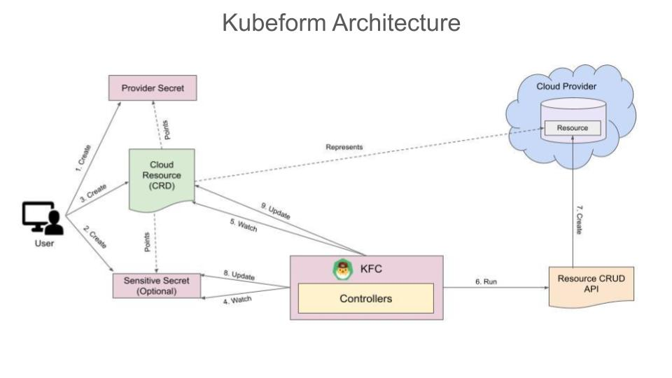

We are happy to announce Kubeform v2021.07.13. This post lists all the changes and features this release brings to you.

* Kubeform Enterprise
* Re-designed the Architecture of Kubeform
* No Dependency on Terraform CLI
* Accidental Deletion Protection
* Update Policy
* Sensitive Secret Watcher
* New Status and Conditions
* Dropped support for Terraform Module

## What is Kubeform?

Kubeform by AppsCode is a Kubernetes controller provisioning cloud or on-prem resources using Terraform providers. Kubeform provides Kubernetes CRDs for Terraform resources so that you can manage any cloud infrastructure in a Kubernetes native way. You just write a CRD for your cloud infrastructure, apply it and Kubeform will create it for you! Kubeform currently supports 5 top cloud platforms. These are AWS, Google Cloud, Azure, DigitalOcean, and Linode.

## Kubeform Enterprise

In this release, we are announcing the Kubeform Enterprise edition. Currently, In the Kubeform community edition, you can do everything the enterprise edition does, but you will be limited to only the `default` namespace. We plan to bring some exciting new features in the enterprise edition that will not be available to the community edition in the future release. Please see the "Upcoming Features" section to get an idea of the upcoming features.

## Re-designed the Architecture of Kubeform

In this release, we have re-designed the Kubeform architecture. Kubeform controller is now divided into 5 different controllers, one controller for each cloud provider.

1) At first, a user creates a provider secret with access credentials of the Cloud provider where the resource will be created.
2) Then, he creates a sensitive secret with sensitive fields of the cloud resource that he wants to create. This is optional, if a user do not create a sensitive secret then kfc will create a sensitive secret if the cloud resource has any sensitive field.
3) Then, he creates a CRD of the resource that specifies the information of the Cloud Resource. The CRD also points to the secrets that he created.
4) The KubeForm Controller (KFC) watches the created CRD and also the sensitive secret continuously.
5) If the KubeForm Controller (KFC) get any new changes in sensitive secret or in the CRD it starts reconciling and the resource enters into InProgress phase.
6) The KubeForm Controller (KFC) Create, Update or Delete the respective cloud resource through the Resource CRUD API.
7) If the resource is being Created or Updated the resource enters into InProgress phase. When the reconciling process ends and resource successfully created or updated theen the phase is Current.
8) The KubeForm Controller (KFC) update the resource spec.state after successfully creating or updating the resource.
9) If the resource is being Deleted then the resource phase is Terminating.
10) The KubeForm Controller (KFC) deletes the resource after the respective cloud resource get destroyed.

## No Dependency on Terraform CLI

We removed dependency from the Terraform CLI. Previously, we used the terraform CLI in the Kubeform controller to provision the cloud resources. But, from this release, we are not using the Terraform CLI anymore, instead, we are using the respective resource APIs to manage the resources via the Kubeform controllers.

## Accidental Deletion Protection

This release adds TerminationPolicy to protect the resource against accidental deletion. You can provide `DoNotTerminate` as the `TerminationPolicy` of your resource. When you delete the resource that has DoNotTerminate set as its TerminationPolicy, you will get an error message from the validation webhook saying that, the resource can not be terminated when TerminationPolicy is set to DoNotTerminate. So, this protects you from the accidental deletion of the resource. If you want to terminate the resource, you can update the TerminationPolicy as Delete. Then, the resource will be terminated successfully without any error.

## Update Policy

There are some fields which are mutable and some are immutable in cloud provider resources. If we change mutable fields and update the resource it will get updated but if we change immutable fields and update then first the existing resource will get deleted and then it will be recreated with the latest values. We have added `UpdatePolicy` to ensure that the resource doesn’t get deleted without your approval while updating the resource. If the user sets the UpdatePolicy as `DoNotDestroy`, the resource will not get deleted in the process of updating. The kubeform resource will be in the Failed state. To recover from this, the user will have to change the UpdatePolicy to Destroy or the field that will cause the resource to be deleted and then recreated again. We plan to add this in the validation webhook so that the user gets the error while applying the resource.

## Sensitive Secret Watcher

We added a sensitive secret watcher. So, whenever there is a change in the sensitive secret, the kubeform resource will be reconciled by the controller and the corresponding cloud resource will be updated.

## New Status and Conditions

Kubeform resources now have 4 status phases. These are:

* **InProgress**: It means the resource is now reconciling.
* **Current**: It means the resource is reconciled successfully and the corresponding cloud resource is updated.
* **Terminating**: It means the resource is currently in the process of deleting.
* **Failed**: It means the resource has encountered some error while reconciling.

We also added conditions in the kubeform resources.

## Dropped support for Terraform Module

In this release, We dropped support for the Terraform module.

## Upcoming Features

* Remote backend for the resources. The resource state can be maintained remotely, such as google bucket, amazon s3 bucket, etc.
* A CLI command to generate Terraform `.tf` files from the kubeform resources.
* A CLI command to check the execution plan of the kubeform resources. Using this plan, you will know the configuration of the resource that will be created by kubeform,  the changes in the resource when updating the resource configuration, etc.
* Halt and Resume resources. Using this feature, you can keep the resource in the Kubernetes, but terminate the actual cloud resource. Then, when you need the resource again, you can just resume the resource and the same resource will be created again!
* Seamless integration with KubeDB. KubeDB is a product by AppsCode that simplifies and automates routine database tasks such as provisioning, patching, backup, recovery, failure detection, and repair for various popular databases on private and public clouds.

## What Next?

Please try the latest release and give us your valuable feedback.

* If you want to install Kubeform, please follow the installation instruction from [here](http://www.kubeform.com/docs/latest/setup).

* If you want to upgrade Kubeform from a previous version, please follow the upgrade instruction from [here](http://www.kubeform.com/docs/latest/setup/upgrade).

## Support

To speak with us, please leave a message on [our website](https://appscode.com/contact/).

To join public discussions with the Kubeform community, join us in the [Kubernetes Slack team](https://appscode.slack.com/messages/C8NCX6N23/details/) channel `#kubeform`. To sign up, use our [Slack inviter](https://slack.appscode.com/).

To receive product announcements, follow us on [Twitter](https://twitter.com/kubeform).

If you have found a bug with Kubeform or want to request for new features, please [file an issue](https://github.com/kubeform/kubeform/issues/new).
