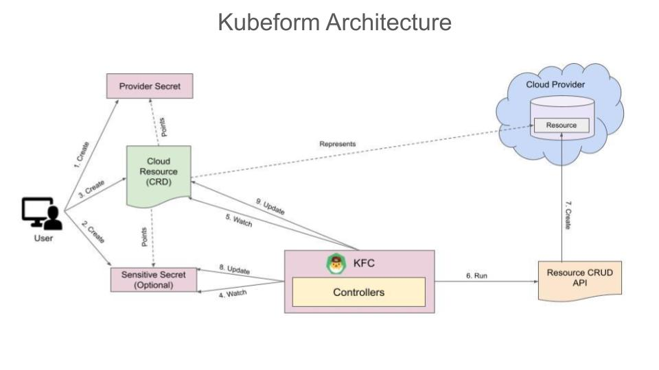

> We have released `Kubeform v2021.08.02` with support for additional cloud services. You can find the full list [here](https://kubeform.com/pricing/). To try for FREE, visit our [installer webpage](https://kubeform.com/docs/v2021.08.02/setup/). Enjoy! 

We are happy to announce **Kubeform v2021.07.28**. This post lists all the changes and features this release brings to you.

* Kubeform Enterprise
* Support for Equinix Metal
* Re-designed the Architecture of Kubeform
* No Dependency on Terraform CLI
* Accidental Deletion Protection
* Update Policy
* Sensitive Secret Watcher
* Kubernetes recommended Status conditions
* Dropped support for Terraform Module

## What is Kubeform?

Kubeform by AppsCode is a Kubernetes operator provisioning cloud or on-prem resources using [Terraform](https://terraform.io) providers. Kubeform provides Kubernetes CRDs for Terraform resources so that you can manage any cloud infrastructure in a Kubernetes native way. You just write a CRD for your cloud infrastructure, apply it and Kubeform will create it for you! Kubeform currently supports 6 top cloud platforms. These are AWS, Google Cloud, Azure, DigitalOcean, Linode and Equinix Metal. To know more about Kubeform you can visit the product website [here](https://kubeform.com/).

## Kubeform Enterprise

In this release, we are announcing the **Kubeform Enterprise** edition. Currently, In the **Kubeform community** edition, you can do everything the enterprise edition does, but you will be limited to only the `default` namespace. We plan to bring some exciting new features in the enterprise edition that will not be available to the community edition in the future release. Please see the **Upcoming Features** section to get an idea of the upcoming features.

## Support for Equinix Metal

In this release, we have added support for the [Equinix Metal](http://equinix.com) cloud provider. To provision an Equinix Metal Device using Kubeform, please follow the guide [here](https://kubeform.com/docs/latest/guides/equinixmetal).

## Re-designed the Architecture of Kubeform

In this release, we have re-designed the Kubeform architecture. Kubeform operator is now divided into 6 different controllers, one controller for each cloud provider. You can see the details [here](http://kubeform.com/docs/latest/concepts/what-is-Kubeform/architecture).

## No Dependency on Terraform CLI

We removed dependency from the Terraform CLI. Previously, we used the terraform CLI in the Kubeform controller to provision the cloud resources. But, from this release, we are not using the Terraform CLI anymore, instead, we are using the respective Terraform resource provider libraries to provision cloud resources from the Kubeform operator.

## Accidental Deletion Protection

This release adds `TerminationPolicy` to protect the resource against accidental deletion. You can provide `DoNotTerminate` as the `TerminationPolicy` of your resource. When you delete the resource that has `DoNotTerminate` set as its `TerminationPolicy`, you will get an error message from the validation webhook saying that, the resource can not be terminated when TerminationPolicy is set to DoNotTerminate. So, this protects you from the accidental deletion of the resource. If you want to terminate the resource, you can update the `TerminationPolicy` as `Delete`. Then, the resource will be terminated successfully without any error.

## Update Policy

Some cloud resources have immutable properties like the name of a bucket in AWS S3 service. If we change mutable fields and update the resource it will get updated but if we change immutable fields and update then first the existing resource will get deleted and then it will be recreated with the latest values. We have added `UpdatePolicy` to ensure that the resource doesn’t get deleted without your approval while updating the resource. If the user sets the UpdatePolicy as `DoNotDestroy`, the resource will not get deleted in the process of updating. The Kubeform resource will be in the `Failed` state. To recover from this, the user will have to change the `UpdatePolicy` to `Destroy` for the field that will cause the resource to be deleted and then recreated again. We plan to add this in the validation webhook so that the user gets the error while updating the resource.

## Sensitive Secret Watcher

We added a sensitive secret watcher. So, whenever there is a change in the sensitive secret, the Kubeform resource will be reconciled by the controller and the corresponding cloud resource will be updated.

## New Status and Conditions

Kubeform custom resources now follows the [recommended status conditions by the Kubernetes project](https://github.com/kubernetes-sigs/cli-utils/tree/master/pkg/kstatus). Kubeform resources now have 4 status phases. These are:

* **InProgress**: It means the resource is now reconciling.
* **Current**: It means the resource is reconciled successfully and the corresponding cloud resource is updated.
* **Terminating**: It means the resource is currently in the process of deleting.
* **Failed**: It means the resource has encountered some error while reconciling.

## Dropped support for Terraform Module

In this release, we dropped support for the Terraform module. This will be brought back in a future release.

## Upcoming Features

* Remote backend for the resources. The resource state can be maintained remotely, such as google bucket, amazon s3 bucket, etc.
* A CLI command to generate Terraform `.tf` files from the Kubeform resources.
* A CLI command to check the execution plan of the Kubeform resources. Using this plan, you will know the configuration of a resource that will be created by Kubeform, the changes in a resource when updating the resource configuration, etc.
* Halt and Resume resources. Using this feature, you can keep a resource in the Kubernetes, but terminate the actual cloud resource. Then, when you need the resource again, you can just resume the resource and the same resource will be created again!
* Seamless integration with KubeDB. KubeDB is a product by AppsCode that simplifies and automates routine database tasks such as provisioning, patching, backup, recovery, failure detection, and repair for various popular databases on private and public clouds. This integration will allow users to provision cloud buckets, deploy databases in Kubernetes, then take backups in the bucket and configure VPC/Firewall settings as appropriate using Kubernetes custom resources.

## What Next?

Please try the latest release and give us your valuable feedback.

* If you want to install Kubeform, please follow the installation instruction from [here](http://www.kubeform.com/docs/latest/setup).

## Support

To speak with us, please leave a message on [our website](https://appscode.com/contact/).

To join public discussions with the Kubeform community, join us in the [AppsCode Slack team](https://appscode.slack.com/messages/C8NCX6N23/details/) channel `#Kubeform`. To sign up, use our [Slack inviter](https://slack.appscode.com/).

To receive product announcements, follow us on [Twitter](https://twitter.com/Kubeform).

If you have found a bug with Kubeform or want to request for new features, please [file an issue](https://github.com/Kubeform/Kubeform/issues/new).
