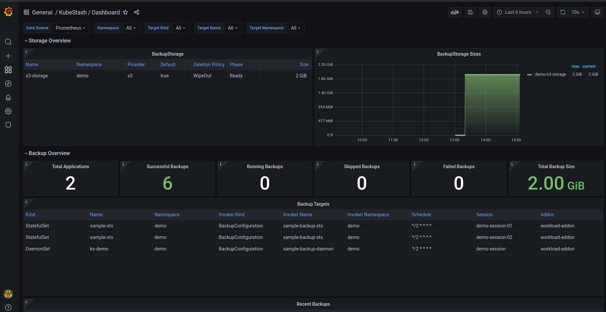

We are very excited to announce the release of [KubeStash v2024.4.27](https://kubestash.com/docs/v2024.4.27/setup/). In this release, we have introduced some exciting features and fixed some bugs. You can check out the full changelog [HERE](https://github.com/kubestash/CHANGELOG/blob/master/releases/v2024.4.27/README.md). In this post, we are going to highlight the most significant changes.

### New Features

Here, we are going to highlight the new features that have been introduced in this release.

#### Monitoring KubeStash 

We've added support for monitoring KubeStash via [Prometheus](https://prometheus.io/). You can use builtin [Prometheus](https://github.com/prometheus/prometheus) scraper or [prometheus-operator](https://github.com/prometheus-operator/prometheus-operator) to monitor KubeStash. KubeStash monitoring metrics source is [Panopticon](https://appscode.com/blog/post/introducing-panopticon/) which is a generic state metric exporter for Kubernetes developed by AppsCode. It watches KubeStash CRDs and export necessary metrics. You can get necessary metrics related to backup, restore and repository/backend.

To enhance monitoring feature, we also provide a pre-built Grafana dashboard which provides an elegant graphical user interface to visualize KubeStash data. By importing `kubestash_dashboard.json` file, you should see the KubeStash dashboard similar to this.



#### Backup and Restore TLS Enabled SingleStore

We've added support for TLS enabled SingleStore backup and restore. By incorporating TLS support into SingleStore addon, organizations can ensure that data backup and restore procedures are conducted securely, maintaining the confidentiality and integrity of their data assets even during these critical operations.

#### Backup and Restore ZooKeeper

We've introduced new addon to backup and restore ZooKeeper database. 

Here is an example of `BackupConfiguration`:

```yaml
apiVersion: core.kubestash.com/v1alpha1
kind: BackupConfiguration
metadata:
  name: zk-backup
  namespace: demo
spec:
  target:
    apiGroup: kubedb.com
    kind: ZooKeeper
    name: zk-cluster
    namespace: demo
  backends:
    - name: gcs-backend
      storageRef:
        name: gcs-storage
        namespace: demo
      retentionPolicy:
        name: demo-retention
        namespace: demo
  sessions:
    - name: demo-session
      scheduler:
        schedule: "*/10 * * * *"
        jobTemplate:
          backoffLimit: 1
      repositories:
        - name: gcs-demo-repo
          backend: gcs-backend
          directory: /zk
          encryptionSecret:
            name: encrypt-secret
            namespace: demo
      addon:
        name: zookeeper-addon
        tasks:
          - name: logical-backup
      retryConfig:
        maxRetry: 2
        delay: 1
```

Here is an example of `RestoreSession`:

```yaml
apiVersion: core.kubestash.com/v1alpha1
kind: RestoreSession
metadata:
  name: zk-restore
  namespace: demo
spec:
  target:
    apiGroup: kubedb.com
    kind: ZooKeeper
    name: zk-alone
    namespace: demo
  dataSource:
    repository: gcs-demo-repo
    snapshot: latest
    encryptionSecret:
      name: encrypt-secret
      namespace: demo
  addon:
    name: zookeeper-addon
    tasks:
      - name: logical-backup-restore
```

#### Backup and Restore Kibana Dashboard Spaces

In this release, we've added support for backup and restore kibana dashboard spaces by dashboard addon. Previously you can only take backup and restore the saved objects in the spaces. Now you can backup and restore both spaces and saved objects in those.

### Bug Fixes

Fixed a bug for MongoDB addon where after a failed restore process, the `RestoreSession` status was not updated correctly. That has been fixed in this release.

## What Next?
Please try the latest release and give us your valuable feedback.

- If you want to install KubeStash in a clean cluster, please follow the installation instruction from [HERE](https://github.com/kubestash/installer/blob/master/charts/kubestash-operator/README.md).
- If you want to upgrade KubeStash from a previous version, please follow the upgrade instruction from [HERE](https://github.com/kubestash/installer/blob/master/charts/kubestash-operator/README.md).

### Support

To speak with us, please leave a message on [our website](https://appscode.com/contact/).

To receive product announcements, follow us on [Twitter/X](https://twitter.com/KubeStash).

