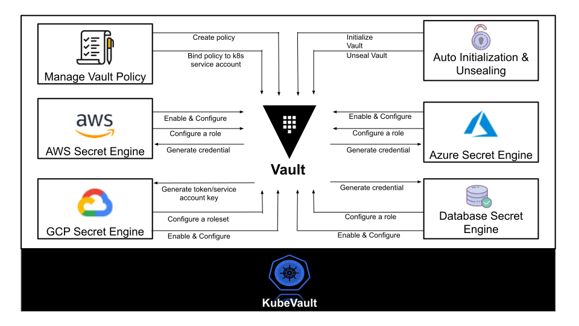
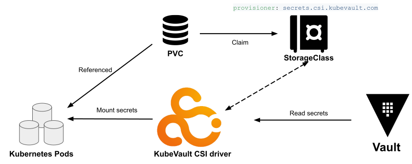

[KubeVault](https://kubevault.com) is a Kubernetes operator for [HashiCorp Vault](https://www.vaultproject.io/). Vault is a tool for secrets management, encryption as a service, and privileged access management. Deploying, maintaining, and managing Vault in Kubernetes could be challenging. KubeVault operator makes it easy to deploy, maintain and manage Vault servers in Kubernetes. It covers automatic initialization and unsealing, and securely stores unseal keys and root tokens in a cloud KMS (Key Management Service) service. KubeVault operator eases these operational tasks so that developers can focus on solving business problems.

Today we are releasing [KubeVault v0.3.0](https://kubevault.com/docs/v0.3.0/welcome/). This is a major rewrite of the project that captures the concepts present in Vault in a Kubernetes native way. Here are the major new features included in this release.

## New features and enhancements

This release adds improvements related to the following components and concepts.

### CSI driver

The new release also comes with a new version of [CSI driver](https://kubernetes-csi.github.io/docs/#kubernetes-container-storage-interface-csi-documentation) compatible with Kubernetes V1.14+. Now you can mount Vault secrets in Kubernetes Pods by using the KubeVault CSI driver.

### SecretEngine CRD

The SecretEngine CustomResourceDefinition (CRD) which is designed to automate the process of enabling and configuring secret engines in Vault in a Kubernetes native way, is introduced in this new release.

Supported Vault secret engine list:

- AWS Secrets Engine
- Azure Secrets Engine **(New)**
- GCP Secrets Engine **(New)**
- KV Engine
- PKI Engine
- Database Secret Engine
  - MongoDB
  - MySQL
  - PostgreSQL

### Azure secrets engine

The Azure secrets engine dynamically generates Azure service principals along with role and group assignments. Vault roles can be mapped to one or more Azure roles, and optionally group assignments, providing a simple, flexible way to manage the permissions granted to generated service principals.

The `AzureRole` and `AzureAccessKeyRequest` CRDs are introduced in this release to allow a user to create an Azure secret engine role and to request for credentials respectively in a Kubernetes native way.

### GCP secret engine

The GCP secrets engine dynamically generates Google Cloud service account keys and OAuth tokens based on IAM policies. This enables users to gain access to Google Cloud resources without needing to create or manage a dedicated service account.

The `GCPRole` and `GCPAccessKeyRequest` CRDs are introduced in this release to allow a user to create a GCP secret engine role and to request for credentials respectively in a Kubernetes native way.

### Vault authentication methods

Auth methods are the components in Vault that perform authentication and are responsible for assigning identity and a set of policies to a user. `Azure` and `GCP IAM` auth methods have been added in this release. With that, the list of supported authentication methods are:

- AWS IAM Auth Method
- Kubernetes Auth Method
- TLS Certificates Auth Method
- Token Auth Method
- Userpass Auth Method
- GCP IAM Auth Method **(New)**
- Azure Auth Method **(New)**

### Vault storage backend

The Vault storage backend represents the location for the durable storage of Vault's information. Each backend has pros, cons, advantages, and trade-offs. For example, some backends support high availability, while others provide some robust features.

The support for `consul` and `filesystem` storage backend is added in this release. The `filesystem` storage backend is coupled with a [PersitentVolumeClaim](https://kubernetes.io/docs/concepts/storage/persistent-volumes/#persistentvolumeclaims) so that the Vault data can be stored in a PersistentVolume.

The list of supported storage backend:

- Azure
- Consul **(New)**
- DynamoDB
- Etcd
- Filesystem **(New)**
- Google Cloud Storage
- In-memory
- MySQL
- PostgreSQL
- S3
- Swift
