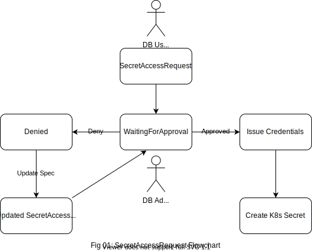

We are very excited to announce KubeVault Enterprise Edition with the release `v2021.09.27`. The KubeVault `v2021.09.27` contains major rework of the CRDs for self-service mode usage with [KubeDB](https://kubedb.com) or GitOps use-cases. It makes managing user privileges extremely easy for `KubeDB` managed databases or any other databases as long as user provides necessary connection information. It also comes with a KubeVault Community Edition which is **free of cost** but only limited to the `demo` namespace.

- [Install KubeVault](https://kubevault.com/docs/v2021.09.27/setup/)

[KubeVault](https://kubevault.com) is a Kubernetes operator for [HashiCorp Vault](https://www.vaultproject.io/). The Vault is a tool for secrets management, encryption as a service, and privileged access management. The KubeVault operator makes it easy to deploy, maintain and manage Vault servers in Kubernetes. It also supports various secret engines management, policy management in the Kubernetes native way.

In this post, we are going to highlight the major changes. You can find the complete changelog [here](https://github.com/kubevault/CHANGELOG).

## What's new in this release?
  
- **A more generic SecretAccessRequest**
  
  The support for a more generic way to make secret access requests has been added in this release. Now, only the `SecretAccessRequest` CRD will be used to make request for all the supported `SecretEngine` and roles created in them e.g: `GCPRole`, `AWSRole`, `ElasticsearchRole`, `MongoDBRole`, etc. instead of separate CRDs e.g: `GCPAccessRequest`, `AWSAccessRequest`, `DatabaseAccessRequest`, etc. 
  Making access request has never been this easy before using KubeVault.


  ```yaml
    kind: SecretAccessRequest
    metadata:
      name: aws-cred-req
      namespace: dev
    spec:
      roleRef:
        kind: AWSRole
        name: aws-role
      subjects:
        - kind: ServiceAccount
          name: test-user-account 
          namespace: test

  ```



  `SecretAccessRequest` has three different phases e.g: `WaitingForApproval`, `Approved`, `Denied`. Credential secret will only be issued if the phase is `Approved`. An approved `SecretAccessRequest.status` may look like this:

  ```yaml
  status:
    conditions:
    - lastTransitionTime: "2021-09-28T09:36:45Z"
      message: 'This was approved by: kubectl vault approve secretaccessrequest'
      observedGeneration: 1
      reason: KubectlApprove
      status: "True"
      type: Approved
    - lastTransitionTime: "2021-09-28T09:36:49Z"
      message: The requested credentials successfully issued.
      observedGeneration: 1
      reason: SuccessfullyIssuedCredential
      status: "True"
      type: Available
    observedGeneration: 1
    phase: Approved
    secret:
      name: aws-cred-req-92m0n9
      namespace: dev
  ``` 

- **Managing user privilege using SecretRoleBinding**
  
  Managing user privilege has been made simpler with the newly introduced `SecretRoleBinding` CRD. Now Admin can bind a set of `roles` to a set of `users` to grant them specific privilege using `SecretRoleBinding`, and on success of which the KubeVautl operator will create the necessary `VaultPolicy` and `VaultPolicyBinding`.

  ```yaml
    kind: SecretRoleBinding
    metadata:
      name: secret-r-binding
      namespace: dev
    spec:
      roles:
        - kind: AWSRole
          name: aws-role
        subjects:
          - kind: ServiceAccount
            name: test-user-account 
            namespace: test

  ```
  A Successful `SecretAccessRequest.status` with created `policyRef` and `policyBindingRef` may look like this:

  ```yaml
  status:
    phase: Success
    policyRef:
      name: srb-dev-secret-r-binding
      namespace: demo
    policyBindingRef:
      name: srb-dev-secret-r-binding
      namespace: demo
    observedGeneration: 1
    conditions:
    - lastTransitionTime: "2021-09-28T12:56:35Z"
        message: VaultPolicy phase is Successful
        observedGeneration: 1
        reason: VaultPolicySucceeded
        status: "True"
        type: VaultPolicySuccess
    - lastTransitionTime: "2021-09-28T12:56:35Z"
        message: VaultPolicyBinding is Successful
        observedGeneration: 1
        reason: VaultPolicyBindingSucceeded
        status: "True"
        type: VaultPolicyBindingSuccess
    - lastTransitionTime: "2021-09-28T12:56:35Z"
        message: SecretRoleBinding is Successful
        observedGeneration: 1
        reason: SecretRoleBindingSucceeded
        status: "True"
        type: SecretRoleBindingSuccess
  ```
  
  `VaultPolicy` created by a successful `SecretRoleBinding` will create the necessary policy documents which is shown below:

  ```yaml
  spec:
    policyDocument: |

        path "/k8s.-.aws.dev.aws-secret-engine/creds/k8s.-.dev.aws-role" {
            capabilities = ["read"]
        }

        path "/k8s.-.aws.dev.aws-secret-engine/sts/k8s.-.dev.aws-role" {
            capabilities = ["create", "update"]
        }

    vaultRef:
      name: vault
  ```
  
  `VaultPolicyBinding` created by a successful `SecretRoleBinding` will contain the references to the policies and subjects which is shown below:

  ```yaml
  spec:
    policies:
      - ref: srb-dev-secret-r-binding
    subjectRef:
      kubernetes:
        name: k8s.-.demo.srb-dev-secret-r-binding
        path: kubernetes
        serviceAccountNames:
          - test-user-account
        serviceAccountNamespaces:
          - test
    vaultRef:
      name: vault
    vaultRoleName: k8s.-.demo.srb-dev-secret-r-binding
  ```


## What Next?

Please try the latest release and give us your valuable feedback.

- If you want to install KubeVault, please follow the installation instruction from [here](https://kubevault.com/docs/v2021.09.27/setup).

## Support

To speak with us, please leave a message on [our website](https://appscode.com/contact/).

To receive product announcements, follow us on [Twitter](https://twitter.com/KubeVault).

If you have found a bug with KubeVault or want to request new features, please [file an issue](https://github.com/kubevault/project/issues/new).
  