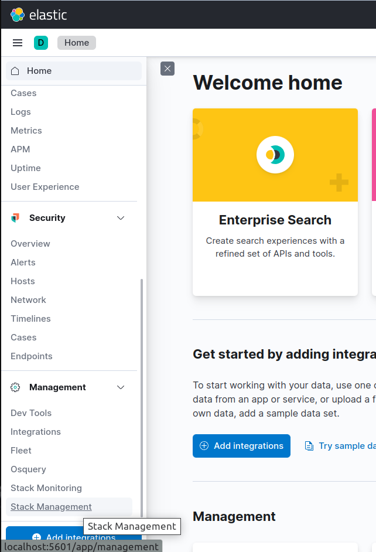

## Overview

Elasticsearch, Kibana, and Fluentd are commonly used together as the EFK stack for logging in Kubernetes environments. Each component serves a specific purpose in collecting, storing, and visualizing log data.

Elasticsearch is a distributed search and analytics engine that is designed to store and retrieve large amounts of data quickly. In the context of Kubernetes logging, Elasticsearch is used to store log data from various sources, such as containers, nodes, and applications. Elasticsearch is highly scalable and can handle large amounts of data, making it an ideal choice for storing Kubernetes log data.

Kibana is a web-based platform that provides visualization and analysis capabilities for Elasticsearch data. Kibana allows users to create custom dashboards, graphs, and charts based on the log data stored in Elasticsearch. This makes it easy for users to quickly identify and troubleshoot issues within their Kubernetes environment.

Fluentd is a log collector that is used to gather log data from various sources within a Kubernetes environment. Fluentd can collect logs from applications running in containers, system logs, and logs generated by Kubernetes components. Fluentd then sends this data to Elasticsearch for storage and analysis.

The benefits of using the EFK stack for Kubernetes logging include:

- Centralized Logging: With EFK stack, all the log data is collected and stored in a central location making it easy to manage and analyze the data.

- Scalability: Elasticsearch can handle large amounts of data and can scale horizontally, making it easy to add additional nodes to handle increased log data.

- Visualization: Kibana provides powerful visualization capabilities to analyze and monitor logs from different sources in real-time.

- Integration: Fluentd can easily integrate with different data sources and can collect logs from various applications running in containers.

In summary, the EFK stack provides a comprehensive solution for Kubernetes logging, allowing users to easily collect, store, and analyze log data from different sources within a Kubernetes environment. With its scalability and visualization capabilities, EFK stack is an ideal choice for organizations looking to manage and monitor their Kubernetes logs.

Here comes KubeDB. Using KubeDB it's easier than ever to provision Elasticsearch and Kibana on any public and private cloud. Just a simple YAML manifest describing required node replicas and storage is enough for KubeDB operator to manage all the configurations and deploy Elasticsearch. Kibana is deployed by another manifest which only requires a reference to the Elasticsearch database. Finally, setting up Fluentd in each of the cluster nodes with appropriate configurations will result in extraction of kubernetes logs to Elasticsearch & getting visualized through Kibana.  

Now, the important question is why should you use kubeDB instead of doing thing manually? KubeDB is the Kubernetes Native Database Management Solution which simplifies and automates routine database tasks such as Provisioning, Monitoring, Upgrading, Patching, Scaling, Volume Expansion, Backup, Recovery, Failure detection, and Repair for various popular databases on private and public clouds. The databases that KubeDB supports are Elasticsearch, MySQL, MongoDB, MariaDB, Redis, Kafka, PostgreSQL, ProxySQL, Percona XtraDB, Memcached and PgBouncer. You can find the guides to all the supported databases [here](https://kubedb.com/). Using Kubernetes managed Elasticsearch & Kibana will help reducing organizational costs and effort in orchestrating kubernetes workloads easily with much efficiency.

## Workflow

In this tutorial we will deploy Elasticsearch database in Linode Kubernetes Engine (LKE). You can also learn and try out running Elasticsearch in [Google Kubernetes Engine (GKE)](https://byte.builders/blog/post/deploy-elasticsearch-in-gke/), [Azure Kubernetes Service (AKS)](https://byte.builders/blog/post/run-elasticsearch-in-aks/) or [Amazon Elastic Kubernetes Service(EKS)](https://byte.builders/blog/post/run-elasticsearch-in-aws/). We will cover the following steps:

1) Install KubeDB
2) Deploy Elasticsearch Topology Cluster
3) Deploy Kibana
4) Deploy Fluentd
5) Discover Kubernetes logs in Kibana

## Install KubeDB

We will follow the steps to install KubeDB.

### Get Cluster ID

We need the cluster ID to get the KubeDB License.
To get cluster ID we can run the following command:

```bash
$ kubectl get ns kube-system -o jsonpath='{.metadata.uid}'
b8da819b-e9ec-45ad-b3a0-0342a22b60d9
```

### Get License

Go to [Appscode License Server](https://license-issuer.appscode.com/) to get the license.txt file. For this tutorial we will use KubeDB Enterprise Edition.


### Install KubeDB

We will use helm to install KubeDB. Please install helm [here](https://helm.sh/docs/intro/install/) if it is not already installed.
Now, let's install `KubeDB`.

```bash
$ helm repo add appscode https://charts.appscode.com/stable/
$ helm repo update

$ helm search repo appscode/kubedb
NAME                              	CHART VERSION	APP VERSION	DESCRIPTION                                       
appscode/kubedb                   	v2023.04.10  	v2023.04.10	KubeDB by AppsCode - Production ready databases...
appscode/kubedb-autoscaler        	v0.18.0      	v0.18.0    	KubeDB Autoscaler by AppsCode - Autoscale KubeD...
appscode/kubedb-catalog           	v2023.04.10  	v2023.04.10	KubeDB Catalog by AppsCode - Catalog for databa...
appscode/kubedb-community         	v0.24.2      	v0.24.2    	KubeDB Community by AppsCode - Community featur...
appscode/kubedb-crds              	v2023.04.10  	v2023.04.10	KubeDB Custom Resource Definitions                
appscode/kubedb-dashboard         	v0.9.0       	v0.9.0     	KubeDB Dashboard by AppsCode                      
appscode/kubedb-enterprise        	v0.11.2      	v0.11.2    	KubeDB Enterprise by AppsCode - Enterprise feat...
appscode/kubedb-grafana-dashboards	v2023.04.10  	v2023.04.10	A Helm chart for kubedb-grafana-dashboards by A...
appscode/kubedb-metrics           	v2023.04.10  	v2023.04.10	KubeDB State Metrics                              
appscode/kubedb-one               	v2023.04.10  	v2023.04.10	KubeDB and Stash by AppsCode - Production ready...
appscode/kubedb-ops-manager       	v0.20.0      	v0.20.0    	KubeDB Ops Manager by AppsCode - Enterprise fea...
appscode/kubedb-opscenter         	v2023.04.10  	v2023.04.10	KubeDB Opscenter by AppsCode                      
appscode/kubedb-provisioner       	v0.33.0      	v0.33.0    	KubeDB Provisioner by AppsCode - Community feat...
appscode/kubedb-schema-manager    	v0.9.0       	v0.9.0     	KubeDB Schema Manager by AppsCode                 
appscode/kubedb-ui                	v2023.03.23  	0.3.28     	A Helm chart for Kubernetes                       
appscode/kubedb-ui-server         	v2021.12.21  	v2021.12.21	A Helm chart for kubedb-ui-server by AppsCode     
appscode/kubedb-webhook-server    	v0.9.0       	v0.9.0     	KubeDB Webhook Server by AppsCode 

# Install KubeDB Enterprise operator chart
$ helm install kubedb appscode/kubedb \
  --version v2023.04.10 \
  --namespace kubedb --create-namespace \
  --set kubedb-provisioner.enabled=true \
  --set kubedb-ops-manager.enabled=true \
  --set kubedb-autoscaler.enabled=true \
  --set kubedb-dashboard.enabled=true \
  --set kubedb-schema-manager.enabled=true \
  --set-file global.license=/path/to/the/license.txt
```

Let's verify the installation:

```bash
$ watch kubectl get pods --all-namespaces -l "app.kubernetes.io/instance=kubedb"
NAMESPACE   NAME                                            READY   STATUS    RESTARTS      AGE
kubedb      kubedb-kubedb-autoscaler-8567f844fd-rdmz9       1/1     Running   0             20h
kubedb      kubedb-kubedb-dashboard-576d6bc7dc-4496s        1/1     Running   0             20h
kubedb      kubedb-kubedb-ops-manager-854bf567c8-fzp2r      1/1     Running   0             20h
kubedb      kubedb-kubedb-provisioner-596d87bc46-fz4fg      1/1     Running   0             20h
kubedb      kubedb-kubedb-schema-manager-6b67b8687-vp75b    1/1     Running   0             20h
kubedb      kubedb-kubedb-webhook-server-8496d984d7-lqrcz   1/1     Running   0             20h
```

We can list the CRD Groups that have been registered by the operator by running the following command:

```bash
$ kubectl get crd -l app.kubernetes.io/name=kubedb
$ NAME                                              CREATED AT
elasticsearchautoscalers.autoscaling.kubedb.com   2023-04-03T08:55:39Z
elasticsearchdashboards.dashboard.kubedb.com      2023-04-03T08:55:29Z
elasticsearches.kubedb.com                        2023-04-03T08:55:29Z
elasticsearchopsrequests.ops.kubedb.com           2023-04-03T08:55:32Z
elasticsearchversions.catalog.kubedb.com          2023-04-03T08:54:26Z
etcds.kubedb.com                                  2023-04-03T08:55:47Z
etcdversions.catalog.kubedb.com                   2023-04-03T08:54:26Z
kafkas.kubedb.com                                 2023-04-03T08:56:06Z
kafkaversions.catalog.kubedb.com                  2023-04-03T08:54:26Z
mariadbautoscalers.autoscaling.kubedb.com         2023-04-03T08:55:39Z
mariadbdatabases.schema.kubedb.com                2023-04-03T08:56:00Z
mariadbopsrequests.ops.kubedb.com                 2023-04-03T08:55:54Z
mariadbs.kubedb.com                               2023-04-03T08:55:48Z
mariadbversions.catalog.kubedb.com                2023-04-03T08:54:27Z
memcacheds.kubedb.com                             2023-04-03T08:55:48Z
memcachedversions.catalog.kubedb.com              2023-04-03T08:54:27Z
mongodbautoscalers.autoscaling.kubedb.com         2023-04-03T08:55:39Z
mongodbdatabases.schema.kubedb.com                2023-04-03T08:55:52Z
mongodbopsrequests.ops.kubedb.com                 2023-04-03T08:55:36Z
mongodbs.kubedb.com                               2023-04-03T08:55:36Z
mongodbversions.catalog.kubedb.com                2023-04-03T08:54:27Z
mysqlautoscalers.autoscaling.kubedb.com           2023-04-03T08:55:39Z
mysqldatabases.schema.kubedb.com                  2023-04-03T08:55:47Z
mysqlopsrequests.ops.kubedb.com                   2023-04-03T08:55:46Z
mysqls.kubedb.com                                 2023-04-03T08:55:45Z
mysqlversions.catalog.kubedb.com                  2023-04-03T08:54:27Z
perconaxtradbautoscalers.autoscaling.kubedb.com   2023-04-03T08:55:40Z
perconaxtradbopsrequests.ops.kubedb.com           2023-04-03T08:56:18Z
perconaxtradbs.kubedb.com                         2023-04-03T08:55:59Z
perconaxtradbversions.catalog.kubedb.com          2023-04-03T08:54:27Z
pgbouncers.kubedb.com                             2023-04-03T08:55:41Z
pgbouncerversions.catalog.kubedb.com              2023-04-03T08:54:27Z
postgresautoscalers.autoscaling.kubedb.com        2023-04-03T08:55:40Z
postgresdatabases.schema.kubedb.com               2023-04-03T08:55:59Z
postgreses.kubedb.com                             2023-04-03T08:55:59Z
postgresopsrequests.ops.kubedb.com                2023-04-03T08:56:08Z
postgresversions.catalog.kubedb.com               2023-04-03T08:54:27Z
proxysqlautoscalers.autoscaling.kubedb.com        2023-04-03T08:55:40Z
proxysqlopsrequests.ops.kubedb.com                2023-04-03T08:56:13Z
proxysqls.kubedb.com                              2023-04-03T08:56:03Z
proxysqlversions.catalog.kubedb.com               2023-04-03T08:54:27Z
publishers.postgres.kubedb.com                    2023-04-03T08:56:28Z
redisautoscalers.autoscaling.kubedb.com           2023-04-03T08:55:40Z
redises.kubedb.com                                2023-04-03T08:55:59Z
redisopsrequests.ops.kubedb.com                   2023-04-03T08:55:58Z
redissentinelautoscalers.autoscaling.kubedb.com   2023-04-03T08:55:40Z
redissentinelopsrequests.ops.kubedb.com           2023-04-03T08:56:21Z
redissentinels.kubedb.com                         2023-04-03T08:56:05Z
redisversions.catalog.kubedb.com                  2023-04-03T08:54:27Z
subscribers.postgres.kubedb.com                   2023-04-03T08:56:33Z
```

## Deploy Elasticsearch Topology Cluster

Now, we are going to Deploy Elasticsearch with the help of KubeDB.
At first, let's create a Namespace in which we will deploy the database. We are going to use `logging` namespace for Elasticsearch & Kibana. 

```bash
$ kubectl create ns logging
namespace/logging created
```

Here is the yaml of the Elasticsearch we are going to use:

```yaml
apiVersion: kubedb.com/v1alpha2
kind: Elasticsearch
metadata:
  name: elasticsearch
  namespace: logging
spec:
  version: xpack-7.17.3
  storageType: Durable
  topology:
    master:
      replicas: 2
      storage:
        storageClassName: "linode-block-storage"
        accessModes:
        - ReadWriteOnce
        resources:
          requests:
            storage: 1Gi
    data:
      replicas: 3
      storage:
        storageClassName: "linode-block-storage"
        accessModes:
        - ReadWriteOnce
        resources:
          requests:
            storage: 1Gi
    ingest:
      replicas: 1
      storage:
        storageClassName: "linode-block-storage"
        accessModes:
        - ReadWriteOnce
        resources:
          requests:
            storage: 1Gi
  terminationPolicy: DoNotTerminate
```

We are going to use one of the default `storageclass` object in LKE, `linode-block-storage` for storage, Request `1Gi` of memory for each of the dedicated pods & deploy 3 data pods, 1 ingest pods and 2 master pods. The Ingest pods here works like a minimal version of `Logstash` by preprocessing the data before it's fetched by data pods. We are going to use ElasticsearchVersion `xpack-7.17.3`. This version comes with xpack security authplugin. Let's save this yaml configuration into `es-topology-cluster.yaml` and apply in LKE.

```bash
$ kubectl create -f es-topology-cluster.yaml
elasticsearch.kubedb.com/es-topology-cluster created
```

* In this yaml we can see in the `spec.version` field specifies the version of Elasticsearch. Here, we are using Elasticsearch version `xpack-7.17.3` that is integrated with x-pack auth plugin. You can list the KubeDB supported versions of Elasticsearch CR by running `kubectl get elasticsearchversions` or `kubectl get esversion` command.
* `spec.storage` specifies PVC spec that will be dynamically allocated to store data for this database. This storage spec will be passed to the StatefulSet created by KubeDB operator to run database pods. You can specify any StorageClass available in your cluster with appropriate resource requests.
* `spec.enableSSL` - specifies whether the HTTP layer is secured with certificates or not.
* `spec.storageType` - specifies the type of storage that will be used for Elasticsearch database. It can be `Durable` or `Ephemeral`. The default value of this field is `Durable`. If `Ephemeral` is used then KubeDB will create the Elasticsearch database using `EmptyDir` volume. In this case, you don't have to specify `spec.storage` field. This is useful for testing purposes.
* `spec.topology` - specifies the node-specific properties for the Elasticsearch cluster.
    - `topology.master` - specifies the properties of master nodes.
        - `master.replicas` - specifies the number of master nodes.
        - `master.storage` - specifies the master node storage information that passed to the StatefulSet.
    - `topology.data` - specifies the properties of data nodes.
        - `data.replicas` - specifies the number of data nodes.
        - `data.storage` - specifies the data node storage information that passed to the StatefulSet.
    - `topology.ingest` - specifies the properties of ingest nodes. Ingest node acts like a minimal version of Logstash by preprocessing the data.
        - `ingest.replicas` - specifies the number of ingest nodes.
        - `ingest.storage` - specifies the Ingest node storage information that passed to the StatefulSet.

Once these are handled correctly and the Elasticsearch object is deployed, you will see that the following objects are created:

```bash
$ kubectl get all,secret -n logging
NAME                         READY   STATUS    RESTARTS   AGE
pod/elasticsearch-data-0     1/1     Running   0          34m
pod/elasticsearch-data-1     1/1     Running   0          29m
pod/elasticsearch-data-2     1/1     Running   0          23m
pod/elasticsearch-ingest-0   1/1     Running   0          34m
pod/elasticsearch-master-0   1/1     Running   0          34m
pod/elasticsearch-master-1   1/1     Running   0          33m

NAME                           TYPE        CLUSTER-IP       EXTERNAL-IP   PORT(S)    AGE
service/elasticsearch          ClusterIP   10.128.184.230   <none>        9200/TCP   34m
service/elasticsearch-master   ClusterIP   None             <none>        9300/TCP   34m
service/elasticsearch-pods     ClusterIP   None             <none>        9200/TCP   34m

NAME                                    READY   AGE
statefulset.apps/elasticsearch-data     3/3     34m
statefulset.apps/elasticsearch-ingest   1/1     34m
statefulset.apps/elasticsearch-master   2/2     34m

NAME                                               TYPE                       VERSION   AGE
appbinding.appcatalog.appscode.com/elasticsearch   kubedb.com/elasticsearch   7.17.3    34m

NAME                                     VERSION        STATUS   AGE
elasticsearch.kubedb.com/elasticsearch   xpack-7.17.3   Ready    34m

NAME                                               TYPE                                  DATA   AGE
secret/default-token-qkhbc                         kubernetes.io/service-account-token   3      24h
secret/elasticsearch-apm-system-cred               kubernetes.io/basic-auth              2      34m
secret/elasticsearch-beats-system-cred             kubernetes.io/basic-auth              2      34m
secret/elasticsearch-ca-cert                       kubernetes.io/tls                     2      34m
secret/elasticsearch-config                        Opaque                                1      34m
secret/elasticsearch-elastic-cred                  kubernetes.io/basic-auth              2      34m
secret/elasticsearch-kibana-system-cred            kubernetes.io/basic-auth              2      34m
secret/elasticsearch-logstash-system-cred          kubernetes.io/basic-auth              2      34m
secret/elasticsearch-remote-monitoring-user-cred   kubernetes.io/basic-auth              2      34m
secret/elasticsearch-token-m8xlt                   kubernetes.io/service-account-token   3      34m
secret/elasticsearch-transport-cert                kubernetes.io/tls                     3      34m
```
Let’s check if the database is ready to use,

```bash
$ kubectl get elasticsearch -n logging elasticsearch
NAME            VERSION        STATUS   AGE
elasticsearch   xpack-7.17.3   Ready    35m
```
> We have successfully deployed Elasticsearch in LKE. Now we can exec into the container to use the database.

### Insert Sample Data

In this section, we are going to create few indexes in Elasticsearch. At first, we are going to port-forward the respective Service so that we can connect with the database from our local machine. Then, we are going to insert some data into the Elasticsearch.

#### Port-forward the Service

KubeDB will create few Services to connect with the database. Let’s see the Services created by KubeDB for our Elasticsearch,

```bash
$ kubectl get service -n logging -l=app.kubernetes.io/instance=elasticsearch
NAME                   TYPE        CLUSTER-IP       EXTERNAL-IP   PORT(S)    AGE
elasticsearch          ClusterIP   10.128.184.230   <none>        9200/TCP   36m
elasticsearch-master   ClusterIP   None             <none>        9300/TCP   36m
elasticsearch-pods     ClusterIP   None             <none>        9200/TCP   36m
```
Here, we are going to use the `elasticsearch` Service to connect with the database. Now, let’s port-forward the `elasticsearch` Service.

```bash
# Port-forward the service to local machine
$ kubectl port-forward -n logging svc/elasticsearch 9200
Forwarding from 127.0.0.1:9200 -> 9200
Forwarding from [::1]:9200 -> 9200
```

#### Export the Credentials

KubeDB will create some Secrets for the database. Let’s check which Secrets have been created by KubeDB for our `elasticsearch`.

```bash
$ kubectl get secret -n logging -l=app.kubernetes.io/instance=elasticsearch
NAME                                        TYPE                       DATA   AGE
elasticsearch-apm-system-cred               kubernetes.io/basic-auth   2      38m
elasticsearch-beats-system-cred             kubernetes.io/basic-auth   2      38m
elasticsearch-ca-cert                       kubernetes.io/tls          2      38m
elasticsearch-config                        Opaque                     1      38m
elasticsearch-elastic-cred                  kubernetes.io/basic-auth   2      38m
elasticsearch-kibana-system-cred            kubernetes.io/basic-auth   2      38m
elasticsearch-logstash-system-cred          kubernetes.io/basic-auth   2      38m
elasticsearch-remote-monitoring-user-cred   kubernetes.io/basic-auth   2      38m
elasticsearch-transport-cert                kubernetes.io/tls          3      38m
```
Now, we can connect to the database with the secret that have the suffix `elastic-cred`. Other secrets are used for built-in users to communicate with the stack components. Here, we are using `elasticsearch-elastic-cred` which contains the admin level credentials to connect with the database.

### Accessing Database Through CLI

To access the database through CLI, we have to get the credentials to access. Let’s export the credentials as environment variable to our current shell :

```bash
$ kubectl get secret -n logging elasticsearch-elastic-cred -o jsonpath='{.data.username}' | base64 -d
elastic
$ kubectl get secret -n logging elasticsearch-elastic-cred -o jsonpath='{.data.password}' | base64 -d
j3$7lAN3VviB1JWi
```

Then login and insert some data into Elasticsearch:

```bash
$ curl -XPOST --user 'admin:j3$7lAN3VviB1JWi' "http://localhost:9200/bands/_doc?pretty" -H 'Content-Type: application/json' -d'
{
    "Artist": "Justin Timberlake",
    "Album": "Inside Llewyn Davis",
    "Song": "Five Hundred Miles"
}
'
```

Now, let’s verify that the index have been created successfully.

```bash
$ curl -XGET --user 'admin:j3$7lAN3VviB1JWi' "http://localhost:9200/_cat/indices?v&s=index&pretty"
health status index            uuid                   pri rep docs.count docs.deleted store.size pri.store.size
green  open   .geoip_databases M8oEBkUxTreDtAZYBfVP0A   1   1                                                  
green  open   bands            kgAKlq1_S2WOy1sQ-dTZfA   1   1          1            0     10.5kb          5.2kb
green  open   searchguard      fLEfweuOQkWPRxfBQJy8PQ   1   2          7            0     45.3kb         26.6kb
```
Also, let’s verify the data in the indexes:

```bash
$ curl -XGET -k --user 'admin:j3$7lAN3VviB1JWi' "https://localhost:9200/bands/_search?pretty"
{
  "took" : 4,
  "timed_out" : false,
  "_shards" : {
    "total" : 1,
    "successful" : 1,
    "skipped" : 0,
    "failed" : 0
  },
  "hits" : {
    "total" : {
      "value" : 1,
      "relation" : "eq"
    },
    "max_score" : 1.0,
    "hits" : [
      {
        "_index" : "bands",
        "_type" : "_doc",
        "_id" : "9jgwI4EBMChBH9DgJcLv",
        "_score" : 1.0,
        "_source" : {
          "Artist" : "Justin Timberlake",
          "Album" : "Inside Llewyn Davis",
          "Song" : "Five Hundred Miles"
        }
      }
    ]
  }
}

```
> We've successfully inserted some sample data to our Elasticsearch. And this was just an example of our Elasticsearch topology cluster deployment. More information about Run & Manage Production-Grade Elasticsearch Database on Kubernetes can be found [HERE](https://kubedb.com/kubernetes/databases/run-and-manage-elasticsearch-on-kubernetes/)

## Deploy Kibana

KubeDB provides a custom resource definition (CRD) `ElasticsearchDashboard` which can be used to provision Kibana on your cluster. Refer the database name in the manifest YAML and other required fields. On applying the YAML, KubeDB will deploy a Kibana cluster with compatible version and default configurations. You can also provide your own custom configurations from the manifest. Here's the YAMl for provisioning a standalone Kibana instance for the Elasticsearch cluster that we have created above.

```yaml
apiVersion: dashboard.kubedb.com/v1alpha1
kind: ElasticsearchDashboard
metadata:
  name: kibana
  namespace: logging
spec:
  databaseRef:
    name: elasticsearch
  terminationPolicy: DoNotTerminate
```

Let's save this yaml configuration into `kibana.yaml` and apply in LKE. 

```bash
$ kubectl apply -f esd.yaml
elasticsearchdashboard.dashboard.kubedb.com/kibana created
```
You can check if Kibana is ready or not by the following command.

```bash
$ kubectl get ed kibana -n logging
NAME     TYPE                            DATABASE        STATUS   AGE
kibana   dashboard.kubedb.com/v1alpha1   elasticsearch   Ready    2m54s
```

Get the Kibana manifest to figure the rest of the configuration that operator generated.

```yaml
apiVersion: dashboard.kubedb.com/v1alpha1
kind: ElasticsearchDashboard
metadata:
  annotations:
    kubectl.kubernetes.io/last-applied-configuration: |
      {"apiVersion":"dashboard.kubedb.com/v1alpha1","kind":"ElasticsearchDashboard","metadata":{"annotations":{},"name":"kibana","namespace":"logging"},"spec":{"databaseRef":{"name":"elasticsearch"},"terminationPolicy":"DoNotTerminate"}}
  creationTimestamp: "2023-04-07T09:00:36Z"
  finalizers:
  - kubedb.com
  generation: 1
  name: kibana
  namespace: logging
  resourceVersion: "364295"
  uid: 58d8d6a0-ae87-4f22-a2c7-aaa6c4d59af9
spec:
  databaseRef:
    name: elasticsearch
  podTemplate:
    controller: {}
    metadata: {}
    spec:
      resources:
        limits:
          memory: 1Gi
        requests:
          cpu: 100m
          memory: 1Gi
  replicas: 1
  terminationPolicy: DoNotTerminate
status:
  conditions:
  - lastTransitionTime: "2023-04-07T09:00:40Z"
    message: |
      Deployment: logging/kibana is Available
    observedGeneration: 1
    reason: MinimumReplicasAvailable
    status: "True"
    type: DeploymentReconciled
  - lastTransitionTime: "2023-04-07T09:00:37Z"
    message: |
      Service: logging/kibana is Available
    observedGeneration: 1
    reason: ServiceAcceptingRequests
    status: "True"
    type: ServiceReconciled
  - lastTransitionTime: "2023-04-07T09:01:20Z"
    message: 'The ElasticsearchDashboard server: logging/kibana is ready.'
    observedGeneration: 1
    reason: ServerHealthGood
    status: "True"
    type: ServerHealthy
  - lastTransitionTime: "2023-04-07T09:00:40Z"
    message: 'dashboard: logging/kibana have successfully provisoined'
    observedGeneration: 1
    reason: DashboardReadinessCheckSucceeded
    status: "True"
    type: DashboardProvisioned
  - lastTransitionTime: "2023-04-07T09:01:10Z"
    message: 'The ElasticsearchDashboard: logging/kibana is accepting connection request
      now.'
    observedGeneration: 1
    reason: DashboardAcceptingConnectionRequests
    status: "True"
    type: ServerAcceptingConnection
  phase: Ready
```

KubeDB also comes with continuously running health checker for Kibana that keeps checking Kibana health and cluster connectivity. An operator generated headless service can be used to direct Kibana cluster to a localhost port. Let's port-forward this service to localhost port 5601.

```bash
$ kubectl port-forward -n logging svc/kibana 5601
Forwarding from 127.0.0.1:5601 -> 5601
Forwarding from [::1]:5601 -> 5601
Handling connection for 5601
......
```

From your web browser visit http://localhost:5601 and enter the credentials that we decoded earlier from `elasticsearch-elastic-cred` secret.


Now, You can see the Kibana dashboard. Let's jump to setting up fluentd to fetch kubernetes logs to elasticsearch and visualize those logs from Kibana.

## Deploy Fluentd

In order to deploy fluentd you need to deploy a kubernetes configmap that contains the required input and output plugins for fluentd. Here's the configmap that we are going to use.

```yaml
apiVersion: v1
kind: ConfigMap
metadata:
  name: fluentd-config
  namespace: kube-system
data:
  fluent.conf: |
    <source>
      @type tail
      read_from_head true
      tag kubernetes.*
      path /var/log/containers/*.log
      pos_file /var/log/fluentd-containers.log.pos
      exclude_path ["/var/log/containers/fluent*"]
      <parse>
        @type regexp
        #https://regex101.com/r/ZkOBTI/1
        expression ^(?<time>\d{4}-\d{2}-\d{2}T\d{2}:\d{2}:\d{2}.[^Z]*Z)\s(?<stream>[^\s]+)\s(?<character>[^\s])\s(?<message>.*)$
        time_format %Y-%m-%dT%H:%M:%S.%NZ
      </parse>
    </source>
    <filter kubernetes.**>
      @type kubernetes_metadata
      @id filter_kube_metadata
      kubernetes_url "#{ENV['FLUENT_FILTER_KUBERNETES_URL'] || 'https://' + ENV.fetch('KUBERNETES_SERVICE_HOST') + ':' + ENV.fetch('KUBERNETES_SERVICE_PORT') + '/api'}"
      verify_ssl "#{ENV['KUBERNETES_VERIFY_SSL'] || true}"
      ca_file "#{ENV['KUBERNETES_CA_FILE']}"
      skip_labels "#{ENV['FLUENT_KUBERNETES_METADATA_SKIP_LABELS'] || 'false'}"
      skip_container_metadata "#{ENV['FLUENT_KUBERNETES_METADATA_SKIP_CONTAINER_METADATA'] || 'false'}"
      skip_master_url "#{ENV['FLUENT_KUBERNETES_METADATA_SKIP_MASTER_URL'] || 'false'}"
      skip_namespace_metadata "#{ENV['FLUENT_KUBERNETES_METADATA_SKIP_NAMESPACE_METADATA'] || 'false'}"
    </filter>
    <match **>
      @type elasticsearch
      host "#{ENV['FLUENT_ELASTICSEARCH_HOST'] || 'elasticsearch.logging.svc.cluster.local'}"
      port "#{ENV['FLUENT_ELASTICSEARCH_PORT'] || '9200'}"
      user "#{ENV['FLUENT_ELASTICSEARCH_USER'] || 'elastic'}"
      password "#{ENV['FLUENT_ELASTICSEARCH_PASSWORD'] || 'password'}"
      scheme "#{ENV['FLUENT_ELASTICSEARCH_SCHEME'] || 'http'}"
      index_name kube_containers
      type_name fluentd
      time_key time
      include_timestamp true
    </match>
```
In the `fluent.conf` file, we have set the source to be from local path `/var/log/containers/*.log`. That means it will source the files with `.log` extension at `/var/log/containers` directory of every node which is the default log path for a node in Linode Kubernetes Engine. We have excluded fluentd's own logs from this source. In the filter section, we are skipping some field in the logs to reduce log redundancy. Finally, at the match section, we are providing the target source host and credentials along the index name to store continuously coming log data.

Let's create this configmap.
```bash
$ kubectl apply -f fluentd-config.yaml
configmap/fluentd-config created
```

We also need to configure ServiceAccount, ClusterRole, ClusterRoleBinding prior to deploying FluentD DaemonSet. We are using DaemonSet workload so that fluentd can run in all the nodes and fetch logs from all of them. Let's deploy all the required workloads.

```yaml
apiVersion: v1
kind: ServiceAccount
metadata:
  name: fluentd
  namespace: kube-system
---
apiVersion: rbac.authorization.k8s.io/v1
kind: ClusterRole
metadata:
  name: fluentd
  namespace: kube-system
rules:
- apiGroups:
  - ""
  resources:
  - pods
  - namespaces
  verbs:
  - get
  - list
  - watch
---
kind: ClusterRoleBinding
apiVersion: rbac.authorization.k8s.io/v1
metadata:
  name: fluentd
roleRef:
  kind: ClusterRole
  name: fluentd
  apiGroup: rbac.authorization.k8s.io
subjects:
- kind: ServiceAccount
  name: fluentd
  namespace: kube-system
```

Use the credentials from `elasticsearch-elastic-cred` secret to create another secret in `kube-system` namespace. This new secret will be used to set environment variables to fluentd pod for input plugin configuration.

```bash
$ kubectl create -n kube-system secret generic elastic-cred --from-literal='username='elastic' --from-literal='password='FdTIvWzB)yokJ_fZ'
secret/elastic-cred created
```

You may add the fluentd yaml in the same file and then apply it to your Kubernetes.

```yaml
apiVersion: apps/v1
kind: DaemonSet
metadata:
  name: fluentd
  namespace: kube-system
  labels:
    app: fluentd
spec:
  selector:
    matchLabels:
      app: fluentd
  template:
    metadata:
      labels:
        app: fluentd
    spec:
      serviceAccountName: fluentd
      tolerations:
        - key: node-role.kubernetes.io/master
          effect: NoSchedule
      containers:
        - name: fluentd
          image: fluent/fluentd-kubernetes-daemonset:v1.15.3-debian-elasticsearch7-1.1
          env:
            - name:  FLUENT_ELASTICSEARCH_HOST
              value: "elasticsearch.logging.svc.cluster.local"
            - name:  FLUENT_ELASTICSEARCH_PORT
              value: "9200"
            - name: FLUENT_ELASTICSEARCH_SCHEME
              value: "http"
            - name: FLUENT_ELASTICSEARCH_USER
              valueFrom:
                secretKeyRef:
                  name: elastic-cred
                  key: username
            - name: FLUENT_ELASTICSEARCH_PASSWORD
              valueFrom:
                secretKeyRef:
                  name: elastic-cred
                  key: password
          resources:
            limits:
              memory: 512Mi
            requests:
              cpu: 100m
              memory: 200Mi
          volumeMounts:
            - name: varlog
              mountPath: /var/log
            - name: varlibdockercontainers
              mountPath: /var/lib/docker/containers
              readOnly: true
            - name: config-volume
              mountPath: /fluentd/etc/fluent.conf
              subPath: fluent.conf
      terminationGracePeriodSeconds: 30
      volumes:
        - name: varlog
          hostPath:
            path: /var/log
        - name: varlibdockercontainers
          hostPath:
            path: /var/lib/docker/containers
        - name: config-volume
          configMap:
            name: fluentd-config
```

Mount local path `/var/lib/docker/containers` and `/var/log` as volume hostPaths for fluentd daemonSet. These are the default paths that persists kubernetes node logs and container logs. We are using `fluent/fluentd-kubernetes-daemonset` image for fluentd. Let's apply this YAMl to LKE.

```bash
kubectl apply -f fluentd.yaml
serviceaccount/fluentd created
clusterrole.rbac.authorization.k8s.io/fluentd created
clusterrolebinding.rbac.authorization.k8s.io/fluentd created
daemonset.apps/fluentd created
```

Let's go to Kibana through web browser and click `stack management` from side panel.



Now, go to `index pattern` and create an index pattern named `kube-containers*`. Set @timestamp as timestamp key field.


Now, Go to `discover` section from home side panel, and you will find the index pattern to visualize incoming logs from kubernetes nodes and containers.


Thus, you can now use these logs to visualize according to your requirement. Fluentd will collect logs from all the k8s nodes and ship them to kubeDB elasticsearch and Kibana will use those logs for Visualization. Using KubeDB, you can easily get rid of managing Elasticsearch & Kibana on your own. Just configuring Fluentd is enough for collecting and Visualizing Kubernetes logs using EFK.  

## Support

To speak with us, please leave a message on [our website](https://appscode.com/contact/).

To receive product announcements, follow us on [Twitter](https://twitter.com/KubeDB).

To watch tutorials of various Production-Grade Kubernetes Tools Subscribe our [YouTube](https://www.youtube.com/c/AppsCodeInc/) channel.

Learn more about [Elasticsearch in Kubernetes](https://kubedb.com/kubernetes/databases/run-and-manage-elasticsearch-on-kubernetes/)

If you have found a bug with KubeDB or want to request for new features, please [file an issue](https://github.com/kubedb/project/issues/new).
