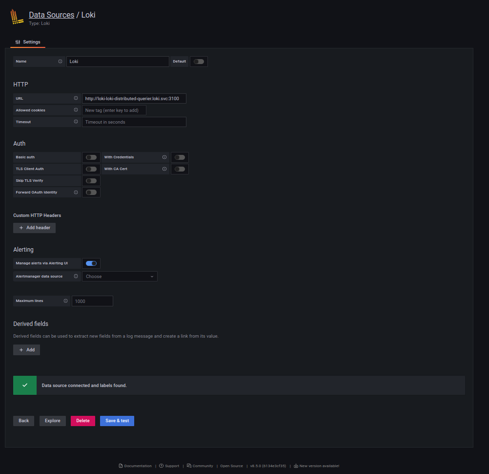
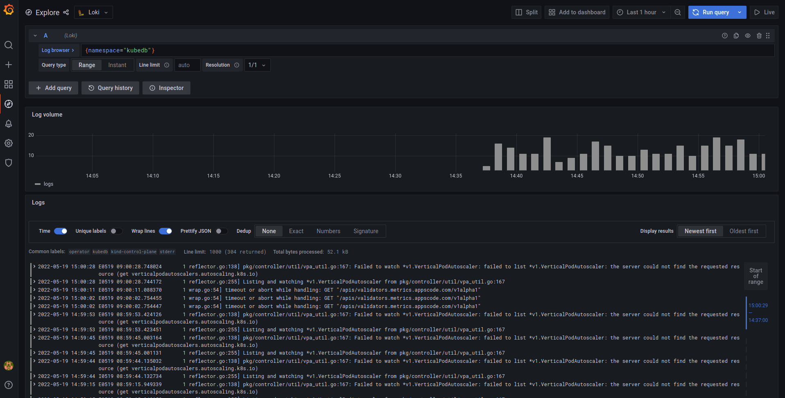

For many years, logs have been an essential part of troubleshooting application and infrastructure performance. In Kubernetes, the logging mechanism becomes more crucial to managing and monitoring services and infrastructure.

In this post, we are going to give you a full setup guide about Grafana Loki setup for collecting logs from KubeDB pods and how you can generate alerts based on those logs.

Here is the outline of this post:

* Loki
* Install Loki in Kubernetes
* Promtail
* Install Promtail in Kubernetes
* Explore logs in Grafana
* Setup Loki with S3 or S3 compatible bucket
* Setup Loki with Alertmanager

## Loki

Loki by Grafana Labs is a log aggregation system inspired by Prometheus. It is designed to store and query logs from all your applications and infrastructure.

## Install Loki in Kubernetes

For installing Loki in Kubernetes, there is an official helm chart available. You'll find it [here](https://github.com/grafana/helm-charts/tree/main/charts/loki-distributed). Here, we install loki-distributed helm chart in loki namespace which will run Grafana Loki in microservice mode.

```bash
helm repo add grafana https://grafana.github.io/helm-charts
helm repo update
helm upgrade -i <release-name> grafana/loki-distributed -n loki --create-namespace
```

Here is the installed version info and components from Loki installation notes.

```bash
***********************************************************************
 Welcome to Grafana Loki
 Chart version: 0.48.4
 Loki version: 2.5.0
***********************************************************************

Installed components:
* gateway
* ingester
* distributor
* querier
* query-frontend
```

By default, loki-distributed helm chart will deploy those components:
- Gateway: The gateway component works as a load balancer to load balance incoming streams from client to distributor components.

- Distributor: The distributor component is a stateless service that is responsible for handling incoming streams by the client and sending it to available ingester components.

- Ingester: The ingester component is responsible for writing log data to long-term storage backends (DynamoDB, S3, Cassandra, etc.)

- Querier: The querier component handles queries using the LogQL query language, fetching logs both from the ingesters and from long-term storage.

- Query-frontend: The query frontend is an optional component providing the querier’s API endpoints and can be used to accelerate the read path.

To learn more about loki components, please visit [here](https://grafana.com/docs/loki/latest/fundamentals/architecture/components/).


Note: You can also run Loki as a single binary or as a simple scalable mode. But for Kubernetes, it is recommended to install Loki in microservice mode to run it on scale.

## Promtail

Promtail is an agent which ships the contents of local logs to a Loki instance. Promtail has Kubernetes service discovery out of the box. Kubernetes service discovery fetches required labels from the Kubernetes API server. To learn more about promtail, you can visit [here](https://grafana.com/docs/loki/latest/clients/promtail/).

Note: Loki supports a good number of official clients like Promtail for sending logs. You can learn more about them from [here](https://grafana.com/docs/loki/latest/clients/).

## Install Promtail in Kubernetes

For installing Promtail in Kubernetes, Promtail official helm chart is used. You'll find the helm chart [here](https://github.com/grafana/helm-charts/tree/main/charts/promtail). Promtail is deployed as a Kubernetes DaemonSet to collect logs from every node.

```bash
helm repo add grafana https://grafana.github.io/helm-charts
helm repo update
helm upgrade -i <release-name> grafana/promtail -n loki \
    --set config.lokiAddress=http://<loki-distributor-gateway-service-name>.<namespace>.svc:3100/loki/api/v1/push
```

Example:
```bash
~ $ kubectl get svc -n loki
NAME                                      TYPE        CLUSTER-IP      EXTERNAL-IP   PORT(S)                      AGE  
loki-loki-distributed-distributor         ClusterIP   10.96.247.189   <none>        3100/TCP,9095/TCP            44m  
loki-loki-distributed-gateway             ClusterIP   10.96.146.44    <none>        80/TCP                       44m  
loki-loki-distributed-ingester            ClusterIP   10.96.74.194    <none>        3100/TCP,9095/TCP            44m  
loki-loki-distributed-ingester-headless   ClusterIP   None            <none>        3100/TCP,9095/TCP            44m  
loki-loki-distributed-memberlist          ClusterIP   None            <none>        7946/TCP                     44m  
loki-loki-distributed-querier             ClusterIP   10.96.165.151   <none>        3100/TCP,9095/TCP            44m  
loki-loki-distributed-querier-headless    ClusterIP   None            <none>        3100/TCP,9095/TCP            44m  
loki-loki-distributed-query-frontend      ClusterIP   None            <none>        3100/TCP,9095/TCP,9096/TCP   44m  
```
In this case, `loki-loki-distributed-gateway` is the required service to write the logs.


## Explore logs in Grafana

To explore the logs in Grafana, from the Datasource section we have to add loki datasource like below:



Here, we have to add loki query component service address in url section.

Example:
```bash
~ $ kubectl get svc -n loki
NAME                                      TYPE        CLUSTER-IP      EXTERNAL-IP   PORT(S)                      AGE
loki-loki-distributed-distributor         ClusterIP   10.96.247.189   <none>        3100/TCP,9095/TCP            44m
loki-loki-distributed-gateway             ClusterIP   10.96.146.44    <none>        80/TCP                       44m
loki-loki-distributed-ingester            ClusterIP   10.96.74.194    <none>        3100/TCP,9095/TCP            44m
loki-loki-distributed-ingester-headless   ClusterIP   None            <none>        3100/TCP,9095/TCP            44m
loki-loki-distributed-memberlist          ClusterIP   None            <none>        7946/TCP                     44m
loki-loki-distributed-querier             ClusterIP   10.96.165.151   <none>        3100/TCP,9095/TCP            44m
loki-loki-distributed-querier-headless    ClusterIP   None            <none>        3100/TCP,9095/TCP            44m
loki-loki-distributed-query-frontend      ClusterIP   None            <none>        3100/TCP,9095/TCP,9096/TCP   44m
```
In this case, `loki-loki-distributed-querier` is the required service to query the logs.


Now from Grafana `Explore` section, logs can be explored like below using LogQL. LogQL is Grafana Loki’s PromQL-inspired query language. For LogQL documentation, please visit [here](https://grafana.com/docs/loki/latest/logql/).




## Setup Loki with S3 or S3 compatible bucket

Loki needs to store two different types of data: chunks and indexes. By default, Loki uses boltdb-shipper to store indexes and local filesystem to store chunks. So, to use cloud storage like S3 or S3 compatible storage like Linode Object Storage, we have to modify the default loki config. Here is a sample loki config file to store data in s3 bucket.

config.yaml:
```yaml
auth_enabled: false
server:
  http_listen_port: 3100

distributor:
  ring:
    kvstore:
      store: memberlist

memberlist:
  join_members:
    - <helm_release_name>-loki-distributed-memberlist

ingester:
  lifecycler:
    ring:
      kvstore:
        store: memberlist
      replication_factor: 1
  chunk_idle_period: 30m
  chunk_block_size: 262144
  chunk_encoding: snappy
  chunk_retain_period: 1m
  max_transfer_retries: 0
  wal:
    dir: /var/loki/wal

limits_config:
  enforce_metric_name: false
  reject_old_samples: true
  reject_old_samples_max_age: 168h
  max_cache_freshness_per_query: 10m
  split_queries_by_interval: 15m

schema_config:
  configs:
  - from: 2020-09-07
    store: boltdb-shipper
    object_store: s3
    schema: v11
    index:
      prefix: loki_index_
      period: 24h
storage_config:
  boltdb_shipper:
    shared_store: s3
    active_index_directory: /var/loki/index
    cache_location: /var/loki/cache
    cache_ttl: 168h
  aws:
    s3: s3://access_key:secret_key@endpoint/bucket_name
    s3forcepathstyle: true

chunk_store_config:
  max_look_back_period: 0s

table_manager:
  retention_deletes_enabled: false
  retention_period: 0s

query_range:
  align_queries_with_step: true
  max_retries: 5
  cache_results: true
  results_cache:
    cache:
      enable_fifocache: true
      fifocache:
        max_size_items: 1024
        validity: 24h

frontend_worker:
  frontend_address: <helm_release_name>-loki-distributed-query-frontend:9095

frontend:
  log_queries_longer_than: 5s
  compress_responses: true
  tail_proxy_url: http://loki-distributed-querier:3100

compactor:
  shared_store: s3
```
In this loki config, s3 bucket is used as shared storage to store both chunks and indexes.

To create a secret from config.yaml file:

```bash
kubectl create secret generic -n loki <secret_name> \
      --from-file=config.yaml
```

To upgrade/install the loki with s3 storage:

```bash
 helm upgrade -i loki grafana/loki-distributed -n loki --create-namespace \
      --set loki.existingSecretForConfig=<secret_name> \
      --set indexGateway.enabled=true \
      --set indexGateway.persistance.enabled=true \
      --set indexGateway.persistance.size=10Gi \
      --set indexGateway.persistance.storageClass=<storage_class_name> \
      --set ingester.persistance.enabled=true \
      --set ingester.persistance.size=10Gi \
      --set ingester.persistance.storageClass=<storage_class_name>

```

Note: Here we need to enable another microservice called `Index Gateway`. This component is responsible for downloading data from cloud storage and sending those to querier and ruler over grpc. It is also recommended to run ingester and index gateway with persistence volume in Kubernetes as they are holding data for a while in local filesystem.

## Setup Loki with Alertmanager

Loki has a component called `Ruler`. Ruler is responsible for continually evaluating a set of configurable queries and performing an action based on that.
We can set up ruler to send alert to Alertmanager based on pod logs.

By default loki-disbuted helm chart doesn't deploy ruler component. To deploy ruler component, we have to manually enable it in the values file by setting the `ruler.enabled` field to `true`.

Then we have to add alert rules in the `ruler.directories` section like below. Here we have added alert rules based on KubeDB pods failed/error log. 

```yaml
ruler:
  ...
  ...
  directories:
    tenant_foo:
      rules.txt: |
        groups:
        - name: should_fire
          rules:
            - alert: AlertManagerHealthCheck
              expr: 1 + 1
              for: 1m
              labels:
                  severity: info
              annotations:
                  summary: Not an alert! Just for checking AlertManager Pipeline

            - alert: KubeDBHighPercentageError
              expr: |
                sum(rate({namespace="kubedb"} |= "error" [5m])) by (pod)
                / 
                sum(rate({namespace="kubedb"} [5m])) by (pod)
                > 0.05
              for: 1m
              labels:
                  severity: warning
              annotations:
                  summary: High Percentage error in KubeDB pods in KubeDB namespace

            - alert: KubeDBHighPercentageFailedLog
              expr: |
                sum(rate({namespace="kubedb"} |= "failed" [5m])) by (pod)
                /
                sum(rate({namespace="kubedb"} [5m])) by (pod)
                > 0.05
              for: 1m
              labels:
                severity: warning
              annotations:
                summary: High Percentage Failed log in KubeDB pods in KubeDB namespace
            
            - alert: HighConnectionRefused
              expr: sum by (pod) (count_over_time({namespace="kubedb"} |= "connection refused")) > 10
              for: 5m
              labels:
                severity: critical
              annotations:
                summary: High number of connections are refused in pods in KubeDB namespace
            
            - alert: HighConnectionRefused
              expr: sum by (pod) (count_over_time({namespace="kubedb"} |= "connection refused")) > 10
              for: 5m
              labels:
                severity: critical
              annotations:
                summary: High number of connections are refused in pods in KubeDB namespace
```

We need to configure the AlertManager address in config under `loki.config` like below to send the alert to AlertManager:

```yaml
loki:
  config: |
    ...
    ...
    ruler:
      storage:
        type: local
        local:
          directory: /etc/loki/rules
      ring:
        kvstore:
          store: memberlist
      rule_path: /tmp/loki/scratch
      alertmanager_url: http://<alertmanager_service_name>.<namespace>.svc:9093
```

A complete values.yaml file configured with s3 storage and AlertManager is given [here](https://raw.githubusercontent.com/appscode/blog/master/content/post/loki-setup-kubedb/values.yaml).

To install loki helm chart with custom values.yaml file:

```bash
helm upgrade -i <release_name> grafana/loki-distributed -n loki --create-namespace \
        --values=<values-file-path>
```

After that, Ruler component will start sending alerts to configured AlertManager based on the alert rules. 

That's all! Happy Logging!

## Support

To speak with us, please leave a message on [our website](https://appscode.com/contact/).

To join public discussions with the KubeDB community, join us in the [Kubernetes Slack team](https://kubernetes.slack.com/messages/C8149MREV/) channel `#kubedb`. To sign up, use our [Slack inviter](http://slack.kubernetes.io/).

To receive product announcements, follow us on [Twitter](https://twitter.com/KubeDB).

If you have found a bug with KubeDB or want to request for new features, please [file an issue](https://github.com/kubedb/project/issues/new).
