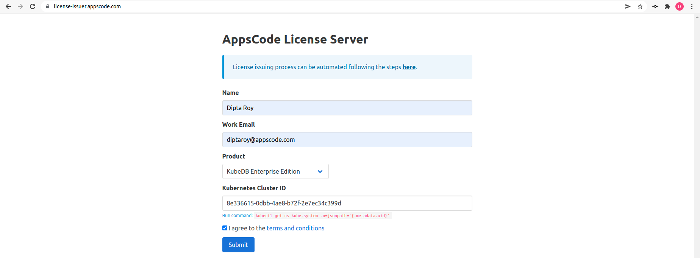
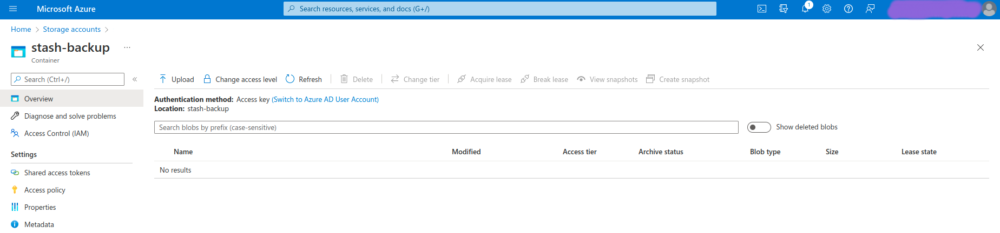
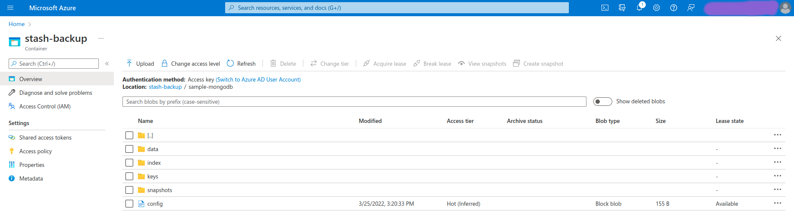

## Overview

The databases that KubeDB supports are MongoDB, MariaDB, MySQL, Elasticsearch, Redis, PostgreSQL, Percona XtraDB, ProxySQL, Memcached and PgBouncer. You can find the guides to all the supported databases [here](https://kubedb.com/).
In this tutorial we will deploy MongoDB database in Azure Kubernetes Service (AKS). We will cover the following steps:

1) Install KubeDB
2) Deploy MongoDB ReplicaSet Database
3) Install Stash
4) Backup MongoDB Database Using Stash
5) Recover MongoDB Database Using Stash

## Install KubeDB

We will follow the steps to install KubeDB.

### Get Cluster ID

We need the cluster ID to get the KubeDB License.
To get cluster ID we can run the following command:

```bash
$ kubectl get ns kube-system -o jsonpath='{.metadata.uid}'
8e336615-0dbb-4ae8-b72f-2e7ec34c399d 
```

### Get License

Go to [Appscode License Server](https://license-issuer.appscode.com/) to get the license.txt file. For this tutorial we will use KubeDB Enterprise Edition.



### Install KubeDB

We will use helm to install KubeDB. Please install helm [here](https://helm.sh/docs/intro/install/) if it is not already installed.
Now, let's install `KubeDB`.

```bash
$ helm repo add appscode https://charts.appscode.com/stable/
$ helm repo update

$ helm search repo appscode/kubedb
NAME                              	CHART VERSION	APP VERSION	DESCRIPTION                                       
appscode/kubedb                   	v2022.02.22  	v2022.02.22	KubeDB by AppsCode - Production ready databases...
appscode/kubedb-autoscaler        	v0.10.0      	v0.10.0    	KubeDB Autoscaler by AppsCode - Autoscale KubeD...
appscode/kubedb-catalog           	v2022.02.22  	v2022.02.22	KubeDB Catalog by AppsCode - Catalog for databa...
appscode/kubedb-community         	v0.24.2      	v0.24.2    	KubeDB Community by AppsCode - Community featur...
appscode/kubedb-crds              	v2022.02.22  	v2022.02.22	KubeDB Custom Resource Definitions                
appscode/kubedb-dashboard         	v0.1.0       	v0.1.0     	KubeDB Dashboard by AppsCode                      
appscode/kubedb-enterprise        	v0.11.2      	v0.11.2    	KubeDB Enterprise by AppsCode - Enterprise feat...
appscode/kubedb-grafana-dashboards	v2022.02.22  	v2022.02.22	A Helm chart for kubedb-grafana-dashboards by A...
appscode/kubedb-metrics           	v2022.02.22  	v2022.02.22	KubeDB State Metrics                              
appscode/kubedb-ops-manager       	v0.12.0      	v0.12.0    	KubeDB Ops Manager by AppsCode - Enterprise fea...
appscode/kubedb-opscenter         	v2022.02.22  	v2022.02.22	KubeDB Opscenter by AppsCode                      
appscode/kubedb-provisioner       	v0.25.0      	v0.25.0    	KubeDB Provisioner by AppsCode - Community feat...
appscode/kubedb-schema-manager    	v0.1.0       	v0.1.0     	KubeDB Schema Manager by AppsCode                 
appscode/kubedb-ui-server         	v2021.12.21  	v2021.12.21	A Helm chart for kubedb-ui-server by AppsCode     
appscode/kubedb-webhook-server    	v0.1.0       	v0.1.0     	KubeDB Webhook Server by AppsCode 

# Install KubeDB Enterprise operator chart
$ helm install kubedb appscode/kubedb \
  --version v2022.02.22 \
  --namespace kubedb --create-namespace \
  --set kubedb-provisioner.enabled=true \
  --set kubedb-ops-manager.enabled=true \
  --set kubedb-autoscaler.enabled=true \
  --set kubedb-dashboard.enabled=true \
  --set kubedb-schema-manager.enabled=true \
  --set-file global.license=/path/to/the/license.txt

```

Let's verify the installation:

```bash
$ watch kubectl get pods --all-namespaces -l "app.kubernetes.io/instance=kubedb"
NAMESPACE   NAME                                            READY   STATUS    RESTARTS   AGE
kubedb      kubedb-kubedb-autoscaler-5b9f7558d9-l672m       1/1     Running   0          4m
kubedb      kubedb-kubedb-dashboard-558db79d5b-dgsng        1/1     Running   0          4m
kubedb      kubedb-kubedb-ops-manager-7687749f6b-r2sj6      1/1     Running   0          4m
kubedb      kubedb-kubedb-provisioner-564c5d48c9-mxzf9      1/1     Running   0          4m
kubedb      kubedb-kubedb-schema-manager-6645ddf5b5-wbgbx   1/1     Running   0          4m
kubedb      kubedb-kubedb-webhook-server-6b84bc9988-8kvs7   1/1     Running   0          4m
```

We can list the CRD Groups that have been registered by the operator by running the following command:

```bash
$ kubectl get crd -l app.kubernetes.io/name=kubedb
NAME                                              CREATED AT
elasticsearchautoscalers.autoscaling.kubedb.com   2022-03-22T06:49:23Z
elasticsearchdashboards.dashboard.kubedb.com      2022-03-22T06:49:23Z
elasticsearches.kubedb.com                        2022-03-22T06:49:22Z
elasticsearchopsrequests.ops.kubedb.com           2022-03-22T06:49:22Z
elasticsearchversions.catalog.kubedb.com          2022-03-22T06:46:39Z
etcds.kubedb.com                                  2022-03-22T06:49:29Z
etcdversions.catalog.kubedb.com                   2022-03-22T06:46:39Z
mariadbautoscalers.autoscaling.kubedb.com         2022-03-22T06:49:26Z
mariadbdatabases.schema.kubedb.com                2022-03-22T06:49:20Z
mariadbopsrequests.ops.kubedb.com                 2022-03-22T06:49:36Z
mariadbs.kubedb.com                               2022-03-22T06:49:21Z
mariadbversions.catalog.kubedb.com                2022-03-22T06:46:39Z
memcacheds.kubedb.com                             2022-03-22T06:49:29Z
memcachedversions.catalog.kubedb.com              2022-03-22T06:46:40Z
mongodbautoscalers.autoscaling.kubedb.com         2022-03-22T06:49:20Z
mongodbdatabases.schema.kubedb.com                2022-03-22T06:49:20Z
mongodbopsrequests.ops.kubedb.com                 2022-03-22T06:49:25Z
mongodbs.kubedb.com                               2022-03-22T06:49:20Z
mongodbversions.catalog.kubedb.com                2022-03-22T06:46:40Z
mysqldatabases.schema.kubedb.com                  2022-03-22T06:49:19Z
mysqlopsrequests.ops.kubedb.com                   2022-03-22T06:49:33Z
mysqls.kubedb.com                                 2022-03-22T06:49:19Z
mysqlversions.catalog.kubedb.com                  2022-03-22T06:46:40Z
perconaxtradbs.kubedb.com                         2022-03-22T06:49:30Z
perconaxtradbversions.catalog.kubedb.com          2022-03-22T06:46:41Z
pgbouncers.kubedb.com                             2022-03-22T06:49:29Z
pgbouncerversions.catalog.kubedb.com              2022-03-22T06:46:41Z
postgresdatabases.schema.kubedb.com               2022-03-22T06:49:20Z
postgreses.kubedb.com                             2022-03-22T06:49:20Z
postgresopsrequests.ops.kubedb.com                2022-03-22T06:49:43Z
postgresversions.catalog.kubedb.com               2022-03-22T06:46:41Z
proxysqls.kubedb.com                              2022-03-22T06:49:31Z
proxysqlversions.catalog.kubedb.com               2022-03-22T06:46:42Z
redises.kubedb.com                                2022-03-22T06:49:31Z
redisopsrequests.ops.kubedb.com                   2022-03-22T06:49:39Z
redissentinels.kubedb.com                         2022-03-22T06:49:31Z
redisversions.catalog.kubedb.com                  2022-03-22T06:46:42Z
```

## Deploy MongoDB ReplicaSet Database

Now, we are going to Deploy MongoDB with the help of KubeDB.
At first, let's create a Namespace in which we will deploy the database.

```bash
$ kubectl create ns demo
namespace/demo created
```

Here is the yaml of the MongoDB CRO we are going to use:

```yaml
apiVersion: kubedb.com/v1alpha2
kind: MongoDB
metadata:
  name: sample-mongodb-rs
  namespace: demo
spec:
  version: "5.0.3"
  replicas: 3
  replicaSet:
    name: rs
  storage:
    storageClassName: "default"
    accessModes:
    - ReadWriteOnce
    resources:
      requests:
        storage: 1Gi
  terminationPolicy: WipeOut
```

Let's save this yaml configuration into `sample-mongodb-rs.yaml` 
Then create the above MongoDB CRO

```bash
$ kubectl apply -f sample-mongodb-rs.yaml
mongodb.kubedb.com/sample-mongodb-rs created
```

* In this yaml we can see in the `spec.version` field specifies the version of MongoDB. Here, we are using MongoDB `version 5.0.3`. You can list the KubeDB supported versions of MongoDB by running `$ kubectl get mongodbversions` command.
* `spec.storage` specifies PVC spec that will be dynamically allocated to store data for this database. This storage spec will be passed to the StatefulSet created by KubeDB operator to run database pods. You can specify any StorageClass available in your cluster with appropriate resource requests.
* And the `spec.terminationPolicy` field is *Wipeout* means that the database will be deleted without restrictions. It can also be "Halt", "Delete" and "DoNotTerminate". Learn More about these [HERE](https://kubedb.com/docs/v2022.02.22/guides/mongodb/concepts/mongodb/#specterminationpolicy).

Once these are handled correctly and the MongoDB object is deployed, you will see that the following objects are created:

```bash
$ kubectl get all -n demo
NAME                      READY   STATUS    RESTARTS   AGE
pod/sample-mongodb-rs-0   2/2     Running   0          14m
pod/sample-mongodb-rs-1   2/2     Running   0          13m
pod/sample-mongodb-rs-2   2/2     Running   0          12m

NAME                             TYPE        CLUSTER-IP    EXTERNAL-IP   PORT(S)     AGE
service/sample-mongodb-rs        ClusterIP   10.0.110.83   <none>        27017/TCP   14m
service/sample-mongodb-rs-pods   ClusterIP   None          <none>        27017/TCP   14m

NAME                                 READY   AGE
statefulset.apps/sample-mongodb-rs   3/3     14m

NAME                                                   TYPE                 VERSION   AGE
appbinding.appcatalog.appscode.com/sample-mongodb-rs   kubedb.com/mongodb   5.0.3     14m

NAME                                   VERSION   STATUS   AGE
mongodb.kubedb.com/sample-mongodb-rs   5.0.3     Ready    14m
```
Let’s check if the database is ready to use,

```bash
$ kubectl get mg -n demo sample-mongodb-rs
NAME                VERSION   STATUS   AGE
sample-mongodb-rs   5.0.3     Ready    14m
```
> We have successfully deployed MongoDB in AKS. Now we can exec into the container to use the database.

### Accessing Database Through CLI

To access the database through CLI, we have to get the credentials to access. Let’s export the credentials as environment variable to our current shell :

#### Export the Credentials

KubeDB will create Secret and Service for the database `sample-mongodb-rs` that we have deployed. Let’s check them using the following commands,

```bash
$ kubectl get secret -n demo -l=app.kubernetes.io/instance=sample-mongodb-rs
NAME                     TYPE     DATA   AGE
sample-mongodb-rs-auth   Opaque   2      15m
sample-mongodb-rs-key    Opaque   1      15m

$ kubectl get service -n demo -l=app.kubernetes.io/instance=sample-mongodb-rs
NAME                     TYPE        CLUSTER-IP    EXTERNAL-IP   PORT(S)     AGE
sample-mongodb-rs        ClusterIP   10.0.110.83   <none>        27017/TCP   15m
sample-mongodb-rs-pods   ClusterIP   None          <none>        27017/TCP   15m
```
Now, we are going to use `sample-mongodb-rs-auth` to export credentials.
Let’s export the `USER` and `PASSWORD` as environment variables to make further commands re-usable.

```bash
$ export USER=$(kubectl get secrets -n demo sample-mongodb-rs-auth -o jsonpath='{.data.\username}' | base64 -d)

$ export PASSWORD=$(kubectl get secrets -n demo sample-mongodb-rs-auth -o jsonpath='{.data.\password}' | base64 -d)
```

#### Insert Sample Data

In this section, we are going to login into our MongoDB database pod and insert some sample data. 

```bash
$ kubectl exec -it -n demo sample-mongodb-rs-0 -- mongo admin -u $USER -p $PASSWORD
Defaulted container "mongodb" out of: mongodb, replication-mode-detector, copy-config (init)
connecting to: mongodb://127.0.0.1:27017/admin?compressors=disabled&gssapiServiceName=mongodb


rs:PRIMARY> show dbs
admin   0.000GB
config  0.000GB
local   0.000GB

rs:PRIMARY> show users
{
	"_id" : "admin.root",
	"userId" : UUID("f01a3025-3937-4e87-b0d9-023f0994fc40"),
	"user" : "root",
	"db" : "admin",
	"roles" : [
		{
			"role" : "root",
			"db" : "admin"
		}
	],
	"mechanisms" : [
		"SCRAM-SHA-1",
		"SCRAM-SHA-256"
	]
}

rs:PRIMARY> use musicdb
switched to db musicdb

rs:PRIMARY> db.bands.insert({"name":"Backstreet Boys"});
WriteResult({ "nInserted" : 1 })

rs:PRIMARY> db.bands.find().pretty()
{ "_id" : ObjectId("623aa7550d970b42f91471a3"), "name" : "Backstreet Boys" }

rs:PRIMARY> exit
bye

```

> We've successfully inserted some sample data to our database. And this was just an example of our MongoDB ReplicaSet database deployment. The other databases that KubeDB supports are Elasticsearch, Redis, MySQL, PostgreSQL, MariaDB, Percona XtraDB, ProxySQL, Memcached and PgBouncer. More information about Run & Manage MongoDB on Kubernetes can be found [HERE](https://kubedb.com/kubernetes/databases/run-and-manage-mongodb-on-kubernetes/)

## Backup MongoDB Database Using Stash

Here, we are going to use Stash to backup the MongoDB database we deployed before.

### Install Stash

Kubedb Enterprise License works for Stash too.
So, we will use the Enterprise license that we already obtained.

```bash
$ helm install stash appscode/stash             \
  --version v2022.02.22                         \
  --namespace kube-system                       \
  --set features.enterprise=true                \
  --set-file global.license=/path/to/the/license.txt
```

Let's verify the installation:

```bash
$ watch kubectl get pods --all-namespaces -l app.kubernetes.io/name=stash-enterprise
NAMESPACE     NAME                                      READY   STATUS    RESTARTS   AGE
kube-system   stash-stash-enterprise-786687ff94-j5gnb   2/2     Running   0          10m
```

Now, to confirm CRD groups have been registered by the operator, run the following command:

```bash
$ kubectl get crd -l app.kubernetes.io/name=stash
NAME                                      CREATED AT
backupbatches.stash.appscode.com          2022-03-23T05:31:28Z
backupblueprints.stash.appscode.com       2022-03-23T05:31:29Z
backupconfigurations.stash.appscode.com   2022-03-23T05:31:27Z
backupsessions.stash.appscode.com         2022-03-23T05:31:27Z
functions.stash.appscode.com              2022-03-23T05:29:56Z
repositories.stash.appscode.com           2022-03-22T06:49:21Z
restorebatches.stash.appscode.com         2022-03-23T05:31:29Z
restoresessions.stash.appscode.com        2022-03-22T06:49:21Z
tasks.stash.appscode.com                  2022-03-23T05:29:56Z

```


### Prepare Backend

Stash supports various backends for storing data snapshots. It can be a cloud storage like GCS bucket, AWS S3, Azure Blob Storage etc. or a Kubernetes persistent volume like HostPath, PersistentVolumeClaim, NFS etc.

For this tutorial we are going to use azure storage. You can find other setups [here](https://stash.run/docs/v2022.02.22/guides/backends/overview/).

 

At first we need to create a secret so that we can access the azure storage container. We can do that by the following code:

```bash
$ echo -n 'changeit' > RESTIC_PASSWORD
$ echo -n '<your-azure-storage-account-name>' > AZURE_ACCOUNT_NAME
$ echo -n '<your-azure-storage-account-key>' > AZURE_ACCOUNT_KEY
$ kubectl create secret generic -n demo azure-secret \
    --from-file=./RESTIC_PASSWORD \
    --from-file=./AZURE_ACCOUNT_NAME \
    --from-file=./AZURE_ACCOUNT_KEY
secret/azure-secret created
 ```

### Create Repository

```yaml
apiVersion: stash.appscode.com/v1alpha1
kind: Repository
metadata:
  name: azure-repo
  namespace: demo
spec:
  backend:
    azure:
      container: stash-backup
      prefix: /sample-mongodb
    storageSecretName: azure-secret

```

This repository CRO specifies the `azure-secret` we created before and stores the name and path to the azure storage container. It also specifies the location to the container where we want to backup our database.
> Here, My container name is `stash-backup`. Don't forget to change `spec.backend.azure.container` to your container name.

Lets create this repository,

```bash
$ kubectl apply -f azure-repo.yaml 
repository.stash.appscode.com/azure-repo created
```

### Create BackupConfiguration

Now, we need to create a `BackupConfiguration` file that specifies what to backup, where to backup and when to backup.

```yaml
apiVersion: stash.appscode.com/v1beta1
kind: BackupConfiguration
metadata:
  name: sample-mongodb-backup
  namespace: demo
spec:
  schedule: "*/5 * * * *"
  repository:
    name: azure-repo
  target:
    ref:
      apiVersion: appcatalog.appscode.com/v1alpha1
      kind: AppBinding
      name: sample-mongodb-rs
  retentionPolicy:
    name: keep-last-5
    keepLast: 5
    prune: true
```
Create this `BackupConfiguration` by following command,

```bash
$ kubectl apply -f sample-mongodb-backup.yaml
backupconfiguration.stash.appscode.com/sample-mongodb-backup created
```

* `BackupConfiguration` creates a cronjob that backs up the specified database (`spec.target`) every 5 minutes.
* `spec.repository` contains the secret we created before called `azure-secret`.
* `spec.target.ref` contains the reference to the appbinding that we want to backup.
* `spec.schedule` specifies that we want to backup the database at 5 minutes interval.
* `spec.retentionPolicy` specifies the policy to follow for cleaning old snapshots. 
* To learn more about `AppBinding`, click here [AppBinding](https://kubedb.com/docs/v2022.02.22/guides/mongodb/concepts/appbinding/). 
So, after 5 minutes we can see the following status:

```bash
$ kubectl get backupsession -n demo
NAME                               INVOKER-TYPE          INVOKER-NAME            PHASE       DURATION   AGE
sample-mongodb-backup-1648200001   BackupConfiguration   sample-mongodb-backup   Succeeded   39s        4m8s

$ kubectl get repository -n demo
NAME         INTEGRITY   SIZE        SNAPSHOT-COUNT   LAST-SUCCESSFUL-BACKUP   AGE
azure-repo   true        3.442 KiB   1                2m32s                    5m10s
```

Now if we check our azure storage container, we can see that the backup has been successful.



> **If you have reached here, CONGRATULATIONS!! :confetti_ball: :confetti_ball: :confetti_ball: You have successfully backed up MongoDB Database using Stash.** If you had any problem during the backup process, you can reach out to us via [EMAIL](mailto:support@appscode.com?subject=Stash%20Backup%20Failed%20in%20GKE).

## Recover MongoDB Database Using Stash

Let's think of a scenario in which the database has been accidentally deleted or there was an error in the database causing it to crash.

#### Temporarily pause backup

At first, let’s stop taking any further backup of the database so that no backup runs after we delete the sample data. We are going to pause the `BackupConfiguration` object. Stash will stop taking any further backup when the `BackupConfiguration` is paused.

```bash
$ kubectl patch backupconfiguration -n demo sample-mongodb-backup --type="merge" --patch='{"spec": {"paused": true}}'
backupconfiguration.stash.appscode.com/sample-mongodb-backup patched
```

Now, we are going to delete database to simulate accidental database deletion.

```bash
$ kubectl exec -it -n demo sample-mongodb-rs-0 -- mongo admin -u $USER -p $PASSWORD
Defaulted container "mongodb" out of: mongodb, replication-mode-detector, copy-config (init)
connecting to: mongodb://127.0.0.1:27017/admin?compressors=disabled&gssapiServiceName=mongodb
Implicit session: session { "id" : UUID("f64bfb3f-92cd-4f96-8324-93a0c0424a71") }


rs:PRIMARY> show dbs
admin    0.000GB
config   0.000GB
local    0.000GB
musicdb  0.000GB

rs:PRIMARY> use musicdb
switched to db musicdb

rs:PRIMARY> db.dropDatabase()
{
	"dropped" : "musicdb",
	"ok" : 1,
	"$clusterTime" : {
		"clusterTime" : Timestamp(1648015351, 2),
		"signature" : {
			"hash" : BinData(0,"uwmB1ExDxfkW26amQf/vRdHr9zI="),
			"keyId" : NumberLong("7078142885907922946")
		}
	},
	"operationTime" : Timestamp(1648015351, 2)
}

rs:PRIMARY> show dbs
admin   0.000GB
config  0.000GB
local   0.000GB

rs:PRIMARY> exit
bye

```

### Create a RestoreSession

Below, is the contents of YAML file of the `RestoreSession` object that we are going to create.

```yaml
apiVersion: stash.appscode.com/v1beta1
kind: RestoreSession
metadata:
  name: sample-mongodb-restore
  namespace: demo
spec:
  repository:
    name: azure-repo
  target:
    ref:
      apiVersion: appcatalog.appscode.com/v1alpha1
      kind: AppBinding
      name: sample-mongodb-rs
  rules:
    - snapshots: [latest]
```

Now, let's create `RestoreSession` that will initiate restoring from the cloud.

```bash
$ kubectl create -f sample-mongodb-restore.yaml
restoresession.stash.appscode.com/sample-mongodb-restore created
```

This `RestoreSession` specifies where the data will be restored.
Once this is applied, a `RestoreSession` will be created. Once it has succeeded, the database has been successfully recovered as you can see below:

```bash
$ kubectl get restoresession -n demo
NAME                     REPOSITORY   PHASE       DURATION   AGE
sample-mongodb-restore   azure-repo   Succeeded   4s         15s
```

Now, let's check whether the database has been correctly restored:

```bash
$ kubectl exec -it -n demo sample-mongodb-rs-0 -- mongo admin -u $USER -p $PASSWORD
Defaulted container "mongodb" out of: mongodb, replication-mode-detector, copy-config (init)
connecting to: mongodb://127.0.0.1:27017/admin?compressors=disabled&gssapiServiceName=mongodb
Implicit session: session { "id" : UUID("2bfc0dd1-49ce-4580-8599-b245561015d7") }

rs:PRIMARY> show dbs
admin    0.000GB
config   0.000GB
local    0.000GB
musicdb  0.000GB

rs:PRIMARY> use musicdb
switched to db musicdb

rs:PRIMARY> db.bands.find().pretty()
{ "_id" : ObjectId("623aa7550d970b42f91471a3"), "name" : "Backstreet Boys" }

rs:PRIMARY> exit
bye
```

> You can see the database has been restored. The recovery of MongoDB Database has been successful. If you faced any difficulties in the recovery process, you can reach out to us through [EMAIL](mailto:support@appscode.com?subject=Stash%20Recovery%20Failed%20in%20GKE).

We have made an in depth video on how to Run & Manage Production-Grade MongoDB in Kubernetes cluster using KubeDB. You can have a look into the video below:

<iframe width="560" height="315" src="https://www.youtube.com/embed/CU2YMA9kYdA" title="YouTube video player" frameborder="0" allow="accelerometer; autoplay; clipboard-write; encrypted-media; gyroscope; picture-in-picture" allowfullscreen></iframe>

## Support

To speak with us, please leave a message on [our website](https://appscode.com/contact/).

To join public discussions with the KubeDB community, join us in the [Kubernetes Slack team](https://kubernetes.slack.com/messages/C8149MREV/) channel `#kubedb`. To sign up, use our [Slack inviter](http://slack.kubernetes.io/).

To receive product announcements, follow us on [Twitter](https://twitter.com/KubeDB).

To watch tutorials of various Production-Grade Kubernetes Tools Subscribe our [YouTube](https://www.youtube.com/c/AppsCodeInc/) channel.

More about [MongoDB in Kubernetes](https://kubedb.com/kubernetes/databases/run-and-manage-mongodb-on-kubernetes/)

If you have found a bug with KubeDB or want to request for new features, please [file an issue](https://github.com/kubedb/project/issues/new).
