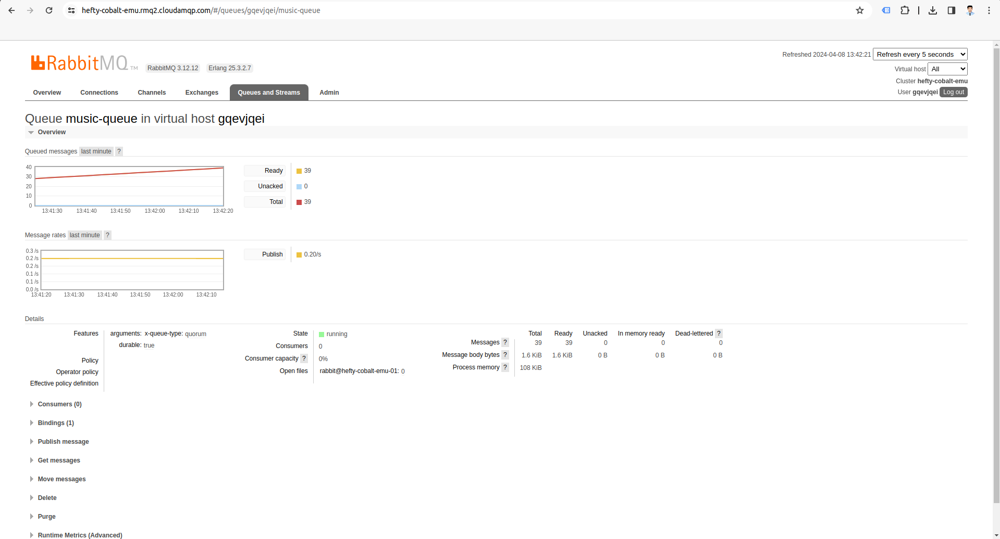
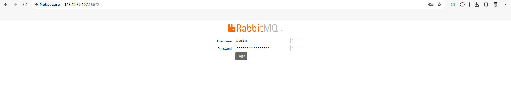
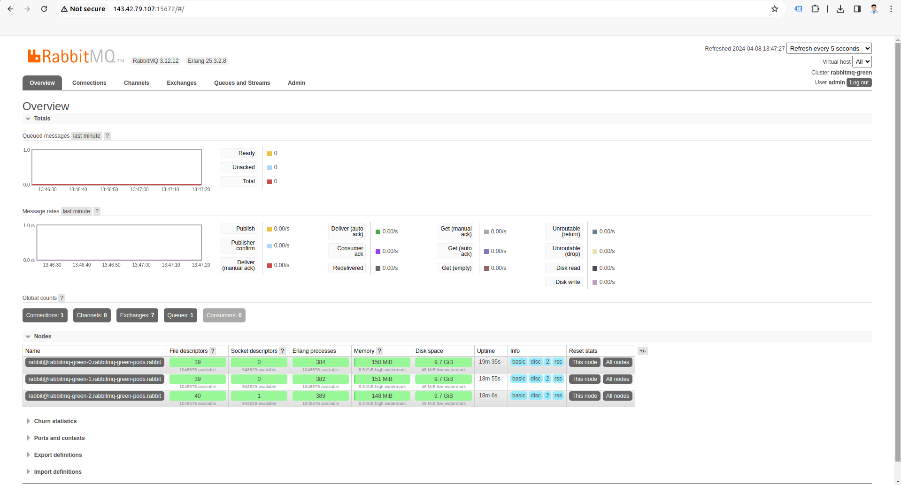
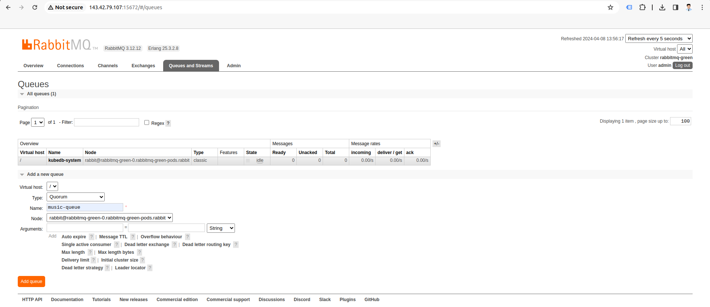
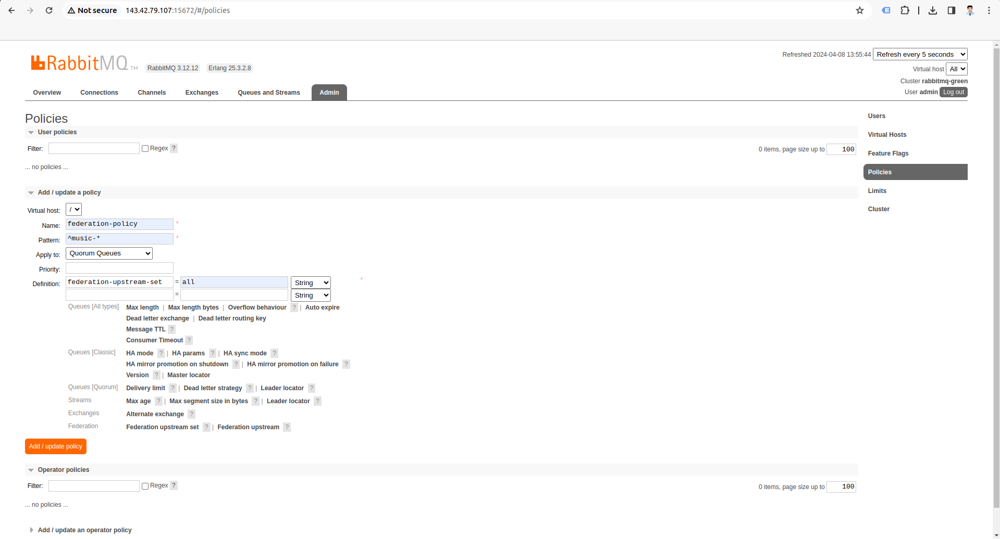
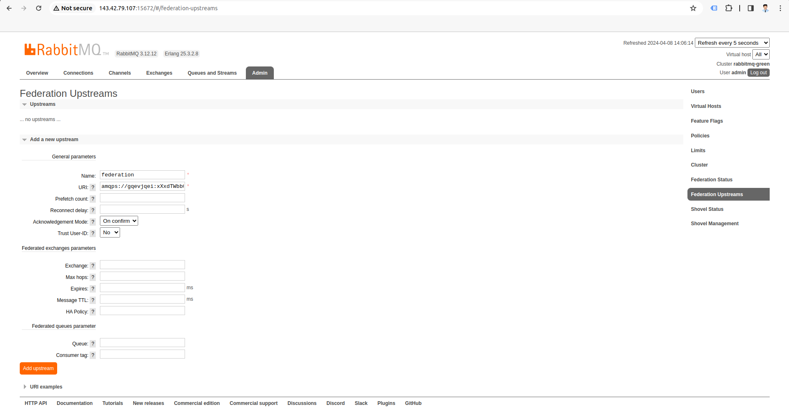
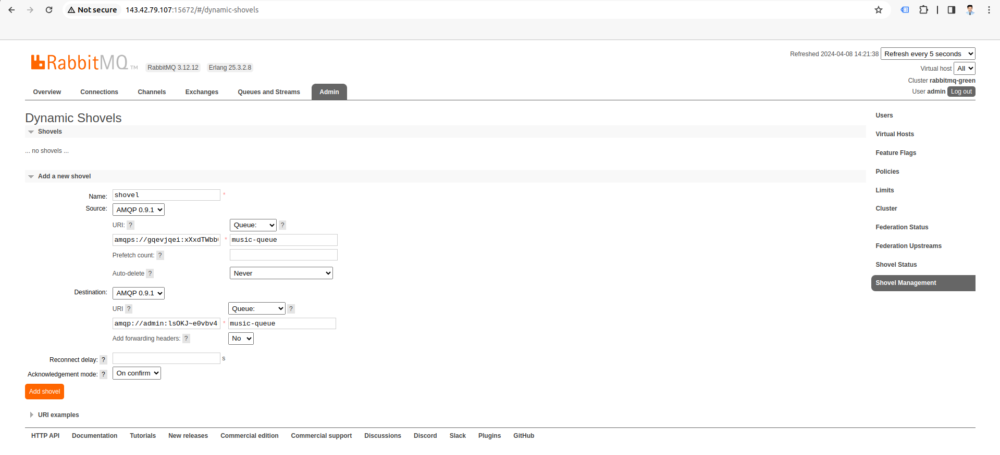
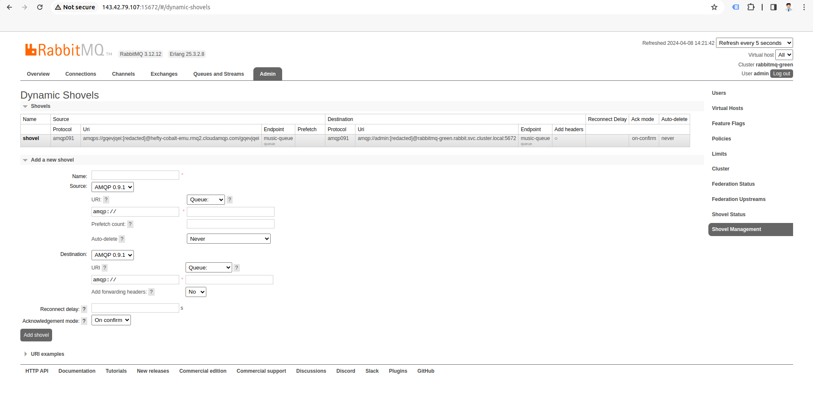

## Overview

RabbitMQ is a very well known and highly used messaging and streaming broker, which is easy to deploy on cloud environments, on-premises, and on your local machine. It is currently used by millions worldwide. However, from provisioning RabbitMQ on kubernetes with stable cluster configuration and managing production operations like scaling, monitoring, ensuring security etc. are often proved as a hurdle for many systems. KubeDB is the Kubernetes Native Database Management Solution which simplifies and automates routine database tasks such as Provisioning, Monitoring, Upgrading, Patching, Scaling, Volume Expansion, Backup, Recovery, Failure detection, and Repair for various popular databases on private and public clouds. The wide range of databases supported by KubeDB include MongoDB, Elasticsearch, MySQL, MariaDB, Redis, PostgreSQL, FerretDB, Percona XtraDB and Memcached. Additionally, KubeDB also supports ProxySQL, PgBouncer and the streaming platform Kafka, RabbitMQ. Basically, it's a one operator solution for all of these databases. In order migrate to KubeDB managed RabbitMQ cluster Blue-green deployment strategy can be adopted. It is an upgrade strategy that is based on the idea of setting up a second RabbitMQ cluster (the "green" one) next to the current production cluster (the "blue" one). Producer and Consumer Application traffics are then switched to the "green" cluster. When that migration is done, the "blue" cluster can be decommissioned (shut down). To simplify the switch, federated queues can be used to transfer enqueued messages from the "blue" to the "green" cluster.

In this tutorial we will Migrate a RabbitMQ cluster hosted on CloudAMQP to a newly deployed KubeDB managed RabbitMQ cluster Using Blue-Green Deployment Strategy.

## RabbitMQ Blue Cluster

We have an existing cluster in CloudAMQP, which has a queue  named `music-queue` that is continuously being published to and consumed by microservices.



In this tutorial, we will consider CloudAMQP as our Blue cluster and GKE as our Green cluster. So, we will migrate this `music-queue` from CloudAMQP to Google Kubernetes Engine (GKE) via Blue-Green deployment strategy.

## Preparing the "green" Cluster

We have created a new cluster in Google Kubernetes Engine (GKE).
After creating a new cluster where we will migrate our existing RabbitMQ cluster, there are two steps to follow:
- import definitions, e.g. exchanges, queues, bindings
- configure federation to later drain messages

#### Importing definitions

The procedure of definitions export/import is covered in the [Backup guide](https://www.rabbitmq.com/docs/backup#definitions-export). The "blue" is the source cluster and the "green" one is the target.

### Install KubeDB

#### Get Cluster ID

We need the cluster ID to get the KubeDB License. To get cluster ID, we can run the following command:

```bash
$ kubectl get ns kube-system -o jsonpath='{.metadata.uid}'
8e336615-0dbb-4ae8-b72f-2e7ec34c399d
```

### Get License

Go to [Appscode License Server](https://license-issuer.appscode.com/) to get the license.txt file. For this tutorial we will use KubeDB.


We will use helm to install KubeDB. Please install helm [here](https://helm.sh/docs/intro/install/) if it is not already installed.
Now, let's install `KubeDB`.

```bash
$ helm search repo appscode/kubedb
NAME                              	CHART VERSION	APP VERSION	DESCRIPTION
appscode/kubedb                   	v2024.3.16   	v2024.3.16 	KubeDB by AppsCode - Production ready databases...
appscode/kubedb-autoscaler        	v0.29.0      	v0.29.0    	KubeDB Autoscaler by AppsCode - Autoscale KubeD...
appscode/kubedb-catalog           	v2024.3.16   	v2024.3.16 	KubeDB Catalog by AppsCode - Catalog for databa...
appscode/kubedb-community         	v0.24.2      	v0.24.2    	KubeDB Community by AppsCode - Community featur...
appscode/kubedb-crd-manager       	v0.0.8       	v0.0.8     	KubeDB CRD Manager by AppsCode
appscode/kubedb-crds              	v2024.3.16   	v2024.3.16 	KubeDB Custom Resource Definitions
appscode/kubedb-dashboard         	v0.20.0      	v0.20.0    	KubeDB Dashboard by AppsCode
appscode/kubedb-enterprise        	v0.11.2      	v0.11.2    	KubeDB Enterprise by AppsCode - Enterprise feat...
appscode/kubedb-grafana-dashboards	v2024.3.16   	v2024.3.16 	A Helm chart for kubedb-grafana-dashboards by A...
appscode/kubedb-kubestash-catalog 	v2024.3.16   	v2024.3.16 	KubeStash Catalog by AppsCode - Catalog of Kube...
appscode/kubedb-metrics           	v2024.3.16   	v2024.3.16 	KubeDB State Metrics
appscode/kubedb-one               	v2023.12.28  	v2023.12.28	KubeDB and Stash by AppsCode - Production ready...
appscode/kubedb-ops-manager       	v0.31.0      	v0.31.0    	KubeDB Ops Manager by AppsCode - Enterprise fea...
appscode/kubedb-opscenter         	v2024.3.16   	v2024.3.16 	KubeDB Opscenter by AppsCode
appscode/kubedb-provider-aws      	v2024.3.16   	v0.6.0     	A Helm chart for KubeDB AWS Provider for Crossp...
appscode/kubedb-provider-azure    	v2024.3.16   	v0.6.0     	A Helm chart for KubeDB Azure Provider for Cros...
appscode/kubedb-provider-gcp      	v2024.3.16   	v0.6.0     	A Helm chart for KubeDB GCP Provider for Crossp...
appscode/kubedb-provisioner       	v0.44.0      	v0.44.0    	KubeDB Provisioner by AppsCode - Community feat...
appscode/kubedb-schema-manager    	v0.20.0      	v0.20.0    	KubeDB Schema Manager by AppsCode
appscode/kubedb-ui                	v2024.2.13   	0.6.4      	A Helm chart for Kubernetes
appscode/kubedb-ui-server         	v2021.12.21  	v2021.12.21	A Helm chart for kubedb-ui-server by AppsCode
appscode/kubedb-webhook-server    	v0.20.0      	v0.20.0    	KubeDB Webhook Server by AppsCode


$ helm install kubedb oci://ghcr.io/appscode-charts/kubedb \
  --version v2024.3.16 \
  --namespace kubedb --create-namespace \
  --set global.featureGates.RabbitMQ=true \
  --set-file global.license=/path/to/the/license.txt \
  --wait --burst-limit=10000 --debug
```

Let's verify the installation:

```bash
$ kubectl get pods --all-namespaces -l "app.kubernetes.io/instance=kubedb"
NAMESPACE   NAME                                            READY   STATUS    RESTARTS   AGE
kubedb      kubedb-kubedb-autoscaler-685c67d884-kw6gr       1/1     Running   0          81s
kubedb      kubedb-kubedb-ops-manager-65f59c5d4d-24mph      1/1     Running   0          81s
kubedb      kubedb-kubedb-provisioner-76867965c4-49b5c      1/1     Running   0          81s
kubedb      kubedb-kubedb-webhook-server-7fd7894ff6-wrrhr   1/1     Running   0          81s
kubedb      kubedb-petset-operator-5d94b4ddb8-p8nnc         1/1     Running   0          81s
kubedb      kubedb-petset-webhook-server-6b9dc556d5-whxq2   2/2     Running   0          81s
kubedb      kubedb-sidekick-5dc87959b7-twjtm                1/1     Running   0          81s
```

We can list the CRD Groups that have been registered by the operator by running the following command:

```bash
$ kubectl get crd -l app.kubernetes.io/name=kubedb
NAME                                               CREATED AT
connectclusters.kafka.kubedb.com                   2024-04-09T05:52:24Z
connectors.kafka.kubedb.com                        2024-04-09T05:52:25Z
druidversions.catalog.kubedb.com                   2024-04-09T05:49:53Z
elasticsearchautoscalers.autoscaling.kubedb.com    2024-04-09T05:52:20Z
elasticsearchdashboards.elasticsearch.kubedb.com   2024-04-09T05:52:20Z
elasticsearches.kubedb.com                         2024-04-09T05:52:19Z
elasticsearchopsrequests.ops.kubedb.com            2024-04-09T05:52:19Z
elasticsearchversions.catalog.kubedb.com           2024-04-09T05:49:53Z
etcdversions.catalog.kubedb.com                    2024-04-09T05:49:54Z
ferretdbversions.catalog.kubedb.com                2024-04-09T05:49:54Z
kafkaautoscalers.autoscaling.kubedb.com            2024-04-09T05:52:26Z
kafkaconnectorversions.catalog.kubedb.com          2024-04-09T05:49:54Z
kafkaopsrequests.ops.kubedb.com                    2024-04-09T05:52:25Z
kafkas.kubedb.com                                  2024-04-09T05:52:24Z
kafkaversions.catalog.kubedb.com                   2024-04-09T05:49:55Z
mariadbarchivers.archiver.kubedb.com               2024-04-09T05:52:31Z
mariadbautoscalers.autoscaling.kubedb.com          2024-04-09T05:52:30Z
mariadbdatabases.schema.kubedb.com                 2024-04-09T05:52:30Z
mariadbopsrequests.ops.kubedb.com                  2024-04-09T05:52:30Z
mariadbs.kubedb.com                                2024-04-09T05:52:29Z
mariadbversions.catalog.kubedb.com                 2024-04-09T05:49:55Z
memcachedversions.catalog.kubedb.com               2024-04-09T05:49:55Z
mongodbarchivers.archiver.kubedb.com               2024-04-09T05:52:39Z
mongodbautoscalers.autoscaling.kubedb.com          2024-04-09T05:52:39Z
mongodbdatabases.schema.kubedb.com                 2024-04-09T05:52:41Z
mongodbopsrequests.ops.kubedb.com                  2024-04-09T05:52:38Z
mongodbs.kubedb.com                                2024-04-09T05:52:37Z
mongodbversions.catalog.kubedb.com                 2024-04-09T05:49:56Z
mysqlarchivers.archiver.kubedb.com                 2024-04-09T05:52:49Z
mysqlautoscalers.autoscaling.kubedb.com            2024-04-09T05:52:48Z
mysqldatabases.schema.kubedb.com                   2024-04-09T05:52:52Z
mysqlopsrequests.ops.kubedb.com                    2024-04-09T05:52:47Z
mysqls.kubedb.com                                  2024-04-09T05:52:46Z
mysqlversions.catalog.kubedb.com                   2024-04-09T05:49:56Z
perconaxtradbversions.catalog.kubedb.com           2024-04-09T05:49:56Z
pgbouncerversions.catalog.kubedb.com               2024-04-09T05:49:57Z
pgpoolversions.catalog.kubedb.com                  2024-04-09T05:49:57Z
postgresarchivers.archiver.kubedb.com              2024-04-09T05:53:00Z
postgresautoscalers.autoscaling.kubedb.com         2024-04-09T05:52:59Z
postgresdatabases.schema.kubedb.com                2024-04-09T05:53:01Z
postgreses.kubedb.com                              2024-04-09T05:52:57Z
postgresopsrequests.ops.kubedb.com                 2024-04-09T05:52:58Z
postgresversions.catalog.kubedb.com                2024-04-09T05:49:57Z
proxysqlversions.catalog.kubedb.com                2024-04-09T05:49:58Z
publishers.postgres.kubedb.com                     2024-04-09T05:53:01Z
rabbitmqs.kubedb.com                               2024-04-09T05:53:06Z
rabbitmqversions.catalog.kubedb.com                2024-04-09T05:49:58Z
redisautoscalers.autoscaling.kubedb.com            2024-04-09T05:53:11Z
redises.kubedb.com                                 2024-04-09T05:53:10Z
redisopsrequests.ops.kubedb.com                    2024-04-09T05:53:11Z
redissentinelautoscalers.autoscaling.kubedb.com    2024-04-09T05:53:13Z
redissentinelopsrequests.ops.kubedb.com            2024-04-09T05:53:13Z
redissentinels.kubedb.com                          2024-04-09T05:53:12Z
redisversions.catalog.kubedb.com                   2024-04-09T05:49:58Z
singlestoreversions.catalog.kubedb.com             2024-04-09T05:49:59Z
solrversions.catalog.kubedb.com                    2024-04-09T05:49:59Z
subscribers.postgres.kubedb.com                    2024-04-09T05:53:01Z
zookeeperversions.catalog.kubedb.com               2024-04-09T05:49:59Z
```
> We recommend you to install the latest KubeDB version available 

## Deploy KubeDB RabbitMQ to the Green Cluster

We are going to Deploy RabbitMQ by using KubeDB.
First, let's create a Namespace in which we will deploy RabbitMQ.

```bash
$ kubectl create namespace rabbit
namespace/rabbit created
```

Here is the yaml of the RabbitMQ CR we are going to use:

```yaml
apiVersion: kubedb.com/v1alpha2
kind: RabbitMQ
metadata:
  name: rabbitmq-green
  namespace: rabbit
spec:
  version: "3.12.12"
  replicas: 3
  storage:
    accessModes:
      - ReadWriteOnce
    resources:
      requests:
        storage: 1Gi
    storageClassName: standard
  storageType: Durable
  terminationPolicy: WipeOut
  podTemplate:
    spec:
      containers:
        - name: rabbitmq
          resources:
            requests:
              cpu: "0.5"
              memory: "1Gi"
            limits:
              memory: "2Gi"
  serviceTemplates:
    - alias: primary
      spec:
        type: LoadBalancer
```

Let's save this yaml configuration into `rabbitmq-green.yaml`
Then create the above RabbitMQ CR,

```bash
$ kubectl apply -f rabbitmq-green.yaml
rabbitmq.kubedb.com/rabbitmq-green created
```

In this yaml,

- `spec.version` field specifies the version of RabbitMQ. Here, we are using RabbitMQ `3.12.12`. You can list the KubeDB supported versions of RabbitMQ by running `$ kubectl get rabbitmqversions` command.
- `spec.storage.storageClassName` is the name of the StorageClass used to provision PVCs.
- `spec.serviceTemplates` field will allow you to set the type and other properties of the services.

Once these are handled correctly and the RabbitMQ object is deployed, you will see that the following objects are created:

```bash
$ kubectl get all -n rabbit
NAME                   READY   STATUS    RESTARTS   AGE
pod/rabbitmq-green-0   1/1     Running   0          106s
pod/rabbitmq-green-1   1/1     Running   0          65s
pod/rabbitmq-green-2   1/1     Running   0          41s

NAME                          TYPE           CLUSTER-IP    EXTERNAL-IP     PORT(S)                          AGE
service/rabbitmq-green        LoadBalancer   10.5.188.11   34.123.239.45   15672:31855/TCP,5672:31777/TCP   107s
service/rabbitmq-green-pods   ClusterIP      None          <none>          4369/TCP,25672/TCP               107s

NAME                                                TYPE                  VERSION   AGE
appbinding.appcatalog.appscode.com/rabbitmq-green   kubedb.com/rabbitmq   3.12.12   109s
```

Let’s check if the `rabbitmq-green` is ready to use,

```bash
$ kubectl get rabbitmq -n rabbit rabbitmq-green
NAME             TYPE                  VERSION   STATUS   AGE
rabbitmq-green   kubedb.com/v1alpha2   3.12.12   Ready    3m7s
```

> We have successfully deployed RabbitMQ cluster in GKE.

### RabbitMQ Plugins

For this migration, we need to integrate the RabbitMQ Federation Plugin and RabbitMQ Shovel Plugin into our Green cluster (GKE).

### Accessing RabbitMQ Green Cluster Through UI

To access RabbitMQ through UI, we have to get the credentials to access. KubeDB will create Secret and Service for the database `rabbitmq-green` that we have deployed. Let’s check them using the following commands,

```bash
 $ kubectl get secret -n rabbit
NAME                           TYPE                       DATA   AGE
rabbitmq-green-admin-cred      kubernetes.io/basic-auth   2      16m
rabbitmq-green-config          Opaque                     2      16m
rabbitmq-green-erlang-cookie   Opaque                     1      26m

$ kubectl get svc -n rabbit
NAME                  TYPE           CLUSTER-IP     EXTERNAL-IP     PORT(S)                          AGE
rabbitmq-green        LoadBalancer   10.128.28.64   143.42.79.107   15672:30409/TCP,5672:30528/TCP   16m
rabbitmq-green-pods   ClusterIP      None           <none>          4369/TCP,25672/TCP               16m
rabbitmq-publisher    ClusterIP      None           <none>          80/TCP                           4m34s
```

Now, we are going to use `rabbitmq-green-admin-cred` to get the credentials.

```bash
$ kubectl get secrets -n rabbit rabbitmq-green-admin-cred -o jsonpath='{.data.username}' | base64 -d
admin

$ kubectl get secrets -n rabbit rabbitmq-green-admin-cred -o jsonpath='{.data.password}' | base64 -d
lsOKJ~e0vbv4rErU
```

We will use the `EXTERNAL-IP` `143.42.79.107` of `rabbitmq-green` and the port `15672` to access the UI.





Firstly, we need to establish a new queue named `music-queue` within our RabbitMQ Green cluster.



Next, we'll set up a policy for our `music-queue` to define specific configurations. Policies in RabbitMQ enable us to automate various aspects of queue management.



Now, we'll configure a federation upstream to establish a connection with the Blue cluster hosted on CloudAMQP. This connection will enable seamless communication between the two clusters, allowing for message replication and synchronization.



To streamline the migration process and ensure efficient message transfer between clusters, we'll leverage the RabbitMQ Shovel Plugin. This plugin enables the direct movement of messages from the Blue cluster to the Green cluster, minimizing downtime and data loss.





Once all configurations are in place, we can initiate the migration process. Messages will be automatically transferred from the `music-queue` in the Blue cluster to the corresponding queue in the Green cluster using the configured federation upstream and shovel plugin.
By integrating RabbitMQ Federation Plugin and RabbitMQ Shovel Plugin into our Green cluster, we've successfully established a robust infrastructure for migrating our `music-queue` from the Blue cluster. This approach ensures minimal downtime and data loss, making the transition seamless and efficient.

We have created a detailed video on migrating RabbitMQ to KubeDB using Federation and Shovel. You can have a look at that video below:"

<iframe width="560" height="315" src="https://www.youtube.com/embed/D-XYsLV0R_s?si=__QrEuaSvZ5SEGrh" title="YouTube video player" frameborder="0" allow="accelerometer; autoplay; clipboard-write; encrypted-media; gyroscope; picture-in-picture; web-share" referrerpolicy="strict-origin-when-cross-origin" allowfullscreen></iframe>

## Support

To speak with us, please leave a message on [our website](https://appscode.com/contact/).

To receive product announcements, follow us on [X](https://twitter.com/KubeDB).

To watch tutorials of various Production-Grade Kubernetes Tools Subscribe to our [YouTube](https://www.youtube.com/c/AppsCodeInc/) channel.

If you have found a bug with KubeDB or want to request for new features, please [file an issue](https://github.com/kubedb/project/issues/new).
