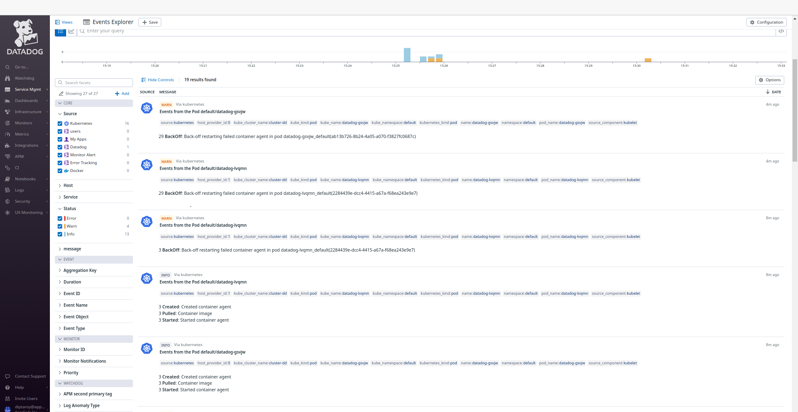
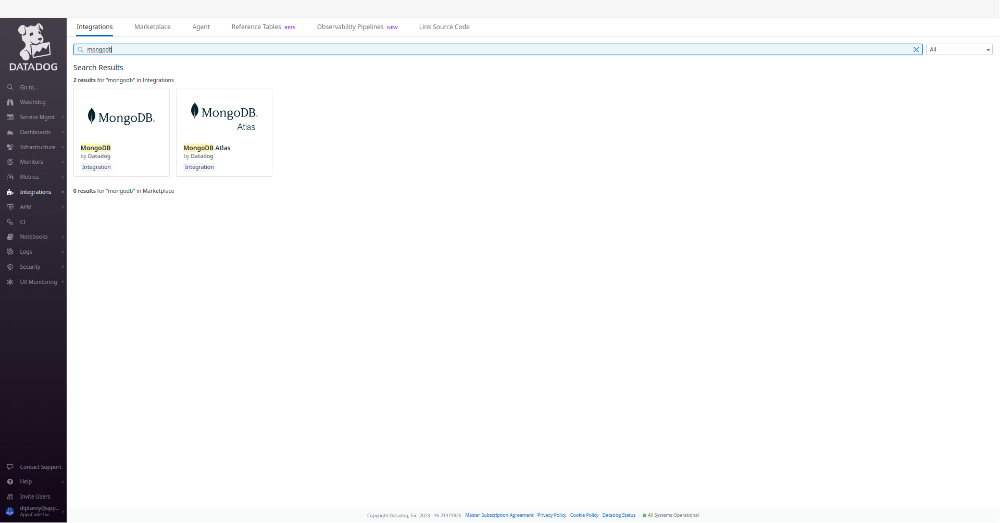
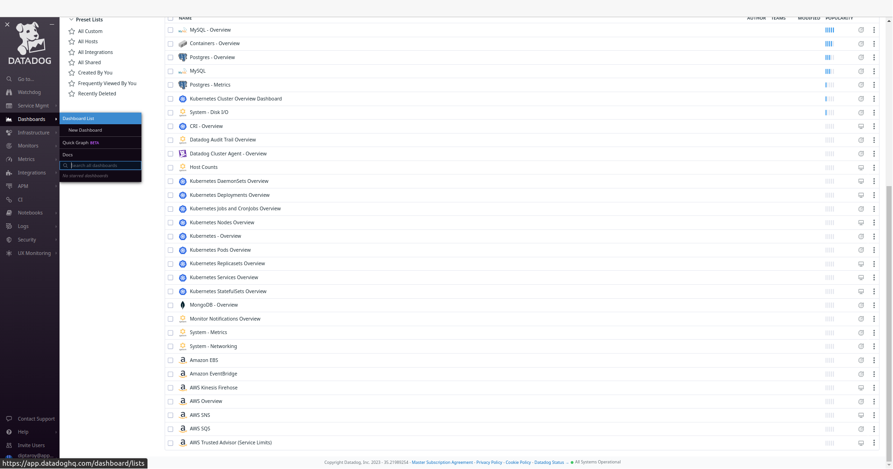
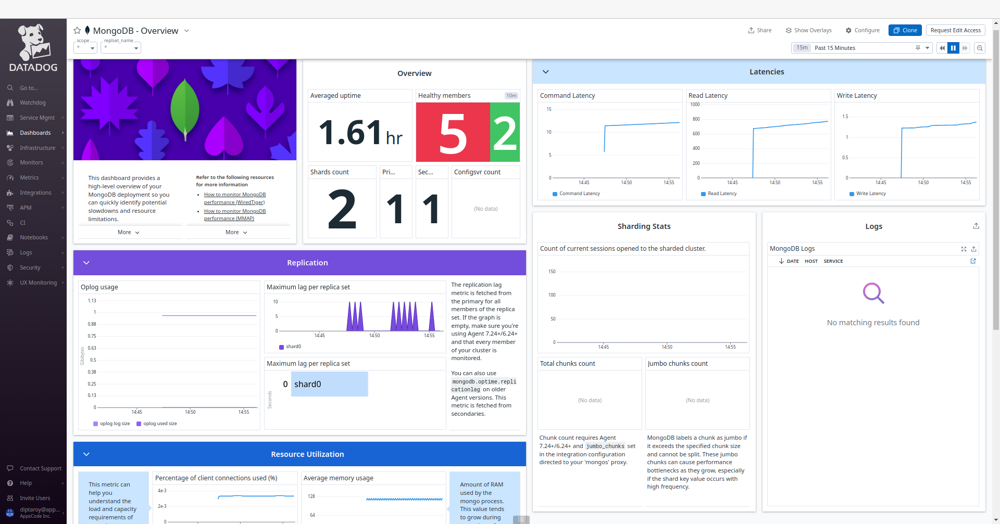
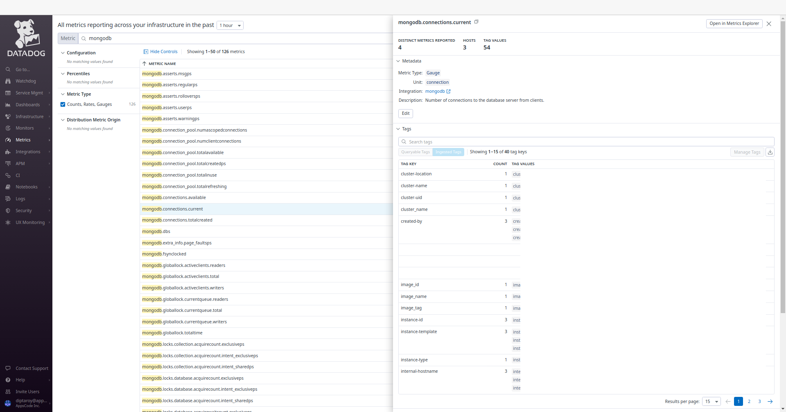
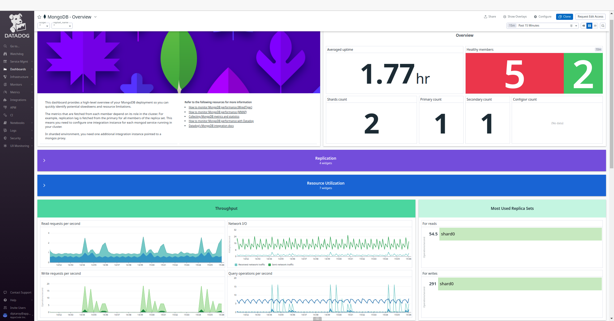

## Introduction

KubeDB is the Kubernetes Native Database Management Solution which simplifies and automates routine database tasks such as Provisioning, Monitoring, Upgrading, Patching, Scaling, Volume Expansion, Backup, Recovery, Failure detection, and Repair for various popular databases on private and public clouds. The databases that KubeDB supports are Redis, PostgreSQL, Kafka, MySQL, MongoDB, MariaDB, Elasticsearch, ProxySQL, Percona XtraDB, Memcached and PgBouncer. You can find the guides to all the supported databases in [KubeDB](https://kubedb.com/).
In this tutorial we will Monitor MongoDB With Datadog in Azure Kubernetes Service (AKS). We will cover the following steps:

1) Install KubeDB
2) Install Datadog
3) Deploy MongoDB Sharded Cluster
4) Read/Write Sample Data
5) Monitor MongoDB with Datadog


### Get Cluster ID

We need the cluster ID to get the KubeDB License. To get cluster ID we can run the following command:

```bash
$ kubectl get ns kube-system -o jsonpath='{.metadata.uid}'
8e336615-0dbb-4ae8-b72f-2e7ec34c399d
```

### Get License

Go to [Appscode License Server](https://license-issuer.appscode.com/) to get the license.txt file. For this tutorial, we will use KubeDB.


## Install KubeDB

We will use helm to install KubeDB. Please install [Helm](https://helm.sh/docs/intro/install/) if it is not already installed.
Now, let's install `KubeDB`.

```bash
$ helm search repo appscode/kubedb
NAME                              	CHART VERSION	APP VERSION	DESCRIPTION                                       
appscode/kubedb                   	v2024.3.16   	v2024.3.16 	KubeDB by AppsCode - Production ready databases...
appscode/kubedb-autoscaler        	v0.29.0      	v0.29.0    	KubeDB Autoscaler by AppsCode - Autoscale KubeD...
appscode/kubedb-catalog           	v2024.3.16   	v2024.3.16 	KubeDB Catalog by AppsCode - Catalog for databa...
appscode/kubedb-community         	v0.24.2      	v0.24.2    	KubeDB Community by AppsCode - Community featur...
appscode/kubedb-crd-manager       	v0.0.8       	v0.0.8     	KubeDB CRD Manager by AppsCode                    
appscode/kubedb-crds              	v2024.3.16   	v2024.3.16 	KubeDB Custom Resource Definitions                
appscode/kubedb-dashboard         	v0.20.0      	v0.20.0    	KubeDB Dashboard by AppsCode                      
appscode/kubedb-enterprise        	v0.11.2      	v0.11.2    	KubeDB Enterprise by AppsCode - Enterprise feat...
appscode/kubedb-grafana-dashboards	v2024.3.16   	v2024.3.16 	A Helm chart for kubedb-grafana-dashboards by A...
appscode/kubedb-kubestash-catalog 	v2024.3.16   	v2024.3.16 	KubeStash Catalog by AppsCode - Catalog of Kube...
appscode/kubedb-metrics           	v2024.3.16   	v2024.3.16 	KubeDB State Metrics                              
appscode/kubedb-one               	v2023.12.28  	v2023.12.28	KubeDB and Stash by AppsCode - Production ready...
appscode/kubedb-ops-manager       	v0.31.0      	v0.31.0    	KubeDB Ops Manager by AppsCode - Enterprise fea...
appscode/kubedb-opscenter         	v2024.3.16   	v2024.3.16 	KubeDB Opscenter by AppsCode                      
appscode/kubedb-provider-aws      	v2024.3.16   	v0.6.0     	A Helm chart for KubeDB AWS Provider for Crossp...
appscode/kubedb-provider-azure    	v2024.3.16   	v0.6.0     	A Helm chart for KubeDB Azure Provider for Cros...
appscode/kubedb-provider-gcp      	v2024.3.16   	v0.6.0     	A Helm chart for KubeDB GCP Provider for Crossp...
appscode/kubedb-provisioner       	v0.44.0      	v0.44.0    	KubeDB Provisioner by AppsCode - Community feat...
appscode/kubedb-schema-manager    	v0.20.0      	v0.20.0    	KubeDB Schema Manager by AppsCode                 
appscode/kubedb-ui                	v2024.2.13   	0.6.4      	A Helm chart for Kubernetes                       
appscode/kubedb-ui-server         	v2021.12.21  	v2021.12.21	A Helm chart for kubedb-ui-server by AppsCode     
appscode/kubedb-webhook-server    	v0.20.0      	v0.20.0    	KubeDB Webhook Server by AppsCode  


$ helm install kubedb oci://ghcr.io/appscode-charts/kubedb \
  --version v2024.3.16 \
  --namespace kubedb --create-namespace \
  --set-file global.license=/path/to/the/license.txt \
  --wait --burst-limit=10000 --debug
```

Let's verify the installation:

```bash
$ watch kubectl get pods --all-namespaces -l "app.kubernetes.io/instance=kubedb"
NAMESPACE   NAME                                            READY   STATUS    RESTARTS   AGE
kubedb      kubedb-kubedb-autoscaler-575f984478-wx4d7       1/1     Running   0          2m24s
kubedb      kubedb-kubedb-ops-manager-6fc8fd6b6c-hhw2q      1/1     Running   0          2m24s
kubedb      kubedb-kubedb-provisioner-7cdfdfb55f-6dx22      1/1     Running   0          2m24s
kubedb      kubedb-kubedb-webhook-server-59965c78c4-brhqh   1/1     Running   0          2m24s
kubedb      kubedb-petset-operator-5d94b4ddb8-ts67d         1/1     Running   0          2m24s
kubedb      kubedb-petset-webhook-server-d49599c45-zhvvc    2/2     Running   0          2m24s
kubedb      kubedb-sidekick-5dc87959b7-j44lm                1/1     Running   0          2m24s
```

We can list the CRD Groups that have been registered by the operator by running the following command:

```bash
$ kubectl get crd -l app.kubernetes.io/name=kubedb
NAME                                               CREATED AT
connectclusters.kafka.kubedb.com                   2024-04-05T06:36:43Z
connectors.kafka.kubedb.com                        2024-04-05T06:36:43Z
druidversions.catalog.kubedb.com                   2024-04-05T06:36:09Z
elasticsearchautoscalers.autoscaling.kubedb.com    2024-04-05T06:36:40Z
elasticsearchdashboards.elasticsearch.kubedb.com   2024-04-05T06:36:40Z
elasticsearches.kubedb.com                         2024-04-05T06:36:40Z
elasticsearchopsrequests.ops.kubedb.com            2024-04-05T06:36:40Z
elasticsearchversions.catalog.kubedb.com           2024-04-05T06:36:09Z
etcdversions.catalog.kubedb.com                    2024-04-05T06:36:09Z
ferretdbversions.catalog.kubedb.com                2024-04-05T06:36:09Z
kafkaautoscalers.autoscaling.kubedb.com            2024-04-05T06:36:43Z
kafkaconnectorversions.catalog.kubedb.com          2024-04-05T06:36:09Z
kafkaopsrequests.ops.kubedb.com                    2024-04-05T06:36:43Z
kafkas.kubedb.com                                  2024-04-05T06:36:43Z
kafkaversions.catalog.kubedb.com                   2024-04-05T06:36:09Z
mariadbarchivers.archiver.kubedb.com               2024-04-05T06:36:47Z
mariadbautoscalers.autoscaling.kubedb.com          2024-04-05T06:36:47Z
mariadbdatabases.schema.kubedb.com                 2024-04-05T06:36:47Z
mariadbopsrequests.ops.kubedb.com                  2024-04-05T06:36:47Z
mariadbs.kubedb.com                                2024-04-05T06:36:47Z
mariadbversions.catalog.kubedb.com                 2024-04-05T06:36:09Z
memcachedversions.catalog.kubedb.com               2024-04-05T06:36:09Z
mongodbarchivers.archiver.kubedb.com               2024-04-05T06:36:50Z
mongodbautoscalers.autoscaling.kubedb.com          2024-04-05T06:36:50Z
mongodbdatabases.schema.kubedb.com                 2024-04-05T06:36:50Z
mongodbopsrequests.ops.kubedb.com                  2024-04-05T06:36:50Z
mongodbs.kubedb.com                                2024-04-05T06:36:50Z
mongodbversions.catalog.kubedb.com                 2024-04-05T06:36:09Z
mysqlarchivers.archiver.kubedb.com                 2024-04-05T06:36:54Z
mysqlautoscalers.autoscaling.kubedb.com            2024-04-05T06:36:54Z
mysqldatabases.schema.kubedb.com                   2024-04-05T06:36:54Z
mysqlopsrequests.ops.kubedb.com                    2024-04-05T06:36:54Z
mysqls.kubedb.com                                  2024-04-05T06:36:54Z
mysqlversions.catalog.kubedb.com                   2024-04-05T06:36:09Z
perconaxtradbversions.catalog.kubedb.com           2024-04-05T06:36:09Z
pgbouncerversions.catalog.kubedb.com               2024-04-05T06:36:09Z
pgpoolversions.catalog.kubedb.com                  2024-04-05T06:36:09Z
postgresarchivers.archiver.kubedb.com              2024-04-05T06:36:57Z
postgresautoscalers.autoscaling.kubedb.com         2024-04-05T06:36:57Z
postgresdatabases.schema.kubedb.com                2024-04-05T06:36:57Z
postgreses.kubedb.com                              2024-04-05T06:36:57Z
postgresopsrequests.ops.kubedb.com                 2024-04-05T06:36:57Z
postgresversions.catalog.kubedb.com                2024-04-05T06:36:09Z
proxysqlversions.catalog.kubedb.com                2024-04-05T06:36:09Z
publishers.postgres.kubedb.com                     2024-04-05T06:36:57Z
rabbitmqversions.catalog.kubedb.com                2024-04-05T06:36:09Z
redisautoscalers.autoscaling.kubedb.com            2024-04-05T06:37:01Z
redises.kubedb.com                                 2024-04-05T06:37:01Z
redisopsrequests.ops.kubedb.com                    2024-04-05T06:37:01Z
redissentinelautoscalers.autoscaling.kubedb.com    2024-04-05T06:37:01Z
redissentinelopsrequests.ops.kubedb.com            2024-04-05T06:37:01Z
redissentinels.kubedb.com                          2024-04-05T06:37:01Z
redisversions.catalog.kubedb.com                   2024-04-05T06:36:09Z
singlestoreversions.catalog.kubedb.com             2024-04-05T06:36:09Z
solrversions.catalog.kubedb.com                    2024-04-05T06:36:09Z
subscribers.postgres.kubedb.com                    2024-04-05T06:36:57Z
zookeeperversions.catalog.kubedb.com               2024-04-05T06:36:09Z
```

## Install Datadog

To install Datadog, we recommend using `Helm`. Below are the steps for the installation. For more installation options and details, visit [Datadog's official documentation](https://docs.datadoghq.com/containers/kubernetes/installation/?tab=operator).

```bash
$ helm repo add datadog https://helm.datadoghq.com
$ helm repo update
$ helm install datadog --set datadog.site='datadoghq.com' --set datadog.apiKey=<YOUR DATADOG API KEY> --set datadog.apm.enabled=true datadog/datadog
```

Let's verify the installation:

```bash
$ kubectl get pods --all-namespaces -l "app.kubernetes.io/instance=datadog"

NAMESPACE   NAME                                     READY   STATUS    RESTARTS   AGE
default     datadog-59gdg                            3/3     Running   0          2m25s
default     datadog-5kt8k                            3/3     Running   0          2m25s
default     datadog-7j29x                            3/3     Running   0          2m27s
default     datadog-cluster-agent-6fc8b55877-h8sqg   1/1     Running   0          2m26s
default     datadog-jb58m                            3/3     Running   0          2m26s
default     datadog-m4hks                            3/3     Running   0          2m26s
default     datadog-vz4bz                            3/3     Running   0          2m25s
```

### Datadog Events

To view events from your Kubernetes cluster, go to [Datadog's Event Explorer](https://app.datadoghq.com/event/explorer). You'll find valuable insights and information about your Kubernetes environment.



### Install MongoDB Dashboard

To access the MongoDB dashboard, go to `Integrations` and then install the MongoDB integration from there. This will allow you to monitor your MongoDB databases through Datadog's dashboard.



### Deploy MongoDB Sharded Cluster

Now we are going to deploy MongoDB sharded cluster using KubeDB. You'll need to deploy your MongoDB cluster with the same namespace `default` where Datadog is installed.

Here is the yaml of the MongoDB we are going to use:

```yaml
apiVersion: kubedb.com/v1alpha2
kind: MongoDB
metadata:
  name: mongodb-cluster-dd
  namespace: default
spec:
  version: "4.4.6"
  shardTopology:
    configServer:
      replicas: 3
      podTemplate:
        metadata:
          annotations:
            ad.datadoghq.com/mongodb.checks: |
              {
                "mongo": {
                  "init_config": {},
                  "instances": [
                    {
                      "hosts": ["%%host%%:%%port%%"], 
                      "username": "datadog", 
                      "password": "admin123", 
                      "database": "admin"
                    }
                  ]
                }
              }
      storage:
        resources:
          requests:
            storage: 512Mi
        storageClassName: "default"
    mongos:
      replicas: 2
      podTemplate:
        metadata:
          annotations:
            ad.datadoghq.com/mongodb.checks: |
              {
                "mongo": {
                  "init_config": {},
                  "instances": [
                    {
                      "hosts": ["%%host%%:%%port%%"], 
                      "username": "datadog", 
                      "password": "admin123", 
                      "database": "admin"
                    }
                  ]
                }
              }
    shard:
      replicas: 2
      podTemplate:
        metadata:
          annotations:
            ad.datadoghq.com/mongodb.checks: |
              {
                "mongo": {
                  "init_config": {},
                  "instances": [
                    {
                      "hosts": ["%%host%%:%%port%%"], 
                      "username": "datadog", 
                      "password": "admin123", 
                      "database": "admin"
                    }
                  ]
                }
              }
      shards: 1
      storage:
        resources:
          requests:
            storage: 512Mi
        storageClassName: "default"
  terminationPolicy: WipeOut
```


Let's save this yaml configuration into `mongodb-cluster-dd.yaml` 
Then create the above MongoDB CRD

```bash
$ kubectl apply -f mongodb-cluster-dd.yaml
mongodb.kubedb.com/mongodb-cluster-dd created
```

In this yaml,
* `spec.version` field specifies the version of MongoDB. Here, we are using MongoDB `version 4.4.6`. You can list the KubeDB supported versions of MongoDB by running `$ kubectl get mongodbversions` command.
* `spec.shardTopology` represents the topology configuration for sharding.
* `spec.shardTopology.configServer` defines configuration for ConfigServer component of MongoDB.
* `spec.shardTopology.configServer.replicas` represents number of replicas for configServer replicaset.
* `spec.shardTopology.mongos` defines configuration for Mongos component of MongoDB.
* `spec.shardTopology.mongos.replicas` specifies number of replicas of Mongos instance. Here, Mongos is not deployed as replicaset.
* `spec.shardTopology.<shard/mongos/configServer>.storage.storageClassName` is the name of the StorageClass used to provision PVCs.
* `spec.terminationPolicy` field is *Wipeout* means that the database will be deleted without restrictions. It can also be “Halt”, “Delete” and “DoNotTerminate”. Learn More about these checkout [Termination Policy](https://kubedb.com/docs/latest/guides/mongodb/concepts/mongodb/#specterminationpolicy).
* `podTemplate.metadata.annotations` field specifes [Autodiscovery Integrations Templates](https://docs.datadoghq.com/containers/kubernetes/integrations/?tab=kubernetesadv2) as pod annotations on your application container. Learn more about [Autodiscovery Template Variables](https://docs.datadoghq.com/containers/guide/template_variables/).

> Note: To align with the configurations specified in our annotations, it is essential to create a MongoDB user with the username `datadog` and the password `admin123` in the database `admin`. You can change these fields to your preference.

Once everything handled correctly and the MongoDB object is deployed, you will see that the following are created:

```bash
$ kubectl get all -n default -l=app.kubernetes.io/instance=mongodb-cluster-dd

NAME                                 READY   STATUS    RESTARTS   AGE
pod/mongodb-cluster-dd-configsvr-0   1/1     Running   0          5m37s
pod/mongodb-cluster-dd-configsvr-1   1/1     Running   0          4m39s
pod/mongodb-cluster-dd-configsvr-2   1/1     Running   0          4m13s
pod/mongodb-cluster-dd-mongos-0      1/1     Running   0          3m31s
pod/mongodb-cluster-dd-mongos-1      1/1     Running   0          3m23s
pod/mongodb-cluster-dd-shard0-0      1/1     Running   0          5m31s
pod/mongodb-cluster-dd-shard0-1      1/1     Running   0          4m37s

NAME                                        TYPE        CLUSTER-IP     EXTERNAL-IP   PORT(S)     AGE
service/mongodb-cluster-dd                  ClusterIP   10.96.122.63   <none>        27017/TCP   5m43s
service/mongodb-cluster-dd-configsvr-pods   ClusterIP   None           <none>        27017/TCP   5m43s
service/mongodb-cluster-dd-mongos-pods      ClusterIP   None           <none>        27017/TCP   5m43s
service/mongodb-cluster-dd-shard0-pods      ClusterIP   None           <none>        27017/TCP   5m43s

NAME                                            READY   AGE
statefulset.apps/mongodb-cluster-dd-configsvr   3/3     5m37s
statefulset.apps/mongodb-cluster-dd-mongos      2/2     3m31s
statefulset.apps/mongodb-cluster-dd-shard0      2/2     5m31s

NAME                                                    TYPE                 VERSION   AGE
appbinding.appcatalog.appscode.com/mongodb-cluster-dd   kubedb.com/mongodb   4.4.6     3m13s
```
Let’s check if the database is ready to use,

```bash
$ kubectl get mongodb -n default mongodb-cluster-dd
NAME                 VERSION   STATUS   AGE
mongodb-cluster-dd   4.4.6     Ready    6m7s
```
> We have successfully deployed MongoDB in AKS with Datadog. Now we can exec into the container to use the database.

### Accessing Database Through CLI

To access the database through CLI, we have to get the credentials to access. KubeDB will create Secret and Service for the database `mongodb-cluster-dd` that we have deployed. Let’s check them using the following commands,

```bash
$ kubectl get secret -n default -l=app.kubernetes.io/instance=mongodb-cluster-dd
NAME                      TYPE                       DATA   AGE
mongodb-cluster-dd-auth   kubernetes.io/basic-auth   2      6m40s
mongodb-cluster-dd-key    Opaque                     1      6m40s

$ kubectl get service -n default -l=app.kubernetes.io/instance=mongodb-cluster-dd
NAME                                TYPE        CLUSTER-IP     EXTERNAL-IP   PORT(S)     AGE
mongodb-cluster-dd                  ClusterIP   10.96.122.63   <none>        27017/TCP   6m57s
mongodb-cluster-dd-configsvr-pods   ClusterIP   None           <none>        27017/TCP   6m57s
mongodb-cluster-dd-mongos-pods      ClusterIP   None           <none>        27017/TCP   6m57s
mongodb-cluster-dd-shard0-pods      ClusterIP   None           <none>        27017/TCP   6m57s
```
Now, we are going to use `mongodb-cluster-dd-auth` to get the credentials.

```bash
$ kubectl get secrets -n default mongodb-cluster-dd-auth -o jsonpath='{.data.username}' | base64 -d
root

$ kubectl get secrets -n default mongodb-cluster-dd-auth -o jsonpath='{.data.password}' | base64 -d
cDHBeFGPA!6X_qHX
```

### Grant Permission to Datadog Agent

In this section, we'll create a MongoDB user with the username `datadog` and the password `admin123` as defined in `mongodb-cluster-dd.yaml`. Additionally, we'll provide the user to have the necessary permissions to scrape metrics.

```bash
$ kubectl exec -it -n default mongodb-cluster-dd-shard0-0 -- mongo admin -u $USER -p $PASSWORD
Defaulted container "mongodb" out of: mongodb, copy-config (init)

shard0:PRIMARY> show dbs
admin          0.000GB
config         0.000GB
kubedb-system  0.000GB
local          0.001GB

shard0:PRIMARY> use admin
switched to db admin

shard0:PRIMARY> db.createUser({
...   "user": "datadog",
...   "pwd": "admin123",
...   "roles": [
...     { role: "read", db: "admin" },
...     { role: "clusterMonitor", db: "admin" },
...     { role: "read", db: "local" }
...   ]
... })
Successfully added user: {
	"user" : "datadog",
	"roles" : [
		{
			"role" : "read",
			"db" : "admin"
		},
		{
			"role" : "clusterMonitor",
			"db" : "admin"
		},
		{
			"role" : "read",
			"db" : "local"
		}
	]
}

shard0:PRIMARY> exit
bye
```

### Accessing MongoDB Dashboard

To access the monitoring dashboards in the Datadog UI, navigate to the `Dashboards` section in your Datadog account's main menu. From the dropdown menu, select `Dashboards List`, and you'll find `MongoDB - Overview`. This dashboard provide insights into various aspects of your MongoDB database, offering both a high-level summary and more detailed performance metrics for effective monitoring and management. Also, to access MongoDB metrics, navigate to the `Metrics` section and select `Summary` in the Datadog UI.








#### Insert Sample Data

Let's insert some sample data into our MongoDB database.

```bash
$ kubectl exec -it -n default mongodb-cluster-dd-shard0-0 -- mongo admin -u $USER -p $PASSWORD
Defaulted container "mongodb" out of: mongodb, copy-config (init)

shard0:PRIMARY> use admin
switched to db admin

shard0:PRIMARY> db.product.insert({"name":"KubeDB"});
WriteResult({ "nInserted" : 1 })

shard0:PRIMARY> db.product.find().pretty()
{ "_id" : ObjectId("65324225de67c08183bdf7f0"), "name" : "KubeDB" }

shard0:PRIMARY> exit
bye
```

> We’ve successfully inserted some sample data to our database. More information about Run & Manage MongoDB on Kubernetes can be found in [MongoDB Kubernetes](https://kubedb.com/kubernetes/databases/run-and-manage-mongodb-on-kubernetes/)


Following the insertion of sample data into our MongoDB database, we can monitor any resultant changes in the Datadog UI. Go to the `MongoDB - Overview` dashboard to observe any updates in performance metrics and insights for our MongoDB database.



## Conclusion

In this article, we've explored the process of monitoring MongoDB with Datadog in the Azure Kubernetes Service (AKS) using KubeDB. Our aim was to provide insights into efficiently managing and analyzing MongoDB performance within a Kubernetes environment. We've explored into the MongoDB configuration, data insertion, and monitoring aspects. This is just the beginning of our journey in exploring the dynamic relationship between MongoDB, Datadog, and Kubernetes. We have more articles and resources in the pipeline, all geared toward enhancing your understanding of these technologies and their effective integration. To stay updated and informed, be sure to follow our website for upcoming articles and insights.

If you want to learn more about Production-Grade MongoDB on Kubernetes you can have a look into that playlist below:

<iframe width="560" height="315" src="https://www.youtube.com/embed/videoseries?si=4QprFMDXciXib4SK&amp;list=PLoiT1Gv2KR1jZmdzRaQW28eX4zR9lvUqf" title="YouTube video player" frameborder="0" allow="accelerometer; autoplay; clipboard-write; encrypted-media; gyroscope; picture-in-picture; web-share" allowfullscreen></iframe>


## Support

To speak with us, please leave a message on [our website](https://appscode.com/contact/).

To receive product announcements, follow us on [X](https://twitter.com/KubeDB).

To watch tutorials of various Production-Grade Kubernetes Tools Subscribe our [YouTube](https://youtube.com/@appscode) channel.

More about [MongoDB on Kubernetes](https://kubedb.com/kubernetes/databases/run-and-manage-mongodb-on-kubernetes/)

If you have found a bug with KubeDB or want to request for new features, please [file an issue](https://github.com/kubedb/project/issues/new).
