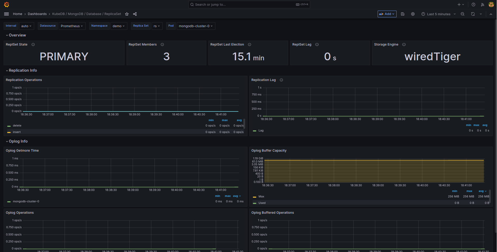

## Overview

KubeDB is the Kubernetes Native Database Management Solution which simplifies and automates routine database tasks such as Provisioning, Monitoring, Upgrading, Patching, Scaling, Volume Expansion, Backup, Recovery, Failure detection, and Repair for various popular databases on private and public clouds. The databases that KubeDB supports are MySQL, Kafka, MongoDB, MariaDB, Elasticsearch, Redis, PostgreSQL, ProxySQL, Percona XtraDB, Memcached and PgBouncer. You can find the guides to all the supported databases in [KubeDB](https://kubedb.com/). And Panopticon is a generic state metrics exporter for Kubernetes resources. It can generate Prometheus metrics from both Kubernetes native and custom resources. Generated metrics are exposed in `/metrics` path for the Prometheus server to scrape.
In this tutorial we will Monitor MongoDB with Grafana Dashboard in Azure Kubernetes Service (AKS). We will cover the following steps:

1) Install KubeDB
2) Install Prometheus Stack
3) Install Panopticon
4) Deploy MongoDB Clustered Database
5) Monitor with Grafana Dashboard

### Get Cluster ID

We need the cluster ID to get the KubeDB License.
To get cluster ID we can run the following command:

```bash
$ kubectl get ns kube-system -o jsonpath='{.metadata.uid}'
8c4498337-358b-4dc0-be52-14440f4e061e
```

### Get License

Go to [Appscode License Server](https://license-issuer.appscode.com/) to get the license.txt file. For this tutorial we will use KubeDB Enterprise Edition.


### Install KubeDB

We will use helm to install KubeDB. Please install helm [here](https://helm.sh/docs/intro/install/) if it is not already installed.
Now, let's install `KubeDB`.

```bash
$ helm repo add appscode https://charts.appscode.com/stable/
$ helm repo update

$ helm search repo appscode/kubedb
NAME                              	CHART VERSION	APP VERSION	DESCRIPTION                                       
appscode/kubedb                   	v2023.06.19  	v2023.06.19	KubeDB by AppsCode - Production ready databases...
appscode/kubedb-autoscaler        	v0.19.0      	v0.19.0    	KubeDB Autoscaler by AppsCode - Autoscale KubeD...
appscode/kubedb-catalog           	v2023.06.19  	v2023.06.19	KubeDB Catalog by AppsCode - Catalog for databa...
appscode/kubedb-community         	v0.24.2      	v0.24.2    	KubeDB Community by AppsCode - Community featur...
appscode/kubedb-crds              	v2023.06.19  	v2023.06.19	KubeDB Custom Resource Definitions                
appscode/kubedb-dashboard         	v0.10.0      	v0.10.0    	KubeDB Dashboard by AppsCode                      
appscode/kubedb-enterprise        	v0.11.2      	v0.11.2    	KubeDB Enterprise by AppsCode - Enterprise feat...
appscode/kubedb-grafana-dashboards	v2023.06.19  	v2023.06.19	A Helm chart for kubedb-grafana-dashboards by A...
appscode/kubedb-metrics           	v2023.06.19  	v2023.06.19	KubeDB State Metrics                              
appscode/kubedb-one               	v2023.06.19  	v2023.06.19	KubeDB and Stash by AppsCode - Production ready...
appscode/kubedb-ops-manager       	v0.21.0      	v0.21.0    	KubeDB Ops Manager by AppsCode - Enterprise fea...
appscode/kubedb-opscenter         	v2023.06.19  	v2023.06.19	KubeDB Opscenter by AppsCode                      
appscode/kubedb-provisioner       	v0.34.0      	v0.34.0    	KubeDB Provisioner by AppsCode - Community feat...
appscode/kubedb-schema-manager    	v0.10.0      	v0.10.0    	KubeDB Schema Manager by AppsCode                 
appscode/kubedb-ui                	v2023.03.23  	0.3.28     	A Helm chart for Kubernetes                       
appscode/kubedb-ui-server         	v2021.12.21  	v2021.12.21	A Helm chart for kubedb-ui-server by AppsCode     
appscode/kubedb-webhook-server    	v0.10.0      	v0.10.0    	KubeDB Webhook Server by AppsCode    

# Install KubeDB Enterprise operator chart
$ helm install kubedb appscode/kubedb \
  --version v2023.06.19 \
  --namespace kubedb --create-namespace \
  --set kubedb-provisioner.enabled=true \
  --set kubedb-ops-manager.enabled=true \
  --set kubedb-autoscaler.enabled=true \
  --set kubedb-dashboard.enabled=true \
  --set kubedb-schema-manager.enabled=true \
  --set-file global.license=/path/to/the/license.txt
```

Let's verify the installation:

```bash
$ watch kubectl get pods --all-namespaces -l "app.kubernetes.io/instance=kubedb"

NAMESPACE   NAME                                            READY   STATUS    RESTARTS   AGE
kubedb      kubedb-kubedb-autoscaler-79b488f4d9-7t524       1/1     Running   0          101s
kubedb      kubedb-kubedb-dashboard-77d6d5c598-9zs6j        1/1     Running   0          101s
kubedb      kubedb-kubedb-ops-manager-65f8d87769-dhmds      1/1     Running   0          100s
kubedb      kubedb-kubedb-provisioner-7ffb8767c8-s6txh      1/1     Running   0          101s
kubedb      kubedb-kubedb-schema-manager-848fcb975b-8jn6j   1/1     Running   0          101s
kubedb      kubedb-kubedb-webhook-server-678d69f669-swnbf   1/1     Running   0          101s
```

We can list the CRD Groups that have been registered by the operator by running the following command:

```bash
$ kubectl get crd -l app.kubernetes.io/name=kubedb
NAME                                              CREATED AT
elasticsearchautoscalers.autoscaling.kubedb.com   2023-07-10T08:41:07Z
elasticsearchdashboards.dashboard.kubedb.com      2023-07-10T08:41:05Z
elasticsearches.kubedb.com                        2023-07-10T08:41:05Z
elasticsearchopsrequests.ops.kubedb.com           2023-07-10T08:41:32Z
elasticsearchversions.catalog.kubedb.com          2023-07-10T08:38:37Z
etcds.kubedb.com                                  2023-07-10T08:41:27Z
etcdversions.catalog.kubedb.com                   2023-07-10T08:38:37Z
kafkas.kubedb.com                                 2023-07-10T08:42:02Z
kafkaversions.catalog.kubedb.com                  2023-07-10T08:38:38Z
mariadbautoscalers.autoscaling.kubedb.com         2023-07-10T08:41:07Z
mariadbdatabases.schema.kubedb.com                2023-07-10T08:41:29Z
mariadbopsrequests.ops.kubedb.com                 2023-07-10T08:42:50Z
mariadbs.kubedb.com                               2023-07-10T08:41:28Z
mariadbversions.catalog.kubedb.com                2023-07-10T08:38:38Z
memcacheds.kubedb.com                             2023-07-10T08:41:28Z
memcachedversions.catalog.kubedb.com              2023-07-10T08:38:38Z
mongodbautoscalers.autoscaling.kubedb.com         2023-07-10T08:41:08Z
mongodbdatabases.schema.kubedb.com                2023-07-10T08:41:22Z
mongodbopsrequests.ops.kubedb.com                 2023-07-10T08:41:37Z
mongodbs.kubedb.com                               2023-07-10T08:41:23Z
mongodbversions.catalog.kubedb.com                2023-07-10T08:38:39Z
mysqlautoscalers.autoscaling.kubedb.com           2023-07-10T08:41:08Z
mysqldatabases.schema.kubedb.com                  2023-07-10T08:41:19Z
mysqlopsrequests.ops.kubedb.com                   2023-07-10T08:42:46Z
mysqls.kubedb.com                                 2023-07-10T08:41:19Z
mysqlversions.catalog.kubedb.com                  2023-07-10T08:38:39Z
perconaxtradbautoscalers.autoscaling.kubedb.com   2023-07-10T08:41:08Z
perconaxtradbopsrequests.ops.kubedb.com           2023-07-10T08:44:09Z
perconaxtradbs.kubedb.com                         2023-07-10T08:41:51Z
perconaxtradbversions.catalog.kubedb.com          2023-07-10T08:38:39Z
pgbouncers.kubedb.com                             2023-07-10T08:41:53Z
pgbouncerversions.catalog.kubedb.com              2023-07-10T08:38:40Z
postgresautoscalers.autoscaling.kubedb.com        2023-07-10T08:41:08Z
postgresdatabases.schema.kubedb.com               2023-07-10T08:41:27Z
postgreses.kubedb.com                             2023-07-10T08:41:28Z
postgresopsrequests.ops.kubedb.com                2023-07-10T08:43:59Z
postgresversions.catalog.kubedb.com               2023-07-10T08:38:40Z
proxysqlautoscalers.autoscaling.kubedb.com        2023-07-10T08:41:08Z
proxysqlopsrequests.ops.kubedb.com                2023-07-10T08:44:04Z
proxysqls.kubedb.com                              2023-07-10T08:41:59Z
proxysqlversions.catalog.kubedb.com               2023-07-10T08:38:40Z
publishers.postgres.kubedb.com                    2023-07-10T08:45:38Z
redisautoscalers.autoscaling.kubedb.com           2023-07-10T08:41:08Z
redises.kubedb.com                                2023-07-10T08:42:01Z
redisopsrequests.ops.kubedb.com                   2023-07-10T08:43:47Z
redissentinelautoscalers.autoscaling.kubedb.com   2023-07-10T08:41:08Z
redissentinelopsrequests.ops.kubedb.com           2023-07-10T08:45:28Z
redissentinels.kubedb.com                         2023-07-10T08:42:02Z
redisversions.catalog.kubedb.com                  2023-07-10T08:38:41Z
subscribers.postgres.kubedb.com                   2023-07-10T08:45:46Z
```

### Install Prometheus Stack
Install Prometheus stack which installs the necessary components required for the MongoDB Grafana dashboards. You can use following commands,

```bash
$ helm repo add prometheus-community https://prometheus-community.github.io/helm-charts
$ helm install prometheus prometheus-community/kube-prometheus-stack
```
or visit [kube-prometheus-stack](https://artifacthub.io/packages/helm/prometheus-community/kube-prometheus-stack) for more detailed information.

### Install Panopticon
KubeDB Enterprise License works for Panopticon too. So, we will use the same license that we have already obtained.

```bash
$ helm install panopticon appscode/panopticon -n kubeops \
    --create-namespace \
    --set monitoring.enabled=true \
    --set monitoring.agent=prometheus.io/operator \
    --set monitoring.serviceMonitor.labels.release=prometheus \
    --set-file license=/path/to/license.txt
```
Let's verify the installation:

```bash
$ watch kubectl get pods --all-namespaces -l "app.kubernetes.io/instance=panopticon"
NAMESPACE   NAME                          READY   STATUS    RESTARTS   AGE
kubeops     panopticon-67b6fbc4f9-vwv4s   1/1     Running   0          2m1s
```


## Deploy MongoDB Clustered Database

Now, we are going to Deploy MongoDB with monitoring enabled using KubeDB.
First, let's create a Namespace in which we will deploy the database.

```bash
$ kubectl create namespace demo
namespace/demo created
```
Here is the yaml of the MongoDB CRO we are going to use:

```yaml
apiVersion: kubedb.com/v1alpha2
kind: MongoDB
metadata:
  name: mongodb-cluster
  namespace: demo
spec:
  version: "6.0.5"
  replicas: 3
  replicaSet:
    name: rs
  storage:
    storageClassName: "standard"
    accessModes:
    - ReadWriteOnce
    resources:
      requests:
        storage: 1Gi
  monitor:
    agent: prometheus.io/operator
    prometheus:
      serviceMonitor:
        labels:
          release: prometheus
        interval: 10s
  terminationPolicy: WipeOut
```

Let's save this yaml configuration into `mongodb-cluster.yaml` 
Then create the above MongoDB CRO

```bash
$ kubectl apply -f mongodb-cluster.yaml 
mongodb.kubedb.com/mongodb-cluster created
```

In this yaml,
* `spec.version` field specifies the version of MongoDB. Here, we are using MongoDB `version 6.0.5`. You can list the KubeDB supported versions of MongoDB by running `$ kubectl get mongodbversions` command.
* `spec.storage` specifies PVC spec that will be dynamically allocated to store data for this database. This storage spec will be passed to the StatefulSet created by KubeDB operator to run database pods. You can specify any StorageClass available in your cluster with appropriate resource requests.
* `spec.monitor.agent: prometheus.io/operator` indicates that we are going to monitor this server using Prometheus operator.
* `spec.monitor.prometheus.serviceMonitor.labels` specifies the release name that KubeDB should use in `ServiceMonitor`.
* `spec.monitor.prometheus.interval` defines that the Prometheus server should scrape metrics from this database with 10 seconds interval.
* And the `spec.terminationPolicy` field is *Wipeout* means that the database will be deleted without restrictions. It can also be "Halt", "Delete" and "DoNotTerminate". Learn More about these checkout [Termination Policy](https://kubedb.com/docs/latest/guides/mongodb/concepts/mongodb/#specterminationpolicy).

Once these are handled correctly and the MongoDB object is deployed, you will see that the following objects are created:

```bash
$ kubectl get all -n demo -l 'app.kubernetes.io/instance=mongodb-cluster'
NAME                    READY   STATUS    RESTARTS   AGE
pod/mongodb-cluster-0   3/3     Running   0          4m31s
pod/mongodb-cluster-1   3/3     Running   0          3m25s
pod/mongodb-cluster-2   3/3     Running   0          2m21s

NAME                            TYPE        CLUSTER-IP   EXTERNAL-IP   PORT(S)     AGE
service/mongodb-cluster         ClusterIP   10.8.14.67   <none>        27017/TCP   4m33s
service/mongodb-cluster-pods    ClusterIP   None         <none>        27017/TCP   4m33s
service/mongodb-cluster-stats   ClusterIP   10.8.10.86   <none>        56790/TCP   4m30s

NAME                               READY   AGE
statefulset.apps/mongodb-cluster   3/3     4m32s

NAME                                                 TYPE                 VERSION   AGE
appbinding.appcatalog.appscode.com/mongodb-cluster   kubedb.com/mongodb   6.0.5     4m32s
```
Let’s check if the database is ready to use,

```bash
$ kubectl get mongodb -n demo mongodb-cluster
NAME              VERSION   STATUS   AGE
mongodb-cluster   6.0.5     Ready    5m9s
```
> We have successfully deployed MongoDB in AKS.


### Create DB Metrics Configurations

First, you have to create a `MetricsConfiguration` object for database. This `MetricsConfiguration` object is used by Panopticon to generate metrics for DB instances.
Install `kubedb-metrics` charts which will create the `MetricsConfiguration` object for DB:

```bash
$ helm search repo appscode/kubedb-metrics --version=v2023.06.19
$ helm install kubedb-metrics appscode/kubedb-metrics -n kubedb --version=v2023.06.19
```

### Import Grafana Dashboard
Here, we will port-forward the `prometheus-grafana` service to access Grafana Dashboard from UI.

```bash
$ kubectl get service -n default
NAME                                      TYPE        CLUSTER-IP    EXTERNAL-IP   PORT(S)                      AGE
alertmanager-operated                     ClusterIP   None          <none>        9093/TCP,9094/TCP,9094/UDP   9m
kubernetes                                ClusterIP   10.8.0.1      <none>        443/TCP                      97m
prometheus-grafana                        ClusterIP   10.8.3.219    <none>        80/TCP                       9m
prometheus-kube-prometheus-alertmanager   ClusterIP   10.8.9.1      <none>        9093/TCP,8080/TCP            9m
prometheus-kube-prometheus-operator       ClusterIP   10.8.11.135   <none>        443/TCP                      9m
prometheus-kube-prometheus-prometheus     ClusterIP   10.8.12.236   <none>        9090/TCP,8080/TCP            9m
prometheus-kube-state-metrics             ClusterIP   10.8.2.9      <none>        8080/TCP                     9m
prometheus-operated                       ClusterIP   None          <none>        9090/TCP                     9m
prometheus-prometheus-node-exporter       ClusterIP   10.8.12.211   <none>        9100/TCP                     9m
```
To access Grafana UI Let's port-forward `prometheus-grafana` service to 3063 

```bash
$ kubectl port-forward -n default service/prometheus-grafana 3063:80
Forwarding from 127.0.0.1:3063 -> 3000
Forwarding from [::1]:3063 -> 3000
Handling connection for 3063

```
Now, Go to http://localhost:3063/ you will see a login panel of the Grafana UI, use default credential `admin` as the `Username` and `prom-operator` as the `Password`.


After logged in successfuly on Grafana UI, import the json files of dashboards given below according to your choice.

Select Import button from left bar of the Grafana UI


Upload the json file or copy and paste the desired MongoDB dashboard json file from [HERE](https://github.com/appscode/grafana-dashboards/tree/master/mongodb) and paste it to the panel json and hit the load button:


For MongoDB Replicaset Database use [MongoDB Replicaset Database Json](https://github.com/appscode/grafana-dashboards/blob/master/mongodb/mongodb-database-replset-dashboard.json)

For MongoDB Pod use [MongoDB Pod Json](https://github.com/appscode/grafana-dashboards/blob/master/mongodb/mongodb-pod-dashboard.json)

For MongoDB Summary Dashboard use [MongoDB Summary Dashboard Json](https://github.com/appscode/grafana-dashboards/blob/master/mongodb/mongodb-summary-dashboard.json)

If you followed above instruction properly you will see MongoDB Grafana Dashboards in your Grafana UI

Here are some screenshots of our MongoDB deployment. You can visualize every single component supported by Grafana, checkout [Grafana Dashboard](https://grafana.com/docs/grafana/latest/) for more information. 




If you want to learn more about Production-Grade MongoDB you can have a look into that playlist below:

<iframe width="560" height="315" src="https://www.youtube.com/embed/videoseries?list=PLoiT1Gv2KR1jZmdzRaQW28eX4zR9lvUqf" title="YouTube video player" frameborder="0" allow="accelerometer; autoplay; clipboard-write; encrypted-media; gyroscope; picture-in-picture; web-share" allowfullscreen></iframe>

## Support

To speak with us, please leave a message on [our website](https://appscode.com/contact/).

To receive product announcements, follow us on [Twitter](https://twitter.com/KubeDB).

To watch tutorials of various Production-Grade Kubernetes Tools Subscribe our [YouTube](https://www.youtube.com/c/AppsCodeInc/) channel.

More about [MongoDB in Kubernetes](https://kubedb.com/kubernetes/databases/run-and-manage-mongodb-on-kubernetes/)

If you have found a bug with KubeDB or want to request for new features, please [file an issue](https://github.com/kubedb/project/issues/new).
