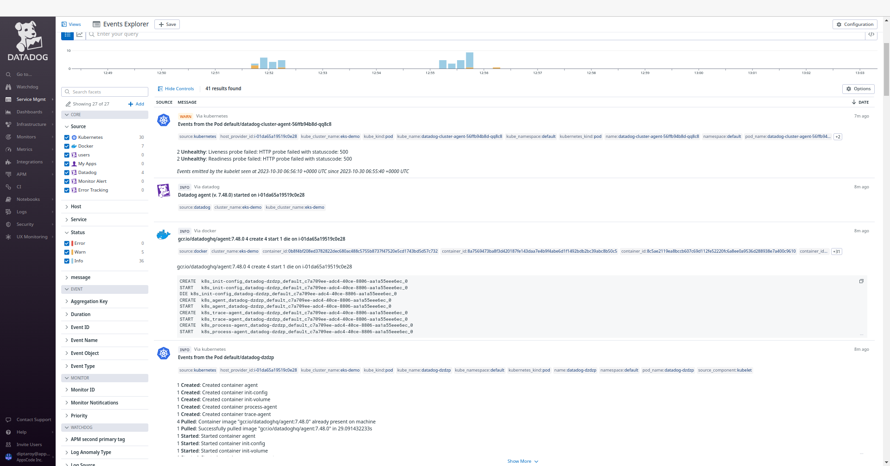

## Introduction

KubeDB is the Kubernetes Native Database Management Solution which simplifies and automates routine database tasks such as Provisioning, Monitoring, Upgrading, Patching, Scaling, Volume Expansion, Backup, Recovery, Failure detection for various popular databases on private and public clouds. The databases supported by KubeDB include MongoDB, Elasticsearch, MySQL, MariaDB, Redis, PostgreSQL, Percona XtraDB, and Memcached. Additionally, KubeDB also supports ProxySQL, PgBouncer, and the streaming platform Kafka. You can find the guides to all the supported databases in [KubeDB](https://kubedb.com/).
In this tutorial we will Monitor MySQL With Datadog in Amazon Elastic Kubernetes Service (Amazon EKS) using KubeDB. We will cover the following steps:

1) Install KubeDB
2) Install Datadog
3) Deploy MySQL Cluster
4) Read/Write Sample Data
5) Monitor MySQL with Datadog


### Get Cluster ID

We need the cluster ID to get the KubeDB License. To get cluster ID we can run the following command:

```bash
$ kubectl get ns kube-system -o jsonpath='{.metadata.uid}'
8e336615-0dbb-4ae8-b72f-2e7ec34c399d
```

### Get License

Go to [Appscode License Server](https://license-issuer.appscode.com/) to get the license.txt file. For this tutorial, we will use KubeDB.


## Install KubeDB

We will use helm to install KubeDB. Please install [Helm](https://helm.sh/docs/intro/install/) if it is not already installed.
Now, let's install `KubeDB`.

```bash
$ helm search repo appscode/kubedb
NAME                              	CHART VERSION	APP VERSION	DESCRIPTION                                       
appscode/kubedb                   	v2024.1.31   	v2024.1.31 	KubeDB by AppsCode - Production ready databases...
appscode/kubedb-autoscaler        	v0.26.0      	v0.26.0    	KubeDB Autoscaler by AppsCode - Autoscale KubeD...
appscode/kubedb-catalog           	v2024.1.31   	v2024.1.31 	KubeDB Catalog by AppsCode - Catalog for databa...
appscode/kubedb-community         	v0.24.2      	v0.24.2    	KubeDB Community by AppsCode - Community featur...
appscode/kubedb-crd-manager       	v0.0.4       	v0.0.4     	KubeDB CRD Manager by AppsCode                    
appscode/kubedb-crds              	v2024.1.31   	v2024.1.31 	KubeDB Custom Resource Definitions                
appscode/kubedb-dashboard         	v0.17.0      	v0.17.0    	KubeDB Dashboard by AppsCode                      
appscode/kubedb-enterprise        	v0.11.2      	v0.11.2    	KubeDB Enterprise by AppsCode - Enterprise feat...
appscode/kubedb-grafana-dashboards	v2024.1.31   	v2024.1.31 	A Helm chart for kubedb-grafana-dashboards by A...
appscode/kubedb-kubestash-catalog 	v2024.1.31   	v2024.1.31 	KubeStash Catalog by AppsCode - Catalog of Kube...
appscode/kubedb-metrics           	v2024.1.31   	v2024.1.31 	KubeDB State Metrics                              
appscode/kubedb-one               	v2023.12.28  	v2023.12.28	KubeDB and Stash by AppsCode - Production ready...
appscode/kubedb-ops-manager       	v0.28.0      	v0.28.0    	KubeDB Ops Manager by AppsCode - Enterprise fea...
appscode/kubedb-opscenter         	v2024.1.31   	v2024.1.31 	KubeDB Opscenter by AppsCode                      
appscode/kubedb-provider-aws      	v2024.1.31   	v0.3.0     	A Helm chart for KubeDB AWS Provider for Crossp...
appscode/kubedb-provider-azure    	v2024.1.31   	v0.3.0     	A Helm chart for KubeDB Azure Provider for Cros...
appscode/kubedb-provider-gcp      	v2024.1.31   	v0.3.0     	A Helm chart for KubeDB GCP Provider for Crossp...
appscode/kubedb-provisioner       	v0.41.0      	v0.41.0    	KubeDB Provisioner by AppsCode - Community feat...
appscode/kubedb-schema-manager    	v0.17.0      	v0.17.0    	KubeDB Schema Manager by AppsCode                 
appscode/kubedb-ui                	v2023.12.20  	0.6.3      	A Helm chart for Kubernetes                       
appscode/kubedb-ui-server         	v2021.12.21  	v2021.12.21	A Helm chart for kubedb-ui-server by AppsCode     
appscode/kubedb-webhook-server    	v0.17.0      	v0.17.0    	KubeDB Webhook Server by AppsCode   


$ helm install kubedb oci://ghcr.io/appscode-charts/kubedb \
  --version v2024.1.31 \
  --namespace kubedb --create-namespace \
  --set-file global.license=/path/to/the/license.txt \
  --wait --burst-limit=10000 --debug
```

Let's verify the installation:

```bash
$ watch kubectl get pods --all-namespaces -l "app.kubernetes.io/instance=kubedb"

NAMESPACE   NAME                                            READY   STATUS    RESTARTS   AGE
kubedb      kubedb-kubedb-autoscaler-746df5998f-cchzr       1/1     Running   0          3m27s
kubedb      kubedb-kubedb-ops-manager-6cfd6854dd-b5jqt      1/1     Running   0          3m27s
kubedb      kubedb-kubedb-provisioner-5df59668f6-8fbwc      1/1     Running   0          3m27s
kubedb      kubedb-kubedb-webhook-server-7464d44c59-h5rcj   1/1     Running   0          3m27s
```

We can list the CRD Groups that have been registered by the operator by running the following command:

```bash
$ kubectl get crd -l app.kubernetes.io/name=kubedb
NAME                                               CREATED AT
connectclusters.kafka.kubedb.com                   2024-02-06T05:06:36Z
connectors.kafka.kubedb.com                        2024-02-06T05:06:36Z
druidversions.catalog.kubedb.com                   2024-02-06T05:06:03Z
elasticsearchautoscalers.autoscaling.kubedb.com    2024-02-06T05:06:33Z
elasticsearchdashboards.elasticsearch.kubedb.com   2024-02-06T05:06:33Z
elasticsearches.kubedb.com                         2024-02-06T05:06:32Z
elasticsearchopsrequests.ops.kubedb.com            2024-02-06T05:06:33Z
elasticsearchversions.catalog.kubedb.com           2024-02-06T05:06:03Z
etcdversions.catalog.kubedb.com                    2024-02-06T05:06:03Z
ferretdbversions.catalog.kubedb.com                2024-02-06T05:06:03Z
kafkaconnectorversions.catalog.kubedb.com          2024-02-06T05:06:03Z
kafkaopsrequests.ops.kubedb.com                    2024-02-06T05:06:36Z
kafkas.kubedb.com                                  2024-02-06T05:06:36Z
kafkaversions.catalog.kubedb.com                   2024-02-06T05:06:03Z
mariadbautoscalers.autoscaling.kubedb.com          2024-02-06T05:06:39Z
mariadbopsrequests.ops.kubedb.com                  2024-02-06T05:06:39Z
mariadbs.kubedb.com                                2024-02-06T05:06:39Z
mariadbversions.catalog.kubedb.com                 2024-02-06T05:06:03Z
memcachedversions.catalog.kubedb.com               2024-02-06T05:06:03Z
mongodbarchivers.archiver.kubedb.com               2024-02-06T05:06:42Z
mongodbautoscalers.autoscaling.kubedb.com          2024-02-06T05:06:42Z
mongodbopsrequests.ops.kubedb.com                  2024-02-06T05:06:42Z
mongodbs.kubedb.com                                2024-02-06T05:06:42Z
mongodbversions.catalog.kubedb.com                 2024-02-06T05:06:03Z
mysqlarchivers.archiver.kubedb.com                 2024-02-06T05:06:46Z
mysqlautoscalers.autoscaling.kubedb.com            2024-02-06T05:06:46Z
mysqlopsrequests.ops.kubedb.com                    2024-02-06T05:06:46Z
mysqls.kubedb.com                                  2024-02-06T05:06:46Z
mysqlversions.catalog.kubedb.com                   2024-02-06T05:06:03Z
perconaxtradbversions.catalog.kubedb.com           2024-02-06T05:06:03Z
pgbouncerversions.catalog.kubedb.com               2024-02-06T05:06:03Z
pgpoolversions.catalog.kubedb.com                  2024-02-06T05:06:03Z
postgresarchivers.archiver.kubedb.com              2024-02-06T05:06:49Z
postgresautoscalers.autoscaling.kubedb.com         2024-02-06T05:06:49Z
postgreses.kubedb.com                              2024-02-06T05:06:49Z
postgresopsrequests.ops.kubedb.com                 2024-02-06T05:06:49Z
postgresversions.catalog.kubedb.com                2024-02-06T05:06:03Z
proxysqlversions.catalog.kubedb.com                2024-02-06T05:06:03Z
publishers.postgres.kubedb.com                     2024-02-06T05:06:50Z
rabbitmqversions.catalog.kubedb.com                2024-02-06T05:06:03Z
redisautoscalers.autoscaling.kubedb.com            2024-02-06T05:06:53Z
redises.kubedb.com                                 2024-02-06T05:06:53Z
redisopsrequests.ops.kubedb.com                    2024-02-06T05:06:53Z
redissentinelautoscalers.autoscaling.kubedb.com    2024-02-06T05:06:53Z
redissentinelopsrequests.ops.kubedb.com            2024-02-06T05:06:53Z
redissentinels.kubedb.com                          2024-02-06T05:06:53Z
redisversions.catalog.kubedb.com                   2024-02-06T05:06:03Z
singlestoreversions.catalog.kubedb.com             2024-02-06T05:06:04Z
solrversions.catalog.kubedb.com                    2024-02-06T05:06:04Z
subscribers.postgres.kubedb.com                    2024-02-06T05:06:50Z
zookeeperversions.catalog.kubedb.com               2024-02-06T05:06:04Z
```

## Install Datadog

To install Datadog, we recommend using `Helm`. Below are the steps for the installation. For more installation options and details, visit [Datadog's official documentation](https://docs.datadoghq.com/containers/kubernetes/installation/?tab=operator).

```bash
$ helm repo add datadog https://helm.datadoghq.com
$ helm repo update
$ helm install datadog --set datadog.site='datadoghq.com' --set datadog.apiKey=<YOUR DATADOG API KEY> --set datadog.apm.enabled=true datadog/datadog
```

Let's verify the installation:

```bash
$ kubectl get pods --all-namespaces -l "app.kubernetes.io/instance=datadog"

NAMESPACE   NAME                                     READY   STATUS    RESTARTS   AGE
default     datadog-bkbkg                            3/3     Running   0          87s
default     datadog-cluster-agent-5c9946d8d7-8kfpp   1/1     Running   0          86s
default     datadog-cx6c8                            3/3     Running   0          86s
default     datadog-hf5s6                            3/3     Running   0          86s
default     datadog-nw5vq                            3/3     Running   0          86s
default     datadog-r6pjd                            3/3     Running   0          86s
default     datadog-w8bjp                            3/3     Running   0          86s
```

### Datadog Events

To view events from your Kubernetes cluster, go to [Datadog's Event Explorer](https://app.datadoghq.com/event/explorer). You'll find valuable insights and information about your Kubernetes environment.



### Install MySQL Dashboard

To access the MySQL dashboard, go to `Integrations` and then install the MySQL integration from there. This will allow you to monitor your MySQL databases through Datadog's dashboard.


### Deploy MySQL Cluster

Now we are going to deploy MySQL cluster using KubeDB. You'll need to deploy your MySQL cluster with the same namespace `default` where Datadog is installed.

Here is the yaml of the MySQL we are going to use:

```yaml
apiVersion: kubedb.com/v1alpha2
kind: MySQL
metadata:
  name: mysql-cluster-dd
  namespace: default
spec:
  version: "8.0.32"
  replicas: 3
  topology:
    mode: GroupReplication
  storageType: Durable
  storage:
    storageClassName: "standard"
    accessModes:
      - ReadWriteOnce
    resources:
      requests:
        storage: 1Gi
  terminationPolicy: WipeOut
  podTemplate:
    metadata:
      annotations:
        ad.datadoghq.com/mysql.checks: |
          {
            "mysql": {
              "instances": [
                {
                  "server": "%%host%%",
                  "username": "datadog",
                  "password": "admin123"
                }
              ]
            }
          }
        ad.datadoghq.com/mysql.logs: '[{"source": "mysql", "service": "mysql"}]'
```

Let's save this yaml configuration into `mysql-cluster-dd.yaml` 
Then create the above MySQL CRD

```bash
$ kubectl apply -f mysql-cluster-dd.yaml
mysql.kubedb.com/mysql-cluster-dd created
```

In this yaml,
* `spec.version` field specifies the version of MySQL. Here, we are using MySQL `version 8.0.32`. You can list the KubeDB supported versions of MySQL by running `$ kubectl get mysqlversions` command.
* Another field to notice is the `spec.storageType` field. This can be `Durable` or `Ephemeral` depending on the requirements of the database to be persistent or not.
* `spec.terminationPolicy` field is *Wipeout* means that the database will be deleted without restrictions. It can also be "Halt", "Delete" and "DoNotTerminate". Learn more about [Termination Policy](https://kubedb.com/docs/latest/guides/mysql/concepts/database/#specterminationpolicy).
* `spec.podTemplate.metadata.annotations` field specifes [Autodiscovery Integrations Templates](https://docs.datadoghq.com/containers/kubernetes/integrations/?tab=kubernetesadv2) as pod annotations on your application container. Learn more about [Autodiscovery Template Variables](https://docs.datadoghq.com/containers/guide/template_variables/).

> Note: To align with the configurations specified in our annotations, it is essential to create a MySQL user with the username `datadog` and the password `admin123`. You can change these fields to your preference.

Once everything handled correctly and the MySQL object is deployed, you will see that the following are created:

```bash
$ kubectl get all -n default -l=app.kubernetes.io/instance=mysql-cluster-dd

NAME                                         READY   STATUS    RESTARTS   AGE
pod/mysql-cluster-dd-0                       2/2     Running   0          3m
pod/mysql-cluster-dd-1                       2/2     Running   0          2m7s
pod/mysql-cluster-dd-2                       2/2     Running   0          2m11s

NAME                                                 TYPE        CLUSTER-IP     EXTERNAL-IP   PORT(S)             AGE
service/mysql-cluster-dd                             ClusterIP   10.48.14.254   <none>        3306/TCP            3m
service/mysql-cluster-dd-pods                        ClusterIP   None           <none>        3306/TCP            2m7s
service/mysql-cluster-dd-standby                     ClusterIP   10.48.4.155    <none>        3306/TCP            2m11s

NAME                                READY   AGE
statefulset.apps/mysql-cluster-dd   3/3     3m

NAME                                                  TYPE               VERSION   AGE
appbinding.appcatalog.appscode.com/mysql-cluster-dd   kubedb.com/mysql   8.0.32    3m
```
Let’s check if the database is ready to use,

```bash
$ kubectl get mysql -n default mysql-cluster-dd
NAME               VERSION   STATUS   AGE
mysql-cluster-dd   8.0.32    Ready    5m
```
> We have successfully deployed MySQL in EKS with Datadog. Now we can exec into the container to use the database.

### Accessing Database Through CLI

To access the database through CLI, we have to get the credentials to access. KubeDB will create Secret and Service for the database `mysql-cluster-dd` that we have deployed. Let’s check them using the following commands,

```bash
$ kubectl get secret -n default -l=app.kubernetes.io/instance=mysql-cluster-dd
NAME                    TYPE                       DATA   AGE
mysql-cluster-dd-auth   kubernetes.io/basic-auth   2      4m

$ kubectl get service -n default -l=app.kubernetes.io/instance=mysql-cluster-dd
NAME                       TYPE        CLUSTER-IP     EXTERNAL-IP   PORT(S)    AGE
mysql-cluster-dd           ClusterIP   10.48.14.254   <none>        3306/TCP   4m
mysql-cluster-dd-pods      ClusterIP   None           <none>        3306/TCP   4m
mysql-cluster-dd-standby   ClusterIP   10.48.4.155    <none>        3306/TCP   4m
```
Now, we are going to use `mysql-cluster-dd-auth` to get the credentials.

```bash
$ kubectl get secrets -n default mysql-cluster-dd-auth -o jsonpath='{.data.username}' | base64 -d
root

$ kubectl get secrets -n default mysql-cluster-dd-auth -o jsonpath='{.data.password}' | base64 -d
aF!SlcQtd73MP)t5
```

### Grant Permission to Datadog Agent

In this section, we'll create a MySQL user with the username `datadog` and the password `admin123` as defined in `mysql-cluster-dd.yaml`. Additionally, we'll provide the user to have the necessary permissions to scrape metrics.

```bash
$ kubectl exec -it mysql-cluster-dd-0 -n default -c mysql -- bash
bash-4.4# mysql --user=root --password='aF!SlcQtd73MP)t5'

Welcome to the MySQL monitor.  Commands end with ; or \g.
Type 'help;' or '\h' for help. Type '\c' to clear the current input statement.

mysql> CREATE USER 'datadog'@'%' IDENTIFIED BY 'admin123';
Query OK, 0 rows affected (0.03 sec)

mysql> GRANT REPLICATION CLIENT ON *.* TO 'datadog'@'%';
Query OK, 0 rows affected (0.01 sec)

mysql> GRANT PROCESS ON *.* TO 'datadog'@'%';
Query OK, 0 rows affected (0.00 sec)

mysql> GRANT SELECT ON performance_schema.* TO 'datadog'@'%';
Query OK, 0 rows affected (0.01 sec)

mysql> exit
Bye
```

### Accessing MySQL Dashboards

To access the monitoring dashboards in the Datadog UI, navigate to the `Dashboards` section in your Datadog account's main menu. From the dropdown menu, select `Dashboards List`, and you'll find `MySQL - Overview` and `MySQL`. These dashboards provide insights into various aspects of your MySQL database, offering both a high-level summary and more detailed performance metrics for effective monitoring and management. Also, to access MySQL metrics, navigate to the `Metrics` section and select `Summary` in the Datadog UI.


#### Insert Sample Data

Let's insert some sample data into our MySQL database.

```bash
$ kubectl exec -it mysql-cluster-dd-0 -n default -c mysql -- bash
bash-4.4# mysql --user=root --password='aF!SlcQtd73MP)t5'

Welcome to the MySQL monitor.  Commands end with ; or \g.
Type 'help;' or '\h' for help. Type '\c' to clear the current input statement.

mysql> CREATE DATABASE Music;
Query OK, 1 row affected (0.03 sec)

mysql> CREATE TABLE Music.Artist (id INT(6) UNSIGNED AUTO_INCREMENT PRIMARY KEY, Name VARCHAR(50), Song VARCHAR(50));
Query OK, 0 rows affected, 1 warning (0.04 sec)

mysql>  INSERT INTO Music.Artist (Name, Song) VALUES ("Bon Jovi", "It's My Life");
Query OK, 1 row affected (0.01 sec)

mysql> SELECT * FROM Music.Artist;
+----+----------+--------------+
| id | Name     | Song         |
+----+----------+--------------+
|  1 | Bon Jovi | It's My Life |
+----+----------+--------------+
1 row in set (0.00 sec)

mysql> exit
Bye
```

> We’ve successfully inserted some sample data to our database. More information about Deploy & Manage MySQL on Kubernetes can be found in [MySQL Kubernetes](https://kubedb.com/kubernetes/databases/run-and-manage-mysql-on-kubernetes/)


Following the insertion of sample data into our MySQL database, we can monitor any resultant changes in the Datadog UI. Go to the `MySQL` and `MySQL - Overview` dashboards to observe any updates in performance metrics and insights for our MySQL database.


## Conclusion

In this article, we've explored the process of monitoring MySQL with Datadog in the Amazon Elastic Kubernetes Service (Amazon EKS) using KubeDB. Our aim was to provide insights into efficiently managing and analyzing MySQL performance within a Kubernetes environment. We've explored into the MySQL configuration, data insertion, and monitoring aspects. This is just the beginning of our journey in exploring the dynamic relationship between MySQL, Datadog, and Kubernetes. We have more articles and resources in the pipeline, all geared toward enhancing your understanding of these technologies and their effective integration. To stay updated and informed, be sure to follow our website for upcoming articles and insights.

If you want to learn more about Production-Grade MySQL on Kubernetes you can have a look into that playlist below:

<iframe width="560" height="315" src="https://www.youtube.com/embed/videoseries?si=jWPGnPZx0zPYoAQ-&amp;list=PLoiT1Gv2KR1gNPaHZtfdBZb6G4wLx6Iks" title="YouTube video player" frameborder="0" allow="accelerometer; autoplay; clipboard-write; encrypted-media; gyroscope; picture-in-picture; web-share" allowfullscreen></iframe>


## Support

To speak with us, please leave a message on [our website](https://appscode.com/contact/).

To receive product announcements, follow us on [Twitter/X](https://twitter.com/KubeDB).

To watch tutorials of various Production-Grade Kubernetes Tools Subscribe our [YouTube](https://www.youtube.com/c/AppsCodeInc/) channel.

More about [MySQL on Kubernetes](https://kubedb.com/kubernetes/databases/run-and-manage-mysql-on-kubernetes/)

If you have found a bug with KubeDB or want to request for new features, please [file an issue](https://github.com/kubedb/project/issues/new).
