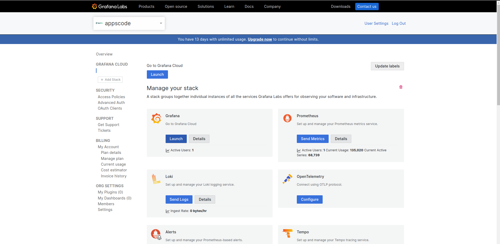
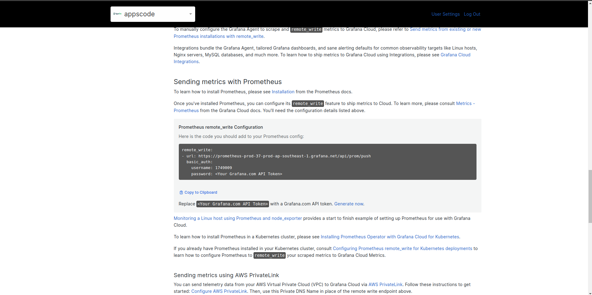
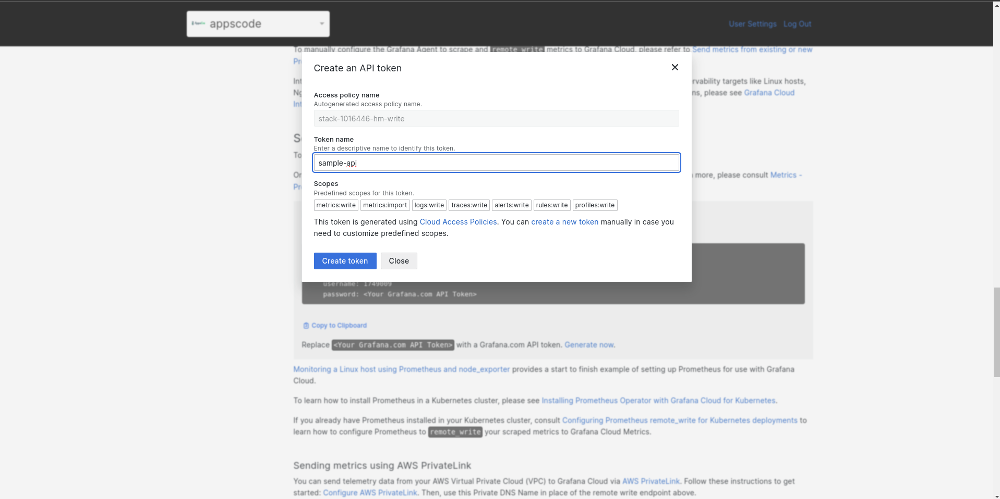
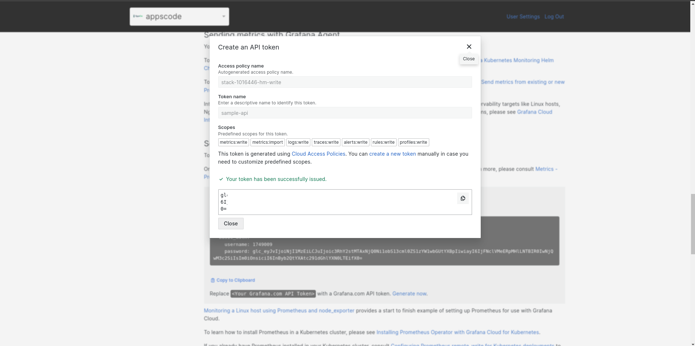
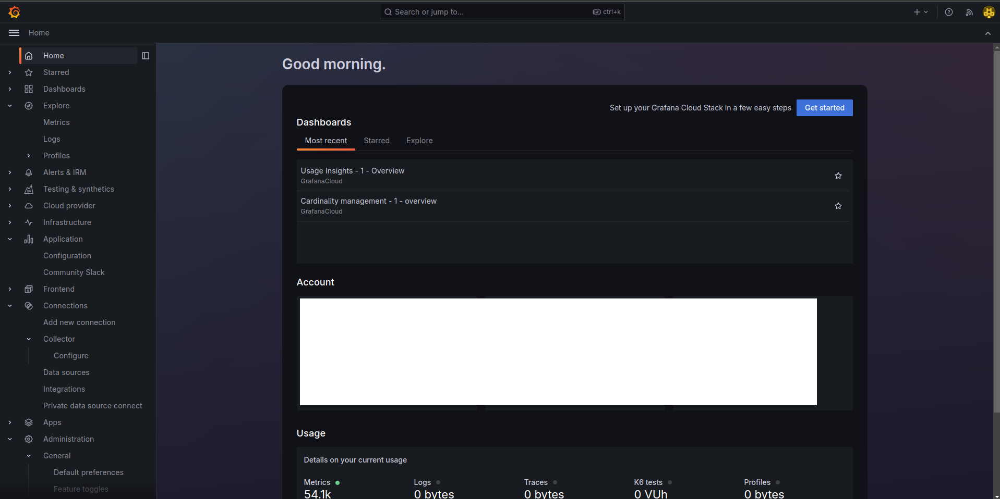
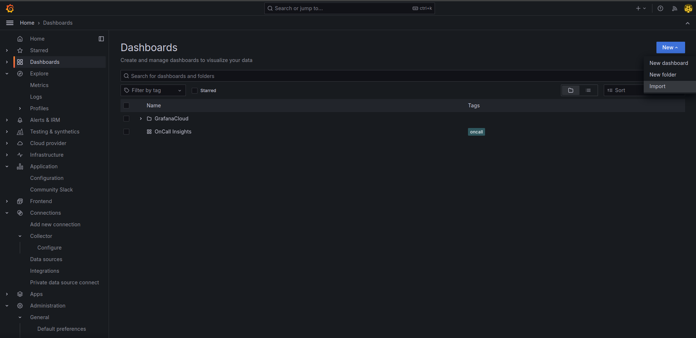
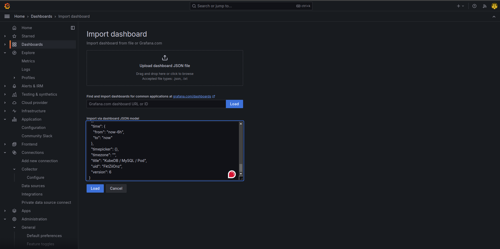
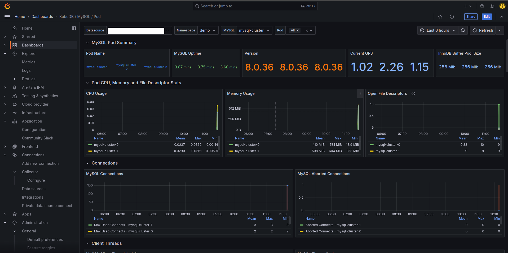
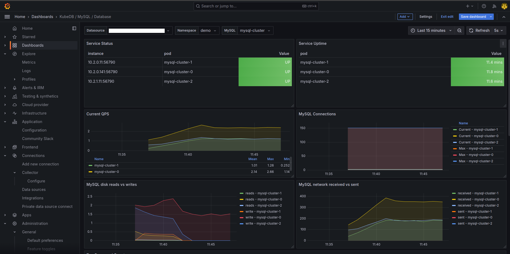
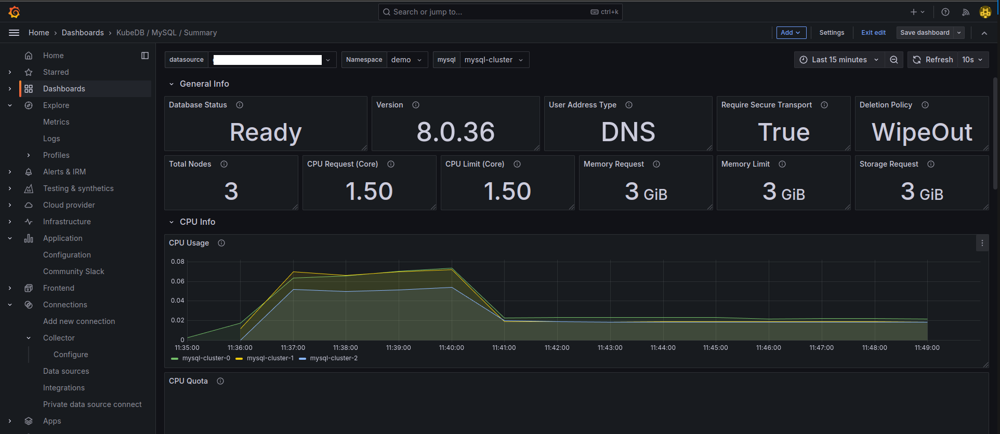

## Overview

KubeDB is the Kubernetes Native Database Management Solution which simplifies and automates routine database tasks such as Provisioning, Monitoring, Upgrading, Patching, Scaling, Volume Expansion, Backup, Recovery, Failure detection, and Repair for various popular databases on private and public clouds. The databases supported by KubeDB include MongoDB, Elasticsearch, MySQL, MariaDB, Redis, PostgreSQL, Solr, Microsoft SQL Server, SingleStore, Druid, FerretDB, Percona XtraDB, and Memcached. Additionally, KubeDB also supports ProxySQL, PgBouncer, Pgpool, ZooKeeper and the streaming platform Kafka, RabbitMQ. You can find the guides to all the supported databases in [KubeDB](https://kubedb.com/).
In this tutorial we will Monitor MySQL with Grafana Cloud Using KubeDB. We will cover the following steps:

1) Install KubeDB
2) Create Grafana Cloud Stack
3) Install Prometheus
4) Install Panopticon
5) Deploy MySQL Cluster
6) Visualize MySQL Metrics in Grafana Cloud

### Get Cluster ID

We need the cluster ID to get the KubeDB License.
To get cluster ID we can run the following command:

```bash
$ kubectl get ns kube-system -o jsonpath='{.metadata.uid}'
8e336615-0dbb-4ae8-b72f-2e7ec34c399d
```

### Get License

Go to [Appscode License Server](https://license-issuer.appscode.com/) to get the license.txt file. For this tutorial we will use KubeDB.


### Install KubeDB

We will use helm to install KubeDB. Please install helm [here](https://helm.sh/docs/intro/install/) if it is not already installed.
Now, let's install `KubeDB`.

```bash
$ helm repo add appscode https://charts.appscode.com/stable/
$ helm repo update

$ helm search repo appscode/kubedb
NAME                              	CHART VERSION	APP VERSION	DESCRIPTION                                       
appscode/kubedb                   	v2024.8.21   	v2024.8.21 	KubeDB by AppsCode - Production ready databases...
appscode/kubedb-autoscaler        	v0.32.0      	v0.32.0    	KubeDB Autoscaler by AppsCode - Autoscale KubeD...
appscode/kubedb-catalog           	v2024.8.21   	v2024.8.21 	KubeDB Catalog by AppsCode - Catalog for databa...
appscode/kubedb-community         	v0.24.2      	v0.24.2    	KubeDB Community by AppsCode - Community featur...
appscode/kubedb-crd-manager       	v0.2.0       	v0.2.0     	KubeDB CRD Manager by AppsCode                    
appscode/kubedb-crds              	v2024.8.21   	v2024.8.21 	KubeDB Custom Resource Definitions                
appscode/kubedb-dashboard         	v0.23.0      	v0.23.0    	KubeDB Dashboard by AppsCode                      
appscode/kubedb-enterprise        	v0.11.2      	v0.11.2    	KubeDB Enterprise by AppsCode - Enterprise feat...
appscode/kubedb-grafana-dashboards	v2024.8.21   	v2024.8.21 	A Helm chart for kubedb-grafana-dashboards by A...
appscode/kubedb-kubestash-catalog 	v2024.8.21   	v2024.8.21 	KubeStash Catalog by AppsCode - Catalog of Kube...
appscode/kubedb-metrics           	v2024.8.21   	v2024.8.21 	KubeDB State Metrics                              
appscode/kubedb-one               	v2023.12.28  	v2023.12.28	KubeDB and Stash by AppsCode - Production ready...
appscode/kubedb-ops-manager       	v0.34.0      	v0.34.0    	KubeDB Ops Manager by AppsCode - Enterprise fea...
appscode/kubedb-opscenter         	v2024.8.21   	v2024.8.21 	KubeDB Opscenter by AppsCode                      
appscode/kubedb-provider-aws      	v2024.8.21   	v0.9.0     	A Helm chart for KubeDB AWS Provider for Crossp...
appscode/kubedb-provider-azure    	v2024.8.21   	v0.9.0     	A Helm chart for KubeDB Azure Provider for Cros...
appscode/kubedb-provider-gcp      	v2024.8.21   	v0.9.0     	A Helm chart for KubeDB GCP Provider for Crossp...
appscode/kubedb-provisioner       	v0.47.0      	v0.47.0    	KubeDB Provisioner by AppsCode - Community feat...
appscode/kubedb-schema-manager    	v0.23.0      	v0.23.0    	KubeDB Schema Manager by AppsCode                 
appscode/kubedb-ui                	v2024.8.21   	0.7.5      	A Helm chart for Kubernetes                       
appscode/kubedb-ui-presets        	v2024.8.21   	v2024.8.21 	KubeDB UI Presets                                 
appscode/kubedb-ui-server         	v2021.12.21  	v2021.12.21	A Helm chart for kubedb-ui-server by AppsCode     
appscode/kubedb-webhook-server    	v0.23.0      	v0.23.0    	KubeDB Webhook Server by AppsCode   

$ helm install kubedb oci://ghcr.io/appscode-charts/kubedb \
  --version v2024.8.21 \
  --namespace kubedb --create-namespace \
  --set-file global.license=/path/to/the/license.txt \
  --wait --burst-limit=10000 --debug
```

Let's verify the installation:

```bash
$ watch kubectl get pods --all-namespaces -l "app.kubernetes.io/instance=kubedb"
NAMESPACE   NAME                                            READY   STATUS    RESTARTS   AGE
kubedb      kubedb-kubedb-autoscaler-c49489f88-gv65v        1/1     Running   0          3m24s
kubedb      kubedb-kubedb-ops-manager-6b5675ccc9-4qc6l      1/1     Running   0          3m24s
kubedb      kubedb-kubedb-provisioner-55dd98fb6-l6l9z       1/1     Running   0          3m24s
kubedb      kubedb-kubedb-webhook-server-7dbb9df8d9-2x8rv   1/1     Running   0          3m24s
kubedb      kubedb-petset-operator-77b6b9897f-fjqvp         1/1     Running   0          3m24s
kubedb      kubedb-petset-webhook-server-6b65748d9d-fmghj   2/2     Running   0          3m24s
kubedb      kubedb-sidekick-c898cff4c-hknhn                 1/1     Running   0          3m24s
```

We can list the CRD Groups that have been registered by the operator by running the following command:

```bash
$ kubectl get crd -l app.kubernetes.io/name=kubedb
NAME                                               CREATED AT
clickhouseversions.catalog.kubedb.com              2024-08-23T09:51:07Z
connectclusters.kafka.kubedb.com                   2024-08-23T09:51:43Z
connectors.kafka.kubedb.com                        2024-08-23T09:51:43Z
druidversions.catalog.kubedb.com                   2024-08-23T09:51:07Z
elasticsearchautoscalers.autoscaling.kubedb.com    2024-08-23T09:51:40Z
elasticsearchdashboards.elasticsearch.kubedb.com   2024-08-23T09:51:40Z
elasticsearches.kubedb.com                         2024-08-23T09:51:39Z
elasticsearchopsrequests.ops.kubedb.com            2024-08-23T09:51:40Z
elasticsearchversions.catalog.kubedb.com           2024-08-23T09:51:07Z
etcdversions.catalog.kubedb.com                    2024-08-23T09:51:07Z
ferretdbversions.catalog.kubedb.com                2024-08-23T09:51:07Z
kafkaautoscalers.autoscaling.kubedb.com            2024-08-23T09:51:43Z
kafkaconnectorversions.catalog.kubedb.com          2024-08-23T09:51:07Z
kafkaopsrequests.ops.kubedb.com                    2024-08-23T09:51:43Z
kafkas.kubedb.com                                  2024-08-23T09:51:43Z
kafkaversions.catalog.kubedb.com                   2024-08-23T09:51:07Z
mariadbarchivers.archiver.kubedb.com               2024-08-23T09:51:47Z
mariadbautoscalers.autoscaling.kubedb.com          2024-08-23T09:51:47Z
mariadbdatabases.schema.kubedb.com                 2024-08-23T09:51:47Z
mariadbopsrequests.ops.kubedb.com                  2024-08-23T09:51:46Z
mariadbs.kubedb.com                                2024-08-23T09:51:46Z
mariadbversions.catalog.kubedb.com                 2024-08-23T09:51:07Z
memcachedversions.catalog.kubedb.com               2024-08-23T09:51:07Z
mongodbarchivers.archiver.kubedb.com               2024-08-23T09:51:50Z
mongodbautoscalers.autoscaling.kubedb.com          2024-08-23T09:51:50Z
mongodbdatabases.schema.kubedb.com                 2024-08-23T09:51:50Z
mongodbopsrequests.ops.kubedb.com                  2024-08-23T09:51:50Z
mongodbs.kubedb.com                                2024-08-23T09:51:50Z
mongodbversions.catalog.kubedb.com                 2024-08-23T09:51:07Z
mssqlserverversions.catalog.kubedb.com             2024-08-23T09:51:07Z
mysqlarchivers.archiver.kubedb.com                 2024-08-23T09:51:54Z
mysqlautoscalers.autoscaling.kubedb.com            2024-08-23T09:51:54Z
mysqldatabases.schema.kubedb.com                   2024-08-23T09:51:54Z
mysqlopsrequests.ops.kubedb.com                    2024-08-23T09:51:54Z
mysqls.kubedb.com                                  2024-08-23T09:51:54Z
mysqlversions.catalog.kubedb.com                   2024-08-23T09:51:07Z
perconaxtradbversions.catalog.kubedb.com           2024-08-23T09:51:07Z
pgbouncerversions.catalog.kubedb.com               2024-08-23T09:51:07Z
pgpoolversions.catalog.kubedb.com                  2024-08-23T09:51:07Z
postgresarchivers.archiver.kubedb.com              2024-08-23T09:51:57Z
postgresautoscalers.autoscaling.kubedb.com         2024-08-23T09:51:57Z
postgresdatabases.schema.kubedb.com                2024-08-23T09:51:57Z
postgreses.kubedb.com                              2024-08-23T09:51:57Z
postgresopsrequests.ops.kubedb.com                 2024-08-23T09:51:57Z
postgresversions.catalog.kubedb.com                2024-08-23T09:51:08Z
proxysqlversions.catalog.kubedb.com                2024-08-23T09:51:08Z
publishers.postgres.kubedb.com                     2024-08-23T09:51:57Z
rabbitmqversions.catalog.kubedb.com                2024-08-23T09:51:08Z
redisautoscalers.autoscaling.kubedb.com            2024-08-23T09:52:01Z
redises.kubedb.com                                 2024-08-23T09:52:01Z
redisopsrequests.ops.kubedb.com                    2024-08-23T09:52:01Z
redissentinelautoscalers.autoscaling.kubedb.com    2024-08-23T09:52:01Z
redissentinelopsrequests.ops.kubedb.com            2024-08-23T09:52:01Z
redissentinels.kubedb.com                          2024-08-23T09:52:01Z
redisversions.catalog.kubedb.com                   2024-08-23T09:51:08Z
restproxies.kafka.kubedb.com                       2024-08-23T09:51:43Z
schemaregistries.kafka.kubedb.com                  2024-08-23T09:51:43Z
schemaregistryversions.catalog.kubedb.com          2024-08-23T09:51:08Z
singlestoreversions.catalog.kubedb.com             2024-08-23T09:51:08Z
solrversions.catalog.kubedb.com                    2024-08-23T09:51:08Z
subscribers.postgres.kubedb.com                    2024-08-23T09:51:57Z
zookeeperversions.catalog.kubedb.com               2024-08-23T09:51:08Z
```

### Create a Grafana Cloud Stack

First, head over to the `Grafana Cloud Portal` and log in to your account. Once logged in, navigate to your organization dashboard and create a new stack. After the stack is created, you’ll see a detailed view of it similar to the screenshot below.



Now, in the Prometheus section click on the `Send Metrics` button. This action will direct you to a page where you can generate the Prometheus `remote_write` configuration needed to send metrics to Grafana Cloud. Click on `Generate now`, then enter a name for the token in the pop-up window and click `Create token`. Copy the generated `remote_write` configuration, you’ll need it for the next steps.








### Create Namespaces

To ensure resources are well-organized and isolated, we'll create two Kubernetes namespaces named `demo` and `monitoring`. Run the following command to create these namespaces:

```bash
$ kubectl create namespace demo
namespace/demo created

$ kubectl create namespace monitoring
namespace/monitoring created
```

### Install Prometheus

Now, we'll install Prometheus, which will collect and forward metrics from your application to Grafana Cloud. We’ll accomplish this using a series of YAML files. These files include configurations for Prometheus such as `ConfigMap`, `RBAC`, `Service`, and `Deployment`. Get these YAML files from the [GitHub repository](https://github.com/kubedb/MySQL-Monitoring-Builtin/). 
In the `prom-configmap.yaml` file, replace the `data.prometheus.yml.remote_write` section with the `remote_write` configuration you obtained from Grafana Cloud. 

Apply the YAML files with the following commands:

```bash
$ kubectl apply -f prom-configmap.yaml
configmap/prometheus-config created

$ kubectl apply -f prom-rbac.yaml
clusterrole.rbac.authorization.k8s.io/prometheus created
serviceaccount/prometheus created
clusterrolebinding.rbac.authorization.k8s.io/prometheus created

$ kubectl apply -f prom-svc.yaml
service/prometheus created

$ kubectl apply -f prom-deployment.yaml
deployment.apps/prometheus created
```

To verify that Prometheus is running correctly, use the following command:

```bash
$ kubectl get all -n monitoring

NAME                              READY   STATUS    RESTARTS   AGE
pod/prometheus-66c899bbd4-nzlnd   1/1     Running   0          70s

NAME                 TYPE        CLUSTER-IP      EXTERNAL-IP   PORT(S)    AGE
service/prometheus   ClusterIP   10.128.157.42   <none>        9090/TCP   72s

NAME                         READY   UP-TO-DATE   AVAILABLE   AGE
deployment.apps/prometheus   1/1     1            1           72s

NAME                                    DESIRED   CURRENT   READY   AGE
replicaset.apps/prometheus-66c899bbd4   1         1         1       72s
```

### Install Panopticon

Panopticon is a generic state metrics exporter for Kubernetes resources. It can generate Prometheus metrics from both Kubernetes native and custom resources. Generated metrics are exposed in `/metrics` path for the Prometheus server to scrape. KubeDB License works for Panopticon too. So, we will use the same license that we have already obtained. Run the following command to install Panopticon:

```bash
$ helm install panopticon appscode/panopticon -n kubeops \
    --create-namespace \
    --set monitoring.enabled=true \
    --set monitoring.agent=prometheus.io/builtin \
    --set monitoring.serviceMonitor.labels.release=prometheus \
    --set-file license=/path/to/license.txt
```
Let's verify the installation:

```bash
$ watch kubectl get pods --all-namespaces -l "app.kubernetes.io/instance=panopticon"
NAMESPACE   NAME                          READY   STATUS    RESTARTS    AGE
kubeops     panopticon-679897bbbf-68h5w   1/1     Running   0           2m17s
```

### Create DB Metrics Configurations

To monitor your databases, you need to create a `MetricsConfiguration` object. This `MetricsConfiguration` object is used by Panopticon to generate metrics for DB instances.
Install `kubedb-metrics` charts which will create the `MetricsConfiguration` object for DB:

```bash
$ helm search repo appscode/kubedb-metrics --version=v2024.8.21
$ helm install kubedb-metrics appscode/kubedb-metrics -n kubedb --version=v2024.8.21
```

## Deploy MySQL Cluster

With monitoring set up, we can now deploy a MySQL cluster using KubeDB.
First, create the MySQL Custom Resource (CRO) with the following YAML configuration.

```yaml
apiVersion: kubedb.com/v1
kind: MySQL
metadata:
  name: mysql-cluster
  namespace: demo
spec:
  version: "8.0.36"
  replicas: 3
  topology:
    mode: GroupReplication
  storageType: Durable
  storage:
    storageClassName: "standard"
    accessModes:
      - ReadWriteOnce
    resources:
      requests:
        storage: 1Gi
  deletionPolicy: WipeOut
  monitor:
    agent: prometheus.io/builtin
```

Save this yaml configuration into `mysql-cluster.yaml` 
Then create the above MySQL CRO:

```bash
$ kubectl apply -f mysql-cluster.yaml
mysql.kubedb.com/mysql-cluster created
```

In this yaml,
* `spec.version` field specifies the version of MySQL. Here, we are using MySQL `version 8.0.36`. You can list the KubeDB supported versions of MySQL by running `$ kubectl get mysqlversions` command.
* `spec.storage` specifies PVC spec that will be dynamically allocated to store data for this database. This storage spec will be passed to the StatefulSet created by KubeDB operator to run database pods. You can specify any StorageClass available in your cluster with appropriate resource requests.
* `spec.monitor.agent: prometheus.io/builtin` indicates that we are going to monitor this server using Prometheus.
* And the `spec.deletionPolicy` field is *Wipeout* means that the database will be deleted without restrictions. It can also be "Halt", "Delete" and "DoNotTerminate". Learn More about these checkout [Deletion Policy](https://kubedb.com/docs/latest/guides/mysql/concepts/database/#specdeletionpolicy).

Verify that the MySQL cluster and associated resources are created and running:

```bash
$ kubectl get all -n demo
NAME                  READY   STATUS    RESTARTS   AGE
pod/mysql-cluster-0   3/3     Running   0          2m47s
pod/mysql-cluster-1   3/3     Running   0          2m13s
pod/mysql-cluster-2   3/3     Running   0          94s

NAME                            TYPE        CLUSTER-IP      EXTERNAL-IP   PORT(S)     AGE
service/mysql-cluster           ClusterIP   10.128.218.35   <none>        3306/TCP    2m53s
service/mysql-cluster-pods      ClusterIP   None            <none>        3306/TCP    2m53s
service/mysql-cluster-standby   ClusterIP   10.128.56.188   <none>        3306/TCP    2m53s
service/mysql-cluster-stats     ClusterIP   10.128.95.213   <none>        56790/TCP   2m47s

NAME                                               TYPE               VERSION   AGE
appbinding.appcatalog.appscode.com/mysql-cluster   kubedb.com/mysql   8.0.36    2m48s

NAME                             VERSION   STATUS   AGE
mysql.kubedb.com/mysql-cluster   8.0.36    Ready    2m56s
```
Let’s check if the database is ready to use,

```bash
$ kubectl get mysql -n demo mysql-cluster
NAME              VERSION   STATUS   AGE
mysql-cluster     8.0.36    Ready    3m28s
```

### Visualize MySQL Metrics in Grafana Cloud

With your MySQL cluster deployed and metrics being collected, now you can visualize the data in Grafana Cloud.

Go back to the Grafana Cloud Portal. In the `Grafana` section, click on the `Launch` button to open the Grafana Dashboard homepage.


In the left sidebar, click on `Dashboards`. On the Dashboards page, click the `New` button in the top-right corner and select `Import`. On the Import Dashboard page, either upload a JSON file or copy and paste a MySQL dashboard JSON file from the [Github Repository](https://github.com/appscode/grafana-dashboards/tree/master/mysql). Upload or paste the JSON content into the panel JSON field and click the `Load` button.







If everything was set up correctly, you should now see the MySQL dashboards in your Grafana Cloud UI, providing visualizations of your MySQL metrics.
Here are some examples of what you can expect to see:







> Congratulations! With these steps completed, you have successfully set up monitoring for MySQL with Grafana Cloud using KubeDB. 


If you want to learn more about Production-Grade MySQL on Kubernetes you can have a look into that playlist below:

<iframe width="560" height="315" src="https://www.youtube.com/embed/videoseries?si=whD3ghNy9XRL3I81&amp;list=PLoiT1Gv2KR1gNPaHZtfdBZb6G4wLx6Iks" title="YouTube video player" frameborder="0" allow="accelerometer; autoplay; clipboard-write; encrypted-media; gyroscope; picture-in-picture; web-share" referrerpolicy="strict-origin-when-cross-origin" allowfullscreen></iframe>

## Support

To speak with us, please leave a message on [our website](https://appscode.com/contact/).

To receive product announcements, follow us on [X](https://twitter.com/KubeDB).

To watch tutorials of various Production-Grade Kubernetes Tools Subscribe our [YouTube](https://www.youtube.com/c/AppsCodeInc/) channel.

More about [MySQL in Kubernetes](https://kubedb.com/kubernetes/databases/run-and-manage-mysql-on-kubernetes/)

If you have found a bug with KubeDB or want to request for new features, please [file an issue](https://github.com/kubedb/project/issues/new).
