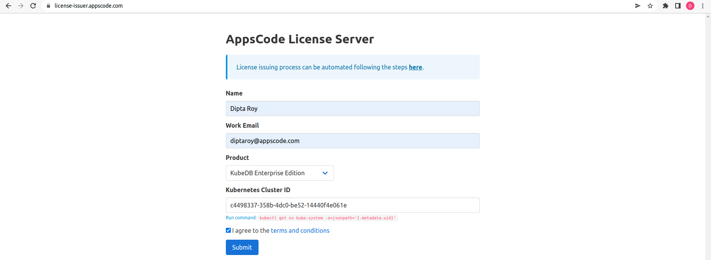
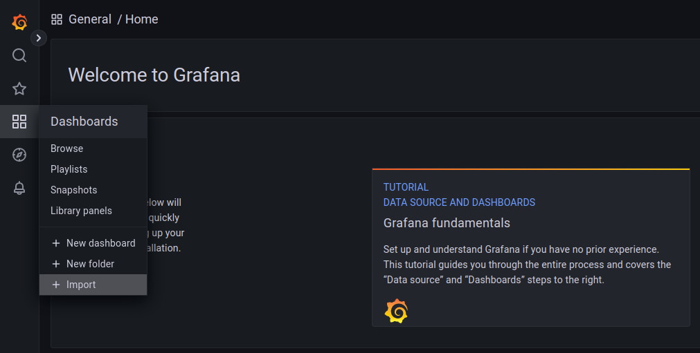
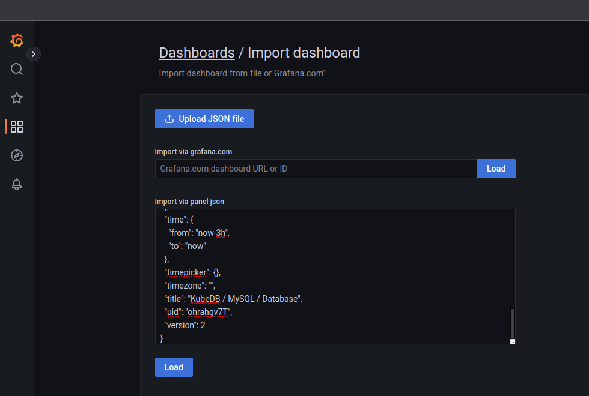
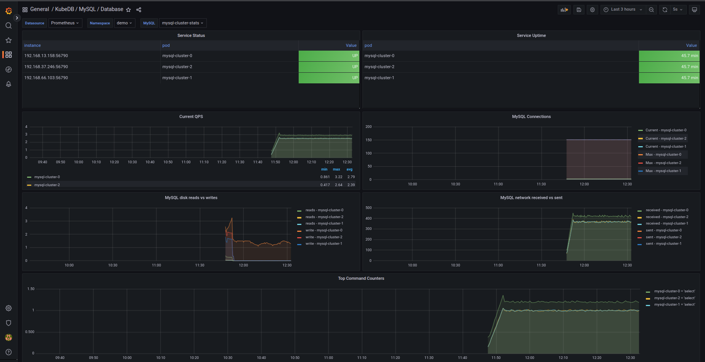
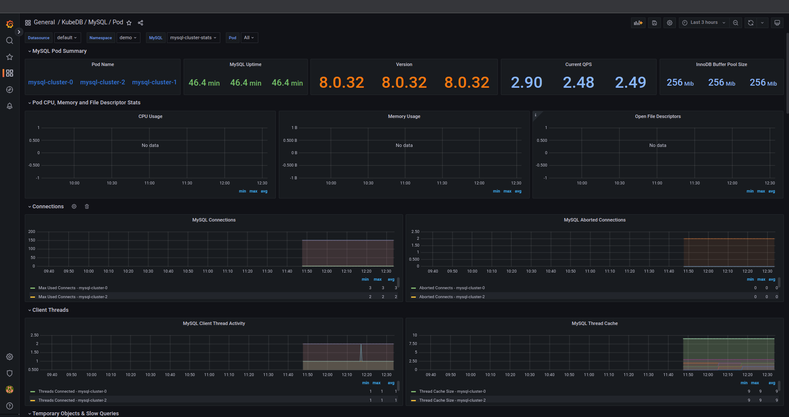
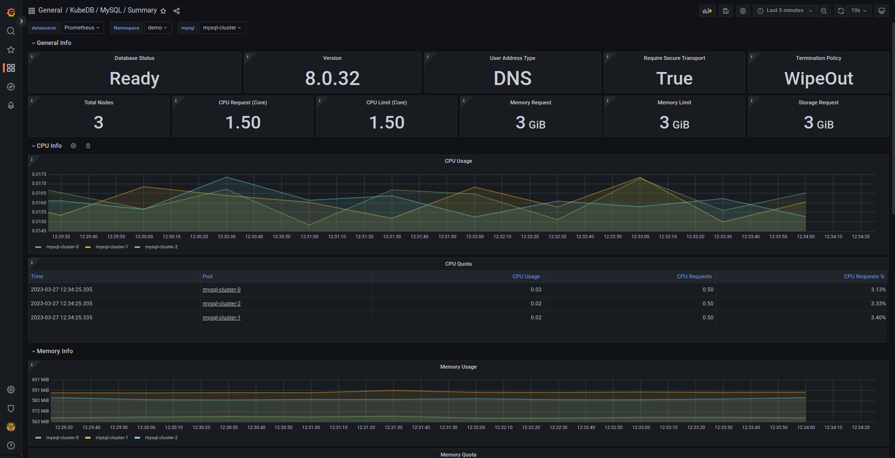

## Overview

KubeDB is the Kubernetes Native Database Management Solution which simplifies and automates routine database tasks such as Provisioning, Monitoring, Upgrading, Patching, Scaling, Volume Expansion, Backup, Recovery, Failure detection, and Repair for various popular databases on private and public clouds. The databases that KubeDB supports are MySQL, MongoDB, MariaDB, Elasticsearch, Redis, PostgreSQL, ProxySQL, Percona XtraDB, Memcached and PgBouncer. You can find the guides to all the supported databases in [KubeDB](https://kubedb.com/). And Panopticon is a generic state metrics exporter for Kubernetes resources. It can generate Prometheus metrics from both Kubernetes native and custom resources. Generated metrics are exposed in `/metrics` path for the Prometheus server to scrape.
In this tutorial we will Monitor MySQL with Grafana Dashboard in Amazon Elastic Kubernetes Service (Amazon EKS). We will cover the following steps:

1) Install KubeDB
2) Install Prometheus Stack
3) Install Panopticon
4) Deploy MySQL Clustered Database
5) Monitor with Grafana Dashboard

### Get Cluster ID

We need the cluster ID to get the KubeDB License.
To get cluster ID we can run the following command:

```bash
$ kubectl get ns kube-system -o jsonpath='{.metadata.uid}'
8c4498337-358b-4dc0-be52-14440f4e061e
```

### Get License

Go to [Appscode License Server](https://license-issuer.appscode.com/) to get the license.txt file. For this tutorial we will use KubeDB Enterprise Edition.



### Install KubeDB

We will use helm to install KubeDB. Please install helm [here](https://helm.sh/docs/intro/install/) if it is not already installed.
Now, let's install `KubeDB`.

```bash
$ helm repo add appscode https://charts.appscode.com/stable/
$ helm repo update

$ helm search repo appscode/kubedb
NAME                              	CHART VERSION	APP VERSION	DESCRIPTION                                       
appscode/kubedb                   	v2023.02.28  	v2023.02.28	KubeDB by AppsCode - Production ready databases...
appscode/kubedb-autoscaler        	v0.17.0      	v0.17.0    	KubeDB Autoscaler by AppsCode - Autoscale KubeD...
appscode/kubedb-catalog           	v2023.02.28  	v2023.02.28	KubeDB Catalog by AppsCode - Catalog for databa...
appscode/kubedb-community         	v0.24.2      	v0.24.2    	KubeDB Community by AppsCode - Community featur...
appscode/kubedb-crds              	v2023.02.28  	v2023.02.28	KubeDB Custom Resource Definitions                
appscode/kubedb-dashboard         	v0.8.0       	v0.8.0     	KubeDB Dashboard by AppsCode                      
appscode/kubedb-enterprise        	v0.11.2      	v0.11.2    	KubeDB Enterprise by AppsCode - Enterprise feat...
appscode/kubedb-grafana-dashboards	v2023.02.28  	v2023.02.28	A Helm chart for kubedb-grafana-dashboards by A...
appscode/kubedb-metrics           	v2023.02.28  	v2023.02.28	KubeDB State Metrics                              
appscode/kubedb-ops-manager       	v0.19.0      	v0.19.2    	KubeDB Ops Manager by AppsCode - Enterprise fea...
appscode/kubedb-opscenter         	v2023.02.28  	v2023.02.28	KubeDB Opscenter by AppsCode                      
appscode/kubedb-provisioner       	v0.32.0      	v0.32.1    	KubeDB Provisioner by AppsCode - Community feat...
appscode/kubedb-schema-manager    	v0.8.0       	v0.8.0     	KubeDB Schema Manager by AppsCode                 
appscode/kubedb-ui                	v2023.03.23  	0.3.28     	A Helm chart for Kubernetes                       
appscode/kubedb-ui-server         	v2021.12.21  	v2021.12.21	A Helm chart for kubedb-ui-server by AppsCode     
appscode/kubedb-webhook-server    	v0.8.0       	v0.8.0     	KubeDB Webhook Server by AppsCode  

# Install KubeDB Enterprise operator chart
$ helm install kubedb appscode/kubedb \
  --version v2023.02.28 \
  --namespace kubedb --create-namespace \
  --set kubedb-provisioner.enabled=true \
  --set kubedb-ops-manager.enabled=true \
  --set kubedb-autoscaler.enabled=true \
  --set kubedb-dashboard.enabled=true \
  --set kubedb-schema-manager.enabled=true \
  --set-file global.license=/path/to/the/license.txt
```

Let's verify the installation:

```bash
$ watch kubectl get pods --all-namespaces -l "app.kubernetes.io/instance=kubedb"

NAMESPACE   NAME                                            READY   STATUS    RESTARTS   AGE
kubedb      kubedb-kubedb-autoscaler-69bbbccf67-qkfkp       1/1     Running   0          2m48s
kubedb      kubedb-kubedb-dashboard-74b579646f-tk44x        1/1     Running   0          2m48s
kubedb      kubedb-kubedb-ops-manager-5bc48b747f-g8tjs      1/1     Running   0          2m48s
kubedb      kubedb-kubedb-provisioner-b7cb8d8c4-9rr9p       1/1     Running   0          2m48s
kubedb      kubedb-kubedb-schema-manager-596ff44fcc-wvhdz   1/1     Running   0          2m48s
kubedb      kubedb-kubedb-webhook-server-74fdd66bf4-7g797   1/1     Running   0          2m48s
```

We can list the CRD Groups that have been registered by the operator by running the following command:

```bash
$ kubectl get crd -l app.kubernetes.io/name=kubedb
NAME                                              CREATED AT
elasticsearchautoscalers.autoscaling.kubedb.com   2023-03-27T05:21:30Z
elasticsearchdashboards.dashboard.kubedb.com      2023-03-27T05:21:30Z
elasticsearches.kubedb.com                        2023-03-27T05:21:30Z
elasticsearchopsrequests.ops.kubedb.com           2023-03-27T05:21:33Z
elasticsearchversions.catalog.kubedb.com          2023-03-27T05:17:45Z
etcds.kubedb.com                                  2023-03-27T05:21:33Z
etcdversions.catalog.kubedb.com                   2023-03-27T05:17:46Z
kafkas.kubedb.com                                 2023-03-27T05:21:40Z
kafkaversions.catalog.kubedb.com                  2023-03-27T05:17:46Z
mariadbautoscalers.autoscaling.kubedb.com         2023-03-27T05:21:30Z
mariadbdatabases.schema.kubedb.com                2023-03-27T05:21:45Z
mariadbopsrequests.ops.kubedb.com                 2023-03-27T05:21:56Z
mariadbs.kubedb.com                               2023-03-27T05:21:34Z
mariadbversions.catalog.kubedb.com                2023-03-27T05:17:46Z
memcacheds.kubedb.com                             2023-03-27T05:21:34Z
memcachedversions.catalog.kubedb.com              2023-03-27T05:17:47Z
mongodbautoscalers.autoscaling.kubedb.com         2023-03-27T05:21:30Z
mongodbdatabases.schema.kubedb.com                2023-03-27T05:21:34Z
mongodbopsrequests.ops.kubedb.com                 2023-03-27T05:21:36Z
mongodbs.kubedb.com                               2023-03-27T05:21:35Z
mongodbversions.catalog.kubedb.com                2023-03-27T05:17:47Z
mysqlautoscalers.autoscaling.kubedb.com           2023-03-27T05:21:30Z
mysqldatabases.schema.kubedb.com                  2023-03-27T05:21:33Z
mysqlopsrequests.ops.kubedb.com                   2023-03-27T05:21:53Z
mysqls.kubedb.com                                 2023-03-27T05:21:33Z
mysqlversions.catalog.kubedb.com                  2023-03-27T05:17:47Z
perconaxtradbautoscalers.autoscaling.kubedb.com   2023-03-27T05:21:31Z
perconaxtradbopsrequests.ops.kubedb.com           2023-03-27T05:22:12Z
perconaxtradbs.kubedb.com                         2023-03-27T05:21:38Z
perconaxtradbversions.catalog.kubedb.com          2023-03-27T05:17:48Z
pgbouncers.kubedb.com                             2023-03-27T05:21:38Z
pgbouncerversions.catalog.kubedb.com              2023-03-27T05:17:48Z
postgresautoscalers.autoscaling.kubedb.com        2023-03-27T05:21:31Z
postgresdatabases.schema.kubedb.com               2023-03-27T05:21:44Z
postgreses.kubedb.com                             2023-03-27T05:21:38Z
postgresopsrequests.ops.kubedb.com                2023-03-27T05:22:05Z
postgresversions.catalog.kubedb.com               2023-03-27T05:17:48Z
proxysqlautoscalers.autoscaling.kubedb.com        2023-03-27T05:21:31Z
proxysqlopsrequests.ops.kubedb.com                2023-03-27T05:22:08Z
proxysqls.kubedb.com                              2023-03-27T05:21:38Z
proxysqlversions.catalog.kubedb.com               2023-03-27T05:17:49Z
publishers.postgres.kubedb.com                    2023-03-27T05:22:22Z
redisautoscalers.autoscaling.kubedb.com           2023-03-27T05:21:31Z
redises.kubedb.com                                2023-03-27T05:21:39Z
redisopsrequests.ops.kubedb.com                   2023-03-27T05:22:00Z
redissentinelautoscalers.autoscaling.kubedb.com   2023-03-27T05:21:31Z
redissentinelopsrequests.ops.kubedb.com           2023-03-27T05:22:15Z
redissentinels.kubedb.com                         2023-03-27T05:21:39Z
redisversions.catalog.kubedb.com                  2023-03-27T05:17:49Z
subscribers.postgres.kubedb.com                   2023-03-27T05:22:25Z
```

### Install Prometheus Stack
Install Prometheus stack if you haven't done it already. You can use [kube-prometheus-stack](https://artifacthub.io/packages/helm/prometheus-community/kube-prometheus-stack) which installs the necessary components required for the MySQL Grafana dashboards.

### Install Panopticon
KubeDB Enterprise License works for Panopticon too. So, we will use the same license that we have already obtained.

```bash
$ helm install panopticon appscode/panopticon -n kubeops \
    --create-namespace \
    --set monitoring.enabled=true \
    --set monitoring.agent=prometheus.io/operator \
    --set monitoring.serviceMonitor.labels.release=prometheus \
    --set-file license=/path/to/license.txt
```
Let's verify the installation:

```bash
$ watch kubectl get pods --all-namespaces -l "app.kubernetes.io/instance=panopticon"
NAMESPACE   NAME                          READY   STATUS    RESTARTS   AGE
kubeops     panopticon-5b6976b669-9lddc   1/1     Running   0          14s
```


## Deploy MySQL Clustered Database

Now, we are going to Deploy MySQL with monitoring enabled using KubeDB.
First, let's create a Namespace in which we will deploy the database.

```bash
$ kubectl create namespace demo
namespace/demo created
```
Here is the yaml of the MySQL CRO we are going to use:

```yaml
apiVersion: kubedb.com/v1alpha2
kind: MySQL
metadata:
  name: mysql-cluster
  namespace: demo
spec:
  version: "8.0.32"
  replicas: 3
  topology:
    mode: GroupReplication
  storageType: Durable
  storage:
    storageClassName: "gp2"
    accessModes:
      - ReadWriteOnce
    resources:
      requests:
        storage: 1Gi
  monitor:
    agent: prometheus.io/operator
    prometheus:
      serviceMonitor:
        labels:
          release: prometheus
        interval: 10s
  terminationPolicy: WipeOut
```

Let's save this yaml configuration into `mysql-cluster.yaml` 
Then create the above MySQL CRO

```bash
$ kubectl apply -f mysql-cluster.yaml
mysql.kubedb.com/mysql-cluster created
```

* In this yaml we can see in the `spec.version` field specifies the version of MySQL. Here, we are using MySQL `version 8.0.32`. You can list the KubeDB supported versions of MySQL by running `$ kubectl get mysqlversions` command.
* `spec.storage` specifies PVC spec that will be dynamically allocated to store data for this database. This storage spec will be passed to the StatefulSet created by KubeDB operator to run database pods. You can specify any StorageClass available in your cluster with appropriate resource requests.
* `spec.monitor.agent: prometheus.io/operator` indicates that we are going to monitor this server using Prometheus operator.
* `spec.monitor.prometheus.serviceMonitor.labels` specifies the release name that KubeDB should use in `ServiceMonitor`.
* `spec.monitor.prometheus.interval` defines that the Prometheus server should scrape metrics from this database with 10 seconds interval.
* And the `spec.terminationPolicy` field is *Wipeout* means that the database will be deleted without restrictions. It can also be "Halt", "Delete" and "DoNotTerminate". Learn More about these [HERE](https://kubedb.com/docs/latest/guides/mysql/concepts/database/#specterminationpolicy).

Once these are handled correctly and the MySQL object is deployed, you will see that the following objects are created:

```bash
$ kubectl get all -n demo -l 'app.kubernetes.io/instance=mysql-cluster'
NAME                  READY   STATUS    RESTARTS   AGE
pod/mysql-cluster-0   3/3     Running   0          4m9s
pod/mysql-cluster-1   3/3     Running   0          3m36s
pod/mysql-cluster-2   3/3     Running   0          2m55s

NAME                            TYPE        CLUSTER-IP       EXTERNAL-IP   PORT(S)     AGE
service/mysql-cluster           ClusterIP   10.100.239.89    <none>        3306/TCP    4m13s
service/mysql-cluster-pods      ClusterIP   None             <none>        3306/TCP    4m13s
service/mysql-cluster-standby   ClusterIP   10.100.254.163   <none>        3306/TCP    4m13s
service/mysql-cluster-stats     ClusterIP   10.100.23.65     <none>        56790/TCP   4m12s

NAME                             READY   AGE
statefulset.apps/mysql-cluster   3/3     4m16s

NAME                                               TYPE               VERSION   AGE
appbinding.appcatalog.appscode.com/mysql-cluster   kubedb.com/mysql   8.0.32    4m21s
```
Let’s check if the database is ready to use,

```bash
$ kubectl get mysql -n demo mysql-cluster
NAME            VERSION   STATUS   AGE
mysql-cluster   8.0.32    Ready    5m32s
```
> We have successfully deployed MySQL in AWS.


### Create DB Metrics Configurations

First, you have to create a `MetricsConfiguration` object for database. This `MetricsConfiguration` object is used by Panopticon to generate metrics for DB instances.
Install `kubedb-metrics` charts which will create the `MetricsConfiguration` object for DB:

```bash
$ helm search repo appscode/kubedb-metrics --version=v2023.02.28
$ helm install kubedb-metrics appscode/kubedb-metrics -n kubedb --version=v2023.02.28
```

### Import Grafana Dashboard
Here, we will port-forward the `prometheus-grafana` service to access Grafana Dashboard from UI.

```bash
$ kubectl get service -n default
NAME                                      TYPE        CLUSTER-IP       EXTERNAL-IP   PORT(S)                      AGE
alertmanager-operated                     ClusterIP   None             <none>        9093/TCP,9094/TCP,9094/UDP   31m
kubernetes                                ClusterIP   10.100.0.1       <none>        443/TCP                      65m
prometheus-grafana                        ClusterIP   10.100.254.24    <none>        80/TCP                       31m
prometheus-kube-prometheus-alertmanager   ClusterIP   10.100.75.171    <none>        9093/TCP                     31m
prometheus-kube-prometheus-operator       ClusterIP   10.100.55.136    <none>        443/TCP                      31m
prometheus-kube-prometheus-prometheus     ClusterIP   10.100.74.248    <none>        9090/TCP                     31m
prometheus-kube-state-metrics             ClusterIP   10.100.5.174     <none>        8080/TCP                     31m
prometheus-operated                       ClusterIP   None             <none>        9090/TCP                     31m
prometheus-prometheus-node-exporter       ClusterIP   10.100.113.235   <none>        9100/TCP                     31m
```
To access Grafana UI Let's port-forward `prometheus-grafana` service to 3063 

```bash
$ kubectl port-forward -n default service/prometheus-grafana 3063:80
Forwarding from 127.0.0.1:3063 -> 3000
Forwarding from [::1]:3063 -> 3000
Handling connection for 3063

```
Now, Go to http://localhost:3063/ you will see a login panel of the Grafana UI, use default credential `admin` as the `Username` and `prom-operator` as the `Password`.


After logged in successfuly on Grafana UI, import the json files of dashboards given below according to your choice.

Select Import button from left bar of the Grafana UI



Upload the json file or copy-paste the json codes to the panel json and hit the load button:




For MySQL Database Dashboard use [MySQL Database Dashboard](https://github.com/appscode/grafana-dashboards/blob/master/mysql/mysql_database_dashboard.json)

For MySQL Group Replication use [MySQL Group Replication Json](https://github.com/appscode/grafana-dashboards/blob/master/mysql/mysql_group_replication.json)

For MySQL Summary use [MySQL Summary Json](https://github.com/appscode/grafana-dashboards/blob/master/mysql/mysql_summary_dashboard.json)

For MySQL Pod use [MySQL Pod Json](https://github.com/appscode/grafana-dashboards/blob/master/mysql/mysql_pod_dashboard.json)

If you followed above instruction properly you will see MySQL Grafana Dashboards in your Grafana UI

Here are some screenshots of our MySQL deployment. You can visualize every single component supported by Grafana, checkout here for more about [Grafana Dashboard](https://grafana.com/docs/grafana/latest/)








We have made an in depth tutorial on Managing Semi-synchronous MySQL Cluster Using KubeDB. You can have a look into the video below:

<iframe width="560" height="315" src="https://www.youtube.com/embed/y9VgofqwGyE" title="YouTube video player" frameborder="0" allow="accelerometer; autoplay; clipboard-write; encrypted-media; gyroscope; picture-in-picture; web-share" allowfullscreen></iframe>

## Support

To speak with us, please leave a message on [our website](https://appscode.com/contact/).

To receive product announcements, follow us on [Twitter](https://twitter.com/KubeDB).

To watch tutorials of various Production-Grade Kubernetes Tools Subscribe our [YouTube](https://youtube.com/@appscode) channel.

More about [MySQL in Kubernetes](https://kubedb.com/kubernetes/databases/run-and-manage-mysql-on-kubernetes/)

If you have found a bug with KubeDB or want to request for new features, please [file an issue](https://github.com/kubedb/project/issues/new).
