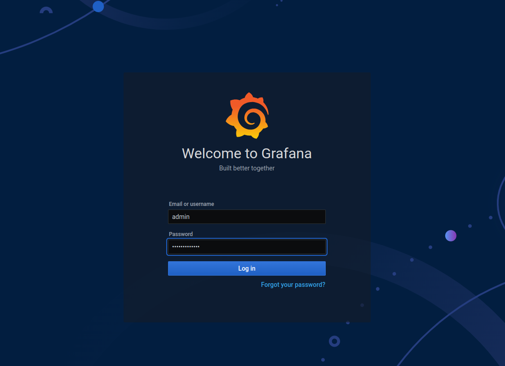
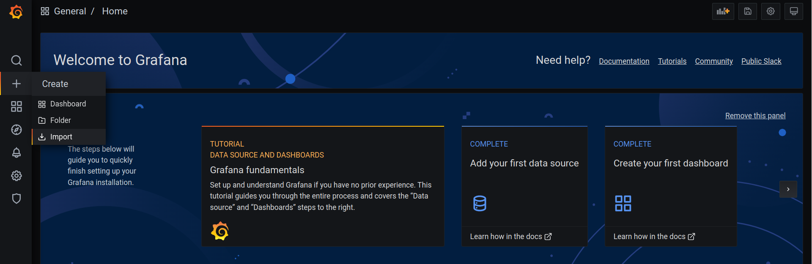
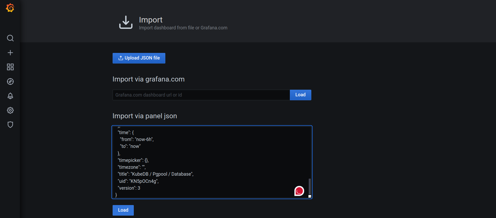
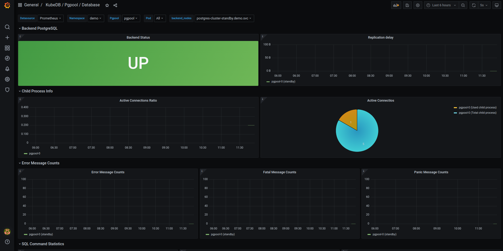
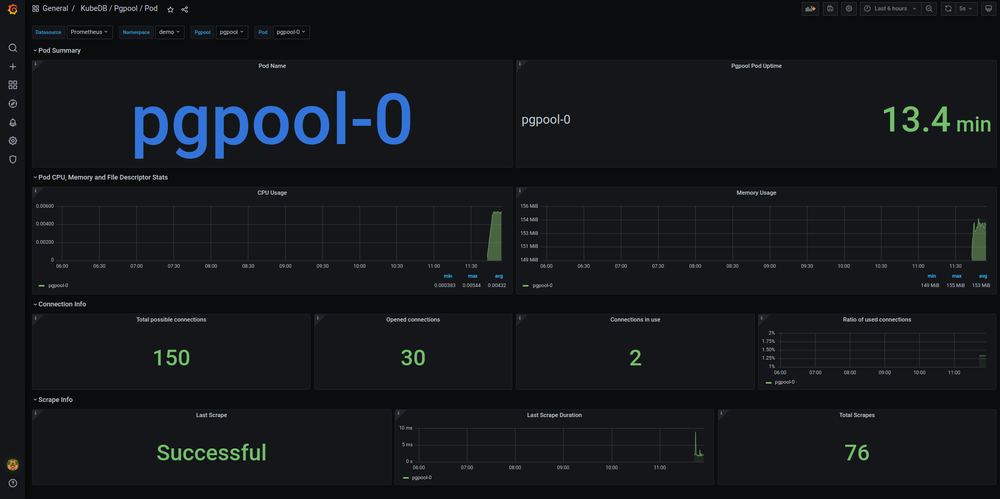
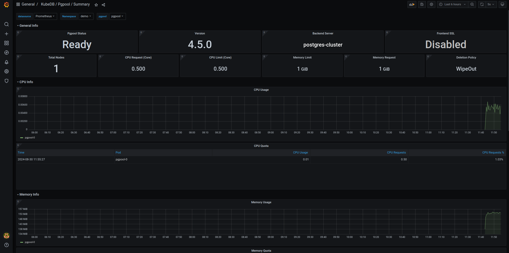

## Overview

KubeDB is the Kubernetes Native Database Management Solution which simplifies and automates routine database tasks such as Provisioning, Monitoring, Upgrading, Patching, Scaling, Volume Expansion, Backup, Recovery, Failure detection, and Repair for various popular databases on private and public clouds. The databases supported by KubeDB include MongoDB, Elasticsearch, MySQL, MariaDB, Redis, PostgreSQL, Solr, Microsoft SQL Server, Druid, FerretDB, SingleStore, Percona XtraDB, and Memcached. Additionally, KubeDB also supports ProxySQL, PgBouncer, Pgpool, ZooKeeper and the streaming platform Kafka, RabbitMQ. You can find the guides to all the supported databases in [KubeDB](https://kubedb.com/). And Panopticon is a generic state metrics exporter for Kubernetes resources. It can generate Prometheus metrics from both Kubernetes native and custom resources. Generated metrics are exposed in `/metrics` path for the Prometheus server to scrape.
In this tutorial we will Monitor Pgpool with Grafana Dashboard in Amazon Elastic Kubernetes Service (Amazon EKS). We will cover the following steps:

1) Install KubeDB
2) Install Prometheus Stack
3) Install Panopticon
4) Deploy PostgreSQL Cluster
5) Deploy Pgpool
5) Monitor Pgpool with Grafana Dashboard

### Get Cluster ID

We need the cluster ID to get the KubeDB License. To get cluster ID, we can run the following command:

```bash
$ kubectl get ns kube-system -o jsonpath='{.metadata.uid}'
8e336615-0dbb-4ae8-b72f-2e7ec34c399d
```

### Get License

Go to [Appscode License Server](https://license-issuer.appscode.com/) to get the license.txt file. For this tutorial we will use KubeDB.


### Install KubeDB

We will use helm to install KubeDB. Please install helm [here](https://helm.sh/docs/intro/install/) if it is not already installed.
Now, let's install `KubeDB`.

```bash
$ helm search repo appscode/kubedb
NAME                              	CHART VERSION	APP VERSION	DESCRIPTION                                       
appscode/kubedb                   	v2024.8.21   	v2024.8.21 	KubeDB by AppsCode - Production ready databases...
appscode/kubedb-autoscaler        	v0.32.0      	v0.32.0    	KubeDB Autoscaler by AppsCode - Autoscale KubeD...
appscode/kubedb-catalog           	v2024.8.21   	v2024.8.21 	KubeDB Catalog by AppsCode - Catalog for databa...
appscode/kubedb-community         	v0.24.2      	v0.24.2    	KubeDB Community by AppsCode - Community featur...
appscode/kubedb-crd-manager       	v0.2.0       	v0.2.0     	KubeDB CRD Manager by AppsCode                    
appscode/kubedb-crds              	v2024.8.21   	v2024.8.21 	KubeDB Custom Resource Definitions                
appscode/kubedb-dashboard         	v0.23.0      	v0.23.0    	KubeDB Dashboard by AppsCode                      
appscode/kubedb-enterprise        	v0.11.2      	v0.11.2    	KubeDB Enterprise by AppsCode - Enterprise feat...
appscode/kubedb-grafana-dashboards	v2024.8.21   	v2024.8.21 	A Helm chart for kubedb-grafana-dashboards by A...
appscode/kubedb-kubestash-catalog 	v2024.8.21   	v2024.8.21 	KubeStash Catalog by AppsCode - Catalog of Kube...
appscode/kubedb-metrics           	v2024.8.21   	v2024.8.21 	KubeDB State Metrics                              
appscode/kubedb-one               	v2023.12.28  	v2023.12.28	KubeDB and Stash by AppsCode - Production ready...
appscode/kubedb-ops-manager       	v0.34.0      	v0.34.0    	KubeDB Ops Manager by AppsCode - Enterprise fea...
appscode/kubedb-opscenter         	v2024.8.21   	v2024.8.21 	KubeDB Opscenter by AppsCode                      
appscode/kubedb-provider-aws      	v2024.8.21   	v0.9.0     	A Helm chart for KubeDB AWS Provider for Crossp...
appscode/kubedb-provider-azure    	v2024.8.21   	v0.9.0     	A Helm chart for KubeDB Azure Provider for Cros...
appscode/kubedb-provider-gcp      	v2024.8.21   	v0.9.0     	A Helm chart for KubeDB GCP Provider for Crossp...
appscode/kubedb-provisioner       	v0.47.0      	v0.47.0    	KubeDB Provisioner by AppsCode - Community feat...
appscode/kubedb-schema-manager    	v0.23.0      	v0.23.0    	KubeDB Schema Manager by AppsCode                 
appscode/kubedb-ui                	v2024.8.21   	0.7.5      	A Helm chart for Kubernetes                       
appscode/kubedb-ui-presets        	v2024.8.21   	v2024.8.21 	KubeDB UI Presets                                 
appscode/kubedb-ui-server         	v2021.12.21  	v2021.12.21	A Helm chart for kubedb-ui-server by AppsCode     
appscode/kubedb-webhook-server    	v0.23.0      	v0.23.0    	KubeDB Webhook Server by AppsCode

$ helm install kubedb oci://ghcr.io/appscode-charts/kubedb \
  --version v2024.8.21 \
  --namespace kubedb --create-namespace \
  --set-file global.license=/path/to/the/license.txt \
  --set global.featureGates.Pgpool=true \
  --wait --burst-limit=10000 --debug
```

Let's verify the installation:

```bash
$ watch kubectl get pods --all-namespaces -l "app.kubernetes.io/instance=kubedb"
NAMESPACE   NAME                                            READY   STATUS    RESTARTS   AGE
kubedb      kubedb-kubedb-autoscaler-768b759d66-lwb5b       1/1     Running   0          3m20s
kubedb      kubedb-kubedb-ops-manager-86645bd796-jr5sr      1/1     Running   0          3m20s
kubedb      kubedb-kubedb-provisioner-59bbd6f94b-prflx      1/1     Running   0          3m20s
kubedb      kubedb-kubedb-webhook-server-6887585994-rvp22   1/1     Running   0          3m20s
kubedb      kubedb-petset-operator-77b6b9897f-dfsx4         1/1     Running   0          3m20s
kubedb      kubedb-petset-webhook-server-78f5679477-49ckq   2/2     Running   0          3m20s
kubedb      kubedb-sidekick-c898cff4c-ssw42                 1/1     Running   0          3m20s

```

We can list the CRD Groups that have been registered by the operator by running the following command:

```bash
$ kubectl get crd -l app.kubernetes.io/name=kubedb
NAME                                               CREATED AT
clickhouseversions.catalog.kubedb.com              2024-08-28T05:11:00Z
connectclusters.kafka.kubedb.com                   2024-08-28T05:12:03Z
connectors.kafka.kubedb.com                        2024-08-28T05:12:03Z
druidversions.catalog.kubedb.com                   2024-08-28T05:11:00Z
elasticsearchautoscalers.autoscaling.kubedb.com    2024-08-28T05:11:59Z
elasticsearchdashboards.elasticsearch.kubedb.com   2024-08-28T05:11:59Z
elasticsearches.kubedb.com                         2024-08-28T05:11:59Z
elasticsearchopsrequests.ops.kubedb.com            2024-08-28T05:11:59Z
elasticsearchversions.catalog.kubedb.com           2024-08-28T05:11:00Z
etcdversions.catalog.kubedb.com                    2024-08-28T05:11:00Z
ferretdbversions.catalog.kubedb.com                2024-08-28T05:11:00Z
kafkaautoscalers.autoscaling.kubedb.com            2024-08-28T05:12:03Z
kafkaconnectorversions.catalog.kubedb.com          2024-08-28T05:11:01Z
kafkaopsrequests.ops.kubedb.com                    2024-08-28T05:12:03Z
kafkas.kubedb.com                                  2024-08-28T05:12:03Z
kafkaversions.catalog.kubedb.com                   2024-08-28T05:11:01Z
mariadbarchivers.archiver.kubedb.com               2024-08-28T05:12:06Z
mariadbautoscalers.autoscaling.kubedb.com          2024-08-28T05:12:06Z
mariadbdatabases.schema.kubedb.com                 2024-08-28T05:12:06Z
mariadbopsrequests.ops.kubedb.com                  2024-08-28T05:12:06Z
mariadbs.kubedb.com                                2024-08-28T05:12:06Z
mariadbversions.catalog.kubedb.com                 2024-08-28T05:11:01Z
memcachedversions.catalog.kubedb.com               2024-08-28T05:11:01Z
mongodbarchivers.archiver.kubedb.com               2024-08-28T05:12:10Z
mongodbautoscalers.autoscaling.kubedb.com          2024-08-28T05:12:10Z
mongodbdatabases.schema.kubedb.com                 2024-08-28T05:12:10Z
mongodbopsrequests.ops.kubedb.com                  2024-08-28T05:12:10Z
mongodbs.kubedb.com                                2024-08-28T05:12:10Z
mongodbversions.catalog.kubedb.com                 2024-08-28T05:11:01Z
mssqlserverversions.catalog.kubedb.com             2024-08-28T05:11:01Z
mysqlarchivers.archiver.kubedb.com                 2024-08-28T05:12:14Z
mysqlautoscalers.autoscaling.kubedb.com            2024-08-28T05:12:14Z
mysqldatabases.schema.kubedb.com                   2024-08-28T05:12:14Z
mysqlopsrequests.ops.kubedb.com                    2024-08-28T05:12:14Z
mysqls.kubedb.com                                  2024-08-28T05:12:14Z
mysqlversions.catalog.kubedb.com                   2024-08-28T05:11:01Z
perconaxtradbversions.catalog.kubedb.com           2024-08-28T05:11:01Z
pgbouncerversions.catalog.kubedb.com               2024-08-28T05:11:01Z
pgpoolautoscalers.autoscaling.kubedb.com           2024-08-28T05:12:17Z
pgpoolopsrequests.ops.kubedb.com                   2024-08-28T05:12:17Z
pgpools.kubedb.com                                 2024-08-28T05:12:17Z
pgpoolversions.catalog.kubedb.com                  2024-08-28T05:11:01Z
postgresarchivers.archiver.kubedb.com              2024-08-28T05:12:21Z
postgresautoscalers.autoscaling.kubedb.com         2024-08-28T05:12:21Z
postgresdatabases.schema.kubedb.com                2024-08-28T05:12:21Z
postgreses.kubedb.com                              2024-08-28T05:12:17Z
postgresopsrequests.ops.kubedb.com                 2024-08-28T05:12:21Z
postgresversions.catalog.kubedb.com                2024-08-28T05:11:01Z
proxysqlversions.catalog.kubedb.com                2024-08-28T05:11:01Z
publishers.postgres.kubedb.com                     2024-08-28T05:12:21Z
rabbitmqversions.catalog.kubedb.com                2024-08-28T05:11:01Z
redisautoscalers.autoscaling.kubedb.com            2024-08-28T05:12:24Z
redises.kubedb.com                                 2024-08-28T05:12:24Z
redisopsrequests.ops.kubedb.com                    2024-08-28T05:12:24Z
redissentinelautoscalers.autoscaling.kubedb.com    2024-08-28T05:12:24Z
redissentinelopsrequests.ops.kubedb.com            2024-08-28T05:12:24Z
redissentinels.kubedb.com                          2024-08-28T05:12:24Z
redisversions.catalog.kubedb.com                   2024-08-28T05:11:01Z
restproxies.kafka.kubedb.com                       2024-08-28T05:12:03Z
schemaregistries.kafka.kubedb.com                  2024-08-28T05:12:03Z
schemaregistryversions.catalog.kubedb.com          2024-08-28T05:11:01Z
singlestoreversions.catalog.kubedb.com             2024-08-28T05:11:01Z
solrversions.catalog.kubedb.com                    2024-08-28T05:11:01Z
subscribers.postgres.kubedb.com                    2024-08-28T05:12:21Z
zookeeperversions.catalog.kubedb.com               2024-08-28T05:11:01Z

```

### Install Prometheus Stack
Install Prometheus stack which installs the necessary components required for the Pgpool Grafana dashboards. You can use following commands,

```bash
$ helm repo add prometheus-community https://prometheus-community.github.io/helm-charts
$ helm install prometheus prometheus-community/kube-prometheus-stack -n monitoring --set grafana.image.tag=7.5.5 --create-namespace
```
or visit [kube-prometheus-stack](https://artifacthub.io/packages/helm/prometheus-community/kube-prometheus-stack) for more detailed information.

### Install Panopticon
KubeDB License works for Panopticon too. So, we will use the same license that we have already obtained.

```bash
$ helm install panopticon appscode/panopticon -n kubeops \
    --create-namespace \
    --set monitoring.enabled=true \
    --set monitoring.agent=prometheus.io/operator \
    --set monitoring.serviceMonitor.labels.release=prometheus \
    --set-file license=/path/to/license.txt
```
Let's verify the installation:

```bash
$ watch kubectl get pods --all-namespaces -l "app.kubernetes.io/instance=panopticon"
NAMESPACE   NAME                          READY   STATUS    RESTARTS   AGE
kubeops     panopticon-7d566b7cbc-7dqmr   1/1     Running   0          2m39s
```

### Create DB Metrics Configurations

First, you have to create a `MetricsConfiguration` object for database. This `MetricsConfiguration` object is used by Panopticon to generate metrics for DB instances.
Install `kubedb-metrics` charts which will create the `MetricsConfiguration` object for DB:

```bash
$ helm search repo appscode/kubedb-metrics --version=v2024.8.21
$ helm install kubedb-metrics appscode/kubedb-metrics -n kubedb --version=v2024.8.21
```

## Deploy PostgreSQL Cluster

Now, we are going to Deploy PostgreSQL Cluster using KubeDB. First, let’s create a Namespace in which we will deploy the server.

```bash
$ kubectl create namespace demo
namespace/demo created
```

PostgreSQL is readily available in KubeDB as CRD and can easily be deployed. But by default this will create a PostgreSQL server with `max_connections=100`, but we need more than 100 connections for our Pgpool to work as expected.

Pgpool requires at least `2*num_init_children*max_pool*spec.replicas` connections in PostgreSQL server. So we can use [Custom Configuration File](https://kubedb.com/docs/latest/guides/postgres/configuration/using-config-file/) to create a PostgreSQL server with custom `max_connections`.

Now, create a Secret using this configuration file.

### Create Secret with Custom Configuration

```yaml
apiVersion: v1
kind: Secret
metadata:
  name: pg-configuration
  namespace: demo
stringData:
  user.conf: max_connections=400

```
Let’s save this yaml configuration into `pg-configuration.yaml` Then create the above Secret,

```bash
$ kubectl apply -f pg-configuration.yaml
secret/pg-configuration created
```

Here, is the yaml of the PostgreSQL CRO we are going to use:

```yaml
apiVersion: kubedb.com/v1
kind: Postgres
metadata:
  name: postgres-cluster
  namespace: demo
spec:
  replicas: 3
  version: "16.1"
  configSecret:
    name: pg-configuration
  storageType: Durable
  storage:
    storageClassName: "gp2"
    accessModes:
      - ReadWriteOnce
    resources:
      requests:
        storage: 1Gi
  deletionPolicy: WipeOut
```

Let’s save this yaml configuration into `postgres-cluster.yaml` Then create the above PostgreSQL CRO,

```bash
$ kubectl apply -f postgres-cluster.yaml
postgres.kubedb.com/postgres-cluster created
```

In this yaml,

- `spec.version` field specifies the version of PostgreSQL. Here, we are using PostgreSQL `version 16.1`. You can list the KubeDB supported versions of PostgreSQL by running `$ kubectl get postgresversions` command.
- `spec.storage` specifies PVC spec that will be dynamically allocated to store data for this database. This storage spec will be passed to the StatefulSet created by KubeDB operator to run database pods. You can specify any StorageClass available in your cluster with appropriate resource requests.
- `spec.configSecret` is an optional field that allows users to provide custom configuration for PostgreSQL.
- And the `spec.deletionPolicy` field is *Wipeout* means that the database will be deleted without restrictions. It can also be "Halt", "Delete" and "DoNotTerminate". Learn More about these in [Deletion Policy](https://kubedb.com/docs/latest/guides/postgres/concepts/postgres/#specdeletionpolicy).

Let’s check if the server is ready to use,

```bash
$ kubectl get postgres -n demo postgres-cluster
NAME               VERSION   STATUS   AGE
postgres-cluster   16.1      Ready    4m35s
```

### Create Database, User & Grant Privileges

Here, we are going to create a database with a new user and grant all privileges to the database.

```bash
$ kubectl exec -it postgres-cluster-0 -n demo -- bash
Defaulted container "postgres" out of: postgres, pg-coordinator, postgres-init-container (init)

postgres-cluster-0:/$ psql -c "create database test"
CREATE DATABASE

postgres-cluster-0:/$ psql -c "create role roy with login password '12345'"
CREATE ROLE

postgres-cluster-0:/$ psql -c "grant all privileges on database test to roy"
GRANT

postgres-cluster-0:/$ psql test
psql (16.1)
Type "help" for help.

test=# GRANT ALL ON SCHEMA public TO roy;
GRANT

test=# exit

postgres-cluster-0:/$ exit
exit
```

#### Create Secret

Now, we'll create a secret that includes the `User` and `Password` with values from newly created role and password above. The secret must have two labels, one is `app.kubernetes.io/name: postgreses.kubedb.com` and another is `app.kubernetes.io/instance: <appbinding name>`.

```yaml
apiVersion: v1
kind: Secret
metadata:
  name: db-user-pass
  namespace: demo
  labels:
    app.kubernetes.io/instance: postgres-cluster
    app.kubernetes.io/name: postgreses.kubedb.com
stringData:
  password: "12345"
  username: roy
```

Let's save this yaml configuration into `db-user-pass.yaml`
Then create the above Secret,

```bash
$ kubectl apply -f db-user-pass.yaml
secret/db-user-pass created
```

## Deploy Pgpool

We are going to Deploy Pgpool using KubeDB.
Here, is the yaml of the Pgpool CRO we are going to use:

```yaml
apiVersion: kubedb.com/v1alpha2
kind: Pgpool
metadata:
  name: pgpool
  namespace: demo
spec:
  version: "4.5.0"
  replicas: 1
  postgresRef:
    name: postgres-cluster
    namespace: demo
  deletionPolicy: WipeOut
  syncUsers: true
  monitor:
    agent: prometheus.io/operator
    prometheus:
      serviceMonitor:
        labels:
          release: prometheus
        interval: 10s
```

Let's save this yaml configuration into `pgpool.yaml`
Then create the above Pgpool CRO,

```bash
$ kubectl apply -f pgpool.yaml
pgpool.kubedb.com/pgpool created
```

In this yaml,

- `spec.version` field specifies the version of Pgpool. Here, we are using Pgpool `4.5.0`. You can list the KubeDB supported versions of Pgpool by running `$ kubectl get pgpoolversions` command.
- `spec.postgresRef` specifies the name and the namespace of the appbinding that points to the PostgreSQL server.
- `spec.syncUsers` specifies whether user want to sync additional users to Pgpool.
- `spec.monitor.agent: prometheus.io/operator` indicates that we are going to monitor this server using Prometheus operator.
- `spec.monitor.prometheus.serviceMonitor.labels` specifies the release name that KubeDB should use in `ServiceMonitor`.
- `spec.monitor.prometheus.interval` defines that the Prometheus server should scrape metrics from this database with 10 seconds interval.
- And the `spec.deletionPolicy` field is *Wipeout* means that the database will be deleted without restrictions. It can also be "Halt", "Delete" and "DoNotTerminate".

Let’s check if the server is ready to use,

```bash
$ kubectl get pgpool -n demo pgpool
NAME     TYPE                  VERSION   STATUS   AGE
pgpool   kubedb.com/v1alpha2   4.5.0     Ready    2m11s
```

Once all of the above things are handled correctly then you will see that the following objects are created:

```bash
$ kubectl get all -n demo
NAME                     READY   STATUS    RESTARTS   AGE
pod/pgpool-0             2/2     Running   0          2m21s
pod/postgres-cluster-0   2/2     Running   0          12m
pod/postgres-cluster-1   2/2     Running   0          11m
pod/postgres-cluster-2   2/2     Running   0          11m

NAME                               TYPE        CLUSTER-IP      EXTERNAL-IP   PORT(S)                      AGE
service/pgpool                     ClusterIP   10.96.89.1      <none>        9999/TCP,9595/TCP            2m24s
service/pgpool-pods                ClusterIP   None            <none>        9999/TCP                     2m24s
service/pgpool-stats               ClusterIP   10.96.176.105   <none>        9719/TCP                     2m24s
service/postgres-cluster           ClusterIP   10.96.214.166   <none>        5432/TCP,2379/TCP            12m
service/postgres-cluster-pods      ClusterIP   None            <none>        5432/TCP,2380/TCP,2379/TCP   12m
service/postgres-cluster-standby   ClusterIP   10.96.186.56    <none>        5432/TCP                     12m

NAME                                                  TYPE                  VERSION   AGE
appbinding.appcatalog.appscode.com/pgpool             kubedb.com/pgpool     4.5.0     2m21s
appbinding.appcatalog.appscode.com/postgres-cluster   kubedb.com/postgres   16.1      12m

NAME                                   VERSION   STATUS   AGE
postgres.kubedb.com/postgres-cluster   16.1      Ready    12m

NAME                       TYPE                  VERSION   STATUS   AGE
pgpool.kubedb.com/pgpool   kubedb.com/v1alpha2   4.5.0     Ready    2m24s
```

> We have successfully deployed Pgpool in Amazon EKS.

### Import Grafana Dashboard
Here, we will port-forward the `prometheus-grafana` service to access Grafana Dashboard from UI.

```bash
$ kubectl get service -n monitoring
NAME                                      TYPE        CLUSTER-IP      EXTERNAL-IP   PORT(S)                      AGE
alertmanager-operated                     ClusterIP   None            <none>        9093/TCP,9094/TCP,9094/UDP   23m
prometheus-grafana                        ClusterIP   10.96.233.2     <none>        80/TCP                       25m
prometheus-kube-prometheus-alertmanager   ClusterIP   10.96.14.231    <none>        9093/TCP,8080/TCP            25m
prometheus-kube-prometheus-operator       ClusterIP   10.96.248.189   <none>        443/TCP                      25m
prometheus-kube-prometheus-prometheus     ClusterIP   10.96.121.184   <none>        9090/TCP,8080/TCP            25m
prometheus-kube-state-metrics             ClusterIP   10.96.119.64    <none>        8080/TCP                     25m
prometheus-operated                       ClusterIP   None            <none>        9090/TCP                     23m
prometheus-prometheus-node-exporter       ClusterIP   10.96.14.107    <none>        9100/TCP                     25m
```
To access Grafana UI Let's port-forward `prometheus-grafana` service to 3063 

```bash
$ kubectl port-forward -n monitoring service/prometheus-grafana 3063:80
Forwarding from 127.0.0.1:3063 -> 3000
Forwarding from [::1]:3063 -> 3000

```
Now, go to `http://localhost:3063/` in your web browser. You will see the Grafana login screen. Use the default credentials: `admin` for the `Username` and `prom-operator` for the `Password`.



Once logged in, import the Pgpool dashboards by clicking on the `Import` button in the left sidebar of the Grafana UI.  



You can either upload a JSON file or copy and paste the JSON content from the available dashboard files. Visit the [Pgpool Dashboards](https://github.com/ops-center/grafana-dashboards/tree/master/pgpool) to find the required JSON files. Upload the JSON file or paste the content into the panel JSON field and click `Load` to import the dashboard.



After completing these steps, you should see the Pgpool Grafana Dashboards in your Grafana UI. Here are some screenshots of the Pgpool deployment:







> Congratulations! You have successfully set up Pgpool monitoring with Grafana Dashboards using KubeDB.


We have made an in depth tutorial on Seamlessly Provision and Manage Pgpool on Kubernetes Using KubeDB. You can have a look into the video below:

<iframe width="560" height="315" src="https://www.youtube.com/embed/PLEyCstG3X4?si=HcRbA8aJax0t2oDH" title="YouTube video player" frameborder="0" allow="accelerometer; autoplay; clipboard-write; encrypted-media; gyroscope; picture-in-picture; web-share" referrerpolicy="strict-origin-when-cross-origin" allowfullscreen></iframe>

## Support

To speak with us, please leave a message on [our website](https://appscode.com/contact/).

To receive product announcements, follow us on [X](https://twitter.com/KubeDB).

To watch tutorials of various Production-Grade Kubernetes Tools Subscribe our [YouTube](https://www.youtube.com/c/AppsCodeInc/) channel.

More about [Pgpool on Kubernetes](https://kubedb.com/kubernetes/databases/run-and-manage-pgpool-on-kubernetes/)

If you have found a bug with KubeDB or want to request for new features, please [file an issue](https://github.com/kubedb/project/issues/new).
